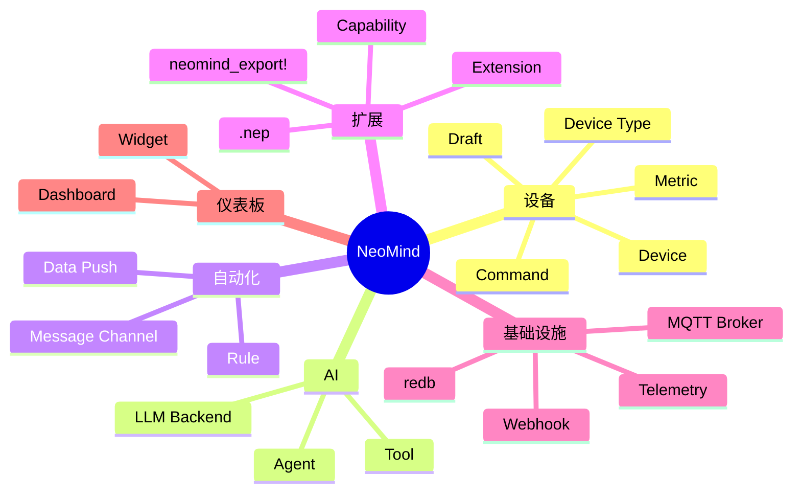
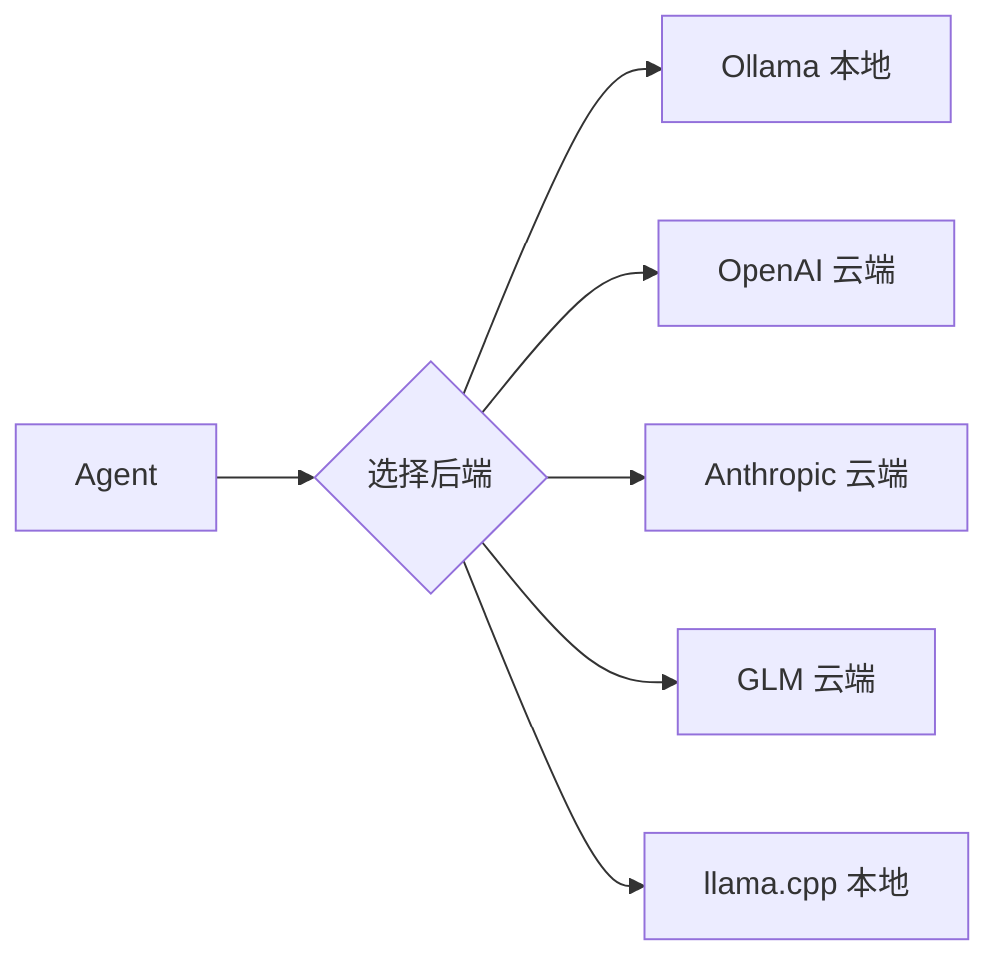
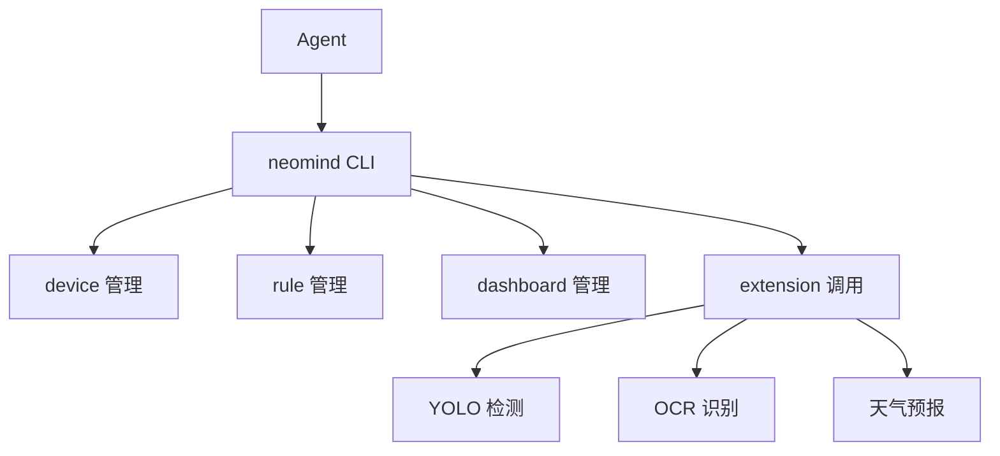
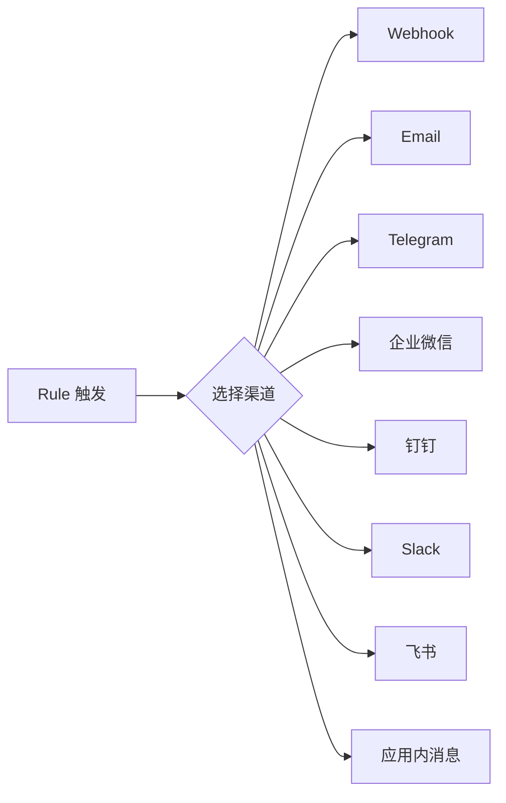
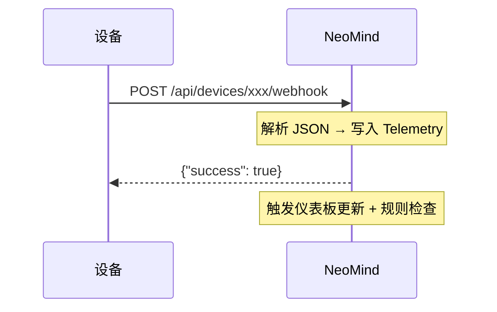
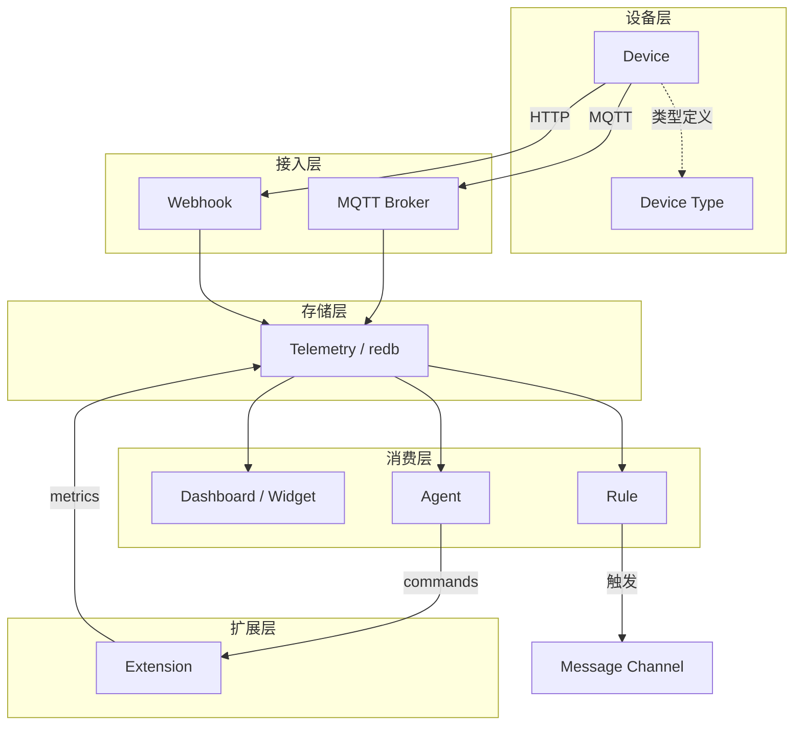

# 术语表

NeoMind 涉及的概念较多，本文是所有核心术语的集中定义。首次接触某个概念时可以先来这里查。

> 如果你要看系统整体架构和数据流（而非单个术语），直接跳到 [核心概念](./2-core-concepts.md)。

:::tip 怎么用这份术语表

- **初次浏览**：按下面的分类快速过一遍，建立整体印象
- **遇到陌生词**：用页面搜索（`Ctrl/Cmd + F`）直接查
- **想理解关系**：看末尾的 [概念关系图](#概念关系图)
  :::

---

## 概念分类速览



---

## 设备相关

### Device（设备）

一个已接入 NeoMind 的物理或虚拟设备。每个设备有唯一 ID、一个设备类型、一组 metrics（遥测指标）和 commands（控制命令）。

**例**：一台温湿度传感器，metrics 是 `temperature` / `humidity`，command 是 `reboot`。

:::info 设备的三个关键属性
1. **唯一 ID** — 用于在系统内引用（`sensor-01`）
2. **设备类型** — 决定有哪些 metrics / commands
3. **连接方式** — MQTT / Webhook / BLE 中的一种
:::

### Device Type（设备类型）

设备的"模板"，定义了该类设备有哪些 metrics、commands、连接参数。设备类型以 JSON 定义，存储在 [NeoMind-DeviceTypes](https://github.com/camthink-ai/NeoMind-DeviceTypes) 仓库。

创建设备时选择一个类型，NeoMind 据此生成默认的 metric / command schema。

**例**：`NE101` 是一个设备类型，定义了 `image_data`（图像帧）metric 和 `capture`（抓拍）command。

### Draft（设备草稿）

当 NeoMind 通过 MQTT 或 Webhook 自动发现一个未知设备时，不会立即创建设备，而是生成一个"草稿"。管理员审批后草稿才转为正式设备。

:::warning 为什么不自动接入？
这是安全机制——防止未授权设备自动接入你的系统。自动发现的设备只进草稿队列，你确认后才能正式上线。
:::

### Metric（遥测指标）

设备或扩展产生的时序数据点。每个 metric 有名称、数据类型（Integer / Float / String / Boolean）、可选单位。

**例**：

| Metric 名 | 数据类型 | 单位 | 含义 |
|-----------|---------|------|------|
| `temperature` | Float | °C | 温度 |
| `humidity` | Float | % | 湿度 |
| `motion` | Boolean | — | 是否检测到移动 |
| `image_data` | String | — | base64 编码的图像 |

### Command（命令）

可对设备下发的控制指令或可对扩展调用的操作。每个 command 有名称和参数 schema。

**例**：`set_temperature(target: Integer)`、`capture()`、`reboot()`。

### DataSourceId（数据源 ID）

NeoMind 中引用任意数据点的统一格式：`{type}:{id}:{field}`

| type | 含义 | 示例 |
|------|------|------|
| `device` | 设备遥测 | `device:sensor-01:temperature` |
| `extension` | 扩展指标 | `extension:weather:temp` |
| `agent` | Agent 状态 | `agent:guard:status` |

:::tip 这是你最常碰到的格式
仪表板组件配置数据源、规则引擎定义触发条件、数据推送配置目标——全部用 DataSourceId。记住 `{type}:{id}:{field}` 这个三段式就行。
:::

---

## AI 相关

### LLM Backend（LLM 后端）

NeoMind 连接的大语言模型实例。支持多种后端：**Ollama**（本地）、**OpenAI**、**Anthropic**、**GLM**、**llama.cpp** 等。可配置多个后端，按场景切换。



:::info 本地 vs 云端
- **本地（Ollama / llama.cpp）**：零延迟、数据不出局域网、离线可用，但受限于硬件算力
- **云端（OpenAI / Anthropic / GLM）**：模型更强，但需要网络、数据上云、持续计费
- 可以同时配多个，不同 Agent 用不同后端
  :::

> 详见 [配置 LLM 后端](../user-guide/2-configure-llm.md)。

### Agent（AI 智能体）

NeoMind 的核心智能单元。Agent 接收用户自然语言输入（或定时触发），通过 LLM 理解意图，调用工具（CLI 命令、设备控制、扩展命令）执行操作，并从执行结果中学习。

**两种执行模式**：

| 模式 | 触发方式 | 绑定资源 | 典型场景 |
|------|---------|---------|---------|
| **Free 模式** | 用户对话 | 无 | 自由问答、临时查询 |
| **Focused 模式** | 定时 / 事件 | 绑定设备 + 数据源 | 定期巡检、异常监控 |

:::tip Agent ≠ ChatGPT
Agent 不只是聊天——它能**执行操作**。你问"温度超 30 度通知我"，它会真正创建规则、配置通知渠道、启动监控。背后是工具调用（Tool Use）能力。
:::

> 详见 [AI Chat](../user-guide/5-ai-chat.md)。

### Tool（工具）

Agent 可调用的操作。NeoMind 的 Agent 主要通过 `neomind` CLI 命令操作设备、规则、仪表板等。工具系统自动把已安装扩展的 commands 也暴露给 LLM。



---

## 自动化相关

### Rule（规则）

事件驱动的自动化逻辑。当条件满足时自动执行动作。

NeoMind 规则用 **JSON** 定义：

```json
{
  "name": "高温告警",
  "trigger": { "trigger_type": "data_change" },
  "condition": { "condition_type": "comparison", "source": "device:sensor-01:temperature", "operator": "greater_than", "threshold": 30 },
  "actions": [ { "type": "notify", "message": "温度过高" } ]
}
```

规则由三部分组成：**触发器**（trigger，何时评估）、**条件**（condition，何时满足）、**动作**（actions，满足后做什么）。

> 详见 [自动化规则](../user-guide/7-automation-rules.md)。

### Message Channel（消息渠道）

规则触发通知时的投递通道。支持 7 种外部渠道 + 应用内消息：



> 详见 [消息通知](../user-guide/8-notifications.md)。

### Data Push（数据推送）

将遥测数据主动推送到外部系统（Webhook 或 MQTT），区别于被动查询。可配置推送频率、数据格式、目标地址。

:::tip Data Push vs Rule
- **Data Push** — 无条件推送原始数据（"每 10 秒把温度推给外部系统"）
- **Rule** — 条件触发动作（"温度超 30 度时发通知"）
  :::

---

## 扩展相关

### Extension（扩展）

通过 FFI（外部函数接口）加载到 NeoMind 的插件模块。扩展用 Rust 编写，编译为动态库（`.dylib` / `.so` / `.dll`），运行在**独立进程**中。

扩展可以：
- 提供 metrics（数据流）
- 提供 commands（可调用操作）
- 加载 ML 模型（如 YOLO 目标检测）
- 处理流式数据（如视频帧）

```mermaid
graph LR
    subgraph Main[主进程]
        ER[ExtensionRunner]
    end
    subgraph Ext1[扩展进程 1]
        Y[YOLO 检测]
    end
    subgraph Ext2[扩展进程 2]
        O[OCR 识别]
    end
    ER <-.FFI.- Y
    ER <-.FFI.- O
```

:::warning 进程隔离的意义
扩展运行在独立进程中——如果 YOLO 扩展因为模型加载失败而崩溃，**主服务不受任何影响**。其他扩展也不会被波及。这是 NeoMind 稳定性的关键设计。
:::

> 详见 [Extension SDK](../developer-guide/3-extension-sdk.md)。

### Capability（能力）

扩展启动时必须声明的能力权限。未声明的能力调用会被拒绝。体现**最小权限原则**。

| Capability | 含义 |
|------------|------|
| `network` | 出站网络访问 |
| `filesystem:read` / `filesystem:write` | 文件读写 |
| `ml-model` | 加载 / 运行 ML 模型 |
| `camera` | 访问相机 |
| `serial` | 串口访问 |

:::info 安全模型
一个天气扩展只需要 `network` 能力。如果它试图读文件，NeoMind 会直接拒绝。这样即使扩展有 bug 被攻击，影响范围也被限制在声明的权限内。
:::

### .nep

NeoMind 扩展的分发包格式。一个 `.nep` 文件是 zip 归档，包含多平台编译产物 + `metadata.json` + 可选模型文件。

用户在 Web UI 一键安装时，runner 自动选择匹配当前平台的二进制——**不需要关心目标系统是 macOS 还是 Linux，是 ARM 还是 x86**。

### neomind_export!

SDK 提供的宏，将 Rust `impl Extension` 自动导出为 FFI 入口。扩展开发者只需在代码末尾加一行：

```rust
neomind_extension_sdk::neomind_export!(MyExtension);
```

### Process Isolation（进程隔离）

扩展运行在独立进程中，而非主进程内。好处是：扩展崩溃（panic）不会拖垮主服务；扩展之间互不干扰；按 capability 授权的能力边界更清晰。

### Lazy Load（延迟加载）

ML 模型不在扩展启动时加载，而是在第一次命令调用时才载入内存。加载后常驻（直到扩展进程退出），避免每次推理重新加载。

:::tip 为什么不启动时就加载？
YOLOv8n 模型约 12MB，加载需要 1-2 秒。如果扩展启动就加载，但用户可能几小时后才用——白白占用内存。延迟加载 = **按需占用，用完常驻**。
:::

---

## 基础设施相关

### MQTT Broker

NeoMind 内置的消息代理（端口 `1883`）。设备通过 MQTT 协议连接、上报遥测、接收命令。

:::info 零依赖
无需安装外部 Broker（如 Mosquitto）——NeoMind 自带一个完整的 MQTT 实现。启动即可用，设备直连 `localhost:1883`。
:::

### Telemetry（遥测存储）

NeoMind 的时序数据库，基于 redb 实现，存储在 `data/telemetry.redb`。所有 metric 值都写入这里，仪表板和规则引擎从中读取。

### redb

NeoMind 使用的嵌入式键值存储引擎（Rust 编写）。无外部数据库依赖，数据文件直接落盘在 `data/` 目录。

:::info 为什么不用 SQLite / PostgreSQL？
redb 是纯 Rust 实现，与 NeoMind 的 Rust 技术栈完美融合——**零外部依赖、零跨语言开销、编译进同一个二进制**。对时序数据（写多读少、按时间范围查询）做了专门优化。
:::

### Webhook

一种 HTTP 回调机制。设备可通过向 NeoMind 的 webhook URL 发送 POST 请求来上报数据，无需 MQTT。也用于接收外部系统的事件推送。



---

## 仪表板相关

### Dashboard（仪表板）

由一组 Widget（组件）组成的可视化页面。支持创建多个仪表板、分享（带过期时间的公开链接）、移动端自适应。

### Widget（组件 / 部件）

仪表板上的单个可视化元素。内置类型：

| 类型 | 展示内容 | 典型场景 |
|------|---------|---------|
| **数值卡** | 单个数值 | 当前温度、湿度 |
| **折线图** | 时序趋势 | 24 小时温度变化 |
| **仪表盘** | 指针式读数 | CPU 使用率 |
| **数据表** | 多列表格 | 设备列表、历史记录 |
| **VLM 视觉** | 图像 + AI 标注 | 目标检测结果 |
| **流播放器** | 实时视频流 | 摄像头画面 |

也支持扩展提供的自定义组件。

> 详见 [使用仪表板](../user-guide/4-use-dashboard.md)。

---

## 概念关系图

这些概念如何协作？下图展示从设备到可视化的完整数据流：



---

*最后更新: 2026-06-12 · NeoMind v0.8.11*
