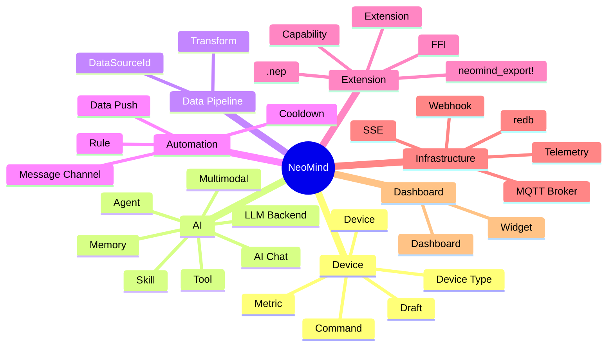
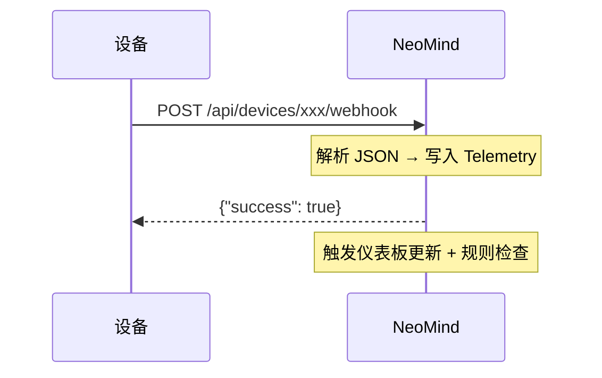

# 术语表

NeoMind 涉及的概念较多，本文是所有核心术语的集中定义。首次接触某个概念时可以先来这里查。

> 如果你要看系统整体架构和数据流（而非单个术语），直接跳到 [核心概念](./2-core-concepts.md)。

:::tip 怎么用这份术语表

- **初次浏览**：按下面的分类快速过一遍，建立整体印象
- **遇到陌生词**：用页面搜索（`Ctrl/Cmd + F`）直接查
- **想理解关系**：看末尾的 [概念关系图](#概念关系图)
  :::

---

## 概念分类速览



---

## 设备相关

### Device（设备）

一个已接入 NeoMind 的物理或虚拟设备。每个设备有唯一 ID、一个设备类型、一组 metrics（遥测指标）和 commands（控制命令）。

**例**：一台温湿度传感器，metrics 是 `temperature` / `humidity`，command 是 `reboot`。

:::info 设备的三个关键属性
1. **唯一 ID** — 用于在系统内引用（`sensor-01`）
2. **设备类型** — 决定有哪些 metrics / commands
3. **连接方式** — MQTT / Webhook / BLE 中的一种
:::

### Device Type（设备类型）

某一类设备的"模板"，定义了该类设备有哪些 metrics、commands、连接参数。设备类型以 JSON 定义，存储在 [NeoMind-DeviceTypes](https://github.com/camthink-ai/NeoMind-DeviceTypes) 仓库。

创建设备时选择一个类型，NeoMind 据此生成默认的 metric / command schema。

**示例** — 温湿度传感器类型：

```json
{
  "device_type": "dht22_sensor",
  "name": "Temperature & Humidity Sensor",
  "description": "DHT22-based ambient environment sensor",
  "categories": ["sensor", "environment"],
  "metrics": [
    { "name": "temperature", "display_name": "Temperature", "data_type": "float", "unit": "°C", "min": -40, "max": 80 },
    { "name": "humidity", "display_name": "Humidity", "data_type": "float", "unit": "%", "min": 0, "max": 100 }
  ],
  "commands": [
    { "name": "reboot", "display_name": "Reboot", "description": "Restart the sensor" }
  ]
}
```

:::info Device Type 的业务价值
Device Type 是硬件与平台之间的**契约**，在业务系统中承担三个角色：

1. **规范某一类设备** — 所有 DHT22 传感器共享同一个类型定义，无论来自哪个厂商。100 台同类型设备遵循相同的 metric / command schema。
2. **为 AI 提供设备标准** — Agent 读取 metric 定义来理解设备能产生什么数据、支持什么操作。你问"温度多少？"，Agent 知道该查哪个 metric，无需解析原始数据包。
3. **驱动下游配置** — 仪表板组件、自动化规则、数据推送配置都通过名称引用 metric，这些名称来自 Device Type 定义。
   :::

### Draft（设备草稿）

当 NeoMind 通过 MQTT 或 Webhook 自动发现一个未知设备时，不会立即创建设备，而是生成一个"草稿"。管理员审批后草稿才转为正式设备。

:::warning 为什么不自动接入？
这是安全机制——防止未授权设备自动接入你的系统。自动发现的设备只进草稿队列，你确认后才能正式上线。
:::

### Metric（遥测指标）

设备或扩展产生的时序数据点。每个 metric 有名称、数据类型（Integer / Float / String / Boolean）、可选单位。

**例**：

| Metric 名 | 数据类型 | 单位 | 含义 |
|-----------|---------|------|------|
| `temperature` | Float | °C | 温度 |
| `humidity` | Float | % | 湿度 |
| `motion` | Boolean | — | 是否检测到移动 |
| `image_data` | String | — | base64 编码的图像 |

### Command（命令）

可对设备下发的控制指令或可对扩展调用的操作。每个 command 有名称和参数 schema。

**例**：`set_temperature(target: Integer)`、`capture()`、`reboot()`。

### DataSourceId（数据源 ID）

NeoMind 中引用任意数据点的统一格式：`{type}:{id}:{field}`

| type | 含义 | 示例 |
|------|------|------|
| `device` | 设备遥测 | `device:sensor-01:temperature` |
| `extension` | 扩展指标 | `extension:weather:temp` |
| `agent` | Agent 状态 | `agent:guard:status` |

:::tip 这是你最常碰到的格式
仪表板组件配置数据源、规则引擎定义触发条件、数据推送配置目标——全部用 DataSourceId。记住 `{type}:{id}:{field}` 这个三段式就行。
:::

---

## AI 相关

### LLM Backend（LLM 后端）

NeoMind 连接的大语言模型实例。支持多种后端：**Ollama**（本地）、**OpenAI**、**Anthropic**、**GLM**、**llama.cpp** 等。可配置多个后端，按场景切换。

<div style={{display: 'flex', gap: '8px', flexWrap: 'wrap', alignItems: 'center', margin: '16px 0'}}>
  <span style={{background: '#e1d5e7', border: '1px solid #9673a6', borderRadius: '20px', padding: '6px 16px', fontSize: '0.9em', fontWeight: 600}}>Agent</span>
  <span style={{fontSize: '1.2em', color: '#999'}}>→</span>
  <span style={{background: '#d5e8d4', border: '1px solid #82b366', borderRadius: '20px', padding: '6px 16px', fontSize: '0.9em'}}>Ollama <em>(本地)</em></span>
  <span style={{background: '#d5e8d4', border: '1px solid #82b366', borderRadius: '20px', padding: '6px 16px', fontSize: '0.9em'}}>llama.cpp <em>(本地)</em></span>
  <span style={{background: '#dae8fc', border: '1px solid #6c8ebf', borderRadius: '20px', padding: '6px 16px', fontSize: '0.9em'}}>OpenAI</span>
  <span style={{background: '#dae8fc', border: '1px solid #6c8ebf', borderRadius: '20px', padding: '6px 16px', fontSize: '0.9em'}}>Anthropic</span>
  <span style={{background: '#dae8fc', border: '1px solid #6c8ebf', borderRadius: '20px', padding: '6px 16px', fontSize: '0.9em'}}>GLM</span>
</div>

:::info 本地 vs 云端
- **本地（Ollama / llama.cpp）**：零延迟、数据不出局域网、离线可用，但受限于硬件算力
- **云端（OpenAI / Anthropic / GLM）**：模型更强，但需要网络、数据上云、持续计费
- 可以同时配多个，不同 Agent 用不同后端
  :::

> 详见 [配置 LLM 后端](../user-guide/2-configure-llm.md)。

### Agent（AI 智能体）

NeoMind 的核心智能单元。Agent 接收自然语言输入（或定时触发），通过 LLM 理解意图，调用工具（CLI 命令、设备控制、扩展命令）执行操作，并从执行结果中学习。

:::tip Agent ≠ ChatGPT
Agent 不只是聊天——它能**执行操作**。你问"温度超 30 度通知我"，它会真正创建规则、配置通知渠道、启动监控。背后是工具调用（Tool Use）能力。
:::

> 详见 [AI Chat](../user-guide/5-ai-chat.md) 和 [AI Agent](../user-guide/6-ai-agent.md)。

### AI Chat（AI 对话）

Agent 的**交互模式**——用户在对话框输入消息，AI 实时调用工具并流式回复。支持上传图片做多模态分析。使用对话历史 + MemorySnapshot 记忆。

### Memory（记忆）

跨执行/会话积累的经验，按模式分两套：

| 模式 | 记忆结构 | 存储 | 作用 |
|------|---------|------|------|
| **AI Chat** | 对话历史 + MemorySnapshot | `user.md` + `knowledge.md` | 跨会话记住用户偏好与关键事实 |
| **AI Agent** | Journal + Knowledge Files | redb + Markdown 文件 | 跨执行积累经验：成功/失败、学到的规律、设备身份、任务使命 |

**Journal** 是每次 Agent 执行的结果摘要（做了什么、成功/失败、学到了什么）。**Knowledge Files** 是长期知识（设备身份、任务使命、资源清单、巡检规律）。

### Think-Act-Observe（思考-执行-观察循环）

Agent 的核心执行模式：LLM 分析当前状态（**思考**）→ 调用工具（**执行**）→ 读取结果（**观察**）→ 循环直到任务完成或达到轮数上限（默认 30 轮，全局超时 5 分钟）。

### Skill（技能）

为 Agent 提供场景化指导的 Markdown 文件（存储在 `data/skills/`）。Skill 定义了特定场景下的操作步骤、常见错误和最佳实践，LLM 在执行时自动参考相关 Skill。

### Multimodal（多模态）

LLM 处理图像输入的能力。取决于模型——Ollama 拉取视觉模型（如 `qwen3.5:4b-vl` / `llava`）或使用云端视觉模型（`gpt-4o` / `claude-3-5-sonnet` / `gemini-1.5-flash`）后，AI Chat 支持上传图片进行视觉分析。

### Tool（工具）

Agent 可调用的操作。NeoMind 的 Agent 主要通过 `neomind` CLI 命令操作设备、规则、仪表板等。工具系统自动把已安装扩展的 commands 也暴露给 LLM。

```
Agent
  └── neomind CLI
        ├── device 管理
        ├── rule 管理
        ├── dashboard 管理
        └── extension 调用
              ├── YOLO 检测
              ├── OCR 识别
              └── 天气预报
```

---

## 数据处理相关

### Transform（数据转换）

在数据写入 Telemetry 后自动执行的 JavaScript 管道，将原始指标转换为更有意义的派生指标。支持三级作用域：**Global**（所有设备）、**Device Type**（一类设备）、**Device**（单个设备）。

**例**：原始数据 `{temperature: 25.6, humidity: 60}` → Transform 计算出 `dew_point: 16.7°C`（露点）和 `comfort: "humid"`（舒适度）。

派生指标以 `transform:{output_prefix}:{field}` 格式写入 Telemetry，和原始数据一样被仪表板、规则、Agent 消费。

> 详见 [核心概念 — Transform](./2-core-concepts.md#数据转换transform) 和 [自动化规则](../user-guide/7-automation-rules.md)。

---

## 自动化相关

### Rule（规则）

事件驱动的自动化逻辑。当条件满足时自动执行动作。

NeoMind 规则用 **JSON** 定义：

```json
{
  "name": "高温告警",
  "trigger": { "trigger_type": "data_change" },
  "condition": { "condition_type": "comparison", "source": "device:sensor-01:temperature", "operator": "greater_than", "threshold": 30 },
  "actions": [ { "type": "notify", "message": "温度过高" } ],
  "cooldown": 60
}
```

规则由三部分组成：**触发器**（trigger，何时评估）、**条件**（condition，何时满足）、**动作**（actions，满足后做什么）。

> 详见 [自动化规则](../user-guide/7-automation-rules.md)。

### Cooldown（冷却时间）

规则触发后的抑制窗口（单位：秒）。在冷却时间内，即使条件再次满足也不会重复触发，防止告警风暴。例如 `cooldown: 60` 表示触发后 60 秒内不再重复。

### Rule Engine（规则引擎）

NeoMind 内置的自动化评估引擎。在数据写入 Telemetry 时**立即**评估绑定的规则条件（零延迟，无需轮询）。匹配后执行动作（通知、执行命令、触发 Agent）。

### Message Channel（消息渠道）

规则触发通知时的投递通道。支持 7 种外部渠道 + 应用内消息：

<div style={{display: 'flex', gap: '8px', flexWrap: 'wrap', alignItems: 'center', margin: '16px 0'}}>
  <span style={{background: '#ffe6cc', border: '1px solid #d79b00', borderRadius: '20px', padding: '6px 16px', fontSize: '0.9em', fontWeight: 600}}>Rule 触发</span>
  <span style={{fontSize: '1.2em', color: '#999'}}>→</span>
  <span style={{background: '#dae8fc', border: '1px solid #6c8ebf', borderRadius: '20px', padding: '6px 16px', fontSize: '0.9em'}}>Webhook</span>
  <span style={{background: '#dae8fc', border: '1px solid #6c8ebf', borderRadius: '20px', padding: '6px 16px', fontSize: '0.9em'}}>Email</span>
  <span style={{background: '#dae8fc', border: '1px solid #6c8ebf', borderRadius: '20px', padding: '6px 16px', fontSize: '0.9em'}}>Telegram</span>
  <span style={{background: '#dae8fc', border: '1px solid #6c8ebf', borderRadius: '20px', padding: '6px 16px', fontSize: '0.9em'}}>企业微信</span>
  <span style={{background: '#dae8fc', border: '1px solid #6c8ebf', borderRadius: '20px', padding: '6px 16px', fontSize: '0.9em'}}>钉钉</span>
  <span style={{background: '#dae8fc', border: '1px solid #6c8ebf', borderRadius: '20px', padding: '6px 16px', fontSize: '0.9em'}}>Slack</span>
  <span style={{background: '#dae8fc', border: '1px solid #6c8ebf', borderRadius: '20px', padding: '6px 16px', fontSize: '0.9em'}}>飞书</span>
  <span style={{background: '#e1d5e7', border: '1px solid #9673a6', borderRadius: '20px', padding: '6px 16px', fontSize: '0.9em'}}>应用内消息</span>
</div>

> 详见 [消息通知](../user-guide/8-notifications.md)。

### Data Push（数据推送）

将遥测数据主动推送到外部系统（Webhook 或 MQTT），区别于被动查询。可配置推送频率、数据格式、目标地址。

:::tip Data Push vs Rule
- **Data Push** — 无条件推送原始数据（"每 10 秒把温度推给外部系统"）
- **Rule** — 条件触发动作（"温度超 30 度时发通知"）
  :::

---

## 扩展相关

### Extension（扩展）

通过 FFI（外部函数接口）加载到 NeoMind 的插件模块。扩展用 Rust 编写，编译为动态库（`.dylib` / `.so` / `.dll`），运行在**独立进程**中。

扩展可以：
- 提供 metrics（数据流）
- 提供 commands（可调用操作）
- 加载 ML 模型（如 YOLO 目标检测）
- 处理流式数据（如视频帧）

<div style={{display: 'flex', gap: '16px', alignItems: 'center', flexWrap: 'wrap', margin: '16px 0'}}>
  <div style={{background: '#d5e8d4', border: '2px solid #82b366', borderRadius: '8px', padding: '12px 20px', fontWeight: 'bold', color: '#1f4d1f'}}>
    ExtensionRunner<br/><span style={{fontSize: '0.8em', fontWeight: 'normal'}}>(主进程)</span>
  </div>
  <div style={{display: 'flex', flexDirection: 'column', gap: '8px'}}>
    <div style={{background: '#f5f5f5', border: '1px dashed #666', borderRadius: '6px', padding: '8px 16px', fontSize: '0.9em'}}>
      YOLO 检测 <span style={{fontSize: '0.8em', color: '#888'}}>(独立进程 · FFI)</span>
    </div>
    <div style={{background: '#f5f5f5', border: '1px dashed #666', borderRadius: '6px', padding: '8px 16px', fontSize: '0.9em'}}>
      OCR 识别 <span style={{fontSize: '0.8em', color: '#888'}}>(独立进程 · FFI)</span>
    </div>
  </div>
</div>

:::warning 进程隔离的意义
扩展运行在独立进程中——如果 YOLO 扩展因为模型加载失败而崩溃，**主服务不受任何影响**。其他扩展也不会被波及。这是 NeoMind 稳定性的关键设计。
:::

> 详见 [Extension SDK](../developer-guide/3-extension-sdk.md)。

### Capability（能力）

扩展启动时必须声明的能力权限。未声明的能力调用会被拒绝。体现**最小权限原则**。14 个内置能力覆盖设备读写、设备控制、存储查询、事件订阅、触发器等：

| 类别 | Capability | 含义 |
|------|-----------|------|
| 设备数据 | `device_metrics_read` / `device_metrics_write` | 读/写设备指标（含虚拟指标） |
| 设备控制 | `device_control` | 向设备下发命令 |
| 存储 | `storage_query` / `telemetry_history` / `metrics_aggregate` | 查询遥测历史与聚合 |
| 事件 | `event_publish` / `event_subscribe` | 发布/订阅系统事件 |
| 触发器 | `extension_call` / `agent_trigger` / `rule_trigger` | 调用扩展、触发 Agent/规则 |
| 设备管理 | `device_register` / `device_unregister` / `device_template_register` | 动态注册设备 |

也支持 `Custom(String)` 自定义能力。

:::info 安全模型
一个天气扩展只需要 `device_metrics_write` 能力。如果它试图控制设备，NeoMind 会直接拒绝。这样即使扩展有 bug 被攻击，影响范围也被限制在声明的权限内。
:::

### FFI（Foreign Function Interface，外部函数接口）

扩展进程与主进程之间的跨进程通信机制。所有请求和响应用 serde JSON 序列化——没有自定义二进制协议，日志可读，排查简单。这是 NeoMind 选择**进程隔离而非 WASM** 的关键原因：FFI 可以直接调用 GPU/ML 框架，而 WASM 做不到。

### .nep

NeoMind 扩展的分发包格式。一个 `.nep` 文件是 zip 归档，包含多平台编译产物 + `metadata.json` + 可选模型文件。

用户在 Web UI 一键安装时，runner 自动选择匹配当前平台的二进制——**不需要关心目标系统是 macOS 还是 Linux，是 ARM 还是 x86**。

### neomind_export!

SDK 提供的宏，将 Rust `impl Extension` 自动导出为 FFI 入口。扩展开发者只需在代码末尾加一行：

```rust
neomind_extension_sdk::neomind_export!(MyExtension);
```

### Process Isolation（进程隔离）

扩展运行在独立进程中，而非主进程内。好处是：扩展崩溃（panic）不会拖垮主服务；扩展之间互不干扰；按 capability 授权的能力边界更清晰。

### Lazy Load（延迟加载）

ML 模型不在扩展启动时加载，而是在第一次命令调用时才载入内存。加载后常驻（直到扩展进程退出），避免每次推理重新加载。

:::tip 为什么不启动时就加载？
YOLOv8n 模型约 12MB，加载需要 1-2 秒。如果扩展启动就加载，但用户可能几小时后才用——白白占用内存。延迟加载 = **按需占用，用完常驻**。
:::

---

## 基础设施相关

### MQTT Broker

NeoMind 内置的消息代理（端口 `1883`）。设备通过 MQTT 协议连接、上报遥测、接收命令。

:::info 零依赖
无需安装外部 Broker（如 Mosquitto）——NeoMind 自带一个完整的 MQTT 实现。启动即可用，设备直连 `localhost:1883`。
:::

### Telemetry（遥测存储）

NeoMind 的时序数据库，基于 redb 实现，存储在 `data/telemetry.redb`。所有 metric 值都写入这里，仪表板和规则引擎从中读取。

### redb

NeoMind 使用的嵌入式键值存储引擎（Rust 编写）。无外部数据库依赖，数据文件直接落盘在 `data/` 目录。

:::info 为什么不用 SQLite / PostgreSQL？
redb 是纯 Rust 实现，与 NeoMind 的 Rust 技术栈完美融合——**零外部依赖、零跨语言开销、编译进同一个二进制**。对时序数据（写多读少、按时间范围查询）做了专门优化。
:::

### Webhook

一种 HTTP 回调机制。设备可通过向 NeoMind 的 webhook URL 发送 POST 请求来上报数据，无需 MQTT。也用于接收外部系统的事件推送。



### SSE（Server-Sent Events）

HTTP 长连接单向推送协议。NeoMind 用 SSE 向 Web UI 实时推送设备数据更新——数据写入 Telemetry 后立即推送到已打开的仪表板，无需前端轮询。AI Chat 的流式回复也走 SSE。

---

## 仪表板相关

### Dashboard（仪表板）

由一组 Widget（组件）组成的可视化页面。支持创建多个仪表板、分享（带过期时间的公开链接）、移动端自适应。

### Widget（组件 / 部件）

仪表板上的单个可视化元素。内置类型：

| 类型 | 展示内容 | 典型场景 |
|------|---------|---------|
| **数值卡** | 单个数值 | 当前温度、湿度 |
| **折线图** | 时序趋势 | 24 小时温度变化 |
| **仪表盘** | 指针式读数 | CPU 使用率 |
| **数据表** | 多列表格 | 设备列表、历史记录 |
| **VLM 视觉** | 图像 + AI 标注 | 目标检测结果 |
| **流播放器** | 实时视频流 | 摄像头画面 |

也支持扩展提供的自定义组件。

> 详见 [使用仪表板](../user-guide/4-use-dashboard.md)。

---

## 概念关系图

这些概念如何协作？下图展示从设备到可视化的完整数据流：

<div style={{overflowX: 'auto', margin: '16px 0'}}>
  <table style={{borderCollapse: 'separate', borderSpacing: '4px', width: '100%', fontSize: '0.9em'}}>
    <thead>
      <tr>
        <th style={{background: '#f8cecc', color: '#6b1a1a', padding: '10px 12px', textAlign: 'center', borderRadius: '8px', border: '1px solid #b85450'}}>数据来源</th>
        <th style={{background: '#ffe6cc', color: '#6b3d00', padding: '10px 12px', textAlign: 'center', borderRadius: '8px', border: '1px solid #d79b00'}}>接入层</th>
        <th style={{background: '#d5e8d4', color: '#1f4d1f', padding: '10px 12px', textAlign: 'center', borderRadius: '8px', border: '2.5px solid #82b366', fontSize: '1.05em'}}>遥测存储</th>
        <th style={{background: '#dae8fc', color: '#1a3d6b', padding: '10px 12px', textAlign: 'center', borderRadius: '8px', border: '1px solid #6c8ebf'}}>消费者</th>
        <th style={{background: '#dae8fc', color: '#1a3d6b', padding: '10px 12px', textAlign: 'center', borderRadius: '8px', border: '1px solid #6c8ebf'}}>输出</th>
      </tr>
    </thead>
    <tbody>
      <tr>
        <td style={{textAlign: 'center', padding: '10px 8px'}}>
          <strong>Device</strong><br/><span style={{fontSize: '0.85em', color: '#666'}}>相机 · 传感器 · 控制器</span><br/><hr style={{border: 'none', borderTop: '1px solid #ddd', margin: '8px 0'}}/>
          <strong>Extension</strong><br/><span style={{fontSize: '0.85em', color: '#666'}}>YOLO · OCR · 桥接器</span>
        </td>
        <td style={{textAlign: 'center', padding: '10px 8px'}}>
          MQTT <code>:1883</code><br/><br/>Webhook<br/><br/>BLE
        </td>
        <td style={{textAlign: 'center', padding: '10px 8px', fontWeight: 'bold'}}>
          <strong>redb</strong><br/><code style={{fontSize: '0.85em'}}>data/telemetry.redb</code><br/><br/><span style={{fontSize: '0.8em', fontWeight: 'normal', color: '#666'}}>一次写入<br/>多路消费</span>
        </td>
        <td style={{textAlign: 'center', padding: '10px 8px'}}>
          <strong>Dashboard</strong> / Widget<br/><br/>规则引擎<br/><br/>Agent (LLM)
        </td>
        <td style={{textAlign: 'center', padding: '10px 8px'}}>
          实时界面<br/><span style={{fontSize: '0.85em', color: '#666'}}>(WebSocket 推送)</span><br/><br/>通知<br/><span style={{fontSize: '0.85em', color: '#666'}}>(7 种渠道)</span><br/><br/>AI 回答<br/><span style={{fontSize: '0.85em', color: '#666'}}>(自然语言)</span>
        </td>
      </tr>
    </tbody>
  </table>
</div>

<div style={{display: 'flex', justifyContent: 'center', gap: '4px', alignItems: 'center', fontSize: '1.5em', color: '#999', margin: '4px 0 16px'}}>
  <span>→</span><span>→</span><span>→</span><span>→</span><span>→</span>
</div>

---

*最后更新: 2026-06-15*
