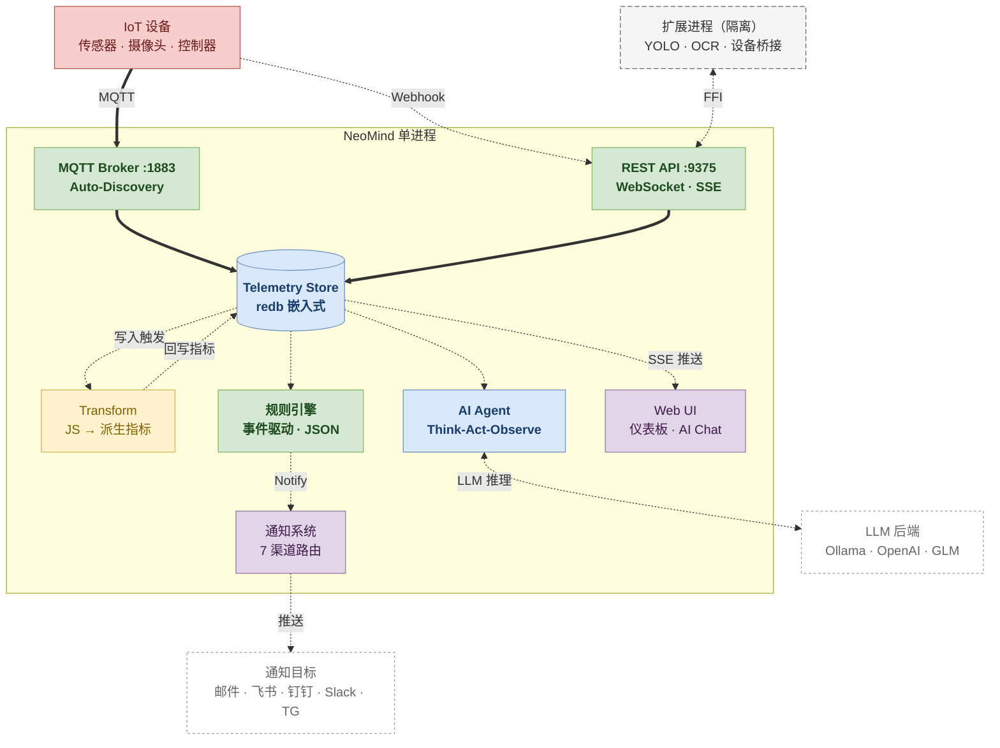
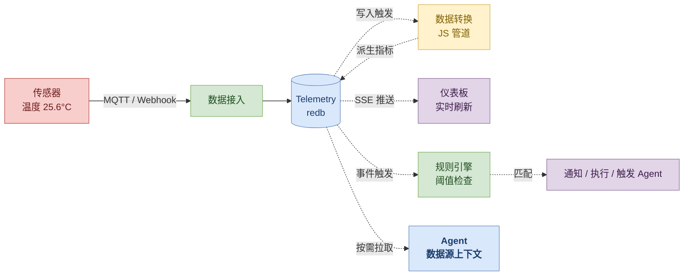
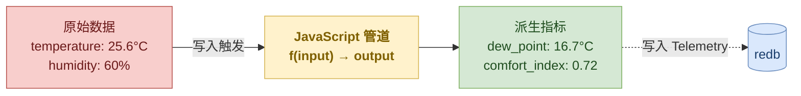
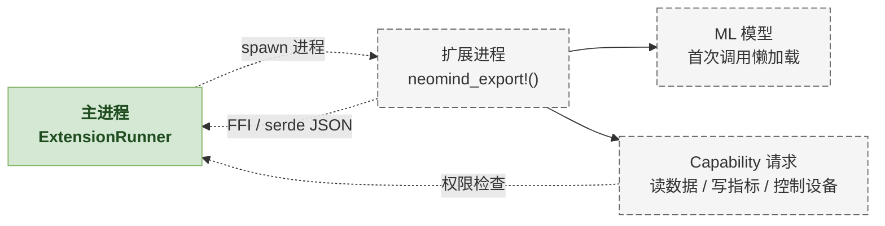
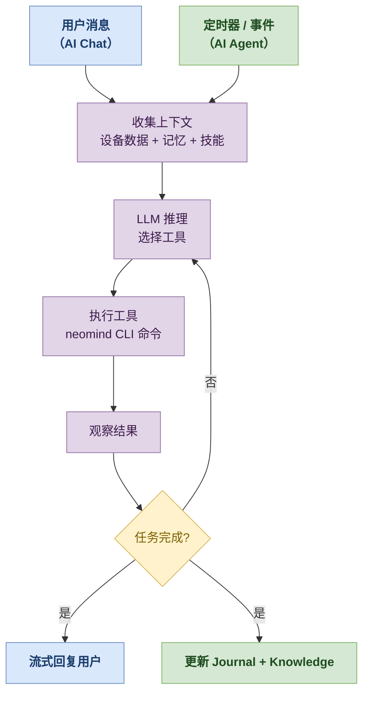

# 核心概念

本文用面向用户的视角解释 NeoMind 的系统全貌。如果你要写代码，请看 [开发者架构文档](../developer-guide/2-architecture.md)。

> 术语定义见 [术语表](./1-glossary.md)。

---

## 系统全景

NeoMind 是一个**自包含的边缘 AI 平台**——API 服务、MQTT Broker、时序存储、规则引擎全部打包在一个进程里，启动即可用，不依赖任何外部数据库或消息代理。



### 核心组件

| 组件 | 端口 | 实现方式 | 职责 |
|------|------|---------|------|
| **REST API** | 9375 | Axum + WebSocket/SSE | Web UI 托管、REST 接口、实时推送（设备数据、AI Chat） |
| **MQTT Broker** | 1883 | 内嵌 rmqtt | 设备通信枢纽，支持 MQTT Auto-Discovery 自动注册 |
| **Telemetry 存储** | — | redb 嵌入式 | 时序遥测数据，零配置持久化，支持聚合查询 |
| **数据转换 (Transform)** | — | JavaScript (Boa 引擎) 管道 | 原始数据 → 派生指标（单位换算、聚合、自定义公式），三级作用域 |
| **规则引擎** | — | 事件驱动 | 数据写入即评估（零延迟），纯 JSON 定义条件 + 动作 |
| **AI Agent** | — | LLM + CLI 工具链 | 自然语言理解、Think-Act-Observe 循环、定时/Cron/事件三种调度 |
| **通知系统** | — | 7 种渠道路由 | Webhook · 邮件 · 飞书 · 钉钉 · 企业微信 · Slack · Telegram |
| **扩展系统 (Extension)** | — | 进程隔离 + FFI | 视觉 AI (YOLO/OCR)、设备桥接 (Modbus/OPC-UA)，独立进程不影响主服务 |

:::info 为什么不用外部依赖？
所有核心组件共享同一个 redb 存储文件，数据写入一次，多路消费——不需要 PostgreSQL、Mosquitto 或 Redis。唯一可选的外部依赖是 LLM（Ollama 本地或云端 API）。扩展系统以独立进程运行，通过 FFI 与主服务通信。
:::

---

## 数据生命周期

一条数据从设备产生到被消费的完整路径：



### 两种数据接入方式

**MQTT（持续连接）** — 适合传感器、控制器等需要长连接的设备：

```
上行 topic：device/{device_type}/{device_id}/uplink
下行 topic：device/{device_type}/{device_id}/downlink
发现 topic：{discovery_prefix}/announce
```

设备发布到上行 topic 的 JSON 会被自动解析为遥测数据写入存储。支持 [MQTT Auto-Discovery](https://www.home-assistant.io/docs/mqtt/discovery/) 协议——设备发一条 announce 消息即可自动注册。

**Webhook（无状态）** — 适合一次性推送或不方便跑 MQTT 客户端的场景：

```bash
curl -X POST http://localhost:9375/api/devices/<DEVICE_ID>/webhook \
  -H 'Content-Type: application/json' \
  -d '{"temperature": 25.6, "humidity": 60}'
```

首次 webhook 推送会自动创建设备（如果设备不存在）。

### 数据结构

每条遥测数据包含：

| 字段 | 类型 | 说明 |
|------|------|------|
| `timestamp` | Unix 毫秒 | 数据采集时间 |
| `value` | JSON Value | 数值 / 字符串 / 布尔 / JSON 对象 |
| `quality` | float (0-1) | 可选的数据质量标记 |
| `metadata` | JSON | 可选的附加元数据 |

:::tip 扩展也是数据源
扩展通过 `device_metrics_write` 能力将计算结果写入 Telemetry——YOLO 检测到的人数、OCR 提取的文字、天气 API 拉取的温度，都和传感器数据一样存储和消费。这意味着扩展可以作为**设备桥接器**，连接 Modbus、OPC-UA、REST API、串口传感器等外部系统，将它们的数据作为虚拟指标注入。
:::

### 数据查询与聚合

写入的数据可通过 REST API 查询，仪表板、规则、Agent 都走同一套查询接口：

```bash
# 查询最近 1 小时的温度数据
curl "http://localhost:9375/api/telemetry?source=device:demo-sensor:temperature&start=-1h&end=now"

# 按 5 分钟时间桶聚合（avg/min/max/sum/count）
curl "http://localhost:9375/api/telemetry/aggregate?source=device:demo-sensor:temperature&interval=5m&function=avg&start=-24h"
```

| 参数 | 说明 |
|------|------|
| `source` | DataSourceId（`{type}:{id}:{field}`） |
| `start` / `end` | 时间范围，支持 Unix 毫秒或相对值（`-1h` / `now`） |
| `interval` | 聚合时间桶（如 `5m` / `1h` / `1d`） |
| `function` | 聚合函数（`avg` / `min` / `max` / `sum` / `count`） |
| `limit` | 返回点数上限，分页 |

### 数据保留与清理

Telemetry 默认**永久保留**，但可配置自动清理策略（Settings → System → Retention）：

- **按时长**：超过 N 天的数据自动删除（例如保留 90 天）
- **按容量**：存储超过阈值时删除最旧数据

策略由后台任务定期执行，不影响实时写入性能。

---

## 数据转换（Transform）

原始设备数据往往不能直接使用——需要换算单位、计算派生值、过滤噪声。NeoMind 的 **Transform** 管道在数据写入 Telemetry 后自动执行 JavaScript 代码，将原始指标转换为更有意义的派生指标。



### 三层作用域

| 作用域 | 格式 | 适用场景 |
|--------|------|---------|
| **Global** | `global` | 所有设备的数据都经过此转换 |
| **Device Type** | `device_type:TH_Sensor` | 某类设备（如所有温湿度传感器） |
| **Device** | `device:dev-001` | 单个特定设备 |

### 典型用途

```javascript
// 示例：温度单位换算 + 露点计算
// input = { temperature: 25.6, humidity: 60 }
function transform(input) {
  const temp = input.temperature;
  const humidity = input.humidity;
  // 露点温度公式
  const dewPoint = temp - (100 - humidity) / 5;
  return {
    temperature_f: temp * 9 / 5 + 32,   // 华氏温度
    dew_point: Math.round(dewPoint * 10) / 10,
    comfort: humidity < 50 ? "dry" : humidity < 70 ? "comfortable" : "humid"
  };
}
```

转换后的派生指标以 `transform:{output_prefix}:{field}` 格式写入 Telemetry，和原始设备数据一样可以被仪表板、规则引擎和 Agent 消费。

> 详见 [自动化规则 — 数据转换](../user-guide/7-automation-rules.md)。

---

## 扩展模型

扩展是 NeoMind 的能力扩展机制——用 Rust 编写，运行在**独立进程**中，通过 FFI 与主进程通信。



### 四个设计原则

**1. 进程隔离** — 扩展崩溃不影响主服务

YOLO 扩展因模型加载失败 panic？主服务和其他扩展完全不受影响。ExtensionRunner 自动检测崩溃并按策略重启（连续崩溃触发熔断保护）。

**2. 能力声明（Capability）** — 启动时声明，未声明即拒绝

扩展在元数据中声明需要的 Capability，运行时由主进程逐项校验。14 种内置能力涵盖设备读写、存储查询、事件发布、Agent/规则触发等：

| 类别 | Capability | 说明 |
|------|-----------|------|
| 设备数据 | `device_metrics_read` / `device_metrics_write` | 读取/写入设备指标（含虚拟指标） |
| 设备控制 | `device_control` | 向设备下发命令 |
| 存储查询 | `storage_query` / `telemetry_history` / `metrics_aggregate` | 查询存储的遥测数据 |
| 事件 | `event_publish` / `event_subscribe` | 发布/订阅系统事件 |
| 联动 | `extension_call` / `agent_trigger` / `rule_trigger` | 调用其他扩展、触发 Agent/规则 |
| 设备管理 | `device_register` / `device_unregister` / `device_template_register` | 动态注册设备 |

还支持 `Custom(String)` 自定义能力。

**3. 懒加载** — ML 模型首次调用才加载，加载后常驻

50MB 的 YOLOv8n 模型不在启动时占内存——第一次执行检测命令时才加载到内存，之后常驻供后续调用使用。

**4. 跨进程通信** — 用 serde JSON 序列化，调试友好

无需自定义二进制协议。扩展与主进程之间的所有请求和响应都是 JSON，日志可读、易于排查。

:::note 为什么不用 WASM 或 Docker？
- **vs WASM** — WASM 无法直接调用 GPU/ML 框架，而 NeoMind 扩展的核心场景是视觉推理（YOLO、OCR）
- **vs Docker** — 容器启动慢（秒级）、资源开销大，不适合"一个主进程管几十个轻量扩展"
- **进程 + FFI** 在性能、隔离性、开发体验之间取得了最佳平衡
:::

> 写扩展的完整流程见 [扩展开发实战](../developer-guide/7-extension-development.md)。

---

## Agent 模型

Agent 是 NeoMind 的"大脑"——接收自然语言指令，理解意图，通过工具调用执行操作。



### 两种交互模式

NeoMind 的 AI 共用同一个 Think-Act-Observe 循环，但有两种触发方式：

| 模式 | 触发 | 上下文记忆 | 响应方式 | 典型场景 |
|------|------|-----------|---------|---------|
| **AI Chat**（对话） | 用户输入消息 | 对话历史 + MemorySnapshot | 实时流式输出 | "查一下传感器状态"、"把这张图里的物体识别出来" |
| **AI Agent**（自主） | 定时器 / 事件 | Journal + Knowledge Files | 后台静默执行 | "每 5 分钟巡检设备"、"温度异常时立即分析" |

**AI Chat** 偏向交互——用户提问，AI 实时调用工具并流式回复，支持上传图片做多模态分析；**AI Agent** 偏向自主——按计划或事件触发，后台独立完成任务并在 Journal 记录经验。两者共享同一套工具（neomind CLI + 扩展 commands）。

### 三种调度方式（仅 AI Agent）

AI Agent 支持三种调度触发：

| 调度方式 | 触发条件 | 典型场景 |
|---------|---------|---------|
| **Interval** | 固定间隔（如每 5 分钟） | "每隔一段时间巡检设备状态" |
| **Cron** | Cron 表达式（如 `0 9 * * 1-5`） | "工作日每天早上 9 点生成日报" |
| **Event** | 数据事件触发（规则匹配/指标变化） | "温度骤升时立即分析原因" |

### CLI 优先架构

Agent 通过 `neomind` CLI 命令操作一切——管理设备、创建规则、配置仪表板、调用扩展。CLI 命令在进程内直接分发（无需启动子进程），响应延迟极低。

已安装扩展的 commands 会**自动暴露**给 LLM：

- 装了 YOLO 扩展 → Agent 自动能调用目标检测
- 装了天气扩展 → Agent 自动能查天气
- 装了 OCR 扩展 → Agent 自动能提取文字

不需要手动配置工具列表。

### 记忆系统

两种模式各有独立的记忆系统：

| 模式 | 记忆结构 | 作用 |
|------|---------|------|
| **AI Chat** | 对话历史 + MemorySnapshot（`user.md` + `knowledge.md`） | 跨会话记住用户偏好与关键事实 |
| **AI Agent** | Journal（redb）+ Knowledge Files（Markdown） | 跨执行积累经验：成功/失败、学到的规律、设备身份、任务使命、巡检模式 |

<details>
<summary>📖 深入：执行循环细节</summary>

Agent 的核心是一个 **Think-Act-Observe 循环**，最多 30 轮（可配置）：

```
1. Think  — LLM 分析当前状态（数据 + 记忆 + 上一轮结果），决定下一步
2. Act    — 调用工具（如 `neomind device list`）
3. Observe — 读取工具返回的结果
4. 重复 1-3，直到任务完成或达到轮数上限
5. Respond — 用自然语言汇报结果，更新记忆
```

**保护机制**：
- 全局超时：5 分钟（300 秒）强制终止
- 工具超时：Shell 30 秒，扩展 300 秒，HTTP 10 秒
- 并发控制：全局 10 个并行执行，每个 LLM 后端 2 个
- 上下文压缩：超过窗口大小时按优先级压缩历史消息（系统提示永不丢弃）

</details>

> 详见 [AI Chat](../user-guide/5-ai-chat.md) 和 [AI Agent](../user-guide/6-ai-agent.md)。

---

## 规则与通知

规则引擎在数据写入 Telemetry 时**立即评估**——无需轮询，零延迟触发。

### 规则结构（纯 JSON）

```json
{
  "name": "高温告警",
  "condition": {
    "source": "device:demo-sensor:temperature",
    "operator": "GreaterThan",
    "threshold": 30.0
  },
  "actions": [
    { "type": "Notify", "message": "温度超过 30°C！", "severity": "Critical" },
    { "type": "TriggerAgent", "agent_id": "analyzer" }
  ],
  "trigger": "event",
  "cooldown": 60
}
```

| 条件类型 | 说明 | 示例 |
|---------|------|------|
| **Comparison** | 单值比较 | 温度 `>` 30、状态 `=` "online" |
| **Range** | 范围判断 | 湿度在 40-60 之间 |
| **Logical** | 逻辑组合 | (温度 `>` 30) AND (湿度 `<` 50) |

### 通知渠道路由

规则的 `Notify` 动作创建一条消息，由通知系统分发到已配置的渠道：

| 渠道 | 配置方式 |
|------|---------|
| **Webhook** | HTTP POST 到指定 URL |
| **邮件** | SMTP 发送 |
| **飞书** | 机器人 Webhook |
| **钉钉** | 机器人 Webhook |
| **企业微信** | 机器人 Webhook |
| **Slack** | Incoming Webhook |
| **Telegram** | Bot API |

:::tip 默认全量分发
创建消息渠道 + 创建带 `Notify` 动作的规则 = 自动投递。默认所有渠道都收到消息。如需过滤（如"只收 Critical 级别"），可通过 Channel Filter 配置。
:::

> 详见 [自动化规则](../user-guide/7-automation-rules.md) 和 [通知](../user-guide/8-notifications.md)。

---

## 数据存储概览

NeoMind 使用嵌入式 redb 数据库，数据目录默认在 `data/`：

| 文件 | 用途 |
|------|------|
| `telemetry.redb` | 所有设备的时序遥测数据 |
| `sessions.redb` | 用户会话 |
| `devices.redb` / `dashboards.redb` / `rules.redb` / `agents.redb` | 各业务域主数据 |
| `messages.redb` | 通知投递记录 |
| `memory/` | Agent 记忆文件（Markdown） |
| `skills/` | 技能定义（YAML + Markdown） |
| `extensions/` | 扩展二进制与配置 |
| `logs/` | 运行日志 |

数据保留时间可配置（默认永久保留），老数据按策略自动清理。

> 详见 [系统要求 — 数据存储](../product-overview/4-system-requirements.md#数据存储)。

---

## 边缘优先

NeoMind 的核心理念是**边缘优先**：

| 维度 | 云端方案 | NeoMind（边缘） |
|------|---------|----------------|
| **延迟** | 100-500ms（网络往返） | `<10ms`（本地推理） |
| **隐私** | 数据离开设备 | 全程不出局域网 |
| **离线** | 断网即不可用 | 100% 离线可用（Ollama） |
| **成本** | 持续 API 计费 | 一次性硬件成本 |

:::tip 云可选，非排斥
NeoMind 也支持云端 LLM（OpenAI / Anthropic / GLM / DeepSeek 等）。核心理念不是"拒绝云端"，而是"**默认边缘、按需上云**"——本地能搞定的事不折腾网络，需要更强能力时灵活切换。
:::

---

## 下一步

| 我想... | 去哪里 |
|---------|--------|
| 动手试试 | [5 分钟快速上手](../quick-start/1-five-minute-guide.md) |
| 查术语 | [术语表](./1-glossary.md) |
| 配置 LLM | [配置 LLM 后端](../user-guide/2-configure-llm.md) |
| 接入设备 | [接入设备](../user-guide/3-onboard-device.md) |
| 看 API 文档 | [REST API 参考](../developer-guide/4-rest-api.md) |
| 写扩展 | [扩展开发实战](../developer-guide/7-extension-development.md) |
| 看实战案例 | [目标检测完整方案](../use-cases/1-object-detection.md) |

---

*最后更新: 2026-06-15*
