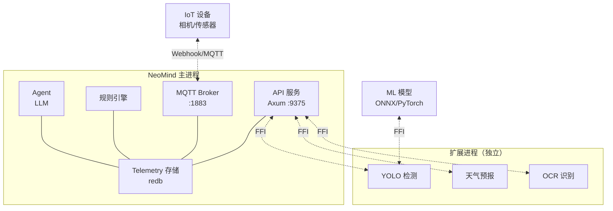
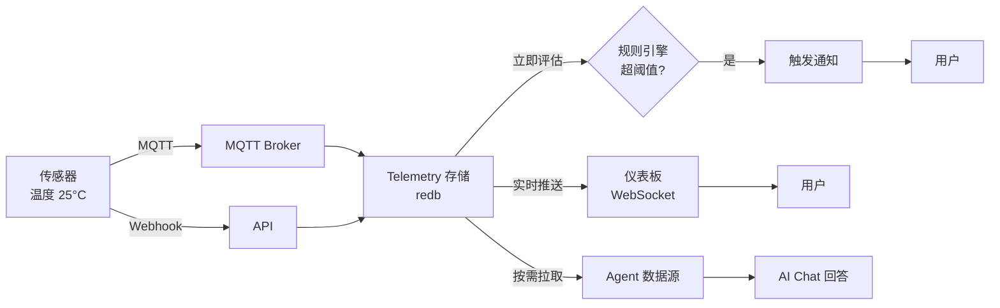
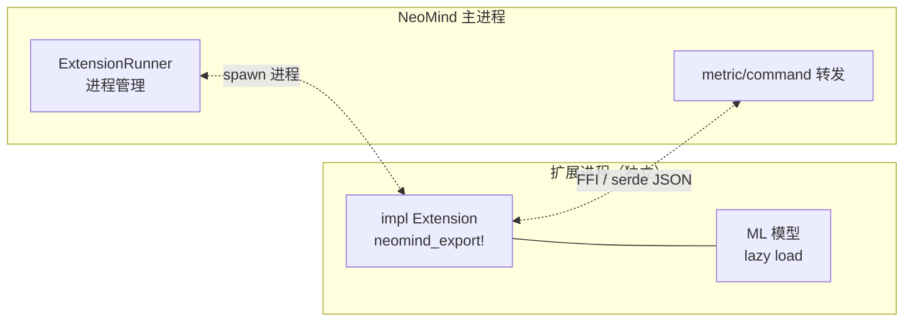
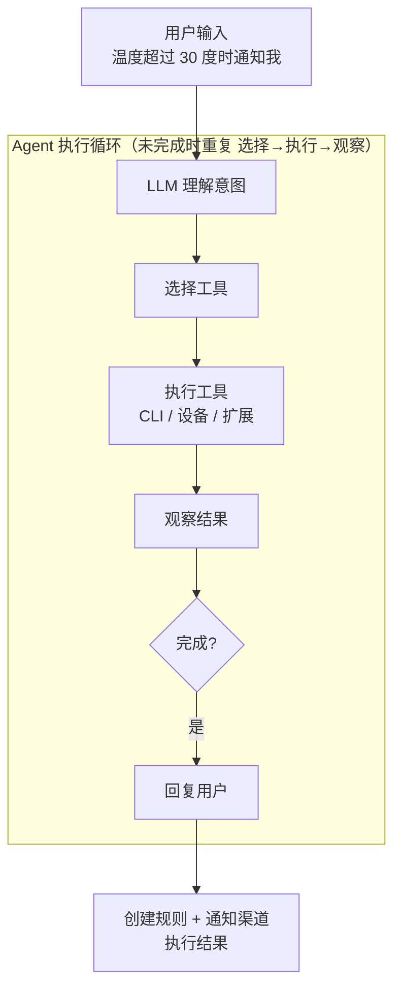

# 核心概念

本文用面向用户的视角解释 NeoMind 的系统全貌。如果你要写代码，请看 [开发者架构文档](../developer-guide/2-architecture.md)。

> 术语定义见 [术语表](./1-glossary.md)。

:::tip 阅读建议

- **想快速理解全局** → 依次看下面四个模型（系统 / 数据 / 扩展 / Agent）
- **想理解某个术语** → 跳到 [术语表](./1-glossary.md) 查询
- **想动手** → 直接去 [5 分钟快速上手](../quick-start/1-five-minute-guide.md)
  :::

---

## 系统全景

NeoMind 是一个**自包含的边缘 AI 平台**——所有核心组件打包在一个进程里，启动即可用，不依赖任何外部数据库或消息代理。



### 四个核心子系统

| 子系统 | 端口 | 职责 | 一句话 |
|--------|------|------|--------|
| **API 服务** | 9375 | Web UI 和 REST API 入口 | 所有操作经此进出 |
| **MQTT Broker** | 1883 | 设备通信枢纽 | 内置，无需额外安装 |
| **规则引擎** | — | 事件驱动自动化 | JSON 定义触发条件和动作 |
| **Agent** | — | 自然语言 + 工具调用 | 系统的"大脑" |

:::info 共享存储
所有子系统共享 **Telemetry** 存储（redb），数据文件落在 `data/` 目录。一次写入，多路消费——不需要为仪表板、规则、 Agent 分别查数据库。
:::

---

## 数据生命周期

一条数据从设备到仪表板的完整路径：



### 关键设计

:::tip 三个设计原则

1. **一次写入，多路消费** — 数据写入 Telemetry 一份，仪表板、规则引擎、Agent 各自读取，不重复存储
2. **实时推送，无需轮询** — 仪表板通过 WebSocket 被动接收更新，数据写入后毫秒级到达前端
3. **即时评估，零延迟触发** — 规则引擎在数据写入后立即检查条件，满足就触发，不依赖定时轮询
   :::

<details>
<summary>📖 深入：为什么不轮询？</summary>

传统方案是前端每隔几秒向服务器请求最新数据（轮询）。问题：

- **延迟高** — 平均延迟 = 轮询间隔 / 2（如每 10 秒轮询，平均延迟 5 秒）
- **浪费资源** — 90% 的请求返回相同数据（没有变化）
- **扩展性差** — 1000 个客户端 × 每 5 秒轮询 = 每秒 200 次无效请求

NeoMind 用 **WebSocket** 替代轮询：数据有变化才推送，零无效请求，毫秒级延迟。
</details>

---

## 扩展模型

扩展是 NeoMind 的能力扩展机制——用 Rust 写的插件，运行在**独立进程**中。



### 四个设计原则

:::tip 设计哲学

**1. 进程隔离** — 扩展崩溃不拖垮主服务

YOLO 扩展因为模型加载失败而 panic？主服务和其他扩展完全不受影响。这是 NeoMind 稳定性的基石。

**2. 最小权限** — 启动时声明 capability，未声明即拒绝

天气扩展只声明了 `network`，如果它试图读文件，直接被拒绝。即使被攻击，影响范围也被限制。

**3. 延迟加载** — ML 模型首次调用才加载，加载后常驻

12MB 的 YOLO 模型不需要在启动时就占内存——第一次用的时候才加载，之后常驻。

**4. FFI 通信** — 跨进程用 serde JSON 序列化

跨进程数据用标准的 JSON 格式，调试友好，无需自定义二进制协议。
:::

:::warning 为什么不用 WASM 或容器？
- **vs WASM** — WASM 无法直接调用 GPU/ML 框架，而 NeoMind 扩展的核心场景是 ML 推理
- **vs Docker 容器** — 容器启动慢（秒级）、资源开销大，不适合"一个主进程管几十个轻量扩展"的场景
- **进程 + FFI** 是性能、隔离性、开发体验的最佳平衡点
:::

> 写扩展的完整流程见 [扩展开发实战](../developer-guide/7-extension-development.md)。

---

## Agent 模型

Agent 是 NeoMind 的"大脑"——接收自然语言，理解意图，调用工具执行。



### 两种触发方式

| 触发方式 | 场景 | 延迟 | 典型用途 |
|---------|------|------|---------|
| **对话触发** | 用户在 AI Chat 提问 | 实时 | "demo-sensor 温度多少？" |
| **定时触发** | Agent 按 schedule 定期执行 | 按周期 | "每 5 分钟巡检设备状态" |

### 工具系统

:::info Agent 如何操作世界？
Agent 通过 `neomind` CLI 命令操作一切——管理设备、创建规则、配置仪表板、调用扩展。已安装扩展的 commands 会**自动暴露给 LLM**。

这意味着：你装了 YOLO 扩展，Agent 就自动能调用 YOLO 检测；你装了天气扩展，Agent 就自动能查天气。不需要手动配置工具列表。
:::

<details>
<summary>📖 深入：Agent 执行循环</summary>

Agent 的核心是一个 **Think-Act-Observe 循环**：

```
1. Think  — LLM 分析当前状态，决定下一步做什么
2. Act    — 调用工具（如 `neomind device list`）
3. Observe — 读取工具返回的结果
4. 重复 1-3，直到任务完成
5. Respond — 用自然语言向用户汇报结果
```

这个循环最多执行 30 轮（可配置），防止无限循环。每轮都有 token 限制和超时保护。

**例子**：用户问"温度超过 30 度通知我"
- Think: 需要先查当前温度 → Act: `neomind device get demo-sensor temperature` → Observe: 25.6°C
- Think: 需要创建规则 → Act: `neomind rule create --json '{"name":"...","condition":{...},"actions":[...]}'` → Observe: 规则已创建
- Think: 需要确认通知渠道 → Act: 检查现有渠道 → Observe: 有 email 渠道
- Respond: "已创建规则：当 demo-sensor 温度超过 30°C 时通过 email 通知你"
</details>

> 详见 [AI Chat](../user-guide/5-ai-chat.md)。

---

## 为什么不用云端？

NeoMind 的核心理念是**边缘优先**：

| 维度 | 云端方案 | NeoMind（边缘） | 差距 |
|------|---------|----------------|------|
| **延迟** | 100-500ms（网络往返） | `<10ms`（本地推理） | 50× |
| **隐私** | 数据离开设备 | 数据全程不出局域网 | 根本性差异 |
| **离线** | 断网即不可用 | 100% 离线可用（Ollama） | 根本性差异 |
| **成本** | 持续 API 计费 | 一次性硬件成本 | 长期更低 |

:::tip 云可选，非排斥
NeoMind 也支持接入云端 LLM（OpenAI / Anthropic / GLM）。核心理念不是"拒绝云端"，而是"**默认边缘、按需上云**"——本地能搞定的事不折腾网络，需要更强能力时灵活切换。
:::

---

## 下一步

| 我想... | 去哪里 |
|---------|--------|
| 动手试试 | [5 分钟快速上手](../quick-start/1-five-minute-guide.md) |
| 查术语 | [术语表](./1-glossary.md) |
| 看完整 API | [REST API 参考](../developer-guide/4-rest-api.md) |
| 写扩展 | [扩展开发实战](../developer-guide/7-extension-development.md) |
| 看实战案例 | [目标检测完整方案](../use-cases/1-object-detection.md) |

---

*最后更新: 2026-06-12 · NeoMind v0.8.11*
