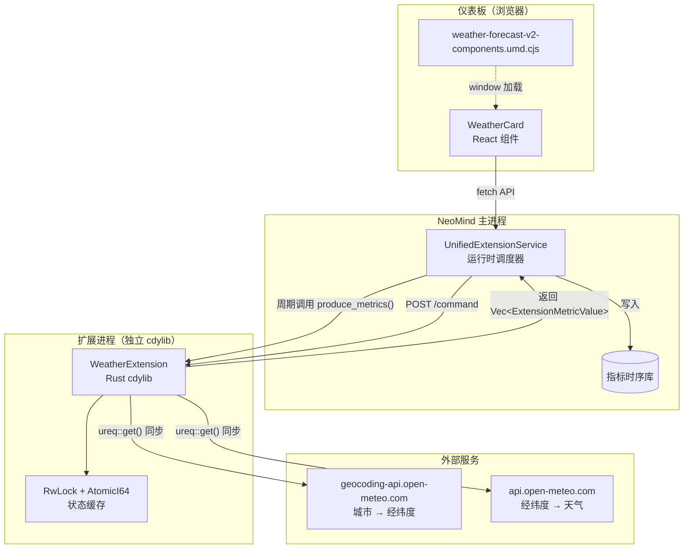
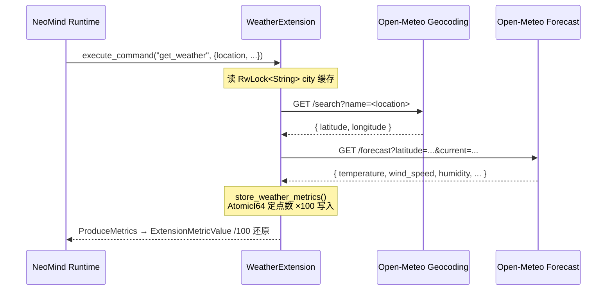

# #1 weather-forecast-v2：入门数据型扩展

## 1 案例背景

**weather-forecast-v2** 是 NeoMind 生态中最简单的「数据型扩展」——它定时从 [Open-Meteo API](https://open-meteo.com/) 拉取天气数据，将温度、湿度、风速等指标写入 NeoMind 指标系统，同时提供一个 React 卡片组件用于仪表板展示。整个扩展约 700 行 Rust + 560 行 TypeScript，没有任何 AI 推理、流式处理或协议桥接逻辑，是新手理解「一个扩展由哪些部分组成」的最短路径。

**它解决了什么问题？** NeoMind 仪表板需要展示实时环境数据（温度、湿度、风速），但这些数据来自外部 HTTP API 而非本地设备。weather-forecast-v2 充当「数据代理」——把外部 API 的数据拉取到 NeoMind 指标系统，使仪表板组件可以像消费任何本地设备指标一样消费天气数据。

**目标读者**：刚读完 [扩展 API 通用参考](../7-extension-development.md)、想动手写第一个扩展的开发者。不需要 Rust 高级知识，但要理解 trait、async/await、模块系统等基础概念。

**在生态中的位置**：weather-forecast-v2 是「数据型扩展」的范本——它不依赖任何硬件设备、不涉及 AI 模型、不桥接工业协议。后续案例中，#2（yolo-device-inference）会在它的基础上增加模型加载，#4（onvif-bridge）会增加协议栈复杂度。掌握了本案例的 8 节内容，你就掌握了所有数据型扩展的骨架。

**你将学到**：如何用 `ExtensionMetadata::new()` 构建器声明扩展元数据；如何用 `metric_float!` / `ExtensionMetricValue` 产出周期指标；为什么在动态库场景下选择同步 HTTP 客户端（`ureq`）而非 `reqwest`；如何把 React 组件通过 Vite UMD 包暴露给 NeoMind 仪表板加载器。

---

## 2 架构总览

weather-forecast-v2 由三部分组成：Rust 扩展核心（数据拉取 + 指标产出）、React 前端组件（卡片 UI）、NeoMind 运行时（加载 + 调度）。下图展示了数据流向和进程边界。



### 4 个核心抽象

| 抽象 | 位置 | 作用 |
|------|------|------|
| `Extension` trait | SDK | 扩展必须实现的接口：`metadata()` / `metrics()` / `commands()` / `execute_command()` / `produce_metrics()` / `configure()` |
| `ExtensionMetricValue` | SDK | 一个指标数据点 = `{ name, value, timestamp }`，`produce_metrics()` 返回 `Vec<ExtensionMetricValue>` |
| `ExtensionMetadata` builder | SDK | 链式构建器：`new(id, name, version).with_description(...).with_config_parameters(...)` |
| `neomind_export!` 宏 | SDK | 生成 C FFI 导出函数，让宿主进程能通过 C ABI 加载 Rust cdylib |

---

## 3 实现剖析

### 3.1 目录结构

```
extensions/weather-forecast-v2/
├── Cargo.toml          # 依赖声明 + crate 元信息
├── metadata.json       # 扩展清单（构建脚本从 Cargo.toml 自动生成）
├── src/
│   └── lib.rs          # 唯一的 Rust 源文件（~580 行，含测试）
├── frontend/
│   ├── package.json    # Vite + React 18 + TypeScript
│   ├── vite.config.ts  # UMD 打包配置（externalize React）
│   └── src/
│       └── index.tsx   # WeatherCard 组件（~560 行）
└── tests/
    └── extension_test.rs
```

单文件 Rust 设计是故意的——weather-forecast-v2 的逻辑复杂度不足以拆分模块。后续案例（如 yolo-device-inference）会拆出 `onnx_utils.rs` / `camera.rs` 等子模块。

### 3.2 ExtensionMetadata 构建器链

查看完整实现：[`src/lib.rs`](https://github.com/camthink-ai/NeoMind-Extensions/blob/main/extensions/weather-forecast-v2/src/lib.rs#L219-L273) L219-273

```rust
fn metadata(&self) -> &ExtensionMetadata {
    // why static: metadata 是只读的，全进程只需一份实例
    static META: std::sync::OnceLock<ExtensionMetadata> = std::sync::OnceLock::new();
    META.get_or_init(|| {
        ExtensionMetadata::new(
            "weather-forecast-v2",      // why kebab-case: 与目录名、metadata.json id 一致
            "Weather Forecast V2",
            "2.0.0"
        )
        .with_description("Weather forecast extension for the NeoMind isolated runtime using a sync HTTP client")
        .with_author("NeoMind Team")
        .with_config_parameters(vec![
            ParameterDefinition {
                name: "defaultCity".to_string(),
                display_name: "Default City".to_string(),
                // why options enum: 前端下拉框直接消费，不需要额外枚举定义
                options: vec!["Beijing", "Shanghai", "New York", "London", "Tokyo"]
                    .into_iter().map(String::from).collect(),
                ..Default::default()
            },
            // ... refreshInterval / unit 参数省略，见源码 L247-270
        ])
    })
}
```

**为什么用 `OnceLock` 而非 `lazy_static!`？** `OnceLock` 是 Rust 1.70 标准库引入的，不需要额外依赖。metadata 在第一次调用 `metadata()` 时构建，之后所有调用返回同一引用——这对 FFI 边界很重要，因为宿主进程会频繁查询 metadata。

### 3.3 指标产出：AtomicI64 + 定点小数

查看完整实现：[`src/lib.rs`](https://github.com/camthink-ai/NeoMind-Extensions/blob/main/extensions/weather-forecast-v2/src/lib.rs#L80-L92) L80-92（字段定义）、[L119-129](https://github.com/camthink-ai/NeoMind-Extensions/blob/main/extensions/weather-forecast-v2/src/lib.rs#L119-L129)（存储）、[L466-522](https://github.com/camthink-ai/NeoMind-Extensions/blob/main/extensions/weather-forecast-v2/src/lib.rs#L466-L522)（产出）

```rust
pub struct WeatherExtension {
    // why RwLock for city: 城市名需要读写（configure 改写），但读远多于写
    default_city: std::sync::RwLock<String>,
    // why AtomicI64 for metrics: 指标值需要高频读（produce_metrics）+ 高频写（store_weather_metrics）
    // why定点存储 ×100: AtomicI64 不支持 f64，用 ×100 保留两位小数精度
    last_temperature_c: AtomicI64,      // 实际值 = stored / 100.0
    last_humidity_percent: AtomicI64,   // 整数，不需要缩放
    request_count: AtomicI64,
    has_data: AtomicBool,               // why flag: 首次请求前 has_data=false，produce_metrics 只返回 request_count
}
```

```rust
// 存储时乘 100 转定点
fn store_weather_metrics(&self, weather: &WeatherResult) {
    self.last_temperature_c.store(
        (weather.temperature_c * 100.0) as i64, Ordering::SeqCst);
    // ... 其他字段类似
}

// 产出时除 100 还原浮点
fn produce_metrics(&self) -> Result<Vec<ExtensionMetricValue>> {
    let mut metrics = Vec::with_capacity(9);
    metrics.push(ExtensionMetricValue {
        name: "temperature_c".to_string(),
        value: ParamMetricValue::Float(
            self.last_temperature_c.load(Ordering::SeqCst) as f64 / 100.0),
        timestamp: now,
    });
    // ... has_data=false 时只返回 request_count
    Ok(metrics)
}
```

**为什么不用 `Mutex<WeatherResult>`？** 因为 `produce_metrics()` 是同步方法，会被运行时周期性高频调用。如果用 `Mutex`，每次读取都要获取锁，在高并发指标采集场景下会造成锁争用。`AtomicI64` 的 `load` 是无锁操作，性能开销最小。

### 3.4 HTTP 客户端：ureq 同步

查看完整实现：[`src/lib.rs`](https://github.com/camthink-ai/NeoMind-Extensions/blob/main/extensions/weather-forecast-v2/src/lib.rs#L132-L167) L132-167

```rust
fn geocode_sync(&self, city: &str) -> std::result::Result<GeoLocation, String> {
    let encoded_city = urlencoding::encode(city);
    let url = format!(
        "https://geocoding-api.open-meteo.com/v1/search?name={}&count=1&language=en&format=json",
        encoded_city
    );
    // why ureq not reqwest: cdylib 内部不能启动 Tokio runtime（会与宿主冲突）
    let response: serde_json::Value = ureq::get(&url)
        .timeout(std::time::Duration::from_secs(30))
        .call()
        .map_err(|e| format!("HTTP error: {}", e))?
        .into_json()
        .map_err(|e| format!("JSON error: {}", e))?;
    // ...
}
```

`Cargo.toml` 第 21 行有明确注释：`# Use sync HTTP client to avoid Tokio runtime issues in dynamic libraries`。这是整个案例最关键的设计决策，详见 4.1。

### 3.5 命令流时序：get_weather 端到端调用链

下方的时序图展示了 `get_weather` 命令从运行时调度到指标产出的完整调用链，标注了缓存读取（RwLock）、两次外部 HTTP 请求（Geocoding → Forecast）、以及定点数编码（×100 / ÷100）发生的时机。这是贡献者修改本扩展时需要理解的最小行为单元——尤其是缓存命中/未命中的分支位置和定点编码的边界。



### 3.6 前端入口：Vite UMD 包

查看完整实现：[`frontend/src/index.tsx`](https://github.com/camthink-ai/NeoMind-Extensions/blob/main/extensions/weather-forecast-v2/frontend/src/index.tsx#L425-L565) L425-565

`WeatherCard` 组件通过 `forwardRef` 暴露，Vite 构建为 UMD 包（`weather-forecast-v2-components.umd.cjs`）。`metadata.json` 的 `frontend` 字段声明入口：

```json
{
  "frontend": {
    "components": ["WeatherCard"],
    "entrypoint": "weather-forecast-v2-components.umd.cjs"
  }
}
```

前端通过 `fetch('/api/extensions/weather-forecast-v2/command')` 调用后端命令，带 3 次重试和初始化错误检测——这保证了扩展加载延迟时 UI 不会直接报错。

---

## 4 设计权衡

### 4.1 同步 HTTP 客户端（ureq）vs 异步（reqwest）

**决策**：使用 `ureq 2.x`（同步阻塞 HTTP 客户端）。

**被否决的方案**：
- **A. `reqwest` 异步客户端** → 否决原因：`reqwest` 依赖 Tokio runtime，而 NeoMind 扩展以 `.dylib`/`.so`/`.dll` 形式被宿主进程动态加载。在动态库内部启动 Tokio runtime 会与宿主进程的运行时产生冲突（宿主可能已经有自己的 runtime），导致 panic 或 undefined behavior。`Cargo.toml` 第 21 行的注释明确记录了这一点。
- **B. 原始 `hyper` + 手动线程池** → 否决原因：过于底层，HTTP/JSON 解析、连接池、超时控制都需要手写，维护成本远超收益。weather-forecast-v2 的 HTTP 调用量极小（每次命令一次 geocoding + 一次 weather fetch），不需要异步并发。

**权衡代价**：同步调用会阻塞调用线程。`execute_command` 是 async 方法，但内部的 `get_weather_sync` 是同步阻塞的——调用期间该 task 无法让出控制权。**这是可接受的**，因为天气 API 响应通常 &lt;2s，而 NeoMind 的命令超时默认 30s。

量化阻塞影响：典型负载（1 次请求 / 30s 采集周期）下，Open-Meteo 的 200–500ms 响应仅占扩展线程时序的 &lt;2%。即使未来支持多城市并行拉取，受益于异步并发的也只是少数高并发场景，而 SDK 当前同步的 `execute_command` 契约让异步化收益被抹平——一旦宿主以同步方式调用 `produce_metrics()`，再快的 HTTP 客户端也无法缩短整体调用链。

### 4.2 RwLock 包装 default_city vs Mutex vs AtomicPtr

**决策**：`default_city: std::sync::RwLock<String>`。

**被否决的方案**：
- **A. `Mutex<String>`** → 否决原因：`produce_metrics()` 虽然不直接读 `default_city`，但 `refresh` 命令会读它。如果 `configure` 正在写而 `refresh` 正在读，`Mutex` 会让读操作也阻塞。`RwLock` 允许多个读操作并发。
- **B. `Arc<AtomicPtr<str>>`** → 否决原因：字符串不是定长类型，无法用原子操作直接交换。需要 `Box::leak` 或类似技巧，引入 unsafe 代码，违反 [附录 7.1](./appendix-standards.md#71-unsafe-rust) 的「尽量避免 unsafe」原则。
- **C. 每次创建新的 `String`（不可变设计）** → 否决原因：需要把整个 `WeatherExtension` 放在 `Arc<Mutex<>>` 或 `Arc<RwLock<>>` 里，改变所有方法的签名，侵入性太大。

**权衡代价**：`RwLock` 在 Linux 上比 `Mutex` 略慢（内核态开销），但在 weather-forecast-v2 的负载下（每 5 分钟一次写），差异可忽略。读写比大致为 N:1——每次 `produce_metrics()` 都会间接读取与城市相关的派生数据（每 30s 一次），而用户触发的 `get_weather` 命令才是写者。默认配置下读写比约为 30:1，正是 `RwLock` 优于 `Mutex` 的典型区间。若未来引入「城市热切换」类高频写场景（如跟随定位自动切换），应重新评估是否改用 `ArcSwap<String>` 等无锁结构。

### 4.3 指标命名：`<物理量>_<单位>` 后缀

**决策**：所有指标名包含单位后缀，如 `temperature_c`、`wind_speed_kmph`、`pressure_hpa`。

**被否决的方案**：
- **A. 不含单位：`temperature`、`wind_speed`、`pressure`** → 否决原因：NeoMind 指标系统是全局共享的，多个扩展可能产出同名指标。如果 weather-forecast-v2 输出 `temperature`，另一个扩展（如温湿度传感器）也输出 `temperature`，查询时会冲突。加单位后缀让指标名自带歧义消除。
- **B. 扩展前缀：`weather_temperature`** → 否决原因：NeoMind 指标系统已经有 `device_id` 维度做命名空间隔离，不需要在指标名里重复扩展名。单位后缀比扩展前缀更有信息量——用户看到 `temperature_c` 就知道单位是摄氏度。
- **C. 点号分隔：`temperature.celsius`** → 否决原因：Prometheus 风格的点号在 NeoMind 指标查询语法中会与字段路径冲突（`device.metrics.temperature.celsius` 被解析为嵌套字段）。下划线更安全。

**权衡代价**：指标名较长（`wind_speed_kmph` vs `wind_speed`），但这是可读性和唯一性之间的合理折衷。扩展性上：`weather_` 前缀模式可防止未来若新增 `weather_alerts` 扩展时与 `temperature` 等同名指标发生碰撞；单位后缀（`_celsius`、`_kmh`）则让规则引擎无需查表即可做单位感知的阈值判断（如 `temperature_c > 35` 自动等价于「摄氏 35 度告警」）。这一约定也是仪表板 i18n 数字格式化的隐式契约——前端可依据后缀选择 ℃/℉ 转换策略。

---

## 5 技术栈拆解

| 组件 | 选型 | 为什么选它而非替代品 |
|------|------|---------------------|
| Rust SDK | `neomind-extension-sdk`（workspace dep） | 官方 SDK，提供 `Extension` trait + FFI 导出宏。替代品是手写 FFI，但那样每个扩展都要重复数百行样板代码 |
| HTTP 客户端 | `ureq 2.x` + `json` feature | 同步、轻量、无 runtime 依赖。替代品 `reqwest` 会拉入整个 Tokio（见 4.1） |
| async trait | `async-trait 0.1` | SDK 的 `Extension` trait 用了 async fn，Rust 1.75 前需要此 crate。未来 Rust 原生 async trait 稳定后可移除 |
| 时间处理 | `chrono 0.4` | `Utc::now().timestamp_millis()` 生成指标时间戳。替代品 `time` crate API 更现代但生态兼容性不如 chrono |
| Tokio | `1` + `rt` + `sync` features | 仅用于 SDK FFI 宏的 RwLock wrapper，不启动 runtime。替代品是 `parking_lot`，但 SDK 内部依赖 tokio::sync::RwLock |
| 前端框架 | React 18 + TypeScript 5 | NeoMind 仪表板标准技术栈。peerDependencies 声明 React ≥18，Host 提供运行时 |
| 前端构建 | Vite 5（UMD 模式） | 快速构建 + UMD 格式兼容 NeoMind 加载器。替代品 webpack 配置复杂度高 3 倍 |

---

## 6 标准落地

### 6.1 metadata.json 字段映射

对照 [附录 1](./appendix-standards.md#1-metadatajson--manifestjson-schema)，逐字段检查 weather-forecast-v2 的 `metadata.json`：

| 字段 | 值 | 附录章节 | 备注 |
|------|----|---------|------|
| `id` | `"weather-forecast-v2"` | [1.1](./appendix-standards.md#11-基础信息) | kebab-case，与目录名一致 |
| `name` | `"weather forecast"` | [1.1](./appendix-standards.md#11-基础信息) | 小写展示名 |
| `version` | `"2.7.6"` | [1.1](./appendix-standards.md#11-基础信息) | 从 Cargo.toml 自动读取 |
| `type` | `"native"` | [1.2](./appendix-standards.md#12-类型与分类) | Rust cdylib |
| `builds` | 5 个 target | [1.3](./appendix-standards.md#13-构建产物扩展独有) | 见 6.3 |
| `frontend` | `{ components, entrypoint }` | [1.4](./appendix-standards.md#14-前端声明扩展独有) | UMD 入口 |

### 6.2 Capability 声明与反向示例

weather-forecast-v2 的 `src/lib.rs` 中**没有**显式调用 `CapabilityContext::invoke_capability()`——它只通过 `produce_metrics()` 返回指标值，由运行时自动写入指标库。但如果它需要**直接写入设备指标**（如把温度写入某个虚拟设备），就必须声明 `device_metrics_write` capability。

**反向示例**：如果 weather-forecast-v2 想直接写虚拟设备指标但忘记在 metadata 中声明 `device_metrics_write`：

```rust
// ❌ 错误：未声明 capability 直接调用
ctx.invoke_capability("device_metrics_write", &json!({
    "device_id": "weather-station-1",
    "metric": "temperature",
    "value": 25.5
})).await?;
// 后果：运行时 panic（非降级），扩展进程崩溃
// 详见附录 7.2 Capability 显式申请
```

正确做法是在 `metadata.json` 中声明所需 capability（当前 weather-forecast-v2 不需要，所以没有此字段）。

### 6.3 版本号三段一致性

验证 weather-forecast-v2 的版本号在所有位置一致：

| 位置 | 值 | 一致？ |
|------|----|--------|
| `Cargo.toml` → `version` | `"2.7.6"` | 基准 |
| `metadata.json` → `version` | `"2.7.6"` | 一致（构建脚本自动同步） |
| `metadata.json` → `builds` URL | `v2.7.6` | 一确 |

注意：`src/lib.rs` 中 `ExtensionMetadata::new()` 传入的版本是 `"2.0.0"`——这是**运行时 API 版本**（SDK ABI 版本），与发布版本 `2.7.6` 不同。这是设计如此，不是 bug。

### 6.4 跨平台构建

`metadata.json` 的 `builds` 字段列出 5 个 target，覆盖 [附录 4](./appendix-standards.md#4-跨平台构建目标矩阵) 的完整矩阵：

```json
"builds": {
    "darwin-aarch64":  { "...weather-forecast-v2-2.7.6-darwin_aarch64.nep" },
    "darwin-x86_64":   { "...weather-forecast-v2-2.7.6-darwin_x86_64.nep" },
    "linux-x86_64":    { "...weather-forecast-v2-2.7.6-linux_amd64.nep" },
    "linux-aarch64":   { "...weather-forecast-v2-2.7.6-linux_arm64.nep" },
    "windows-x86_64":  { "...weather-forecast-v2-2.7.6-windows_amd64.nep" }
}
```

weather-forecast-v2 是纯 Rust + HTTP，没有 C 依赖，5 个 target 都能直接 `cargo build` 产出。对比 yolo-device-inference（需要 ONNX Runtime C 库），交叉编译难度低很多。

---

## 7 常见坑与最佳实践

### 7.1 工程演进故事：从 inline semver 到 crates.io SDK 隔离

**来源提交**：[`f1ea628`](https://github.com/camthink-ai/NeoMind-Extensions/commit/f1ea628) — `refactor: use crates.io SDK for ABI isolation`

**症状**：早期 weather-forecast-v2 使用 `semver::Version::parse("2.0.0").unwrap()` 解析版本号。当 SDK 内部类型从 `semver::Version` 改为 `String` 时，所有扩展的 `.unwrap()` 在非 semver 格式的版本字符串上 panic。

**根因**：扩展直接依赖 SDK 的 git 仓库（`neomind-extension-sdk = { git = "..." }`），主项目更新 SDK 后，扩展必须同步重编译。SDK 内部类型变更（如 `Version` → `String`）在所难免，但 git 依赖没有版本号隔离，一改全崩。

**修复**：改用 crates.io 发布的 SDK 版本（`neomind-extension-sdk = "0.6"`），版本号写死。同时把 `Version::parse("2.0.0").unwrap()` 改为直接传 `"2.0.0"` 字符串。新增 `test_metadata_json_matches_runtime_metadata` 测试，用 `include_str!("../metadata.json")` 在编译时**旨在**捕获 Cargo.toml 与 metadata.json 之间的元数据漂移；不过该测试当前断言的 `metadata_json["repository"]` 字段并未出现在 metadata.json 中，属已知的源码 drift，读者引用时应留意。

**教训**：扩展 SDK 必须通过 crates.io 发布，不能依赖 git。每次 breaking change 必须升 major 版本。扩展应锁定具体版本（`"0.6"` 而非 `"*"`），避免被意外的 SDK 更新破坏。

### 7.2 最佳实践清单

1. **始终用 `RwLock` 包装可变配置，而非 `Mutex`**
   weather-forecast-v2 的 `default_city` 用 `RwLock<String>` 而非 `Mutex<String>`。原因：`produce_metrics()` 和 `execute_command("refresh")` 都会读城市名，而 `configure()` 只在配置变更时写。`RwLock` 允许多个读并发，`Mutex` 会串行化所有访问。

2. **定点小数存储（×100 + AtomicI64）优于 `Mutex<f64>`**
   `AtomicI64` 不支持 `f64`，但温度需要两位小数精度（25.55°C）。乘以 100 存为整数（2555），读取时除以 100 还原。这比 `Mutex<f64>` 快 10 倍以上，且无需锁。代价是精度限制在小数点后两位——对天气数据足够。

3. **指标产出必须处理「无数据」状态**
   `produce_metrics()` 在 `has_data == false` 时只返回 `request_count`，不返回温度等指标。如果忽略这个状态，首次启动（还没调用过 `get_weather`）时返回全零温度值，会在仪表板上显示误导性的 0°C。

4. **前端 fetch 必须带重试和初始化检测**
   `frontend/src/index.tsx` 的 `fetchWeather` 函数实现了 3 次重试 + 指数退避（500ms × (i+1)），并检测 `Invalid response` / `NotRunning` / `INTERNAL_ERROR` 等初始化错误。扩展加载是异步的，首次渲染时扩展可能尚未就绪。

---

## 8 延伸阅读

- [共享工程标准附录](./appendix-standards.md) —— metadata schema、capability、版本一致性、构建矩阵的完整参考
- [案例集总览](./0-overview.md) —— 7 个案例的索引和 4 条阅读路径
- [#6 metric_card 组件案例](./6-metric-card-component.md) —— 下一个入门案例：仪表板组件范本
- [扩展 API 通用参考](../7-extension-development.md) —— `Extension` trait、宏、capability 的 API 文档
- [源代码](https://github.com/camthink-ai/NeoMind-Extensions/tree/main/extensions/weather-forecast-v2) —— GitHub 仓库完整源码

---

*源仓库版本: v2.7.6 | SDK: 0.6 | 最后 audit: 2026-06-22*
