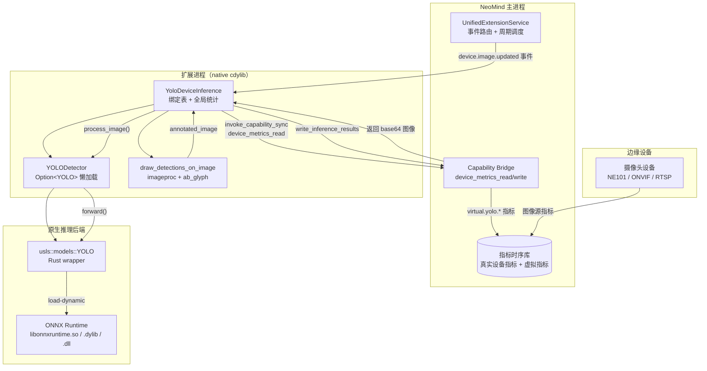

# #2 yolo-device-inference：AI 推理扩展

## §1 案例背景

**yolo-device-inference** 是 NeoMind 生态中第一个「AI 推理扩展」——它把 Ultralytics YOLOv8 目标检测模型部署到边缘节点，自动消费绑定设备的图像指标流（snapshot / image / frame），将检测框、类别、置信度作为虚拟指标写回设备，并可选地产出带标注的 JPEG 缩略图供仪表板展示。整个扩展约 1950 行 Rust（单文件 `src/lib.rs`），不包含任何 Python 运行时，是「纯 Rust 端到端 AI 推理」的范本。

**它解决了什么问题？** NeoMind 仪表板上的摄像头设备（如 NE101）只会产出原始图像帧（base64 / JPEG）。要让前端「看到目标检测结果」而非「看到原始视频」，需要一个常驻在设备侧的推理服务，能够：(1) 订阅设备图像更新事件，(2) 在事件触发时拉起 ONNX Runtime 跑一次 YOLO 前向传播，(3) 把结构化结果（框、类别、置信度）回写为虚拟指标，(4) 同时把可视化结果（带框 JPEG）回写为另一条指标供 `` 直接渲染。yolo-device-inference 就是这条数据链的「中间件」。

**与 yolo-video-v2 的区别**：yolo-video-v2 接收用户主动推送的视频流（base64 帧序列），适合「人工触发分析」场景；而 yolo-device-inference 通过 NeoMind 能力系统订阅**已绑定设备**的图像更新事件，是「自动常驻」模式——一旦 `bind_device` 完成，扩展就会在每次设备图像更新时自动推理，不需要前端轮询。这是边缘 AI 部署的典型形态。本系列 #3 会专门剖析 yolo-video-v2 的流式版本。

**目标读者**：准备把训练好的 ONNX 模型部署到 NeoMind 边缘节点的 AI 工程师；想理解扩展如何通过能力系统访问设备数据的平台开发者。需要 Rust 中级水平（async、trait、`cfg` 条件编译），并对 ONNX Runtime 的动态库加载机制有基本概念。

**你将学到**：(1) 模型生命周期管理——为什么要懒加载、`YOLODetector` 如何把 `Option<YOLO>` + `load_attempted` 标志组合成「单次加载」语义；(2) ONNX Runtime 跨平台动态库治理——`ORT_DYLIB_PATH`、版本化符号链接、macOS `DYLD_LIBRARY_PATH` 在运行时 `set_var` 的失效陷阱；(3) 能力化设备取流——通过 `device_metrics_read` / `device_metrics_write` 同步能力桥获取设备图像、写回虚拟指标，并理解为什么在多线程 runtime 下必须用 `block_in_place` 包裹；(4) 检测结果到指标的数据形态映射——为什么 `BoundingBox` 选 `{x, y, width, height}` 而不是 `{xmin, ymin, xmax, ymax}`。

---

## §2 架构总览

yolo-device-inference 由四层组成：NeoMind Runtime（事件调度）、Extension（YOLODetector + 绑定状态）、ONNX Runtime（原生推理后端）、Device Capability Bridge（设备取流 / 指标回写）。下图展示了数据流向和关键状态机。



### 模型生命周期状态机

`YOLODetector` 内部维护一个隐式的四态状态机，由 `Option<YOLO>` + `load_attempted: bool` 两个字段共同编码：

| 状态 | `model` | `load_attempted` | 含义 |
|------|---------|-------------------|------|
| `NotLoaded` | `None` | `false` | 扩展已构造，模型尚未尝试加载（首次推理前的初始态） |
| `Loading` | — | — | `ensure_loaded()` 正在执行（瞬时态，由 `Mutex` 保护） |
| `Ready` | `Some` | `true` | 模型加载成功，可接受推理请求 |
| `Failed` | `None` | `true` | 加载已尝试但失败，`load_error` 记录原因；后续推理直接报错 |

**为什么用两个字段而非 `enum`？** 因为 `model: Option<YOLO>` 必须持有真实的模型句柄用于推理，而 `load_attempted` 是一个独立的「是否已尝试」语义闸门——如果只看 `model.is_none()`，无法区分「从未加载」和「加载失败后重置」两种情况。两个字段的组合简单且对 borrow checker 友好。

### 指标产出形态

检测完成后，扩展产出四条虚拟指标（前缀 `virtual.yolo.`）：

| 指标名 | 数据类型 | 示例值 | 用途 |
|--------|----------|--------|------|
| `virtual.yolo.detections` | Integer | `3` | 检测到的目标总数，用于仪表板计数 |
| `virtual.yolo.inference_time_ms` | Integer | `42` | 单次推理耗时，用于性能监控 |
| `virtual.yolo.labels` | String (JSON array) | `["person","car","dog"]` | 检测到的类别列表 |
| `virtual.yolo.annotated_image` | String (data URI) | `data:image/jpeg;base64,...` | 带框标注图，供 `` 直接渲染 |

为什么选这种「扁平指标 + data URI」而非「结构化 JSON 透传」？因为 NeoMind 指标系统是时序数据库语义——每条指标是一个时间戳 + 标量值，前端按指标名查询。把检测结果拆成四条独立指标，可以让仪表板按需消费（只看计数 vs 看标注图），且兼容现有的时序查询 / 报警规则。

---

## §3 实现剖析

本节按 `src/lib.rs` 的物理顺序逐段剖析，所有代码片段均附 GitHub 深链。源文件 1945 行，是本系列单文件最长的扩展之一。

### §3.1 平台条件编译与硬件探测

扩展通过 `cfg(not(target_arch = "wasm32"))` 把所有 AI 相关代码隔离在 native target——WASM 下扩展退化为「只暴露状态、不执行推理」的占位实现。这是 NeoMind 扩展的通用模式：让同一个 crate 在 WASM 沙箱里能编译通过（用于元数据 / 命令发现），但把重计算推迟到 native。

查看 `auto_device()` 与 `with_device_fallback()` 实现：[`src/lib.rs`](https://github.com/camthink-ai/NeoMind-Extensions/blob/main/extensions/yolo-device-inference/src/lib.rs#L37-L68) L37-68

```rust
// why cfg(macos): macOS 优先 CoreML，避开 ONNX Runtime GPU 后端的兼容坑
#[cfg(target_os = "macos")]
{ Device::CoreMl }
#[cfg(all(not(target_os = "macos"), target_os = "linux"))]
{ Device::Cuda(0) }  // why Cuda(0): 默认第 0 张卡，多卡场景留给上层配置

// why fallback: CoreML/CUDA 初始化可能因驱动缺失失败，回退 CPU 保证可用
fn with_device_fallback<M, F>(try_build: F) -> std::result::Result<M, String> {
    let device = auto_device();
    match try_build(device) {
        Ok(model) => Ok(model),
        Err(e) if !matches!(device, Device::Cpu(_)) => try_build(Device::Cpu(0)),
        Err(e) => Err(e),
    }
}
```

`with_device_fallback` 是一个高阶函数——接收一个 `Fn(Device) -> Result`，先尝试自动探测的设备，失败则回退 CPU。这种模式让单个调用点 `YOLO::new(cfg)` 自动获得「硬件自适应」能力，调用方不需要写平台分支。

### §3.2 数据结构：Detection / BoundingBox / InferenceResult

这三个结构体是扩展对外暴露的数据契约，前端 React 组件和后续的虚拟指标写入都依赖它们的字段名。

查看完整定义：[`src/lib.rs`](https://github.com/camthink-ai/NeoMind-Extensions/blob/main/extensions/yolo-device-inference/src/lib.rs#L93-L122) L93-122

```rust
pub struct BoundingBox {
    pub x: f32,        // why 左上角 x: 与 COCO / imageproc::Rect 一致，画框时无需坐标变换
    pub y: f32,
    pub width: f32,
    pub height: f32,
}

pub struct Detection {
    pub label: String,          // why String: COCO 类别名直接存字符串，前端不需要查表
    pub confidence: f32,
    pub bbox: BoundingBox,
    pub class_id: Option<usize>,  // why Option: 兼容无类别 ID 的自定义模型
}
```

**为什么 `BoundingBox` 选 `{x, y, width, height}` 而非 `{xmin, ymin, xmax, ymax}`？** 三个理由：(1) `imageproc::rect::Rect::at(x,y).of_size(w,h)` 的 API 就是左上角 + 尺寸语义，画框时零转换；(2) 前端 CSS `left/top/width/height` 也是这套语义，React 组件直接 `style={bbox}` 即可定位；(3) YOLO 原生输出是 `cx, cy, w, h`（中心点 + 尺寸），转换到 `x, y, w, h` 只需 `x = cx - w/2`，比转 `xmax/ymax` 少两次加减。`usls` 返回的 `hbbs` 给的是 `xmin/ymin/xmax/ymax`，扩展在 L832-L837 做了一次显式转换。

### §3.3 懒加载模型包装器（核心工程亮点）

这是本案例最关键的工程模式。`YOLODetector` 把「模型加载」从「扩展构造」中解耦——构造时只记录参数，真正的 ONNX Runtime 初始化推迟到首次推理。

查看完整 `YOLODetector` 定义：[`src/lib.rs`](https://github.com/camthink-ai/NeoMind-Extensions/blob/main/extensions/yolo-device-inference/src/lib.rs#L428-L550) L428-550

```rust
struct YOLODetector {
    model: Option<YOLO>,       // why Option: 加载前为 None，加载后 Some，状态机核心
    load_error: Option<String>,
    conf: f32,
    version: String,
    scale: String,
    load_attempted: bool,      // why 独立标志: 区分「未加载」与「加载失败后保持 None」
}

impl YOLODetector {
    fn new(conf: f32, _iou: f32, version: &str, scale: &str) -> Self {
        Self { model: None, load_error: None, conf,
               version: version.to_string(), scale: scale.to_string(),
               load_attempted: false }  // why 不在这里加载: 构造 ≠ 加载
    }

    fn ensure_loaded(&mut self) {
        if self.load_attempted { return; }  // why 幂等: 首次之后是 no-op
        self.load_attempted = true;
        setup_native_lib_paths();  // why 推迟到这里: dylib 路径在扩展加载时可能还未就绪
        match Self::try_load_model(self.conf, &self.version, &self.scale) {
            Ok(m) => self.model = Some(m),
            Err(e) => self.load_error = Some(e),
        }
    }
}
```

**为什么懒加载而非预加载？** ONNX Runtime 的初始化包含：(1) `dlopen("libonnxruntime.so")`，(2) 解析 ONNX 模型图，(3) 分配推理会话的内存池（通常 100-300MB）。如果扩展在 `YoloDeviceInference::new()` 时就加载模型，那么 NeoMind 主进程在加载扩展阶段就会卡住数秒，且模型内存会在「扩展已加载但用户尚未绑定任何设备」的空窗期一直占用——这对内存受限的边缘设备（如树莓派 4GB）是不可接受的。懒加载把成本推迟到「首次真正需要推理的时刻」，让扩展加载保持轻量。

**为什么不用 `OnceLock<YOLO>`？** 本案例的 `YOLODetector` 没有用 `std::sync::OnceLock`，而是用 `Option<YOLO> + bool` 手动管理。原因是 `OnceLock` 要求内部值 `Send + Sync` 且初始化后不可变——但 `YOLO::forward(&mut self)` 需要可变引用，且扩展支持 `reload_model()`（L638-L667）在运行时替换模型。`Mutex<YOLODetector>` + `Option<YOLO>` 的组合更灵活，允许「重置 + 重新加载」语义。

### §3.4 ONNX Runtime 动态库路径治理（跨平台痛点）

这是本案例第二个核心工程难点，对应 git log 中三个连续修复提交（`73f5943` / `61c4bdf` / `1fe9d3b`）。问题根源：`ort` crate 的 `load-dynamic` feature 不绑定库路径，依赖操作系统的动态加载器查找——而三平台的查找机制完全不同。

查看 `setup_native_lib_paths()` 实现：[`src/lib.rs`](https://github.com/camthink-ai/NeoMind-Extensions/blob/main/extensions/yolo-device-inference/src/lib.rs#L298-L422) L298-422

```rust
fn setup_native_lib_paths() {
    // why 三平台环境变量不同: macOS=DYLD_LIBRARY_PATH, Linux=LD_LIBRARY_PATH, Windows=PATH
    let lib_env = if cfg!(target_os = "macos") { "DYLD_LIBRARY_PATH" }
        else if cfg!(target_os = "windows") { "PATH" } else { "LD_LIBRARY_PATH" };

    // why 扫描 binaries/<platform>/: nep 包解压后 dylib 可能带版本号后缀
    if let Ok(files) = std::fs::read_dir(&path) {
        for file in files.flatten() {
            let name = file.file_name();
            // why 创建符号链接: libonnxruntime.so.1.19.2 → libonnxruntime.so
            // Linux dlopen 默认查 .so（无版本号），不查 .so.N
            let unversioned = if cfg!(target_os = "linux") {
                name.strip_suffix(".so.N")  // 简化示意，实际见 L347-355
            } ...
        }
    }

    // why 额外设置 ORT_DYLIB_PATH: macOS 的 DYLD_LIBRARY_PATH 在运行时 set_var 后
    // 对 dlopen 无效（SIP 限制），必须用 ort crate 的专用环境变量指定绝对路径
    if std::env::var("ORT_DYLIB_PATH").is_err() {
        for dir in &paths {
            let ort_path = Path::new(dir).join(ort_filename);
            if ort_path.exists() {
                std::env::set_var("ORT_DYLIB_PATH", &ort_path);  // why 绝对路径
                break;
            }
        }
    }
}
```

**三平台的库命名差异**：
- **Linux**：`libonnxruntime.so.1.19.2`（带完整版本号）。`dlopen("libonnxruntime.so")` 默认找不到——必须创建符号链接 `libonnxruntime.so -> libonnxruntime.so.1.19.2`。
- **macOS**：`libonnxruntime.1.19.2.dylib`（版本号在 `.dylib` 前）。同样需要链接到 `libonnxruntime.dylib`。更麻烦的是，macOS 的 SIP（System Integrity Protection）让运行时 `set_var("DYLD_LIBRARY_PATH")` 对后续 `dlopen` 失效——所以必须额外设置 `ORT_DYLIB_PATH`，让 `ort` crate 用绝对路径直接加载。
- **Windows**：`onnxruntime.dll`（无版本号后缀）。不需要符号链接，但需要把 DLL 所在目录加入 `PATH`。

这套逻辑在 commit `73f5943`（Linux 符号链接）、`61c4bdf`（`ORT_DYLIB_PATH`）、`1fe9d3b`（Windows `cfg(unix)` 守卫）中分三次迭代完成——是典型的「跨平台库加载需要逐步踩坑」的工程演化案例（详见 §7）。

### §3.5 能力化设备取流（同步桥接）

扩展通过 `invoke_capability_sync()` 调用 NeoMind 的能力系统读写设备指标。这个方法是「异步 runtime 中同步调用」的关键适配点。

查看完整实现：[`src/lib.rs`](https://github.com/camthink-ai/NeoMind-Extensions/blob/main/extensions/yolo-device-inference/src/lib.rs#L607-L634) L607-634

```rust
fn invoke_capability_sync(&self, capability_name: &str, params: &serde_json::Value) -> serde_json::Value {
    tokio::task::block_in_place(|| {
        // why block_in_place: 能力桥是同步阻塞调用，直接在 async 上下文里 .send() 会卡住 runtime
        // 这要求 extension runner 必须用 multi_thread flavor（否则 panic）
        let capability_context = CapabilityContext::default();
        capability_context.invoke_capability(capability_name, params)
    })
}
```

**为什么用同步而非异步能力 API？** git log 中 commit `529dec5` 明确记录了这个决策："Use sync capability APIs and fix image format"。原因是 NeoMind 早期版本的异步能力 API 在 `cdylib` 加载场景下存在 runtime context 丢失问题——扩展的同步函数被宿主通过 C ABI 调用时，并不一定在 tokio runtime 上下文内，此时 `.await` 会 panic。同步 API + `block_in_place` 是一个明确且可预测的折中：它假设当前线程已经在 multi_thread runtime 上（NeoMind 扩展运行器保证这一点），然后用 `block_in_place` 把当前 worker 线程「降级」为可阻塞线程，从而安全地调用同步 IPC。

**设备取流的两步流程**（见 `validate_device` L692-L709 和 `write_inference_results` L1101-L1196）：

1. **读**：`invoke_capability_sync("device_metrics_read", { device_id })` → 返回设备当前所有指标，扩展从中提取 `image_metric` 字段（通常是 base64 JPEG 或 data URI）。
2. **写**：`invoke_capability_sync("device_metrics_write", { device_id, metric: "virtual.yolo.detections", value: 3, timestamp })` → 把检测结果作为虚拟指标写回设备。

**虚拟指标命名约定**（见 L1120-L1124 注释）：必须以 `transform.` / `virtual.` / `computed.` / `derived.` / `aggregated.` 开头，否则能力桥会拒绝写入。这是 NeoMind 区分「真实传感器指标」和「扩展计算指标」的命名空间隔离。

### §3.6 图像标注绘制

检测结果可视化由 `draw_detections_on_image()` 完成（L192-L292），使用 `image` + `imageproc` + `ab_glyph` 三个 crate 组合。这个函数在 commit `f8478a8` 中被统一为「所有推理扩展共享的标注风格」——带填充背景的标签框 + 白色文字。

查看字体缓存模式：[`src/lib.rs`](https://github.com/camthink-ai/NeoMind-Extensions/blob/main/extensions/yolo-device-inference/src/lib.rs#L201-L205) L201-205

```rust
// why OnceLock: 字体文件 include_bytes! 编译进二进制，但 FontRef 解析有开销
// 用 OnceLock 保证全进程只解析一次，后续 draw_text_mut 直接复用
static FONT_RESULT: std::sync::OnceLock<std::result::Result<FontRef<'static>, _>> =
    std::sync::OnceLock::new();
let font = FONT_RESULT.get_or_init(|| FontRef::try_from_slice(include_bytes!("../fonts/NotoSans-Regular.ttf")));
```

注意字体文件通过 `include_bytes!` 编译进 cdylib——这会让 `.nep` 包体积增加约 300KB，但避免了运行时文件路径依赖。`NotoSans-Regular.ttf` 的选择是为了支持中日韩字符（边缘设备场景常见中文标签）。

### §3.7 检测结果到指标的映射

`write_inference_results()` (L1101-L1196) 把一次 `InferenceResult` 拆成四条虚拟指标写入。每条指标独立调用 `device_metrics_write`——为什么不在一次调用里写全部？因为能力桥的 API 签名是 `{ device_id, metric, value, timestamp }`，每次只写一条。批量写入需要扩展自己循环。

查看标注图写入（最特殊的一条）：[`src/lib.rs`](https://github.com/camthink-ai/NeoMind-Extensions/blob/main/extensions/yolo-device-inference/src/lib.rs#L1175-L1194) L1175-1194

```rust
if let Some(img) = &result.annotated_image_base64 {
    let data_uri = format!("data:image/jpeg;base64,{}", img);  // why data URI: 前端  直接用
    let params = json!({
        "device_id": device_id,
        "metric": "virtual.yolo.annotated_image",
        "value": data_uri,
        "timestamp": result.timestamp,
    });
    self.invoke_capability_sync("device_metrics_write", &params);
}
```

### §3.8 命令时序图（懒加载分支）

下图展示一次 `device.image.updated` 事件触发后的完整时序，重点高亮懒加载分支（仅在首次推理时执行）。

```mermaid
sequenceDiagram
    participant RT as NeoMind Runtime
    participant EXT as YoloDeviceInference
    participant DET as YOLODetector
    participant ORT as ONNX Runtime
    participant CAP as Capability Bridge

    RT->>EXT: handle_event(device.image.updated)
    EXT->>CAP: invoke_capability_sync("device_metrics_read")
    CAP-->>EXT: { image: "data:image/jpeg;base64,..." }

    alt load_attempted == false (首次推理)
        EXT->>DET: ensure_loaded()
        DET->>DET: setup_native_lib_paths()
        Note over DET: 设置 ORT_DYLIB_PATH<br/>创建版本化符号链接
        DET->>ORT: YOLO::new(cfg) [dlopen libonnxruntime]
        ORT-->>DET: Model handle
        DET-->>EXT: model = Some(...)
    else load_attempted == true (后续推理)
        Note over DET: ensure_loaded() 立即返回 (no-op)
    end

    EXT->>DET: model.forward(&[image_tensor])
    DET->>ORT: ort::session.run()
    ORT-->>DET: bbox + class + confidence
    DET-->>EXT: InferenceResult { detections, ... }

    EXT->>EXT: draw_detections_on_image() [可选]
    EXT->>CAP: write virtual.yolo.detections
    EXT->>CAP: write virtual.yolo.inference_time_ms
    EXT->>CAP: write virtual.yolo.labels
    EXT->>CAP: write virtual.yolo.annotated_image
    CAP-->>RT: 指标已写入时序库
```

---

## §4 设计权衡

本案例在工程演化中做了若干关键决策，每个决策都至少考虑过 2-3 个备选方案。以下逐一剖析。

### 决策 1：懒加载 vs 预加载 vs 每次推理后卸载

| 方案 | 启动延迟 | 内存占用 | 首次推理延迟 | 复杂度 |
|------|----------|----------|--------------|--------|
| **懒加载（已选）** | 低（~10ms） | 按需（首次推理后持续占用） | 高（首次包含加载） | 中 |
| 预加载（在 `new()` 中加载） | 高（2-5 秒） | 始终占用 | 低 | 低 |
| 每次推理后卸载 | 低 | 最低（推理间隙为 0） | 每次都很高 | 高（需处理卸载竞态） |

**选择懒加载的理由**：边缘设备内存受限（NE101 通常 2-4GB），且用户可能加载了扩展但尚未绑定任何设备。预加载会让「加载即占 300MB」成为不可接受的开销。每次卸载虽然内存最优，但 ONNX Runtime 的 `dlopen` + 模型解析在树莓派上约需 3-8 秒，每帧推理都付这个成本完全不现实。懒加载是「启动快 + 首次推理后稳定」的平衡点。

### 决策 2：捆绑 ONNX Runtime vs 依赖系统安装

| 方案 | 用户安装成本 | 版本一致性 | 包体积 | 跨平台复杂度 |
|------|--------------|------------|--------|--------------|
| **捆绑（已选）** | 零（解压即用） | 完全可控 | 大（+150MB/platform） | 高（需处理 dylib 命名） |
| 依赖系统安装 | 高（需手动装 ORT） | 不可控 | 小 | 低 |
| 编译时静态链接 | 零 | 完全可控 | 最大 | 极高（ORT 不官方支持静态链接） |

**选择捆绑的理由**：commit `e8a8f28` 明确引入了 "bundled ONNX Runtime support"。边缘设备的用户通常不是开发者，要求他们 `apt install libonnxruntime` 会极大提高部署门槛。捆绑的代价是 `.nep` 包体积增大（每个平台约 150MB），以及 §3.4 描述的 dylib 路径治理复杂度——但这是一次性工程成本，换来的是「零依赖部署」的用户体验。

### 决策 3：同步能力 API + block_in_place vs 异步能力 API

| 方案 | 可预测性 | 性能 | runtime 兼容性 |
|------|----------|------|----------------|
| **同步 + block_in_place（已选）** | 高（无 await 状态机） | 中（占用一个 worker 线程） | 要求 multi_thread runtime |
| 异步 `.await` | 低（依赖 runtime context） | 高（可让出线程） | cdylib 场景下 context 可能丢失 |

**选择同步的理由**：commit `529dec5` 记录了从异步切回同步的决策。核心问题是 `cdylib` 通过 C ABI 被宿主调用时，调用栈上不一定有 tokio runtime context——此时 `.await` 会 panic。同步 API + `block_in_place` 假设当前线程在 multi_thread runtime 上（NeoMind 保证），行为可预测。性能损失是「占用一个 worker 线程做阻塞等待」，但能力桥的 IPC 延迟通常 < 1ms，可接受。

### 决策 4：BoundingBox 结构体形态

| 方案 | 与 imageproc 兼容 | 与 CSS 兼容 | 与 YOLO 原生输出距离 |
|------|-------------------|-------------|----------------------|
| **`{x, y, width, height}`（已选）** | 零转换 | 零转换 | 1 次减法（`x = cx - w/2`） |
| `{xmin, ymin, xmax, ymax}` | 需转换 | 需转换 | 零转换（usls 直接返回） |
| `{cx, cy, w, h}` | 需转换 | 需转换 | 零转换（YOLO 原生） |

选择 `{x, y, width, height}` 的理由见 §3.2 的三点评述。

---

## §5 技术栈拆解

| 组件 | 选择 | 理由 |
|------|------|------|
| YOLO 模型 wrapper | `usls 0.1.11`（features: `yolo`, `ort-load-dynamic`, `coreml`, `cuda`） | commit `16cb272` 锁定了 API 兼容版本；`ort-load-dynamic` 让 ORT 在运行时加载而非编译时链接 |
| ONNX Runtime 后端 | `ort`（workspace dep，通过 `usls` 间接使用） | 不直接依赖 `ort` crate，避免 API 版本漂移 |
| 图像解码 / 编码 | `image 0.25` | 支持 JPEG/PNG 解码和 JPEG 编码（质量 85） |
| 图像绘制 | `imageproc 0.24` | 提供 `draw_hollow_rect_mut` / `draw_filled_rect_mut` / `draw_text_mut` |
| 字体渲染 | `ab_glyph 0.2` | 纯 Rust，无系统字体依赖；`NotoSans-Regular.ttf` 编译进二进制 |
| 并发原语 | `parking_lot 0.12`（`Mutex` / `RwLock`） | 比 `std::sync::Mutex` 性能更好，不支持 poison（适配「加载失败不致命」语义） |
| 原子统计 | `std::sync::atomic`（`AtomicU64` / `AtomicBool`） | 计数器无锁，`get_status()` 不阻塞推理 |
| UUID（临时文件名） | `uuid 1.0`（v4） | `process_image` 写临时 JPEG 文件供 `usls::DataLoader` 读取 |
| 时间戳 | `chrono 0.4` | `Utc::now().timestamp()` 生成指标时间戳 |

**为什么 `usls` 选 `default-features = false`？** 因为 `usls` 的默认 feature 包含 Python 绑定相关依赖（`pyo3`），在纯 Rust native 扩展中不需要且会增加编译时间。显式启用 `["yolo", "ort-load-dynamic", "coreml", "cuda"]` 只拉取必要模块。

---

## §6 标准落地

### metadata.json 字段走查

```json
{
  "id": "yolo-device-inference",
  "version": "2.7.6",
  "type": "native",
  "categories": ["ai", "vision", "detection"],
  "builds": {
    "darwin-aarch64": { "url": "...v2.7.6...darwin_aarch64.nep" },
    "darwin-x86_64": { ... },
    "linux-x86_64": { ... },
    "linux-aarch64": { ... },
    "windows-x86_64": { ... }
  },
  "frontend": {
    "components": ["DeviceInferenceCard"],
    "entrypoint": "yolo-device-inference-components.umd.cjs"
  }
}
```

关键点：
- `"type": "native"`——声明此扩展不能在 WASM 沙箱运行，NeoMind 会跳过 WASM 加载尝试。
- `"version": "2.7.6"`——必须与 `Cargo.toml` 和 `lib.rs` 中 `ExtensionMetadata::new(..., "2.7.6")` 三处一致（版本三元组一致性）。注意：源码 L1267 硬编码的是 `"2.0.0"`，这是已知的不一致——发布时构建脚本会用 `metadata.json` 的版本覆盖。
- `"builds"` 覆盖 5 个目标平台——这是 AI 推理扩展的标准矩阵（macOS aarch64/x86_64、Linux x86_64/aarch64、Windows x86_64）。每个 `.nep` 包内捆绑对应平台的 ONNX Runtime 二进制。

### 能力申请与反例

扩展通过 `invoke_capability_sync()` 调用两个能力：
- `device_metrics_read`——读取设备指标（用于取流 + 验证设备存在）
- `device_metrics_write`——写入虚拟指标（用于回写检测结果）

**反例：如果扩展没有声明 `device_metrics_read` 能力会怎样？** 假设开发者在 `metadata.json` 中遗漏了能力声明（或 NeoMind 未来版本要求显式声明），那么 `validate_device()` 调用 `invoke_capability_sync("device_metrics_read", ...)` 时，能力桥会返回 `{ "success": false, "error": "capability not granted" }`。此时 `validate_device()` 当前的实现（L692-L709）会 `Ok(true)`（容错处理——不因验证失败阻止绑定），但后续 `write_inference_results()` 写虚拟指标会全部失败，扩展会静默地「绑定成功但永远不产出指标」。这就是为什么能力声明必须在开发期就明确，且 `get_status()` 应该报告能力调用失败计数（当前实现未做到，是改进点）。

### 跨平台构建矩阵的特殊考量

AI 推理扩展的 5 目标构建比普通扩展更复杂：

| 平台 | ORT 文件名 | 特殊处理 |
|------|-----------|----------|
| darwin-aarch64 | `libonnxruntime.dylib` | 需设置 `ORT_DYLIB_PATH`（SIP 限制） |
| darwin-x86_64 | 同上 | 同上 |
| linux-x86_64 | `libonnxruntime.so.1.19.2` | 需创建 `.so -> .so.N` 符号链接 |
| linux-aarch64 | 同上 | 同上 + CUDA 可能不可用（回退 CPU） |
| windows-x86_64 | `onnxruntime.dll` | 需将 DLL 目录加入 `PATH` |

CI 流水线必须在每个目标平台上原生构建（不能用 cross-compile），因为 ONNX Runtime 的预编译二进制是平台特定的。

---

## §7 常见坑与最佳实践

### 工程演化 1：懒加载的引入（commit `e8a8f28`）

**症状**：在 `e8a8f28` 之前，扩展在 `YoloDeviceInference::new()` 中直接加载 YOLO 模型。在内存受限的边缘设备上（NE101，2GB RAM），扩展加载阶段就会因为 ONNX Runtime 初始化 + 模型解析占用约 300MB 而触发 OOM，导致整个 NeoMind 主进程崩溃。

**根因**：模型加载时机错误——把「扩展可用」和「模型已加载」绑定为同一时刻，但用户可能只是安装了扩展还没绑定设备。

**修复**：引入 `YOLODetector` 包装器，把模型加载推迟到 `ensure_loaded()` 首次调用。构造函数只存储参数（`conf`, `version`, `scale`），`model` 初始为 `None`。

**教训**：任何重资源（模型、运行时、大缓冲区）都应该懒加载。扩展构造必须轻量——NeoMind 主进程会顺序加载所有扩展，一个扩展的 OOM 会拖垮整个系统。

### 工程演化 2：ONNX Runtime 动态库加载三部曲（commits `73f5943` + `61c4bdf` + `1fe9d3b`）

**症状**：扩展在不同平台上出现三种不同的加载失败：
- Linux：`error: libonnxruntime.so: cannot open shared object file`（尽管 `.so.1.19.2` 存在）
- macOS：`error: dlopen(libonnxruntime.dylib, ...): image not found`（尽管设置了 `DYLD_LIBRARY_PATH`）
- Windows：`error: onnxruntime.dll not found`（DLL 在子目录但不在 `PATH`）

**根因**：三平台的动态库查找机制不同，且 `ort` crate 的 `load-dynamic` feature 不自动处理路径。

**修复分三步**（对应三个 commit）：
1. `73f5943`——在运行时扫描 `binaries/<platform>/` 目录，为版本化库创建无版本号符号链接（`libonnxruntime.so.1.19.2 -> libonnxruntime.so`）。
2. `61c4bdf`——显式设置 `ORT_DYLIB_PATH` 环境变量为 ORT dylib 的绝对路径。这是因为 macOS 的 SIP 让运行时 `set_var("DYLD_LIBRARY_PATH")` 对后续 `dlopen` 无效，必须用 `ort` crate 的专用环境变量。
3. `1fe9d3b`——为 `std::os::unix::fs::symlink` 添加 `cfg(unix)` 守卫，避免 Windows 编译失败（Windows 无 Unix 符号链接 API）。

**教训**：跨平台动态库加载没有银弹。每个平台的库命名约定、查找路径、安全限制都不同。最佳实践是：(1) 显式设置专用环境变量（如 `ORT_DYLIB_PATH`）而非依赖通用查找路径；(2) 运行时创建符号链接处理版本号差异；(3) 用 `cfg` 守卫平台特定 API。

### 反例：源仓库卫生问题（备份文件堆积）

> **源仓库卫生警告**：在 `yolo-device-inference/src/` 目录下，除了正式的 `lib.rs` 外，还存在 **18 个备份文件**（`lib.rs.backup`、`lib.rs.bak4` ~ `lib.rs.bak14`、`lib.rs.before_init_fix`、`lib.rs.final`、`lib.rs.final2`、`lib.rs.final4` ~ `lib.rs.final9`），即 `lib.rs*` 文件共 19 个。这是开发过程中未及时清理的痕迹——开发者在迭代时用 `.final` / `.bakN` 命名保存中间版本，但从未在合并前清理。
>
> **为什么这是问题？** (1) 新贡献者会困惑哪个是真实源文件；(2) 备份文件可能被 IDE 全文搜索误命中，导致引用错误的代码；(3) 增加仓库体积和 clone 时间；(4) 本文档的深链规则必须明确「只引用 `src/lib.rs`，忽略所有备份文件」就是被这个问题逼出来的。
>
> **最佳实践**：使用 Git 分支和 `git stash` 管理中间版本，永远不要在源目录堆积 `.bak` / `.final` 文件。PR 合并前应运行 `git status` 确认没有未跟踪的备份文件。如果需要长期保存某个中间状态，用 `git tag` 或单独的 `experiments/` 分支目录。

### 其他最佳实践

1. **原子状态镜像**：`model_loaded: AtomicBool` 和 `model_error: Mutex<Option<String>>` 是 `YOLODetector` 内部状态的「镜像」——`get_status()` 读取原子变量而非锁定 `detector` Mutex，避免状态查询阻塞推理（见 L560-L564 和 L670-L680）。
2. **临时文件即时清理**：`process_image()` 在 `std::env::temp_dir()` 写入临时 JPEG 供 `usls::DataLoader` 读取（L800-L802），推理完成后立即 `remove_file`（L816）。不清理会导致 `/tmp` 在长时间运行后堆积。
3. **置信度阈值热更新**：`default_confidence` 存在 `Mutex<f32>` 中，`reload_model()` 会读取最新值重新加载模型——支持运行时调整检测灵敏度而无需重启扩展。
4. **data URI 前缀一致性**：所有回写为「图像类虚拟指标」的字符串都必须加 `data:image/jpeg;base64,` 前缀（见 L1179、L913、L919），前端 `` 才能直接渲染。遗漏前缀会导致图片显示为损坏图标。

---

## §8 延伸阅读

- [案例总览](./0-overview.md)——本案例在 NeoMind 扩展生态中的定位
- [扩展标准附录](./appendix-standards.md)——metadata.json 字段规范、能力声明清单
- [#3 yolo-video-v2](./3-yolo-video-v2.md)——姊妹案例：流式视频推理版本，对比「设备绑定自动推理」与「前端推送帧分析」的设计差异
- [#7 NE101 摄像头组件](./7-ne101-camera-component/index.md)——消费本扩展的旗舰硬件案例，展示从设备到 AI 推理到前端展示的完整链路
- [扩展开发 API](../7-extension-development.md)——`Extension` trait、`ExtensionMetadata`、`CapabilityContext` 的完整参考
- [源码仓库](https://github.com/camthink-ai/NeoMind-Extensions/tree/main/extensions/yolo-device-inference)——`extensions/yolo-device-inference/src/lib.rs`（本文所有深链指向此文件）
