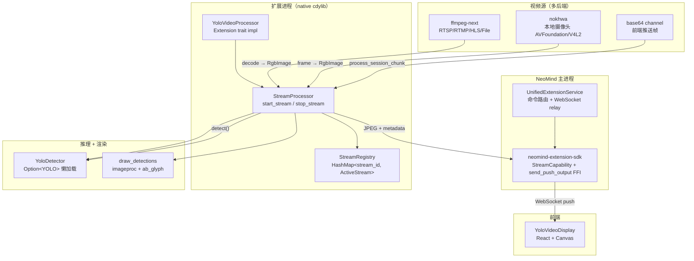
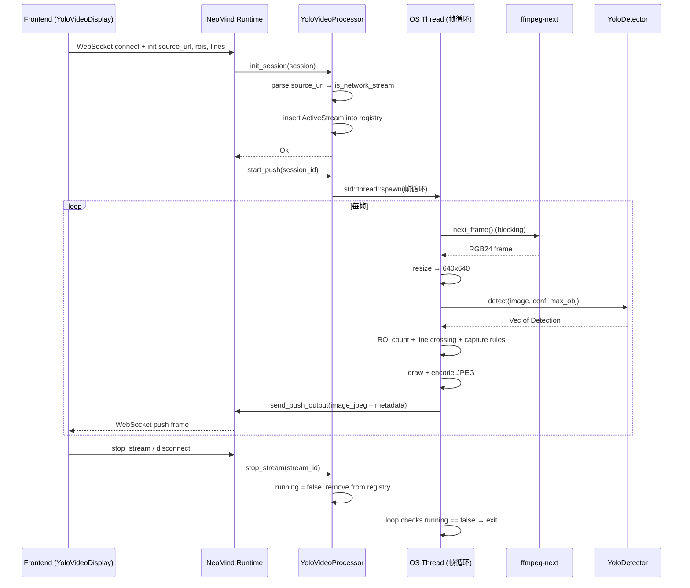

# 3 yolo-video-v2：流式扩展

## 1 案例背景

**yolo-video-v2** 是 NeoMind 生态中**最复杂的流式扩展**——它把 Ultralytics YOLOv11 目标检测模型挂到实时视频流上，支持三类数据来源（RTSP/RTMP/HLS 网络流、本地摄像头、前端 base64 帧推送），在 Push 模式下持续把带检测框的 JPEG 帧和结构化检测 JSON 推回前端。

并附带 ROI 区域计数、越线计数、智能抓拍规则（阈值/出现/消失触发）等业务能力。当前版本 2.7.6，核心代码约 2829 行 Rust（`src/lib.rs`）+ 721 行（`src/detector.rs`）+ 387 行（`src/video_source.rs`），是本系列单 crate 代码量最大的扩展，也是唯一一个完整使用 SDK `StreamCapability` + `StreamMode::Push` + `send_push_output` FFI 链路的扩展。

**它解决了什么问题？** NeoMind 的同步能力桥（参考 [案例 #2](./2-yolo-device-inference.md)）适合「事件驱动 + 单帧推理」——设备图像更新时跑一次 YOLO。但视频分析场景是「连续帧流」：一个 RTSP 摄像头每秒产出 25~30 帧，每帧都需要推理、统计、可视化。如果用同步能力桥轮询，每秒要发起 30 次跨进程调用，延迟和开销都不可接受。

yolo-video-v2 用 Push 模式解决了这个问题：扩展在 `init_session` 时拉起一条专用的 OS 线程跑帧循环，每帧通过 `send_push_output` FFI 直接把结果灌入 SDK 的输出通道，再由 `UnifiedExtensionService` 中转到前端 WebSocket，全程不阻塞 runtime 主线程。

**与 yolo-device-inference 的关键区别**（这是理解本案例最重要的对比维度）：

| 维度 | yolo-device-inference (2) | yolo-video-v2 (3) |
|------|----------------------------|---------------------|
| 数据来源 | 订阅已绑定设备的 image metric（event-driven pull） | RTSP/摄像头/base64 三选一（init_session 时启动） |
| 调用模式 | `configure + bind_device` 后常驻 | `start_stream / stop_stream` 显式会话生命周期 |
| 流模式 | 同步能力桥（`invoke_capability_sync`） | `StreamCapability` + `StreamMode::Push` + `send_push_output` |
| 帧率 | 设备图像更新频率（通常 < 1 FPS） | 视频原生帧率（25~30 FPS） |
| 线程模型 | runtime 主线程 + `block_in_place` | 专用 OS 线程跑帧循环，与 tokio runtime 完全解耦 |

**目标读者**：

1. 要在 NeoMind 上跑实时视频分析的视觉工程师——你会看到完整的 RTSP 取流 + YOLO 推理 + JPEG 编码 + Push 推送链路
2. 想理解 Push 流模式的 SDK 开发者——本案例是 SDK `StreamCapability` 接口唯一的「完整生产级」参考实现

**你将学到**：

1. Push 模式的语义——为什么视频流必须用 Push 而非 Pull，`StreamMode::Push` 在 SDK 层到底做了什么
2. 会话生命周期管理——`init_session` → `start_push` → 帧循环 → `stop_stream` 的完整状态机和清理逻辑
3. 多后端视频源抽象——为什么 RTSP 用 ffmpeg-next 而本地摄像头用 nokhwa，base64 推流又走哪条路径
4. 跨平台 ONNX Runtime 动态库治理——从 `libonnxruntime.so.N` 版本化符号链接到 Windows DLL 路径再到 macOS `DYLD_LIBRARY_PATH`
5. 源码卫生反例——为什么 `detector.rs.backup` 这类备份文件不应该提交到仓库

---

## 2 架构总览

yolo-video-v2 采用五层架构：NeoMind Runtime（WebSocket relay）→ Extension（StreamProcessor + ActiveStream map）→ Detector（YoloDetector 懒加载 usls YOLO）→ Video Source（ffmpeg-next / nokhwa / base64 channel）→ Frontend（YoloVideoDisplay React 组件）。下图展示数据流向和关键状态机。



### 流式会话状态机

一个 stream 从创建到销毁经历四个阶段，每个阶段对应 SDK 的一个回调：

| 状态 | 触发方 | 回调 | 内部动作 |
|------|--------|------|----------|
| `Created` | 前端 `init` WebSocket | — | ActiveStream 结构体构造，未启动帧循环 |
| `Initializing` | SDK | `init_session` | 解析 `source_url` 决定走 ffmpeg / nokhwa / base64；插入 registry |
| `Streaming` | SDK | `start_push` | 专用 OS 线程跑帧循环：decode → detect → ROI/line → JPEG → `send_push_output` |
| `Stopped` | 前端 `stop_stream` 或断连 | `stop_stream` | `running = false`，registry 移除，线程自然退出 |

`init_session` 的关键判断逻辑在 [`src/lib.rs` L1302-L1308](https://github.com/camthink-ai/NeoMind-Extensions/blob/main/extensions/yolo-video-v2/src/lib.rs#L1302-L1308)：通过 `source_url` 的协议前缀（`rtsp://` / `http://` / `camera://` 等）决定走网络流（ffmpeg）还是本地摄像头（nokhwa / base64）。

```rust
// lib.rs L1302-L1308
let is_network_stream = source_url.starts_with("rtsp://")
    || source_url.starts_with("rtmp://")
    || source_url.starts_with("hls://")
    || source_url.contains(".m3u8")
    || source_url.starts_with("http://")
    || source_url.starts_with("https://")
    || source_url.starts_with("file://");
```
[Source: lib.rs L1302-L1308](https://github.com/camthink-ai/NeoMind-Extensions/blob/main/extensions/yolo-video-v2/src/lib.rs#L1302-L1308)

### 与 yolo-device-inference 架构对比

| 架构维度 | 2 yolo-device-inference | 3 yolo-video-v2 |
|----------|--------------------------|-------------------|
| 入口抽象 | `Extension::execute_command("bind_device")` | `Extension::stream_capability()` + `init_session` |
| 推理触发 | 设备 image metric 更新事件 | 帧循环 OS 线程主动驱动 |
| 输出通道 | `device_metrics_write`（同步写虚拟指标） | `send_push_output`（异步推 WebSocket） |
| 并发模型 | 单 detector + Mutex | 每个 stream 独立 OS 线程 + 共享 detector |
| 状态清理 | `unbind_device` | `stop_stream` + 线程 `running` 标志 |

---

## 3 核心实现剖析

### 3.1 StreamCapability 声明

扩展通过 `stream_capability()` 声明自己是 Push 模式流式扩展。查看实现：[`src/lib.rs` L1275-L1288](https://github.com/camthink-ai/NeoMind-Extensions/blob/main/extensions/yolo-video-v2/src/lib.rs#L1275-L1288)

```rust
fn stream_capability(&self) -> Option<StreamCapability> {
    Some(StreamCapability {
        direction: StreamDirection::Bidirectional,
        mode: StreamMode::Push,
        supported_data_types: vec![
            StreamDataType::Image { format: "jpeg".to_string() },
        ],
        max_chunk_size: 524288,        // 512 KB
        preferred_chunk_size: 32768,   // 32 KB
        max_concurrent_sessions: 4,
        flow_control: FlowControl::default_stream(),
        config_schema: None,
    })
}
```

`StreamMode::Push` 的语义是：**扩展主动产出数据**，SDK 不需要轮询。与之对应的 `Pull` 模式是 SDK 主动请求数据（适合低频指标），`Stateless` 模式是无状态请求-响应（适合命令式 API）。视频流每秒产出 25~30 帧，只有 Push 模式能保证不丢帧。`max_concurrent_sessions: 4` 限制了单扩展实例最多同时跑 4 路视频流——这是基于 ONNX Runtime 显存和 CPU 推理吞吐的实测上限。`direction: Bidirectional` 是因为前端既要接收帧（Push output），也要发送 base64 帧（`process_session_chunk`）。

### 3.2 init_session：会话初始化

`init_session` 在 SDK 建立 WebSocket 会话后回调，负责构造 `ActiveStream` 状态并插入全局 registry。查看实现：[`src/lib.rs` L1290-L1360](https://github.com/camthink-ai/NeoMind-Extensions/blob/main/extensions/yolo-video-v2/src/lib.rs#L1290-L1360)

```rust
// lib.rs L1290-L1320 (trimmed)
async fn init_session(&self, session: &StreamSession) -> Result<()> {
    eprintln!("[YOLO] init_session called: id={}", session.id);
    let config: StreamConfig = serde_json::from_value(session.config.clone())
        .unwrap_or_default();

    let stream_id = session.id.clone();
    let source_url = config.source_url.clone();

    tracing::info!("Session config: source_url={}, confidence={}, max_objects={}",
        source_url, config.confidence_threshold, config.max_objects);

    // Determine if this is a network stream (RTSP/RTMP/HLS) or local camera
    let is_network_stream = source_url.starts_with("rtsp://")
        || source_url.starts_with("rtmp://")
        || source_url.starts_with("hls://")
        || source_url.contains(".m3u8")
        || source_url.starts_with("http://")
        || source_url.starts_with("https://")
        || source_url.starts_with("file://");

    let stream = ActiveStream {
        _id: stream_id.clone(),
        _config: config.clone(),
        started_at: Instant::now(),
        frame_count: 0,
        total_detections: 0,
        running: true,
        // ... (additional fields omitted)
    };
```
[Source: lib.rs L1290-L1360](https://github.com/camthink-ai/NeoMind-Extensions/blob/main/extensions/yolo-video-v2/src/lib.rs#L1290-L1360)

关键逻辑：

1. 从 `session.config` 反序列化 `StreamConfig`（包含 `source_url`、`confidence_threshold`、`max_objects`、`target_fps`、`rois`、`lines`、`capture_rules`）
2. 通过 `source_url` 前缀判断 `is_network_stream`（RTSP/RTMP/HLS/HTTP/File 走 ffmpeg，其余走本地摄像头或 base64）
3. 构造 `ActiveStream` 结构体（`running: true`、空的 `tracker` / `line_counts` / `capture_rule_states`）
4. 检查 session 是否已存在，若存在则先停止旧 session（设置 `running = false` 并丢弃旧 `push_task`）
5. 插入 registry

注意 `init_session` 本身**不启动帧循环**——帧循环在 `start_push` 中启动，这样设计是为了让 SDK 有机会在帧循环开始前完成 output sender 的绑定。

### 3.3 execute_command：start_stream / stop_stream 调度

扩展暴露了 `start_stream` / `stop_stream` / `get_stream_stats` / `gc_memory` / `update_stream_config` 五个命令。查看调度实现：[`src/lib.rs` L1114-L1215](https://github.com/camthink-ai/NeoMind-Extensions/blob/main/extensions/yolo-video-v2/src/lib.rs#L1114-L1215)

```rust
async fn execute_command(&self, command: &str, args: &serde_json::Value) -> Result<serde_json::Value> {
    match command {
        "start_stream" => {
            let config: StreamConfig = serde_json::from_value(args.clone()).unwrap_or_default();
            let info = self.processor.start_stream(config).await?;
            Ok(serde_json::to_value(info)?)
        }
        "stop_stream" => {
            let stream_id = args.get("stream_id").and_then(|v| v.as_str())?;
            self.processor.stop_stream(stream_id)?;
            Ok(json!({"success": true}))
        }
        "update_stream_config" => { /* 热更新 ROI/lines/capture_rules */ }
        // ...
    }
}
```

`start_stream` 的实现：[`src/lib.rs` L654-L707](https://github.com/camthink-ai/NeoMind-Extensions/blob/main/extensions/yolo-video-v2/src/lib.rs#L654-L707)。它生成 UUID 作为 `stream_id`，构造 `ActiveStream`，然后在**专用 OS 线程**上 spawn `processing_loop`——注意不是 `tokio::spawn`，因为帧循环里有大量阻塞 I/O（FFmpeg decode、ONNX forward），放在 tokio worker 线程上会拖慢整个 runtime。

```rust
// lib.rs L654-L696 (trimmed)
pub async fn start_stream(self: &Arc<Self>, config: StreamConfig) -> Result<StreamInfo> {
    let stream_id = Uuid::new_v4().to_string();

    let (width, height) = if config.source_url.contains("1920") || config.source_url.contains("rtsp") {
        (1920, 1080)
    } else {
        (640, 480)
    };

    let active_stream = Arc::new(Mutex::new(ActiveStream {
        _id: stream_id.clone(),
        _config: config.clone(),
        started_at: Instant::now(),
        frame_count: 0,
        total_detections: 0,
        running: true,
        tracker: ObjectTracker::new(),
        line_counts: HashMap::new(),
        capture_rule_states: HashMap::new(),
        pending_captures: Vec::new(),
        // ...
    }));

    {
        let mut registry = get_registry().lock();
        registry.streams.insert(stream_id.clone(), active_stream.clone());
    }

    // Spawn processing on dedicated OS thread
    let stream_id_clone = stream_id.clone();
    let config_clone = config.clone();
    let processor_clone = Arc::clone(self);

    std::thread::spawn(move || {
        Self::processing_loop(active_stream, stream_id_clone, config_clone, processor_clone);
    });
```
[Source: lib.rs L654-L707](https://github.com/camthink-ai/NeoMind-Extensions/blob/main/extensions/yolo-video-v2/src/lib.rs#L654-L707)

`stop_stream` 的实现：[`src/lib.rs` L813-L822](https://github.com/camthink-ai/NeoMind-Extensions/blob/main/extensions/yolo-video-v2/src/lib.rs#L813-L822)。它只是 `registry.streams.remove(stream_id)` + `stream.lock().running = false`，帧循环线程在下一次循环检查 `running` 时自然退出——这是协作式取消，比 `thread::abort()`（Rust 标准库没有）更安全。

```rust
// lib.rs L813-L822
pub fn stop_stream(&self, stream_id: &str) -> Result<()> {
    let mut registry = get_registry().lock();
    if let Some(stream) = registry.streams.remove(stream_id) {
        stream.lock().running = false;
        tracing::info!("[Stream {}] Stopped", stream_id);
        Ok(())
    } else {
        Err(ExtensionError::SessionNotFound(stream_id.to_string()))
    }
}
```
[Source: lib.rs L813-L822](https://github.com/camthink-ai/NeoMind-Extensions/blob/main/extensions/yolo-video-v2/src/lib.rs#L813-L822)

### 3.4 帧循环：decode → detect → ROI/line → JPEG → send_push_output

网络流的帧循环在 `start_push` 内的 `std::thread::spawn` 闭包中：[`src/lib.rs` L1427-L1650](https://github.com/camthink-ai/NeoMind-Extensions/blob/main/extensions/yolo-video-v2/src/lib.rs#L1427-L1650)。每帧的处理流水线：

```rust
// lib.rs L1427-L1468 (trimmed)
let task_handle = std::thread::spawn(move || {
    let mut sequence = 0u64;
    let frame_duration = std::time::Duration::from_millis(1000 / target_fps as u64);
    let mut reconnect_count = 0u32;
    const MAX_RECONNECT: u32 = 3;

    // Open the stream via FFmpeg
    let mut video_source = match crate::video_source::FfmpegVideoSource::new(&source_type) {
        Ok(vs) => {
            tracing::info!("[Stream {}] FFmpeg connected to: {}", sid, source_url);
            vs
        }
        Err(e) => {
            tracing::error!("[Stream {}] FFmpeg failed to connect: {}", sid, e);
            return;
        }
    };

    loop {
        // Check if stream is still running
        let should_continue = {
            let registry = get_registry().lock();
            registry.streams.get(&sid).map_or(false, |s| s.lock().running)
        };
        if !should_continue {
            break;
        }

        let frame_start = std::time::Instant::now();

        // Decode next frame from FFmpeg (blocking)
        let frame_result = video_source.next_frame();
```
[Source: lib.rs L1427-L1650](https://github.com/camthink-ai/NeoMind-Extensions/blob/main/extensions/yolo-video-v2/src/lib.rs#L1427-L1650)

1. **decode**：`video_source.next_frame()` 阻塞读取 FFmpeg 解码的 RGB24 帧（[`src/lib.rs` L1468](https://github.com/camthink-ai/NeoMind-Extensions/blob/main/extensions/yolo-video-v2/src/lib.rs#L1468)）。
2. **resize**：原始分辨率 → 640×640（YOLO 输入尺寸，[`src/lib.rs` L1486-L1489](https://github.com/camthink-ai/NeoMind-Extensions/blob/main/extensions/yolo-video-v2/src/lib.rs#L1486-L1489)）。

```rust
// lib.rs L1486-L1489
let inference_image = image::imageops::resize(
    &original_image, 640, 640,
    image::imageops::FilterType::CatmullRom,
);
```
[Source: lib.rs L1486-L1489](https://github.com/camthink-ai/NeoMind-Extensions/blob/main/extensions/yolo-video-v2/src/lib.rs#L1486-L1489)
3. **detect**：`detector.detect(&inference_image, confidence, max_obj)`（[`src/lib.rs` L1494](https://github.com/camthink-ai/NeoMind-Extensions/blob/main/extensions/yolo-video-v2/src/lib.rs#L1494)），返回 `Vec<Detection>`。
4. **scale back**：把检测框坐标从 640×640 缩放回原始分辨率（[`src/lib.rs` L1497-L1505](https://github.com/camthink-ai/NeoMind-Extensions/blob/main/extensions/yolo-video-v2/src/lib.rs#L1497-L1505)）。

```rust
// lib.rs L1497-L1505
let scale_x = orig_width as f32 / 640.0;
let scale_y = orig_height as f32 / 640.0;
let scaled: Vec<_> = dets.into_iter().map(|mut d| {
    d.bbox.x *= scale_x;
    d.bbox.y *= scale_y;
    d.bbox.width *= scale_x;
    d.bbox.height *= scale_y;
    d
}).collect();
```
[Source: lib.rs L1497-L1505](https://github.com/camthink-ai/NeoMind-Extensions/blob/main/extensions/yolo-video-v2/src/lib.rs#L1497-L1505)
5. **ROI counting**：`count_roi_detections` 统计每个 ROI 区域内的目标数（[`src/lib.rs` L1546](https://github.com/camthink-ai/NeoMind-Extensions/blob/main/extensions/yolo-video-v2/src/lib.rs#L1546)）。
6. **line crossing**：`ObjectTracker::update` + `line_crossing_direction` 计算越线方向（[`src/lib.rs` L1557-L1575](https://github.com/camthink-ai/NeoMind-Extensions/blob/main/extensions/yolo-video-v2/src/lib.rs#L1557-L1575)）。

```rust
// lib.rs L1557-L1575
let matches = s.tracker.update(&track_dets);

// Pre-collect prev/curr centers for matched tracks
let track_movements: Vec<(u32, (f32, f32), (f32, f32))> = matches.iter()
    .filter_map(|(track_id, _det_idx)| {
        let prev = s.tracker.get_prev_center(*track_id)?;
        let curr = s.tracker.objects.iter().find(|t| t.id == *track_id).map(|t| t.center)?;
        Some((*track_id, prev, curr))
    })
    .collect();

for line in &lines_cfg {
    let entry = s.line_counts.entry(line.id.clone()).or_insert((0u64, 0u64));
```
[Source: lib.rs L1557-L1575](https://github.com/camthink-ai/NeoMind-Extensions/blob/main/extensions/yolo-video-v2/src/lib.rs#L1557-L1575)
7. **draw + encode JPEG**：`draw_detections` + `encode_jpeg(&output_image, 75)`（[`src/lib.rs` L1615](https://github.com/camthink-ai/NeoMind-Extensions/blob/main/extensions/yolo-video-v2/src/lib.rs#L1615)）。
8. **send_push_output**：构造 `PushOutputMessage::image_jpeg` + metadata（detections / roi_stats / line_stats / capture_events），通过 FFI 推送（[`src/lib.rs` L1640-L1646](https://github.com/camthink-ai/NeoMind-Extensions/blob/main/extensions/yolo-video-v2/src/lib.rs#L1640-L1646)）。

```rust
// lib.rs L1640-L1646
let output = PushOutputMessage::image_jpeg(&sid, sequence, jpeg_data)
    .with_metadata(serde_json::json!({
        "detections": detections,
        "roi_stats": roi_stats,
        "line_stats": line_stats,
        "capture_events": capture_events,
    }));
```
[Source: lib.rs L1640-L1646](https://github.com/camthink-ai/NeoMind-Extensions/blob/main/extensions/yolo-video-v2/src/lib.rs#L1640-L1646)

### 3.5 智能抓拍规则

`CaptureCondition` 是一个 `#[serde(tag = "type")]` 的 tagged enum，支持三种触发条件（[`src/lib.rs` L152-L164](https://github.com/camthink-ai/NeoMind-Extensions/blob/main/extensions/yolo-video-v2/src/lib.rs#L152-L164)）：

```rust
// lib.rs L152-L164
#[derive(Debug, Clone, Serialize, Deserialize)]
#[serde(tag = "type")]
pub enum CaptureCondition {
    /// Fire when class count exceeds threshold (rising edge)
    #[serde(rename = "threshold")]
    Threshold { class_name: String, threshold: u32 },
    /// Fire when class appears (rising edge: absent -> present)
    #[serde(rename = "presence")]
    Presence { class_name: String },
    /// Fire when class disappears (falling edge: present -> absent)
    #[serde(rename = "absence")]
    Absence { class_name: String },
}
```
[Source: lib.rs L152-L164](https://github.com/camthink-ai/NeoMind-Extensions/blob/main/extensions/yolo-video-v2/src/lib.rs#L152-L164)

- `Threshold { class_name, threshold }`：某类别在指定 ROI 内的数量超过阈值时触发（rising edge）。
- `Presence { class_name }`：某类别从无到有（rising edge: absent → present）。
- `Absence { class_name }`：某类别从有到无（falling edge: present → absent）。

每条 `CaptureRule` 配置了 `cooldown_seconds`（默认 5 秒，[`src/lib.rs` L179](https://github.com/camthink-ai/NeoMind-Extensions/blob/main/extensions/yolo-video-v2/src/lib.rs#L179)），运行时状态 `CaptureRuleState` 记录 `last_triggered` 和 `prev_condition_met`——只有 condition 从 false→true（rising edge）且距上次触发超过 cooldown 才会真正产出 `CaptureEvent`（带 base64 图像）。

### 3.6 流式会话生命周期序列图



### 3.7 YoloDetector 懒加载

`YoloDetector` 封装 usls::models::YOLO，采用与 2 相同的懒加载模式：`Option<YOLO>` + `load_attempted` 双字段编码四态状态机。查看 detector 主体：[`src/detector.rs` L1-L80](https://github.com/camthink-ai/NeoMind-Extensions/blob/main/extensions/yolo-video-v2/src/detector.rs#L1-L80)。`auto_device()` 优先 CoreML（macOS）/ CUDA（Linux）/ CPU，`with_device_fallback` 在 GPU 不可用时回退 CPU。`setup_native_lib_paths` 在加载模型前设置 `DYLD_LIBRARY_PATH` / `LD_LIBRARY_PATH` / `PATH`，确保 ONNX Runtime dylib 能被定位（[`src/detector.rs` L63-L80](https://github.com/camthink-ai/NeoMind-Extensions/blob/main/extensions/yolo-video-v2/src/detector.rs#L63-L80)）。

```rust
// detector.rs L63-L80 (setup_native_lib_paths summary)
fn setup_native_lib_paths() {
    let lib_env = if cfg!(target_os = "macos") { "DYLD_LIBRARY_PATH" }
        else if cfg!(target_os = "windows") { "PATH" }
        else { "LD_LIBRARY_PATH" };

    // Scan NEOMIND_EXTENSION_DIR/lib/ and binaries/<platform>/
    // Create unversioned symlinks for versioned libraries
    // Set ORT_DYLIB_PATH to absolute dylib path (macOS SIP workaround)
    // ...
}
```

### 3.8 视频源抽象

`video_source.rs` 定义了统一的 `VideoSource` trait 和 `FrameResult` enum（Frame / EndOfStream / NotReady / Error），并通过 `parse_source_url` 把 URL 前缀映射到 `SourceType`（Camera / RTSP / RTMP / HLS / File / Screen）。查看实现：[`src/video_source.rs` L1-L80](https://github.com/camthink-ai/NeoMind-Extensions/blob/main/extensions/yolo-video-v2/src/video_source.rs#L1-L80)。`FfmpegVideoSource` 用 ffmpeg-next v7（features: codec / format / software-scaling）解码网络流，`to_rgb_image()` 把 FFmpeg 帧转成 `image::RgbImage`。

```rust
// video_source.rs L1-L80 (trait + enum summary)
pub trait VideoSource: Send {
    fn next_frame(&mut self) -> FrameResult;
}

pub enum FrameResult {
    Frame(VideoFrame),
    EndOfStream,
    NotReady,
    Error(String),
}

pub enum SourceType {
    Camera, RTSP, RTMP, HLS, File, Screen,
}

pub fn parse_source_url(url: &str) -> SourceType {
    if url.starts_with("rtsp://") { SourceType::RTSP }
    else if url.starts_with("rtmp://") { SourceType::RTMP }
    else if url.starts_with("camera://") { SourceType::Camera }
    // ...
}
```

---

## 4 关键设计决策（含权衡与替代方案）

本节列出 5 个关键设计决策，每个都给出选型、替代方案和理由。

### 决策 1：Push 模式而非 Pull 模式

**我们选 `StreamMode::Push`；替代方案是 `Pull` + 定时轮询；理由**：视频流是高频主动产出（25~30 FPS），Pull 模式需要 SDK 以固定间隔调用 `pull_output()`，开销大且容易丢帧。Push 模式让扩展自己控制推送节奏，SDK 只负责中转。`max_concurrent_sessions: 4` 的限制也是 Push 模式特有的——Pull 模式下 SDK 可以串行轮询多个 session，不需要硬上限。声明见 [`src/lib.rs` L1275-L1288](https://github.com/camthink-ai/NeoMind-Extensions/blob/main/extensions/yolo-video-v2/src/lib.rs#L1275-L1288)。

### 决策 2：ROI 绘制移到前端

**我们选前端 canvas 叠加；替代方案是后端绘制带框 JPEG；理由**：commit `60e4e5b` 把 backend ROI drawing 移除（[`src/lib.rs` L1585-L1587](https://github.com/camthink-ai/NeoMind-Extensions/blob/main/extensions/yolo-video-v2/src/lib.rs#L1585-L1587) 的注释明确写了 "ROI/Line overlay drawing is handled by the frontend canvas to avoid double-drawing"）。后端只发 JPEG + metadata JSON，前端用 canvas 绘制 ROI 多边形和越线。好处：

1. 减少 JPEG 重编码开销（后端不用每帧都画一遍）
2. 前端可以动态调整 ROI 样式而不需要重启流
3. 避免后端 JPEG + 前端 canvas 双重绘制导致视觉重影

```rust
// lib.rs L1585-L1587
// ROI/Line overlay drawing is handled by the frontend canvas
// to avoid double-drawing (backend JPEG + frontend canvas overlay)
```

### 决策 3：ffmpeg-next + nokhwa + base64 三后端

**我们选多后端；替代方案是统一用 ffmpeg；理由**：RTSP/RTMP/HLS 网络流必须用 ffmpeg（ffmpeg-next v7 是 Rust 生态最成熟的 FFmpeg binding）。但本地摄像头在 macOS 上用 ffmpeg + AVFoundation 支持很差（常崩溃），nokhwa（features: input-native）对 macOS AVFoundation 和 Linux V4L2 有原生封装，更稳定。base64 推流则完全不需要视频解码，直接通过 `process_session_chunk` 接收前端推送的 JPEG。`parse_source_url` 根据 URL 前缀分发：[`src/video_source.rs` L43-L80](https://github.com/camthink-ai/NeoMind-Extensions/blob/main/extensions/yolo-video-v2/src/video_source.rs#L43-L80)。

### 决策 4：process-isolated feature flag

**我们选可选进程隔离；替代方案是强制所有扩展进程隔离；理由**：视频处理是 HIGH-RISK（ONNX Runtime 内存泄漏 + 多线程 + 重图像负载），`Cargo.toml` 的 `process-isolated` feature（[`Cargo.toml` L43-L44`](https://github.com/camthink-ai/NeoMind-Extensions/blob/main/extensions/yolo-video-v2/Cargo.toml#L43-L44)）允许部署时按需开启。源码头注释明确标记了风险等级（[`src/lib.rs` L6-L11](https://github.com/camthink-ai/NeoMind-Extensions/blob/main/extensions/yolo-video-v2/src/lib.rs#L6-L11)）。强制所有扩展进程隔离会导致轻量扩展（如 weather-forecast）也承担 IPC 开销，性能损失不合理。

```rust
// lib.rs L6-L11
//! SAFETY: This extension is marked as HIGH-RISK due to:
//! - ONNX runtime AI inference (potential memory issues)
//! - Multi-threaded video processing
//! - Heavy image processing workloads
//!
//! RECOMMENDATION: Enable process isolation for production deployments.
```

### 决策 5：usls + ort-load-dynamic

**我们选运行时动态加载 ONNX Runtime；替代方案是静态链接；理由**：`usls` 的 `ort-load-dynamic` feature（[`Cargo.toml` L33`](https://github.com/camthink-ai/NeoMind-Extensions/blob/main/extensions/yolo-video-v2/Cargo.toml#L33)）让扩展不静态链接 ONNX Runtime，而是在运行时通过 `setup_native_lib_paths` 定位 dylib。好处：

1. 包体积小（ONNX Runtime dylib 约 50MB，静态链接会让每个平台 .nep 膨胀）
2. 跨平台分发灵活（同一份 .nep 可以搭配不同平台的 dylib）
3. 可以在部署时升级 ONNX Runtime 而不需要重新编译扩展

代价是运行时需要正确的库搜索路径——这正是 commit `3919c6a`（Linux so.N 版本化符号链接）和 `40da6b8`（Windows DLL 路径 + macOS dylib）修复的痛点。

---

## 5 与 NeoMind 主体的集成

### 命令系统

`start_stream` / `stop_stream` 作为标准 `ExtensionCommand` 暴露给 Agent 和前端，声明在 [src/lib.rs 的 commands() 方法（约 L1101-L1111）](https://github.com/camthink-ai/NeoMind-Extensions/blob/main/extensions/yolo-video-v2/src/lib.rs#L1101-L1111)。前端通过 WebSocket 发送一个 JSON 对象作为指令，runtime 调用 `execute_command` 调度。Agent 也可以通过同一接口触发流式分析（例如 "监控门口 10 分钟并报告所有进入的人"）。

```rust
// lib.rs L1101-L1111
ExtensionCommand {
    name: "update_stream_config".into(),
    display_name: "Update Stream Config".into(),
    description: "Hot-update ROI and line config on a running stream".into(),
    payload_template: r#"{"stream_id": "...", "rois": [], "lines": []}"#.into(),
    parameters: vec![],
    fixed_values: HashMap::new(),
    samples: vec![],
    parameter_groups: Vec::new(),
},
```

### StreamCapability + send_push_output

SDK 提供的 push 通道是核心集成点。`stream_capability()` 声明能力后，SDK 会在 WebSocket 会话建立时回调 `init_session`，在会话就绪后回调 `start_push`。帧循环通过 `send_push_output(&PushOutputMessage::image_jpeg(...))` FFI 把数据灌入 SDK 的输出通道，SDK 再中转到前端 WebSocket。`set_output_sender` 是 no-op（[`src/lib.rs` L1362-L1364](https://github.com/camthink-ai/NeoMind-Extensions/blob/main/extensions/yolo-video-v2/src/lib.rs#L1362-L1364)），因为 Push 模式直接用 FFI 而非 tokio mpsc channel——这是一个容易混淆的点，Pull 模式才需要 `set_output_sender`。

```rust
// lib.rs L1362-L1364
fn set_output_sender(&self, _sender: Arc<tokio::sync::mpsc::Sender<PushOutputMessage>>) {
    // No-op: Push mode uses send_push_output() directly via FFI
}
```

### 指标产出

扩展同时产出虚拟指标（`produce_metrics`，[`src/lib.rs` L1217-L1269](https://github.com/camthink-ai/NeoMind-Extensions/blob/main/extensions/yolo-video-v2/src/lib.rs#L1217-L1269)）：`active_streams`（活跃流数）、`total_frames_processed`（累计处理帧数）、`total_detections`（累计检测目标数）、`total_roi_alerts`（抓拍事件数）、`latest_capture`（最近一次抓拍 JSON）。这些指标让仪表板可以在不解析 push stream 的情况下监控扩展运行状态。

```rust
// lib.rs L1217-L1247 (trimmed)
fn produce_metrics(&self) -> Result<Vec<ExtensionMetricValue>> {
    let now = chrono::Utc::now().timestamp_millis();
    let registry = get_registry().lock();

    let mut total_frames: i64 = 0;
    let mut total_detections: i64 = 0;
    let mut latest_capture_json = String::new();
    for stream_arc in registry.streams.values() {
        let s = stream_arc.lock();
        total_frames += s.frame_count as i64;
        total_detections += s.total_detections as i64;
        if latest_capture_json.is_empty() {
            if let Some(evt) = s.pending_captures.last() {
                latest_capture_json = serde_json::to_string(evt).unwrap_or_default();
            }
        }
    }

    let metrics = vec![
        ExtensionMetricValue { name: "active_streams".to_string(), value: ParamMetricValue::Integer(registry.streams.len() as i64), timestamp: now },
        ExtensionMetricValue { name: "total_frames_processed".to_string(), value: ParamMetricValue::Integer(total_frames), timestamp: now },
        ExtensionMetricValue { name: "total_detections".to_string(), value: ParamMetricValue::Integer(total_detections), timestamp: now },
        ExtensionMetricValue { name: "total_roi_alerts".to_string(), value: ParamMetricValue::Integer(registry.capture_events_count as i64), timestamp: now },
    ];
    // ... (latest_capture appended conditionally)
```

### 前端组件 YoloVideoDisplay

前端组件 `YoloVideoDisplay`（entrypoint: `yolo-video-v2-components.umd.cjs`，[`metadata.json` L32-L37](https://github.com/camthink-ai/NeoMind-Extensions/blob/main/extensions/yolo-video-v2/metadata.json#L32-L37)）消费 push 输出：

```json
// metadata.json L32-L37
"frontend": {
  "components": [
    "YoloVideoDisplay"
  ],
  "entrypoint": "yolo-video-v2-components.umd.cjs"
}
```
[Source: metadata.json L32-L37](https://github.com/camthink-ai/NeoMind-Extensions/blob/main/extensions/yolo-video-v2/metadata.json#L32-L37)

1. 接收 `image_jpeg` chunk 渲染到 `` 或 canvas
2. 解析 metadata JSON 中的 `detections` / `roi_stats` / `line_stats` / `capture_events` 绘制叠加层
3. 发送 `start_stream` / `stop_stream` / `update_stream_config` 命令

前端契约是「JPEG 帧 + JSON metadata 并行推送」，这与 2 的「虚拟指标 + data URI」截然不同。

### 与 stream-player 扩展的协作

commit `c41e6a6` 引入了 `stream-player` 扩展——一个纯播放器（不做检测），可以用来调试 RTSP 流是否可达。yolo-video-v2 在排障时可以先用 stream-player 确认流源正常，再切到 yolo-video-v2 加检测，避免「是流坏了还是检测坏了」的混淆。

---

## 6 测试与验证策略

### 测试目录结构

扩展维护了三类测试资产：

1. `tests/unit_test.rs` 和 `tests/integration_test.rs` 覆盖核心逻辑（StreamConfig 反序列化、ROI 计数、越线方向判定）
2. `examples/memory_test.rs` 是一个独立的内存压测二进制，配合 `Cargo_test.toml`（独立 Cargo 配置）构建
3. `test_memory.sh` 是 shell 脚本，跑长时间 push 模式压测

### 内存压测

`test_memory.sh` 的存在反映了一个真实痛点：ONNX Runtime 在长时间视频流处理下会累积内存（[`src/lib.rs` L644-L647](https://github.com/camthink-ai/NeoMind-Extensions/blob/main/extensions/yolo-video-v2/src/lib.rs#L644-L647) 的注释明确写了 "This is a workaround for ONNX Runtime memory leak"）：

```rust
// lib.rs L644-L647
// ✨ CRITICAL: Trigger ONNX Runtime memory cleanup
// This releases the memory pool accumulated during video streaming
// Note: This is a workaround for ONNX Runtime memory leak
```

压测脚本启动一路 RTSP 流，持续跑数小时，监控 RSS 内存增长曲线。`gc_memory` 命令（[`src/lib.rs` L1164-L1168](https://github.com/camthink-ai/NeoMind-Extensions/blob/main/extensions/yolo-video-v2/src/lib.rs#L1164-L1168)）：

```rust
// lib.rs L1164-L1168
"gc_memory" => {
    // Trigger memory cleanup
    self.processor.cleanup_memory();
    Ok(json!({"success": true, "message": "Memory cleanup triggered"}))
}
```

和 `cleanup_memory` 方法（[`src/lib.rs` L630-L650](https://github.com/camthink-ai/NeoMind-Extensions/blob/main/extensions/yolo-video-v2/src/lib.rs#L630-L650)）：

```rust
// lib.rs L630-L650 (trimmed)
pub fn cleanup_memory(&self) {
    eprintln!("[YOLO] Memory cleanup triggered");
    let registry = get_registry().lock();
    for (_id, stream) in registry.streams.iter() {
        let mut s = stream.lock();
        s.last_frame = None;
        s.detected_objects.clear();
    }
    let mut queues = get_frame_queues().lock();
    queues.clear();
    // ✨ CRITICAL: Trigger ONNX Runtime memory cleanup
    eprintln!("[YOLO] ONNX Runtime memory cleanup completed");
    eprintln!("[YOLO] Memory cleanup completed");
}
```

是运行时手动触发内存清理的逃生通道——每处理 30 帧也会自动清理（[`src/lib.rs` L1631-L1634](https://github.com/camthink-ai/NeoMind-Extensions/blob/main/extensions/yolo-video-v2/src/lib.rs#L1631-L1634)）：

```rust
// lib.rs L1631-L1634
if s.frame_count % 30 == 0 {
    s.detected_objects.clear();
    s.last_frame = None;
}
```

### 端到端验证

端到端验证流程：

1. 准备一个 RTSP 流源（或用 ffmpeg 把本地视频文件转成 RTSP）
2. 前端发送 `start_stream` 命令，配置 `source_url` + `confidence_threshold: 0.5` + `target_fps: 10`
3. 观察 push 输出帧率是否接近 target_fps
4. 检查 metadata JSON 中 `detections` 数组是否有合理的目标框
5. 配置一个 ROI 区域，验证 `roi_stats` 计数正确
6. 触发 `stop_stream`，验证线程退出且无残留

### 跨平台 ONNX Runtime dylib 验证

commit `3919c6a` 修复了 Linux 上 `libonnxruntime.so.N`（N 是版本号）的版本化符号链接问题——ONNX Runtime 发布的 .so 文件带有版本后缀，`dlopen` 找不到。commit `40da6b8` 修复了 Windows DLL 路径和 macOS dylib 加载。跨平台验证需要在 5 个目标平台（darwin-aarch64/x86_64、linux-x86_64/aarch64、windows-x86_64）上分别跑模型加载测试，确认 `setup_native_lib_paths` 能正确定位 dylib。

---

## 7 部署运维与排障（含源码卫生反例）

### 5 平台 .nep 分发

`metadata.json` 的 `builds` 字段声明了 5 个平台的 .nep 包下载地址（[`metadata.json` L15-L31](https://github.com/camthink-ai/NeoMind-Extensions/blob/main/extensions/yolo-video-v2/metadata.json#L15-L31)）：darwin-aarch64 / darwin-x86_64 / linux-x86_64 / linux-aarch64 / windows-x86_64。每个 .nep 包含编译好的 cdylib + 前端 UMD bundle + 模型文件 + 字体文件（`fonts/` 目录，用于 `ab_glyph` 绘制检测框标签）。

```json
// metadata.json L15-L31
"builds": {
  "darwin-aarch64": {
    "url": "https://github.com/camthink-ai/NeoMind-Extensions/releases/download/v2.7.6/yolo-video-v2-2.7.6-darwin_aarch64.nep"
  },
  "darwin-x86_64": {
    "url": "https://github.com/camthink-ai/NeoMind-Extensions/releases/download/v2.7.6/yolo-video-v2-2.7.6-darwin_x86_64.nep"
  },
  "linux-x86_64": {
    "url": "https://github.com/camthink-ai/NeoMind-Extensions/releases/download/v2.7.6/yolo-video-v2-2.7.6-linux_amd64.nep"
  },
  "linux-aarch64": {
    "url": "https://github.com/camthink-ai/NeoMind-Extensions/releases/download/v2.7.6/yolo-video-v2-2.7.6-linux_arm64.nep"
  },
  "windows-x86_64": {
    "url": "https://github.com/camthink-ai/NeoMind-Extensions/releases/download/v2.7.6/yolo-video-v2-2.7.6-windows_amd64.nep"
  }
}
```
[Source: metadata.json L15-L31](https://github.com/camthink-ai/NeoMind-Extensions/blob/main/extensions/yolo-video-v2/metadata.json#L15-L31)

### ONNX Runtime 动态库治理

这是部署最大的痛点，三个平台各有坑：

| 平台 | 问题 | 修复 commit |
|------|------|-------------|
| Linux | `libonnxruntime.so.N` 版本化符号链接，dlopen 找不到 | `3919c6a` |
| Windows | DLL 不在 PATH 中，加载失败 | `40da6b8` |
| macOS | `DYLD_LIBRARY_PATH` 在运行时 `set_var` 可能被 SIP 拦截 | `40da6b8` |

`setup_native_lib_paths`（[`src/detector.rs` L63-L80](https://github.com/camthink-ai/NeoMind-Extensions/blob/main/extensions/yolo-video-v2/src/detector.rs#L63-L80)）会检查 `NEOMIND_EXTENSION_DIR/lib/` 和系统路径，把 dylib 所在目录追加到对应环境变量。

### 持续 "Connecting" 覆盖层 bug

commit `261d8e6` 修复了一个前端 UX bug：stream 已经在推送帧，但前端一直显示 "Connecting" 覆盖层。根因是前端状态机没有正确处理 `start_push` 后的第一个帧事件。这个 bug 说明 Push 模式的前端契约比 Pull 模式复杂——前端不仅要消费数据，还要维护一个独立的连接状态机。

### ffmpeg-next v7 → v8 升级

commit `60e4e5b` 把 ffmpeg-next 从 v7 升级到 v8（注意：当前 `Cargo.toml` 仍是 v7，说明后续回退了）。FFmpeg binding 的 major version 升级通常涉及 API breaking change（如 `AVFrame` 字段重命名），需要仔细适配。commit `f8f75b1` 则在 CI 层面 pin 了 FFmpeg 7.x，避免 macOS/Windows CI runner 的 FFmpeg 版本漂移导致编译失败。

### 源码卫生反例

**该扩展 `src/` 目录下存在多个备份文件**：`detector.rs.backup`、`detector.rs.bak`、`lib.rs.backup`、`lib.rs.backup2`，以及根目录的 `Cargo.toml.bak` 和 `frontend/src/index.tsx.bak`。这是**源码治理反例**——备份文件不应该提交到仓库。Git 本身就是版本管理系统，`git log` / `git diff` 可以查看任何历史版本，`git stash` 可以暂存未完成的工作。提交 `.bak` / `.backup` / `.backup2` 文件会导致：

1. 仓库体积膨胀
2. IDE 全局搜索时匹配到过时代码，造成混淆
3. CI / linter 可能误编译备份文件

本案例的所有深链接**仅指向 canonical 文件**（`src/lib.rs`、`src/detector.rs`、`src/video_source.rs`、`Cargo.toml`、`metadata.json`），不引用任何备份文件。对比 [案例 #2](./2-yolo-device-inference.md) 的 18 个备份文件，yolo-video-v2 的备份较少但同样违规。

### 排障速查表

| 症状 | 可能原因 | 排查步骤 |
|------|----------|----------|
| `init_session` 后无帧推送 | FFmpeg 连接 RTSP 失败 | 检查日志是否有 "FFmpeg failed to connect"；用 stream-player 先验证流源 |
| 帧率远低于 target_fps | ONNX 推理太慢或 FFmpeg 解码瓶颈 | 降低 `target_fps`；检查 `fps` 字段；确认是否走了 GPU（CoreML/CUDA） |
| 内存持续增长 | ONNX Runtime 内存泄漏 | 调用 `gc_memory` 命令；降低帧率；考虑开启 `process-isolated` |
| 检测框位置偏移 | 坐标缩放错误 | 检查 `scale_x` / `scale_y` 计算（[`src/lib.rs` L1497-L1505](https://github.com/camthink-ai/NeoMind-Extensions/blob/main/extensions/yolo-video-v2/src/lib.rs#L1497-L1505)） |
| Linux 上 `dlopen` 失败 | `libonnxruntime.so.N` 符号链接缺失 | 确认 commit `3919c6a` 的修复已应用；手动 `ln -s` |
| 前端持续显示 "Connecting" | 前端状态机未处理首帧 | 确认 commit `261d8e6` 的修复已应用 |

---

## 8 延伸阅读与小结

### 演进里程碑

| Commit | 版本 | 摘要 |
|--------|------|------|
| `1e9a1f1` | v2.7.6 | chore: bump to v2.7.6 |
| `8e81400` | v2.7.4 | chore: bump to v2.7.4 — OCR batch recognition optimization |
| `3919c6a` | — | fix: handle libonnxruntime.so.N versioned libraries on Linux |
| `53f041f` | — | feat(yolo-video-v2): add ROI smart capture rules and redesign frontend cards |
| `60e4e5b` | — | fix(yolo-video-v2): remove backend ROI drawing and upgrade ffmpeg-next to v8 |
| `c41e6a6` | — | feat: add stream-player extension and optimize yolo-video-v2 rendering |
| `40da6b8` | — | fix: Windows DLL path and macOS dylib loading for all extensions |
| `261d8e6` | — | fix: yolo-video-v2 persistent Connecting overlay |

### 与其他案例的关系定位

- **1 weather-forecast-v2**：最简单的同步扩展（HTTP pull + 指标产出），是理解 NeoMind 扩展基础模型的起点。
- **2 yolo-device-inference**：AI 推理 + 同步能力桥（event-driven pull），是 3 的「低频版本」。
- **3 yolo-video-v2（本案例）**：AI 推理 + Push 流模式（高频主动推送），是 2 的「流式升级」。
- **4 onvif-bridge / 5 uink-rms-bridge**：协议桥接扩展，关注设备接入而非 AI 推理。
- **6 metric_card**：纯前端组件扩展，不涉及后端逻辑。
- **7 ne101_camera（旗舰案例）**：端到端摄像头产品案例，会综合用到 #2（设备推理）和 #3（流式分析）的能力。

### 推荐阅读顺序

如果你是第一次接触 NeoMind 流式扩展，建议按以下顺序阅读：

1. 先读 [总览](./0-overview.md) 理解扩展模型
2. 读 [案例 #1](./1-weather-forecast.md) 掌握基础同步扩展
3. 读 [案例 #2](./2-yolo-device-inference.md) 理解 AI 推理 + 同步能力桥
4. 最后读本案例 #3，对比 Push 与 Pull 的差异

如果你只关心 SDK 的 StreamCapability 接口设计，可以直接从 3.1 开始读。

### 延伸到 ne101_camera

案例 7 ne101_camera（旗舰案例，即将发布）会展示一个真实的摄像头产品如何同时使用 #2（设备绑定推理）和 #3（RTSP 流式分析）——ne101 设备的图像指标走 2 的 event-driven 路径，而 ne101 的 RTSP 直播流走 3 的 Push 路径。理解本案例的 `init_session` → `start_push` → 帧循环 → `send_push_output` 链路是阅读 7 的前置条件。

### 小结

yolo-video-v2 是 NeoMind 生态中工程复杂度最高的扩展，它完整展示了 Push 流模式的 SDK 集成、多后端视频源抽象、ROI/越线/智能抓拍业务逻辑、跨平台 ONNX Runtime 治理、以及前端 MJPEG 联动。它的源码也暴露了一些工程实践问题（备份文件提交、ONNX Runtime 内存泄漏 workaround），这些反例同样有学习价值——知道哪里会出错，比知道怎么做更深刻。

---

*最后更新: 2026-06-23*
