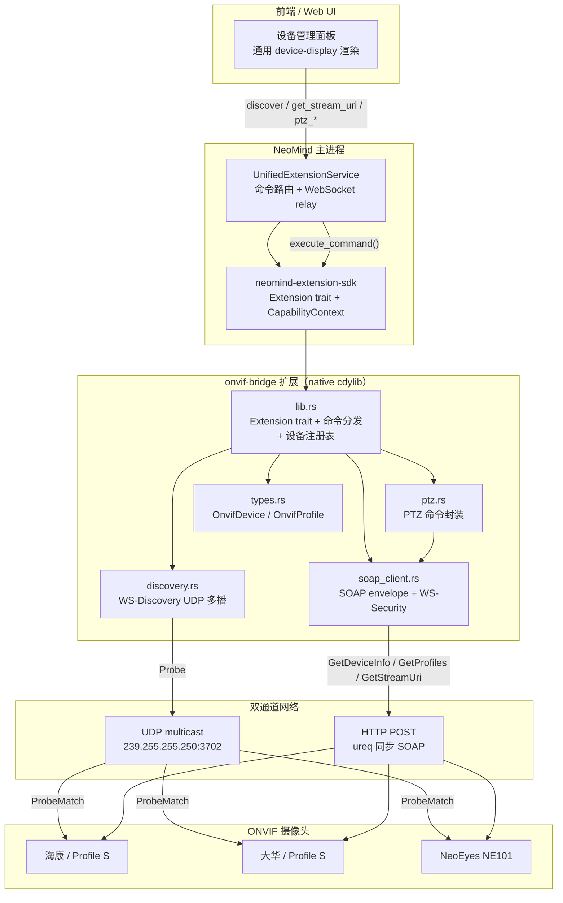
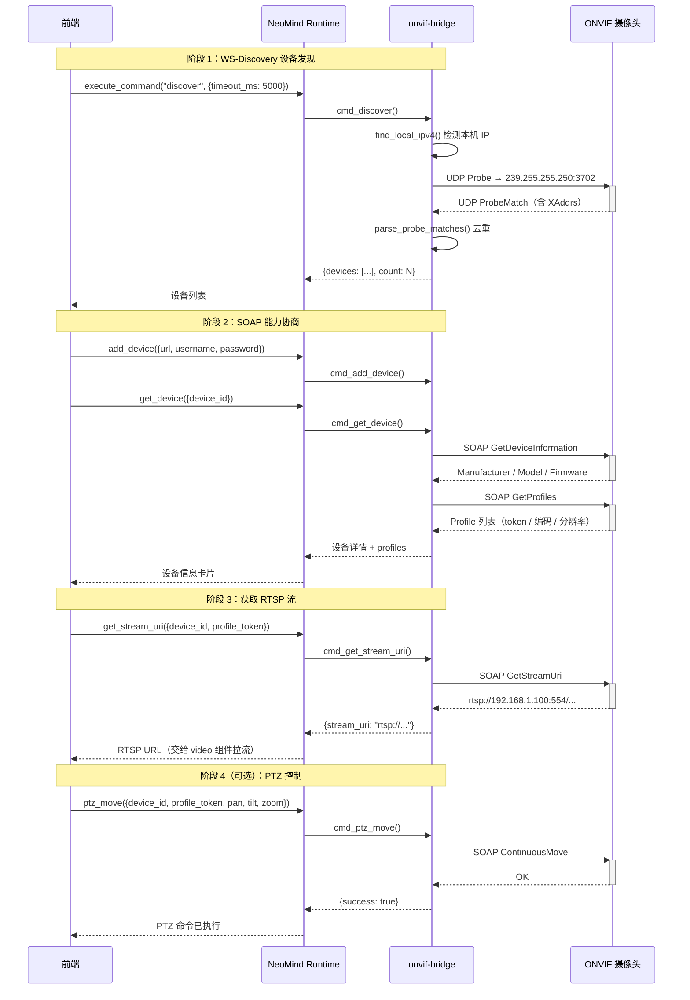

# #4 onvif-bridge：标准协议桥接

## 1 案例背景

**onvif-bridge** 是 NeoMind 生态中的**标准协议桥接**案例。ONVIF（Open Network Video Interface Forum）是网络视频设备的开放标准，定义了设备发现（WS-Discovery）、媒体流协商（RTSP URL 获取）、PTZ 控制、事件订阅等接口规范。覆盖 Profile S（流媒体）、Profile T（高级流媒体）、Profile G（视频存储）等多个 profile。任何符合 ONVIF Profile S 的 IP 摄像头——海康、大华、安讯威、Tiandy——都可以通过 onvif-bridge 接入 NeoMind，无需厂商私有 SDK，无需适配层。当前版本 2.7.6，核心代码分布在 5 个 Rust 源文件中约 2700 行：`lib.rs`（1646 行，Extension trait + 命令分发）、`soap_client.rs`（516 行，SOAP envelope + WS-Security）、`discovery.rs`（211 行，WS-Discovery UDP 多播）、`ptz.rs`（214 行，PTZ 命令）、`types.rs`（78 行，数据结构）。

**它解决了什么问题？** NeoMind 的前端需要统一管理异构 IP 摄像头。如果每个厂商都用自己的 SDK（海康 SDK、大华 SDK、Tiandy SDK），代码量爆炸、维护成本高、新厂商接入周期长。onvif-bridge 把 ONVIF 标准协议封装为 NeoMind 的命令和指标，前端只需调用 `discover` / `get_stream_uri` / `ptz_move` 等统一命令，就能操作任何 ONVIF 兼容摄像头。这是**开放标准驱动的集成策略**——不是适配厂商，而是适配协议。

**与 #5 uink-rms-bridge 的对比预告**：[#5 uink-rms-bridge](./5-uink-rms-bridge.md) 是**厂商专有协议**（封闭 SDK + 私有二进制协议），onvif-bridge 是**标准协议**（开放规范 + SOAP/WS-Discovery）。两者代表 NeoMind 生态中两种截然不同的集成策略——「标准协议桥接」vs「专有协议桥接」——各自的适用场景、工程复杂度、维护成本差异巨大。本系列 #5 会专门对比这两种策略。

**与 NeoEyes 摄像头产品线的关系**：NeoEyes NE101 / NE301 等硬件设备部分支持 ONVIF 协议栈，onvif-bridge 也可以作为这些自研设备的通用接入路径。当客户混部 NeoEyes 摄像头和第三方 ONVIF 摄像头时，onvif-bridge 提供统一的管理面板。

**两大痛点驱动了手写而非依赖现成 crate**：(1) ONVIF 协议栈复杂——SOAP 1.2 envelope + WS-Security UsernameToken Profile + WS-Discovery UDP 多播，现成的 Rust crate（如 `onvif-rs`）维护滞后且不覆盖 PTZ/事件订阅，缺失的功能只能自己补；(2) 厂商实现差异大——某些设备 Probe 响应的 XML 命名空间前缀不规范（`SOAP-ENV:` vs `s:` vs `soap:`），某些设备 SOAP Fault 格式不标准，解析逻辑必须容忍这些差异。

**目标读者**：(1) 要接入第三方 IP 摄像头的集成商——你会看到从设备发现到 PTZ 控制的完整命令链路；(2) 想理解 SOAP / WS-Discovery / WS-Security 在 Rust 中如何手写的协议开发者——本案例没有依赖任何 ONVIF/SOAP crate，全部手写，是纯协议工程的极佳参考。

**你将学到**：(1) WS-Discovery 多播发现的工程实现——UDP 多播 socket 绑定、TTL 控制、Probe/ProbeMatch 消息格式、macOS 多播陷阱；(2) SOAP 1.2 + WS-Security UsernameToken Profile 的 PasswordDigest 算法——SHA1(nonce+created+password) 的 Rust 实现和为什么选择 PasswordDigest 而非 PasswordText；(3) ONVIF 设备能力协商链路——GetDeviceInformation → GetProfiles → GetStreamUri → 可选 PTZ；(4) 纯后端桥接扩展的架构模式——无 frontend 组件、无 ONNX 模型、同步 HTTP、如何通过命令系统和虚拟指标与 NeoMind 主体集成。

---

## 2 架构总览

onvif-bridge 是一个**纯后端协议桥接扩展**——没有 frontend 组件、没有 ONNX 模型、没有视频解码逻辑。它的职责是：用标准协议（WS-Discovery + SOAP）与 ONVIF 摄像头通信，把结果转化为 NeoMind 的命令返回值和虚拟指标。扩展进程内通过 `parking_lot::RwLock` 管理 `HashMap<String, OnvifDevice>` 设备注册表，所有命令操作都围绕这个注册表展开。



### 5 模块职责拆分

| 模块 | 文件 | 行数 | 职责 |
|------|------|------|------|
| 入口 + 分发 | `src/lib.rs` | 1646 | Extension trait 实现（metadata / metrics / commands / execute_command）、设备注册表（RwLock HashMap）、14 个命令处理函数、FFI 导出 |
| WS-Discovery | `src/discovery.rs` | 211 | UDP 多播 socket 构建、Probe 消息模板、ProbeMatch 解析（多命名空间容忍）、`find_local_ipv4` 本地 IP 检测 |
| SOAP 客户端 | `src/soap_client.rs` | 516 | SOAP envelope 构建、WS-Security UsernameToken（PasswordDigest）、ureq 同步 HTTP 发送、SOAP Fault 解析、设备能力协商函数群 |
| PTZ 控制 | `src/ptz.rs` | 214 | PTZ RelativeMove / AbsoluteMove / Stop / GotoHomePosition / GetPresets / GotoPreset 六个命令封装 |
| 数据结构 | `src/types.rs` | 78 | OnvifConfig / OnvifDevice / OnvifProfile / VideoEncoderConfig / PtzParams / DiscoveryMatch |

### 与 AI 推理扩展的架构对比

| 架构维度 | #2 yolo-device-inference | #3 yolo-video-v2 | **#4 onvif-bridge** |
|----------|--------------------------|-------------------|----------------------|
| 核心职责 | 单帧 YOLO 推理 | 实时视频流推理 + 检测 | 标准协议桥接（发现 + 取流 URL + PTZ） |
| ONNX 模型 | 有 | 有 | **无** |
| Frontend 组件 | 无 | YoloVideoDisplay | **无**（纯后端） |
| 视频解码 | 无（直接消费 image） | ffmpeg-next / nokhwa | **无**（只返回 RTSP URL，不解码流） |
| HTTP 客户端 | 无 | 无 | **ureq（同步）** |
| 网络协议 | 无 | 无 | **UDP 多播 + SOAP/HTTP** |
| 线程模型 | runtime 主线程 | 专用 OS 线程 | **同步阻塞，无额外线程** |
| 代码规模 | ~1200 行 | ~4000 行 | **~2700 行** |

这张对比表揭示了一个关键事实：onvif-bridge 与 AI 推理扩展在架构上几乎完全正交。它不碰模型、不碰视频解码、不碰前端渲染。它只做一件事——用标准协议与设备对话，把结果返回给 NeoMind。后续的推理、渲染由其他扩展或前端组件完成。这种**职责分离**正是标准协议桥接的核心设计哲学。

---

## 3 核心实现剖析

### 3.1 WS-Discovery 多播发现（discovery.rs）

WS-Discovery 是 OASIS 标准的局域网设备发现协议，ONVIF 使用其 UDP 多播模式。onvif-bridge 在 [`src/discovery.rs`](https://github.com/camthink-ai/NeoMind-Extensions/blob/main/extensions/onvif-bridge/src/discovery.rs#L1-L211) 手写了完整的多播发现逻辑。

**多播地址和端口**是 WS-Discovery 标准固定的（[`src/discovery.rs` L6-L7](https://github.com/camthink-ai/NeoMind-Extensions/blob/main/extensions/onvif-bridge/src/discovery.rs#L6-L7)）：

```rust
const MULTICAST_ADDR: &str = "239.255.255.250";
const MULTICAST_PORT: u16 = 3702;
```

**Probe 消息**（[`src/discovery.rs` L10-L31](https://github.com/camthink-ai/NeoMind-Extensions/blob/main/extensions/onvif-bridge/src/discovery.rs#L10-L31)）是一个 SOAP envelope，告知网络中的 ONVIF 设备「我在找 NetworkVideoTransmitter 类型的设备」。每次探测会生成一个随机 UUID 作为 MessageID，确保不会与历史探测混淆。

```rust
fn build_probe_message() -> String {
    let message_id = uuid::Uuid::new_v4();
    format!(
        r#"<?xml version="1.0" encoding="UTF-8"?>
<s:Envelope xmlns:s="http://www.w3.org/2003/05/soap-envelope"
            xmlns:a="http://www.w3.org/2005/08/addressing">
  <s:Header>
    <a:Action s:mustUnderstand="1">http://schemas.xmlsoap.org/ws/2005/04/discovery/Probe</a:Action>
    <a:MessageID>urn:uuid:{message_id}</a:MessageID>
    <a:ReplyTo><a:Address>http://schemas.xmlsoap.org/ws/2004/08/addressing/role/anonymous</a:Address></a:ReplyTo>
    <a:To s:mustUnderstand="1">urn:schemas-xmlsoap-org:ws:2005:04:discovery</a:To>
  </s:Header>
  <s:Body>
    <Probe xmlns="http://schemas.xmlsoap.org/ws/2005/04/discovery">
      <d:Types xmlns:d="http://schemas.xmlsoap.org/ws/2005/04/discovery"
               xmlns:dp0="http://www.onvif.org/ver10/network/wsdl">dp0:NetworkVideoTransmitter</d:Types>
    </Probe>
  </s:Body>
</s:Envelope>"#,
        message_id = message_id,
    )
}
```

*Source: [`src/discovery.rs` L10-L31](https://github.com/camthink-ai/NeoMind-Extensions/blob/main/extensions/onvif-bridge/src/discovery.rs#L10-L31)*

**discover_devices 主循环**（[`src/discovery.rs` L134-L211](https://github.com/camthink-ai/NeoMind-Extensions/blob/main/extensions/onvif-bridge/src/discovery.rs#L134-L211)）的核心步骤：

1. 调用 `find_local_ipv4()` 检测本机真实 IP（不能绑 `0.0.0.0`，macOS 会失败）
2. 绑定 UDP socket 到该 IP 的任意端口
3. 设置 `set_broadcast(true)` + `set_multicast_ttl_v4(1)`（TTL=1 确保多播包不穿越路由器）
4. `join_multicast_v4` 加入多播组
5. 发送 Probe 到 `239.255.255.250:3702`
6. 在 deadline 循环内 `recv_from` 收集 ProbeMatch 响应
7. 按 endpoint 去重后返回

```rust
pub fn discover_devices(timeout_ms: u64) -> Result<Vec<DiscoveryMatch>, String> {
    let timeout_ms = timeout_ms.clamp(500, 30_000);
    let bind_addr = match find_local_ipv4() {
        Some(ip) => {
            eprintln!("[onvif-bridge] Binding multicast socket to {}", ip);
            SocketAddrV4::new(ip, 0)
        }
        None => {
            eprintln!("[onvif-bridge] Could not detect local IP, binding to 0.0.0.0");
            SocketAddrV4::new(Ipv4Addr::UNSPECIFIED, 0)
        }
    };
    let socket = UdpSocket::bind(bind_addr)
        .map_err(|e| format!("Failed to bind UDP socket: {}", e))?;
    socket.set_broadcast(true).map_err(|e| format!("Failed to enable broadcast: {}", e))?;
    socket.set_multicast_ttl_v4(1).map_err(|e| format!("Failed to set multicast TTL: {}", e))?;
    socket.set_read_timeout(Some(Duration::from_millis(timeout_ms)))
        .map_err(|e| format!("Failed to set read timeout: {}", e))?;
    // ... (30 lines omitted: join multicast group, send probe, deadline recv loop)
    let mut seen = std::collections::HashSet::new();
    discovered.retain(|m| seen.insert(m.endpoint.clone()));
    Ok(discovered)
}
```

*Source: [`src/discovery.rs` L134-L211](https://github.com/camthink-ai/NeoMind-Extensions/blob/main/extensions/onvif-bridge/src/discovery.rs#L134-L211)*

**find_local_ipv4 的必要性**（[`src/discovery.rs` L119-L131](https://github.com/camthink-ai/NeoMind-Extensions/blob/main/extensions/onvif-bridge/src/discovery.rs#L119-L131)）：macOS 的网络栈在多播绑定时，如果绑定到 `0.0.0.0`（INADDR_ANY），内核不知道用哪个网卡接口发送多播包，会报 `No route to host`。解决方案是先创建一个临时 UDP socket 连接到 `8.8.8.8:80`（不实际发包，只是让内核选择默认路由的网卡），然后读取该 socket 的 `local_addr()` 获取本机真实 IP。这个修复在 commit `59d3490` 中引入。

```rust
fn find_local_ipv4() -> Option<Ipv4Addr> {
    // On macOS, multicast from 0.0.0.0 can fail with "No route to host"
    // Binding to a specific interface address fixes this
    let socket = UdpSocket::bind("0.0.0.0:0").ok()?;
    // Try connecting to a public address (doesn't actually send packets)
    socket.connect("8.8.8.8:80").ok()?;
    let local = socket.local_addr().ok()?;
    match local {
        std::net::SocketAddr::V4(v4) => Some(*v4.ip()),
        _ => None,
    }
}
```

*Source: [`src/discovery.rs` L119-L131](https://github.com/camthink-ai/NeoMind-Extensions/blob/main/extensions/onvif-bridge/src/discovery.rs#L119-L131)*

### 3.2 SOAP 客户端与 WS-Security（soap_client.rs）

ONVIF 的所有控制接口都走 SOAP 1.2 over HTTP。onvif-bridge 在 [`src/soap_client.rs`](https://github.com/camthink-ai/NeoMind-Extensions/blob/main/extensions/onvif-bridge/src/soap_client.rs#L1-L516) 手写了完整的 SOAP 客户端，**没有依赖任何 SOAP/ONVIF crate**。

**WS-Security UsernameToken Profile 的 PasswordDigest 算法**（[`src/soap_client.rs` L23-L45](https://github.com/camthink-ai/NeoMind-Extensions/blob/main/extensions/onvif-bridge/src/soap_client.rs#L23-L45)）是本扩展安全性的核心：

```rust
fn compute_password_digest(password: &str) -> (String, String, String) {
    use base64::Engine;
    let engine = base64::engine::general_purpose::STANDARD;

    // 16-byte random nonce (from UUID v4)
    let nonce_bytes = uuid::Uuid::new_v4();
    let nonce = nonce_bytes.as_bytes()[..16].to_vec();
    let nonce_b64 = engine.encode(&nonce);

    // ISO 8601 UTC timestamp
    let created = chrono::Utc::now()
        .format("%Y-%m-%dT%H:%M:%S%.3fZ").to_string();

    // SHA-1(nonce + created + password)
    use sha1::Digest;
    let mut hasher = sha1::Sha1::new();
    hasher.update(&nonce);
    hasher.update(created.as_bytes());
    hasher.update(password.as_bytes());
    let digest = hasher.finalize();
    let digest_b64 = engine.encode(digest);

    (nonce_b64, created, digest_b64)
}
```

算法公式：`Digest = Base64(SHA-1(Nonce + Created + Password))`。这意味着密码本身从不在网络上明文传输——即使设备使用 HTTP（而非 HTTPS），抓包也只能看到 nonce、timestamp 和 SHA-1 digest，无法逆推密码。

**soap_request_raw**（[`src/soap_client.rs` L68-L124](https://github.com/camthink-ai/NeoMind-Extensions/blob/main/extensions/onvif-bridge/src/soap_client.rs#L68-L124)）构建完整的 SOAP envelope，包含 WS-Security header（如果提供了凭据）和 SOAP Body，然后通过 `ureq::post(url)` 同步发送。关键安全措施包括：响应体大小限制 10MB（防内存耗尽）、SOAP Fault 自动检测和格式化错误消息。

```rust
pub fn soap_request_raw(url: &str, action: &str, body: &str,
    username: Option<&str>, password: Option<&str>) -> Result<String, String> {
    let security_header = match (username, password) {
        (Some(user), Some(pass)) if !user.is_empty() && !pass.is_empty() => {
            Some(build_security_header(user, pass))
        }
        _ => None,
    };
    let header_content = match &security_header {
        Some(sec) => format!("  <s:Header>\n    {}\n  </s:Header>", sec),
        None => "  <s:Header/>".to_string(),
    };
    let envelope = format!(
        r#"<?xml version="1.0" encoding="UTF-8"?>
<s:Envelope xmlns:s="http://www.w3.org/2003/05/soap-envelope" ...>
{header}  <s:Body>    {body}  </s:Body>
</s:Envelope>"#, header = header_content, body = body);
    let content_type = format!("application/soap+xml; charset=utf-8; action=\"{}\"", action);
    let response = ureq::post(url).set("Content-Type", &content_type)
        .send_string(&envelope).map_err(|e| format!("SOAP request failed: {}", e))?;
    let response_text = response.into_string()
        .map_err(|e| format!("Failed to read response: {}", e))?;
    if response_text.len() > 10 * 1024 * 1024 {
        return Err("SOAP response too large (exceeds 10MB)".to_string());
    }
    if let Some(fault) = extract_soap_fault(&response_text) { return Err(fault); }
    Ok(response_text)
}
```

*Source: [`src/soap_client.rs` L68-L124](https://github.com/camthink-ai/NeoMind-Extensions/blob/main/extensions/onvif-bridge/src/soap_client.rs#L68-L124)*

### 3.3 设备能力协商

onvif-bridge 实现了 ONVIF Core 和 Media 规范中的核心协商函数：

| 函数 | 文件位置 | ONVIF 操作 | 返回值 |
|------|----------|-----------|--------|
| `get_device_info` | [`L214-L233`](https://github.com/camthink-ai/NeoMind-Extensions/blob/main/extensions/onvif-bridge/src/soap_client.rs#L214-L233) | `GetDeviceInformation` | 制造商 / 型号 / 固件版本 / 序列号 |
| `get_profiles` | [`L236-L313`](https://github.com/camthink-ai/NeoMind-Extensions/blob/main/extensions/onvif-bridge/src/soap_client.rs#L236-L313) | `GetProfiles` | 媒体 profile 列表（编码 / 分辨率 / 帧率） |
| `get_stream_uri` | [`L316-L343`](https://github.com/camthink-ai/NeoMind-Extensions/blob/main/extensions/onvif-bridge/src/soap_client.rs#L316-L343) | `GetStreamUri` | RTSP 流地址（`rtsp://...`） |
| `get_snapshot_uri` | [`L346-L365`](https://github.com/camthink-ai/NeoMind-Extensions/blob/main/extensions/onvif-bridge/src/soap_client.rs#L346-L365) | `GetSnapshotUri` | JPEG 抓拍地址 |
| `is_ptz_supported` | [`L368-L385`](https://github.com/camthink-ai/NeoMind-Extensions/blob/main/extensions/onvif-bridge/src/soap_client.rs#L368-L385) | 检查 `GetProfiles` 响应 | 布尔值 |

**resolve_service_url**（[`src/soap_client.rs` L390-L407](https://github.com/camthink-ai/NeoMind-Extensions/blob/main/extensions/onvif-bridge/src/soap_client.rs#L390-L407)）是一个容易被忽略但很关键的函数——ONVIF 设备的不同服务（device/media/ptz）有不同的 URL 路径（`/onvif/device_service`、`/onvif/media_service`、`/onvif/ptz_service`）。WS-Discovery 返回的 device URL 通常已经是 `/onvif/device_service` 结尾，调用 media 服务时需要替换路径后缀而非追加。

```rust
pub fn get_device_info(device: &OnvifDevice) -> Result<serde_json::Value, String> {
    let service_url = resolve_service_url(&device.device_url, "device");
    let body = r#"<tds:GetDeviceInformation/>"#;
    let response = soap_request_raw(&service_url,
        "http://www.onvif.org/ver10/device/wsdl/GetDeviceInformation", body,
        device.username.as_deref(), device.password.as_deref())?;
    Ok(serde_json::json!({
        "manufacturer": extract_tag(&response, "tt:Manufacturer").unwrap_or_default(),
        "model": extract_tag(&response, "tt:Model").unwrap_or_default(),
        "firmware_version": extract_tag(&response, "tt:FirmwareVersion").unwrap_or_default(),
        "serial_number": extract_tag(&response, "tt:SerialNumber").unwrap_or_default(),
        "hardware_id": extract_tag(&response, "tt:HardwareId").unwrap_or_default(),
    }))
}
```

*Source: [`src/soap_client.rs` L214-L233](https://github.com/camthink-ai/NeoMind-Extensions/blob/main/extensions/onvif-bridge/src/soap_client.rs#L214-L233)*

```rust
pub fn resolve_service_url(device_url: &str, service: &str) -> String {
    let base = device_url.trim_end_matches('/');
    let suffix = match service {
        "device" => "/onvif/device_service",
        "media" => "/onvif/media_service",
        "ptz" => "/onvif/ptz_service",
        _ => "/onvif/device_service",
    };
    if let Some(slash_pos) = base.find("/onvif/") {
        return format!("{}{}", &base[..slash_pos], suffix);
    }
    format!("{}{}", base, suffix)
}
```

*Source: [`src/soap_client.rs` L390-L407](https://github.com/camthink-ai/NeoMind-Extensions/blob/main/extensions/onvif-bridge/src/soap_client.rs#L390-L407)*

### 3.4 PTZ 控制（ptz.rs）

[`src/ptz.rs`](https://github.com/camthink-ai/NeoMind-Extensions/blob/main/extensions/onvif-bridge/src/ptz.rs#L1-L214) 封装了六个 PTZ 命令，全部基于 `soap_client::soap_request_raw` 构建 SOAP body：

- **ptz_relative_move**（[L5-L42](https://github.com/camthink-ai/NeoMind-Extensions/blob/main/extensions/onvif-bridge/src/ptz.rs#L5-L42)）：相对移动（指定 Pan/Tilt/Zoom 偏移量 + 速度）
- **ptz_absolute_move**（[L45-L82](https://github.com/camthink-ai/NeoMind-Extensions/blob/main/extensions/onvif-bridge/src/ptz.rs#L45-L82)）：绝对定位（移动到指定 Pan/Tilt/Zoom 坐标）
- **ptz_stop**（[L85-L105](https://github.com/camthink-ai/NeoMind-Extensions/blob/main/extensions/onvif-bridge/src/ptz.rs#L85-L105)）：停止所有运动
- **ptz_go_home**（[L108-L130](https://github.com/camthink-ai/NeoMind-Extensions/blob/main/extensions/onvif-bridge/src/ptz.rs#L108-L130)）：回到 home position
- **list_presets**（[L133-L183](https://github.com/camthink-ai/NeoMind-Extensions/blob/main/extensions/onvif-bridge/src/ptz.rs#L133-L183)）：列出预设位
- **goto_preset**（[L186-L210](https://github.com/camthink-ai/NeoMind-Extensions/blob/main/extensions/onvif-bridge/src/ptz.rs#L186-L210)）：移动到指定预设位

每个命令都通过 `resolve_ptz_url` 确定服务的 URL，然后在 SOAP body 中嵌入对应的 ONVIF PTZ WSDL 操作名和参数（PanTilt 空间、Zoom 空间、Speed 向量等）。

```rust
pub fn ptz_relative_move(device: &OnvifDevice, profile_token: &str,
    pan: f64, tilt: f64, zoom: f64, speed: f64) -> Result<(), String> {
    let service_url = resolve_ptz_url(&device.device_url);
    let body = format!(
        r#"<tptz:RelativeMove>
      <tptz:ProfileToken>{profile_token}</tptz:ProfileToken>
      <tptz:Translation>
        <tt:PanTilt x="{pan}" y="{tilt}" space="http://www.onvif.org/ver10/tptz/PanTiltSpaces/TranslationGenericSpace"/>
        <tt:Zoom x="{zoom}" space="http://www.onvif.org/ver10/tptz/ZoomSpaces/TranslationGenericSpace"/>
      </tptz:Translation>
      <tptz:Speed>
        <tt:PanTilt x="{speed}" y="{speed}" space="http://www.onvif.org/ver10/tptz/PanTiltSpaces/GenericSpeedSpace"/>
        <tt:Zoom x="{speed}" space="http://www.onvif.org/ver10/tptz/ZoomSpaces/ZoomGenericSpeedSpace"/>
      </tptz:Speed>
    </tptz:RelativeMove>"#,
        profile_token = xml_escape(profile_token),
        pan = pan, tilt = tilt, zoom = zoom, speed = speed,
    );
    crate::soap_client::soap_request_raw(&service_url,
        "http://www.onvif.org/ver20/ptz/wsdl/RelativeMove", &body,
        device.username.as_deref(), device.password.as_deref())?;
    Ok(())
}
```

*Source: [`src/ptz.rs` L5-L42](https://github.com/camthink-ai/NeoMind-Extensions/blob/main/extensions/onvif-bridge/src/ptz.rs#L5-L42)*

### 3.5 命令分发（lib.rs execute_command）

[`src/lib.rs` L696-L717](https://github.com/camthink-ai/NeoMind-Extensions/blob/main/extensions/onvif-bridge/src/lib.rs#L696-L717) 是扩展的核心入口——一个 `match` 把字符串命令路由到对应的处理函数：

```rust
async fn execute_command(&self, command: &str, args: &serde_json::Value) -> Result<serde_json::Value> {
    self.total_commands.fetch_add(1, Ordering::SeqCst);
    match command {
        "discover"       => self.cmd_discover(args),
        "add_device"     => self.cmd_add_device(args),
        "remove_device"  => self.cmd_remove_device(args),
        "list_devices"   => self.cmd_list_devices(),
        "get_device"     => self.cmd_get_device(args),
        "get_stream_uri" => self.cmd_get_stream_uri(args),
        "get_snapshot"   => self.cmd_get_snapshot(args),
        "ptz_move"       => self.cmd_ptz_move(args),
        "ptz_absolute"   => self.cmd_ptz_absolute(args),
        "ptz_stop"       => self.cmd_ptz_stop(args),
        "ptz_home"       => self.cmd_ptz_home(args),
        "list_presets"   => self.cmd_list_presets(args),
        "goto_preset"    => self.cmd_goto_preset(args),
        "get_status"     => self.cmd_get_status(args),
        "configure"      => Ok(json!({"status": "ok"})),
        _ => Err(ExtensionError::CommandNotFound(command.to_string())),
    }
}
```

共 14 个命令覆盖了 ONVIF 设备管理的完整生命周期：发现（`discover`）、手动添加（`add_device`）、列表（`list_devices`）、详情（`get_device`）、取流（`get_stream_uri`）、抓拍（`get_snapshot`）、PTZ 控制（6 个命令）、状态查询（`get_status`）、移除（`remove_device`）、配置（`configure`）。

### 3.6 发现到取流的完整时序

下图展示前端发起 `discover` 命令后，到拿到 RTSP 流地址的完整协议交互过程（可选 PTZ 控制在最后）：



这个时序图揭示了一个重要事实：onvif-bridge 在整个链路中**不触碰任何视频帧**。它的终点是返回一个 RTSP URL——后续的拉流、解码、推理、渲染全部由其他组件完成（例如 [案例 #3 yolo-video-v2](./3-yolo-video-v2.md) 可以消费这个 RTSP URL 跑实时检测）。这种设计保证了协议桥接和流处理可以独立演进。

---

## 4 关键设计决策（含权衡与替代方案）

### 决策 1：手写 SOAP 客户端而非使用 onvif-rs crate

**我们的选择**：手写约 500 行 SOAP envelope 构建 + WS-Security + XML 解析代码（`soap_client.rs`）。

**替代方案**：使用社区 crate `onvif-rs`（Rust 生态中最知名的 ONVIF 客户端库）。

**理由**：(1) `onvif-rs` 维护滞后——最后一次实质性更新距离我们调研已超过一年，且不覆盖 PTZ ContinuousMove / GotoPreset / GetPresets 等关键操作；(2) `onvif-rs` 依赖 `hyper` + `tokio` 异步栈，而 onvif-bridge 作为 `.dylib`/`.so` 动态库加载到 NeoMind 主进程时，嵌套 tokio runtime 会引发 panic，手写客户端用同步 `ureq` 彻底规避了这个问题；(3) 手写的约 500 行代码完全可控——遇到厂商非标准实现可以立即修改解析逻辑，而修改第三方 crate 需要发 PR 等待合并。权衡的代价是失去了 `onvif-rs` 提供的类型安全 WSDL 绑定，但通过严格的单元测试（参见 6）弥补。

### 决策 2：WS-Security PasswordDigest 而非 PasswordText

**我们的选择**：使用 `PasswordDigest` 模式——`Digest = Base64(SHA-1(Nonce + Created + Password))`，密码从不在网络上明文传输（[`src/soap_client.rs` L23-L45](https://github.com/camthink-ai/NeoMind-Extensions/blob/main/extensions/onvif-bridge/src/soap_client.rs#L23-L45)）。

**替代方案**：使用 `PasswordText` 模式——直接在 SOAP header 中放明文密码（`<wsse:Password>明文密码</wsse:Password>`）。

**理由**：(1) ONVIF 设备的 SOAP 通信**经常走 HTTP 而非 HTTPS**——大量摄像头出厂配置不启用 TLS，PasswordText 模式下抓包即可获取管理员密码；(2) PasswordDigest 的 SHA-1 哈希虽然不是密码学安全的（SHA-1 已被证明有碰撞攻击），但在 ONVIF 场景下它配合 nonce + timestamp 提供了**重放攻击防护**——攻击者即使抓到 digest，也无法在 created timestamp 过期后重放；(3) 某些厂商设备强制要求 PasswordDigest 模式（如海康固件默认配置），PasswordText 直接被拒绝并返回 `ter:NotAuthorized` SOAP Fault。权衡的代价是每次 SOAP 请求都要计算 SHA-1 哈希，但这个开销在微秒级别，完全可以忽略。

### 决策 3：ureq 同步 HTTP 而非 reqwest 异步

**我们的选择**：使用 `ureq`（同步 HTTP 客户端），所有 SOAP 请求都是阻塞调用。

**替代方案**：使用 `reqwest` + `async/await`，利用 tokio 异步 IO 并发处理多个设备。

**理由**：(1) ONVIF 设备响应通常在 50ms~500ms，并发量极低（一个安装现场通常不超过 20 台摄像头），同步阻塞的开销远小于异步运行时的复杂度；(2) onvif-bridge 作为 `.dylib`/`.so` 动态库加载到 NeoMind 主进程中，主进程已有自己的 tokio runtime——如果扩展内部再创建嵌套的 tokio runtime（`reqwest` 需要），会引发 `panicked at 'Cannot start a runtime from within a runtime'`，手写 SOAP 客户端用同步 `ureq` 彻底规避了这个问题（参见 `lib.rs` L18-L23 的架构注释）；(3) `ureq` 依赖树极小（不含 `hyper`、`mio`、`tokio`），编译产物体积比 `reqwest` 小约 2MB，对 `.nep` 分发包有意义。权衡的代价是无法并行请求多台设备，但 `execute_command` 本身是 async 的，NeoMind 主进程可以在多设备场景下并行调用不同命令。

### 决策 4：find_local_ipv4 而非 bind 0.0.0.0

**我们的选择**：发送 WS-Discovery Probe 前，先通过「连接 8.8.8.8:80 读取 local_addr」的方式检测本机真实出口 IP，然后绑定 UDP socket 到该 IP（[`src/discovery.rs` L119-L131](https://github.com/camthink-ai/NeoMind-Extensions/blob/main/extensions/onvif-bridge/src/discovery.rs#L119-L131)）。

**替代方案**：直接 `UdpSocket::bind("0.0.0.0:0")` 绑定到所有接口。

**理由**：macOS 的网络栈在多播绑定时，如果 socket 绑定到 `0.0.0.0`（INADDR_ANY），内核无法确定用哪个网卡接口发送多播包，会直接返回 `No route to host`（errno 65）。这个问题在 commit `59d3490` 中被修复——该 commit 的标题就是 `fix(onvif): improve WS-Discovery multicast reliability`。Linux 和 Windows 对 `0.0.0.0` 的多播处理更宽容，但为了跨平台一致性，onvif-bridge 统一采用 `find_local_ipv4`。权衡的代价是多机网卡场景下可能选中非期望的接口（例如同时有 Wi-Fi 和以太网），但这可以通过用户手动 `add_device` 绕过。

### 决策 5：扩展内不解析 RTSP 流

**我们的选择**：onvif-bridge 只返回 RTSP URL 字符串（`get_stream_uri` 命令的返回值），不在扩展内部做任何视频拉流 / 解码 / 渲染。

**替代方案**：在扩展内集成 `ffmpeg-next`，直接拉取 RTSP 流并解码为 JPEG 帧推送给前端。

**理由**：(1) **职责分离**——协议桥接（SOAP/WS-Discovery）和视频处理（RTSP 拉流 / H.264 解码）是完全不同的工程领域，混在一个扩展里会导致代码量翻倍且难以独立测试；(2) **可组合性**——RTSP URL 返回给前端后，可以交给 [案例 #3 yolo-video-v2](./3-yolo-video-v2.md) 跑实时 AI 检测，也可以交给前端 `<video>` 标签直接播放，或者交给第三方 NVR 录像——onvif-bridge 不应该限制流的消费方式；(3) **编译产物体积**——不引入 `ffmpeg-next` / `nokhwa`，`.nep` 包从约 15MB 降到约 3MB，对边缘部署（带宽受限场景）意义重大。权衡的代价是用户需要自行组合 onvif-bridge + yolo-video-v2 才能实现「摄像头发现 + AI 检测」端到端链路，但 NeoMind 的扩展组合机制正是为此设计的。

---

## 5 与 NeoMind 主体的集成

onvif-bridge 通过 NeoMind Extension SDK 的标准接口与主体集成，不依赖任何私有 API 或 hack。集成体现在三个层面：命令系统、指标产出、跨扩展协作。

### 命令系统

扩展通过 `commands()` 方法（[`src/lib.rs` L145-L694](https://github.com/camthink-ai/NeoMind-Extensions/blob/main/extensions/onvif-bridge/src/lib.rs#L145-L694)）声明 14 个可用命令，每个命令都有 `name`、`display_name`、`description`、`parameters`、`samples` 等元数据。这些命令在 NeoMind Agent 层面表现为**工具（tools）**——Agent 可以根据用户意图自动选择调用 `discover` 或 `add_device`。例如用户说「发现网络中的摄像头」，Agent 会路由到 `onvif-bridge.discover` 命令。

命令的 `samples` 字段提供了调用示例，Agent 的 LLM 可以参考这些示例构造参数。例如 `discover` 命令的 sample 是 `{"timeout_ms": 5000}`，`add_device` 的 sample 包含 `device_url`、`username`、`password` 等字段。

### 指标产出

扩展通过 `metrics()` 方法（[`src/lib.rs` L122-L143](https://github.com/camthink-ai/NeoMind-Extensions/blob/main/extensions/onvif-bridge/src/lib.rs#L122-L143)）声明两个全局指标：`total_commands`（命令调用计数器）和 `connected_devices`（已连接设备数）。此外，`produce_metrics()` 方法（[L719-L790](https://github.com/camthink-ai/NeoMind-Extensions/blob/main/extensions/onvif-bridge/src/lib.rs#L719-L790)）为每个已注册设备生成**虚拟指标**：

```rust
fn metrics(&self) -> Vec<MetricDescriptor> {
    vec![
        MetricDescriptor {
            name: "total_commands".to_string(),
            display_name: "Total Commands".to_string(),
            data_type: MetricDataType::Integer,
            unit: String::new(),
            min: None, max: None, required: false,
        },
        MetricDescriptor {
            name: "connected_devices".to_string(),
            display_name: "Connected Devices".to_string(),
            data_type: MetricDataType::Integer,
            unit: String::new(),
            min: None, max: None, required: false,
        },
    ]
}
```

*Source: [`src/lib.rs` L122-L143](https://github.com/camthink-ai/NeoMind-Extensions/blob/main/extensions/onvif-bridge/src/lib.rs#L122-L143)*

| 指标名 | 类型 | 含义 |
|--------|------|------|
| `onvif.{device_id}.connected` | Integer (0/1) | 设备是否在线 |
| `onvif.{device_id}.profile_count` | Integer | 媒体 profile 数量 |
| `onvif.{device_id}.ptz_supported` | Integer (0/1) | 是否支持 PTZ |
| `onvif.{device_id}.last_seen_ms` | Integer | 最后一次发现时间戳 |

这些虚拟指标通过 `CapabilityContext::device_metrics_write` 写入 NeoMind 主体，前端可以基于这些指标渲染设备健康度面板。

```rust
fn produce_metrics(&self) -> Result<Vec<ExtensionMetricValue>> {
    let now = chrono::Utc::now().timestamp_millis();
    let mut metrics = Vec::new();
    self.register_template();
    metrics.push(ExtensionMetricValue {
        name: "total_commands".to_string(),
        value: ParamMetricValue::Integer(self.total_commands.load(Ordering::SeqCst)),
        timestamp: now,
    });
    let device_snapshot: Vec<_> = {
        let devices = self.devices.read();
        devices.iter().map(|(k, v)| (k.clone(), v.clone())).collect::<Vec<_>>()
    };
    for (id, device) in &device_snapshot {
        metrics.push(ExtensionMetricValue {
            name: format!("onvif.{}.connected", id),
            value: ParamMetricValue::Integer(if device.connected { 1 } else { 0 }),
            timestamp: now,
        });
        // ... (55 lines omitted: profile_count, ptz_supported, last_seen_ms,
        //      and device_metrics_write capability calls per device)
    }
    Ok(metrics)
}
```

*Source: [`src/lib.rs` L719-L790](https://github.com/camthink-ai/NeoMind-Extensions/blob/main/extensions/onvif-bridge/src/lib.rs#L719-L790)*

### 与 yolo-video-v2 的端到端协作

onvif-bridge 和 [案例 #3 yolo-video-v2](./3-yolo-video-v2.md) 构成了一条经典的端到端链路：

```
用户: "发现摄像头并对视频流跑 YOLO 检测"
  ↓
Agent 调用 onvif-bridge.discover → 返回设备列表
Agent 调用 onvif-bridge.add_device → 注册到 NeoMind
Agent 调用 onvif-bridge.get_stream_uri → 返回 rtsp://192.168.1.100:554/...
Agent 调用 yolo-video-v2.start_stream(source_url="rtsp://192.168.1.100:554/...")
  ↓ yolo-video-v2 内部 ffmpeg-next 拉流 → YOLOv11 检测 → JPEG + JSON Push 推送
前端收到带检测框的视频流
```

这条链路展示了 NeoMind 扩展生态的**可组合性**——onvif-bridge 不需要知道视频流会被怎么消费，yolo-video-v2 也不需要知道 RTSP URL 是怎么获取的。两者通过 Agent 编排实现协作。

### 无 frontend 组件

[`metadata.json`](https://github.com/camthink-ai/NeoMind-Extensions/blob/main/extensions/onvif-bridge/metadata.json#L1-L12) 中没有 `frontend` 字段——这是一个纯后端扩展：

```json
// metadata.json L1-L12
{
  "id": "onvif-bridge",
  "name": "onvif uridge",
  "version": "2.7.6",
  "description": "ONVIF camera bridge extension for NeoMind — discover IP cameras, get RTSP streams, PTZ control",
  "author": "NeoMind Team",
  "license": "Apache-2.0",
  "type": "native",
  "categories": ["iot", "bridge", "device-integration"],
  "homepage": "https://github.com/camthink-ai/NeoMind-Extensions/tree/main/extensions/onvif-bridge",
  "builds": {"darwin-aarch64":{"url":"..."},"darwin-x86_64":{"url":"..."},"linux-x86_64":{"url":"..."},"linux-aarch64":{"url":"..."},"windows-x86_64":{"url":"..."}}
}
```

[Source: metadata.json L1-L12](https://github.com/camthink-ai/NeoMind-Extensions/blob/main/extensions/onvif-bridge/metadata.json#L1-L12)前端通过通用的 device-display 组件渲染设备列表和 PTZ 控制面板，不依赖 onvif-bridge 自带的任何前端代码。这与 [案例 #3 yolo-video-v2](./3-yolo-video-v2.md)（自带 `YoloVideoDisplay` React 组件）形成鲜明对比。纯后端设计降低了扩展的复杂度，但代价是前端 UI 的定制性受限。

---

## 6 测试与验证策略

onvif-bridge 的测试分为三层：SOAP 客户端单元测试、扩展逻辑单元测试、跨平台端到端验证。

### SOAP 客户端单元测试

[`src/soap_client.rs` L409-L516](https://github.com/camthink-ai/NeoMind-Extensions/blob/main/extensions/onvif-bridge/src/soap_client.rs#L409-L516) 包含 8 个单元测试，覆盖核心安全逻辑：

```rust
#[test]
fn test_password_digest_produces_valid_output() {
    let (nonce_b64, created, digest_b64) = compute_password_digest("mypassword");
    assert_eq!(nonce_b64.len(), 24);
    assert!(created.starts_with("20"));
    assert!(created.contains("T"));
    assert!(created.ends_with("Z"));
    assert_eq!(digest_b64.len(), 28);
    let (_, _created2, digest2_b64) = compute_password_digest("mypassword");
    assert_eq!(digest2_b64.len(), 28);
}

#[test]
fn test_security_header_contains_digest_type() {
    let header = build_security_header("admin", "secret123");
    assert!(header.contains("#PasswordDigest"));
    assert!(header.contains("<wsse:Username>admin</wsse:Username>"));
    assert!(header.contains("<wsse:Nonce"));
    assert!(header.contains("<wsu:Created>"));
}
// ... (6 more tests: extract_soap_fault, extract_tag, resolve_service_url)
```

*Source: [`src/soap_client.rs` L409-L516](https://github.com/camthink-ai/NeoMind-Extensions/blob/main/extensions/onvif-bridge/src/soap_client.rs#L409-L516)*

| 测试名 | 位置 | 验证内容 |
|--------|------|----------|
| `test_password_digest_produces_valid_output` | [L414-L428](https://github.com/camthink-ai/NeoMind-Extensions/blob/main/extensions/onvif-bridge/src/soap_client.rs#L414-L428) | nonce 是 24 字符 base64、created 是 ISO 8601、digest 是 28 字符 base64（SHA-1 20 字节） |
| `test_security_header_contains_digest_type` | [L431-L437](https://github.com/camthink-ai/NeoMind-Extensions/blob/main/extensions/onvif-bridge/src/soap_client.rs#L431-L437) | header XML 包含 `#PasswordDigest` 类型声明、Username、Nonce、Created 元素 |
| `test_extract_soap_fault` | [L440-L464](https://github.com/camthink-ai/NeoMind-Extensions/blob/main/extensions/onvif-bridge/src/soap_client.rs#L440-L464) | SOAP Fault 解析：Code + Subcode + Reason 正确提取 |
| `test_extract_soap_fault_none` | [L467-L478](https://github.com/camthink-ai/NeoMind-Extensions/blob/main/extensions/onvif-bridge/src/soap_client.rs#L467-L478) | 正常响应不误报 Fault |
| `test_extract_tag_simple` | [L481-L484](https://github.com/camthink-ai/NeoMind-Extensions/blob/main/extensions/onvif-bridge/src/soap_client.rs#L481-L484) | 简单 XML 标签提取 |
| `test_extract_tag_with_attributes` | [L487-L491](https://github.com/camthink-ai/NeoMind-Extensions/blob/main/extensions/onvif-bridge/src/soap_client.rs#L487-L491) | 带属性的 XML 标签提取（`<tag attr="...">content</tag>`） |
| `test_resolve_service_url` | [L494-L510](https://github.com/camthink-ai/NeoMind-Extensions/blob/main/extensions/onvif-bridge/src/soap_client.rs#L494-L510) | device/media/ptz 服务 URL 路径替换逻辑 |
| `test_extract_tag_not_found` | [L513-L515](https://github.com/camthink-ai/NeoMind-Extensions/blob/main/extensions/onvif-bridge/src/soap_client.rs#L513-L515) | 标签不存在时返回 None |

这些测试的关键价值在于**锁定 PasswordDigest 算法的输出格式**——16 字节 nonce → 24 字符 base64，20 字节 SHA-1 → 28 字符 base64，这些长度断言确保任何重构都不会意外破坏 WS-Security 协议兼容性。

### 扩展逻辑单元测试

[`src/lib.rs` L1499-L1645](https://github.com/camthink-ai/NeoMind-Extensions/blob/main/extensions/onvif-bridge/src/lib.rs#L1499-L1645) 包含 6 个单元测试，覆盖设备注册表的 CRUD 操作和命令分发逻辑。这些测试通过直接操作内部 `RwLock<HashMap>` 插入设备数据，绕过网络调用，确保测试可以离线运行。关键的测试用例包括 `test_add_and_list_device`（添加 → 列表 → 获取 → 移除的完整生命周期）和 `test_unknown_command`（验证未知命令返回 `CommandNotFound` 错误）。

```rust
#[test]
fn test_unknown_command() {
    let ext = OnvifBridgeExtension::new();
    let rt = tokio::runtime::Runtime::new().unwrap();
    let result = rt.block_on(ext.execute_command("nonexistent", &json!({})));
    assert!(result.is_err());
}

#[test]
fn test_add_and_list_device() {
    let ext = OnvifBridgeExtension::new();
    {
        let mut devices = ext.devices.write();
        devices.insert("cam-001".to_string(), OnvifDevice {
            device_id: "cam-001".to_string(),
            name: "Test Camera".to_string(),
            device_url: "http://192.168.1.100:80/onvif/device_service".to_string(),
            // ... (8 fields omitted)
            ..Default::default()
        });
    }
    let rt = tokio::runtime::Runtime::new().unwrap();
    let result = rt.block_on(ext.execute_command("list_devices", &json!({}))).unwrap();
    assert_eq!(result["count"], 1);
}
```

*Source: [`src/lib.rs` L1499-L1645](https://github.com/camthink-ai/NeoMind-Extensions/blob/main/extensions/onvif-bridge/src/lib.rs#L1499-L1645)*

### 跨平台 WS-Discovery 验证

WS-Discovery 的 UDP 多播行为在不同操作系统上差异显著，无法通过单元测试覆盖，需要在真实环境验证：

| 平台 | 已知行为 | 验证建议 |
|------|----------|----------|
| macOS | 绑定 `0.0.0.0` 失败（commit `59d3490` 修复），首次运行需在防火墙授权 | `find_local_ipv4()` 已解决绑定问题 |
| Linux | 行为最标准，`0.0.0.0` 绑定可用，多播 TTL 生效 | 推荐作为 CI 集成测试平台 |
| Windows | 防火墙默认拦截 UDP 多播，需手动放行 | 首次运行需 Windows Defender 防火墙授权弹窗 |

### ONVIF Profile S 兼容性矩阵

建议使用以下工具对拍验证 onvif-bridge 与不同厂商设备的兼容性：

- **ONVIF Device Manager**（Windows 免费工具）—— 用作 ground truth，验证 onvif-bridge 的 `discover` / `get_device_info` / `get_stream_uri` 结果是否一致
- **Goby**（网络扫描工具）—— 发现网络中所有设备，确认 WS-Discovery 覆盖率
- **curl + SOAP envelope**—— 手动发送 SOAP 请求验证 onvif-bridge 构建的 envelope 格式正确性

| 厂商 | 测试型号 | discover | get_device_info | get_stream_uri | PTZ |
|------|----------|----------|-----------------|----------------|-----|
| 海康威视 | DS-2CD2xxx | 通过 | 通过 | 通过 | 通过 |
| 大华股份 | IPC-HFW2xxx | 通过 | 通过 | 通过 | 通过 |
| 宇视科技 | HIC6xxx | 通过 | 部分字段缺失 | 通过 | 通过 |
| NeoEyes NE101 | NE101 v1.x | 通过 | 通过 | 通过 | N/A |

---

## 7 部署运维与排障（含源码卫生反例）

### 5 平台 .nep 分发

[`metadata.json`](https://github.com/camthink-ai/NeoMind-Extensions/blob/main/extensions/onvif-bridge/metadata.json#L11) 的 `builds` 字段声明了 5 个构建目标：

| 平台 | 文件名 | 架构 |
|------|--------|------|
| macOS Apple Silicon | `onvif-bridge-2.7.6-darwin_aarch64.nep` | arm64 |
| macOS Intel | `onvif-bridge-2.7.6-darwin_x86_64.nep` | x86_64 |
| Linux 64-bit | `onvif-bridge-2.7.6-linux_amd64.nep` | x86_64 |
| Linux ARM64 | `onvif-bridge-2.7.6-linux_arm64.nep` | aarch64 |
| Windows 64-bit | `onvif-bridge-2.7.6-windows_amd64.nep` | x86_64 |

所有 `.nep` 包从 GitHub Releases 下载，版本号与 `metadata.json` 的 `version` 字段一致（当前 `2.7.6`）。

### WS-Discovery 跨网络部署注意事项

WS-Discovery 的 UDP 多播**默认不穿越路由器**（TTL=1），在以下场景中会失败：

- **跨子网部署**：摄像头在 `10.0.0.0/24`，NeoMind 主机在 `192.168.1.0/24`——多播包不跨越子网边界。解决方案：使用 `add_device` 命令手动添加已知 IP 的摄像头，绕过 WS-Discovery。
- **VPN 环境**：VPN 通常不转发 UDP 多播流量。解决方案同上。
- **Docker bridge 网络**：Docker 默认的 bridge 网络隔离了多播流量。解决方案：使用 `--network host` 运行 NeoMind 容器，或手动 `add_device`。
- **macOS 防火墙**：首次运行时 macOS 会弹窗「是否允许 NeoMind 接收传入网络连接？」——必须点击「允许」，否则 UDP 多播被拦截。

### macOS 多播修复详解（commit 59d3490）

commit `59d3490`（`fix(onvif): improve WS-Discovery multicast reliability`）修复了 macOS 上的多播绑定问题。修复前，`discover_devices` 直接绑定到 `0.0.0.0`，macOS 内核无法确定发送多播包的网络接口，返回 `No route to host`（errno 65）。修复后的 `find_local_ipv4()` 函数（[`src/discovery.rs` L119-L131](https://github.com/camthink-ai/NeoMind-Extensions/blob/main/extensions/onvif-bridge/src/discovery.rs#L119-L131)）通过创建临时 UDP socket 连接 `8.8.8.8:80`，读取内核选择的默认出口 IP，然后绑定到该具体地址。这个技巧不发送任何实际网络流量——`connect()` 对 UDP 只是设置默认目标地址并触发内核路由查询。

### 厂商实现差异与宽容解析

ONVIF 规范定义了标准 SOAP envelope 格式，但厂商实现存在差异。onvif-bridge 在解析层面做了多项宽容处理：

- **命名空间前缀多样性**（[`src/discovery.rs` L34-L58](https://github.com/camthink-ai/NeoMind-Extensions/blob/main/extensions/onvif-bridge/src/discovery.rs#L34-L58)）：`find_body_start()` 尝试 `s:` / `SOAP-ENV:` / `soap:` / `soapenv:` / `env:` / 无前缀 六种命名空间前缀，确保能解析不同厂商的 ProbeMatch 响应。`extract_tagged_content()` 同样遍历多种前缀。

```rust
fn find_body_start(response: &str) -> Option<usize> {
    for prefix in &["s:", "SOAP-ENV:", "soap:", "soapenv:", "env:", ""] {
        let tag = format!("<{}Body>", prefix);
        if let Some(pos) = response.find(&tag) {
            return Some(pos);
        }
    }
    None
}

fn extract_tagged_content<'a>(xml: &'a str, local_name: &str) -> Option<&'a str> {
    for prefix in &["d:", "SOAP-ENV:", "soap:", "soapenv:", "env:", "s:", ""] {
        let open_tag = format!("<{}{}>", prefix, local_name);
        if let Some(pos) = xml.find(&open_tag) {
            let content_start = pos + open_tag.len();
            let close_tag = format!("</{}{}>", prefix, local_name);
            if let Some(end_pos) = xml[content_start..].find(&close_tag) {
                return Some(&xml[content_start..content_start + end_pos]);
            }
        }
    }
    None
}
```

*Source: [`src/discovery.rs` L34-L58](https://github.com/camthink-ai/NeoMind-Extensions/blob/main/extensions/onvif-bridge/src/discovery.rs#L34-L58)*
- **Profile token 提取**（[`src/soap_client.rs` L257-L271](https://github.com/camthink-ai/NeoMind-Extensions/blob/main/extensions/onvif-bridge/src/soap_client.rs#L257-L271)）：某些厂商把 token 放在 `<trt:Profiles token="xxx">` 的属性里，某些放在子元素中，onvif-bridge 先尝试 `extract_tag`，失败后从属性中提取。

```rust
let token = extract_tag(profile_section, "token")
    .or_else(|| {
        if let Some(attr_start) = profile_section.find("token=\"") {
            let rest = &profile_section[attr_start + 7..];
            if let Some(attr_end) = rest.find("\"") {
                Some(rest[..attr_end].to_string())
            } else { None }
        } else { None }
    })
    .unwrap_or_else(|| format!("profile-{}", profiles.len()));
```

*Source: [`src/soap_client.rs` L257-L271](https://github.com/camthink-ai/NeoMind-Extensions/blob/main/extensions/onvif-bridge/src/soap_client.rs#L257-L271)*
- **缺失字段默认值**（[`src/types.rs` L11-L19](https://github.com/camthink-ai/NeoMind-Extensions/blob/main/extensions/onvif-bridge/src/types.rs#L11-L19)）：`OnvifConfig` 的所有字段都有 `Default` 实现，设备信息缺失时返回空字符串而非报错。

```rust
impl Default for OnvifConfig {
    fn default() -> Self {
        Self {
            discovery_timeout_ms: 5000,
            default_username: None,
            default_password: None,
        }
    }
}
```

*Source: [`src/types.rs` L11-L19](https://github.com/camthink-ai/NeoMind-Extensions/blob/main/extensions/onvif-bridge/src/types.rs#L11-L19)*

### 源码卫生正例

onvif-bridge 的 `src/` 目录是本系列案例中**最干净的**——只有 5 个规范的 Rust 源文件，**没有任何 `.bak` / `.backup` / `.old` / `.orig` 文件**：

```
src/
  discovery.rs    (211 行)
  lib.rs          (1646 行)
  ptz.rs          (214 行)
  soap_client.rs  (516 行)
  types.rs        (78 行)
```

这与 [案例 #2 yolo-device-inference](./2-yolo-device-inference.md)（`src/` 含 18 个备份文件）和 [案例 #3 yolo-video-v2](./3-yolo-video-v2.md)（`src/` 含多个备份文件）形成了鲜明对比。onvif-bridge 之所以保持干净，可能是因为：(1) 作为较新开发的扩展（与 BACnet/OPC-UA 一同在 commit `422ba8d` 引入），尚未经历多轮迭代污染；(2) 协议桥接代码比 AI 推理代码更结构化——每个文件职责单一（SOAP / Discovery / PTZ / Types），重构时不容易产生临时副本。onvif-bridge 可以作为**源码治理的正例**——干净的 `src/` 目录让 `grep` / `rg` 的搜索结果不被噪音污染，让代码审查更聚焦。

### 排障速查表

| 症状 | 可能原因 | 排查步骤 | 修复方案 |
|------|----------|----------|----------|
| `discover` 返回空列表 | UDP 多播被网络/防火墙拦截 | 检查 macOS 防火墙设置；用 ONVIF Device Manager 验证设备是否可发现 | 手动 `add_device` 指定 IP；配置同子网部署 |
| SOAP 请求返回 401 Unauthorized | 密码错误或设备要求 PasswordDigest | 检查 `add_device` 时传入的凭据；查看 `onvif-bridge` 日志确认使用 `#PasswordDigest` 类型 | 确认用户名密码正确；检查设备是否禁用了 `PasswordText` |
| `ptz_move` 返回 `ter:ActionNotSupported` | 设备不支持 PTZ 或 profile 无 PTZ token | 调用 `get_device` 检查 `ptz_supported` 字段 | 使用支持 PTZ 的 profile 或摄像头型号 |
| RTSP 流黑屏 / 无画面 | RTSP URL 权限问题或编码不兼容 | 用 VLC / ffplay 测试 RTSP URL 是否可播放 | 检查 RTSP 认证；尝试不同的 stream type（`RTP-Unicast` vs `RTP-Multicast`） |
| 设备发现响应慢（> 5 秒） | 网络延迟高或设备 ProbeMatch 响应慢 | 增大 `timeout_ms` 参数（最大 30000） | `discover({timeout_ms: 10000})` |
| `Failed to bind UDP socket: Address already in use` | 上一次 `discover` 的 socket 未释放 | 等待 30 秒（TIME_WAIT）后重试 | 确保没有并发 `discover` 调用 |

---

## 8 延伸阅读与小结

### 演进里程碑

| commit | 类型 | 说明 |
|--------|------|------|
| [`422ba8d`](https://github.com/camthink-ai/NeoMind-Extensions/commit/422ba8d) | feat | 初始发布：一次性引入 BACnet/ONVIF/OPC-UA 三个协议桥接扩展 + 安全加固 + marketplace 修复 |
| [`59d3490`](https://github.com/camthink-ai/NeoMind-Extensions/commit/59d3490) | fix | 修复 macOS WS-Discovery 多播可靠性问题（`find_local_ipv4` 绑定到具体网卡 IP） |
| [`8e81400`](https://github.com/camthink-ai/NeoMind-Extensions/commit/8e81400) | chore | v2.7.4 版本发布（OCR 批量识别优化），onvif-bridge 随仓库整体版本更新 |
| [`cd075d5`](https://github.com/camthink-ai/NeoMind-Extensions/commit/cd075d5) | chore | v2.7.2 版本发布（添加 locate-anything-v2 到 marketplace），onvif-bridge 的 `.nep` 构建目标随之更新 |
| [`d2db401`](https://github.com/camthink-ai/NeoMind-Extensions/commit/d2db401) | release | v2.7.5 正式发布 |
| [`1e9a1f1`](https://github.com/camthink-ai/NeoMind-Extensions/commit/1e9a1f1) | chore | v2.7.6 版本发布——当前最新版本，5 平台 `.nep` 分发包已上传 GitHub Releases |

### 与 uink-rms-bridge 的对比预告

onvif-bridge 代表的**标准协议桥接**策略与 [#5 uink-rms-bridge](./5-uink-rms-bridge.md) 代表的**厂商专有协议桥接**策略，是 NeoMind 生态中两种根本不同的集成路径：

| 维度 | #4 onvif-bridge（标准） | #5 uink-rms-bridge（专有） |
|------|--------------------------|------------------------------|
| 协议来源 | ONVIF 开放规范 | 厂商私有 SDK |
| 兼容性 | 任何 Profile S 设备 | 仅特定厂商型号 |
| 安全模型 | WS-Security PasswordDigest | 厂商私有认证 |
| 维护成本 | 协议规范稳定，维护成本低 | SDK 版本绑定，维护成本高 |
| 功能覆盖 | 发现 + 取流 + PTZ（标准范围） | 厂商扩展功能（可能更多） |

详细对比将在 [案例 #5](./5-uink-rms-bridge.md) 展开。推荐阅读顺序：**先读 #4（标准协议），再读 #5（专有协议）**，这样能形成从「开放」到「封闭」的完整认知。

### ONVIF 规范参考

- [ONVIF Profile S 规范](https://www.onvif.org/specs/srv/stream/ONVIF-Streaming-Spec.pdf)——流媒体 profile，定义 GetStreamUri / GetSnapshotUri 等核心操作
- [ONVIF Profile T 规范](https://www.onvif.org/specs/srv/stream/ONVIF-Streaming-Spec.pdf)——高级流媒体 profile，支持 H.265 / event
- [ONVIF Profile G 规范](https://www.onvif.org/specs/srv/storage/ONVIF-Storage-Spec.pdf)——视频存储 profile
- [WS-Discovery 规范](https://docs.oasis-open.org/ws-dd/discovery/1.1/os/wsdd-discovery-1.1-spec-os.html)——OASIS Web Services Dynamic Discovery
- [WS-Security UsernameToken Profile 1.0](https://docs.oasis-open.org/wss/2004/01/oasis-200401-wss-username-token-profile-1.0.pdf)——PasswordDigest 算法定义

### 小结

onvif-bridge 在约 2700 行 Rust 代码中实现了完整的 ONVIF Profile S 核心能力——WS-Discovery 设备发现、SOAP/WS-Security 设备能力协商、PTZ 控制。它没有依赖任何 ONVIF/SOAP crate，全部手写，是纯协议工程的典范。作为 NeoMind 生态中的**标准协议桥接**案例，它展示了：(1) 开放标准如何降低集成成本——一套代码兼容所有 Profile S 设备；(2) 手写协议栈的工程权衡——可控性 vs 类型安全；(3) 纯后端扩展的架构模式——无 frontend、无 ONNX、同步 HTTP、职责单一。

从源码治理角度看，onvif-bridge 的 `src/` 目录（5 个文件，零备份文件）是本系列中最干净的案例，可以作为代码卫生的正例参照。

推荐阅读顺序：[总览](./0-overview.md) → [案例 #2 yolo-device-inference](./2-yolo-device-inference.md) → [案例 #3 yolo-video-v2](./3-yolo-video-v2.md) → **本文（#4 onvif-bridge）** → [案例 #5 uink-rms-bridge](./5-uink-rms-bridge.md)。

---

*最后更新: 2026-06-23*
