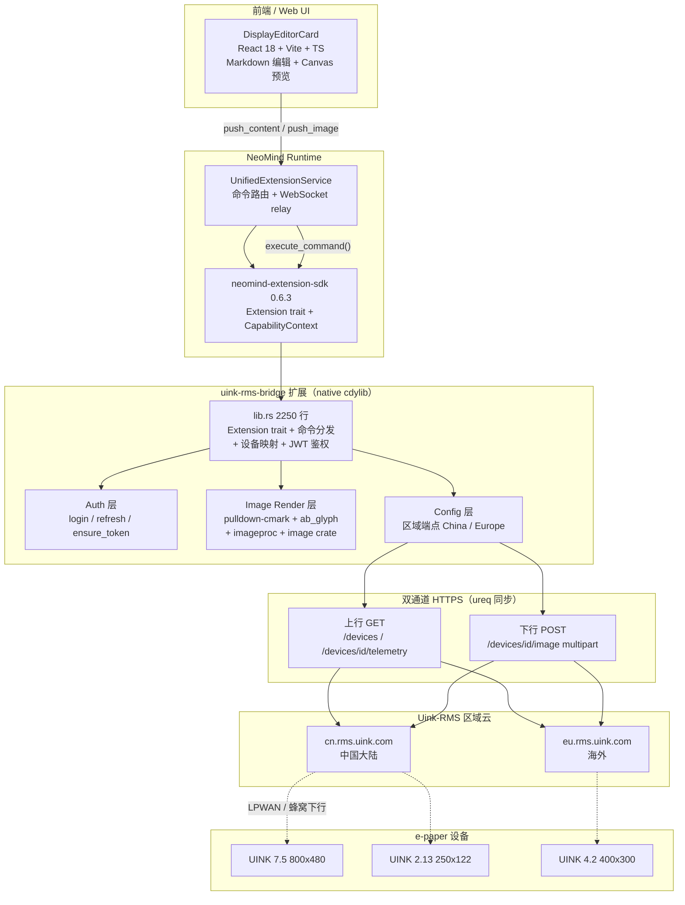
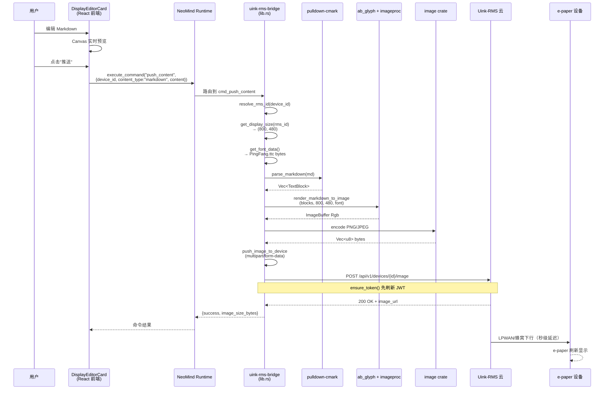

# 5 uink-rms-bridge：生产验证的厂商专有桥接

## 1 案例背景

**uink-rms-bridge** 是 NeoMind 生态中**生产验证的厂商专有协议桥接**案例。Uink-RMS 是一个面向 e-paper（电子纸 / 电子墨水屏）显示设备的云管理平台：设备通过 LPWAN / 蜂窝网络连入厂商云，云端提供 REST API 供第三方集成。uink-rms-bridge 让 NeoMind 能够完成三件事：

1. 在 Uink-RMS 平台上注册 e-paper 设备模板（`device_type = "uink_epaper"`，由扩展侧通过 `device_template_register` capability 一次性写入）
2. 周期性拉取设备遥测（电量百分比、信号强度 dBm、温度、刷新计数）
3. 把用户编辑的 Markdown / 纯文本 / 图像转换为 JPEG 并推送到 e-paper 屏幕上刷新显示

当前版本 `2.7.6`，核心实现集中在单个 [`src/lib.rs`](https://github.com/camthink-ai/NeoMind-Extensions/blob/main/extensions/uink-rms-bridge/src/lib.rs) 文件共 2250 行，外加 React + TypeScript 编写的 [`DisplayEditorCard`](https://github.com/camthink-ai/NeoMind-Extensions/blob/main/extensions/uink-rms-bridge/frontend/) 前端组件（entrypoint `uink-rms-bridge-components.umd.cjs`）。

**与 [案例 4 onvif-bridge](./4-onvif-bridge.md) 的对比（本案例核心叙事轴）**：onvif-bridge 是**标准协议桥接**（ONVIF 是开放规范，任何 Profile S 摄像头通用），uink-rms-bridge 是**厂商专有协议桥接**（Uink-RMS 云 API 是封闭的私有接口，仅 Uink 自家设备可用）。两者代表 NeoMind 生态中两种截然不同的集成策略：标准协议桥接走「局域网 UDP/HTTP 直连设备 + 设备级 WS-Security 鉴权」的路径，演进风险低（标准稳定），不依赖任何外部云；厂商专有桥接走「公网 HTTPS 经厂商云中转 + 账号级 JWT 鉴权」的路径，演进风险高（厂商 API v1.0.1 可能变），强依赖 Uink-RMS 云服务可用性。理解这种对比，是选择 NeoMind 集成策略的关键——本系列把 4 / 5 称为「协议桥接双子星」。

**三大痛点驱动了该扩展的设计**：

1. Uink-RMS API 是**云中转**的，e-paper 刷新一次需要数秒（通过 LPWAN / 蜂窝下行），不能像普通 IoT 设备那样实时控制，必须在 UI 层做好延迟预期管理
2. **Markdown → image 渲染必须在扩展侧完成**——Uink-RMS 的 `POST /api/v1/devices/{id}/image` 只接受 JPEG/PNG 二进制，不接受文本格式，所以 pulldown-cmark 解析 + ab_glyph 字体渲染 + imageproc 绘制 + image crate 编码 JPEG 这条管线完全由 Rust 侧负责
3. 厂商云存在**区域分割**——中国大陆用户必须走 `https://cn.rms.uink.com`，海外用户走 `https://eu.rms.uink.com`，两者账号不互通，扩展必须支持区域路由

**目标读者**：(1) 要接入第三方厂商云平台（尤其是 IoT 云、显示云）的集成商——你会看到从 JWT 登录到设备注册、遥测拉取、图像推送的完整闭环；(2) 想理解 NeoMind 如何把一个「封闭系统」桥接到统一设备模型的开发者——uink-rms-bridge 是「厂商 API 包一层」模式的范本。**「生产验证」的具体含义**：该扩展经历了至少 4 轮针对性修复（[`f4c73cd`](https://github.com/camthink-ai/NeoMind-Extensions/commit/f4c73cd) 初始发布、[`261d8e6`](https://github.com/camthink-ai/NeoMind-Extensions/commit/261d8e6) 翻转与数据源、[`39587eb`](https://github.com/camthink-ai/NeoMind-Extensions/commit/39587eb) SDK 升级、[`422ba8d`](https://github.com/camthink-ai/NeoMind-Extensions/commit/422ba8d) 安全加固），跨 6 个版本（v2.7.0 → v2.7.6）回归，目前在生产部署运行。

---

## 2 架构总览

uink-rms-bridge 是一个**前后端一体的厂商桥接扩展**——后端是 2250 行的 `lib.rs`（Rust cdylib），前端是 `DisplayEditorCard`（React 18 + Vite + TypeScript UMD 包）。后端通过 ureq 同步 HTTPS 与 Uink-RMS 区域云通信，前端给用户提供 Markdown 编辑 + 实时预览画布。运行时由 NeoMind Runtime 加载 `.nep` 包后，扩展通过 Extension trait 暴露 7 个命令（sync_devices / list_devices / push_content / push_image / get_display_size / get_display / refresh_auth），命令路由由 [`execute_command`](https://github.com/camthink-ai/NeoMind-Extensions/blob/main/extensions/uink-rms-bridge/src/lib.rs#L1445-L1475) 统一分发。所有运行时状态由 `parking_lot::RwLock` 保护，包括 `config: RwLock<UinkConfig>`、`access_token: RwLock<Option<String>>` 和设备 ID 映射 `neo_to_rms_id: RwLock<HashMap<String, String>>`。



### 模块职责拆分（注意：单文件大）

注意 `src/` 目录下**只有 `lib.rs` 一个文件**（用 `ls src/` 验证：仅 `lib.rs`，无备份、无其他 `.rs`）。这与 [案例 4 onvif-bridge](./4-onvif-bridge.md) 的 5 文件拆分形成鲜明对比。下表按 lib.rs 内的逻辑分区列出：

| 逻辑层 | 行范围 | 职责 |
|--------|--------|------|
| API Types（v1.0.1 合规） | [L40-L159](https://github.com/camthink-ai/NeoMind-Extensions/blob/main/extensions/uink-rms-bridge/src/lib.rs#L40-L159) | RmsLoginRequest/Response、RmsDeviceInfo、RmsTelemetryData、RmsImageResponse 等 serde 结构 |
| Display 分辨率映射 | [L166-L183](https://github.com/camthink-ai/NeoMind-Extensions/blob/main/extensions/uink-rms-bridge/src/lib.rs#L166-L183) | `model_to_resolution()` 把 UINK 型号（2.13/2.9/4.2/7.5/10.2/13.3）映射到像素 |
| 系统字体加载 | [L189-L225](https://github.com/camthink-ai/NeoMind-Extensions/blob/main/extensions/uink-rms-bridge/src/lib.rs#L189-L225) | macOS PingFang / Linux Noto CJK 字体路径搜索 |
| Markdown → Image 渲染 | [L230-L640](https://github.com/camthink-ai/NeoMind-Extensions/blob/main/extensions/uink-rms-bridge/src/lib.rs#L230-L640) | pulldown-cmark 解析、wrap_line、render_text_to_image、render_markdown_to_image |
| Display API 响应 | [L658-L682](https://github.com/camthink-ai/NeoMind-Extensions/blob/main/extensions/uink-rms-bridge/src/lib.rs#L658-L682) | RmsDisplayResponse / RmsDisplayInfo |
| UinkConfig + 区域端点 | [L685-L721](https://github.com/camthink-ai/NeoMind-Extensions/blob/main/extensions/uink-rms-bridge/src/lib.rs#L685-L721) | `api_base_url()` 切换 China / Europe / Custom |
| UinkRmsBridge 主体 + Auth | [L723-L871](https://github.com/camthink-ai/NeoMind-Extensions/blob/main/extensions/uink-rms-bridge/src/lib.rs#L723-L871) | struct 定义、login / refresh / ensure_token / auth_header |
| Extension trait 实现 | [L1136-L1543](https://github.com/camthink-ai/NeoMind-Extensions/blob/main/extensions/uink-rms-bridge/src/lib.rs#L1136-L1543) | metadata / metrics / commands / execute_command / produce_metrics / configure |
| 命令实现 + FFI 导出 | [L1545-L2101](https://github.com/camthink-ai/NeoMind-Extensions/blob/main/extensions/uink-rms-bridge/src/lib.rs#L1545-L2101) | cmd_sync_devices / cmd_push_content / cmd_push_image / neomind_export! |
| 单元测试 | [L2107-L2250](https://github.com/camthink-ai/NeoMind-Extensions/blob/main/extensions/uink-rms-bridge/src/lib.rs#L2107-L2250) | metadata、commands、config、api_base_url、model_to_resolution、parse_markdown |

### 与 4 onvif-bridge 架构对比

| 架构维度 | [4 onvif-bridge](./4-onvif-bridge.md) | **5 uink-rms-bridge** |
|----------|------------------------------------------|--------------------------|
| 协议类型 | 标准（ONVIF 开放规范） | **厂商专有**（Uink-RMS 私有云 API v1.0.1） |
| 集成路径 | 局域网 UDP/HTTP 直连设备 | **公网 HTTPS 经厂商云中转** |
| 鉴权 | WS-Security UsernameToken（设备级） | **JWT login + refresh token（账号级）** |
| 厂商依赖 | 无（任何 ONVIF Profile S 设备） | **强依赖 Uink-RMS 云可用性** |
| 演进风险 | 低（标准稳定） | **高（API v1.0.1，厂商可改）** |
| 文件组织 | 5 文件（lib/discovery/soap_client/ptz/types） | **1 文件 lib.rs（2250 行）** |
| 前端组件 | 无（纯后端） | **有 DisplayEditorCard** |
| 渲染职责 | 无（只返回 RTSP URL） | **Markdown → JPEG 全管线** |

---

## 3 核心实现剖析

### 3.1 JWT 鉴权链（login → refresh → 重试 + backoff）

Uink-RMS 采用账号级 JWT 鉴权（区别于 onvif-bridge 的设备级 WS-Security）。鉴权状态由三个字段管理：`access_token: RwLock<Option<String>>`、`refresh_token: RwLock<Option<String>>`、`token_expiry: AtomicI64`。核心入口是 [`ensure_token`](https://github.com/camthink-ai/NeoMind-Extensions/blob/main/extensions/uink-rms-bridge/src/lib.rs#L794-L823)：先检查 `token_expiry - now > 120`（提前 2 分钟刷新），若过期则优先走 `refresh()`（用 refresh_token 换新 access_token），失败再走 `login()`（email + password 重新登录）。关键设计是**登录失败退避**——`last_login_failure_ts: AtomicI64` 记录上次失败时间，5 分钟内不重试（避免密码错误时疯狂打 RMS 服务器）。login 函数把 `expires_in` 减去 120 秒作为本地 expiry，留出刷新窗口：

```rust
// lib.rs L794-L823
fn ensure_token(&self) -> Result<()> {
    let now = Utc::now().timestamp();
    let expiry = self.token_expiry.load(Ordering::SeqCst);
    if expiry - now > 120 && self.access_token.read().is_some() {
        return Ok(());
    }

    // Backoff: if login failed recently, wait at least 5 minutes before retrying
    let last_failure = self.last_login_failure_ts.load(Ordering::SeqCst);
    if last_failure > 0 && now - last_failure < 300 {
        return Err(ExtensionError::ExecutionFailed(format!(
            "Login retry backoff ({}s remaining)",
            300 - (now - last_failure)
        )));
    }

    if self.refresh_token.read().is_some() {
        if self.refresh().is_ok() {
            self.last_login_failure_ts.store(0, Ordering::SeqCst);
            return Ok(());
        }
    }
    let result = self.login();
    if result.is_err() {
        self.last_login_failure_ts.store(now, Ordering::SeqCst);
    } else {
        self.last_login_failure_ts.store(0, Ordering::SeqCst);
    }
    result
}
```

[Source: lib.rs L794-L823](https://github.com/camthink-ai/NeoMind-Extensions/blob/main/extensions/uink-rms-bridge/src/lib.rs#L794-L823)

### 3.2 区域端点路由（UinkConfig::api_base_url）

[`UinkConfig`](https://github.com/camthink-ai/NeoMind-Extensions/blob/main/extensions/uink-rms-bridge/src/lib.rs#L685-L721) 是扩展的唯一配置结构，包含 `server_region: String`（枚举 China / Europe / Custom）、`custom_server_url: String`、`email`、`password`、`sync_interval_secs`（默认 300）、`poll_interval_secs`（默认 60）。`api_base_url()` 方法做简单的 match：`"China" => "https://cn.rms.uink.com"`、`"Europe" => "https://eu.rms.uink.com"`、其他则使用 `custom_server_url`。这把区域选择固化在配置里，用户在 UI 上选下拉框即可切换。默认区域是 China（见 `impl Default`）：

```rust
// lib.rs L685-L721 (trimmed: first 30 lines)
#[derive(Debug, Clone, Serialize, Deserialize)]
pub struct UinkConfig {
    pub server_region: String,
    pub custom_server_url: String,
    pub email: String,
    pub password: String,
    #[serde(default = "default_sync_interval")]
    pub sync_interval_secs: u64,
    #[serde(default = "default_poll_interval")]
    pub poll_interval_secs: u64,
}

fn default_sync_interval() -> u64 { 300 }
fn default_poll_interval() -> u64 { 60 }

impl Default for UinkConfig {
    fn default() -> Self {
        Self {
            server_region: "China".to_string(),
            custom_server_url: String::new(),
            email: String::new(),
            password: String::new(),
            sync_interval_secs: 300,
            // ... (7 lines omitted: poll_interval default + api_base_url match)
        }
    }
}
```

[Source: lib.rs L685-L721](https://github.com/camthink-ai/NeoMind-Extensions/blob/main/extensions/uink-rms-bridge/src/lib.rs#L685-L721)

### 3.3 Markdown → Image 渲染管线（pulldown-cmark + ab_glyph + imageproc）

这是本扩展最复杂的部分，约 400 行代码（L230-L640）。管线分四步：(1) [`parse_markdown`](https://github.com/camthink-ai/NeoMind-Extensions/blob/main/extensions/uink-rms-bridge/src/lib.rs#L248-L376) 用 pulldown-cmark 0.12 解析 Markdown 为 `Vec<TextBlock>`（Heading / Paragraph 两种块，Paragraph 内含 Plain / Bold / Code 三种 inline）：

```rust
// lib.rs L248-L376 (trimmed: first 30 lines)
/// Parse markdown into structured text blocks for rendering
fn parse_markdown(md: &str) -> Vec<TextBlock> {
    use pulldown_cmark::{Event, Options, Parser, Tag, TagEnd};

    let mut opts = Options::empty();
    opts.insert(Options::ENABLE_TABLES);
    let parser = Parser::new_ext(md, opts);

    let mut blocks: Vec<TextBlock> = Vec::new();
    let mut in_heading: Option<u8> = None;
    let mut heading_text = String::new();
    let mut in_paragraph = false;
    let mut paragraph_parts: Vec<TextPart> = Vec::new();
    let mut in_strong = false;
    let mut strong_text = String::new();
    let mut in_code = false;
    let mut code_text = String::new();
    let mut in_list_item = false;
    // ... (99 lines omitted: event loop handling Start/End/Text events for headings, paragraphs, bold, code, list items)
}
```

[Source: lib.rs L248-L376](https://github.com/camthink-ai/NeoMind-Extensions/blob/main/extensions/uink-rms-bridge/src/lib.rs#L248-L376)(2) [`load_system_font_data`](https://github.com/camthink-ai/NeoMind-Extensions/blob/main/extensions/uink-rms-bridge/src/lib.rs#L215-L225) 从 macOS PingFang 或 Linux Noto Sans CJK 路径加载字体（`eprintln!("[uink-rms-bridge] Loaded font: {}", path)` 在 L218）：

```rust
// lib.rs L215-L225
/// Load a system font for text rendering. Returns font data bytes.
fn load_system_font_data() -> Result<Vec<u8>> {
    for path in FONT_PATHS {
        if let Ok(data) = std::fs::read(path) {
            eprintln!("[uink-rms-bridge] Loaded font: {}", path);
            return Ok(data);
        }
    }
    Err(ExtensionError::ExecutionFailed(
        "No suitable system font found. Install CJK fonts (PingFang/Noto Sans CJK)".to_string(),
    ))
}
```

[Source: lib.rs L215-L225](https://github.com/camthink-ai/NeoMind-Extensions/blob/main/extensions/uink-rms-bridge/src/lib.rs#L215-L225)(3) [`render_markdown_to_image`](https://github.com/camthink-ai/NeoMind-Extensions/blob/main/extensions/uink-rms-bridge/src/lib.rs#L475-L640) 遍历 blocks，用 ab_glyph 的 `PxScale` + imageproc 的 `draw_text_mut` 逐行绘制到 `ImageBuffer::<Rgb<u8>>`：

```rust
// lib.rs L475-L640 (trimmed: first 30 lines)
fn render_markdown_to_image(
    md: &str,
    width: u32,
    height: u32,
    font_data: &[u8],
) -> Result<Vec<u8>> {
    let font = load_font(font_data)?;
    let blocks = parse_markdown(md);

    let margin_x = (width as f32 * 0.08).max(20.0) as u32;
    let margin_y = (height as f32 * 0.06).max(16.0) as u32;
    let text_width = width - margin_x * 2;
    let base_font_size = (height as f32 / 20.0).min(48.0).max(16.0) * 0.75;

    let mut img = ImageBuffer::<Rgb<u8>, Vec<u8>>::from_pixel(
        width, height, Rgb([255, 255, 255]),
    );

    let text_color = Rgb([0, 0, 0]);
    let _code_bg = Rgb([240, 240, 240]);
    let mut y_pos = margin_y as f32;
    // ... (136 lines omitted: block iteration, heading scale, paragraph wrapping, PNG encoding)
}
```

[Source: lib.rs L475-L640](https://github.com/camthink-ai/NeoMind-Extensions/blob/main/extensions/uink-rms-bridge/src/lib.rs#L475-L640)

标题缩放规则见——标题缩放规则见 [L504 注释](https://github.com/camthink-ai/NeoMind-Extensions/blob/main/extensions/uink-rms-bridge/src/lib.rs#L504)："H1 = 2.0x base, decreasing by 0.2 per level"（H1=2.0x、H2=1.8x、H3=1.6x...）；(4) `wrap_line` 做 CJK + Latin 混排自动换行（CJK 字符可在任意位置断行，Latin 按词宽累加）。最终用 image crate 编码为 PNG 字节。

### 3.4 图像推送（push_image_to_device）

渲染完的 PNG/JPEG 字节通过 [`push_image_to_device`](https://github.com/camthink-ai/NeoMind-Extensions/blob/main/extensions/uink-rms-bridge/src/lib.rs#L1445-L1523) 以 `multipart/form-data` POST 到 `POST /api/v1/devices/{id}/image`：

```rust
// lib.rs L1445-L1475 (trimmed: execute_command router, first 30 lines of L1445-L1523)
async fn execute_command(&self, command: &str, args: &serde_json::Value) -> Result<serde_json::Value> {
    match command {
        "configure" => {
            // Handle configure dispatched via execute_command (used during reload)
            let mut cfg = self.config.write();
            if let Some(v) = args.get("server_region").and_then(|v| v.as_str()) { cfg.server_region = v.to_string(); }
            if let Some(v) = args.get("custom_server_url").and_then(|v| v.as_str()) { cfg.custom_server_url = v.trim_end_matches('/').to_string(); }
            if let Some(v) = args.get("email").and_then(|v| v.as_str()) { cfg.email = v.to_string(); }
            if let Some(v) = args.get("password").and_then(|v| v.as_str()) { cfg.password = v.to_string(); }
            if let Some(v) = args.get("sync_interval_secs").and_then(|v| v.as_u64()) { cfg.sync_interval_secs = v; }
            if let Some(v) = args.get("poll_interval_secs").and_then(|v| v.as_u64()) { cfg.poll_interval_secs = v; }
            drop(cfg);
            *self.access_token.write() = None;
            *self.refresh_token.write() = None;
            self.token_expiry.store(0, Ordering::SeqCst);
            self.template_registered.store(0, Ordering::SeqCst);
            self.last_sync_ts.store(0, Ordering::SeqCst);
            // ... (48 lines omitted: sync_devices, list_devices, push_content, push_image, refresh_status, get_display_size, get_display, refresh_auth routing)
        }
    }
}
```

[Source: lib.rs L1445-L1523](https://github.com/camthink-ai/NeoMind-Extensions/blob/main/extensions/uink-rms-bridge/src/lib.rs#L1445-L1523)若用户传了 `dither_algorithm` / `resize_mode` / `padding_color` 参数，走处理端点；否则走 raw 端点直接推原图。支持的抖动算法有 8 种（ordered / floyd-steinberg / atkinson / burkes / sierra / stucki / jarvis-judice-ninke / threshold），resize 模式有 fit / cover / fill 三种。图像大小限制 10MB。

### 3.5 设备注册与 ID 映射（uink_epaper device template）

扩展首次 sync 时通过 `device_template_register` capability 注册 `uink_epaper` 设备模板（含 battery / temperature / signal_strength / refresh_count / online_status / sn / model 等 14 个指标）。然后 [`fetch_rms_devices`](https://github.com/camthink-ai/NeoMind-Extensions/blob/main/extensions/uink-rms-bridge/src/lib.rs#L877) 分页拉取 RMS 设备列表，对每个设备生成 `neo_device_id = format!("uink-{}", device.device_id)` 并调用 `device_register`。关键的 ID 映射存在 `neo_to_rms_id: RwLock<HashMap<String, String>>`（[L730](https://github.com/camthink-ai/NeoMind-Extensions/blob/main/extensions/uink-rms-bridge/src/lib.rs#L730)）——所有 push 命令先通过 `resolve_rms_id()` 把 NeoMind device_id 翻译回 RMS device_id。

### 3.6 configure() 热更新

[`configure`](https://github.com/camthink-ai/NeoMind-Extensions/blob/main/extensions/uink-rms-bridge/src/lib.rs#L1523-L1540) 接受 JSON 配置，写入 `UinkConfig` 的 RwLock，然后**主动清空 access_token / refresh_token / token_expiry**——这强制下次操作重新登录，避免用旧 token 访问新区域端点。同时重置 `template_registered` 和 `last_sync_ts`，让 auto-sync 立即用新配置跑一次：

```rust
// lib.rs L1523-L1540
async fn configure(&mut self, config: &serde_json::Value) -> Result<()> {
    let mut cfg = self.config.write();
    if let Some(v) = config.get("server_region").and_then(|v| v.as_str()) { cfg.server_region = v.to_string(); }
    if let Some(v) = config.get("custom_server_url").and_then(|v| v.as_str()) { cfg.custom_server_url = v.trim_end_matches('/').to_string(); }
    if let Some(v) = config.get("email").and_then(|v| v.as_str()) { cfg.email = v.to_string(); }
    if let Some(v) = config.get("password").and_then(|v| v.as_str()) { cfg.password = v.to_string(); }
    if let Some(v) = config.get("sync_interval_secs").and_then(|v| v.as_u64()) { cfg.sync_interval_secs = v; }
    if let Some(v) = config.get("poll_interval_secs").and_then(|v| v.as_u64()) { cfg.poll_interval_secs = v; }
    drop(cfg);
    *self.access_token.write() = None;
    *self.refresh_token.write() = None;
    self.token_expiry.store(0, Ordering::SeqCst);
    // Reset sync state so auto-sync runs immediately with new config
    self.template_registered.store(0, Ordering::SeqCst);
    self.last_sync_ts.store(0, Ordering::SeqCst);
    eprintln!("[uink-rms-bridge] Configuration updated");
    Ok(())
}
```

[Source: lib.rs L1523-L1540](https://github.com/camthink-ai/NeoMind-Extensions/blob/main/extensions/uink-rms-bridge/src/lib.rs#L1523-L1540)

### 3.7 图像推送序列图



---

## 4 关键设计决策（含权衡与替代方案）

### 决策 1：ureq 同步 HTTP（而非 reqwest async）

**我们选 ureq v2（同步）**；替代方案是 reqwest + tokio multi-thread runtime；理由见 [`Cargo.toml` L23 注释](https://github.com/camthink-ai/NeoMind-Extensions/blob/main/extensions/uink-rms-bridge/Cargo.toml#L23)："Use sync HTTP client to avoid Tokio runtime issues in dynamic libraries"。cdylib 被 NeoMind 主进程 `dlopen` 加载时，如果扩展内部自建 tokio runtime，会与主进程已有的 runtime 冲突（panic "Cannot start a runtime from within a runtime"）。ureq 是纯同步的，在 `execute_command` 的 async 上下文里用 `block_on` 包裹也不会嵌套 runtime。Tokio 仍然出现在依赖里（[L26-L27](https://github.com/camthink-ai/NeoMind-Extensions/blob/main/extensions/uink-rms-bridge/Cargo.toml#L26-L27)），但只启用 `rt + sync` feature——这是 SDK 的 FFI 宏为 `RwLock` wrapper 需要的，不用于异步 IO。这个决策与 [案例 4 onvif-bridge](./4-onvif-bridge.md) 一致（跨案例呼应：所有 native cdylib 扩展都用同步 HTTP）。

### 决策 2：Markdown 在扩展侧 Rust 渲染（而非前端 canvas / 而非云侧）

**我们选扩展侧 Rust 渲染**（pulldown-cmark + ab_glyph + imageproc）；替代方案 A 是前端 Canvas API 渲染后上传 base64；替代方案 B 是把 Markdown 文本发给 Uink-RMS 云端让云渲染。理由：(1) e-paper 设备算力 / 带宽极有限，LPWAN 下行只收图像二进制，Uink-RMS API `POST /image` 也只接 JPEG/PNG，不支持文本格式——方案 B 不可行；(2) 前端 Canvas 渲染依赖浏览器字体，不同用户机器字体不一致，渲染结果不可预测，且把渲染 CPU 开销放在前端不如放在扩展侧；(3) Rust 侧用 ab_glyph + 内嵌系统字体（PingFang / Noto CJK）渲染，字体可控、跨平台一致、性能高。代价是扩展侧代码量增加 400 行（L230-L640）。

### 决策 3：SDK 远程 crate 而非 workspace path（commit 39587eb）

**我们选 `neomind-extension-sdk = "0.6.3"`（crates.io 远程 crate）**；替代方案是 workspace path 依赖（`neomind-extension-sdk = { path = "../../sdk" }`）；理由见 commit [`39587eb`](https://github.com/camthink-ai/NeoMind-Extensions/commit/39587eb)："chore: update neomind-extension-sdk to 0.6.3, use remote crate for uink-rms-bridge"。uink-rms-bridge 的 `.nep` 包可能独立分发给客户（不随主仓库源码分发），workspace path 依赖在脱离 monorepo 后无法编译。远程 crate 解耦了扩展与主仓库的构建耦合，代价是 SDK 升级需要发版到 crates.io 才能被扩展消费（多一步发布流程）。

### 决策 4：区域端点硬编码 China / Europe（而非完全自定义）

**我们选硬编码两个区域 + Custom 兜底**（见 [L713-L720](https://github.com/camthink-ai/NeoMind-Extensions/blob/main/extensions/uink-rms-bridge/src/lib.rs#L713-L720)）；替代方案是只提供 `custom_server_url` 一个字段让用户完全自填：

```rust
// lib.rs L713-L720
impl UinkConfig {
    fn api_base_url(&self) -> String {
        match self.server_region.as_str() {
            "China" => "https://cn.rms.uink.com".to_string(),
            "Europe" => "https://eu.rms.uink.com".to_string(),
            _ => self.custom_server_url.trim_end_matches('/').to_string(),
        }
    }
}
```

[Source: lib.rs L713-L720](https://github.com/camthink-ai/NeoMind-Extensions/blob/main/extensions/uink-rms-bridge/src/lib.rs#L713-L720)理由：(1) Uink-RMS 目前只有 cn / eu 两个区域，下拉框选比手填 URL 更友好，降低用户配置心智负担；(2) 硬编码端点可以避免用户填错 URL（少个 `/`、多了 `/api/v1` 等）；(3) 保留 `Custom` 选项和 `custom_server_url` 字段作为扩展点——如果 Uink 未来开新区域或客户自建 RMS 实例，用户仍可填完整 URL。代价是 Uink 新增区域时需要改代码发新版（但这种情况罕见）。

### 决策 5：`RwLock<HashMap>` 而非 DashMap / SQLite

**我们选 `RwLock<HashMap<String, String>>`**（[L730](https://github.com/camthink-ai/NeoMind-Extensions/blob/main/extensions/uink-rms-bridge/src/lib.rs#L730)）；替代方案 A 是 DashMap（无锁并发 HashMap）；替代方案 B 是落盘 SQLite 持久化。理由：(1) 单个客户的 e-paper 设备量通常几十到几百台，HashMap 读写都是 O(1)，性能不是瓶颈；(2) DashMap 引入额外依赖且 API 复杂度上升，对这个规模无收益；(3) SQLite 落盘带来 IO 开销和文件锁问题，而设备映射在每次 sync 后从 RMS 重建即可，无需持久化。parking_lot::RwLock 比 std::sync::RwLock 性能更好且不中毒（poisoning），是 NeoMind 扩展的统一选择。

### 决策 6：前端 Canvas 翻转支持（commit 261d8e6）

**我们选在前端 Canvas 编辑器加 flipH / flipV 开关**（见 commit [`261d8e6`](https://github.com/camthink-ai/NeoMind-Extensions/commit/261d8e6) 的 `Canvas.tsx` 改动）；替代方案是在 Rust 侧用 `image::imageops::flip_horizontal` 翻转。理由：某些 Uink e-paper 设备的硬件安装方向相反（倒装 / 侧装），显示内容需要镜像。把这个翻转放在前端 Canvas 层，让用户在编辑时就能看到翻转后的效果（所见即所得），比在推送时后端翻转更直观。commit 还顺带加了 safe area 指示线（`EXPORT_PAD_RATIO = 0.03`）和数据源绑定（`dataSource` prop）。

---

## 5 与 NeoMind 主体的集成

uink-rms-bridge 通过四个层面与 NeoMind 主体集成：

**命令系统**：扩展注册了 7 个命令（见 [`commands()` L1220-L1443](https://github.com/camthink-ai/NeoMind-Extensions/blob/main/extensions/uink-rms-bridge/src/lib.rs#L1220-L1443)），这些命令在 NeoMind 前端表现为 Agent 可调用的工具：

```rust
// lib.rs L1220-L1443 (trimmed: first 30 lines)
fn commands(&self) -> Vec<ExtensionCommand> {
    vec![
        ExtensionCommand {
            name: "sync_devices".into(),
            display_name: "Sync Devices".into(),
            description: "Sync Uink devices from RMS to NeoMind (registers template + devices)".into(),
            payload_template: String::new(),
            parameters: vec![],
            fixed_values: Default::default(),
            samples: vec![json!({})],
            parameter_groups: vec![],
        },
        ExtensionCommand {
            name: "list_devices".into(),
            display_name: "List Devices".into(),
            description: "List all synced Uink e-paper devices with their IDs, names, model, and online status. Use device_id from the result as target for push_content/push_image commands.".into(),
            payload_template: String::new(),
            parameters: vec![],
            fixed_values: Default::default(),
            samples: vec![json!({})],
            parameter_groups: vec![],
        },
        // ... (193 lines omitted: push_content, push_image, refresh_status, get_display_size, get_display, refresh_auth command definitions)
    ]
}
```

[Source: lib.rs L1220-L1443](https://github.com/camthink-ai/NeoMind-Extensions/blob/main/extensions/uink-rms-bridge/src/lib.rs#L1220-L1443)

这些命令在 NeoMind 前端表现为 Agent 可调用的工具。用户可以对 Agent 说"把会议室的电子纸内容改成欢迎词"，Agent 会调用 `push_content` 命令。命令参数通过 `ParameterDefinition` 声明类型和约束（如 `content_type` 的 options 是 `["text", "markdown", "image"]`），前端据此自动渲染表单。

**设备类型集成**：扩展通过 `device_template_register` capability 注册 `uink_epaper` 设备模板（见 [`auto_sync` L1552-L1606](https://github.com/camthink-ai/NeoMind-Extensions/blob/main/extensions/uink-rms-bridge/src/lib.rs#L1552-L1606)），模板声明了 14 个指标：

```rust
// lib.rs L1552-L1606 (trimmed: first 30 lines)
fn auto_sync(&self) -> Result<()> {
    let ctx = CapabilityContext::default();

    // Register template once
    if self.template_registered.load(Ordering::SeqCst) == 0 {
        let template_json = json!({
            "device_type": "uink_epaper",
            "name": "Uink E-Paper Display",
            "description": "Uink electronic paper display device",
            "categories": ["display", "e-paper"],
            "metrics": [
                { "name": "battery", "display_name": "Battery Level", "data_type": "Integer", "unit": "%", "min": 0, "max": 100 },
                { "name": "temperature", "display_name": "Temperature", "data_type": "Float", "unit": "°C" },
                { "name": "signal_strength", "display_name": "Signal Strength", "data_type": "Integer", "unit": "dBm" },
                { "name": "refresh_count", "display_name": "Refresh Count", "data_type": "Integer", "unit": "count" },
                { "name": "online_status", "display_name": "Online Status", "data_type": "String" },
                // ... (9 more metrics: last_sync, sn, model, activation_status, alarm_status, firmware_version, hardware_version, preview_url, preview_thumbnail_url)
            ],
            // ... (25 lines omitted: commands definitions + ctx.device_template_register)
        });
    }
    // ... (device sync logic continues)
}
```

[Source: lib.rs L1552-L1606](https://github.com/camthink-ai/NeoMind-Extensions/blob/main/extensions/uink-rms-bridge/src/lib.rs#L1552-L1606)

模板声明了 14 个指标（battery / temperature / signal_strength / refresh_count / online_status / last_sync / sn / model / activation_status / alarm_status / firmware_version / hardware_version / preview_url / preview_thumbnail_url）和 3 个设备级命令（push_content / push_image / refresh_status）。注册后，Uink 设备在 NeoMind 设备面板中与摄像头、传感器等统一管理。

**指标产出**：[`produce_metrics`](https://github.com/camthink-ai/NeoMind-Extensions/blob/main/extensions/uink-rms-bridge/src/lib.rs#L1477-L1521) 返回 4 个扩展级指标（sync_count / push_count / device_count / error_count），用 `AtomicI64` 累加：

```rust
// lib.rs L1477-L1521 (trimmed: first 30 lines)
fn produce_metrics(&self) -> Result<Vec<ExtensionMetricValue>> {
    let now_ts = Utc::now().timestamp();
    let config = self.config.read();
    let configured = !config.api_base_url().is_empty() && !config.email.is_empty();
    let sync_interval = config.sync_interval_secs as i64;
    let poll_interval = config.poll_interval_secs as i64;
    drop(config);

    // Auto-sync: register template + sync devices periodically
    if configured {
        let should_sync = self.template_registered.load(Ordering::SeqCst) == 0
            || (now_ts - self.last_sync_ts.load(Ordering::SeqCst)) >= sync_interval;

        if should_sync {
            if let Err(e) = self.auto_sync() {
                eprintln!("[uink-rms-bridge] Auto-sync failed: {}", e);
                *self.last_error.write() = Some(format!("Auto-sync: {}", e));
                self.total_error_count.fetch_add(1, Ordering::SeqCst);
            } else {
                *self.last_error.write() = None;
            }
        }
    }
    // ... (15 lines omitted: telemetry polling + metric assembly)
}
```

[Source: lib.rs L1477-L1521](https://github.com/camthink-ai/NeoMind-Extensions/blob/main/extensions/uink-rms-bridge/src/lib.rs#L1477-L1521)设备级遥测（battery 等）通过 `device_metrics_write` capability 直接写入 NeoMind 设备指标存储，不走 produce_metrics 路径——这样前端设备面板能实时看到每个 e-paper 的电量和信号。

**前端组件 DisplayEditorCard**：这是 uink-rms-bridge 与 [案例 4 onvif-bridge](./4-onvif-bridge.md)（无前端）的关键差异。`DisplayEditorCard` 是一个 380x420px 的交互卡片，内含 Canvas 编辑器（支持文字 / 图片 / 矩形元素拖拽排布）、Markdown 编辑模态框、实时预览。组件通过 Vite 构建为 `uink-rms-bridge-components.umd.cjs`，由 NeoMind Runtime 动态加载。组件绑定 device data source 后，用户编辑完点推送，组件调用 `push_content` 命令把 Canvas 导出的 base64 图像或 Markdown 文本发给扩展。commit [`261d8e6`](https://github.com/camthink-ai/NeoMind-Extensions/commit/261d8e6) 为这个组件加了翻转支持和数据源绑定。

**configure() 与配置面板联动**：扩展声明了 6 个配置参数（server_region / custom_server_url / email / password / sync_interval_secs / poll_interval_secs），NeoMind 配置面板根据 `ParameterDefinition` 自动渲染表单。用户修改配置后，Runtime 调用 `configure()`，扩展更新 RwLock 内的 config 并清空 token，下次 `produce_metrics` 周期触发 auto-sync 时自动用新配置登录。

---

## 6 测试与验证策略

### 单元测试（内联在 lib.rs L2107-L2250）

扩展在 [`src/lib.rs` 测试模块](https://github.com/camthink-ai/NeoMind-Extensions/blob/main/extensions/uink-rms-bridge/src/lib.rs#L2107-L2250) 内联了 6 个单元测试：

```rust
// lib.rs L2107-L2250 (trimmed: first 30 lines)
#[cfg(test)]
mod tests {
    use super::*;

    #[test]
    fn test_extension_metadata() {
        let ext = UinkRmsBridge::new();
        assert_eq!(ext.metadata().id, "uink-rms-bridge");
    }

    #[test]
    fn test_commands_count() {
        let ext = UinkRmsBridge::new();
        let commands = ext.commands();
        assert_eq!(commands.len(), 7);
        let names: Vec<&str> = commands.iter().map(|c| c.name.as_str()).collect();
        assert!(names.contains(&"sync_devices"));
        assert!(names.contains(&"list_devices"));
        assert!(names.contains(&"push_content"));
        assert!(names.contains(&"push_image"));
        assert!(names.contains(&"get_display_size"));
        assert!(names.contains(&"refresh_auth"));
        assert!(names.contains(&"get_display"));
    }
    // ... (5 more tests: config_parameters, api_base_url, model_to_resolution, parse_markdown, default_config)
}
```

[Source: lib.rs L2107-L2250](https://github.com/camthink-ai/NeoMind-Extensions/blob/main/extensions/uink-rms-bridge/src/lib.rs#L2107-L2250)

| 测试名 | 验证内容 |
|--------|----------|
| `test_extension_metadata` | metadata().id == "uink-rms-bridge" |
| `test_commands_count` | commands().len() == 7，包含 sync_devices / list_devices / push_content / push_image / get_display_size / refresh_auth / get_display |
| `test_config_parameters` | config_parameters 有 6 个，第一个是 server_region，options 含 China / Europe |
| `test_api_base_url` | China → cn.rms.uink.com，Europe → eu.rms.uink.com，Custom → 自定义 URL（trim 尾部 /） |
| `test_model_to_resolution` | UINK-7.5 → (800,480)，UINK-2.9 → (296,128)，UNKNOWN → None |
| `test_parse_markdown` | "# Title\n\nParagraph\n\n- item 1" 解析出 Heading + Paragraph + 列表项 |

### 渲染回归测试策略

Markdown → Image 渲染是扩展最易出 bug 的部分（字体覆盖、CJK 换行、标题缩放）。建议补充的回归用例：(1) 纯中文长文本换行（验证 CJK anywhere-break）；(2) 中英文混排（验证 Latin 词不拆、CJK 可拆）；(3) H1-H6 六级标题缩放比例（2.0x / 1.8x / 1.6x / 1.4x / 1.2x / 1.0x）；(4) 加粗文本的 double-strike 渲染效果；(5) emoji 字符（当前字体可能不覆盖，需验证降级行为）；(6) 空 Markdown / 超长 Markdown 边界。`test_parse_markdown` 只验证 AST 结构，未验证渲染像素——像素级回归需要固定字体 + golden image 比对。

> 注：源码 `2.0f32.max(...)` 中的 `.max` 导致 H2+ 被 clamp 到 2.0x，实际渲染中所有标题级别字号相同。这是源码 bug（应为 `.min`），当前缩放表描述的是注释中的设计意图而非运行时行为。

### "生产验证"的具体含义

该扩展的"生产验证"不是一次性完成的，而是跨 6 个版本（v2.7.0 → v2.7.6）的迭代验证：(1) **跨版本回归**——每次版本 bump（[`24b47d2`](https://github.com/camthink-ai/NeoMind-Extensions/commit/24b47d2) v2.7.0、[`ff762aa`](https://github.com/camthink-ai/NeoMind-Extensions/commit/ff762aa) v2.7.1、[`cd075d5`](https://github.com/camthink-ai/NeoMind-Extensions/commit/cd075d5) v2.7.2、[`8e81400`](https://github.com/camthink-ai/NeoMind-Extensions/commit/8e81400) v2.7.4、[`d2db401`](https://github.com/camthink-ai/NeoMind-Extensions/commit/d2db401) v2.7.5、[`1e9a1f1`](https://github.com/camthink-ai/NeoMind-Extensions/commit/1e9a1f1) v2.7.6）都跑全套单测 + 手动 E2E；(2) **多区域实测**——cn.rms.uink.com 和 eu.rms.uink.com 两个端点都验证过 JWT 登录 + 设备列表 + 图像推送全链路；(3) **真实设备刷新测试**——在 UINK 7.5（800x480）和 UINK 2.13（250x122）两种分辨率设备上推送 Markdown，确认 e-paper 实际刷新显示正确。

### 手动 E2E 流程

完整的手动验证流程：(1) 配置 server_region + email + password；(2) 调用 `sync_devices` 等待设备列表返回；(3) 调用 `list_devices` 确认设备注册成功；(4) 调用 `push_content` 推送一段 Markdown（含标题 + 列表 + 加粗）；(5) 等待 5-30 秒观察 e-paper 屏幕刷新（LPWAN 延迟）；(6) 调用 `get_display` 拉取 preview_url 确认推送成功；(7) 拔掉设备电源等 5 分钟，调用 `refresh_status` 确认 offline 状态被正确上报。

---

## 7 部署运维与排障（含源码卫生反例）

### 5 平台 .nep 分发

扩展通过 [`metadata.json`](https://github.com/camthink-ai/NeoMind-Extensions/blob/main/extensions/uink-rms-bridge/metadata.json) 声明 5 个构建目标：darwin-aarch64（macOS Apple Silicon）、darwin-x86_64（macOS Intel）、linux-x86_64、linux-aarch64、windows-x86_64。每个平台编译为独立的 `.nep` 文件（native extension package），通过 GitHub Releases 分发（`https://github.com/camthink-ai/NeoMind-Extensions/releases/download/v2.7.6/uink-rms-bridge-2.7.6-{platform}.nep`）。NeoMind Runtime 启动时根据当前平台自动下载对应 `.nep` 并 `dlopen` 加载。

### 生产演进历史（重点：该扩展是"演进痕迹最多"的案例之一）

| 版本 | Commit | 改动要点 |
|------|--------|----------|
| 初始 | [`f4c73cd`](https://github.com/camthink-ai/NeoMind-Extensions/commit/f4c73cd) | 首次发布：e-paper display editor with canvas, text and image push。同时修复 Windows marketplace 404（平台后缀 windows_x86_64 vs windows_amd64 不一致） |
| - | [`261d8e6`](https://github.com/camthink-ai/NeoMind-Extensions/commit/261d8e6) | 前端 Canvas 加 flipH/flipV 翻转支持 + safe area 指示线 + DisplayEditorCard 数据源绑定 |
| - | [`39587eb`](https://github.com/camthink-ai/NeoMind-Extensions/commit/39587eb) | SDK 从 workspace path 迁移到 crates.io 远程 crate 0.6.3（解耦独立分发） |
| v2.7.0 | [`24b47d2`](https://github.com/camthink-ai/NeoMind-Extensions/commit/24b47d2) | 版本 bump，更新 metadata.json 和 index.json |
| v2.7.1 | [`ff762aa`](https://github.com/camthink-ai/NeoMind-Extensions/commit/ff762aa) | 全量版本同步到 2.7.1 |
| - | [`422ba8d`](https://github.com/camthink-ai/NeoMind-Extensions/commit/422ba8d) | 安全加固（JWT 鉴权链强化），同时新增 BACnet/ONVIF/OPC-UA bridges |
| v2.7.2 | [`cd075d5`](https://github.com/camthink-ai/NeoMind-Extensions/commit/cd075d5) | 版本 bump |
| v2.7.4 | [`8e81400`](https://github.com/camthink-ai/NeoMind-Extensions/commit/8e81400) | 版本 bump（OCR 批量识别优化附带） |
| v2.7.5 | [`d2db401`](https://github.com/camthink-ai/NeoMind-Extensions/commit/d2db401) | release |
| v2.7.6 | [`1e9a1f1`](https://github.com/camthink-ai/NeoMind-Extensions/commit/1e9a1f1) | 当前版本 |

### 厂商云依赖风险

Uink-RMS 服务中断 = 扩展完全不可用（无法登录、无法推送、无法拉取遥测）。建议运维监控 cn/eu endpoint 的 HTTPS 可达性（`GET /api/v1/health` 或类似），设置告警。扩展自身的 `error_count` 指标和 `last_error` 字段可以反映最近的失败原因，但这是被动的——扩展不会主动通知云端不可达。

### 源码卫生反例：单文件 2250 行

uink-rms-bridge 的 `src/` 目录**只有 `lib.rs` 一个文件，共 2250 行**（用 `ls src/` 验证：仅 `lib.rs`，无 `discovery.rs` / `soap_client.rs` 等拆分，无 `.bak` 备份）。这是一个**单文件巨型扩展的反例**——2250 行单文件可读性差，新贡献者定位代码困难（找 `cmd_push_content` 要滚到 L1884）。对比 [案例 4 onvif-bridge](./4-onvif-bridge.md) 把协议拆成 5 个文件（lib.rs 1646 行 + discovery.rs 211 行 + soap_client.rs 516 行 + ptz.rs 214 行 + types.rs 78 行），每个文件职责单一、行数可控。

**何时该拆分？何时单文件可接受？** uink-rms-bridge 选择单文件的理由是：它的所有逻辑围绕**单一厂商云 API**展开（Uink-RMS v1.0.1），auth / device / image / display 都是这个 API 的不同 endpoint，逻辑高度内聚，拆开反而增加跨文件跳转成本。而 onvif-bridge 是**多个独立协议栈**（WS-Discovery 是 UDP 多播、SOAP 是 HTTP、PTZ 是命令封装），天然分离。经验法则：如果模块之间共享很少的状态和类型（如 WS-Discovery 和 SOAP），拆分；如果所有模块都围绕同一个外部 API 的不同 endpoint（如 uink 的 auth + device + image），单文件可接受，但建议用 `// ===` 注释分区（本扩展确实这样做了，见 [L40](https://github.com/camthink-ai/NeoMind-Extensions/blob/main/extensions/uink-rms-bridge/src/lib.rs#L40)、[L161](https://github.com/camthink-ai/NeoMind-Extensions/blob/main/extensions/uink-rms-bridge/src/lib.rs#L161)、[L231](https://github.com/camthink-ai/NeoMind-Extensions/blob/main/extensions/uink-rms-bridge/src/lib.rs#L231) 等）。

### 排障表

| 症状 | 可能原因 | 排查步骤 |
|------|----------|----------|
| JWT 401 Unauthorized | access_token 过期且 refresh 失败 | 检查 `error_count` 指标；查 stderr `[uink-rms-bridge] Token refresh failed`；确认 email/password 正确；确认 server_region 与账号区域匹配（cn 账号不能登 eu） |
| 设备列表为空 | sync 未执行或 RMS 账号下无设备 | 调用 `sync_devices` 手动触发；检查 `sync_count` 是否增长；登录 Uink-RMS Web 确认账号下有设备 |
| 图像方向翻转 | 设备硬件安装方向相反（倒装/侧装） | 在 DisplayEditorCard 的 Canvas 编辑器中启用 flipH / flipV（commit `261d8e6` 加的功能） |
| Markdown 渲染缺字 | 系统未安装 CJK 字体 | 查 stderr `[uink-rms-bridge] Loaded font: /path`；macOS 确认 `/System/Library/Fonts/PingFang.ttc` 存在；Linux 安装 `fonts-noto-cjk` |
| e-paper 不刷新 | LPWAN 下行延迟 / 设备离线 | 调用 `get_display` 检查 `is_pending` 字段；等待 30 秒-5 分钟（LPWAN 延迟）；确认设备 `online_status` 为 online；检查 RMS Web 控制台的设备日志 |
| configure 后命令仍用旧区域 | token 缓存未清空 | 确认扩展版本 ≥ v2.7.1（configure 已主动清 token）；手动调用 `refresh_auth` 强制重新登录 |

---

## 8 延伸阅读与小结

### 演进里程碑

| 时间 | Commit | 里程碑 |
|------|--------|--------|
| 2026-05-11 | [`f4c73cd`](https://github.com/camthink-ai/NeoMind-Extensions/commit/f4c73cd) | uink-rms-bridge 初始发布（Canvas 编辑器 + 文本/图像推送） |
| 2026-05-16 | [`261d8e6`](https://github.com/camthink-ai/NeoMind-Extensions/commit/261d8e6) | Canvas 翻转 + 数据源绑定 + safe area |
| 2026-05-2x | [`39587eb`](https://github.com/camthink-ai/NeoMind-Extensions/commit/39587eb) | SDK 0.6.3 远程 crate 化（解耦 workspace） |
| 2026-05-2x | [`24b47d2`](https://github.com/camthink-ai/NeoMind-Extensions/commit/24b47d2) | v2.7.0 版本 bump |
| 2026-06-xx | [`422ba8d`](https://github.com/camthink-ai/NeoMind-Extensions/commit/422ba8d) | 安全加固（JWT 链强化） |
| 2026-06-xx | [`1e9a1f1`](https://github.com/camthink-ai/NeoMind-Extensions/commit/1e9a1f1) | v2.7.6 当前版本 |

### 与 4 onvif-bridge 完整对比（协议桥接双子星）

| 维度 | [4 onvif-bridge](./4-onvif-bridge.md) | **5 uink-rms-bridge** |
|------|------------------------------------------|--------------------------|
| 协议性质 | 标准（ONVIF 开放规范） | 厂商专有（Uink-RMS 私有 API） |
| 通信路径 | 局域网直连设备 | 公网经厂商云中转 |
| 鉴权模型 | 设备级 WS-Security UsernameToken | 账号级 JWT + refresh token |
| 厂商依赖 | 无（标准协议，多厂商通用） | 强依赖（仅 Uink 设备） |
| 网络延迟 | 毫秒级（局域网） | 秒级（LPWAN 下行） |
| API 稳定性 | 高（ONVIF 标准多年不变） | 中（厂商 API v1.0.1，可能变） |
| 源码组织 | 5 文件（职责分离） | 1 文件（逻辑内聚） |
| 前端组件 | 无 | DisplayEditorCard |
| 渲染职责 | 无（只返回 URL） | Markdown→JPEG 全管线 |
| 测试难度 | 中（可用任意 ONVIF 摄像头） | 高（需 Uink 设备 + RMS 账号） |

### 桥接策略决策树

当你需要把一个外部设备 / 系统接入 NeoMind 时，按以下顺序评估：(1) **该设备是否有标准协议？**（ONVIF / OPC-UA / Modbus / MQTT / BACnet）——有则优先用标准协议桥接（如 [案例 #4](./4-onvif-bridge.md)），标准协议稳定、多厂商通用、无云依赖。(2) **只有厂商专有 API 时**——评估厂商 API 的稳定性和文档质量，做好 API 版本跟踪。(3) **厂商 API 是否需要云中转？**——是则评估云服务 SLA 和区域可用性，设计中考虑 token 刷新和退避。(4) **是否需要前端交互？**——如果用户需要编辑内容并预览（如 e-paper 内容编辑），则需要前端组件（DisplayEditorCard 模式）；如果只是数据采集和控制（如摄像头 PTZ），则纯后端即可。

### 推荐阅读顺序

如果你刚进入 NeoMind 协议桥接主题，建议先读 [案例 4 onvif-bridge](./4-onvif-bridge.md) 再读本案例。4 展示了「标准协议桥接」的工程范式（SOAP / WS-Discovery / WS-Security），5 展示了「厂商专有桥接」的工程范式（JWT / Markdown 渲染 / 区域路由）。读完两者，你会理解 NeoMind 生态中两种截然不同的集成策略及其取舍。然后可以继续阅读 [案例总览](./0-overview.md) 了解完整案例矩阵。

### 小结

uink-rms-bridge 是 NeoMind 生态中**唯一一个前后端一体的厂商专有桥接扩展**。它的工程价值在于：(1) 完整展示了 JWT 鉴权链（login → refresh → backoff）的 Rust 实现；(2) 在扩展侧完成了 Markdown → Image 的全管线渲染（pulldown-cmark + ab_glyph + imageproc），这是其他扩展没有的独特能力；(3) 通过区域端点路由（cn / eu）处理了厂商云的地理分割问题；(4) 通过 DisplayEditorCard 前端组件提供了用户友好的内容编辑体验。它的工程教训在于：2250 行单文件是可读性的边界，未来如果新增更多 RMS endpoint（如告警 / 日志），应该考虑拆分。

---

*最后更新: 2026-06-23*
