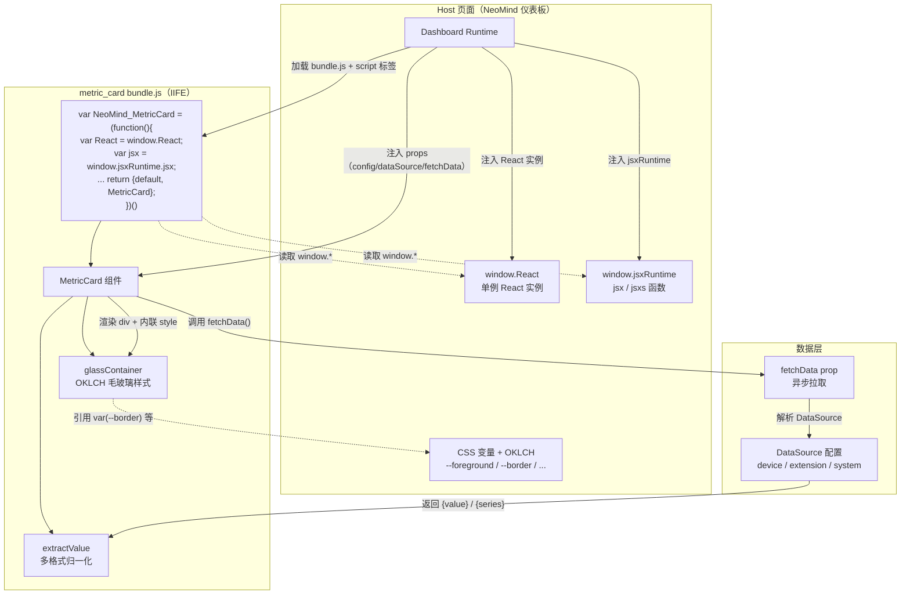
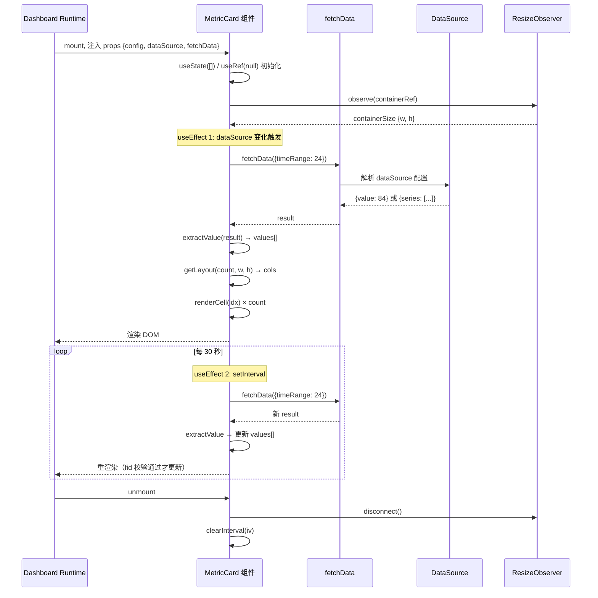

# 6 metric_card：入门仪表板组件

## 1 案例背景

**metric_card** 是 NeoMind 仪表板组件市场中最简单的「有意义的组件」——它把一个或多个数值（温度、电池电量、推理延迟、检测到的目标数）渲染成一张毛玻璃卡片，带标签、单位、小数位精度。整个组件 352 行手写 IIFE JavaScript，不依赖任何构建步骤，是新手理解「一个 NeoMind 组件由哪些部分组成」的最短路径。

**它解决了什么问题？** 仪表板需要展示数值型指标，但指标的数据来源五花八门：可能是设备实时遥测（`values.battery`）、扩展周期产出（`temperature_c`）、系统指标（`cpu.usage`）或信息属性（`name`）。metric_card 抽象掉这些差异，提供一个统一的「数值展示卡片」——用户只需绑定数据源并填写标签/单位，组件就能自动拉取数据、格式化、布局。

**目标读者**：刚读完 [组件 API 通用参考](../8-dashboard-component-dev.md)、想动手写第一个组件的开发者。需要理解 React 基础（hooks、JSX），但不需要任何打包工具链知识——NeoMind 组件刻意避开了 Webpack / Vite / Rollup，让任何人都能直接写、直接部署。

**在生态中的位置**：metric_card 是「显示型组件」的范本——它不绑定特定设备类型（`has_device_binding: false`）、不发起 AI 推理、不渲染图像/视频。后续案例中，#7（ne101_camera）会在 metric_card 的基础上增加设备绑定、图像画布、AI 处理流水线。掌握了本案例的 8 节内容，你就掌握了所有 NeoMind 组件的骨架：IIFE 注入模式、manifest 契约、fetchData 数据拉取、OKLCH 视觉系统。

**你将学到**：为什么 NeoMind 组件用 IIFE + `window.React` 注入而非 ESM 打包；`manifest.json` 的 `size_constraints` / `has_data_source` / `config_schema` 字段如何决定组件在仪表板中的行为；`extractValue()` 如何在 5+ 种数据格式之间做归一化；为什么用 OKLCH + CSS 变量而非硬编码十六进制色值；`backdrop-filter` 毛玻璃效果如何在无构建步骤下用内联 style 对象实现。

---

## 2 架构总览

metric_card 由三部分协作：组件 bundle（IIFE，自包含注册到 `window.NeoMind_MetricCard`）、NeoMind 仪表板运行时（Host 页面，提供 React/jsxRuntime + `fetchData` 注入 + 网格容器）、数据源（设备遥测 / 扩展指标 / 系统指标）。下图展示了加载时序和依赖注入边界。



### 3 个核心抽象

| 抽象 | 位置 | 作用 |
|------|------|------|
| `manifest.json` | 组件根目录 | 声明组件的元数据、尺寸约束、数据源能力、配置 schema。运行时读取这个文件决定如何把组件放进网格、是否显示数据源绑定面板。 |
| IIFE + `window.*` 注入 | `bundle.js` 开头 4 行 | 组件不打包 React，而是从 `window.React` / `window.jsxRuntime` 读取宿主页面已经加载的实例。这保证全仪表板只有一个 React 实例（避免 hooks 跨实例失效）。 |
| `extractValue()` | `bundle.js` L40-60 | 把 `fetchData()` 返回的 5+ 种格式（裸数字、`{value: ...}`、`{series: [...]}`、布尔、字符串）归一化成可直接显示的标量。这是组件能跨数据源类型工作的关键。 |

---

## 3 实现剖析

### 3.1 目录结构与 manifest 契约

```
components/metric_card/
├── manifest.json    # 组件清单（手写维护）
└── bundle.js        # 352 行手写 IIFE JavaScript（源码，非编译产物）
```

> **关键认知**：`bundle.js` 虽然叫 bundle，但**不是打包工具的输出**。NeoMind 组件市场刻意要求手写 IIFE——文件就是源码，可以像读普通 JS 一样直接阅读。案例 #7（ne101_camera）有 1972 行，依然是手写 IIFE。

查看完整清单：[`manifest.json`](https://github.com/camthink-ai/NeoMind-Dashboard-Components/blob/main/components/metric_card/manifest.json#L1-L49)

```json
// manifest.json L1-L30 (trimmed)
{
  "id": "metric_card",
  "name": { "en": "Metric Card", "zh": "指标卡片" },
  "description": {
    "en": "A frosted-glass metric card with adaptive layout and multi-data-source support",
    "zh": "毛玻璃效果指标卡片，自适应布局，支持多数据源绑定"
  },
  "icon": "BarChart3",
  "category": "display",
  "version": "1.7.0",
  "author": "NeoMind Team",
  "size_constraints": {
    "min_w": 2,
    "min_h": 2,
    "default_w": 3,
    "default_h": 2,
    "max_w": 6,
    "max_h": 4
  },
  "has_data_source": true,
  "max_data_sources": 12,
  "has_device_binding": false,
  "has_display_config": true,
  "has_actions": false,
  "config_schema": {
    "type": "object",
    "properties": {
      "metrics": {
        "type": "array",
```

[Source: manifest.json L1-L49](https://github.com/camthink-ai/NeoMind-Dashboard-Components/blob/main/components/metric_card/manifest.json#L1-L49)

**为什么每个字段是这个形状：**

- `size_constraints.min_w: 2` — 一格太窄，连两位数 + 单位都放不下；两格是「可读数值卡」的最小尺寸。运行时在拖拽缩放时会阻止用户缩到 2 格以下。
- `size_constraints.default_w: 3, default_h: 2` — 默认尺寸足够展示一行 3 个 slot 或一大两小，是「单指标 + 多指标」的平衡点。
- `size_constraints.max_w: 6, max_h: 4` — 限制最大尺寸防止布局崩坏；metric_card 的 `getLayout()` 在 12 个 slot × 6 列时仍能合理排布，超过这个尺寸价值递减。
- `has_data_source: true` + `max_data_sources: 12` — 声明数据源能力。`true` 让仪表板显示数据源绑定面板；`12` 与 `config_schema.metrics.maxItems` 对齐，允许用户在一个卡片里堆叠 12 个指标 slot。
- `has_device_binding: false` — metric_card 不绑定特定设备类型，可以消费任何数据源（设备遥测、扩展指标、系统指标都行）。如果设为 `true`，运行时会要求用户先选一个设备实例，并额外注入 `deviceContext` prop。
- `config_schema` — JSON Schema，运行时用它自动生成配置表单。`metrics` 数组的每一项有 `label` / `unit` / `decimalPlaces`，与 `bundle.js` 中 `config.metrics[i]` 的读取一一对应。

### 3.2 IIFE 注入模式（关键设计）

查看源码：[`bundle.js`](https://github.com/camthink-ai/NeoMind-Dashboard-Components/blob/main/components/metric_card/bundle.js#L1-L4) L1-4

```javascript
var NeoMind_MetricCard = (function () {
  var React = window.React;        // why window: 宿主页面已加载 React，这里读取单例
  var jsx = window.jsxRuntime.jsx; // why jsxRuntime: 自动运行时，无需 import React
  var jsxs = window.jsxRuntime.jsxs;
  // ... 350 行组件逻辑 ...
  return { default: MetricCard, MetricCard: MetricCard };
})();
```

[Source: bundle.js L1-L4](https://github.com/camthink-ai/NeoMind-Dashboard-Components/blob/main/components/metric_card/bundle.js#L1-L4)

**为什么是 IIFE + `window.*` 注入，而不是 ESM？**

NeoMind 组件市场的核心约束是：**组件以 drop-in bundle 分发，不需要构建步骤**。用户把 `bundle.js` 拖进市场，运行时用 `<script>` 标签加载它，组件就注册到 `window.NeoMind_MetricCard` 上。这意味着：

1. **不能 import** — `<script>` 标签不支持 `import` 语法。如果用 ESM，要么要求 `<script type="module">`（CORS / 路径解析复杂），要么要求用户先跑一次 bundler（违背「drop-in」承诺）。
2. **不能打包 React** — 如果每个组件都自带一份 React，仪表板加载 10 个组件就会有 10 份 React 实例，hooks 会跨实例失效（`useContext` / `useRef` 返回 undefined）。
3. **必须用 `window.React`** — 宿主页面加载一份 React 到 `window.React`，所有组件共享这一份。这是 React 官方推荐的「single instance via global」模式。

**被拒绝的替代方案：**

| 方案 | 拒绝原因 |
|------|---------|
| ESM `import React from 'react'` | 要求 bundler 或 `<script type="module">`，违背「drop-in」承诺 |
| 每个组件自带 React | 多实例冲突，hooks 跨实例失效，包体膨胀（每个 +130KB） |
| CDN React + UMD | 仍需 bundler 处理 JSX 转换；CDN 不可用时空白 |

`window.jsxRuntime` 是 React 17+ 的「automatic JSX runtime」。传统写法需要 `import React from 'react'` 才能用 JSX；自动运行时把 `jsx()` / `jsxs()` 作为独立函数暴露，组件只需要 `var jsx = window.jsxRuntime.jsx` 就能渲染，进一步减少了对 React 命名空间的依赖。

### 3.3 毛玻璃容器设计（OKLCH + CSS 变量）

查看源码：[`bundle.js`](https://github.com/camthink-ai/NeoMind-Dashboard-Components/blob/main/components/metric_card/bundle.js#L9-L18) L9-18

```javascript
// bundle.js L9-L18
var glassContainer = {
  background: 'linear-gradient(135deg, oklch(1 0 0 / 6%) 0%, oklch(0.75 0.06 270 / 5%) 40%, oklch(1 0 0 / 3%) 60%, oklch(0.75 0.06 200 / 4%) 100%)',
  backgroundSize: '300% 300%',
  animation: 'mc-shimmer 12s ease infinite',
  border: '1px solid var(--border)',           // why var: 跟随主题切换
  borderRadius: '12px',
  backdropFilter: 'blur(16px)',                // why 16px: 毛玻璃核心，弥散背景
  WebkitBackdropFilter: 'blur(16px)',
  boxShadow: '0 1px 3px oklch(0 0 0 / 12%), inset 0 1px 0 oklch(1 0 0 / 6%)'
};
```

[Source: bundle.js L9-L18](https://github.com/camthink-ai/NeoMind-Dashboard-Components/blob/main/components/metric_card/bundle.js#L9-L18)

**为什么用 OKLCH 而不是 hex / rgb？**

[OKLCH](https://oklch.com/) 是一个感知均匀的颜色空间，意味着「相同 lightness 值的不同色相，人眼看起来亮度一致」。对组件设计有两个实际好处：

1. **alpha 通道原生支持** — `oklch(1 0 0 / 6%)` 直接写透明度，不需要 `rgba()` 转换。metric_card 的毛玻璃层叠了 4 个不同透明度的渐变色，用 OKLCH 写起来比 `rgba()` 简洁。
2. **主题切换无跳变** — `glassContainer` 用 `var(--border)` 引用 CSS 变量，深色/浅色主题切换时边框色自动跟随，组件代码零修改。如果硬编码 `border: '1px solid #e5e7eb'`，深色主题下边框会过亮。

**为什么用内联 style 对象而不是 CSS-in-JS / Tailwind？**

metric_card 没有构建步骤（见 3.2），所以无法用 Tailwind class（需要 PostCSS 编译）或 CSS-in-JS（需要运行时库）。内联 style 对象是零依赖方案。代价是动态值（如 `opacity` 百分比）不能用 Tailwind 的 `/10` 语法，必须写 `'oklch(1 0 0 / 10%)'`。STYLE_GUIDE 第 1 节明确警告了这一点。

### 3.4 `extractValue()` —— 多格式数据归一化（核心工程洞察）

查看源码：[`bundle.js`](https://github.com/camthink-ai/NeoMind-Dashboard-Components/blob/main/components/metric_card/bundle.js#L40-L60) L40-60

```javascript
// bundle.js L40-L60
function extractValue(result) {
  if (result == null) return null;                    // why null: 空值不渲染 slot
  if (typeof result === 'number') return result;      // 裸数字（向后兼容）
  if (typeof result === 'string') return result;      // 字符串直接显示
  if (typeof result === 'boolean') return result ? 'Yes' : 'No';
  if (result.value != null) {                         // why .value: fetchData 标准格式
    if (typeof result.value === 'number') return result.value;
    if (typeof result.value === 'string') return result.value;
    if (typeof result.value === 'boolean') return result.value ? 'Yes' : 'No';
  }
  if (result.series != null && Array.isArray(result.series) && result.series.length) {
    var last = result.series[result.series.length - 1];  // why last: 取最新点
    if (typeof last === 'number') return last;
    if (typeof last === 'string') return last;
    if (last && last.value != null) {
      if (typeof last.value === 'number') return last.value;
      if (typeof last.value === 'string') return last.value;
    }
  }
  return null;
}
```

[Source: bundle.js L40-L60](https://github.com/camthink-ai/NeoMind-Dashboard-Components/blob/main/components/metric_card/bundle.js#L40-L60)

**为什么要处理 5+ 种输入格式？**

这是 NeoMind 生态的核心契约张力：**扩展产出的指标类型是松散的**。一个 `detect` 扩展可能返回 `{value: 3}`（检测到的目标数）；一个 `recognize_image` 扩展可能返回 `{value: "hello"}`（OCR 文本）；一个 `timeseries` 数据源返回 `{series: [{timestamp, value}, ...]}`（历史温度）；老版本扩展可能直接返回裸数字 `3`。

metric_card 作为通用组件，**必须容忍所有这些格式**。如果要求严格 schema（比如「只接受 `{value: number}` 格式」），那么：
- 字符串型指标（设备名、OCR 文本）无法显示。
- 布尔型指标（在线状态）无法显示。
- 时序数据源需要用户额外配置「取最后一个点」，增加摩擦。

**被拒绝的替代方案：**

| 方案 | 拒绝原因 |
|------|---------|
| 要求严格 `{value: number}` schema | 字符串/布尔指标无法显示，破坏生态兼容性 |
| 只取 `result.value`，忽略 `series` | 时序数据源（最常见的场景之一）完全失效 |
| 让用户在 manifest 声明期望格式 | 增加配置复杂度，违背「drop-in」理念 |

**`extractValue` 的设计原则：渐进式降级**。它按「最具体 → 最宽泛」的顺序检查格式：先看有没有 `.value`（标准格式），再看有没有 `.series`（时序格式），最后才退化到「裸标量」。这保证了对未来新格式的向前兼容——如果 NeoMind 新增一种 `{data: ...}` 格式，只需在 `extractValue` 里加一个分支，旧组件不会崩溃。

### 3.5 渲染与 props 契约

查看源码：[`bundle.js`](https://github.com/camthink-ai/NeoMind-Dashboard-Components/blob/main/components/metric_card/bundle.js#L130-L148) L130-148（状态定义）、[L156-176](https://github.com/camthink-ai/NeoMind-Dashboard-Components/blob/main/components/metric_card/bundle.js#L156-L176)（doFetch）、[L288-322](https://github.com/camthink-ai/NeoMind-Dashboard-Components/blob/main/components/metric_card/bundle.js#L288-L322)（renderCell）

```javascript
function MetricCard(props) {
  var config = props.config || {};      // why ||: config 可能为 undefined（未配置时）
  var fetchData = props.fetchData;      // 宿主注入的异步拉取函数
  var dataSource = props.dataSource;    // 数据源配置对象

  var dataSt = React.useState([]);      // why []: values 是数组，支持多 slot
  var values = dataSt[0], setValues = dataSt[1];
  // ... loading / error 状态 ...
}
```

```js
// bundle.js L130-L148
function MetricCard(props) {
    var config = props.config || {};
    var fetchData = props.fetchData;
    var dataSource = props.dataSource;

    var dataSt = React.useState([]);
    var values = dataSt[0], setValues = dataSt[1];
    var loadSt = React.useState(true);
    var loading = loadSt[0], setLoading = loadSt[1];
    var errSt = React.useState(null);
    var error = errSt[0], setError = errSt[1];

    var fetchDataRef = React.useRef(fetchData);
    fetchDataRef.current = fetchData;
    var configRef = React.useRef(config);
    configRef.current = config;
    var fetchIdRef = React.useRef(0);
    var lastDsKeyRef = React.useRef(null);

    var containerRef = React.useRef(null);
    var sizeSt = React.useState({ w: 0, h: 0 });
```

[Source: bundle.js L130-L148](https://github.com/camthink-ai/NeoMind-Dashboard-Components/blob/main/components/metric_card/bundle.js#L130-L148)

```js
// bundle.js L156-L176
    function doFetch() {
      var fn = fetchDataRef.current;
      var fid = ++fetchIdRef.current;
      if (!fn) { setLoading(false); return; }
      setLoading(true);
      setError(null);
      fn({ timeRange: 24 }).then(function (result) {
        if (fid !== fetchIdRef.current) return;
        var results = Array.isArray(result) ? result : (result ? [result] : []);
        var vals = results.map(function (r) {
          return extractValue(r);
        });
        setValues(vals);
      }).catch(function () {
        if (fid !== fetchIdRef.current) return;
        setError('fetch');
      }).finally(function () {
        if (fid !== fetchIdRef.current) return;
        setLoading(false);
      });
    }
```

[Source: bundle.js L156-L176](https://github.com/camthink-ai/NeoMind-Dashboard-Components/blob/main/components/metric_card/bundle.js#L156-L176)

```js
// bundle.js L288-L322 (trimmed)
    function renderCell(idx) {
      var slot = slots[idx];
      var displayValue = String(slot.value);

      return jsxs('div', {
        className: 'flex flex-col items-center justify-center min-w-0',
        style: {
          padding: slotCount === 1 ? '16px' : '10px 6px',
          background: 'oklch(1 0 0 / 3%)',
          borderRadius: '8px'
        },
        children: [
          jsx('div', {
            className: 'text-[10px] uppercase tracking-wider font-semibold truncate max-w-full',
            style: { color: 'var(--muted-foreground)', marginBottom: '6px' },
            children: slot.label
          }),
          jsxs('div', {
            className: 'flex items-baseline gap-1 justify-center min-w-0 max-w-full',
            children: [
              jsx('span', {
                className: 'font-bold font-mono tabular-nums truncate ' + valueClass,
```

[Source: bundle.js L288-L322](https://github.com/camthink-ai/NeoMind-Dashboard-Components/blob/main/components/metric_card/bundle.js#L288-L322)

props 流向：`data` (来自 `fetchData`) → `extractValue` 归一化 → `values[]` 数组 → `renderCell(idx)` 格式化显示（`toFixed(decimalPlaces)` + 单位 + 标签）。

`doFetch()` 函数（L156-176）是数据拉取的核心。它做了三件事：

1. **递增 `fetchIdRef`** — 防止过期请求覆盖新数据。如果用户在 30 秒轮询间隔内切换数据源，旧请求返回时会被 `if (fid !== fetchIdRef.current) return` 拦截。
2. **规范化结果为数组** — `Array.isArray(result) ? result : [result]`，让单数据源和多数据源走同一套渲染路径。
3. **`extractValue` 每个结果** — 把归一化后的标量存入 `values[]`，`renderCell` 再根据 `config.metrics[i]` 格式化。

### 3.6 数据流时序图

下图是 metric_card 在仪表板中的完整生命周期：从挂载到 30 秒轮询更新的数据流。



**关键时序点：**

- **`useEffect` #1（L180-186）** 监听 `dataSource` 变化。用 `getStableDsKey()` 生成数据源的稳定标识（`source|mode|id|field` 拼接），避免 deep equal 的开销。
- **`useEffect` #2（L188-196）** 设置 30 秒轮询。每次轮询前重置 `lastDsKeyRef`，强制触发 `doFetch`。
- **`useEffect` #3（L198-207）** 绑定 `ResizeObserver`，容器尺寸变化时重新计算 `getLayout()` 的列数。这让 metric_card 在用户拖拽缩放时实时调整布局（从 1 列变 2 列变 3 列）。

---

## 4 设计权衡

### 决策 1：IIFE + `window.*` 注入 vs ESM 打包

| 维度 | IIFE + window 注入（采用） | ESM 打包（拒绝） | 每组件自带 React（拒绝） |
|------|--------------------------|------------------|------------------------|
| 分发方式 | `<script>` 标签直接加载 | 需要 bundler 或 `<script type=module>` | 每个 bundle 自带 React |
| React 实例 | 全局单例，hooks 正常 | 全局单例（如果 external） | 多实例，hooks 跨组件失效 |
| 构建步骤 | 零 | 必须（Webpack/Vite/Rollup） | 必须 |
| 学习曲线 | 写普通 JS 即可 | 需理解 bundler 配置 | 需理解 external 配置 |
| 包体 | 0 KB React 开销 | 0 KB（external）或 +130KB | +130KB × N 组件 |

**选择 IIFE 的代价**：没有 tree-shaking、没有 TypeScript 类型检查、没有 ESLint。metric_card 接受这个代价，因为组件逻辑简单（352 行），手动测试足够。ne101_camera（1972 行）也是手写 IIFE，但配了 `test_bundle.js` 做逻辑测试。

### 决策 2：内联 style 对象 vs CSS-in-JS vs Tailwind

| 维度 | 内联 style 对象（采用） | CSS-in-JS（拒绝） | Tailwind class（拒绝） |
|------|----------------------|-------------------|---------------------|
| 依赖 | 零 | 需运行时库（styled-components 等） | 需 PostCSS 编译 |
| 动态值 | `style={{ opacity: x }}` 直接写 | 支持 | 需预定义 class 或 inline style |
| 主题跟随 | `var(--border)` 引用 CSS 变量 | 需主题 provider | 需配置 Tailwind 主题 |
| 代码可读性 | 样式与逻辑同处 | 组件 + 样式分离 | class 字符串拼接 |

**选择内联 style 的代价**：无法用 CSS 伪类（`:hover` / `:focus`）、无法用媒体查询。metric_card 的交互简单（点击 Retry 按钮），不需要伪类；响应式布局通过 JS 的 `getLayout()` + `ResizeObserver` 实现，不需要 CSS 媒体查询。

### 决策 3：OKLCH + CSS 变量 vs hex/rgb 硬编码

| 维度 | OKLCH + CSS 变量（采用） | hex/rgb 硬编码（拒绝） |
|------|----------------------|---------------------|
| 主题切换 | 自动跟随（`var(--foreground)` 切换） | 需要手写两套色值 |
| 透明度 | 原生 `/6%` 语法 | 需 `rgba()` 转换 |
| 感知均匀性 | 相同 lightness 视觉一致 | hex 空间非均匀 |
| 浏览器支持 | 现代浏览器（Chrome 111+） | 全兼容 |

**选择 OKLCH 的代价**：旧浏览器（Safari < 15.4）不支持。NeoMind 仪表板是现代 Web 应用，目标浏览器都是 evergreen，这个代价可接受。详见 [STYLE_GUIDE 1](https://github.com/camthink-ai/NeoMind-Dashboard-Components/blob/main/STYLE_GUIDE.md#1-color-system)。

### 决策 4：多格式 `extractValue` vs 严格 schema 校验

| 维度 | 多格式 `extractValue`（采用） | 严格 schema（拒绝） |
|------|----------------------------|-------------------|
| 生态兼容性 | 消费任何数据源格式 | 只接受声明过的格式 |
| 配置复杂度 | 用户只需绑定数据源 | 需额外声明期望格式 |
| 向前兼容 | 加新分支即可 | 破坏性变更 |
| 错误处理 | 静默返回 null，不渲染 slot | 抛异常，组件崩溃 |

**选择多格式的代价**：`extractValue` 的逻辑分支多，测试覆盖需谨慎。metric_card 在 git 历史中有两次专门修复 `extractValue` 的提交（见 7）。

---

## 5 技术栈拆解

| 组件 | 选择 | 为什么 |
|------|------|--------|
| UI 框架 | React（`window.React` 注入） | 宿主页面单例，所有组件共享；避免多实例 hooks 失效 |
| JSX 运行时 | `window.jsxRuntime.jsx/jsxs` | React 17+ 自动运行时，无需 `import React` |
| CSS 方案 | 内联 style 对象 + Tailwind class 混用 | 静态样式用 Tailwind class（`text-xs`），动态值用 inline style（`oklch(...)`） |
| 颜色系统 | OKLCH + CSS 变量（`var(--border)`） | 感知均匀 + 原生 alpha + 主题自动跟随 |
| 构建步骤 | 无（手写 IIFE） | drop-in 分发，零工具链 |
| 动画 | CSS keyframes + `document.head.appendChild` | 运行时注入 `<style>` 标签，id 去重（`mc-styles`） |
| 布局 | JS 计算（`getLayout()`） + `ResizeObserver` | 容器尺寸变化时动态调整列数，比 CSS Grid 更灵活 |
| 数据拉取 | `fetchData` prop（宿主注入） | 组件不直接访问数据源 API，由运行时解析配置并注入异步函数 |
| 状态管理 | React hooks（`useState` / `useRef` / `useEffect`） | 无需 Redux / Zustand；组件级状态足够 |

---

## 6 标准落地

本节展示 metric_card 如何落地 [工程标准附录](./appendix-standards.md) 和 [STYLE_GUIDE](https://github.com/camthink-ai/NeoMind-Dashboard-Components/blob/main/STYLE_GUIDE.md) 的规则。

### manifest.json 字段实践

metric_card 的 manifest 完整遵循附录 1 的 schema。关键字段对照：

| 标准字段 | metric_card 实际值 | 标准来源 |
|---------|------------------|---------|
| `id` | `"metric_card"` | 附录 1.1 |
| `name` | `{ "en": "Metric Card", "zh": "指标卡片" }` | 附录 1.1（组件多语言对象） |
| `version` | `"1.7.0"` | 附录 1.1（semver） |
| `size_constraints` | `{ min_w: 2, ... max_w: 6 }` | 附录 1.5（组件独有） |
| `has_data_source` | `true` | 附录 1.5 |
| `config_schema` | JSON Schema 对象 | 附录 1.5（组件独有） |

### 尺寸约束如何塑造网格

`size_constraints` 的四个值（`min_w/h`、`default_w/h`、`max_w/h`）直接决定组件在仪表板网格中的行为：

- **`min_w: 2, min_h: 2`** — 拖拽缩放时，运行时不允许小于这个尺寸。metric_card 在 2×2 时能显示一个 slot（`getLayout()` 返回 `{cols: 1}`，`getValueClass()` 返回 `text-4xl`）。
- **`default_w: 3, default_h: 2`** — 用户从组件库拖出来时的初始尺寸。3×2 足够显示 3 个 slot（一行排开）或 1 个大 slot。
- **`max_w: 6, max_h: 4`** — 限制最大尺寸。6 列时 `getLayout()` 在 12 个 slot 下返回 `{cols: 6}`，每个 slot 用 `text-lg`；超过这个尺寸价值递减。

### STYLE_GUIDE 遵循实践

metric_card 的 `renderCell` 函数严格遵循 STYLE_GUIDE 的模式：

```javascript
// 遵循 STYLE_GUIDE 7 "Value Display" 模式
jsx('span', {
  className: 'font-bold font-mono tabular-nums truncate ' + valueClass,
  // why tabular-nums: 数字等宽对齐，STYLE_GUIDE 2 要求
  // why truncate: 长值截断，防止溢出
  style: { color: 'var(--foreground)', letterSpacing: '-0.02em' },
  children: displayValue
})
```

- `font-mono tabular-nums` — STYLE_GUIDE 2 明确要求「数字显示必须用 `tabular-nums`，否则 `font-mono` 单独用会导致数字不等宽」。
- `var(--foreground)` — 而非 `text-foreground` class。这是因为 metric_card 的文字颜色是动态计算的（基于 slot 状态），用 inline style 更灵活。STYLE_GUIDE 1 允许这种用法。
- `text-[10px]` — STYLE_GUIDE 2 的「Tiny metadata」尺寸，用于标签。

### 反面示例：硬编码调色板色值

> **错误做法（STYLE_GUIDE 1 明确禁止）：**
>
> ```javascript
> // ❌ 错误 - 硬编码 hex 色值
> jsx('span', {
>   className: 'text-green-600',
>   children: displayValue
> })
> ```
>
> **后果**：当用户切换到深色主题时，`text-green-600` 是固定的 Tailwind 调色板色值，不会跟随主题变化。深色背景下 `green-600` 的对比度可能不达标，文字难以辨认。同时，`green-600` 与 NeoMind 的语义色系统脱节——如果未来设计系统把「成功」从绿色改为青色，所有硬编码 `green-600` 的组件都会脱节。
>
> **正确做法**：
>
> ```javascript
> // ✅ 正确 - 语义 CSS 变量
> jsx('span', {
>   className: 'text-success',  // 跟随主题 + 语义统一
>   children: displayValue
> })
> ```
>
> metric_card 在整个 `bundle.js` 中没有使用任何 Tailwind 调色板色值（`green-*` / `red-*` / `blue-*`），全部用 `var(--foreground)` / `var(--muted-foreground)` / `var(--border)` 等 CSS 变量。这是 STYLE_GUIDE 9 「Do's and Don'ts」表的直接实践。

---

## 7 常见坑与最佳实践

### 工程演进：`extractValue` 的两次重构

metric_card 的 git 历史记录了 `extractValue` 函数从「只处理数字」到「多格式归一化」的演进过程。这是一个典型的「生态契约张力」案例。

**提交 [`e4fe4b6`](https://github.com/camthink-ai/NeoMind-Dashboard-Components/commit/e4fe4b6)（v1.3.0）—— 引入 `extractValue` 和 `getDsLabel`**

> Add extractValue() to handle various result formats (scalar, `{value}`, `{series}`), and getDsLabel() to derive labels from dataSource config (field/infoProperty/systemMetric) matching data_list patterns.

- **症状**：metric_card v1.2 只读取 `result.value`，但用户反馈「时序数据源不显示」「设备名指标不显示」。
- **根因**：`fetchData()` 的返回格式取决于数据源模式（`latest` 返回 `{value}`，`timeseries` 返回 `{series}`，`info` 返回 `{value: string}`）。v1.2 假设所有数据源都返回 `{value: number}`，漏掉了时序和信息模式。
- **修复**：新增 `extractValue()` 函数，按 `number` → `string` → `boolean` → `{value}` → `{series[last]}` 的顺序检查格式。同时新增 `getDsLabel()` 从数据源配置自动推导标签。
- **教训**：通用组件必须容忍数据源的多态返回格式。`extractValue` 的渐进式降级设计（最具体 → 最宽泛）是这个生态契约的最佳实践。

**提交 [`7cc9e48`](https://github.com/camthink-ai/NeoMind-Dashboard-Components/commit/7cc9e48)（v1.4.0）—— 显示所有数据类型，移除 null 占位**

> extractValue now returns strings/booleans directly instead of rejecting. Slots with null values are skipped entirely (no empty cell rendered). Layout adapts to actual slot count with data, not data source count.

- **症状**：v1.3 的 `extractValue` 只返回 `number`，字符串和布尔指标被静默丢弃，显示为空 slot。
- **根因**：`extractValue` 的第一版仍然是「数字优先」思维，没考虑到 OCR 文本（字符串）和在线状态（布尔）也是合法的指标值。
- **修复**：`extractValue` 现在对字符串直接返回，对布尔转换为 `'Yes'` / `'No'`。同时，`slots` 数组在构建时跳过 `null` 值（`if (rawVal == null) continue`），布局基于实际有数据的 slot 数量而非数据源数量。
- **教训**：「数值卡片」不等于「只显示数字」。metric_card 的定位是「标量展示」，字符串和布尔都是标量。这个认知修正让组件的适用范围扩大了 3 倍。

### 最佳实践清单

1. **永远用语义 CSS 变量**（`text-success` / `bg-muted` / `var(--border)`），绝不硬编码调色板色值（`text-green-600` / `#e5e7eb`）。主题切换时前者自动跟随，后者会脱节。STYLE_GUIDE 1 明确禁止。

2. **`extractValue` 用 try/catch 包裹**。虽然当前实现是同步的且不会抛异常，但未来如果 `result.value` 是一个 getter（动态计算），可能会抛。metric_card 的 v1.7 实现没有 try/catch，这是一个已知的技术债——在 `slots.push` 外层加 `try { ... } catch(e) { continue; }` 可以让单个 slot 失败不影响其他 slot。

3. **用多种数据格式测试再发布**。metric_card 的测试矩阵应至少覆盖：`{value: 84}`（latest 模式）、`{value: "NE101"}`（info 模式）、`{series: [{timestamp, value}, ...]}`（timeseries 模式）、`null`（无数据源）、`3`（裸数字，向后兼容）。git 历史显示，每次 `extractValue` 的 bug 都是漏掉了某种格式。

4. **`fetchIdRef` 防过期请求**。metric_card 的 `doFetch` 用 `++fetchIdRef.current` 生成请求 ID，回调里检查 `if (fid !== fetchIdRef.current) return`。这是 React 异步数据拉取的标准模式——没有它，快速切换数据源时旧请求会覆盖新数据。

5. **`ResizeObserver` 做响应式布局**。metric_card 用 JS 计算列数（`getLayout()`）而非 CSS Grid 的 `repeat(auto-fit, minmax(...))`，因为需要根据容器宽高比（aspect ratio）优化布局，纯 CSS 做不到。代价是 `useEffect` 里要正确清理 `ro.disconnect()`。

---

## 8 延伸阅读

- [工程标准附录](./appendix-standards.md) —— manifest schema、尺寸约束、STYLE_GUIDE 规则的集中参考。
- [案例集总览](./0-overview.md) —— 7 个案例的版本对齐表和阅读路径。
- [1 weather-forecast-v2](./1-weather-forecast.md) —— 配对的扩展案例。weather-forecast 产出指标，metric_card 消费指标，两者构成完整的「扩展 → 组件」数据链路。
- [7 ne101_camera](./7-ne101-camera-component/index.md) —— 旗舰组件案例（下一级难度）。在 metric_card 的基础上增加设备绑定、图像画布、AI 处理流水线。
- [组件 API 通用参考](../8-dashboard-component-dev.md) —— Dashboard 组件 schema、数据源绑定、渲染管线的 API 文档。
- [源码仓库](https://github.com/camthink-ai/NeoMind-Dashboard-Components/tree/main/components/metric_card) —— `bundle.js` + `manifest.json`。
- [STYLE_GUIDE](https://github.com/camthink-ai/NeoMind-Dashboard-Components/blob/main/STYLE_GUIDE.md) —— 颜色 token、排版、组件模式、暗色模式的完整规范。

---

*最后更新: 2026-06-22 · 源码版本: metric_card v1.7.0*
