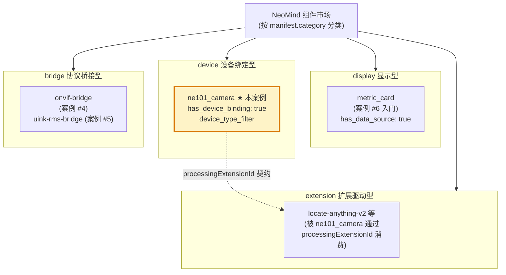
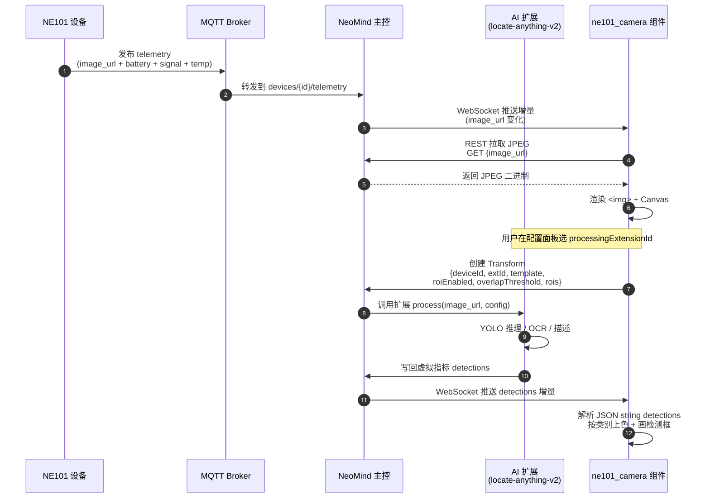

# 1 业务背景：为什么 NeoMind 需要 ne101_camera 组件

> 本节回答三个问题：**NE101 是什么硬件**、**为什么不能用通用 metric_card 凑合**、**ne101_camera 在 NeoMind 生态中处于什么位置**。读完你就能解释为什么 manifest 里写 `has_device_binding: true` + `has_data_source: false`——这是设备绑定组件的典型签名。

---

## 1.1 NE101 设备：CamThink 感知摄像头

**CamThink NE101** 是一款电池供电的边缘 AI 感知摄像头，由 CamThink 团队（也是 NeoMind Dashboard 的维护方）设计。它的核心能力是「按需抓拍 + 边缘指标上报」：不像传统 IPC 摄像头持续推流，NE101 大部分时间处于低功耗休眠状态，只有在三种触发条件下才醒来抓拍一张 JPEG 静图——(1) 用户主动调用 `trigger_capture` 命令；(2) 内置定时器到点（cron 形式的 `set_schedule`）；(3) 外部系统通过 MQTT `cmd` 主题下发指令。每次抓拍完成后，设备会上报一组遥测：最新 JPEG 图像（通过 REST 拉取，URL 存在 `values.image_url` 里）+ 电池百分比 + 蜂窝信号强度 + 机壳温度。这种「事件驱动 + 低频采样」的设计让一节电池能撑 3-6 个月，但也意味着组件不能用「订阅视频流」的思路，而必须用「拉取最新一张」的轮询/事件模式。

NE101 与 NeoMind 主控之间走 MQTT 协议：设备把遥测发到 `devices/{device_id}/telemetry` 主题，NeoMind 订阅后通过 WebSocket 把增量推给前端组件。这种链路决定了 ne101_camera 组件的数据接入方式不是「数据源绑定」（DataSource 是为「扩展周期产出的指标」设计的），而是「设备绑定」（DeviceBinding 直接订阅某个具体设备的遥测流）。

NE101 支持的设备命令（device commands）是组件命令按钮的来源，主要包括：

- `trigger_capture` —— 立即唤醒设备抓拍一张 JPEG，最常用的用户主动操作。组件在「命令」区渲染一个按钮，点击后调用 `fetchData({type: 'device_command', command: 'trigger_capture'})`。
- `set_schedule` —— 设置定时抓拍的 cron 表达式（例如 `0 */30 * * * *` 表示每 30 分钟一次）。组件把这个命令封装成一个「定时配置」子面板。
- `reboot` —— 远程重启设备，用于排查蜂窝连接掉线等问题。这个命令在 UI 上做了二次确认，避免误触。
- `set_capture_params` —— 调整抓拍参数（分辨率、JPEG 质量、是否启用 IR 补光），属于高级配置，默认折叠隐藏。

这四类命令的存在进一步印证了 1.2 的论点：metric_card 这种纯展示型组件根本无法承载命令触发能力，必须有专门的设备绑定组件来渲染命令按钮 + 调用设备命令 API。

> **源码佐证**：manifest 的 `description.zh` 就写明了「显示最新抓拍、电量状态和触发控制」——这三个能力组合正是 NE101 设备能力的镜像。详见 [manifest.json L4-L7](https://github.com/camthink-ai/NeoMind-Dashboard-Components/blob/main/components/ne101_camera/manifest.json#L4-L7)。

---

## 1.2 为什么不能拿 metric_card 凑合

读者第一反应可能是：「NE101 不就是上报电池、信号、温度几个数值吗？拿 [#6 metric_card](../6-metric-card-component.md) 绑个数据源不就行了？」答案是不行，原因有四：

**第一，metric_card 不能渲染图像。** NE101 最核心的价值是「抓拍到的 JPEG 图像」，而 metric_card 的 `extractValue()` 只能输出标量（数字/字符串）。要显示图像，需要专门的 `` + Canvas 画布，metric_card 的渲染层完全没有这个能力。

**第二，metric_card 不能画 ROI 叠加。** NE101 的典型用法是「圈出画面里的人行通道，统计经过的行人数」——这需要在图像上画半透明矩形（ROI）+ 在检测到的目标上画检测框 + 按类别上色。这套叠加渲染逻辑（Canvas 坐标系、`objectFit: contain` 的非线性映射、ResizeObserver 异步建立）根本无法塞进 metric_card 的「单卡片」布局。

**第三，metric_card 不能触发设备命令。** NE101 有 `trigger_capture`（立即抓拍）、`set_schedule`（设置定时）这类设备级命令，需要在组件里渲染按钮 + 调用 `fetchData({type: 'device_command', ...})`。metric_card 的 manifest 是 `has_actions: false`，根本没有命令面板的入口。

**第四，metric_card 不能配置 AI 处理流水线。** NE101 真正的杀手锏是「图像 → AI 扩展 → 检测结果回写」这条链路，需要在配置面板里选扩展（`processingExtensionId`）、选模板（`processingTemplate`）、调 ROI 阈值（`processingRoiOverlap`）。这套配置在 metric_card 里完全无对应字段。

综上，NE101 需要一个**专门的设备绑定组件**，把「图像展示 + ROI 叠加 + 命令触发 + AI 处理配置」四合一打包。这就是 ne101_camera 存在的根本理由。

---

## 1.3 在 NeoMind 生态中的定位：设备绑定组件

NeoMind 组件市场按 `category` 字段分四大类：`display`（显示型，如 metric_card）、`device`（设备绑定型，如 ne101_camera）、`extension`（扩展驱动型）、`bridge`（协议桥接型，如 onvif-bridge）。ne101_camera 是 `device` 类型的旗舰样本，也是当前组件市场唯一一个 `device` 类型的组件。

判断一个组件是不是「设备绑定型」，看 manifest 的两个关键字段：

- `has_data_source: false`（[manifest.json L13](https://github.com/camthink-ai/NeoMind-Dashboard-Components/blob/main/components/ne101_camera/manifest.json#L13)）——明确**不**使用数据源绑定。数据源（DataSource）是 NeoMind 为「扩展周期产出的指标」设计的抽象，绑定后组件会在编辑器里显示「数据源选择面板」。ne101_camera 关掉这个面板，因为它不消费扩展指标，而是消费设备遥测。
- `has_device_binding: true` + `device_type_filter: ["ne101_camera"]`（[manifest.json L14-L15](https://github.com/camthink-ai/NeoMind-Dashboard-Components/blob/main/components/ne101_camera/manifest.json#L14-L15)）——开启设备绑定面板，且**只允许绑定 `device_type === "ne101_camera"` 的设备**。这个 filter 是双向保险：编辑器侧，设备下拉框只显示 NE101 设备；运行时侧，组件代码可以放心假设 `device.type === "ne101_camera"`，不需要做类型分支。

这种「关掉数据源、打开设备绑定 + 类型过滤」的组合，是**任何设备绑定组件的典型签名**。如果你将来要为 ONVIF 摄像头、传感器、执行器写专用组件，照抄这个范式即可。

下图把 NeoMind 组件市场按 `category` 分成四类，并标出本案例（ne101_camera）和前置案例（metric_card / onvif-bridge）各自的位置，帮助你建立全局认知。

图中的虚线箭头是本案例最重要的跨类关系：`device` 类的 ne101_camera 通过 `processingExtensionId` 字段消费 `extension` 类的 AI 扩展。这种「设备组件 + 可插拔扩展」的协作模式是 NeoMind 生态复用 AI 能力的核心机制，3 扩展侧（v1.1）会深入讲解。

---

## 1.4 manifest.json 关键字段深度分析

ne101_camera 的 manifest 只有 40 行，但信息密度极高。除了 1.3 讲的两个绑定字段，还有三个字段是本案例的核心创新点，后续章节会反复引用：

**`processingExtensionId: ""`（[manifest.json L24](https://github.com/camthink-ai/NeoMind-Dashboard-Components/blob/main/components/ne101_camera/manifest.json#L24)）——可配置的 AI 扩展消费者契约。** 这是本案例最重要的设计决策（详见 1.6 设计决策 #1）。字段值是空字符串，意味着「默认不启用 AI 处理」；用户在配置面板里可以从下拉框选一个已安装的 AI 扩展（object_detection / ocr / describe 等），组件会把抓拍到的图像 URL + 配置参数发给该扩展，扩展推理完成后把检测结果写回设备的虚拟指标，组件再读取并叠加渲染。这套契约让 ne101_camera 不绑死任何特定 AI 能力——同一个组件配不同扩展就能做不同任务。

**`processingRoiOverlap: 0.6`（[manifest.json L31](https://github.com/camthink-ai/NeoMind-Dashboard-Components/blob/main/components/ne101_camera/manifest.json#L31)）——基于 IoU 的 ROI 判定阈值。** 这个字段决定了「一个检测框算不算落在某个 ROI 内」的判定方式：当检测框与 ROI 的交并比（Intersection over Union）≥ 0.6 时算命中。早期的实现用「中心点是否落在 ROI 内」判定（commit `2109c45` 之前的版本），但中心点判定对「大目标偏出 ROI 边界」的情况过于宽松，因此 commit `2109c45`（`feat(ne101_camera): overlap-based ROI detection instead of center point`）切换到了 IoU 模式，随后 commit `636a8ae`（`feat(ne101_camera): make ROI overlap threshold configurable`）把这个阈值暴露成用户可调字段。

**`processingRois: []`（[manifest.json L36](https://github.com/camthink-ai/NeoMind-Dashboard-Components/blob/main/components/ne101_camera/manifest.json#L36)）——多 ROI 数组，取代单矩形。** 早期实现只有 `processingRoiX/Y/W/H` 四个字段定义一个矩形（L32-L35），但实际场景里用户经常要画多个 ROI（例如「左上角统计车辆、右下角统计行人」），因此 manifest 增加了 `processingRois: []` 数组字段。当数组非空时优先用数组，否则回退到单矩形——这是一种向后兼容的字段演进策略。

---

## 1.5 组件出现之前的用户痛点

在 ne101_camera 组件被开发出来之前，用户要在 NeoMind 上监控一台 NE101 摄像头需要「拼装」至少三个组件 + 手动 REST 调用：

1. 用一个 metric_card 显示电池 / 信号 / 温度数值；
2. 用一个 image_display 组件（如果存在）显示最新 JPEG；
3. 手动用 `curl` 或 Postman 调 `/devices/{id}/commands` 触发抓拍；
4. 如果想做 AI 检测，还得手动调扩展 API + 把结果回填。

这套拼装方式有三个明显痛点：**(a) 没有统一控制面板**——用户要在三四个组件之间来回切换，体验割裂；**(b) 没有图像 + ROI 叠加**——image_display 只能显示原始 JPEG，画不了 ROI 矩形和检测框；**(c) 没有 AI 处理流水线**——所有推理调用都得手动发起，无法「抓拍即推理」。ne101_camera 组件正是为了消除这三个痛点而生：它把上述四步整合进一个 3×3 默认尺寸的卡片，提供「图像 + 指标 + 命令按钮 + ROI 配置 + AI 扩展选择」五位一体的面板。

为了直观对比「组件出现之前 vs 之后」的体验差异，下表把同一个监控任务（「在通道口统计每 30 分钟的行人流量」）在两种方案下的操作步骤做了对照。可以看出，ne101_camera 把 7 步手工流程压缩到了 2 步配置 + 自动循环，这也是它被称为「旗舰组件」的根本原因——不是代码量大，而是它把一条原本割裂的跨组件链路收敛成了单一面板。

| 步骤 | 组件出现之前（拼装方案） | ne101_camera 统一面板 |
|------|--------------------------|------------------------|
| 1 | 创建 metric_card，绑定 NE101 的 battery/signal 指标 | 拖入 ne101_camera，自动绑定到 NE101 设备 |
| 2 | 创建 image_display，手动填入 image_url | （已包含）自动显示最新抓拍 |
| 3 | 用 Postman 调 `set_schedule` 每 30 分钟抓拍 | 在「定时」面板填 cron 表达式 |
| 4 | 用 Postman 调扩展 API，传 image_url + 模板 | 在「AI 处理」面板选扩展 + 模板 |
| 5 | 手动把检测结果写回设备虚拟指标 | （自动）Transform 自动回写 detections |
| 6 | 自己写脚本画 ROI + 检测框叠加 | 在画布上拖拽画 ROI 矩形 |
| 7 | 每次想看新数据都得重复 3-6 步 | 抓拍后自动刷新，零干预 |

这个对照也解释了为什么 ne101_camera 的 `bundle.js` 有 1972 行而 metric_card 只有 352 行——前者把后者的「拉一个数 + 渲染一张卡」扩展成了「拉图 + 拉指标 + 触发命令 + 调度扩展 + 解析检测 + 画 ROI + 画检测框」七合一的复杂状态机。

---

## 1.6 关键设计决策（含备选方案）

本节列出 4 个关键设计决策及其被否决的备选方案。这些决策塑造了 ne101_camera 现在的形态，理解它们有助于你在二次开发时避免走弯路。

### 决策 #1：组件不自己跑 AI，通过 `processingExtensionId` 外包给扩展

**选择**：组件只负责「图像展示 + 命令触发 + ROI 配置」，AI 推理通过 `processingExtensionId` 字段委托给用户选择的扩展（`locate-anything-v2` 兼容系）。

**被否决的备选**：组件内置 AI 推理逻辑（直接调 YOLO 模型）。否决理由有三：(1) 组件 bundle 会膨胀到几 MB，违反「手写 IIFE，无构建步骤」的范式；(2) AI 模型迭代很快，把模型版本绑死在组件版本里会导致升级困难；(3) 不同用户要的 AI 能力不同（有人要目标检测，有人要 OCR，有人要图像描述），内置一种能力就剥夺了用户的选择权。

**代价**：组件必须依赖外部扩展才能真正发挥价值——如果用户没安装任何 `locate-anything-v2` 兼容扩展，`processingExtensionId` 下拉框是空的，组件就退化成一个「纯图像展示 + 命令触发」的面板。这个代价被认为可接受，因为 NeoMind 生态默认推荐安装至少一个 AI 扩展。

### 决策 #2：用 `has_device_binding` + `device_type_filter`，不用 `has_data_source`

**选择**：走「设备绑定」路径，manifest 写 `has_device_binding: true` + `device_type_filter: ["ne101_camera"]`，明确不用数据源绑定。

**被否决的备选**：用 `has_data_source: true` + 把 NE101 的遥测伪装成扩展指标。否决理由：(1) 数据源抽象是为「扩展周期产出」设计的，把设备遥测塞进去会扭曲抽象边界；(2) 数据源绑定无法触发 `trigger_capture` 这类设备命令（DataSource 只有读，没有写）；(3) 数据源绑定无法在编辑器里做「设备类型过滤」，会把所有设备都列在下拉框里，体验糟糕。

**代价**：组件代码必须显式处理设备对象（`device.id`、`device.type`、`device.metrics`），而不能依赖 DataSource 的统一 `fetchData()` 接口。这导致组件的 data layer 比 metric_card 复杂得多。

### 决策 #3：`processingRoiOverlap` 用 IoU 阈值，不用中心点判定

**选择**：ROI 命中判定用「检测框与 ROI 的 IoU ≥ 阈值」（默认 0.6），阈值用户可调。

**被否决的备选 A**：检测框中心点落在 ROI 内即算命中（commit `2109c45` 之前的实现）。否决理由：对大目标过于宽松——一个目标框大部分在 ROI 外、只有中心点在 ROI 内也会被统计，导致计数虚高。

**被否决的备选 B**：检测框完全包含在 ROI 内才算命中。否决理由：过于严格——目标稍微贴着 ROI 边缘就会被排除，实际部署时几乎没目标能命中。

**代价**：IoU 计算比中心点判定贵一点（需要算交集和并集面积），但实测在单帧检测框 ≤ 50 个的场景下性能损耗可忽略。

### 决策 #4：`processingRois` 数组字段与单矩形字段共存（向后兼容）

**选择**：manifest 同时保留 `processingRoiX/Y/W/H`（单矩形，L32-L35）和 `processingRois`（数组，L36）。运行时优先读数组，数组为空时回退到单矩形。

**被否决的备选**：废弃单矩形字段，统一用数组（数组里只放一个元素即等同于单矩形）。否决理由：(1) 已有用户的配置 JSON 里写的是单矩形字段，强制迁移会破坏存量配置；(2) 单矩形字段在配置面板里只需要 4 个 input，UI 更简洁；多 ROI 需要 Canvas 交互式绘制，UI 复杂度高。

**代价**：组件代码要同时处理两种格式（见 bundle.js L1034-L1036 的 fallback 逻辑），有少量重复代码。但这个代价换来的是平滑升级路径，值得。

### 设计决策小结

这四个决策有一个共同的主题：**把复杂度推到边界，让组件自身保持「薄」**。ne101_camera 不内置 AI、不伪装成数据源、不锁死判定算法、不强制升级配置格式——每一处都把选择权留给了用户或下游扩展。这种「薄组件 + 厚契约」的哲学是 NeoMind 组件市场的核心设计原则，也是为什么一个 1972 行的组件能被称为「旗舰」而非「臃肿」的根本原因：1972 行里绝大部分是「把选择权正确地暴露出去」的胶水代码，而不是「自己做一切」的庞大逻辑。后续章节（特别是 3 扩展侧、6 组件构建）会反复回到这个主题。

---

## 1.7 端到端数据流

下图展示从 NE101 设备抓拍到用户看到带检测框图像的完整链路。这条链路涉及 5 个角色：NE101 设备、MQTT Broker、NeoMind 主控、AI 扩展、ne101_camera 组件。

**链路关键点**：

- 步骤 3-4 的「WebSocket 推增量 → 组件拉 JPEG」是异步的，组件必须用 state 保存最新 image_url，且要处理「image 还在加载、Canvas 还没建立」的边界情况（commit `d7836b8` 修复了 ResizeObserver 在 image 异步加载时没建立的问题）。
- 步骤 8-10 的「组件 → 主控 → 扩展 → 回写」是 ne101_camera 最核心的创新链路，被称为 **Transform 生命周期**。组件在 `processingEnabled: true` 时创建一个命名 Transform（`ne101-{deviceId}-{extId}-{template}`），主控负责调度，扩展负责推理，结果通过虚拟指标 `detections` 回写。详见 3 扩展侧（v1.1）+ 4 数据契约（MVP）。
- 步骤 11 的「解析 JSON string」是因为 `detections` 虚拟指标被序列化成了字符串（commit `e3a70be` 修复了这个解析），组件必须 `JSON.parse` 后才能用。

---

## 1.8 目标读者

本案例面向两类读者：

**第一类：组件开发者——正在为某个特定设备类型写专用面板。** 如果你手上有一个 ONVIF 摄像头、一个 Modbus 传感器、一个 Zigbee 执行器，想知道「怎么为这个设备写一个 NeoMind 组件」，本案例就是你的范本。你应该重点读 1（本节）+ 2 架构总览（v1.1）+ 6 组件构建（MVP），理解「设备绑定 + 命令触发 + 配置面板」的三件套写法。

**第二类：集成者——想把一个 AI 扩展接到摄像头设备上。** 如果你是 AI 扩展的开发者，想让你的扩展能被 ne101_camera（或其它设备绑定组件）消费，你应该重点读 1（本节）+ 3 扩展侧（v1.1）+ 4 数据契约（MVP），理解 `processingExtensionId` 契约的输入输出格式、`detections` 虚拟指标的 schema、Transform 生命周期的管理规则。

两类读者都需要前置读完 [#6 metric_card](../6-metric-card-component.md) 案例的 1-3，因为 metric_card 教的「IIFE 注入 + manifest 契约 + fetchData 拉取」是本案例的底层骨架。

---

## 1.9 后续章节预告

- **2 架构总览（v1.1）**：拆解 1972 行 IIFE 的模块分层，画出组件树和数据流图。
- **3 扩展侧（v1.1）**：深入 `processingExtensionId` 契约，讲解扩展如何消费图像、如何回写检测结果。
- **4 数据契约 ★（MVP）**：MQTT 主题命名、WebSocket 增量消息格式、`detections` 字段 schema、单矩形 ROI vs 多 ROI 数组的 JSON 结构。
- **5 前端消费 ★（MVP）**：组件如何拉取 detections、解析 JSON string、按类别上色（commit `c276c23` 的 golden-angle HSV rotation）、画检测框。
- **6 组件构建 ★（MVP）**：`NE101CameraPanel` 命名导出的写法、React hooks 在 IIFE 中的陷阱（commit `b060a25` / `0601cd4`）、配置面板的分层设计。
- **7 ROI 叠加（v1.1）**：单矩形 vs 多 ROI 数组的渲染差异、归一化坐标到像素坐标的映射、`objectFit: contain` 的非线性缩放处理。
- **8 运维与扩展（v1.1）**：版本演进（25+ commits 的关键节点）、调试 Trace 技巧、性能优化（避免重复创建 Transform、Canvas 重绘节流）。

---

## 1.10 关键 commit 索引

本案例后续章节会引用以下 commit，这里统一列出方便查阅。完整的 commit 历史可以用 `git log --oneline -- components/ne101_camera/` 在 [源码仓库](https://github.com/camthink-ai/NeoMind-Dashboard-Components) 查看。

| Commit | 类型 | 一句话说明 | 涉及章节 |
|--------|------|------------|----------|
| `c276c23` | feat | per-class detection colors via golden-angle HSV rotation（按类别上色，黄金角 HSV 轮转） | 5 前端消费 |
| `8656148` | feat | pass NMS IoU threshold 0.5 to locate-anything-v2（把 NMS 阈值透传给扩展） | 3 扩展侧 |
| `636a8ae` | feat | make ROI overlap threshold configurable（`processingRoiOverlap` 字段化） | 7 ROI 叠加 |
| `2109c45` | feat | overlap-based ROI detection instead of center point（IoU 判定取代中心点） | 7 ROI 叠加 |
| `b746c02` | feat | render OCR detection boxes as polygons with rect fallback（OCR 多边形框） | 5 前端消费 |
| `d7836b8` | fix | ResizeObserver never set up when image loads async（异步加载的 Canvas 坑） | 6 组件构建 |
| `b060a25` | fix | React error #310 — use defaultValue instead of hooks in ImageInput（hooks 陷阱） | 6 组件构建 |
| `0601cd4` | fix | move conditional useState hook to fix React error #310（hooks 顺序陷阱） | 6 组件构建 |
| `e3a70be` | fix | parse JSON string detections from backend virtual metrics（JSON string 解析） | 4 数据契约 |
| `c4fe7bf` | fix | guard rawImageSrc against non-string metric values（类型守卫） | 5 前端消费 |

---

*最后更新: 2026-06-23*
