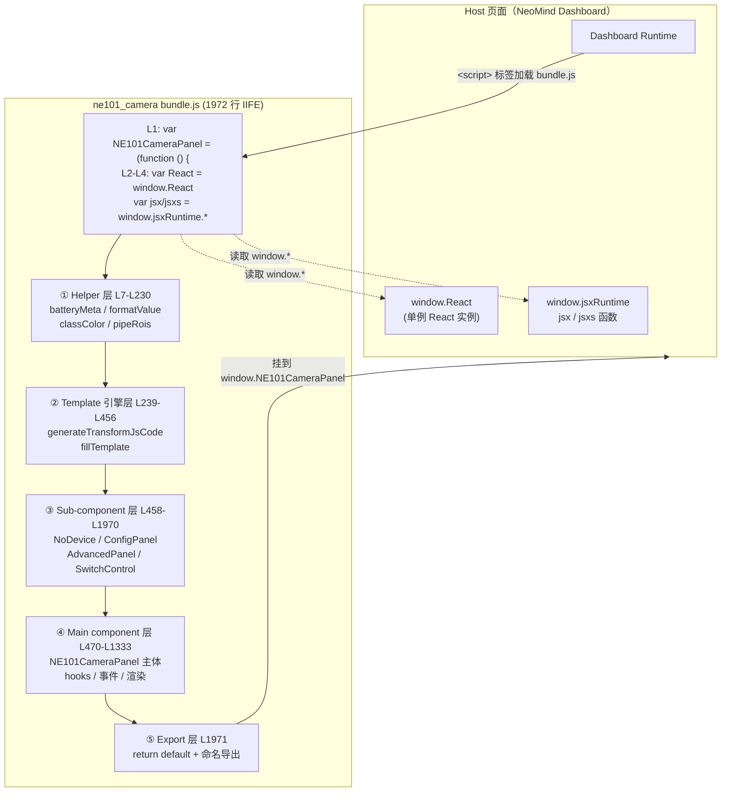
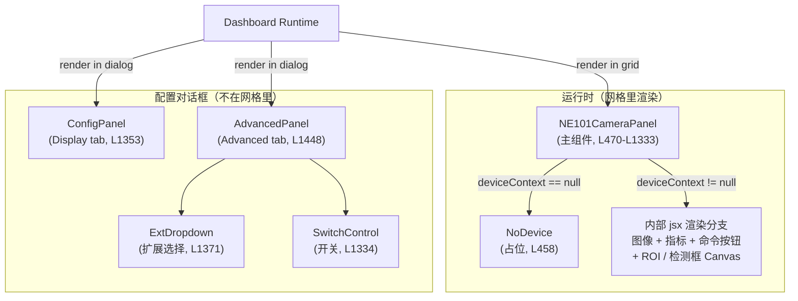
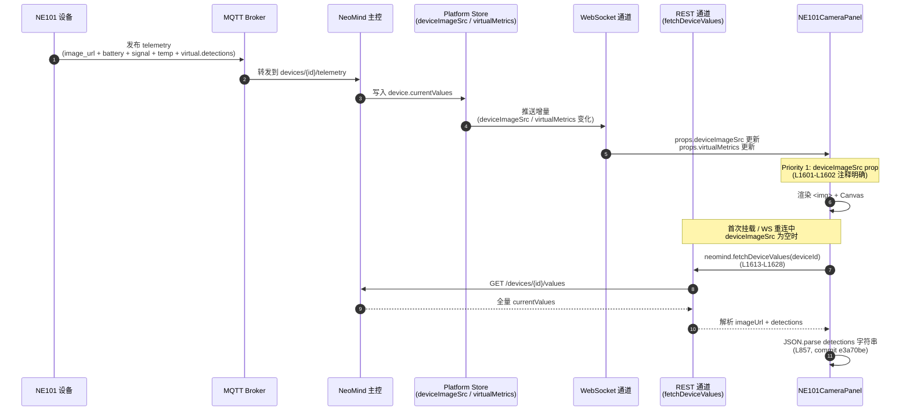

# §2 架构总览

> 本节是把 [`bundle.js`](https://github.com/camthink-ai/NeoMind-Dashboard-Components/blob/main/components/ne101_camera/bundle.js) 1972 行手写 IIFE「拆开看」的章节。读完你应当能：(1) 画出 IIFE 顶层结构与 `window.*` 注入的依赖边界；(2) 解释 helper / template / sub-component / main / export 五层的职责切分；(3) 复述组件树（根节点 `NE101CameraPanel` 加上 `ConfigPanel` / `AdvancedPanel` 两个对外子组件）以及核心 hooks 的语义；(4) 描述「WebSocket 优先 + REST 回退」的双通道数据流；(5) 在与 [#6 metric_card](../6-metric-card-component.md) 的对比里说清「设备绑定组件」与「显示型组件」的架构代差。所有行号都基于源码仓库的 `main` 分支，链接带 `#L<start>-L<end>` 锚点。

---

## §2.1 IIFE 顶层结构

ne101_camera 的 `bundle.js` 第一行不是 import，而是一句对 `window` 的契约声明。查看源码：[`bundle.js` L1-L5](https://github.com/camthink-ai/NeoMind-Dashboard-Components/blob/main/components/ne101_camera/bundle.js#L1-L5)。

```javascript
var NE101CameraPanel = (function () {
  var React = window.React;
  var jsx = window.jsxRuntime.jsx;
  var jsxs = window.jsxRuntime.jsxs;
  // ... 1965 行组件逻辑 ...
  return { default: NE101CameraPanel, NE101CameraPanel: NE101CameraPanel, ConfigPanel: ConfigPanel, AdvancedPanel: AdvancedPanel };
})();
```

这三行 `var React = window.React` + `var jsx = window.jsxRuntime.jsx` + `var jsxs = window.jsxRuntime.jsxs` 是 NeoMind 组件市场的「注入三连」，也是与 metric_card（[#6 metric_card §3.2](../6-metric-card-component.md)）共享的底层约定。它意味着 **bundle 不打包 React**，而是从宿主页面已经加载好的单例里「借」一份 React，从而保证全仪表板只有一个 React 实例，hooks 不会跨实例失效（`useContext` 返回 undefined、`useRef` 报错这类经典症状）。

为什么用 `var Name = (function(){ ... })()` 这种 IIFE 形式而不是 UMD / CommonJS / ESM？根本原因是 **Dashboard 宿主通过 `<script>` 标签注入 bundle**。`<script>` 标签没有模块作用域，IIFE 是唯一能用「函数作用域 + 闭包」模拟私有命名空间的零依赖手段：函数体内的 `function classColor` / `var white` 等等不会泄漏到 `window` 上，只有最后那一句 `return { ... }` 的对象挂到 `window.NE101CameraPanel`。UMD 虽然也能跑在 `<script>` 下，但它多了一层 `define` / `module.exports` 的探测分支，对「不跑打包器」的 NeoMind 范式是冗余的；CommonJS 的 `require` 在浏览器里根本不工作。

最后一行 [`bundle.js` L1971](https://github.com/camthink-ai/NeoMind-Dashboard-Components/blob/main/components/ne101_camera/bundle.js#L1971) 是**命名导出 + default 双暴露**：`return { default: NE101CameraPanel, NE101CameraPanel: ..., ConfigPanel: ..., AdvancedPanel: ... }`。注意 `manifest.json` 的 [`export_name: "NE101CameraPanel"`](https://github.com/camthink-ai/NeoMind-Dashboard-Components/blob/main/components/ne101_camera/manifest.json#L39) 选了命名导出（从 `NE101CameraPanel.NE101CameraPanel` 取主组件），而不是 default；但 default 同时被保留，是为了兼容那些仍写 `bundle.default` 的旧版 Dashboard 加载器（见 §2.5 决策 #2）。这种「双暴露」是 ne101_camera 区别于 metric_card 的一个细节——metric_card 也写了 `default + MetricCard`，但只导出一个组件，而 ne101_camera 要把 `ConfigPanel` / `AdvancedPanel` 一起带出去给配置对话框使用。

下图把 IIFE 的「window 注入 → IIFE 闭包 → 五层 → return 对象」这条主线画清楚。



图里的实线是「加载/注入」方向，虚线是「读取」方向。IIFE 闭包内部那五层不是物理分离的文件，而是按行号分段的「逻辑层」——这也是为什么读 ne101_camera 源码比读 metric_card 吃力：同一个文件里 helper、sub-component、main 互相穿插，必须先在脑子里建立五层模型。

---

## §2.2 五层架构拆解

ne101_camera 的 1972 行 IIFE 按职责可以切成五层。这一节给每层一个 2-3 句的职责说明，并标出关键行号深链，方便后续章节交叉引用。

### 第 1 层：Helper 层（L7-L230）

Helper 层是无状态的工具函数集，**只做纯计算、不触碰 React**。这一层的设计原则是「可以单独抽出来跑在 Node.js 里」，因为它们没有任何副作用。查看源码：[`bundle.js` L7-L230](https://github.com/camthink-ai/NeoMind-Dashboard-Components/blob/main/components/ne101_camera/bundle.js#L7-L230)。

核心 helper：

- `batteryMeta(level)`（[L7](https://github.com/camthink-ai/NeoMind-Dashboard-Components/blob/main/components/ne101_camera/bundle.js#L7-L12)）—— 把电池百分比映射成绿/黄/红三色条颜色。
- `formatValue(val, metric)` / `unitStr(metric)` / `timeAgo(iso)` —— 数值格式化与相对时间，metric_card 也有同类函数。
- `getVal(obj, key)` / `getFirst(obj, keys)` —— 支持点号路径的取值器，是处理 `values.xxx.yyy` 这类嵌套遥测字段的通用工具。
- `classColor(label)`（[L57](https://github.com/camthink-ai/NeoMind-Dashboard-Components/blob/main/components/ne101_camera/bundle.js#L55-L72)）—— **黄金角 HSV 上色**：对类别字符串做字符串哈希，再把哈希值乘以黄金角 137.508° 得到色相，保证任意类别数都有视觉可分的颜色。这条规则是 commit [`c276c23`](https://github.com/camthink-ai/NeoMind-Dashboard-Components/commit/c276c23)（`feat(ne101): per-class detection colors via golden-angle HSV rotation`）引入的。
- `PinIcon` / `ModeIcon`（[L86-L100](https://github.com/camthink-ai/NeoMind-Dashboard-Components/blob/main/components/ne101_camera/bundle.js#L86-L100)）—— 内联 SVG 图标组件，无外部依赖。
- `pipeRois(pipe)`（[L204-L230](https://github.com/camthink-ai/NeoMind-Dashboard-Components/blob/main/components/ne101_camera/bundle.js#L204-L230)）—— 从 pipeline 配置里把 ROI 数组抽出来，同时兼容新格式（`pipe.rois = [{points:[...]}`）和旧格式（`pipe.roiX/Y/W/H` 单矩形）。这是 §1.6 决策 #4 那条「向后兼容字段演进」在代码层的落点。

Helper 层之所以单独成层，是因为它们在 main component 和 sub-component 里都会被反复调用；如果散落在各处，会出现「改一个函数要 grep 全文」的维护噩梦。

### 第 2 层：Template 引擎层（L239-L456）

这是 ne101_camera 区别于所有其它 NeoMind 组件的「独门武器」：**动态生成 transform 的 js_code 字符串**。查看源码：[`bundle.js` L239-L456](https://github.com/camthink-ai/NeoMind-Dashboard-Components/blob/main/components/ne101_camera/bundle.js#L239-L456)。

`generateTransformJsCode(pipe)`（[L239](https://github.com/camthink-ai/NeoMind-Dashboard-Components/blob/main/components/ne101_camera/bundle.js#L239-L264)）接收一个 pipeline 配置对象（包含 `extId` / `template` / `categories` / `phrase` / `classFilter` / `roiEnabled` / `roiAction` / `roiX/Y/W/H`），返回一段字符串形式的 JavaScript 代码。这段代码会被塞进 NeoMind 主控的 TransformAutomation 实体里，由主控在每次抓拍后调度执行，调用扩展的 `extensions.invoke()` 并把结果写回虚拟指标。

为什么用代码生成而不是硬编码条件分支？因为不同 `processingTemplate`（`object_detection` / `ocr` / `describe` / `barcode`）需要完全不同的后处理（OCR 要拼多边形、describe 要拼描述文本、object_detection 要按类别聚合），如果用 `if (template === 'ocr') { ... } else if ...` 的写法，主组件的渲染函数会膨胀到不可读。把后处理逻辑生成成独立字符串、让主控在沙箱里 `eval` 执行，等于把「可变的后处理」从组件代码里物理剥离出去。这个决策的权衡见 §2.5 #4。

### 第 3 层：Sub-component 层（L458-L1970）

这一层包含所有「被 main component 渲染或被 Dashboard 配置对话框渲染」的 React 函数组件。和 metric_card 只导出一个 `MetricCard` 不同，ne101_camera 的 sub-component 层有 **5 个公开/私有组件**，这也是它 1972 行代码量的主要来源：

- `NoDevice`（[L458](https://github.com/camthink-ai/NeoMind-Dashboard-Components/blob/main/components/ne101_camera/bundle.js#L458-L469)）—— 设备未绑定时显示的占位卡片，告诉用户「请在配置面板里绑定设备」。
- `SwitchControl(checked, onChangeFn)`（[L1334-L1348](https://github.com/camthink-ai/NeoMind-Dashboard-Components/blob/main/components/ne101_camera/bundle.js#L1334-L1348)）—— shadcn Switch 的手写复刻，用 `data-state` 触发宿主页面的 CSS 规则，避免引入额外依赖。
- `ConfigPanel(props)`（[L1353-L1357](https://github.com/camthink-ai/NeoMind-Dashboard-Components/blob/main/components/ne101_camera/bundle.js#L1353-L1357)）—— Display tab 的内容，目前是空壳（平台负责 title 字段），但保留导出给配置对话框的 tab 结构。
- `ExtDropdown(props)`（[L1371-L1446](https://github.com/camthink-ai/NeoMind-Dashboard-Components/blob/main/components/ne101_camera/bundle.js#L1371-L1446)）—— shadcn 风格的扩展选择下拉框，替代原生 `<select>`，支持 loading 态和外部点击关闭。
- `AdvancedPanel(props)`（[L1448-L1970](https://github.com/camthink-ai/NeoMind-Dashboard-Components/blob/main/components/ne101_camera/bundle.js#L1448-L1970)）—— **高级配置面板**：AI 处理开关、扩展选择、模板选择、ROI 编辑器、ROI 重叠阈值滑块、NMS 阈值透传。这一个组件就有 522 行，是整个 bundle 最长的一段。

### 第 4 层：Main component 层（L470-L1333）

`NE101CameraPanel(props)`（[L472](https://github.com/camthink-ai/NeoMind-Dashboard-Components/blob/main/components/ne101_camera/bundle.js#L470-L1333)）是运行时挂到网格里的主组件。它消费平台注入的 props（`config` / `deviceContext` / `deviceImageSrc` / `virtualMetrics` / `sendDeviceCommand`），内部用一组 hooks 管理命令加载状态、扩展状态、transform 生命周期、检测缓存、图像 layout 等。核心 hooks 见 §2.3。

### 第 5 层：Export 层（L1971）

只有一行：`return { default: NE101CameraPanel, NE101CameraPanel: NE101CameraPanel, ConfigPanel: ConfigPanel, AdvancedPanel: AdvancedPanel };`。这一行同时是 IIFE 的结束括号（`})()`），把闭包内所有声明打包挂到 `window.NE101CameraPanel`。manifest 的 `global_name` 和 `export_name` 都指向 `NE101CameraPanel`，平台的加载器据此取命名导出。

---

## §2.3 组件树（NE101CameraPanel / ConfigPanel / AdvancedPanel）

NeoMind Dashboard 对一个「设备绑定组件」的对外契约是：**主组件 + 可选的 Display tab 配置面板 + 可选的 Advanced tab 配置面板**。ne101_camera 把这三个角色都填满了，构成了一个三对外组件的组件树。



`ConfigPanel` 是「Display tab」的内容，负责用户可见的显示配置（标题、位置等）。ne101_camera 当前把标题字段让给了平台的 `ComponentConfigDialog`（见 [`bundle.js` L1354-L1356](https://github.com/camthink-ai/NeoMind-Dashboard-Components/blob/main/components/ne101_camera/bundle.js#L1353-L1357) 的注释），所以 `ConfigPanel` 本身返回 `null`，但保留导出是为了不破坏「主组件 + Display + Advanced」的三件套契约。

`AdvancedPanel`（[L1448](https://github.com/camthink-ai/NeoMind-Dashboard-Components/blob/main/components/ne101_camera/bundle.js#L1448-L1970)）是真正承载复杂度的配置面板，包含：(1) AI 处理总开关；(2) 扩展选择下拉框（`ExtDropdown`）；(3) 模板选择（object_detection / ocr / describe / barcode）；(4) 类别过滤 / 短语输入；(5) ROI 开关 + 多边形编辑器（用户在画布上拖拽点）；(6) ROI 重叠阈值滑块（`processingRoiOverlap`，commit [`636a8ae`](https://github.com/camthink-ai/NeoMind-Dashboard-Components/commit/636a8ae)）；(7) NMS IoU 阈值透传给 `locate-anything-v2`（commit [`8656148`](https://github.com/camthink-ai/NeoMind-Dashboard-Components/commit/8656148)）。

`NE101CameraPanel` 主组件的核心 hooks（位于 [`bundle.js` L484-L513](https://github.com/camthink-ai/NeoMind-Dashboard-Components/blob/main/components/ne101_camera/bundle.js#L484-L513)）构成了它的状态机骨架：

| Hook | 行号 | 作用 |
|------|------|------|
| `cmdState = React.useState({})` | [L484](https://github.com/camthink-ai/NeoMind-Dashboard-Components/blob/main/components/ne101_camera/bundle.js#L484-L486) | 设备命令的 loading 状态字典，key 是命令名 |
| `extStatusState = React.useState('idle')` | [L504-L506](https://github.com/camthink-ai/NeoMind-Dashboard-Components/blob/main/components/ne101_camera/bundle.js#L504-L506) | 扩展调用的状态机：`idle` / `running` / `done` / `error` |
| `transformIdRef = React.useRef(null)` | [L509](https://github.com/camthink-ai/NeoMind-Dashboard-Components/blob/main/components/ne101_camera/bundle.js#L509) | 当前 Transform 的 ID，用于卸载时清理 |
| `lastDetsRef = React.useRef([])` | [L512](https://github.com/camthink-ai/NeoMind-Dashboard-Components/blob/main/components/ne101_camera/bundle.js#L512) | 缓存上一帧检测结果，避免图像与检测错配 |
| `lastDetsTsRef = React.useRef(null)` | [L513](https://github.com/camthink-ai/NeoMind-Dashboard-Components/blob/main/components/ne101_camera/bundle.js#L513) | 上一帧检测对应的 source_ts |

这一组 hooks 揭示了 ne101_camera 状态机的三个轴：**命令轴**（用户主动操作的短期状态）、**扩展轴**（AI 调度的中期状态）、**检测缓存轴**（跨帧对齐的长期 ref）。metric_card 只有一个轴（数据拉取的 loading/data/error），这是两者最直观的复杂度差距。

> **hooks 顺序陷阱**：commit [`0601cd4`](https://github.com/camthink-ai/NeoMind-Dashboard-Components/commit/0601cd4)（`fix(ne101_camera): move conditional useState hook to fix React error #310`）专门修过一处「条件 useState 导致 hooks 顺序不一致」的 bug。在 IIFE 里写 hooks 时，由于缺少 ESLint 的 `rules-of-hooks` 检查，这类错误很容易被漏掉——这是手写 IIFE 范式的一个隐性代价。

---

## §2.4 数据流：WebSocket 优先 + REST 回退

ne101_camera 的数据流是它和 metric_card 差异最大的地方。metric_card 用 `fetchData` prop 做轮询拉取，而 ne101_camera 走的是 **WebSocket 推送（增量）+ REST 拉取（全量回退）** 的双通道。

下图展示从设备抓拍到组件渲染的完整链路，重点标出 WebSocket 与 REST 两条通道的优先级关系。



这条数据流的核心约定写在 [`bundle.js` L1601-L1602](https://github.com/camthink-ai/NeoMind-Dashboard-Components/blob/main/components/ne101_camera/bundle.js#L1601-L1602) 的注释里：

```javascript
// Fetch preview image from bound device
// Priority: 1. deviceImageSrc prop (from platform store, populated by WebSocket)
//           2. REST fetch via fetchDeviceValues (fallback)
```

**Priority 1：`deviceImageSrc` prop**。这个 prop 来自平台的 device store，由 WebSocket 推送填充。平台订阅 `devices/{device_id}/telemetry` 主题，每收到一条消息就更新 store，再通过 React props 把 `deviceImageSrc` 注入组件。这是**实时通道**——延迟低（毫秒级），但可靠性受限于 WebSocket 连接状态（重连中会丢消息），且大体积的 base64 图像可能超出 WS 消息大小限制（见 [`bundle.js` L515-L517](https://github.com/camthink-ai/NeoMind-Dashboard-Components/blob/main/components/ne101_camera/bundle.js#L515-L517) 的注释）。

**Priority 2：REST 回退**。当 `deviceImageSrc` 为空时（首次挂载、WS 重连中、或图像体积超限），组件用 `window.neomind.fetchDeviceValues(deviceId)` 拉取全量 `currentValues`（见 [`bundle.js` L1613-L1628](https://github.com/camthink-ai/NeoMind-Dashboard-Components/blob/main/components/ne101_camera/bundle.js#L1613-L1628) 的 `fetchPreview` 函数）。这是**可靠通道**——一定有响应，但延迟高（HTTP 往返）。

这条双通道策略的引入节点是两个关键 commit：

- commit [`b0be12b`](https://github.com/camthink-ai/NeoMind-Dashboard-Components/commit/b0be12b)（`fix(ne101): initial fetch on mount for image + virtual metrics`）—— 修复了「组件挂载时如果 WebSocket 还没推送第一条消息，画面就空白」的问题，在 mount effect 里主动触发一次 REST 拉取。
- commit [`0eedd27`](https://github.com/camthink-ai/NeoMind-Dashboard-Components/commit/0eedd27)（`fix(ne101): update virtual data on WS-triggered REST fetch`）—— 修复了「WS 推送的增量只含小指标（battery/ts），大图像要靠 REST 补」的问题，让 WS 触发的 REST fetch 同时刷新 virtual metrics。

检测数据的解析有一个容易踩的坑：后端把 `detections` 虚拟指标存成 **JSON 字符串**而不是数组。[`bundle.js` L857](https://github.com/camthink-ai/NeoMind-Dashboard-Components/blob/main/components/ne101_camera/bundle.js#L853-L867) 用 try/catch 做了防御性解析：

```javascript
var vDet = getFirst(vals, [pfx + 'detections', 'values.' + pfx + 'detections']);
if (typeof vDet === 'string') { try { vDet = JSON.parse(vDet); } catch(e) { vDet = null; } }
```

这个修复来自 commit [`e3a70be`](https://github.com/camthink-ai/NeoMind-Dashboard-Components/commit/e3a70be)（`fix(ne101): parse JSON string detections from backend virtual metrics`）。在此之前，组件假设 `vDet` 一定是数组，遇到字符串就崩溃。这是「设备绑定组件」常见的契约模糊地带——后端的序列化策略和前端的反序列化假设不一致，§4 数据契约会专门讨论。

---

## §2.5 关键设计决策（≥4，含权衡与替代方案）

本节列出 5 个塑造 ne101_camera 当前形态的架构决策。每个决策给出「我们选 X / 替代方案 Y / 理由 Z」三段式，以及付出的代价。

### 决策 #1：IIFE + window.React 而非打包 React

**选择**：用 `var NE101CameraPanel = (function(){ var React = window.React; ... })()` 的 IIFE 形式，不打包 React，从宿主页面借用单例。

**替代方案**：用 Rollup / Webpack 把 React 作为 external 或直接打进 bundle。

**理由**：(1) Dashboard 宿主已经提供 React，每个组件再打包一份会让全仪表板出现 N 个 React 实例，hooks 跨实例失效（`useContext` 返回 undefined、`useRef` 报错）；(2) IIFE 共享单例每个组件节省约 140KB（React + ReactDOM minified），10 个组件就是 1.4MB；(3) 保证组件的 React 版本与宿主一致，不会出现「组件用 React 18 的 `useSyncExternalStore`，宿主还停在 React 17」的版本错配。

**代价**：(1) 没有 tree-shaking，整个 helper 层即使某些函数没被用到也会进 bundle；(2) 没有 TypeScript 类型检查，`getFirst(vals, keys)` 这类函数的参数类型全靠注释和约定；(3) 没有 ESLint 的 `rules-of-hooks`，hooks 顺序错误只能靠运行时发现（commit `0601cd4` 就是这类 bug）。metric_card 接受这个代价因为只有 352 行；ne101_camera 1972 行仍然接受，靠的是 `test_bundle.js` 做逻辑测试兜底。

### 决策 #2：命名导出 + default 双暴露

**选择**：[`bundle.js` L1971](https://github.com/camthink-ai/NeoMind-Dashboard-Components/blob/main/components/ne101_camera/bundle.js#L1971) 的 return 对象同时包含 `default` 和命名导出（`NE101CameraPanel` / `ConfigPanel` / `AdvancedPanel`）。

**替代方案**：只暴露 `default`，让平台从 `bundle.default` 取主组件。

**理由**：(1) manifest 的 [`export_name: "NE101CameraPanel"`](https://github.com/camthink-ai/NeoMind-Dashboard-Components/blob/main/components/ne101_camera/manifest.json#L39) 明确选了命名导出，平台的加载器从 `window.NE101CameraPanel.NE101CameraPanel` 取主组件；(2) 但保留 default 兼容旧版 Dashboard 加载器（v1.x 时代写的是 `bundle.default`），避免一次破坏性升级；(3) `ConfigPanel` 和 `AdvancedPanel` 必须用命名导出，因为配置对话框要分别引用它们渲染 Display tab 和 Advanced tab。

**代价**：return 对象多一层冗余（`default` 和 `NE101CameraPanel` 指向同一个函数），但这是「向前兼容」的标准代价，可忽略。

### 决策 #3：WebSocket 优先 + REST 回退的双通道

**选择**：图像数据走两条通道——Priority 1 是 `props.deviceImageSrc`（WebSocket 推送），Priority 2 是 `neomind.fetchDeviceValues(deviceId)`（REST 拉取）。

**替代方案**：只用 WebSocket，依赖平台 store 的推送覆盖所有场景。

**理由**：(1) WebSocket 可能丢消息（重连中、网络抖动），首次挂载时如果 WS 还没推送第一条，画面会空白；(2) 大体积的 base64 图像可能超出 WS 消息大小限制（见 [`bundle.js` L515-L517](https://github.com/camthink-ai/NeoMind-Dashboard-Components/blob/main/components/ne101_camera/bundle.js#L515-L517) 的注释），WS 只推小指标（battery/ts），图像必须 REST 拉；(3) REST 保证「首次挂载一定有数据」，这是用户体验的底线。commit [`b0be12b`](https://github.com/camthink-ai/NeoMind-Dashboard-Components/commit/b0be12b) 就是专门为这个底线加的 mount effect。

**代价**：(1) 组件要维护两条数据路径，代码复杂度翻倍；(2) WS 推送和 REST 拉取可能产生「数据竞态」（REST 返回旧数据覆盖了 WS 推送的新数据），需要用 `lastFetchTsRef` 和 `fetchingRef`（[`bundle.js` L523-L524](https://github.com/camthink-ai/NeoMind-Dashboard-Components/blob/main/components/ne101_camera/bundle.js#L523-L524)）做去重。commit [`0eedd27`](https://github.com/camthink-ai/NeoMind-Dashboard-Components/commit/0eedd27) 修过一次这个竞态。

### 决策 #4：动态生成 transform JS 代码

**选择**：用 `generateTransformJsCode(pipe)`（[L239](https://github.com/camthink-ai/NeoMind-Dashboard-Components/blob/main/components/ne101_camera/bundle.js#L239-L456)）把 pipeline 配置序列化成一段 JavaScript 代码字符串，塞进 TransformAutomation 实体的 `js_code` 字段。

**替代方案**：在组件内部用条件分支硬编码处理逻辑（`if (template === 'ocr') { ... } else if (template === 'describe') { ... }`）。

**理由**：(1) 不同 `processingTemplate`（`object_detection` / `ocr` / `describe` / `barcode`）的后处理差异极大——OCR 要把检测框拼成多边形并提取文本、describe 要拼描述字符串、object_detection 要按类别聚合计数——硬编码会让主组件的渲染函数膨胀到不可读；(2) 代码生成把「可变的后处理」从组件代码里物理剥离，让主控在独立沙箱里执行，避免组件 bundle 承担 AI 调度逻辑；(3) 生成的代码是「声明式」的（用户改配置 → 重新生成），比命令式的 `if/else` 更容易推理。

**代价**：(1) 字符串拼接的代码没有语法检查，拼错了只能在运行时发现；(2) 主控需要在沙箱里 `eval` 这段代码，有（受控的）安全风险；(3) 调试困难——出错时栈帧指向生成的字符串，不指向源码。`test_bundle.js` 里有专门针对 `generateTransformJsCode` 的快照测试来缓解这个问题。

### 决策 #5：黄金角 HSV 给类别上色

**选择**：`classColor(label)`（[L57-L72](https://github.com/camthink-ai/NeoMind-Dashboard-Components/blob/main/components/ne101_camera/bundle.js#L55-L72)）用字符串哈希 + 黄金角 137.508° 旋转生成 HSV 色相。

**替代方案**：固定调色板（`['#ef4444', '#3b82f6', '#10b981', ...]`，按类别 index 取色）。

**理由**：(1) 黄金角旋转保证任意类别数都有视觉可分的颜色——固定调色板在第 9 种颜色之后就开始重复，而 ne101_camera 可能遇到 COCO 的 80 类、OpenImages 的 500+ 类；(2) 同一个类别标签永远哈希到同一个颜色，跨帧跨设备一致，不需要维护「类别 → 颜色」的映射表；(3) 哈希是纯函数，无副作用，可以直接放进 helper 层。commit [`c276c23`](https://github.com/camthink-ai/NeoMind-Dashboard-Components/commit/c276c23) 引入这条规则，之前的实现是固定调色板。

**代价**：(1) 哈希碰撞的概率虽然低但不为零（两个类别标签可能哈希到相近色相）；(2) 生成的颜色不受设计师控制，可能出现「品牌色不协调」的视觉问题；(3) HSV 空间不是感知均匀的（蓝色区域人眼区分度低），理论上不如 OKLCH。实测在 ≤ 50 类的场景下效果可接受。

---

## §2.6 与 #6 metric_card 的架构对比

下表把 ne101_camera 和 [#6 metric_card](../6-metric-card-component.md) 在 6 个维度上做对照，帮助读者建立「显示型组件 vs 设备绑定组件」的架构代差认知。metric_card 的相关字段可以参考它的 [§3.1 manifest 契约](../6-metric-card-component.md)。

| 维度 | #6 metric_card | #7 ne101_camera | 代差解读 |
|------|----------------|-----------------|----------|
| **代码量** | 352 行 IIFE | 1972 行 IIFE | ne101 多出来的 1620 行主要在 sub-component 层（`AdvancedPanel` 522 行）和 template 引擎层（`generateTransformJsCode` 217 行），这些都是「设备绑定 + AI 处理流水线」独有的复杂度。 |
| **组件数** | 1 个对外组件（`MetricCard`） | 3 个对外组件（`NE101CameraPanel` + `ConfigPanel` + `AdvancedPanel`）+ 5 个内部 sub-component | metric_card 的「单组件」意味着它没有配置对话框的 tab 结构；ne101 的三件套是平台对「有 `has_device_binding` 或复杂 `config_schema` 的组件」的要求。 |
| **数据接入** | `has_data_source: true` + `fetchData` prop（通用） | `has_device_binding: true` + `device_type_filter: ["ne101_camera"]`（专用） | metric_card 消费任何 DataSource（设备遥测 / 扩展指标 / 系统指标），ne101 只消费 `device.type === "ne101_camera"` 的设备。这是「通用 vs 专用」的根本分野。 |
| **配置复杂度** | 简单 display config（`label` / `unit` / `decimalPlaces`） | 18 字段 `default_config`（[manifest.json L18-L37](https://github.com/camthink-ai/NeoMind-Dashboard-Components/blob/main/components/ne101_camera/manifest.json#L18-L37)）：processing pipeline + ROI + NMS + categories + phrase | ne101 的配置字段数是 metric_card 的 3 倍以上，且每个字段都有默认值和兼容性回退逻辑（`processingRois` 数组 vs 单矩形）。 |
| **导出方式** | `default + MetricCard` 双暴露（但只用 default） | `default + NE101CameraPanel + ConfigPanel + AdvancedPanel` 四字段暴露 | metric_card 的 default 双暴露是「向前兼容的保险」；ne101 的命名导出是「配置对话框必须用的契约」。 |
| **适用场景** | 任何标量指标（温度、电池、延迟、计数） | 仅 `ne101_camera` 设备类型 | metric_card 是「万能数值卡」，ne101 是「专用摄像头面板」。如果 NE101 设备被淘汰，ne101 组件也会随之废弃；metric_card 永远不会因为某个设备类型消失而失效。 |

**总结一句话**：metric_card 是「薄组件 + 厚通用性」，ne101_camera 是「厚组件 + 薄专用性」。前者的价值在于覆盖面广，后者的价值在于把一条复杂的设备链路收敛成单一面板。两者不是替代关系，而是递进关系——ne101_camera 在 metric_card 的 IIFE 注入 + manifest 契约 + 内联 style 三件套基础上，增加了设备绑定、图像画布、AI 处理流水线、ROI 叠加四层新能力。

---

## §2.7 小结

本节拆解了 ne101_camera 的五层 IIFE 架构、三对外组件的组件树、WebSocket 优先 + REST 回退的双通道数据流，以及 5 个关键设计决策。核心结论三条：

1. **五层架构**（helper / template / sub-component / main / export）不是物理分离，而是同一文件里的逻辑分层。读源码时要先在脑子里建立五层模型，否则会被 1972 行的代码量压垮。
2. **双通道数据流**（WebSocket + REST）是设备绑定组件区别于显示型组件的核心特征。metric_card 用单一 `fetchData` 通道就够，ne101 必须双通道才能兼顾实时性和可靠性。
3. **代码生成（`generateTransformJsCode`）** 是 ne101_camera 独有的架构创新，把「可变的后处理」从组件代码里物理剥离。这个模式在后续案例里会被复用。

### 演进里程碑表

以下 6 个 commit 是 ne101_camera 架构演进的关键节点，按时间顺序排列。完整 commit 历史可用 `git log --oneline -- components/ne101_camera/` 在源码仓库查看。

| Commit | 类型 | 一句话说明 | 影响的架构层 |
|--------|------|------------|------------|
| [`c276c23`](https://github.com/camthink-ai/NeoMind-Dashboard-Components/commit/c276c23) | feat | per-class detection colors via golden-angle HSV rotation | Helper 层（`classColor` L57） |
| [`8656148`](https://github.com/camthink-ai/NeoMind-Dashboard-Components/commit/8656148) | feat | pass NMS IoU threshold 0.5 to locate-anything-v2 | Template 引擎层（透传 NMS 参数） |
| [`636a8ae`](https://github.com/camthink-ai/NeoMind-Dashboard-Components/commit/636a8ae) | feat | make ROI overlap threshold configurable | Sub-component 层（`AdvancedPanel` 滑块） |
| [`b0be12b`](https://github.com/camthink-ai/NeoMind-Dashboard-Components/commit/b0be12b) | fix | initial fetch on mount for image + virtual metrics | Main component 层（mount effect 的 REST 回退） |
| [`e3a70be`](https://github.com/camthink-ai/NeoMind-Dashboard-Components/commit/e3a70be) | fix | parse JSON string detections from backend virtual metrics | Main component 层（[`L857`](https://github.com/camthink-ai/NeoMind-Dashboard-Components/blob/main/components/ne101_camera/bundle.js#L853-L867) 的 JSON.parse） |
| [`0601cd4`](https://github.com/camthink-ai/NeoMind-Dashboard-Components/commit/0601cd4) | fix | move conditional useState hook to fix React error #310 | Main component 层（hooks 顺序修复） |

### 后续章节桥接

- [§3 扩展侧](./3-extension-side.md)（v1.1）—— 深入 `processingExtensionId` 契约，讲解扩展如何消费图像、如何回写检测结果，以及 `generateTransformJsCode` 生成的代码在主控沙箱里的执行细节。
- [§4 数据契约](./4-data-contract.md)（MVP）—— MQTT 主题命名、WebSocket 增量消息格式、`detections` 字段 schema、ROI 多边形 vs 单矩形的 JSON 结构。本节提到的 JSON string 解析坑（commit `e3a70be`）会在那里展开成完整的 schema 讨论。
- [§5 前端消费](./5-frontend-consume.md)（MVP）—— 组件如何拉取 detections、解析 JSON string、按类别上色（`classColor` 的黄金角 HSV）、画检测框和 ROI 多边形。
- [§6 组件构建](./6-component-build.md)（MVP）—— `NE101CameraPanel` 命名导出的写法、React hooks 在 IIFE 中的陷阱（commit `0601cd4`）、`AdvancedPanel` 的分层设计。
- 回到 [§1 业务背景](./1-background.md) —— 如果你还没读过，先读 §1 再回来读本节，叙事会更连贯。

---

*最后更新: 2026-06-23*
