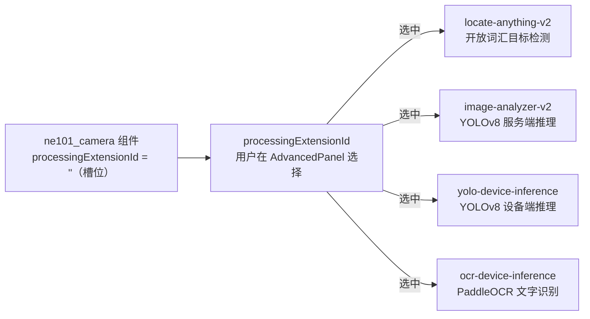

# 3 扩展侧：processingExtensionId 通用 AI 处理契约

> 本节是 ne101_camera 案例的**扩展侧契约参考页**，覆盖 `processingExtensionId` 通用 AI 处理契约：白名单校验（`AI_EXT_IDS`）、模式映射（`EXT_MODES`）、`__imageData` 注入机制和降级策略。

---

## 3.1 processingExtensionId 通用契约

ne101_camera 组件最容易被误解的一点是：它看起来在做「AI 物体检测」，但翻遍 1972 行 `bundle.js`，你找不到一行 YOLO 推理、一行 ONNX runtime、一行模型权重加载。组件本身**不做任何 AI**。所有 AI 推理都被外包给了用户通过 `processingExtensionId` 配置字段指定的扩展。这个字段位于 [`manifest.json` L23-L24](https://github.com/camthink-ai/NeoMind-Dashboard-Components/blob/main/components/ne101_camera/manifest.json#L23-L24) 的 `default_config` 块里：

```json
"processingEnabled": false,
"processingExtensionId": "",
```

`processingEnabled` 是总开关（默认 false，开箱即用只是一个纯展示摄像头画面的组件），`processingExtensionId` 是扩展 ID 槽位（默认空字符串 = 未选中任何扩展 = 不做处理）。当用户在 `AdvancedPanel` 里把总开关打开并从下拉框选择了一个扩展（例如 `locate-anything-v2`）后，组件的 `generateTransformJsCode` 会把扩展 ID 写进生成的 Transform 代码的 `extensions.invoke()` 调用里，Transform 在主控沙箱执行时由平台负责把调用路由到对应扩展的 HTTP/RPC 端点。

这个「组件 + 可插拔扩展」契约是 NeoMind 生态 AI 复用的**模板**：一个组件，N 个推理后端。同一个 ne101_camera 组件，搭配 `locate-anything-v2` 就是「开放词汇目标检测」，搭配 `ocr-device-inference` 就是「OCR 文字识别」，搭配 `yolo-device-inference` 就是「边缘设备端 YOLOv8 推理」。组件本身不需要知道这些扩展的内部实现，只需要知道如何调用它们、如何归一化它们的响应（见 [4.3](./4-data-contract.md)）。

**为什么选择「可插拔扩展」而不是「内置 AI」**：如果组件自己打包了一个 YOLO 模型（例如把 onnxruntime-web + yolov8n.weights 嵌进 bundle），会有三个严重后果。第一，bundle 体积爆炸——一个量化后的 YOLOv8n 权重就有 12MB，加上 onnxruntime-web 的 WASM 大约 12MB，整个 bundle 从 80KB 暴涨到 25MB 以上，平台加载时间从毫秒级变成秒级。第二，模型选择被锁死——用户想要 OCR 就得换一个「内置 OCR 模型」版本的组件，组件市场的 SKU 数量成倍增长。第三，模型更新和组件更新强耦合——YOLO 模型每迭代一版就要发一个新组件版本，而扩展是独立部署的（由用户或平台运维单独升级），扩展更新不需要触碰组件代码。「可插拔扩展」把这三个问题全部解开了：组件保持 80KB，用户自己选模型，扩展可以独立更新。

下图展示了「组件 → processingExtensionId → N 个候选扩展」的扇出关系。组件只暴露一个槽位，由用户的下拉选择决定实际调用哪一个扩展，扩展之间互不感知。



**设计决策：可插拔扩展 vs 内置 AI 模型**

- **选择**：组件零 AI，推理外包给 `processingExtensionId` 指定的扩展（[manifest.json L24](https://github.com/camthink-ai/NeoMind-Dashboard-Components/blob/main/components/ne101_camera/manifest.json#L24-L24)）。
- **备选方案 A**：组件打包自己的 YOLO 模型（onnxruntime-web + 权重文件）。否决理由：bundle 体积从 80KB 暴涨到 25MB+，加载时间从毫秒变秒，且模型选择被锁死——想要 OCR 必须换组件版本。
- **备选方案 B**：组件打包多个模型（一个检测 + 一个 OCR），按用户配置在运行时切换。否决理由：体积问题更严重（25MB x 2），且模型之间会有 GPU/WASM 内存竞争。
- **理由**：可插拔扩展让组件保持轻量（80KB），模型选择权交给用户（按场景挑扩展），扩展可独立升级（不影响组件版本）。这是 NeoMind 组件市场「一组件多用途」范式的根基。
- **代价**：组件无法在「没有安装任何 AI 扩展」的环境下做检测——但这正是 `processingExtensionId` 默认空字符串的语义（纯展示模式）。

---

## 3.2 AI_EXT_IDS 白名单

平台上有许多扩展（天气、ONVIF 桥接、各种 AI 推理），但 ne101_camera 只关心**能消费图像输入并返回检测结果**的 AI 扩展。组件用一个硬编码的白名单来过滤，定义在 [`bundle.js` L144](https://github.com/camthink-ai/NeoMind-Dashboard-Components/blob/main/components/ne101_camera/bundle.js#L144-L144)：

```javascript
var AI_EXT_IDS = ['locate-anything-v2', 'image-analyzer-v2', 'yolo-device-inference', 'ocr-device-inference'];
```

这四个扩展的职责分别是：

- **`locate-anything-v2`** —— 基于 Grounding DINO 风格的开放词汇目标检测，支持「找一只猫」「找红色汽车」这类自由文本描述（phrase），是四个扩展里模式最多（5 个）、能力最广的一个。
- **`image-analyzer-v2`** —— 服务端 YOLOv8 目标检测，固定类别集（COCO 80 类），不需要 phrase 输入，适合「数人头」「数车辆」这类标准检测场景。
- **`yolo-device-inference`** —— 边缘设备端 YOLOv8 推理，与 `image-analyzer-v2` 功能类似但推理发生在 NE101 设备本身（而非服务端），延迟更低、不占服务端 GPU。
- **`ocr-device-inference`** —— PaddleOCR 文字识别，返回文本块及其多边形包围盒，用于「车牌识别」「告示牌文字提取」场景。

这个白名单在 `AdvancedPanel` 的扩展加载逻辑里被使用，位于 [`bundle.js` L1488-L1491](https://github.com/camthink-ai/NeoMind-Dashboard-Components/blob/main/components/ne101_camera/bundle.js#L1488-L1491)。组件调用 `window.neomind.listExtensions()` 拿到平台所有已安装扩展的列表，然后用白名单做过滤：

```javascript
var arr = Array.isArray(exts) ? exts : [];
var filtered = [];
for (var i = 0; i < arr.length; i++) {
  if (AI_EXT_IDS.indexOf(arr[i].id) >= 0) filtered.push(arr[i]);
}
```

过滤后的 `filtered` 数组才会传给 `ExtDropdown` 渲染成下拉选项。这意味着即使平台上装了 `weather-forecast-v2`、`onvif-bridge`、`uink-rms-bridge` 等非 AI 扩展，它们也不会出现在 ne101_camera 的扩展选择下拉框里——因为这些扩展无法消费图像输入，选中了也只是 Transform 调用失败。

**为什么用硬编码白名单而不是「显示所有扩展」**：用户体验是核心理由。如果下拉框里混入 `weather-forecast-v2`，用户可能会选中它，然后困惑于「为什么摄像头画面上没有检测框」——天气扩展根本不接受图像参数。白名单把「能用的」和「不能用的」在 UI 层就分开了，避免用户进入「选错了但不知道为什么」的死胡同。

**设计决策：硬编码白名单 vs 元数据驱动 vs 显示全部**

- **选择**：在 `bundle.js` 里硬编码 `AI_EXT_IDS = ['locate-anything-v2', ...]` 四元素数组（[L144](https://github.com/camthink-ai/NeoMind-Dashboard-Components/blob/main/components/ne101_camera/bundle.js#L144-L144)），用 `indexOf` 做过滤（[L1488-L1491](https://github.com/camthink-ai/NeoMind-Dashboard-Components/blob/main/components/ne101_camera/bundle.js#L1488-L1491)）。
- **备选方案 A**：元数据驱动——扩展在自己的 manifest 里声明 `"supports_image": true`，组件读这个字段做过滤。否决理由：这要求所有扩展作者遵守一个「声明能力」的契约，而 NeoMind 当前的扩展 manifest 没有这个字段。引入它需要平台层面的标准化，短期内不会发生。
- **备选方案 B**：显示所有已安装扩展。否决理由：非 AI 扩展（天气、ONVIF 桥）混入下拉框，用户选错后 Transform 调用失败，体验极差，且排错困难（错误可能延迟到运行 Transform 时才暴露）。
- **理由**：硬编码白名单是最简单的方案——四个扩展是已知的、稳定的 AI 集合，新增一个 AI 扩展时只需要往数组里加一个字符串。在没有扩展元数据标准的当下，这是务实的选择。
- **代价**：新增 AI 扩展需要修改组件代码（往 `AI_EXT_IDS` 加元素 + 往 `EXT_MODES` 加模式定义）。但 3.7 的宽容回退机制保证了「新扩展 + 旧白名单」也能跑起来（走默认 `detect` 命令）。

---

## 3.3 EXT_MODES 模式目录

每个扩展不只有一种调用方式——`locate-anything-v2` 既能做按类别的目标检测，也能做按自由文本的 grounding，还能做 OCR。组件用一个**模式目录** `EXT_MODES` 来描述「这个扩展支持哪几种调用模式，每种模式的参数和响应格式是什么」。这个目录位于 [`bundle.js` L154-L171](https://github.com/camthink-ai/NeoMind-Dashboard-Components/blob/main/components/ne101_camera/bundle.js#L154-L171)，结构是一个以扩展 ID 为键的对象，值是该扩展支持的模式数组。每个模式是一个对象，包含 `id` / `command` / `imageArg` / `responseType` / `label` / `desc` / `icon` / `args` 八个字段。

```js
  var EXT_MODES = {
    'locate-anything-v2': [
      { id: 'object_detection', command: 'detect', imageArg: 'image_base64', responseType: 'boxes_x1y1x2y2', label: 'Object Detection', desc: 'Detect objects by category', icon: 'search', args: ['categories'] },
      { id: 'grounding', command: 'ground', imageArg: 'image_base64', responseType: 'boxes_x1y1x2y2', label: 'Grounding', desc: 'Find objects by description', icon: 'target', args: ['phrase'] },
      { id: 'text_detection', command: 'detect_text', imageArg: 'image_base64', responseType: 'boxes_x1y1x2y2', label: 'Text Detection', desc: 'Extract text from image', icon: 'text', args: [] },
      { id: 'ground_gui', command: 'ground_gui', imageArg: 'image_base64', responseType: 'boxes_x1y1x2y2', label: 'UI Grounding', desc: 'Locate UI elements by description', icon: 'monitor', args: ['phrase'] },
      { id: 'point', command: 'point', imageArg: 'image_base64', responseType: 'boxes_x1y1x2y2', label: 'Point', desc: 'Point to specific objects', icon: 'cursor', args: ['phrase'] }
    ],
    'image-analyzer-v2': [
      { id: 'object_detection', command: 'analyze_image', imageArg: 'image', responseType: 'objects_bbox', label: 'Object Detection', desc: 'YOLOv8 object detection', icon: 'search', args: [] }
    ],
    'yolo-device-inference': [
      { id: 'object_detection', command: 'analyze_image', imageArg: 'image', responseType: 'detections_bbox', label: 'Object Detection', desc: 'YOLOv8 device inference', icon: 'search', args: [] }
    ],
    'ocr-device-inference': [
      { id: 'text_detection', command: 'recognize_image', imageArg: 'image', responseType: 'ocr_text_blocks', label: 'Text Detection', desc: 'OCR text recognition', icon: 'text', args: [] }
    ]
  };
```

*Source: [`bundle.js` L154-L171](https://github.com/camthink-ai/NeoMind-Dashboard-Components/blob/main/components/ne101_camera/bundle.js#L154-L171)*

四个扩展的模式分布如下：

- **`locate-anything-v2`**（[L155-L161](https://github.com/camthink-ai/NeoMind-Dashboard-Components/blob/main/components/ne101_camera/bundle.js#L155-L161)）—— 5 个模式，全部走 `boxes_x1y1x2y2` 响应格式，全部用 `image_base64` 入参：
  - `object_detection`（按类别检测，需要 `categories` 输入）
  - `grounding`（按短语定位，需要 `phrase` 输入）
  - `text_detection`（文字检测，无额外输入）
  - `ground_gui`（UI 元素定位，需要 `phrase` 输入）
  - `point`（指向特定目标，需要 `phrase` 输入）
- **`image-analyzer-v2`**（[L162-L164](https://github.com/camthink-ai/NeoMind-Dashboard-Components/blob/main/components/ne101_camera/bundle.js#L162-L164)）—— 1 个模式：`object_detection`，走 `objects_bbox` 响应格式，`image` 入参。
- **`yolo-device-inference`**（[L165-L167](https://github.com/camthink-ai/NeoMind-Dashboard-Components/blob/main/components/ne101_camera/bundle.js#L165-L167)）—— 1 个模式：`object_detection`，走 `detections_bbox` 响应格式，`image` 入参。
- **`ocr-device-inference`**（[L168-L170](https://github.com/camthink-ai/NeoMind-Dashboard-Components/blob/main/components/ne101_camera/bundle.js#L168-L170)）—— 1 个模式：`text_detection`，走 `ocr_text_blocks` 响应格式，`image` 入参。

**`args` 字段如何驱动 UI**：每个模式的 `args` 数组决定了 `AdvancedPanel` 在该模式被选中时显示哪些输入框。`args: ['categories']` 会渲染一个「类别过滤」输入框（用户填 `person,car`）；`args: ['phrase']` 会渲染一个「描述短语」输入框（用户填「a red car」）；`args: []` 不渲染额外输入框。这个机制让同一个 `AdvancedPanel` 能根据所选扩展和模式动态调整输入字段，不需要为每个扩展写独立的配置面板。

**模式选择 UI 的行为**：当用户在 `ExtDropdown` 里选了 `locate-anything-v2`，下方的模式选择区会显示 5 张模式卡片（object_detection / grounding / text_detection / ground_gui / point）；选了 `image-analyzer-v2` 则只显示 1 张卡片。这个「按扩展展开模式」的逻辑由 [`bundle.js` L196-L198](https://github.com/camthink-ai/NeoMind-Dashboard-Components/blob/main/components/ne101_camera/bundle.js#L196-L198) 的 `getExtModes(extId)` 函数驱动——它返回 `EXT_MODES[extId]` 数组，`AdvancedPanel` 遍历这个数组渲染卡片。

```js
  /** Get available modes for an extension */
  function getExtModes(extensionId) {
    return EXT_MODES[extensionId] || [{ id: 'object_detection', command: 'detect', imageArg: 'image', responseType: 'boxes_x1y1x2y2', label: 'Object Detection', desc: 'Generic detection', icon: 'search' }];
  }
```

*Source: [`bundle.js` L195-L198](https://github.com/camthink-ai/NeoMind-Dashboard-Components/blob/main/components/ne101_camera/bundle.js#L195-L198)*

**设计决策：每扩展模式目录 vs 单一通用 detect 模式**

- **选择**：`EXT_MODES` 按扩展列出所有模式（[L154-L171](https://github.com/camthink-ai/NeoMind-Dashboard-Components/blob/main/components/ne101_camera/bundle.js#L154-L171)），`getExtModes(extId)` 返回该扩展的模式数组供 UI 渲染（[L196-L198](https://github.com/camthink-ai/NeoMind-Dashboard-Components/blob/main/components/ne101_camera/bundle.js#L196-L198)）。
- **备选方案**：所有扩展共用一个通用 `detect` 模式（`command: 'detect'` + 固定参数集）。否决理由：不同扩展的能力差异巨大——`locate-anything-v2` 支持 grounding（按短语定位），这个能力在 YOLO 类扩展上根本不存在。如果强制所有扩展走同一个 `detect` 命令，要么 grounding 模式无法暴露给用户（功能丢失），要么 YOLO 扩展收到它不认识的 `ground` 命令后报错（运行时崩溃）。模式目录让每个扩展只暴露它真正支持的能力。
- **理由**：扩展之间的能力差异是客观存在的（Grounding DINO 有 5 种调用方式，YOLO 只有 1 种），模式目录是这种差异的**显式声明**。UI 根据目录动态渲染，既不会给用户展示不存在的选项，也不会把无效的命令发给扩展。

---

## 3.4 imageArg 与 responseType 三元组

每个模式对象里最关键的两个字段是 `imageArg` 和 `responseType`——它们定义了组件与扩展之间的**接口契约**。`imageArg` 描述「组件用什么参数名把图像传给扩展」，`responseType` 描述「扩展返回什么形状的数据」。这两个字段的含义在源码注释里写得很清楚，位于 [`bundle.js` L146-L153](https://github.com/camthink-ai/NeoMind-Dashboard-Components/blob/main/components/ne101_camera/bundle.js#L146-L153)：

```
imageArg: extension's input parameter name for the image
  'image_base64' = locate-anything-v2 style (expects raw base64 string)
  'image' = most other extensions (expects base64 string under 'image' key)
responseType: how the extension returns detection results
  'boxes_x1y1x2y2' = { boxes: [{x1,y1,x2,y2}, ...] } (pixel coords)
  'objects_bbox'   = { objects: [{label, confidence, bbox:{x,y,width,height}}] } (pixel coords)
  'detections_bbox'= { detections: [{label, confidence, bbox:{x,y,width,height}}] } (pixel coords)
  'ocr_text_blocks'= { success, data: { text_blocks: [...] } } (normalized 0-1)
```

**`imageArg` 的两种取值**：`image_base64`（locate-anything-v2 系）把 base64 字符串直接作为参数值传；`image`（其它三个扩展）把 base64 放在 `image` 键下传。这种差异源于扩展作者各自的实现习惯——`locate-anything-v2` 的 API 设计得更「扁平」（直接传 base64 字符串），其它扩展更「结构化」（参数包在对象里）。模式目录通过 `imageArg` 字段把这种差异**归一化**了——组件在生成 Transform 代码时根据 `imageArg` 的值决定参数名，不需要用户关心。

**Transform 中的实际调用**：[`bundle.js` L277-L278](https://github.com/camthink-ai/NeoMind-Dashboard-Components/blob/main/components/ne101_camera/bundle.js#L277-L278) 生成的代码长这样：

```javascript
var r = extensions.invoke('locate-anything-v2', 'detect', {
  image_base64: __imageData,
  categories: 'person,car',
  nms_iou_threshold: 0.5
});
```

这里的 `'locate-anything-v2'` 是扩展 ID、`'detect'` 是模式目录里的 `command` 字段、`image_base64` 是模式的 `imageArg` 字段、`__imageData` 是平台在 Transform 执行时注入的设备抓拍 JPEG 的 base64 编码（见 3.6）。扩展被调用后返回一个对象，其形状由 `responseType` 描述——组件在生成代码的后半段（[L288-L329](https://github.com/camthink-ai/NeoMind-Dashboard-Components/blob/main/components/ne101_camera/bundle.js#L288-L329)）根据 `responseType` 分发到不同的归一化分支，把四种异构响应统一成 `{bbox, label, confidence}` 内部形状（详见 [4.3](./4-data-contract.md)）。

```js
    // Parse detections from extension response
    if (mode.responseType === 'boxes_x1y1x2y2') {
      L.push('var rawBoxes = r.boxes || [];');
      L.push('var refTags = (r.answer || \'\').match(/<ref>(.*?)<\\/ref>/g) || [];');
      L.push('var dets = rawBoxes.map(function(b, i) {');
      L.push('  return {');
      L.push('    bbox: [b.x1 / W, b.y1 / H, b.x2 / W, b.y2 / H],');
      L.push('    label: (refTags[i] || \'\').replace(/<\\/?ref>/g, \'\'),');
      L.push('    confidence: b.score || b.confidence || null');
      L.push('  };');
      L.push('});');
    } else if (mode.responseType === 'objects_bbox') {
      L.push('var dets = (r.objects || []).map(function(o) {');
      L.push('  var b = o.bbox || {};');
      L.push('  return {');
      L.push('    bbox: [(b.x||0)/W, (b.y||0)/H, ((b.x||0)+(b.width||0))/W, ((b.y||0)+(b.height||0))/H],');
      L.push('    label: o.label || \'\',');
      L.push('    confidence: o.confidence || null');
      L.push('  };');
      L.push('});');
    } else if (mode.responseType === 'detections_bbox') {
      L.push('var dets = (r.detections || []).map(function(d) {');
      L.push('  var b = d.bbox || {};');
      L.push('  return {');
      L.push('    bbox: [(b.x||0)/W, (b.y||0)/H, ((b.x||0)+(b.width||0))/W, ((b.y||0)+(b.height||0))/H],');
      L.push('    label: d.label || \'\',');
      L.push('    confidence: d.confidence || null');
      L.push('  };');
      L.push('});');
    } else if (mode.responseType === 'ocr_text_blocks') {
      L.push('var data = r.data || r;');
      L.push('var blocks = data.text_blocks || [];');
      L.push('var dets = blocks.map(function(b) {');
      L.push('  var b2 = b.bbox || {};');
      L.push('  return {');
      L.push('    bbox: [b2.x, b2.y, (b2.x||0) + (b2.width||0), (b2.y||0) + (b2.height||0)],');
      L.push('    polygon: b.polygon || null,');
      L.push('    label: b.text || \'\',');
      L.push('    confidence: b.confidence || null');
      L.push('  };');
      L.push('});');
      L.push('var texts = blocks.map(function(b) { return b.text; }).filter(Boolean);');
    }
```

*Source: [`bundle.js` L287-L329](https://github.com/camthink-ai/NeoMind-Dashboard-Components/blob/main/components/ne101_camera/bundle.js#L287-L329)*

下图把「组件 → 图像入参 → 扩展 → 响应出参 → 组件归一化」这条契约链画成时序图，标出 `imageArg` 和 `responseType` 各自定义了链路上的哪一段。

```mermaid
graph LR
    subgraph COMPONENT["组件侧（generateTransformJsCode）"]
        MODE["模式对象<br/>&#123;imageArg, responseType, command&#125;"]
        ARG["imageArg 决定参数名<br/>image_base64 或 image"]
        NORM["responseType 决定归一化分支<br/>boxes / objects / detections / ocr_text_blocks"]
    end

    subgraph EXTENSION["扩展侧（extensions.invoke）"]
        INPUT["接收图像 base64"]
        INFER["执行 AI 推理"]
        OUTPUT["返回原始响应<br/>形状由 responseType 约定"]
    end

    PLATFORM["平台 Transform 沙箱<br/>注入 __imageData"]

    MODE --> ARG
    MODE --> NORM
    PLATFORM -->|"base64"| INPUT
    ARG -->|"参数名"| INPUT
    INPUT --> INFER --> OUTPUT
    OUTPUT -->|"原始响应"| NORM
    NORM -->|"&#123;bbox,label,confidence&#125;"| UI["Canvas 检测框渲染"]
```



**设计决策：按模式定义 imageArg vs 全局统一参数名**

- **选择**：每个模式对象自己声明 `imageArg`（[L146-L148](https://github.com/camthink-ai/NeoMind-Dashboard-Components/blob/main/components/ne101_camera/bundle.js#L146-L148)），组件在生成调用代码时读取这个字段作为参数名。
- **备选方案**：全局约定所有扩展都用同一个参数名（如 `image`），组件硬编码 `{ image: __imageData }`。否决理由：这要求所有扩展作者修改自己的 API 来对齐参数名——`locate-anything-v2` 已经上线且 API 固定为 `image_base64`，强行改名会破坏已有调用方。模式目录的 `imageArg` 字段让组件适配扩展的既有命名约定，而不是反过来要求扩展适配组件。
- **理由**：扩展是独立演进的，组件是后写的。让组件去适配扩展的既有 API（通过 `imageArg` 字段）比要求扩展改 API 的成本低得多——前者只改组件代码，后者要协调多个扩展作者 + 处理向后兼容。
- **代价**：模式对象多了一个字段（`imageArg`），认知负担略增。但这是用「数据描述」替代「代码分支」的标准权衡——如果不用 `imageArg`，组件就要写 `if (extId === 'locate-anything-v2') arg = 'image_base64'; else arg = 'image';` 这样的 if-else 链，可维护性更差。

---

## 3.5 locate-anything-v2 的 NMS 阈值特例

在所有扩展里，`locate-anything-v2` 享受一个特殊待遇：组件在生成调用代码时，会额外给它透传一个 `nms_iou_threshold: 0.5` 参数。这个特例由 commit [`8656148`](https://github.com/camthink-ai/NeoMind-Dashboard-Components/commit/8656148)（`feat(ne101): pass NMS IoU threshold 0.5 to locate-anything-v2`）引入，代码位于 [`bundle.js` L281-L282](https://github.com/camthink-ai/NeoMind-Dashboard-Components/blob/main/components/ne101_camera/bundle.js#L281-L282)：

```javascript
// Pass NMS threshold to locate-anything-v2 — extension postprocess_args reads it from args
if (extensionId === 'locate-anything-v2') L.push(',  nms_iou_threshold: 0.5');
```

**为什么需要 NMS**：`locate-anything-v2` 是 Grounding DINO 风格的开放词汇检测器，它的推理机制（文本-图像跨模态匹配）天然倾向于对同一个目标产生多个高度重叠的候选框——模型「不确定」精确边界在哪里，就吐出一簇覆盖不同裁剪范围的框。如果不做 NMS（Non-Maximum Suppression，非极大值抑制），用户会在画面上看到同一个人被 5 个重叠的框包围，体验极其混乱。NMS 的作用是：按置信度排序候选框，对每个高置信度框，移除与它 IoU（Intersection over Union）超过阈值的所有低置信度框，只保留最优的那个。

**为什么是 0.5**：IoU 0.5 是 NMS 的「万金油」默认值——低于 0.5 重叠的框几乎肯定不是同一个目标的重复检测（保留），高于 0.5 重叠的框很可能是重复检测（抑制）。这个值在 COCO 评测协议、MMDetection 默认配置、torchvision.ops.nms 文档里都是推荐起点。`locate-anything-v2` 的扩展后处理从 `postprocess_args` 里读取这个参数（commit summary 提到了 `postprocess_args`），如果没有透传则用自己的默认值（可能不是 0.5）。

**为什么硬编码而不是用户可配**：NMS 阈值是一个**专家级调参旋钮**——95% 的用户不知道 IoU 是什么，更不知道 0.5 和 0.6 的区别。把它暴露成 `AdvancedPanel` 里的滑块只会让普通用户困惑（「这个 0.5 是什么意思？我该调到多少？」），而真正需要调 NMS 的 power user 可以直接修改生成的 Transform 代码（代码里有注释 `// Generated by component config — safe to customize` 提示这是可改的）。组件选择一个公认安全的默认值（0.5）硬编码进去，换取 UI 的简洁。

**设计决策：硬编码 NMS 阈值 0.5 vs 用户可配 vs 扩展默认**

- **选择**：硬编码 `nms_iou_threshold: 0.5`，仅在 `extensionId === 'locate-anything-v2'` 时透传（[L281-L282](https://github.com/camthink-ai/NeoMind-Dashboard-Components/blob/main/components/ne101_camera/bundle.js#L281-L282)，commit [`8656148`](https://github.com/camthink-ai/NeoMind-Dashboard-Components/commit/8656148)）。
- **备选方案 A**：用户可配——在 `AdvancedPanel` 加一个 NMS 阈值滑块。否决理由：NMS 是专家概念，暴露给普通用户增加认知负担；且 0.5 是公认安全默认值，99% 的场景不需要调。
- **备选方案 B**：不透传，让扩展用自己的默认值。否决理由：`locate-anything-v2` 的默认 NMS 行为不可控（可能不开启 NMS，导致重叠框），组件需要保证渲染效果的可预期性。
- **理由**：硬编码 0.5 是「最低惊讶原则」的体现——用户看到的检测框数量合理（没有重复），且不需要理解 NMS 概念。需要调参的 power user 可以直接改 Transform 代码。
- **代价**：如果某个特殊场景需要 0.3 或 0.7 的 NMS 阈值，用户必须手动改生成的代码（不能在 UI 里调）。但这属于「高级定制」范畴，手动改代码是合理的路径。

---

## 3.6 __imageData 注入机制

Transform 生成的代码在主控沙箱里执行时，需要拿到设备的最新抓拍图像作为 AI 推理的输入。这个图像的获取方式是整个扩展侧契约里最精妙的部分——组件**不自己在 Transform 代码里拉图像**，而是依赖平台在执行 Transform 时**注入**一个名为 `__imageData` 的变量。查看生成的 Transform 代码起始处，[`bundle.js` L266-L272](https://github.com/camthink-ai/NeoMind-Dashboard-Components/blob/main/components/ne101_camera/bundle.js#L266-L272)：

```javascript
var imageData = __imageData || (input_raw && input_raw.values && input_raw.values.image) || (input_raw && input_raw.image) || '';
if (!imageData) return {};
// ...
var W = (imageMeta && imageMeta.width) || 1;
var H = (imageMeta && imageMeta.height) || 1;
```

**`__imageData` 不是 Transform 代码里定义的变量**——它是平台在调用 Transform 执行函数时通过参数注入的。平台知道这个 Transform 绑定的是哪个设备（通过 [`fillTemplate` L453](https://github.com/camthink-ai/NeoMind-Dashboard-Components/blob/main/components/ne101_camera/bundle.js#L453-L453) 的 `rule: { device_id, device_type: 'ne101_camera' }`），在执行前会去设备的最新遥测里取图像字段，base64 编码后作为 `__imageData` 参数传进 Transform 函数。这个机制把「图像获取」（需要 MQTT 订阅、设备认证、base64 编码）和「图像消费」（AI 推理 + 归一化）完全解耦了——Transform 代码只管消费，平台管获取。

```js
  function fillTemplate(pipe) {
    var jsCode = generateTransformJsCode(pipe);
    return {
      js_code: jsCode,
      output_prefix: 'virtual',
      rule: { device_id: pipe.deviceId || '', device_type: 'ne101_camera' }
    };
  }
```

*Source: [`bundle.js` L448-L455](https://github.com/camthink-ai/NeoMind-Dashboard-Components/blob/main/components/ne101_camera/bundle.js#L448-L455)*

**回退链**：如果平台版本较老、不支持 `__imageData` 注入（变量为 undefined），代码会回退到 `input_raw.values.image`——这是设备遥测在 Transform 上下文里的标准字段路径。`input_raw` 是平台传给 Transform 的设备遥测对象，`values.image` 是图像字段（可能是 URL 也可能是 base64）。这个回退保证了组件在老平台上的向后兼容。

**早退守卫**：L267 的 `if (!imageData) return {};` 是一个关键的安全网——如果既没有 `__imageData` 也没有 `input_raw.values.image`（比如设备刚上线还没抓拍，或者图像字段被后端误存为 null），Transform 直接返回空对象，不执行后续的扩展调用和指标生成。这避免了「无图像却调用 AI 扩展」的无效计算，也防止了 `__imageData` 为空字符串时扩展报错。

**`imageMeta` 的角色**：L271-L272 的 `imageMeta`（包含 `width` / `height`）也是平台注入的，用于坐标归一化。扩展返回的检测框坐标通常是像素值（例如 `x1=320, y1=240`），需要除以图像宽高才能得到 0-1 归一化坐标（用于 Canvas 渲染时的 `object-cover` 非线性缩放，见 [5](./5-frontend-consume.md)）。如果 `imageMeta` 缺失，宽高回退到 1，坐标会变成原始像素值——这是一种降级，检测框会画错位置，但不会崩溃。

**设计决策：平台注入 __imageData vs Transform 自己拉图像 vs 组件传递**

- **选择**：平台在执行 Transform 时注入 `__imageData`（base64）和 `imageMeta`（宽高），Transform 代码只消费不获取（[L266-L272](https://github.com/camthink-ai/NeoMind-Dashboard-Components/blob/main/components/ne101_camera/bundle.js#L266-L272)，注入契约由 [L453](https://github.com/camthink-ai/NeoMind-Dashboard-Components/blob/main/components/ne101_camera/bundle.js#L453-L453) 的 `rule` 字段声明）。
- **备选方案 A**：Transform 代码自己拉图像——在生成代码里写 `fetch(deviceImageUrl).then(r => r.blob()).then(...)`。否决理由：Transform 沙箱里不一定有 `fetch` API（取决于沙箱实现），且设备图像可能需要认证（MQTT 凭证 / 平台 token），Transform 代码拿不到这些凭证。更根本的是，图像获取是异步的（fetch 返回 Promise），而当前 Transform 代码是同步执行的——引入 async 会破坏整个生成代码的执行模型。
- **备选方案 B**：组件在生成 Transform 之前就把图像 URL 写进代码里。否决理由：Transform 是提前生成的（用户配置组件时生成，之后设备每次抓拍都复用同一份代码），图像 URL 在生成时还不存在（设备还没抓下一张）。URL 必须在执行时动态解析。
- **理由**：平台是唯一同时拥有「设备凭证」和「MQTT 连接」和「Transform 执行上下文」的角色——只有它能在正确的时机（设备新抓拍到达时）把正确的图像（最新一帧的 base64）注入到正确的上下文（Transform 函数参数）里。把图像获取职责交给平台，让 Transform 和组件都保持简单。
- **代价**：组件依赖平台支持 `__imageData` 注入——如果平台不实现这个机制，组件只能走 `input_raw.values.image` 回退（可能拿到 URL 而非 base64，导致扩展调用失败）。这是「组件 ↔ 平台」契约的隐式依赖，文档化（本节）是缓解手段。

---

## 3.7 扩展降级 Fallback

NeoMind 的 AI 扩展生态会持续增长——未来可能出现「分割扩展」「姿态估计扩展」「深度估计扩展」。ne101_camera 的 `EXT_MODES` 目录（3.3）只列了当前已知的 4 个扩展，那如果用户安装了一个 `EXT_MODES` 里没有的新扩展，会发生什么？答案是：**宽容降级**，而不是报错拒绝。这个回退逻辑在 [`bundle.js` L181-L193](https://github.com/camthink-ai/NeoMind-Dashboard-Components/blob/main/components/ne101_camera/bundle.js#L181-L193) 的 `getExtMode()` 函数里：

```javascript
function getExtMode(extensionId, templateName) {
  var modes = EXT_MODES[extensionId];
  if (modes) {
    for (var i = 0; i < modes.length; i++) {
      if (modes[i].id === templateName) return modes[i];
    }
  }
  // Fallback: return default object_detection mode for unknown extensions
  // This allows Transform creation to proceed even for unlisted extensions
  return {
    id: templateName || 'object_detection',
    command: 'detect',
    imageArg: 'image',
    responseType: 'boxes_x1y1x2y2',
    label: 'Object Detection',
    desc: 'Generic detection',
    icon: 'search',
    args: []
  };
}
```

类似的回退也出现在 [`bundle.js` L196-L198](https://github.com/camthink-ai/NeoMind-Dashboard-Components/blob/main/components/ne101_camera/bundle.js#L196-L198) 的 `getExtModes(extensionId)`——如果扩展 ID 不在 `EXT_MODES` 里，返回一个只含通用 `object_detection` 模式的单元素数组。这意味着 `AdvancedPanel` 的模式选择区对未知扩展也能渲染出一张「Object Detection」卡片（而不是空白）。

**默认模式的形状**：回退返回的模式对象用 `{command: 'detect', imageArg: 'image', responseType: 'boxes_x1y1x2y2'}` 这个三元组。这是一个**猜测性的默认**——大多数 YOLO 风格的检测扩展都会接受 `image` 参数名、用 `detect` 命令、返回某种形式的检测框数组。如果新扩展碰巧遵循这个约定（很多会），它开箱即用就能工作。`boxes_x1y1x2y2` 是最「原始」的响应格式（直接给四个坐标值），归一化逻辑最简单，作为默认猜测是合理的。

**风险与代价**：如果未知扩展的响应格式不是 `boxes_x1y1x2y2`（比如它返回 `ocr_text_blocks` 或某种全新的 `segments` 格式），归一化代码会找不到预期的字段（`r.boxes` 为 undefined），检测结果数组为空。这是一种**静默失败**——Transform 不会报错，但检测框不会渲染。用户会看到「图像正常显示但无检测框」的降级体验。这个风险被认为可接受，因为：(1) 它不是崩溃（组件仍然可用，只是检测功能降级）；(2) 调试日志（[5](./5-frontend-consume.md) 会提到的 `console.warn('empty detections')`）能帮开发者定位问题；(3) 一旦组件更新了 `EXT_MODES` 把新扩展加进去，就能用正确的响应格式。

**设计决策：宽容回退 vs 严格拒绝**

- **选择**：未知扩展走默认 `object_detection` + `boxes_x1y1x2y2` 兜底，允许 Transform 创建继续进行（[L181-L193](https://github.com/camthink-ai/NeoMind-Dashboard-Components/blob/main/components/ne101_camera/bundle.js#L181-L193) + [L196-L198](https://github.com/camthink-ai/NeoMind-Dashboard-Components/blob/main/components/ne101_camera/bundle.js#L196-L198)）。
- **备选方案**：严格模式——`EXT_MODES` 里没有的扩展直接在 `AdvancedPanel` 报错「此扩展不被 ne101_camera 支持」，阻止 Transform 创建。否决理由：这会让「新扩展 + 旧组件」的组合完全不可用——用户安装了一个新的 AI 扩展，但因为 ne101_camera 还没更新 `EXT_MODES`，就无法使用它。这种版本耦合是生态发展的阻碍。
- **理由**：前向兼容性优先于严格性。新扩展大概率遵循常见的检测 API 约定（`detect` 命令 + `image` 参数 + 检测框响应），宽容回退让它们在组件更新前就能「基本能用」。偶尔的格式不匹配导致静默失败（无检测框），不是崩溃——用户可以等待组件更新或手动改 Transform 代码。
- **代价**：静默失败比显式报错更难调试。缓解措施是 5 的调试日志和本节的文档化——让开发者知道「未知扩展走 boxes_x1y1x2y2 默认」这个行为，遇到空检测时能快速定位到响应格式不匹配。

---

## 3.8 设计决策汇总

本页涉及的 7 个设计决策汇总如下，每个都包含「选择 / 备选 / 理由」三段式。这些决策有一个共同主题：**在「组件 ↔ 扩展」契约的模糊地带选择宽容和适配，而不是严格和强制**——组件不要求扩展遵循统一 API，而是通过模式目录（`EXT_MODES`）和参数归一化（`imageArg`）去适配每个扩展的既有约定；面对未知扩展选择默认回退而非报错拒绝；面对专家级参数（NMS 阈值）选择硬编码安全默认而非暴露给用户。

| 决策 | 选择 | 备选方案 | 理由 |
|------|------|----------|------|
| **可插拔扩展 vs 内置 AI** | 组件零 AI，推理外包给 `processingExtensionId` 指定的扩展（[manifest.json L24](https://github.com/camthink-ai/NeoMind-Dashboard-Components/blob/main/components/ne101_camera/manifest.json#L24-L24)） | 组件打包 YOLO 模型 / 打包多个模型 | bundle 保持 80KB；用户按场景选模型；扩展可独立升级 |
| **硬编码 AI_EXT_IDS 白名单** | 在 `bundle.js` 硬编码四元素数组（[L144](https://github.com/camthink-ai/NeoMind-Dashboard-Components/blob/main/components/ne101_camera/bundle.js#L144-L144)），`indexOf` 过滤（[L1488-L1491](https://github.com/camthink-ai/NeoMind-Dashboard-Components/blob/main/components/ne101_camera/bundle.js#L1488-L1491)） | 元数据驱动（`supports_image: true`）/ 显示全部 | 扩展 manifest 无能力声明字段；硬编码是最简单的过滤手段 |
| **每扩展模式目录** | `EXT_MODES` 按扩展列出所有模式（[L154-L171](https://github.com/camthink-ai/NeoMind-Dashboard-Components/blob/main/components/ne101_camera/bundle.js#L154-L171)），`getExtModes` 返回该扩展模式数组（[L196-L198](https://github.com/camthink-ai/NeoMind-Dashboard-Components/blob/main/components/ne101_camera/bundle.js#L196-L198)） | 所有扩展共用一个通用 `detect` 模式 | 扩展能力差异巨大（Grounding DINO 5 模式 vs YOLO 1 模式），模式目录是能力的显式声明 |
| **按模式定义 imageArg** | 每种 EXT_MODES 模式自带 imageArg 字段 | 全局统一参数名 | 不同扩展接收的图像参数格式不同（base64 / URL / bytes），按模式定义更灵活 |
| **硬编码 NMS 阈值 0.5** | 仅 `locate-anything-v2` 透传 `nms_iou_threshold: 0.5`（[L281-L282](https://github.com/camthink-ai/NeoMind-Dashboard-Components/blob/main/components/ne101_camera/bundle.js#L281-L282)，commit [`8656148`](https://github.com/camthink-ai/NeoMind-Dashboard-Components/commit/8656148)） | 用户可配滑块 / 扩展默认值 | NMS 是专家概念，0.5 是公认安全默认；UI 简洁优先 |
| **平台注入 __imageData** | 平台在执行 Transform 时注入 `__imageData`（base64）+ `imageMeta`（宽高）（[L266-L272](https://github.com/camthink-ai/NeoMind-Dashboard-Components/blob/main/components/ne101_camera/bundle.js#L266-L272)，规则由 [L453](https://github.com/camthink-ai/NeoMind-Dashboard-Components/blob/main/components/ne101_camera/bundle.js#L453-L453) 声明） | Transform 自己 fetch / 组件预写 URL | 平台拥有设备凭证 + MQTT 连接 + 执行上下文，是唯一能正确获取图像的角色 |
| **宽容扩展回退** | 未知扩展走默认 `object_detection` + `boxes_x1y1x2y2`（[L181-L193](https://github.com/camthink-ai/NeoMind-Dashboard-Components/blob/main/components/ne101_camera/bundle.js#L181-L193) + [L196-L198](https://github.com/camthink-ai/NeoMind-Dashboard-Components/blob/main/components/ne101_camera/bundle.js#L196-L198)） | 严格拒绝未列出扩展 | 前向兼容：新扩展 + 旧组件能跑起来；静默失败（无检测框）优于硬报错（不可用） |

### 关键 commit 索引

| Commit | 类型 | 一句话说明 | 涉及小节 |
|--------|------|------------|----------|
| [`8656148`](https://github.com/camthink-ai/NeoMind-Dashboard-Components/commit/8656148) | feat | pass NMS IoU threshold 0.5 to locate-anything-v2 | 3.5 |
| [`c276c23`](https://github.com/camthink-ai/NeoMind-Dashboard-Components/commit/c276c23) | feat | per-class detection colors via golden-angle HSV rotation | 3.4（响应归一化后的渲染端消费） |
| [`e3a70be`](https://github.com/camthink-ai/NeoMind-Dashboard-Components/commit/e3a70be) | fix | parse JSON string detections from backend virtual metrics | 3.4（responseType 归一化后的存储往返） |
| [`403c0f1`](https://github.com/camthink-ai/NeoMind-Dashboard-Components/commit/403c0f1) | fix | handle `{x,y}` object format for OCR polygon detection boxes | 3.4（ocr_text_blocks 响应格式的 polygon 兼容） |
| [`b746c02`](https://github.com/camthink-ai/NeoMind-Dashboard-Components/commit/b746c02) | feat | render OCR detection boxes as polygons with rect fallback | 3.4（ocr_text_blocks 渲染端 polygon 支持） |
| [`a8c1212`](https://github.com/camthink-ai/NeoMind-Dashboard-Components/commit/a8c1212) | revert | remove auto hash bump, preserve user transform edits | 3.6（生成代码的可定制性契约） |

### 后续章节桥接

- [4 数据契约](./4-data-contract.md) —— 本页定义的 `responseType` 四种取值（`boxes_x1y1x2y2` / `objects_bbox` / `detections_bbox` / `ocr_text_blocks`）在 4.3 有详细的归一化代码分析，包括每种 responseType 的字段结构、坐标转换、polygon 保留策略。
- 回到 [2 架构总览](./2-architecture.md) —— 本页的「组件 + 可插拔扩展」契约是 2.1 架构总览里「AI 推理外包」设计决策的展开。
- [6 组件构建](./6-component-build.md) —— 本页的 `AdvancedPanel` 模式选择 UI 和 `ExtDropdown` 组件在 6.6 有构建视角的分析（shadcn CSS 类复刻、双面板分工）。

---

*最后更新: 2026-06-23*
