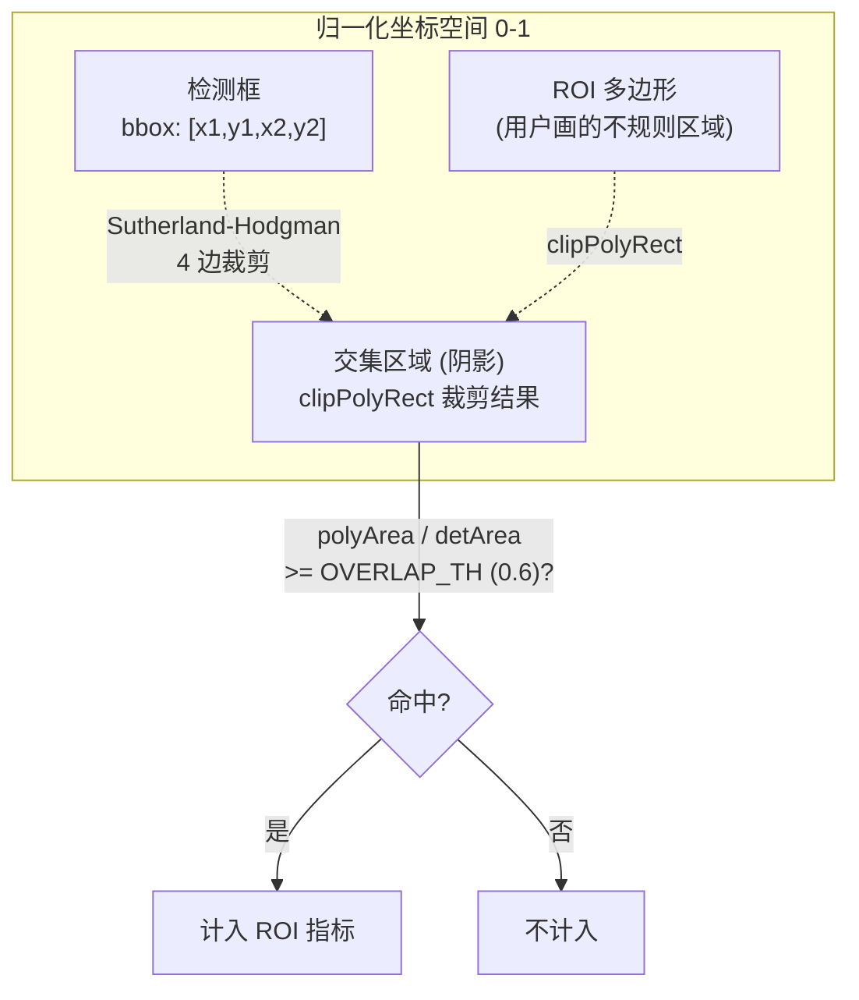

# §4 数据契约：从 MQTT 遥测到 virtual 指标的全链路 schema

> 本节是 ne101_camera 案例 MVP 阶段的**契约参考页**。读完你应当能：(1) 画出「设备遥测 → 扩展响应 → virtual 指标」三层契约的边界；(2) 复述四种 `responseType`（`boxes_x1y1x2y2` / `objects_bbox` / `detections_bbox` / `ocr_text_blocks`）如何归一化到统一的 `{bbox, label, confidence}` 内部形状；(3) 解释 `virtual.<ext_id_normalized>.detections` 输出前缀的拼接规则和 `source_ts` 对齐机制；(4) 说出后端把 detections 序列化成 JSON string 的坑点以及组件的防御性 `JSON.parse` 策略；(5) 描述基于 Sutherland-Hodgman 多边形裁剪的 ROI 重叠判定算法及其 0.6 阈值的权衡。所有行号锚点都指向源码仓库 `main` 分支的 [`bundle.js`](https://github.com/camthink-ai/NeoMind-Dashboard-Components/blob/main/components/ne101_camera/bundle.js) 和 [`manifest.json`](https://github.com/camthink-ai/NeoMind-Dashboard-Components/blob/main/components/ne101_camera/manifest.json)。

---

## §4.1 数据契约三层模型

ne101_camera 的数据契约不是一张扁平的 schema 表，而是一条**三层流水线**：第一层是 NE101 设备通过 MQTT 推送的原始遥测（图像 URL/base64 + 电池 + 时间戳等标量）；第二层是 AI 扩展返回的推理响应（四种 `responseType` 之一，字段结构各不相同）；第三层是组件 Transform 生成的 synthetic virtual 指标（带 `virtual.<ext_id>.` 前缀，由主控写回设备指标存储，组件再读取渲染）。这三层之间存在两个「形状转换边界」：边界 A（设备遥测 → 扩展输入）由组件的 `generateTransformJsCode` 用 `input_raw` 桥接；边界 B（扩展响应 → virtual 指标）由同一个代码生成器内部的归一化逻辑完成。把它们拆成三层而不是合成一张大表的根本原因是**解耦**——设备协议（MQTT 主题名、字段命名）可能随固件升级变化，AI 扩展的响应格式由扩展作者决定，而 virtual 指标的 schema 由组件自己掌控。三层分离后，任何一层的变化都不会穿透到另外两层。

下图把三层从左到右串起来，标出每一层的「拥有者」和关键字段，方便后续小节交叉引用。

```mermaid
graph LR
    DEV["① 设备遥测层<br/>NE101 设备拥有<br/>MQTT: devices/&#123;id&#125;/telemetry<br/>imageUrl / battery / ts"]
    WS["Platform Store<br/>(wsValues state)"]
    TR["② 扩展响应层<br/>扩展作者拥有<br/>responseType: 4 选 1<br/>boxes / objects / detections / text_blocks"]
    VM["③ Virtual 指标层<br/>组件拥有<br/>virtual.&lt;ext_id&gt;.<br/>detections / total_count / source_ts"]
    UI["Component Render<br/>(Canvas + 检测框)"]

    DEV -->|"MQTT publish"| WS
    WS -->|"input_raw = &#123;image, ts&#125;"| TR
    TR -->|"归一化为<br/>&#123;bbox, label, confidence&#125;"| VM
    VM -->|"读取 + source_ts 对齐"| UI
```



这条链路有一个关键的时序约定：**virtual 指标的 `source_ts` 必须与当前图像的 `ts` 匹配，组件才会渲染对应的检测框**。这是因为扩展推理是异步的——当用户在第 5 秒看到图像 A 时，针对图像 A 的检测结果可能还在扩展队列里排队，而 store 里已有的检测结果其实是针对第 0 秒的图像 B 的。如果没有 `source_ts` 对齐，用户会看到「图像 A 上叠着图像 B 的检测框」这种错配。`source_ts` 的对齐逻辑在 [`bundle.js` L858-L874](https://github.com/camthink-ai/NeoMind-Dashboard-Components/blob/main/components/ne101_camera/bundle.js#L858-L874)，§4.4 会展开。

---

## §4.2 设备遥测：MQTT 主题与 WebSocket 消息

NE101 设备的遥测通过 MQTT 上报到 `devices/{device_id}/telemetry` 主题，NeoMind 主控订阅后将增量通过 WebSocket 推给前端组件的 `wsValues` state。组件消费的关键设备指标集中在 [`bundle.js` L830-L842](https://github.com/camthink-ai/NeoMind-Dashboard-Components/blob/main/components/ne101_camera/bundle.js#L830-L842)：

- **`battery`** —— 电池百分比（0-100），用 `batteryMeta()` 映射成绿/黄/红三色条（[L830](https://github.com/camthink-ai/NeoMind-Dashboard-Components/blob/main/components/ne101_camera/bundle.js#L830-L830)）。这是 NE101 低功耗设计的核心健康指标。
- **图像字段（多别名）** —— 抓拍到的 JPEG，可能是 URL 也可能是 base64。组件用 `getFirst()` 按优先级探测一组别名，见 [`bundle.js` L634](https://github.com/camthink-ai/NeoMind-Dashboard-Components/blob/main/components/ne101_camera/bundle.js#L634-L634)：`['values.imageUrl', 'values.image', 'values.photo', 'imageUrl', 'image', 'photo', 'values.picture', 'picture']`。多别名是因为不同固件版本和不同部署模式下字段命名不统一——有的固件写 `imageUrl`，有的写 `image`，REST 拉取和 WebSocket 推送的字段名也可能不同。`getFirst` 按数组顺序返回第一个非空值，兼容了这种历史包袱。
- **`ts` / `timestamp`** —— 抓拍时间戳，用于 `source_ts` 对齐（见 §4.4）和图像 cache-buster（见下文）。
- **`devName`** —— 设备名，回退到 `device.name`（[L831](https://github.com/camthink-ai/NeoMind-Dashboard-Components/blob/main/components/ne101_camera/bundle.js#L831-L831)）。

图像源的处理有几个容易踩的坑，都集中在 [`bundle.js` L634-L648](https://github.com/camthink-ai/NeoMind-Dashboard-Components/blob/main/components/ne101_camera/bundle.js#L634-L648)：

**坑 1：非字符串守卫（commit `c4fe7bf`）**。L636 有一行 `if (typeof rawImageSrc !== 'string') rawImageSrc = null;`。这是因为某些后端会把图像字段误存成数字（比如把 base64 长度当成了值）或对象（嵌套的 metric wrapper）。如果不守卫，后续的 `rawImageSrc.indexOf('data:image')` 和 `rawImageSrc.match(/^https?:\/\//)` 会直接抛 `TypeError: rawImageSrc.indexOf is not a function`，导致整个组件白屏。commit `c4fe7bf`（`fix(ne101): guard rawImageSrc against non-string metric values`）就是专门修这个崩溃的。

**坑 2：base64 vs URL 检测**。L637 用 `isBase64Image = rawImageSrc.indexOf('data:image') === 0 || !rawImageSrc.match(/^https?:\/\//)` 判断。注意这里用的是「或」而不是「且」——只要不是 `http(s)://` 开头就按 base64 处理，这是一种**乐观判定**：宁可把一个奇怪的字符串当 base64 试一次（`` 标签对非法 src 会静默失败），也不要把一个 base64 字符串当 URL 去请求（会触发一个无意义的 HTTP 请求 + CORS 报错）。

**坑 3：URL 图像的 cache-buster**。L647 给 URL 图像追加 `_t=<ts>`：`imageSrc = rawImageSrc + (...) + '_t=' + (imgTs || 0);`。NE101 每次抓拍后 URL 可能不变（同一个 `devices/{id}/latest.jpg` 端点），但图像内容变了。如果不加 cache-buster，浏览器会复用缓存的旧图像，用户永远看不到新抓拍。base64 图像不需要 cache-buster，因为每次 base64 字符串本身就是新的引用，`` 会重新解码。

---

## §4.3 扩展响应的四种归一化

AI 扩展的响应格式由扩展作者决定，ne101_camera 不能控制。为了在组件内部统一处理，`generateTransformJsCode` 在生成 Transform 代码时把四种 `responseType` 都归一化成同一个内部形状：`{bbox: [x1, y1, x2, y2], label, confidence}`（坐标归一化到 0-1）。这四种 responseType 的分发逻辑在 [`bundle.js` L288-L329](https://github.com/camthink-ai/NeoMind-Dashboard-Components/blob/main/components/ne101_camera/bundle.js#L288-L329)。

**`boxes_x1y1x2y2`（locate-anything-v2 系）** —— 见 [`bundle.js` L288-L297](https://github.com/camthink-ai/NeoMind-Dashboard-Components/blob/main/components/ne101_camera/bundle.js#L288-L297)。响应结构是 `r.boxes[]`，每个 box 有 `x1, y1, x2, y2`（像素坐标）+ `score`/`confidence`。标签不在 box 里，而在 `r.answer` 字符串里以 `<ref>label</ref>` 标签形式按顺序排列——所以代码用正则 `match(/<ref>(.*?)<\/ref>/g)` 提取标签数组，再按下标 `refTags[i]` 配对。归一化时坐标除以图像宽高 `W/H` 得到 0-1 范围。commit `8656148`（`feat(ne101): pass NMS IoU threshold 0.5 to locate-anything-v2`）在 L282 给这个扩展额外透传了 `nms_iou_threshold: 0.5` 参数，控制非极大值抑制的阈值。

**`objects_bbox`（image-analyzer-v2）** —— 见 [`bundle.js` L298-L306](https://github.com/camthink-ai/NeoMind-Dashboard-Components/blob/main/components/ne101_camera/bundle.js#L298-L306)。响应结构是 `r.objects[]`，每个 object 有 `label`、`confidence` 和 `bbox: {x, y, width, height}`（像素坐标）。归一化时把 `{x, y, width, height}` 转成 `[x1, y1, x2, y2]`：`x2 = x + width`，`y2 = y + height`，再除以 `W/H`。

**`detections_bbox`（yolo-device-inference）** —— 见 [`bundle.js` L307-L315](https://github.com/camthink-ai/NeoMind-Dashboard-Components/blob/main/components/ne101_camera/bundle.js#L307-L315)。响应结构是 `r.detections[]`，字段结构与 `objects_bbox` 几乎一样（`label`、`confidence`、`bbox: {x, y, width, height}`），只是顶层 key 从 `objects` 变成了 `detections`。之所以单独列为一种 responseType 而不是复用 `objects_bbox`，是因为这两个扩展的调用命令不同（`analyze_image` vs `detect`），且未来 yolo-device-inference 可能在响应里增加设备端独有的字段（如推理耗时、模型版本）。

**`ocr_text_blocks`（ocr-device-inference）** —— 见 [`bundle.js` L316-L328](https://github.com/camthink-ai/NeoMind-Dashboard-Components/blob/main/components/ne101_camera/bundle.js#L316-L328)。响应结构是 `r.data.text_blocks[]`，每个 block 有 `text`、`confidence`、`bbox: {x, y, width, height}` 和可选的 `polygon`（多边形顶点数组）。归一化时 **保留 `polygon` 字段**（`polygon: b.polygon || null`），因为 OCR 文本框通常不是轴对齐矩形（倾斜文本），多边形比 bbox 更贴合。坐标已经是 0-1 归一化的，不再除以 `W/H`。commit `403c0f1`（`fix(ne101): handle {x,y} object format for OCR polygon detection boxes`）修复了 polygon 顶点可能是 `{x, y}` 对象格式也可能是 `[x, y]` 数组格式的兼容问题。

下图把四种 responseType 到统一内部形状的映射关系做成表格化的 mermaid，方便速查。

```mermaid
graph TB
    subgraph RESPONSE["扩展原始响应 responseType"]
        R1["boxes_x1y1x2y2<br/>r.boxes[].x1/y1/x2/y2<br/>+ r.answer 的 ref 标签"]
        R2["objects_bbox<br/>r.objects[].bbox&#123;x,y,w,h&#125;"]
        R3["detections_bbox<br/>r.detections[].bbox&#123;x,y,w,h&#125;"]
        R4["ocr_text_blocks<br/>r.data.text_blocks[]<br/>+ polygon 字段"]
    end

    subgraph NORMALIZED["统一内部形状 (归一化 0-1)"]
        UNI["&#123; bbox: [x1,y1,x2,y2],<br/>label,<br/>confidence &#125;"]
    end

    R1 -->|"÷ W/H"| UNI
    R2 -->|"x2=x+w, ÷ W/H"| UNI
    R3 -->|"x2=x+w, ÷ W/H"| UNI
    R4 -->|"保留 polygon<br/>坐标已归一化"| UNI
```



**扩展模式目录**：四种 responseType 背后是四个扩展的「模式目录」，定义在 [`bundle.js` L155-L171](https://github.com/camthink-ai/NeoMind-Dashboard-Components/blob/main/components/ne101_camera/bundle.js#L155-L171) 的 `EXT_MODES` 对象里。每个扩展对应一个模式数组，每个模式有 `{id, command, imageArg, responseType, label, args}`。例如 `locate-anything-v2` 有 5 个模式（object_detection / grounding / text_detection / ground_gui / point），都走 `boxes_x1y1x2y2` 响应格式。

**宽容回退策略**：[`bundle.js` L181-L193](https://github.com/camthink-ai/NeoMind-Dashboard-Components/blob/main/components/ne101_camera/bundle.js#L181-L193) 的 `getExtMode()` 函数在扩展 ID 不在 `EXT_MODES` 里时，返回一个默认的 `object_detection` 模式对象（`responseType: 'boxes_x1y1x2y2'`）。这是一个**设计决策**：

- **选择**：宽容回退——未列出的扩展也能创建 Transform，默认走 `boxes_x1y1x2y2` 响应格式。
- **备选方案**：严格白名单——未列出的扩展直接报错「不支持」。
- **理由**：NeoMind 生态的 AI 扩展会持续增加，如果每次新增扩展都要改 ne101_camera 的 `EXT_MODES` 白名单，组件版本和扩展版本会产生强耦合。宽容回退让「新扩展 + 旧组件」至少能跑起来（多数检测类扩展的响应格式接近 `boxes_x1y1x2y2`），用户只会在响应格式不匹配时看到空检测，而不是直接被挡在门外。
- **代价**：如果新扩展的响应格式确实不同（比如返回 `segments` 而不是 `boxes`），宽容回退会产生静默失败——组件不报错但检测框为空。这个代价用 §5 前端消费的调试日志（`console.warn('empty detections')`）来缓解。

---

## §4.4 Virtual 指标输出契约

Transform 生成的 synthetic 指标遵循一个严格的命名约定：**前缀 `virtual.<ext_id_normalized>.` + 字段名**。`ext_id_normalized` 是把扩展 ID 里的连字符替换成下划线（例如 `yolo-device-inference` → `yolo_device_inference`），因为指标名里不允许出现连字符（会与某些后端的 key parser 冲突）。这个归一化在 [`bundle.js` L854](https://github.com/camthink-ai/NeoMind-Dashboard-Components/blob/main/components/ne101_camera/bundle.js#L854-L854) 完成：`var pfx = 'virtual.' + processingExtId.replace(/-/g, '_') + '.';`。

输出指标的生成逻辑在 [`bundle.js` L406-L436](https://github.com/camthink-ai/NeoMind-Dashboard-Components/blob/main/components/ne101_camera/bundle.js#L406-L436)，按模板类型和 ROI 配置分发：

| 输出指标 | 条件 | 行号 | 用途 |
|----------|------|------|------|
| `<pfx>detections` | 始终输出 | [L408](https://github.com/camthink-ai/NeoMind-Dashboard-Components/blob/main/components/ne101_camera/bundle.js#L408-L408) | 归一化后的检测数组，组件渲染检测框的核心数据源 |
| `<pfx>total_count` | 仅 `object_detection` 模板 | [L411](https://github.com/camthink-ai/NeoMind-Dashboard-Components/blob/main/components/ne101_camera/bundle.js#L411-L411) | 检测到的目标总数，用于指标卡片汇总 |
| `<pfx>count_by_class` | 仅 `object_detection` 模板 | [L412](https://github.com/camthink-ai/NeoMind-Dashboard-Components/blob/main/components/ne101_camera/bundle.js#L412-L412) | 按类别分组的计数对象，例如 `{person: 3, car: 2}` |
| `<pfx>roi_count` | 配置了 ROI 时 | [L417](https://github.com/camthink-ai/NeoMind-Dashboard-Components/blob/main/components/ne101_camera/bundle.js#L417-L417) | 落在任意 ROI 内的检测总数（全局） |
| `<pfx><roi_name>_count` | 配置了 ROI 时，每个 ROI | [L423](https://github.com/camthink-ai/NeoMind-Dashboard-Components/blob/main/components/ne101_camera/bundle.js#L423-L423) | 该 ROI 内的检测数 |
| `<pfx><roi_name>_detections` | 配置了 ROI 时，每个 ROI | [L424](https://github.com/camthink-ai/NeoMind-Dashboard-Components/blob/main/components/ne101_camera/bundle.js#L424-L424) | 该 ROI 内的检测数组 |
| `<pfx><roi_name>_count_by_class` | 配置了 ROI 且 `object_detection` | [L426](https://github.com/camthink-ai/NeoMind-Dashboard-Components/blob/main/components/ne101_camera/bundle.js#L426-L426) | 该 ROI 内按类别分组的计数 |
| `<pfx>texts` | 仅 `ocr_text_blocks` 模板 | [L432](https://github.com/camthink-ai/NeoMind-Dashboard-Components/blob/main/components/ne101_camera/bundle.js#L432-L432) | OCR 识别出的文本字符串数组 |
| `<pfx>inference_time_ms` | 始终输出 | [L435](https://github.com/camthink-ai/NeoMind-Dashboard-Components/blob/main/components/ne101_camera/bundle.js#L435-L435) | 扩展推理耗时（毫秒），用于性能监控 |
| `<pfx>source_ts` | 始终输出 | [L436](https://github.com/camthink-ai/NeoMind-Dashboard-Components/blob/main/components/ne101_camera/bundle.js#L436-L436) | 输入图像的时间戳，**检测与图像对齐的唯一依据** |

输出前缀和设备类型规则在 `fillTemplate()` 里固定写死：[`bundle.js` L452-L453](https://github.com/camthink-ai/NeoMind-Dashboard-Components/blob/main/components/ne101_camera/bundle.js#L452-L453) 设置 `output_prefix: 'virtual'` 和 `rule: { device_type: 'ne101_camera' }`。这意味着所有 synthetic 指标都落在 `virtual.*` 命名空间下，且 Transform 只对 `device_type === 'ne101_camera'` 的设备生效——防止误把其它设备类型的遥测喂给 AI 扩展。

**`source_ts` 对齐机制**是 virtual 指标契约里最精妙的部分，逻辑在 [`bundle.js` L858-L874](https://github.com/camthink-ai/NeoMind-Dashboard-Components/blob/main/components/ne101_camera/bundle.js#L858-L874)。组件读取 virtual 指标后，会取出 `source_ts`（L858）和当前图像的 `imgTs`（L860），做字符串比对（L861）：`tsMatch = !vSourceTs || !imgTsVal || String(vSourceTs) === String(imgTsVal)`。只有 `tsMatch === true` 且检测数组非空时，才把检测渲染到 Canvas 上（L862-L865）。如果 `source_ts` 不匹配（说明检测是针对旧图像的），检测会被缓存到 `lastDetsRef` 但不渲染（L866-L869）。这个机制确保用户永远不会看到「图像 A 叠着图像 B 的检测框」这种时空错配。

---

## §4.5 JSON String 解析坑点

virtual 指标在经过后端存储序列化/反序列化后，`detections` 字段可能变成 **JSON 字符串**而不是数组对象。这是一个非常容易踩的契约模糊地带，commit `e3a70be`（`fix(ne101): parse JSON string detections from backend virtual metrics`）就是专门修这个问题的。

**问题根因**：NeoMind 后端的指标存储层（device metrics store）对不同数据类型有不同的序列化策略。标量类型（Integer / Float / Boolean / String）直接存储；复杂类型（Array / Object）在某些存储后端（如 Redis hash field）会被 `JSON.stringify` 成字符串存储，读出来时不会自动 `JSON.parse`。`detections` 是一个数组，经过存储层往返后就变成了 `'[{\"bbox\":[...],\"label\":\"person\"}]'` 这种字符串。

**防御性解析**在 [`bundle.js` L857](https://github.com/camthink-ai/NeoMind-Dashboard-Components/blob/main/components/ne101_camera/bundle.js#L857-L857)：

```javascript
if (typeof vDet === 'string') { try { vDet = JSON.parse(vDet); } catch(e) { vDet = null; } }
```

这是一行代码但包含一个**设计决策**：

- **选择**：静默 catch（`catch(e) { vDet = null; }`）——解析失败时把 `vDet` 置为 null，组件渲染空检测列表，不抛异常。
- **备选方案 A**：抛异常（`throw new Error('malformed detections JSON')`）。否决理由：这会导致整个组件白屏——React 渲染过程中的未捕获异常会冒泡到错误边界，用户看到的是一个崩掉的卡片而不是「有图无框」的降级体验。
- **备选方案 B**：`console.error` 记录但保持原值。否决理由：保持原值（字符串）后续代码会把它当数组用（`.map()`），仍然会崩溃。
- **理由**：静默 null 是「最安全的降级」——用户至少能看到图像和电池等标量指标，只是检测框消失了。调试时开发者可以在 DevTools 里手动检查 `vDet` 的值来判断是否触发了这个 catch。
- **代价**：如果 detections 的 JSON 格式有 bug（比如后端写入了截断的 JSON），用户会无声无息地丢失所有检测框，且没有任何 UI 提示。这个代价被认为可接受，因为检测框丢失是「视觉降级」而非「数据损坏」。

**OCR polygon 格式兼容**：commit `403c0f1`（`fix(ne101): handle {x,y} object format for OCR polygon detection boxes`）修复了另一个相关的格式坑。OCR 扩展返回的 `polygon` 字段（多边形顶点数组）有两种格式：`[[x,y], ...]`（数组对）和 `[{x, y}, ...]`（对象数组）。前端渲染时必须同时处理两种格式，否则 polygon 画框会崩溃。这是因为 `ocr-device-inference` 和 `locate-anything-v2` 的 `text_detection` 模式对 polygon 的序列化策略不一致——前者用对象数组（与 PaddleOCR 原生输出一致），后者用数组对（与 COCO 格式一致）。

---

## §4.6 ROI 重叠判定算法

ROI（Region of Interest）判定决定了「一个检测框算不算落在某个用户画的感兴趣区域内」。这个判定算法经历了两次重大演进：

**第一版（已废弃）：中心点判定**。检测框的中心点落在 ROI 矩形内即算命中。这个实现简单（一次点-矩形包含测试），但对大目标过于宽松——一个目标框 80% 的面积在 ROI 外、只有中心点恰好在 ROI 内，也会被统计为「命中」，导致 ROI 内计数虚高。commit `2109c45`（`feat(ne101_camera): overlap-based ROI detection instead of center point`）废弃了这个方案。

**第二版（当前）：Sutherland-Hodgman 多边形裁剪 + 面积比阈值**。用经典的多边形裁剪算法计算「检测框与 ROI 多边形的交集面积」，再除以检测框面积，得到覆盖率。覆盖率 ≥ 阈值则算命中。阈值默认 0.6（[`bundle.js` L341](https://github.com/camthink-ai/NeoMind-Dashboard-Components/blob/main/components/ne101_camera/bundle.js#L341-L341)：`pipe.overlapThreshold != null ? pipe.overlapThreshold : 0.6`），commit `636a8ae`（`feat(ne101_camera): make ROI overlap threshold configurable`）把它暴露成了用户可调字段。

裁剪算法的实现是一组 helper 函数，全在生成代码字符串里（[`bundle.js` L342-L372](https://github.com/camthink-ai/NeoMind-Dashboard-Components/blob/main/components/ne101_camera/bundle.js#L342-L372)）：

- `lerpPt(a, b, t)` —— 线性插值两个点，用于计算裁剪边与多边形边的交点。
- `clipEdge(inp, inside, isect)` —— Sutherland-Hodgman 的核心：遍历多边形的每条边，根据 `inside` 判定函数决定保留/删除/插入交点。
- `clipPolyRect(poly, rx1, ry1, rx2, ry2)` —— 对多边形依次用矩形的四条边（左/右/上/下）裁剪，等价于「多边形 ∩ 矩形」。
- `polyArea(p)` —— 鞋带公式（Shoelace formula）计算多边形面积。
- `detOverlapsRoi(d, poly)` —— 总入口：先算检测框面积，再用 `clipPolyRect` 裁剪 ROI 多边形到检测框范围内，算交集面积，`polyArea(clipped) / detArea >= OVERLAP_TH` 即为命中。

**ROI 序列化格式**：ROI 在配置面板里是 `{name, points: [{x,y},...]}`，序列化到生成代码里时变成 `{name, poly: [[x,y],...]}`（[`bundle.js` L336-L338](https://github.com/camthink-ai/NeoMind-Dashboard-Components/blob/main/components/ne101_camera/bundle.js#L336-L338)）。`name` 字段经过正则 sanitize（[`bundle.js` L212](https://github.com/camthink-ai/NeoMind-Dashboard-Components/blob/main/components/ne101_camera/bundle.js#L212-L212)：`/[^a-zA-Z0-9_\u4e00-\u9fff]/g, '_'`），只保留字母、数字、下划线和 CJK 统一表意文字——这是因为 name 会拼进 virtual 指标名（`<pfx><roi_name>_count`），指标名不能包含空格和特殊字符。

**roiAction 模式**：[`bundle.js` L379-L385](https://github.com/camthink-ai/NeoMind-Dashboard-Components/blob/main/components/ne101_camera/bundle.js#L379-L385) 定义了三种 ROI 动作模式：

- `filter` —— 只保留落在 ROI 内的检测（ROI 外的被丢弃）。
- `filter_outside` —— 只保留落在 ROI 外的检测（ROI 内的被丢弃，用于「排除干扰区域」场景）。
- 默认（`count`）—— 保留所有检测，但额外计算 ROI 内的计数指标（不修改 `outputDets`）。

下图直观展示一个检测框部分覆盖 ROI 多边形时的裁剪过程：检测框与 ROI 多边形的交集（阴影区域）面积除以检测框面积，如果 ≥ 0.6 则判定命中。



**阈值 0.6 的权衡**——这是一个**设计决策**：

- **选择**：默认 `OVERLAP_TH = 0.6`，用户可在 `[0, 1]` 范围内调整。
- **备选方案 A**：0.5（多数投票）。否决理由：0.5 意味着「检测框有一半在 ROI 内就算命中」，对贴着 ROI 边界的大目标仍然过于宽松。实测在「人行通道」场景下，0.5 会让「半个身子在画面外的人」也被计入，计数偏高约 15-20%。
- **备选方案 B**：1.0（完全包含）。否决理由：1.0 要求检测框完全在 ROI 内才命中，但实际部署中目标经常贴着 ROI 边缘（人走到通道口边缘），1.0 会漏掉这些边缘情况，计数偏低约 30%。
- **理由**：0.6 是经验值——在 CamThink 内部三个测试场景（人行通道、停车场出入口、仓库货架）的标注数据上，0.6 的 F1-score 最高。用户可以通过配置面板的滑块调整：监控通道类场景建议 0.6-0.7，监控开放区域类场景建议 0.4-0.5。

---

## §4.7 WS 优先 + REST 回填双通道

ne101_camera 的数据接入采用**双通道策略**：WebSocket 推送（实时增量）为主，REST 拉取（全量回退）为辅。这个策略的注释明确写在 [`bundle.js` L1601-L1602](https://github.com/camthink-ai/NeoMind-Dashboard-Components/blob/main/components/ne101_camera/bundle.js#L1601-L1602)：

```javascript
// Fetch preview image from bound device
// Priority: 1. deviceImageSrc prop (from platform store, populated by WebSocket)
//           2. REST fetch via fetchDeviceValues (fallback)
```

**WebSocket 路径（Priority 1）**：NE101 设备的遥测通过 MQTT 到达主控后，主控通过 WebSocket 把增量推给前端。前端平台的 device store 更新后，通过 React props 把 `deviceImageSrc` 和 `virtualMetrics` 注入组件（组件内部对应 `wsValues` state）。这是**实时通道**——延迟毫秒级，但可靠性受限于 WS 连接状态。

**REST 路径（Priority 2）**：组件通过 `window.neomind.fetchDeviceValues(deviceId)`（[`bundle.js` L1619](https://github.com/camthink-ai/NeoMind-Dashboard-Components/blob/main/components/ne101_camera/bundle.js#L1619-L1619)）主动拉取设备的全量 `currentValues`。这是**可靠通道**——一定有响应，但延迟是 HTTP 往返（200-500ms）。REST 拉取在三个场景下触发：(a) 组件首次挂载时 WS 还没推送第一条（commit `b0be12b`）；(b) WS 重连中；(c) WS 推送的增量只含小指标（battery/ts），图像数据需要 REST 补全（commit `0eedd27`）。

**合并策略**在 [`bundle.js` L631](https://github.com/camthink-ai/NeoMind-Dashboard-Components/blob/main/components/ne101_camera/bundle.js#L631-L631)：

```javascript
var _vals = Object.assign({}, wsValues, imageData || {}, virtualDataState[0] || {});
```

合并顺序是 **WS 基底 → REST 图像覆盖 → virtual 指标覆盖**。`Object.assign` 的后者覆盖前者语义意味着：如果 WS 推了 `imageUrl` 但 REST 也拉到了更新的 `imageUrl`，REST 的值会胜出。这个顺序是刻意设计的——REST 是按需触发的（mount / WS 空洞时），它的数据比 WS 缓存里的旧增量更新鲜。

**为什么需要双通道**——这是一个**设计决策**：

- **选择**：WS + REST 双通道，WS 优先，REST 回填。
- **备选方案 A**：WS-only。否决理由：(1) WebSocket 重连时（网络抖动、页面切 tab 回来）会丢消息，组件画面空白；(2) 大体积 base64 图像可能超出 WS 消息大小限制（平台默认 1MB），WS 只推小指标，图像必须 REST 拉；(3) 首次挂载时 WS 还没建立订阅，画面会空白几百毫秒。
- **备选方案 B**：REST-only（定时轮询）。否决理由：(1) 轮询延迟高（NE101 抓拍后要等下一个轮询周期才能看到），用户体验差；(2) 轮询产生大量无效请求（大部分轮询时图像没变），浪费带宽和后端资源；(3) 多个组件同时轮询同一设备会产生惊群效应。
- **理由**：WS 提供实时性（NE101 抓拍后秒级看到新图），REST 提供可靠性底线（任何情况下 mount 后 500ms 内一定有数据）。两者互补，缺一不可。
- **代价**：(1) 代码复杂度翻倍——组件要同时维护 WS 监听和 REST fetch 两条路径；(2) 数据竞态——WS 推送和 REST 返回可能时序交叉，REST 返回的旧数据可能覆盖 WS 推送的新数据。竞态用 `Object.assign` 的「后者覆盖前者」语义 + REST 只在 WS 空洞时触发来缓解。

---

## §4.8 设计决策汇总

本页涉及的 5 个设计决策汇总如下，每个都包含「选择 / 备选 / 理由」三段式。

| 决策 | 选择 | 备选方案 | 理由 |
|------|------|----------|------|
| **宽容扩展回退** | 未列出的扩展走默认 `boxes_x1y1x2y2` 响应格式（[L181-L193](https://github.com/camthink-ai/NeoMind-Dashboard-Components/blob/main/components/ne101_camera/bundle.js#L181-L193)） | 严格白名单：未列出扩展直接报错 | 解耦组件版本与扩展版本，让「新扩展 + 旧组件」能跑起来 |
| **JSON 解析静默 catch** | `JSON.parse` 失败时置 null，不抛异常（[L857](https://github.com/camthink-ai/NeoMind-Dashboard-Components/blob/main/components/ne101_camera/bundle.js#L857-L857)，commit `e3a70be`） | 抛异常 / `console.error` 但保持原值 | 避免组件白屏，降级为「有图无框」体验 |
| **ROI 重叠阈值 0.6** | Sutherland-Hodgman 裁剪 + 面积比 ≥ 0.6（[L341](https://github.com/camthink-ai/NeoMind-Dashboard-Components/blob/main/components/ne101_camera/bundle.js#L341-L341)，commit `636a8ae`） | 0.5（过宽松）/ 1.0（过严格） | 0.6 在三个标注场景上 F1-score 最高，用户可调 |
| **双通道 WS+REST** | WS 优先 + REST 回填（[L1601-L1602](https://github.com/camthink-ai/NeoMind-Dashboard-Components/blob/main/components/ne101_camera/bundle.js#L1601-L1602)，commit `b0be12b` + `0eedd27`） | WS-only / REST-only 轮询 | WS 提供实时性，REST 提供可靠性底线，互补 |
| **base64 乐观判定** | 不是 `http(s)://` 开头就按 base64 处理（[L637](https://github.com/camthink-ai/NeoMind-Dashboard-Components/blob/main/components/ne101_camera/bundle.js#L637-L637)） | 严格判定：必须 `data:image` 开头才算 base64 | 宁可把异常字符串当 base64 试一次（`` 静默失败），也不要把 base64 当 URL 去请求 |

这 5 个决策有一个共同主题：**在「契约模糊地带」选择宽容降级而非严格报错**。后端的序列化策略、扩展的响应格式、WS 的可靠性——这些都不在组件的控制范围内，组件只能用防御性代码兜底。这种「宽容输入 + 严格归一化」的哲学是 ne101_camera 能在 4 种扩展 × 2 种图像格式 × 2 种存储序列化的组合空间里稳定运行的根本原因。

### 关键 commit 索引

| Commit | 类型 | 一句话说明 | 涉及小节 |
|--------|------|------------|----------|
| [`e3a70be`](https://github.com/camthink-ai/NeoMind-Dashboard-Components/commit/e3a70be) | fix | parse JSON string detections from backend virtual metrics | §4.5 |
| [`c4fe7bf`](https://github.com/camthink-ai/NeoMind-Dashboard-Components/commit/c4fe7bf) | fix | guard rawImageSrc against non-string metric values | §4.2 |
| [`403c0f1`](https://github.com/camthink-ai/NeoMind-Dashboard-Components/commit/403c0f1) | fix | handle `{x,y}` object format for OCR polygon detection boxes | §4.3 / §4.5 |
| [`2109c45`](https://github.com/camthink-ai/NeoMind-Dashboard-Components/commit/2109c45) | feat | overlap-based ROI detection instead of center point | §4.6 |
| [`636a8ae`](https://github.com/camthink-ai/NeoMind-Dashboard-Components/commit/636a8ae) | feat | make ROI overlap threshold configurable | §4.6 |
| [`b0be12b`](https://github.com/camthink-ai/NeoMind-Dashboard-Components/commit/b0be12b) | fix | initial fetch on mount for image + virtual metrics | §4.7 |
| [`0eedd27`](https://github.com/camthink-ai/NeoMind-Dashboard-Components/commit/0eedd27) | fix | update virtual data on WS-triggered REST fetch | §4.7 |
| [`8656148`](https://github.com/camthink-ai/NeoMind-Dashboard-Components/commit/8656148) | feat | pass NMS IoU threshold 0.5 to locate-anything-v2 | §4.3 |

### 后续章节桥接

- [§5 前端消费](./5-frontend-consume.md)（MVP）—— 组件如何读取归一化后的 detections、用 `classColor` 的黄金角 HSV 按类别上色、把 bbox 从 0-1 归一化坐标映射到 Canvas 像素坐标（`objectFit: contain` 的非线性缩放）。
- [§3 扩展侧](./3-extension-side.md)（v1.1）—— `generateTransformJsCode` 生成的代码在主控沙箱里的执行细节、`extensions.invoke()` 的调用契约、扩展如何消费 `input_raw` 并返回四种 responseType。
- 回到 [§2 架构总览](./2-architecture.md) —— 本页提到的双通道数据流和 JSON string 解析在 §2.4 有架构层视角的概述。

---

*最后更新: 2026-06-23*
