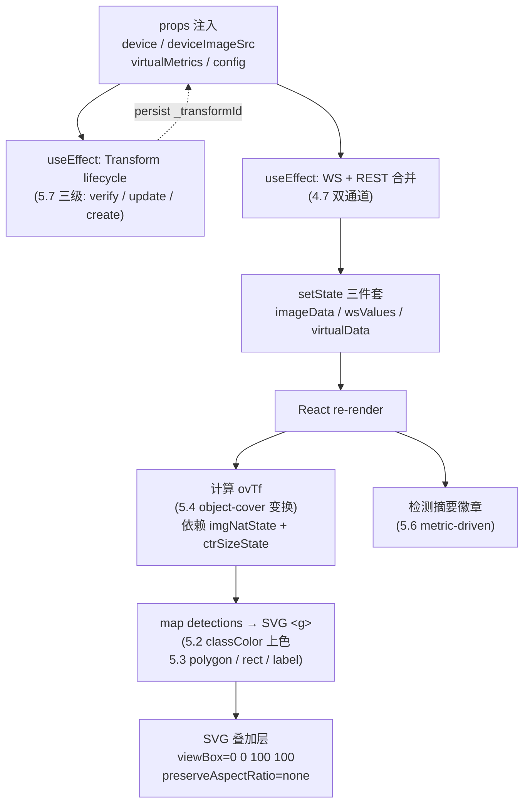
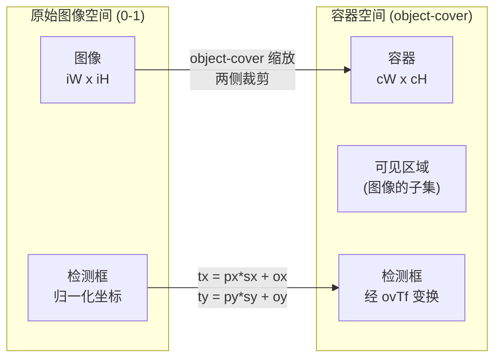
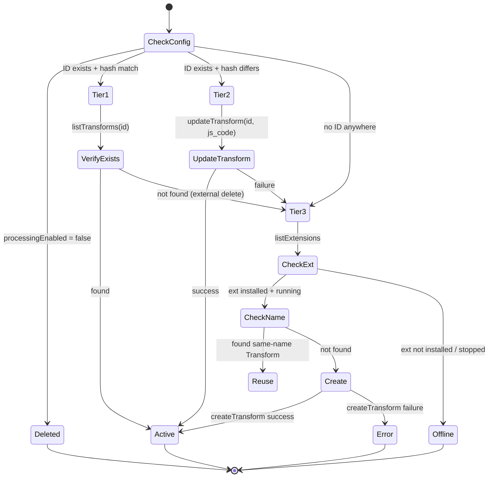

# 5 前端消费：从 detections 到 SVG 叠加的渲染全链路

> 本节是 ne101_camera MVP 阶段的**前端渲染参考页**，覆盖 effect-driven 渲染管线、按类别上色（golden-angle HSV）、SVG 叠加渲染、object-cover 坐标变换以及 ResizeObserver callback ref 模式。

---

## 5.1 渲染管线总览

ne101_camera 的渲染不是一次性的 JSX 模板，而是一条由多个 effect 驱动的**状态管线**。这条管线的起点是平台注入的 props（`device` / `deviceImageSrc` / `virtualMetrics` / `config` / `onConfigChange`），终点是挂载在媒体 `<div>` 上的 SVG 叠加层。中间穿过五个状态节点：

1. Transform lifecycle effect（创建/更新/删除后端 Transform，见 5.7）
2. WS + REST 合并 effect（拉取图像和 virtual 指标，见 [4.7](./4-data-contract.md)）
3. `imageData` / `wsValues` / `virtualData` 三个 state 的 `setState`
4. `imgNatState`（图像原始宽高）+ `ctrSizeState`（容器宽高）驱动的 `ovTf` 坐标变换计算（见 5.4）
5. detections 数组按类别上色后映射成 SVG `<g>` 元素（见 5.2 / 5.3）。

任何一个节点的状态变化都会触发 React 重渲染，重新走一遍从 `ovTf` 计算到 SVG 映射的路径。

下图把这条 effect-driven 管线画成流程图，标出每一步的输入/输出和触发条件。



**为什么这条管线是 effect-driven 的**：ne101_camera 是 NeoMind 平台的「React-in-IIFE」组件（见 [2.1](./2-architecture.md)），它没有 Redux / Zustand 这类外部状态管理，所有跨帧状态都用 `React.useState` + `React.useRef` 管理。React 的核心心智模型就是「UI = f(state)」——只要 state 变了，渲染函数就会重跑。组件把 WS 推送、REST 回填、图像 `onLoad`、ResizeObserver 回调都接到了 `setState` 上，每一次外部事件都通过 state 变更驱动一次完整的重渲染。这种模式的代价是：没有虚拟 DOM diffing 的优化空间（每次都全量重算 `ovTf` 和 detections 映射），但因为单组件的 DOM 节点数在 50 以内（一个 `<svg>` + N 个 `<g>`），全量重渲染的开销可以忽略。真正昂贵的是 `neomind.createTransform` 这类异步 API 调用，它们被严格限制在 effect 里、用 `cancelled` 标志位做取消保护（见 [`bundle.js` L709](https://github.com/camthink-ai/NeoMind-Dashboard-Components/blob/main/components/ne101_camera/bundle.js#L709-L709)）。

```js
      var payload = Object.assign({}, tplCfg, {
        name: transformName,
        scope: device.id,
        description: 'ne101:' + device.id + ':' + processingExtId + ':' + processingTemplate
      });
      var cancelled = false;

      var persist = function (id) {
        transformIdRef.current = id;
        if (onCfgChange) onCfgChange(Object.assign({}, config, { _transformId: id, _transformHash: _configHash }));
      };
```

Source: [`bundle.js` L704-L714](https://github.com/camthink-ai/NeoMind-Dashboard-Components/blob/main/components/ne101_camera/bundle.js#L704-L714)

---

## 5.2 按类别上色：Golden-Angle HSV

检测框的颜色不是固定的，而是由类别标签（`det.label`）决定的。commit [`c276c23`](https://github.com/camthink-ai/NeoMind-Dashboard-Components/commit/c276c23)（`feat(ne101): per-class detection colors via golden-angle HSV rotation`）引入了 `classColor(label)` 函数，位于 [`bundle.js` L55-L72](https://github.com/camthink-ai/NeoMind-Dashboard-Components/blob/main/components/ne101_camera/bundle.js#L55-L72)。这个函数做了三件事：

```js
  // Per-class color via golden-angle HSV rotation — maximally distinct hues for any class count.
  // Same label always yields the same color; 100+ classes still get good separation.
  function classColor(label) {
    var h = 0;
    for (var i = 0; i < label.length; i++) { h = ((h << 5) - h + label.charCodeAt(i)) | 0; }
    var hue = (Math.abs(h) * 137.508) % 360;  // golden angle
    var s = 0.78, v = 0.95;
    var c = v * s, hp = hue / 60, x = c * (1 - Math.abs(hp % 2 - 1)), r = 0, g = 0, b = 0;
    if (hp < 1) { r = c; g = x; }
    else if (hp < 2) { r = x; g = c; }
    else if (hp < 3) { g = c; b = x; }
    else if (hp < 4) { g = x; b = c; }
    else if (hp < 5) { r = x; b = c; }
    else { r = c; b = x; }
    var m = v - c, R = Math.round((r + m) * 255), G = Math.round((g + m) * 255), B = Math.round((b + m) * 255);
    var rgb = R + ',' + G + ',' + B;
    return { stroke: 'rgba(' + rgb + ',0.85)', fill: 'rgba(' + rgb + ',0.08)', text: 'rgba(' + rgb + ',0.95)' };
  }
```

Source: [`bundle.js` L55-L72](https://github.com/camthink-ai/NeoMind-Dashboard-Components/blob/main/components/ne101_camera/bundle.js#L55-L72)

1. **字符串哈希（L58-L59）**：用经典的 `h = ((h << 5) - h + charCodeAt(i)) | 0` 累加器对 label 字符串做哈希。这是一个 32 位整数哈希，位移 5 + 减自身等价于乘以 31（`((h << 5) - h) = h * 31`），是 Java `String.hashCode()` 的同款算法。`| 0` 把结果截断成 32 位有符号整数。
2. **黄金角旋转（L60）**：`hue = (Math.abs(h) * 137.508) % 360`。137.508° 是黄金角（golden angle），即圆周角按黄金比例分割后的较短弧。把哈希值乘以黄金角再 mod 360，等价于在色相环上按黄金比例步进取色——这是数学上让任意数量点在圆周上「最大化最小间距」的最优策略。同一个 label 永远哈希到同一个色相（纯函数，无副作用），而不同 label 即使哈希值只差 1，色相也会差 137.508°，视觉上几乎不可能撞色。
3. **HSV → RGB（L61-L71）**：固定 `s = 0.78, v = 0.95`（饱和度和明度），用六段分段函数把 HSV 转成 RGB，最后返回 `rgba(r,g,b,α)` 三件套：`stroke`（描边，α=0.85）、`fill`（填充，α=0.08）、`text`（标签文字，α=0.95）。透明度的梯度让检测框在图像上既有可辨识的轮廓（描边深），又不会大面积遮挡图像内容（填充浅）。

在 `c276c23` 之前，检测框的颜色经历了两次迭代。最早是固定蓝色（`#3b82f6` 系），后来 commit [`3cf1b27`](https://github.com/camthink-ai/NeoMind-Dashboard-Components/commit/3cf1b27)（`style(ne101): change detection box and label color from blue to red`）改成固定红色——但固定色在多类别场景下完全无法区分目标。黄金角 HSV 的引入彻底解决了这个问题：COCO 80 类、甚至 OpenImages 级别的 500+ 类都能得到视觉可分的色相。

**设计决策：黄金角哈希 vs 固定调色板 vs 随机色**

- **选择**：字符串哈希 + 黄金角旋转。
- **备选方案 A**：固定调色板（如 `['#ef4444', '#3b82f6', '#10b981', ...]`，按类别 index 取色）。否决理由：调色板长度固定（通常 10-20 色），第 N 个类别（N > 调色板长度）会回绕到第一个颜色，多类别场景下颜色重复；且需要维护「类别 → index」的映射表，跨帧跨设备无法保证一致性。
- **备选方案 B**：随机色（`Math.random()`）。否决理由：同一类别每次渲染都换颜色，视觉闪烁严重，用户无法建立「这个颜色 = 这个类别」的肌肉记忆。
- **理由**：黄金角旋转在数学上保证了任意类别数的色相最大化分散；纯函数哈希保证了跨帧一致性；零配置（不需要预设调色板）。代价是 HSV 空间不是感知均匀的（蓝色区域人眼区分度低），但实测在 ≤ 50 类的场景下效果可接受。

---

## 5.3 SVG 叠加渲染：Polygon + Rect Fallback

检测框的渲染不是画在 Canvas 上，而是用一层 SVG 叠加在 `` 之上。这层 SVG 的渲染逻辑在 [`bundle.js` L1210-L1272](https://github.com/camthink-ai/NeoMind-Dashboard-Components/blob/main/components/ne101_camera/bundle.js#L1210-L1272)，核心是一个 `detections.map(...)` 调用，每个 detection 生成一个 `<g>` 元素，内含形状（polygon 或 rect）+ 标签文字。

```js
                // Detection boxes overlay — SVG (polygon when available, rect fallback) adjusted for object-cover image scaling
                (processingEnabled && detections.length > 0 && ovTf)
                  ? jsx('svg', {
                      key: 'det-svg',
                      className: 'absolute inset-0 w-full h-full',
                      style: { pointerEvents: 'none' },
                      viewBox: '0 0 100 100',
                      preserveAspectRatio: 'none',
                      children: detections.map(function (det, i) {
                        var detLabel = det.label || '';
                        var detConf = typeof det.confidence === 'number' ? Math.round(det.confidence * 100) : '';
                        var clr = classColor(detLabel || ('det' + i));
                        var children = [];

                        if (det.polygon && det.polygon.length >= 3) {
                          // Polygon mode (OCR scenarios): precise contour
                          var pts = det.polygon.map(function(p) {
                            var px = Array.isArray(p) ? p[0] : p.x;
                            var py = Array.isArray(p) ? p[1] : p.y;
                            var tx = ovTf ? ((px * ovTf.sx + ovTf.ox) * 100) : (px * 100);
                            var ty = ovTf ? ((py * ovTf.sy + ovTf.oy) * 100) : (py * 100);
                            return tx.toFixed(2) + ',' + ty.toFixed(2);
                          }).join(' ');
                          children.push(jsx('polygon', {
                            key: 'poly', points: pts,
                            fill: clr.fill, stroke: clr.stroke,
                            strokeWidth: '0.4'
                          }));
                        } else if (det.bbox && det.bbox.length >= 4) {
                          // Rect fallback (object detection scenarios)
                          // ... (25 lines omitted: rect coords + label text node)
                        }

                        // ... (14 lines omitted: label text rendering)

                        return children.length > 0 ? jsxs('g', { key: 'dbox-' + i, children: children }) : null;
                      })
                    })
                  : null,
```

Source: [`bundle.js` L1210-L1272](https://github.com/camthink-ai/NeoMind-Dashboard-Components/blob/main/components/ne101_camera/bundle.js#L1210-L1272)

**Polygon 模式（L1224-L1237）**：当 `det.polygon` 存在且顶点数 ≥ 3 时，渲染 `<polygon>`。这是 OCR 场景（`ocr_text_blocks` responseType）的精确轮廓——OCR 文本框通常不是轴对齐矩形（倾斜文本、弯曲文本行），多边形比 bbox 更贴合。顶点坐标在 L1226-L1231 遍历，每个顶点先经过 `ovTf` 变换（见 5.4），再拼接成 SVG `points` 字符串。

**Rect fallback（L1238-L1252）**：当只有 `det.bbox`（4 元素数组 `[x1, y1, x2, y2]`）时，渲染 `<rect>`。这是 object detection 场景（`objects_bbox` / `detections_bbox` responseType）的标准矩形框。bbox 的四个坐标值分别经过 `ovTf` 变换后，拼成 `<rect>` 的 `x / y / width / height`。

**顶点格式兼容（L1227-L1228）**：commit [`403c0f1`](https://github.com/camthink-ai/NeoMind-Dashboard-Components/commit/403c0f1)（`fix(ne101): handle {x,y} object format for OCR polygon detection boxes`）修复了一个关键的格式兼容问题。OCR 扩展返回的 polygon 顶点有两种格式：`[x, y]` 数组对（COCO 格式）和 `{x, y}` 对象（PaddleOCR 原生格式）。L1227-L1228 用 `Array.isArray(p) ? p[0] : p.x` 做了双格式探测——如果顶点是数组就取下标 0/1，如果是对象就取 `.x / .y` 属性。这个兼容层在 polygon 模式（L1227-L1228）和标签定位（L1257-L1258）都出现了一次，确保两种格式的顶点都能正确映射到 SVG 坐标。

**标签渲染（L1254-L1267）**：标签文字（`detLabel + detConf`）定位在检测框的第一个顶点或 bbox 左上角，垂直方向上偏移 -1.5（SVG 单位，即 viewBox 100 中的 1.5%）。标签用 `classColor` 返回的 `text` 颜色（α=0.95），monospace 字体加粗，确保在复杂背景图像上仍然可读。标签内容是 `label + confidence%`，例如 `person 95%`。

commit [`b746c02`](https://github.com/camthink-ai/NeoMind-Dashboard-Components/commit/b746c02)（`feat(ne101): render OCR detection boxes as polygons with rect fallback`）是这个分支结构的引入点——在它之前，所有检测框都硬编码渲染成 `<rect>`，OCR 的倾斜文本框被强行套进轴对齐矩形，视觉上严重失真。

**设计决策：SVG over Canvas**

- **选择**：用 SVG `<svg viewBox="0 0 100 100" preserveAspectRatio="none">` 叠加层渲染检测框。
- **备选方案**：用 `<canvas>` 2D context 手动绘制。
- **理由**：

    1. SVG 是声明式的，可以直接写成 JSX，与 React 的渲染模型天然契合——状态变了，React 重新调用 `detections.map` 生成新的 `<polygon>` / `<rect>`，无需手动 `clearRect` + 重绘
    2. SVG 原生支持 `<text>` 元素，文字渲染由浏览器引擎处理，无需 Canvas 的 `fillText` + 字体加载 + 像素测量
    3. SVG 的 `viewBox="0 0 100 100"` + `preserveAspectRatio="none"` 让检测框坐标可以直接用归一化值（0-100），与后端返回的 0-1 归一化坐标天然对齐（乘以 100 即可）
    4. Canvas 需要手动处理 DPI 缩放、重绘调度、事件命中检测，代码量会翻倍。
- **代价**：SVG 在检测框数量极大（>500）时性能不如 Canvas（每个 `<g>` 都是一个 DOM 节点）。但 ne101_camera 的典型场景（单帧摄像头画面）检测数通常 ≤ 30，SVG 的性能开销可以忽略。

---

## 5.4 object-cover 坐标变换

检测框的坐标是**归一化到图像空间的**（0-1 表示相对于原始图像宽高的比例），但图像在 DOM 里是用 `object-cover` 渲染的——图像会被缩放以完全覆盖容器，多余的部分被裁剪。这意味着图像的可见区域只是原始图像的一个子集，检测框坐标必须经过一个变换才能正确叠加在可见区域上。这个变换就是 `ovTf`，计算逻辑在 [`bundle.js` L879-L899](https://github.com/camthink-ai/NeoMind-Dashboard-Components/blob/main/components/ne101_camera/bundle.js#L879-L899)。

```js
    // Object-cover transform: map normalized image coords (0-1) to container coords (0-1)
    // object-cover scales image to cover container, cropping excess.
    // In image space, only a portion is visible. We map image coords → container coords.
    var imgNat = imgNatState[0];
    var ctrSize = ctrSizeState[0];
    var ovTf = null;
    if (imgNat.w > 0 && imgNat.h > 0 && ctrSize.w > 0 && ctrSize.h > 0) {
      var imgAsp = imgNat.w / imgNat.h;
      var cAsp = ctrSize.w / ctrSize.h;
      if (imgAsp > cAsp) {
        // Image wider than container → sides cropped, image fills container height
        var scX = (ctrSize.h / imgNat.h * imgNat.w) / ctrSize.w;
        ovTf = { sx: scX, sy: 1, ox: (1 - scX) / 2, oy: 0 };
      } else {
        // Image taller than container → top/bottom cropped, image fills container width
        var scY = (ctrSize.w / imgNat.w * imgNat.h) / ctrSize.h;
        ovTf = { sx: 1, sy: scY, ox: 0, oy: (1 - scY) / 2 };
      }
```

Source: [`bundle.js` L879-L899](https://github.com/camthink-ai/NeoMind-Dashboard-Components/blob/main/components/ne101_camera/bundle.js#L879-L899)

`ovTf` 是一个 `{sx, sy, ox, oy}` 四元组，含义是：把归一化图像坐标 `(px, py)` 映射到归一化容器坐标 `(tx, ty)` 的仿射变换——`tx = px * sx + ox`，`ty = py * sy + oy`。两个分支：

- **图像宽高比 > 容器宽高比（L888-L894）**：图像比容器「更宽」，缩放后图像的两侧被裁剪，容器只显示图像中间的一段宽度。此时 `sy = 1`（纵向不缩放），`sx = (cH / iH * iW) / cW`（横向缩放，因为图像被压缩到了更窄的容器宽度上），`ox = (1 - sx) / 2`（横向偏移，让裁剪居中），`oy = 0`。
- **图像宽高比 ≤ 容器宽高比（L895-L898）**：图像比容器「更高」，缩放后图像的上下被裁剪。此时 `sx = 1`（横向不缩放），`sy = (cW / iW * iH) / cH`（纵向缩放），`oy = (1 - sy) / 2`（纵向偏移），`ox = 0`。

这个变换在渲染时被应用到每一个检测框的每一个坐标上：polygon 顶点在 [L1185-L1187](https://github.com/camthink-ai/NeoMind-Dashboard-Components/blob/main/components/ne101_camera/bundle.js#L1185-L1187)（ROI 多边形）和 [L1229-L1230](https://github.com/camthink-ai/NeoMind-Dashboard-Components/blob/main/components/ne101_camera/bundle.js#L1229-L1230)（检测框 polygon），bbox 四角在 [L1241-L1244](https://github.com/camthink-ai/NeoMind-Dashboard-Components/blob/main/components/ne101_camera/bundle.js#L1241-L1244)，标签位置在 [L1259-L1260](https://github.com/camthink-ai/NeoMind-Dashboard-Components/blob/main/components/ne101_camera/bundle.js#L1259-L1260)。变换公式统一是 `tx = (px * ovTf.sx + ovTf.ox) * 100`（乘以 100 是因为 SVG viewBox 是 100x100）。

以检测框 polygon 顶点为例：

```js
// detection polygon 顶点 (L1229-L1230):
var dtx = ovTf ? ((px * ovTf.sx + ovTf.ox) * 100) : (px * 100);
var dty = ovTf ? ((py * ovTf.sy + ovTf.oy) * 100) : (py * 100);
```

同一变换也应用于 ROI polygon 顶点（L1185-L1187）、bbox 四角（L1241-L1244）和标签位置（L1259-L1260），公式完全一致。

Source: [`bundle.js` L1185-L1260](https://github.com/camthink-ai/NeoMind-Dashboard-Components/blob/main/components/ne101_camera/bundle.js#L1185-L1260)

图像本身的 `object-cover` 是在 [`bundle.js` L1162](https://github.com/camthink-ai/NeoMind-Dashboard-Components/blob/main/components/ne101_camera/bundle.js#L1162-L1162) 设置的：`className: 'w-full h-full object-cover'`。

```js
                jsx('img', {
                  src: imageSrc,
                  alt: 'Latest capture',
                  className: 'w-full h-full object-cover',
                  loading: 'lazy',
                  style: { imageRendering: 'auto' },
```

Source: [`bundle.js` L1159-L1164](https://github.com/camthink-ai/NeoMind-Dashboard-Components/blob/main/components/ne101_camera/bundle.js#L1159-L1164)



**设计决策：手动复现 object-cover 数学 vs 用浏览器原生变换**

- **选择**：手动计算 `sx / sy / ox / oy`，在 JS 里做仿射变换。
- **备选方案**：依赖浏览器的 `object-cover` 原生渲染，不手动变换坐标。
- **理由**：浏览器**不暴露** `object-cover` 的内部 scale/offset 参数。CSS `object-fit: cover` 是一个黑盒——浏览器在内部计算了缩放和裁剪，但没有 API 让 JS 读取「图像被缩放了多少、裁掉了多少」。如果不手动复现这个数学，检测框坐标就无法与可见图像对齐。唯一的替代方案是用 `getBoundingClientRect` + `naturalWidth/Height` 反推，但这本质上就是手动计算，只是把计算从渲染时挪到了测量时。ne101_camera 选择在渲染时直接算（依赖 `imgNatState` + `ctrSizeState`），逻辑集中、可推理。
- **代价**：如果浏览器未来改变了 `object-cover` 的实现细节（理论上不会，因为这是 CSS 规范），手动计算的参数可能与实际渲染不一致。但 CSS 规范明确了 `object-fit: cover` 的语义（缩放到完全覆盖、居中裁剪），这个语义是稳定的。

---

## 5.5 ResizeObserver 回调 Ref 模式

`ovTf` 的计算依赖两个状态：图像原始尺寸（`imgNatState`）和容器尺寸（`ctrSizeState`）。图像尺寸通过 `` 回调写入（[L1165-L1168](https://github.com/camthink-ai/NeoMind-Dashboard-Components/blob/main/components/ne101_camera/bundle.js#L1165-L1168)）：

```js
// bundle.js L1153-L1168
hasImage
  ? jsxs('div', {
      key: 'media',
      ref: cbRef.current,
      className: 'relative w-full h-full',
      children: [
        jsx('img', {
          src: imageSrc,
          alt: 'Latest capture',
          className: 'w-full h-full object-cover',
          loading: 'lazy',
          style: { imageRendering: 'auto' },
          onLoad: function (e) {
            var img = e.target;
            if (img && img.naturalWidth) setImgNat({ w: img.naturalWidth, h: img.naturalHeight });
          }
        }),
```

Source: [`bundle.js` L1153-L1168](https://github.com/camthink-ai/NeoMind-Dashboard-Components/blob/main/components/ne101_camera/bundle.js#L1153-L1168)

容器尺寸通过 ResizeObserver 监听媒体 `<div>` 的尺寸变化写入。但这里有一个 React 的经典陷阱：**媒体 `<div>` 是条件渲染的**——只有当 `hasImage` 为 true 时才挂载（[L1153-L1156](https://github.com/camthink-ai/NeoMind-Dashboard-Components/blob/main/components/ne101_camera/bundle.js#L1153-L1156)），而图像是异步到达的（WS 推送或 REST 回填）。这意味着组件首次渲染时媒体 `<div>` 还不存在，一个普通的 `useEffect(() => { new ResizeObserver(mediaRef.current) }, [])` 会拿到 `mediaRef.current === null`，ResizeObserver 永远不会被挂载。

commit [`d7836b8`](https://github.com/camthink-ai/NeoMind-Dashboard-Components/commit/d7836b8)（`fix(ne101_camera): ResizeObserver never set up when image loads async`）就是修这个问题的。修复方案是 **callback ref 模式**，位于 [`bundle.js` L534-L548](https://github.com/camthink-ai/NeoMind-Dashboard-Components/blob/main/components/ne101_camera/bundle.js#L534-L548)：

```javascript
var cbRef = React.useRef(null);
if (!cbRef.current) {
  cbRef.current = function (el) {
    if (roRef.current) { roRef.current.disconnect(); roRef.current = null; }
    mediaRef.current = el;
    if (!el) return;
    var ro = new ResizeObserver(function (entries) {
      var e = entries[0];
      if (e && e.contentRect) setCtrSize({ w: e.contentRect.width, h: e.contentRect.height });
    });
    ro.observe(el);
    roRef.current = ro;
  };
}
```

这段代码的关键在于 `cbRef.current` 是一个**函数**（不是 ref 对象），作为 `ref={cbRef.current}` 传给媒体 `<div>`（[L1156](https://github.com/camthink-ai/NeoMind-Dashboard-Components/blob/main/components/ne101_camera/bundle.js#L1156-L1156)）。React 对函数类型的 ref 有特殊处理：当 DOM 元素挂载时，React 调用这个函数并传入元素；当元素卸载时，React 调用这个函数并传入 `null`。这正好解决了「异步挂载」的问题——无论媒体 `<div>` 什么时候出现，callback ref 都会被调用，ResizeObserver 都会被正确挂载。

callback 内部的逻辑三步走：

1. L538 断开旧的 ResizeObserver（如果存在），防止内存泄漏
2. L539 把元素存入 `mediaRef`，供其他逻辑使用
3. L541-L545 创建新的 ResizeObserver，回调里调用 `setCtrSize` 更新容器尺寸状态。

`ctrSizeState` 的初始值是 `{w: 0, h: 0}`（[L530](https://github.com/camthink-ai/NeoMind-Dashboard-Components/blob/main/components/ne101_camera/bundle.js#L530-L530)），当它从 0 变成实际尺寸时，会触发重渲染，`ovTf` 从 `null` 变成有效值，检测框从「不渲染」（L1211 的 `&& ovTf` 守卫）变成「渲染」。

```js
    var imgNatState = React.useState({ w: 0, h: 0 });
    var setImgNat = imgNatState[1];
    var mediaRef = React.useRef(null);
    var ctrSizeState = React.useState({ w: 0, h: 0 });
    var setCtrSize = ctrSizeState[1];
```

Source: [`bundle.js` L527-L530](https://github.com/camthink-ai/NeoMind-Dashboard-Components/blob/main/components/ne101_camera/bundle.js#L527-L530)

commit [`7c92a19`](https://github.com/camthink-ai/NeoMind-Dashboard-Components/commit/7c92a19)（`fix(ne101): fix ROI canvas coordinate mapping for objectFit contain`）是相关的早期修复，处理的是 `objectFit: contain` 时代的坐标映射问题，后来切换到 `object-cover` 后由 `d7836b8` 的 callback ref 补全了异步挂载场景。注：主图像渲染已切换到 object-cover，但 ROI Canvas 编辑器仍使用 contain 坐标变换（bundle.js 的 containTransform 函数）。

**设计决策：callback ref vs useEffect+ref vs ResizeObserver on window**

- **选择**：callback ref（`ref={function(el) { ... }}`）。
- **备选方案 A**：`useEffect(() => { if (mediaRef.current) new ResizeObserver(...).observe(mediaRef.current); }, [hasImage])`。否决理由：`useEffect` 在渲染**提交后**才执行，但条件渲染的 DOM 节点在提交时已经存在——问题是 `useEffect` 的依赖数组必须包含 `hasImage`，当 `hasImage` 从 false 变 true 时 effect 会跑，但如果 `hasImage` 在同一渲染周期内多次翻转（React 18 的并发模式可能中断/重试渲染），effect 可能跑在错误的时机。
- **备选方案 B**：在 `window` 上挂 ResizeObserver。否决理由：window resize 只捕获浏览器窗口尺寸变化，不捕获容器因布局变化（如侧边栏折叠、网格拖拽调整列宽）导致的尺寸变化。
- **理由**：callback ref 是 React 官方推荐的「异步挂载元素监听」方案（见 React 文档的 [ref 回调时机](https://react.dev/reference/react-dom/components/common#ref-callback)）。它在 DOM 节点实际挂载/卸载的瞬间被调用，时序精确，不依赖 effect 调度。
- **代价**：callback ref 的心智模型比 `useEffect` 更难理解（「ref 可以是函数」这个特性很多开发者不熟悉），代码可读性略差。注释（L532-L533）专门解释了为什么用 callback ref。

---

## 5.6 检测摘要徽章

图像底部的叠加栏（[`bundle.js` L1067-L1145](https://github.com/camthink-ai/NeoMind-Dashboard-Components/blob/main/components/ne101_camera/bundle.js#L1067-L1145)）渲染一组检测摘要徽章，让用户在不看检测框细节的情况下也能快速掌握「这一帧检测到了什么」。这组徽章的设计原则是 **metric-driven**——数据来源是 Transform 已经计算好的 virtual 指标，而不是在组件里重新从 detections 数组聚合。

```js
// bundle.js L1067-L1095 (trimmed)
var vTotalCount = getFirst(vals, [pfx + 'total_count', 'values.' + pfx + 'total_count']);
var vRoiCount = getFirst(vals, [pfx + 'roi_count', 'values.' + pfx + 'roi_count']);
var vCountByClass = getFirst(vals, [pfx + 'count_by_class', 'values.' + pfx + 'count_by_class']);
var vTexts = getFirst(vals, [pfx + 'texts', 'values.' + pfx + 'texts']);
var maxInfTime = getFirst(vals, [pfx + 'inference_time_ms', 'values.' + pfx + 'inference_time_ms']);

var displayCount = vTotalCount != null ? vTotalCount : detections.length;
var detLabels = detections.slice(0, 4).map(function (d) { return d.label || '?'; });

var detSummaryChildren = [];
detSummaryChildren.push(
  jsx('span', {
    key: 'count',
    style: Object.assign({}, white, bgMetricStyle, textShadow, { fontSize: '9px', fontWeight: '600', padding: '2px 6px', borderRadius: '4px' }),
    children: displayCount + ' detected'
  })
);

// ROI count badge
if (vRoiCount != null) {
  detSummaryChildren.push(
    jsxs('span', {
      key: 'roi-count',
      style: Object.assign({}, white80, { fontSize: '8px', fontWeight: '600', padding: '2px 5px', borderRadius: '3px', background: 'rgba(255,200,50,0.25)', border: '1px solid rgba(255,200,50,0.4)' }),
      children: ['ROI: ', jsx('span', { key: 'n', style: { fontFamily: 'monospace' }, children: vRoiCount })]
    })
  );
}
```

Source: [`bundle.js` L1067-L1145](https://github.com/camthink-ai/NeoMind-Dashboard-Components/blob/main/components/ne101_camera/bundle.js#L1067-L1145)

徽章的渲染条件是 `hasAnySummary`（L1063），即 virtual 指标里至少存在 `total_count`。满足后按顺序渲染五个徽章：

1. **总数徽章（L1078-L1084）**：`displayCount + ' detected'`。`displayCount` 优先取 virtual 的 `total_count`（L1074：`vTotalCount != null ? vTotalCount : detections.length`），只有当 metric 缺失时才回退到 `detections.length`。
2. **ROI 计数徽章（L1087-L1095）**：黄色调，仅当配置了 ROI 且 `roi_count` metric 存在时渲染。显示 `ROI: <vRoiCount>`。
3. **类别分解（L1097-L1118）**：遍历 `count_by_class` 对象的 key（最多 4 个），每个 key 渲染一个 `<span>` 显示 `className count`。如果 `count_by_class` 不存在（非 `object_detection` 模板），回退到显示 detections 的前 4 个 label（L1112-L1117）。
4. **提取文本（L1120-L1131）**：紫色调，仅当 `texts` metric 存在（OCR 模板）时渲染。取前 3 个文本，用逗号拼接，超过 3 个加省略号。
5. **推理耗时（L1133-L1137）**：monospace 字体，显示 `Math.round(maxInfTime) + 'ms'`。

**设计决策：metric-driven 徽章 vs 从 detections 计算**

- **选择**：从 virtual metrics（`total_count` / `count_by_class` / `roi_count` / `texts`）读取数据。
- **备选方案**：在组件渲染函数里从 `detections` 数组实时聚合（`detections.length`、`detections.reduce(...)` 按 label 分组计数）。
- **理由**：Transform 在后端沙箱里**已经**计算了这些聚合（见 [4.4](./4-data-contract.md) 的 `total_count` / `count_by_class` / `roi_count` 输出契约）。如果组件再算一次，就是重复计算，且有两个风险：

    1. 两次计算的逻辑可能不一致（比如 Transform 用了 ROI 过滤后的 detections 算 `roi_count`，但组件拿到的 detections 是过滤前的），导致徽章数字与检测框数量对不上
    2. 每次 render 都重新 reduce 一个可能很长的数组，浪费 CPU。

    metric-driven 方案让组件只做「展示」，不做「计算」，职责清晰。
- **代价**：如果 Transform 出 bug 算错了 metric，组件会忠实地展示错误数字。这个代价用 4.8 的「宽容降级」哲学来缓解——metric 缺失时回退到 `detections.length`，不会白屏。

---

## 5.7 Transform 三级生命周期

Transform 的 create/update/delete 逻辑在 [`bundle.js` L661-L824](https://github.com/camthink-ai/NeoMind-Dashboard-Components/blob/main/components/ne101_camera/bundle.js#L661-L824)，是一个 `React.useEffect`，依赖数组是 `[device.id, processingEnabled, _configHash, _storedTid, _storedHash]`（L824）。这个 effect 内部按三级分发：

```js
// bundle.js L661-L679, L722-L742 (trimmed)
React.useEffect(function () {
  if (_isPreview) return;
  var neomind = window.neomind;
  var onCfgChange = props.onConfigChange;

  // --- Processing OFF: delete Transform ---
  if (!processingEnabled || !processingExtId || !device) {
    if (_storedTid && neomind && neomind.deleteTransform) {
      neomind.deleteTransform(_storedTid).catch(function () {});
    }
    if (_storedTid) {
      transformIdRef.current = null;
      if (onCfgChange) onCfgChange(Object.assign({}, config, { _transformId: '', _transformHash: '' }));
    }
    setExtStatus('idle');
    return;
  }
  // ... (42 lines omitted: payload build) ...

  // --- Tier 1: ID + hash match — verify Transform still exists ---
  if (_storedTid && _storedHash === _configHash) {
    transformIdRef.current = _storedTid;
    setExtStatus('active');
    if (neomind.listTransforms) {
      neomind.listTransforms({ id: _storedTid }).then(function (list) {
        if (cancelled) return;
        var arr = Array.isArray(list) ? list : [];
        var found = false;
        for (var vi = 0; vi < arr.length; vi++) {
          if (arr[vi].id === _storedTid) { found = true; break; }
        }
        if (!found) {
          transformIdRef.current = null;
          if (onCfgChange) onCfgChange(Object.assign({}, config, { _transformId: '', _transformHash: '' }));
        }
      }).catch(function () {});
    }
    return;
  }
  // ... (82 lines omitted: Tier 2 update + Tier 3 create) ...
}, [device ? device.id : null, processingEnabled, _configHash, _storedTid, _storedHash]);
```

Source: [`bundle.js` L661-L824](https://github.com/camthink-ai/NeoMind-Dashboard-Components/blob/main/components/ne101_camera/bundle.js#L661-L824)

**配置哈希（L655-L659）**：在 effect 之前，先计算 `_configHash`——把所有处理配置字段（extId / template / categories / phrase / classFilter / roiEnabled / roiAction / roiOverlap / roiX/Y/W/H / rois）拼成一个字符串。如果 `_configHash === _storedHash`（上次持久化的哈希），说明配置没变，走 Tier 1 快速路径。

**预览守卫（L653/L663）**：`_isPreview = typeof props.onConfigChange !== 'function'`——如果组件渲染在配置对话框的预览区（没有 `onConfigChange` 回调），直接 return，不操作 Transform。这防止了「用户在配置面板里调参数时，每次调一下就创建/删除一个 Transform」的灾难。

**Tier 1（L722-L742）：ID + 哈希匹配 → 验证存在**。当存储的 `_transformId` 存在且 `_storedHash === _configHash` 时，说明配置没变，理论上 Transform 应该还在。但后端的 Transform 可能被外部删除（用户在另一个页面手动删了、或主控清理了过期实体），所以 Tier 1 会调用 `neomind.listTransforms({ id: _storedTid })` 验证它是否真的存在（L727-L739）。commit [`ac06344`](https://github.com/camthink-ai/NeoMind-Dashboard-Components/commit/ac06344)（`fix(ne101): verify stored Transform exists in Tier 1`）就是这个验证逻辑的引入点——在它之前，Tier 1 只检查哈希匹配就认为 Transform 存在，但外部删除会导致组件「以为 Transform 还在」却永远收不到检测结果。

**Tier 2（L744-L763）：有 ID 但哈希不同 → 更新**。当 `_transformId` 存在但配置变了（`_storedHash !== _configHash`），调用 `neomind.updateTransform(activeId, { js_code, ... })` 更新 Transform 的代码。更新成功后持久化新的 `_transformHash`。

**Tier 3（L766-L821）：无 ID → 创建**。当既没有存储的 ID 也没有 ref 里的 ID 时，进入创建流程。创建前先做两个检查：

1. 扩展是否已安装且未停止（L806-L817）
2. 是否已有同名 Transform 可复用（L783-L800）。

如果都没有，调用 `neomind.createTransform(payload)` 创建。创建过程中用哨兵值 `'_creating_'`（L719/L770）防止并发创建——如果上一个 effect 已经在创建中（`transformIdRef.current === '_creating_'`），当前 effect 直接 return，等创建完成后的 re-render 触发 Tier 2。

**删除路径（L668-L679）**：当 `processingEnabled` 为 false 或扩展未选或设备未绑定时，删除已存储的 Transform 并清空 `_transformId / _transformHash`。



**设计决策：三级（verify/update/create）vs 总是删除重建**

- **选择**：三级分发（Tier 1 verify / Tier 2 update / Tier 3 create）。
- **备选方案**：每次配置变化都 `deleteTransform` + `createTransform`。
- **理由**：

    1. 避免闪烁——删除再创建的间隙（可能几百毫秒）组件会处于「无 Transform」状态，检测中断，用户看到检测框消失再出现
    2. 保留 virtual metric 连续性——Transform 的 ID 变了，后端可能会清空旧 ID 的 virtual metrics 缓存，导致短暂的数据空洞
    3. 减少 API 调用——Tier 1 的快路径（哈希匹配）只做一次 `listTransforms` 验证，比「先 delete 再 create」少一次网络往返。
- **代价**：代码复杂度高——三个分支 + 哨兵 + 取消保护 + 持久化回调，这一个 effect 就占了 163 行（L661-L824）。但这是 ne101_camera 作为「设备绑定 + AI 处理」组件的核心复杂度来源，无法简化。

---

## 5.8 设计决策汇总

本页涉及的 6 个设计决策汇总如下，每个都包含「选择 / 备选 / 理由」三段式。

| 决策 | 选择 | 备选方案 | 理由 |
|------|------|----------|------|
| **按类别上色** | 字符串哈希 + 黄金角 HSV 旋转（[L55-L72](https://github.com/camthink-ai/NeoMind-Dashboard-Components/blob/main/components/ne101_camera/bundle.js#L55-L72)，commit [`c276c23`](https://github.com/camthink-ai/NeoMind-Dashboard-Components/commit/c276c23)） | 固定调色板 / 随机色 | 任意类别数色相最大化分散，纯函数保证跨帧一致，零配置 |
| **SVG 叠加渲染** | SVG `<svg viewBox="0 0 100 100">`（[L1210-L1272](https://github.com/camthink-ai/NeoMind-Dashboard-Components/blob/main/components/ne101_camera/bundle.js#L1210-L1272)，commit [`b746c02`](https://github.com/camthink-ai/NeoMind-Dashboard-Components/commit/b746c02)） | Canvas 2D 手动绘制 | 声明式 JSX 集成，原生 text 支持，归一化坐标天然对齐 |
| **object-cover 坐标变换** | 手动计算 `sx/sy/ox/oy` 仿射变换（[L879-L899](https://github.com/camthink-ai/NeoMind-Dashboard-Components/blob/main/components/ne101_camera/bundle.js#L879-L899)） | 依赖浏览器原生 `object-cover` | 浏览器不暴露 object-cover 的内部 scale/offset，必须手动复现数学 |
| **ResizeObserver 挂载** | callback ref 模式（[L534-L548](https://github.com/camthink-ai/NeoMind-Dashboard-Components/blob/main/components/ne101_camera/bundle.js#L534-L548)，commit [`d7836b8`](https://github.com/camthink-ai/NeoMind-Dashboard-Components/commit/d7836b8)） | useEffect + ref / window resize | 异步挂载元素的唯一正确方案，React 官方推荐 |
| **检测摘要徽章数据源** | 从 virtual metrics 读取（[L1067-L1145](https://github.com/camthink-ai/NeoMind-Dashboard-Components/blob/main/components/ne101_camera/bundle.js#L1067-L1145)） | 从 detections 数组实时聚合 | 避免重复计算，防止逻辑分歧，职责分离（组件只展示不计算） |
| **Transform 生命周期** | 三级分发 verify/update/create（[L661-L824](https://github.com/camthink-ai/NeoMind-Dashboard-Components/blob/main/components/ne101_camera/bundle.js#L661-L824)，commit [`ac06344`](https://github.com/camthink-ai/NeoMind-Dashboard-Components/commit/ac06344)） | 总是 delete + create | 避免检测闪烁，保留 metric 连续性，减少 API 调用 |

这 6 个决策的共同主题是：**在前端渲染的每一个「边界」上选择确定性而非便利性**。颜色用纯函数保证一致性、坐标用显式数学保证对齐、监听用 callback ref 保证时序、数据用 metric-driven 保证单一真相源、生命周期用三级分发保证连续性。这种「显式优于隐式」的哲学是 ne101_camera 能在异步图像 + 异步检测 + 动态容器尺寸的复杂交互中保持稳定渲染的根本原因。

### 关键 commit 索引

| Commit | 类型 | 一句话说明 | 涉及小节 |
|--------|------|------------|----------|
| [`c276c23`](https://github.com/camthink-ai/NeoMind-Dashboard-Components/commit/c276c23) | feat | per-class detection colors via golden-angle HSV rotation | 5.2 |
| [`3cf1b27`](https://github.com/camthink-ai/NeoMind-Dashboard-Components/commit/3cf1b27) | style | change detection box and label color from blue to red | 5.2 |
| [`b746c02`](https://github.com/camthink-ai/NeoMind-Dashboard-Components/commit/b746c02) | feat | render OCR detection boxes as polygons with rect fallback | 5.3 |
| [`403c0f1`](https://github.com/camthink-ai/NeoMind-Dashboard-Components/commit/403c0f1) | fix | handle `{x,y}` object format for OCR polygon detection boxes | 5.3 |
| [`d7836b8`](https://github.com/camthink-ai/NeoMind-Dashboard-Components/commit/d7836b8) | fix | ResizeObserver never set up when image loads async | 5.5 |
| [`7c92a19`](https://github.com/camthink-ai/NeoMind-Dashboard-Components/commit/7c92a19) | fix | fix ROI canvas coordinate mapping for objectFit contain | 5.5 |
| [`ac06344`](https://github.com/camthink-ai/NeoMind-Dashboard-Components/commit/ac06344) | fix | verify stored Transform exists in Tier 1 | 5.7 |
| [`e3a70be`](https://github.com/camthink-ai/NeoMind-Dashboard-Components/commit/e3a70be) | fix | parse JSON string detections from backend virtual metrics | 5.1 |

### 后续章节桥接

- [6 组件构建](./6-component-build.md)（MVP）—— `NE101CameraPanel` 命名导出的写法、React hooks 在 IIFE 中的陷阱（commit `0601cd4`）、`AdvancedPanel` 的分层设计。本节的 callback ref 模式和三级 Transform 生命周期在 6 会有构建视角的复盘。
- 回到 [4 数据契约](./4-data-contract.md) —— 本节消费的 `detections` / `total_count` / `count_by_class` 等 virtual 指标的 schema 和输出前缀规则在 4.4 定义。
- 回到 [2 架构总览](./2-architecture.md) —— 本节提到的 effect-driven 管线和五层架构的关系在 2.2 / 2.3 展开。

---

*最后更新: 2026-06-23*
