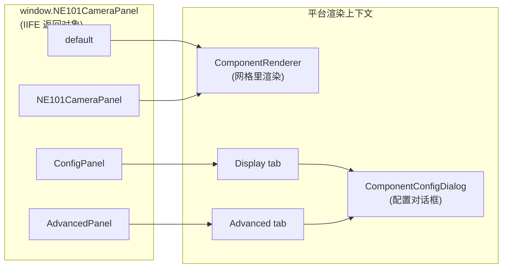
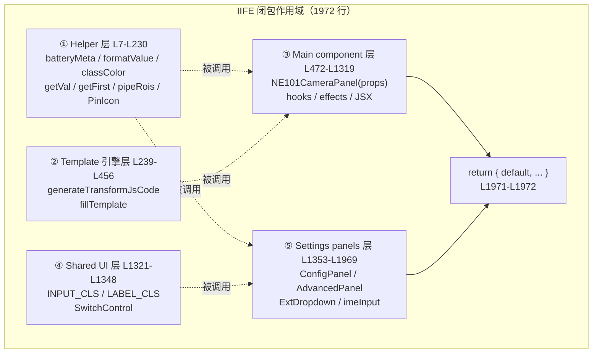
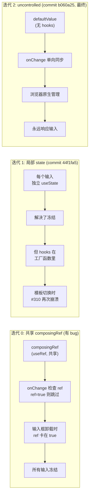

# 6 组件构建：从 IIFE 注入到 shadcn 复刻的工程范式

> 本节是 ne101_camera MVP 阶段的**组件构建参考页**，也是 MVP 核心三页的收尾篇。读完你应当能：(1) 解释为什么 `bundle.js` 第一行不是 import 而是 `var React = window.React`——这套「IIFE 注入范式」是 NeoMind 组件市场的底层约定，与 ESM 打包方案的根本差异在哪里；(2) 复述 L1971 那个 `return { default, NE101CameraPanel, ConfigPanel, AdvancedPanel }` 四键导出对象的设计动机，说出平台加载器如何通过 `global_name` + `export_name` 路由到正确的组件；(3) 画出 1972 行 IIFE 的五层模块结构（helper / template engine / main component / shared UI / settings panels），解释为什么「同一闭包内的函数提升」能替代打包器的模块解析；(4) 复述 React hooks 在 IIFE 中踩过的三个经典坑（commit `0601cd4` 的条件 useState 导致 #310、commit `44f1fa5` 的共享 composingRef 导致输入冻结、commit `b060a25` 的最终 uncontrolled 修复），并说出为什么这些坑在 ESM + ESLint 项目里不会出现；(5) 描述 shadcn CSS 类复刻策略（`INPUT_CLS` / `SwitchControl` / `ExtDropdown`），解释为什么选择复制 className 字符串而不是内联样式或请求平台组件 API。所有行号锚点都指向源码仓库 `main` 分支的 [`bundle.js`](https://github.com/camthink-ai/NeoMind-Dashboard-Components/blob/main/components/ne101_camera/bundle.js) 和 [`manifest.json`](https://github.com/camthink-ai/NeoMind-Dashboard-Components/blob/main/components/ne101_camera/manifest.json)。

---

## 6.1 IIFE 注入范式

ne101_camera 的 `bundle.js` 第一行不是 `import` 语句，而是一个 IIFE（立即调用函数表达式）的入口。查看源码：[`bundle.js` L1-L5](https://github.com/camthink-ai/NeoMind-Dashboard-Components/blob/main/components/ne101_camera/bundle.js#L1-L5)。

```javascript
var NE101CameraPanel = (function () {
  var React = window.React;
  var jsx = window.jsxRuntime.jsx;
  var jsxs = window.jsxRuntime.jsxs;
  // ... 1965 行组件逻辑 ...
})();
```

这三行 `var React = window.React` + `var jsx = window.jsxRuntime.jsx` + `var jsxs = window.jsxRuntime.jsxs` 是 NeoMind 组件市场的「注入三连」。平台在加载组件之前，会先在宿主页面上挂载全局的 `window.React`（单例 React 实例）和 `window.jsxRuntime`（提供 `jsx` / `jsxs` 两个 JSX 转换函数）。组件在 IIFE 求值时（`<script>` 标签执行瞬间）从 `window` 上「借」一份引用。这意味着 bundle **不打包 React**，整个 1972 行文件只包含业务逻辑，没有 framework 运行时——unminified 约 80KB，minified 后更小。

这个范式与 ESM 打包组件（Vite / webpack 产物）的根本差异在于**React 实例的唯一性**。ESM 打包方案通常把 React 作为 `external`（不打进 bundle）或 `peerDependency`，但这依赖打包配置正确——一旦某个组件配置失误把 React 打进了 chunk，就会产生第二个 React 实例，导致 hooks 跨实例失效（`useContext` 返回 undefined、`useRef` 报错、`useState` 状态丢失）。IIFE + `window.React` 范式从机制上杜绝了这个问题：平台保证只加载一份 React，所有 6 个市场组件共享同一个实例，没有任何打包配置可以让组件「自带」另一份。

IIFE 的最后一行是闭包的收尾和导出，位于 [`bundle.js` L1971-L1972](https://github.com/camthink-ai/NeoMind-Dashboard-Components/blob/main/components/ne101_camera/bundle.js#L1971-L1972)：`return { default: NE101CameraPanel, ... };` 紧跟 `})();`。`return` 的对象被赋值给 `var NE101CameraPanel`，再由平台的 `<script>` 加载器挂到 `window.NE101CameraPanel`。IIFE 内部所有 `function` / `var` 声明都被闭包作用域保护，不泄漏到 `window` 上——这是 IIFE 替代模块系统的核心价值：**零依赖的私有命名空间**。

```js
// bundle.js L1971-L1972
return { default: NE101CameraPanel, NE101CameraPanel: NE101CameraPanel, ConfigPanel: ConfigPanel, AdvancedPanel: AdvancedPanel };
})();
```

Source: [`bundle.js` L1971-L1972](https://github.com/camthink-ai/NeoMind-Dashboard-Components/blob/main/components/ne101_camera/bundle.js#L1971-L1972)

**设计决策：IIFE + 全局注入 vs ESM bundle vs UMD**

- **选择**：`var Name = (function(){ var React = window.React; ... })()` 的 IIFE + 全局注入范式。
- **备选方案 A**：ESM bundle（Vite / Rollup 产物，`import React from 'react'`）。否决理由：ESM 需要平台支持 `<script type="module">` + import map 或 bundler 解析，而 NeoMind 平台用普通 `<script>` 标签加载组件；更重要的是 ESM 的 `external` 配置一旦失误，React 会被打进 chunk，破坏单实例约定。
- **备选方案 B**：UMD（Universal Module Definition）。否决理由：UMD 会探测 `define`（AMD）/ `module.exports`（CommonJS）/ `window`（global）三个分支，对「只用 `<script>` 加载」的 NeoMind 平台是冗余的——三个分支中有两个永远不会被触发，白白增加 bundle 体积。
- **理由**：IIFE 是唯一能用「函数作用域 + 闭包」模拟私有命名空间的零依赖手段，且与平台的 `<script>` 加载方式天然契合。这个生态的核心前提是「平台保证一个 React 实例」，IIFE 范式让组件代码无法违反这个前提。
- **代价**：没有 tree-shaking（helper 层的未使用函数也会进 bundle）、没有 TypeScript 类型检查、没有 ESLint 的 `rules-of-hooks` 插件（这正是 6.4 那个 hooks 顺序 bug 的根因）。ne101_camera 接受这个代价，靠 `test_bundle.js` 做逻辑测试兜底。

---

## 6.2 命名导出对象

IIFE 的 `return` 语句返回的是一个**多键对象**，不是单个函数。查看源码：[`bundle.js` L1971](https://github.com/camthink-ai/NeoMind-Dashboard-Components/blob/main/components/ne101_camera/bundle.js#L1971-L1971)。

```javascript
return {
  default: NE101CameraPanel,
  NE101CameraPanel: NE101CameraPanel,
  ConfigPanel: ConfigPanel,
  AdvancedPanel: AdvancedPanel
};
```

这个对象有四个键，对应平台加载器的两种寻址方式。`manifest.json` 的 [`global_name`](https://github.com/camthink-ai/NeoMind-Dashboard-Components/blob/main/components/ne101_camera/manifest.json#L38-L38) 字段（`"NE101CameraPanel"`）告诉平台「这个 bundle 挂在 `window.NE101CameraPanel` 上」，而 [`export_name`](https://github.com/camthink-ai/NeoMind-Dashboard-Components/blob/main/components/ne101_camera/manifest.json#L39-L39) 字段（同为 `"NE101CameraPanel"`）告诉平台「从那个对象上取 `NE101CameraPanel` 键的值作为主组件」。平台的组件加载器伪代码如下：先按 `global_name` 从 `window` 取到 bundle 对象，再从对象上按 `export_name`（或 `default`，取决于加载器版本）取到组件函数。

```js
// manifest.json L38-L39
"global_name": "NE101CameraPanel",
"export_name": "NE101CameraPanel"
```

Source: [`manifest.json` L38-L39](https://github.com/camthink-ai/NeoMind-Dashboard-Components/blob/main/components/ne101_camera/manifest.json#L38-L39)

**为什么同时暴露 `default` 和 `NE101CameraPanel` 两个键**：这是向前兼容的保险。新版 Dashboard 加载器读 `export_name`（命名导出），旧版加载器（v1.x 时代）读 `default`。两个键指向同一个函数引用，多占的只是一个指针（几字节），但避免了「升级 manifest 的 `export_name` 字段后旧版平台白屏」的破坏性变更。metric_card（[#6 metric_card](../6-metric-card-component.md)）也采用了同样的双暴露策略。

**`ConfigPanel` 和 `AdvancedPanel` 的导出语义**：这两个键映射到平台 ComponentConfigDialog 的两个 tab。平台的配置对话框约定：如果一个组件的 bundle 对象上存在 `ConfigPanel` 键，就把它渲染到「Display」tab；如果存在 `AdvancedPanel` 键，就渲染到「Advanced」tab。主组件（`NE101CameraPanel`）渲染在网格里，与配置对话框是分离的两个渲染上下文——这就是为什么它们必须是独立的导出键，而不能是主组件的子组件。

下图展示了从 bundle 对象到平台两个渲染上下文的路由关系。



**设计决策：多键导出对象 vs 单个 default 函数**

- **选择**：`return { default, NE101CameraPanel, ConfigPanel, AdvancedPanel }` 四键对象。
- **备选方案**：`return NE101CameraPanel`（直接返回函数），让平台从 `window.NE101CameraPanel` 直接拿到主组件，配置面板通过其它方式（如约定全局函数名 `NE101CameraPanel_ConfigPanel`）寻址。
- **理由**：平台需要**独立地寻址配置面板**——配置对话框打开时只渲染 `ConfigPanel` / `AdvancedPanel`，不渲染主组件（主组件在网格里）。如果用单个函数，平台就必须用额外的全局变量或命名约定来找配置面板，违反「一个 bundle 一个挂载点」的契约。多键对象让所有导出集中在 `window.NE101CameraPanel` 这一个挂载点上，平台用属性查找就能路由。
- **代价**：`default` 和 `NE101CameraPanel` 键冗余（指向同一函数），但这是向前兼容的标准代价，可忽略。

---

## 6.3 五层模块结构

1972 行的 IIFE 不是一坨平铺代码，而是按职责分成了五层。这一节的分层与 [2.2](./2-architecture.md) 的五层架构概述一致，但这里聚焦**构建视角**——为什么这种分层能在没有打包器的情况下工作，以及每一层的构建特征。五层的行号边界如下：

1. **Helper 层**（[L7-L230](https://github.com/camthink-ai/NeoMind-Dashboard-Components/blob/main/components/ne101_camera/bundle.js#L7-L230)）：纯函数工具集——`batteryMeta`、`formatValue`、`unitStr`、`timeAgo`、`getVal`、`getFirst`、`classColor`、`pipeRois`、`PinIcon`、`ModeIcon`。无 React 依赖、无状态、无副作用，可以单独抽出来跑在 Node.js 里做单元测试。
2. **Template 引擎层**（[L239-L456](https://github.com/camthink-ai/NeoMind-Dashboard-Components/blob/main/components/ne101_camera/bundle.js#L239-L456)）：`generateTransformJsCode(pipe)` + `fillTemplate` —— 从 pipeline 配置生成 Transform 的 JS 代码字符串。纯字符串拼接，无 React。
3. **Main component 层**（[L472-L1319](https://github.com/camthink-ai/NeoMind-Dashboard-Components/blob/main/components/ne101_camera/bundle.js#L472-L1319)）：`NE101CameraPanel(props)` —— 主组件，包含所有 hooks、effects、JSX 渲染逻辑。847 行，是五层中最重的一层。
4. **Shared UI 层**（[L1321-L1348](https://github.com/camthink-ai/NeoMind-Dashboard-Components/blob/main/components/ne101_camera/bundle.js#L1321-L1348)）：shadcn CSS 类常量（`INPUT_CLS` / `LABEL_CLS` / `FIELD_CLS` / `DESC_CLS`）+ `SwitchControl` 按钮工厂。
5. **Settings panels 层**（[L1353-L1969](https://github.com/camthink-ai/NeoMind-Dashboard-Components/blob/main/components/ne101_camera/bundle.js#L1353-L1969)）：`ConfigPanel`（Display tab，5 行空壳）、`AdvancedPanel`（Advanced tab，522 行重逻辑）、`ExtDropdown`（shadcn 风格下拉框）、`imeInput`（uncontrolled 输入工厂）。

以下是每一层的代表性代码片段（因完整代码超过 1900 行，仅展示每层的开头几行）：

```js
// Layer 1: Helper 层 L7-L45（纯函数工具集）
function batteryMeta(level) {
  if (level == null) return { bar: 'rgba(128,128,128,0.3)' };
  if (level > 60) return { bar: 'rgba(34,197,94,0.8)' };
  if (level > 20) return { bar: 'rgba(234,179,8,0.8)' };
  return { bar: 'rgba(239,68,68,0.8)' };
}

function formatValue(val, metric) {
  if (val == null) return '--';
  var dt = (metric && metric.data_type) || '';
  if (dt === 'Integer') return typeof val === 'number' ? Math.round(val).toLocaleString() : String(val);
  if (dt === 'Float') return typeof val === 'number' ? val.toFixed(1) : String(val);
  return String(val);
}
// ... (178 lines omitted) ...
```

Source: [`bundle.js` L7-L230](https://github.com/camthink-ai/NeoMind-Dashboard-Components/blob/main/components/ne101_camera/bundle.js#L7-L230)

```js
// Layer 2: Template 引擎层 L239-L267（generateTransformJsCode 开头）
function generateTransformJsCode(pipe) {
  var extensionId = pipe.extId;
  if (extensionId.indexOf('virtual') === 0) {
    extensionId = extensionId.replace(/^virtual[._-]/, '');
  }
  var templateName = pipe.template;
  var mode = getExtMode(extensionId, templateName);
  if (!mode) return '';

  var extKey = extensionId.replace(/-/g, '_');
  var pfx = extKey + '.';
  var imageArg = mode.imageArg;
  var hasCats = (mode.args || []).indexOf('categories') >= 0 && pipe.categories;
  // ... (189 lines omitted) ...
}
```

Source: [`bundle.js` L239-L456](https://github.com/camthink-ai/NeoMind-Dashboard-Components/blob/main/components/ne101_camera/bundle.js#L239-L456)

```js
// Layer 3: Main component 层 L472-L495（NE101CameraPanel 开头）
function NE101CameraPanel(props) {
  var config = props.config || {};
  var showCommands = config.showCommands !== false;
  var location = props.title || config.displayTitle || config.location || '';

  var deviceCtx = props.deviceContext;
  var device = deviceCtx && deviceCtx.device;
  var deviceType = deviceCtx && deviceCtx.deviceType;
  var sendCmd = props.sendDeviceCommand;

  var cmdState = React.useState({});
  var cmdLoading = cmdState[0];
  var setCmdLoading = cmdState[1];
  // ... (824 lines omitted) ...
}
```

Source: [`bundle.js` L472-L1319](https://github.com/camthink-ai/NeoMind-Dashboard-Components/blob/main/components/ne101_camera/bundle.js#L472-L1319)

```js
// Layer 4: Shared UI 层 L1321-L1348（CSS 类常量 + SwitchControl）
var INPUT_CLS = 'flex h-10 w-full rounded-md border border-input bg-background px-3 py-2 text-sm placeholder:text-muted-foreground focus-visible:outline-none disabled:cursor-not-allowed disabled:opacity-50';
var LABEL_CLS = 'text-sm font-medium leading-none peer-disabled:cursor-not-allowed peer-disabled:opacity-70';
var FIELD_CLS = 'flex flex-col gap-1.5';
var DESC_CLS = 'text-sm text-muted-foreground';

function SwitchControl(checked, onChangeFn) {
  var state = checked ? 'checked' : 'unchecked';
  return jsx('button', {
    type: 'button', role: 'switch', 'data-state': state,
    'aria-checked': String(checked), onClick: onChangeFn,
    className: 'peer inline-flex h-6 w-11 shrink-0 cursor-pointer items-center rounded-full border-2 border-transparent transition-colors focus-visible:outline-none focus-visible:ring-2 focus-visible:ring-ring focus-visible:ring-offset-2 focus-visible:ring-offset-background disabled:cursor-not-allowed disabled:opacity-50 data-[state=checked]:bg-primary data-[state=unchecked]:bg-input',
    children: jsx('span', { 'data-state': state, className: 'pointer-events-none block h-5 w-5 rounded-full bg-background shadow-lg ring-0 transition-transform data-[state=checked]:translate-x-5 data-[state=unchecked]:translate-x-0' })
  });
}
```

Source: [`bundle.js` L1321-L1348](https://github.com/camthink-ai/NeoMind-Dashboard-Components/blob/main/components/ne101_camera/bundle.js#L1321-L1348)

```js
// Layer 5: Settings panels 层 L1353-L1369（ConfigPanel + ROI_ACTIONS + ExtDropdown 开头）
function ConfigPanel(props) {
  return jsx('div', { className: 'space-y-3', children: null });
}

var ROI_ACTIONS = [
  { id: 'count', label: 'Count Only', desc: 'Show all detections, count per ROI' },
  { id: 'filter', label: 'Inside Only', desc: 'Only show detections inside ROI' },
  { id: 'filter_outside', label: 'Outside Only', desc: 'Only show detections outside ROI' }
];

function ExtDropdown(props) {
  var exts = props.extensions;
  // ... (606 lines omitted) ...
}
```

Source: [`bundle.js` L1353-L1969](https://github.com/camthink-ai/NeoMind-Dashboard-Components/blob/main/components/ne101_camera/bundle.js#L1353-L1969)

**为什么这种分层能在没有构建步骤的情况下工作**：关键在于 JavaScript 的**函数提升（hoisting）**。IIFE 内部所有 `function foo() { ... }` 声明都会在 IIFE 求值时被提升到闭包顶部，因此第 5 层（L1353）的 `AdvancedPanel` 内部调用第 4 层（L1325）的 `INPUT_CLS` 常量、第 1 层（L57）的 `classColor` 函数时，不存在「先定义后使用」的顺序问题——它们都在同一个闭包作用域里。跨层调用就是普通的闭包内变量查找，不需要 ESM 的 `import` / `export` 解析，也不存在循环依赖（circular import）的风险，因为所有声明在 IIFE 求值时就已完成。



图中的虚线表示「被调用」方向：上层（行号小）的函数会被下层（行号大）调用，但靠函数提升机制，调用不依赖定义顺序。`EXPORT` 层同时引用 `L3`（主组件）和 `L5`（配置面板），把它们打包成导出对象。

**设计决策：单 IIFE 分层函数 vs 独立 ES 模块 vs 类**

- **选择**：单个 IIFE 内部按行号分五层，每层是一组 `function` / `var` 声明。
- **备选方案 A**：拆成独立 ES 模块（`helpers.js` / `template.js` / `main.js` / `shared-ui.js` / `panels.js`），用 `import` / `export` 连接。否决理由：ESM 需要打包器（Vite / Rollup）做模块解析和 bundle 合并，而 NeoMind 平台只支持 `<script>` 标签加载单文件——拆成模块就必须引入构建步骤，破坏「零构建」范式。
- **备选方案 B**：用 `class Component { ... }` 组织代码，方法挂在原型链上。否决理由：React 函数组件天然不是 OOP 的（hooks 只能在函数顶层调用，不能在 class 方法里用），且 class 的 `this` 绑定在闭包回调里容易丢失。
- **理由**：单 IIFE + 函数声明是最契合「零构建 + React 函数组件」的组合——函数提升解决跨层调用、闭包作用域提供私有性、`return` 对象做导出。代价是代码可读性：1972 行单文件没有 IDE 的 goto-definition 跨文件跳转，读源码必须先建立五层模型。

---

## 6.4 React Hooks 在 IIFE 中的陷阱 #1：Hooks 顺序

React 的 Rules of Hooks 规定：**hooks 必须在组件函数的顶层调用，不能放在条件语句、循环、嵌套函数里**。这条规则的本质是 React 内部用「调用顺序索引」来追踪每个 hook 的状态——如果某次渲染调用了 3 个 hooks、下次渲染调用了 4 个，索引就会错位，React 报错 #310（"Rendered more hooks than during the previous render"）或更隐晦的 state 错乱。

commit [`0601cd4`](https://github.com/camthink-ai/NeoMind-Dashboard-Components/commit/0601cd4)（`fix(ne101_camera): move conditional useState hook to fix React error #310`）修的就是这个 bug。原始代码里，ROI 编辑器的 `editingIdxState = React.useState(-1)` 被写在了 `if (roiEnabled) { ... }` 条件块内部。当用户在 `AdvancedPanel` 里把 ROI 开关从 on 切到 off 时，这个 `useState` 不再被调用，hook 总数从 N 变成 N-1，React 检测到 hook count mismatch 就崩溃了。反过来从 off 切到 on 也一样——hook 数从 N-1 变成 N，同样报错。

修复方案是把所有 ROI 相关的 hooks **无条件地提到条件代码之前**。查看当前代码：[`bundle.js` L1522-L1534](https://github.com/camthink-ai/NeoMind-Dashboard-Components/blob/main/components/ne101_camera/bundle.js#L1522-L1534)。

```javascript
// ROI hooks — MUST be called unconditionally, before any conditional code
var roiEnabled = config.processingRoiEnabled === true;
var rois = Array.isArray(config.processingRois) ? config.processingRois : [];
var drawState = React.useState([]);
var currentPts = drawState[0];
var setCurrentPts = drawState[1];
var canvasRef = React.useRef(null);
var imgRef = React.useRef(null);
var imgNatState2 = React.useState({ w: 0, h: 0 });
var imgNat2 = imgNatState2[0];
var editingIdxState = React.useState(-1);
var editingIdx = editingIdxState[0];
var setEditingIdx = editingIdxState[1];
```

这段代码的注释 `// ROI hooks — MUST be called unconditionally, before any conditional code` 是给未来维护者的**血泪警示**：`roiEnabled` 是一个普通变量（不是 hook），即使它为 false，下面的 6 个 hooks（`useState` x3 + `useRef` x2 + `useState` x1）也必须全部执行。条件渲染（如 ROI canvas 是否显示）发生在 hooks 之后的 JSX return 里，用 `roiEnabled && jsx(...)` 守卫，而不是在 hook 调用层做条件分支。

**为什么这个陷阱是 IIFE 特有的**：在一个正常的 ESM + Vite + ESLint 项目里，`react-hooks/rules-of-hooks` 插件会在**构建时**扫描所有 hooks 调用，发现「useState 在 if 块里」就报 lint error，代码根本提交不进去。而 IIFE 范式没有 ESLint（没有 `.eslintrc` 配置、没有构建步骤），这个规则只能靠开发者自觉——一旦疏忽，错误只会在运行时（用户切换 ROI 开关的瞬间）才暴露。这是「零构建」范式的隐性代价，也是为什么 ne101_camera 要维护 `test_bundle.js` 做逻辑测试。

**设计决策：无条件顶层 hooks vs 条件 hooks + 守卫**

- **选择**：所有 hooks 在组件函数顶部无条件调用，条件逻辑放在 hooks 之后的 JSX 里。
- **备选方案**：用 `if (condition) { useState(...) }` 在需要时才调用 hook，减少不必要的 state 分配。
- **理由**：React 的 Rules of Hooks 是硬性约束，不是风格偏好——hook 调用顺序的不一致会直接导致 state 错乱和运行时崩溃。无条件调用是**唯一**正确的写法，没有折中余地。
- **代价**：即使 ROI 未启用，那些 hooks 的 state 仍然占用内存（几个字节的空数组/null），但这是正确性的必然代价。

---

## 6.5 React Hooks 在 IIFE 中的陷阱 #2：Frozen Input

第二个 hooks 陷阱比第一个更隐蔽——它不会让 React 崩溃，而是让**输入框看起来冻结了**（用户打字但框里不显示）。这个 bug 的修复经历了两次迭代，涉及两个 commit：[`44f1fa5`](https://github.com/camthink-ai/NeoMind-Dashboard-Components/commit/44f1fa5)（`fix(ne101_camera): input fields frozen — use local state instead of shared composingRef`）和 [`b060a25`](https://github.com/camthink-ai/NeoMind-Dashboard-Components/commit/b060a25)（`fix(ne101_camera): React error #310 — use defaultValue instead of hooks in imeInput`）。

**原始实现的 bug**：`AdvancedPanel` 里的类别过滤和短语输入框需要支持中文/日文输入法（IME）。IME 在「组合输入」阶段（用户打了拼音还没选字）会连续触发 `onChange`，如果不做处理，每个按键都会把未完成的拼音同步到 config，导致输入混乱。原始方案用一个**共享的** `composingRef`（`React.useRef(false)`）来跟踪所有输入框的 IME 状态——`onCompositionStart` 时设为 true、`onCompositionEnd` 时设为 false、`onChange` 里检查 `composingRef.current` 为 true 就跳过同步。问题是这个 ref 是**跨所有输入框共享的**：如果输入框 A 的 `onCompositionStart` 把 ref 设为 true，然后输入框 A 被卸载（条件渲染消失），`onCompositionEnd` 不会触发，ref 卡在 true，之后**所有**输入框的 `onChange` 都被跳过——输入框看起来冻结了。

**迭代 1（commit `44f1fa5`）**：把共享 ref 换成每个输入框的**局部 state**。这解决了冻结问题（每个输入框独立跟踪自己的 IME 状态），但引入了新问题：`imeInput` 是一个**工厂函数**（在 `AdvancedPanel` 内部定义、返回 JSX），不是 React 组件。在工厂函数里调用 `React.useState` 违反 Rules of Hooks——当模板切换导致某些输入框出现/消失时，hook 数量变化，再次触发 React error #310。

**迭代 2（commit `b060a25`，最终修复）**：彻底放弃在 `imeInput` 里用 hooks，改用**完全 uncontrolled 的输入**。查看当前代码：[`bundle.js` L1459-L1468](https://github.com/camthink-ai/NeoMind-Dashboard-Components/blob/main/components/ne101_camera/bundle.js#L1459-L1468)。

```javascript
function imeInput(key, value, placeholder) {
  return jsx('input', {
    className: INPUT_CLS,
    defaultValue: value,
    placeholder: placeholder,
    onChange: function (e) {
      update(key, e.target.value);
    }
  });
}
```

这段代码只有 10 行，干净到几乎没有存在感。关键在于 `defaultValue`（不是 `value`）——`defaultValue` 让 input 成为 uncontrolled component，React 不控制它的值，浏览器原生管理输入。用户打字时浏览器直接更新 DOM，无需 React 重渲染，输入框永远不会「冻结」。config 同步通过 `onChange` → `update(key, value)` 完成（L1464-L1465），但这个同步是**单向的**（DOM → config），不会反向覆盖用户正在输入的内容。IME 组合输入的问题也被自然解决：`onChange` 在 IME 组合阶段也会触发，但因为它只同步到 config 而不回写 `value`，所以不会干扰用户的选择过程。



**设计决策：uncontrolled `defaultValue` 输入 vs controlled `value`+state vs hooks-in-factory**

- **选择**：`defaultValue` + `onChange` 单向同步的 uncontrolled input（[`L1459-L1468`](https://github.com/camthink-ai/NeoMind-Dashboard-Components/blob/main/components/ne101_camera/bundle.js#L1459-L1468)）。
- **备选方案 A**：controlled input（`value={state}` + `onChange` 回写 state）。否决理由：需要每个输入框维护一个 `useState`，而 `imeInput` 是工厂函数——hooks 在工厂里调用违反 Rules of Hooks，且输入框数量随模板切换变化时 hook 数量也变。
- **备选方案 B**：在工厂函数里用 `useState`（迭代 1 的方案）。否决理由：同上，违反 Rules of Hooks。
- **理由**：uncontrolled input 是 IME 安全的（浏览器原生处理组合输入）、无 hooks 的（不会触发 hook count mismatch）、永远响应的（DOM 由浏览器管理，React 不干预）。这三个特性恰好解决了前两次迭代踩过的所有坑。
- **代价**：uncontrolled input 的值不能从外部「强制重置」——如果 config 被其它路径修改（如用户点了「重置」按钮），input 框不会自动更新，因为 `defaultValue` 只在首次挂载时生效。但在 `AdvancedPanel` 的场景里这不是问题：config 变更通常伴随着面板重开（组件重新挂载），`defaultValue` 会重新读取。

---

## 6.6 ConfigPanel 与 AdvancedPanel 分工

NeoMind 平台的 ComponentConfigDialog 约定两个 tab：**Display**（用户可见的显示配置）和 **Advanced**（面向 power user 的高级配置）。ne101_camera 用 `ConfigPanel` 和 `AdvancedPanel` 两个导出函数分别填充这两个 tab，两者在代码量和复杂度上形成了鲜明的反差。

**ConfigPanel：极简的 Display tab**。查看源码：[`bundle.js` L1353-L1357](https://github.com/camthink-ai/NeoMind-Dashboard-Components/blob/main/components/ne101_camera/bundle.js#L1353-L1357)。

```javascript
function ConfigPanel(props) {
  // Title field is provided by the platform (ComponentConfigDialog → titleSection)
  // No custom fields needed — this keeps Display tab clean with just the platform title
  return jsx('div', { className: 'space-y-3', children: null });
}
```

这个函数只有 5 行，返回一个空 `<div>`。原因写在注释里：**标题字段由平台提供**。ComponentConfigDialog 内置了一个 `titleSection`，用户可以在那里设置组件的显示标题（如「前门摄像头」），不需要组件自己再提供一个标题输入框。`ConfigPanel` 选择把 Display tab 完全让给平台的标题字段，保持视觉简洁。这种「不重复造轮子」的态度是 ne101_camera 配置设计的第一原则。

**AdvancedPanel：重逻辑的 Advanced tab**。查看源码起始：[`bundle.js` L1363-L1448](https://github.com/camthink-ai/NeoMind-Dashboard-Components/blob/main/components/ne101_camera/bundle.js#L1363-L1448)。`AdvancedPanel` 是整个 bundle 第二长的函数（522 行，仅次于主组件的 847 行），承载了 ne101_camera 的所有「配置复杂度」：AI 处理总开关（`SwitchControl`）、扩展选择（`ExtDropdown`）、模板/模式选择、类别过滤输入（`imeInput`）、短语输入、类别颜色过滤、ROI 开关 + 多边形编辑器（Canvas 画布上的拖拽点）、ROI 重叠阈值滑块（commit [`636a8ae`](https://github.com/camthink-ai/NeoMind-Dashboard-Components/commit/636a8ae)）、NMS IoU 阈值透传给 `locate-anything-v2`（commit [`8656148`](https://github.com/camthink-ai/NeoMind-Dashboard-Components/commit/8656148)）。

```js
// bundle.js L1363-L1448（AdvancedPanel 区域起始：ROI_ACTIONS + ExtDropdown）
var ROI_ACTIONS = [
  { id: 'count', label: 'Count Only', desc: 'Show all detections, count per ROI' },
  { id: 'filter', label: 'Inside Only', desc: 'Only show detections inside ROI' },
  { id: 'filter_outside', label: 'Outside Only', desc: 'Only show detections outside ROI' }
];

function ExtDropdown(props) {
  var exts = props.extensions;
  var value = props.value;
  var onChangeFn = props.onChange;
  var loading = props.loading;

  var openSt = React.useState(false);
  var open = openSt[0];
  var setOpen = openSt[1];
  var wrapRef = React.useRef(null);

  React.useEffect(function () {
    if (!open) return;
    function handler(e) {
      if (wrapRef.current && !wrapRef.current.contains(e.target)) setOpen(false);
    }
    document.addEventListener('mousedown', handler);
    return function () { document.removeEventListener('mousedown', handler); }
  }, [open]);
  // ... (55 lines omitted) ...
}

function AdvancedPanel(props) {
  var config = props.config || {};
  var onChange = props.onChange;
  // ... (519 lines omitted) ...
}
```

Source: [`bundle.js` L1363-L1448](https://github.com/camthink-ai/NeoMind-Dashboard-Components/blob/main/components/ne101_camera/bundle.js#L1363-L1448)

**ExtDropdown：shadcn 风格下拉框**。查看源码：[`bundle.js` L1371-L1446](https://github.com/camthink-ai/NeoMind-Dashboard-Components/blob/main/components/ne101_camera/bundle.js#L1371-L1446)。这是一个 76 行的自定义下拉框组件，替代原生 `<select>` 元素。用原生 `<select>` 会破坏 shadcn 设计系统的一致性（原生 select 的样式无法完全自定义，在 macOS 和 Windows 上表现不一）。`ExtDropdown` 用 `button` + 浮层 `div` 模拟下拉行为，所有 className 都匹配 shadcn Select 组件的 DOM 契约（`bg-popover` / `text-popover-foreground` / `shadow-md` / `rounded-md` / `border`）。它还支持 loading 态（显示 "Loading extensions..."）和外部点击关闭（`useEffect` + `document.addEventListener('mousedown', ...)`）。

**设计决策：两个面板分工 vs 一个大表单**

- **选择**：`ConfigPanel`（Display tab，几乎空）+ `AdvancedPanel`（Advanced tab，重逻辑）的双面板分工。
- **备选方案**：把所有配置字段放在一个面板里（单个 tab），用分隔线和标题分组。
- **理由**：平台的 Display/Advanced 双 tab 约定是一个**用户心理模型**——Display 是「普通用户需要看的」（标题、位置），Advanced 是「power user 才会碰的」（AI 处理、ROI、阈值）。双 tab 让普通用户不被高级字段吓到，power user 也能快速定位到他们需要的配置。ne101_camera 的 18 个配置字段如果全放一个 tab，用户需要滚动三屏才能找到「标题」字段，体验极差。
- **代价**：`ConfigPanel` 几乎是空壳，看起来「浪费」了一个导出键。但平台的 tab 结构是约定，`ConfigPanel` 必须存在（即使返回 null）才能让 tab 布局正确。

---

## 6.7 shadcn CSS 类复刻策略

NeoMind Dashboard 的 UI 使用 [shadcn/ui](https://ui.shadcn.com/) 组件库构建。shadcn/ui 的特点不是「安装一个 npm 包」，而是**把组件源码复制到项目的 `components/ui/` 目录**——这意味着平台页面上已经加载了 shadcn 的 Tailwind CSS 类定义（如 `bg-background` / `text-muted-foreground` / `data-[state=checked]:bg-primary`）。ne101_camera 的组件**无法 import 这些 shadcn 组件**（IIFE 没有模块解析），但它可以**复刻 shadcn 组件的 className 字符串**，让 Tailwind 的 JIT 编译器（已经在平台上运行）把同样的样式应用到组件的 DOM 元素上。

这就是「shadcn CSS 类复刻」策略：把 shadcn 组件源码里的 `className="..."` 字符串**逐字复制**到 IIFE 的常量或 JSX 里。查看 Shared UI 层：[`bundle.js` L1321-L1348](https://github.com/camthink-ai/NeoMind-Dashboard-Components/blob/main/components/ne101_camera/bundle.js#L1321-L1348)。

```javascript
// shadcn Input classes (from components/ui/input.tsx)
var INPUT_CLS = 'flex h-10 w-full rounded-md border border-input bg-background px-3 py-2 text-sm placeholder:text-muted-foreground focus-visible:outline-none disabled:cursor-not-allowed disabled:opacity-50';
// shadcn Label classes (from components/ui/label.tsx)
var LABEL_CLS = 'text-sm font-medium leading-none peer-disabled:cursor-not-allowed peer-disabled:opacity-70';
// shadcn Field wrapper (from components/ui/field.tsx)
var FIELD_CLS = 'flex flex-col gap-1.5';
// shadcn Description
var DESC_CLS = 'text-sm text-muted-foreground';
```

`INPUT_CLS`（[L1325](https://github.com/camthink-ai/NeoMind-Dashboard-Components/blob/main/components/ne101_camera/bundle.js#L1325-L1325)）是从平台的 `components/ui/input.tsx` 文件里**逐字复制**的 className。只要平台上的 Tailwind 编译器扫描到了这些类名（它会的，因为 shadcn 的 Input 组件在平台其它地方也被使用），ne101_camera 的 `<input>` 元素就会获得与平台原生 Input 完全一致的视觉表现——包括 hover、focus、disabled 状态。

**SwitchControl：用 `data-state` 触发 shadcn Switch 的 CSS 规则**。查看源码：[`L1334-L1348`](https://github.com/camthink-ai/NeoMind-Dashboard-Components/blob/main/components/ne101_camera/bundle.js#L1334-L1348)。shadcn 的 Switch 组件用 `data-[state=checked]:bg-primary` 这个 Tailwind 变体来控制开关颜色——`data-state` 属性为 `checked` 时背景变为主题色，为 `unchecked` 时为输入框灰色。`SwitchControl` 手动构建了一个 `<button role="switch" data-state={checked ? 'checked' : 'unchecked'}>`，className 里包含 `data-[state=checked]:bg-primary data-[state=unchecked]:bg-input`，完全匹配 shadcn Switch 的 DOM 契约。Tailwind 编译器看到这些类名，生成的 CSS 规则与平台 Switch 组件完全一致。

```js
// bundle.js L1334-L1348
function SwitchControl(checked, onChangeFn) {
  var state = checked ? 'checked' : 'unchecked';
  return jsx('button', {
    type: 'button',
    role: 'switch',
    'data-state': state,
    'aria-checked': String(checked),
    onClick: onChangeFn,
    className: 'peer inline-flex h-6 w-11 shrink-0 cursor-pointer items-center rounded-full border-2 border-transparent transition-colors focus-visible:outline-none focus-visible:ring-2 focus-visible:ring-ring focus-visible:ring-offset-2 focus-visible:ring-offset-background disabled:cursor-not-allowed disabled:opacity-50 data-[state=checked]:bg-primary data-[state=unchecked]:bg-input',
    children: jsx('span', {
      'data-state': state,
      className: 'pointer-events-none block h-5 w-5 rounded-full bg-background shadow-lg ring-0 transition-transform data-[state=checked]:translate-x-5 data-[state=unchecked]:translate-x-0'
    })
  });
}
```

Source: [`bundle.js` L1334-L1348](https://github.com/camthink-ai/NeoMind-Dashboard-Components/blob/main/components/ne101_camera/bundle.js#L1334-L1348)

**ExtDropdown：同样的 `data-state` 驱动**。`ExtDropdown`（[L1371](https://github.com/camthink-ai/NeoMind-Dashboard-Components/blob/main/components/ne101_camera/bundle.js#L1371-L1446)）用相同的策略复刻 shadcn Select 的视觉——浮层的 `bg-popover` / `text-popover-foreground` / `shadow-md` 都是 shadcn Select 组件的标准类名。

```js
// bundle.js L1429-L1445（ExtDropdown 浮层渲染部分）
return jsxs('div', { ref: wrapRef, className: 'relative', children: [
  jsx('button', {
    type: 'button',
    className: INPUT_CLS + ' flex items-center justify-between cursor-pointer',
    onClick: function () { setOpen(!open); },
    children: jsxs('span', { className: 'flex items-center gap-2 w-full', children: [
      jsx('span', { className: 'truncate flex-1 text-left', children: triggerLabel }),
      // ... (1 line omitted: chevron svg) ...
    ]})
  }),
  open && optItems.length > 0
    ? jsx('div', {
        className: 'absolute z-50 mt-1 w-full rounded-md border bg-popover text-popover-foreground shadow-md',
        children: jsx('div', { className: 'p-1 max-h-48 overflow-y-auto', children: optItems })
      })
    : null
]});
```

Source: [`bundle.js` L1371-L1446](https://github.com/camthink-ai/NeoMind-Dashboard-Components/blob/main/components/ne101_camera/bundle.js#L1371-L1446)

**设计决策：CSS 类字符串复刻 vs 内联样式 vs 请求平台组件 API**

- **选择**：逐字复制 shadcn 组件的 className 字符串到 IIFE 常量/JSX。
- **备选方案 A**：用内联样式（`style={{ background: 'hsl(var(--background))' }}`）。否决理由：内联样式**无法匹配 Tailwind 的伪类和状态变体**——`hover:` / `focus-visible:` / `data-[state=checked]:` 这些选择器只能通过 CSS 类或 `<style>` 标签实现，不能写在 `style` 属性里。内联样式只能做静态样式，交互状态（hover 变色、focus 描边）全部丢失。
- **备选方案 B**：请求平台暴露一个组件注册 API（如 `window.neomind.ui.Input`），让组件从平台「借」shadcn 组件实例。否决理由：平台目前没有暴露这样的 API（见 [2.1](./2-architecture.md) 的注入三连，只注入了 `React` + `jsxRuntime`）。设计这样一个 API 需要考虑版本兼容、props 契约、样式隔离等一系列问题，短期内不会实现。className 复刻是当前唯一可行的方案。
- **理由**：className 复刻利用了 Tailwind JIT 编译器的全局扫描机制——只要类名出现在 DOM 里（无论是平台的 shadcn 组件还是 ne101_camera 的 JSX），Tailwind 就会生成对应的 CSS 规则。这让 ne101_camera 的视觉效果与平台原生组件**像素级一致**，且无需任何额外依赖。
- **代价**：如果平台升级 shadcn 组件（修改了 Input 的 className），ne101_camera 的复刻版本会**不同步**——平台的 Input 变了 padding，ne101_camera 的 `INPUT_CLS` 还是旧的。这需要组件维护者定期同步 className 字符串。实践中这个代价可以接受：shadcn 组件的 className 很少大改，且差异通常是视觉上的微小调整（如 padding 从 `py-2` 变成 `py-2.5`），不会破坏功能。

---

## 6.8 设计决策汇总

本页涉及的 7 个设计决策汇总如下，每个都包含「选择 / 备选 / 理由」三段式。

| 决策 | 选择 | 备选方案 | 理由 |
|------|------|----------|------|
| **IIFE 注入范式** | `var React = window.React` + IIFE 闭包（[L1-L5](https://github.com/camthink-ai/NeoMind-Dashboard-Components/blob/main/components/ne101_camera/bundle.js#L1-L5)） | ESM bundle / UMD | 平台保证单 React 实例，IIFE 从机制上杜绝多实例；零构建，`<script>` 标签直接加载 |
| **多键导出对象** | `return { default, NE101CameraPanel, ConfigPanel, AdvancedPanel }`（[L1971](https://github.com/camthink-ai/NeoMind-Dashboard-Components/blob/main/components/ne101_camera/bundle.js#L1971-L1971)） | 单个 default 函数 | 平台需独立寻址配置面板；`default` + 命名导出双暴露兼容新旧加载器 |
| **单 IIFE 五层结构** | 按行号分五层（helper / template / main / shared UI / panels），函数提升解决跨层调用（[L7](https://github.com/camthink-ai/NeoMind-Dashboard-Components/blob/main/components/ne101_camera/bundle.js#L7-L230) / [L239](https://github.com/camthink-ai/NeoMind-Dashboard-Components/blob/main/components/ne101_camera/bundle.js#L239-L456) / [L472](https://github.com/camthink-ai/NeoMind-Dashboard-Components/blob/main/components/ne101_camera/bundle.js#L472-L1319) / [L1321](https://github.com/camthink-ai/NeoMind-Dashboard-Components/blob/main/components/ne101_camera/bundle.js#L1321-L1348) / [L1353](https://github.com/camthink-ai/NeoMind-Dashboard-Components/blob/main/components/ne101_camera/bundle.js#L1353-L1969)） | 拆成 ESM 模块 / class 组织 | 零构建 + 闭包作用域 = 无需打包器的模块化；函数提升消除顺序依赖 |
| **无条件顶层 hooks** | 所有 hooks 在函数顶部无条件调用，条件逻辑放 JSX 里（[L1522-L1534](https://github.com/camthink-ai/NeoMind-Dashboard-Components/blob/main/components/ne101_camera/bundle.js#L1522-L1534)，commit [`0601cd4`](https://github.com/camthink-ai/NeoMind-Dashboard-Components/commit/0601cd4)） | 条件 hooks + 守卫 | React Rules of Hooks 硬性约束，hook 调用顺序不一致直接导致 #310 崩溃 |
| **uncontrolled input** | `defaultValue` + `onChange` 单向同步（[L1459-L1468](https://github.com/camthink-ai/NeoMind-Dashboard-Components/blob/main/components/ne101_camera/bundle.js#L1459-L1468)，commit [`b060a25`](https://github.com/camthink-ai/NeoMind-Dashboard-Components/commit/b060a25)） | controlled `value`+state / hooks-in-factory | IME 安全、无 hooks、永远响应输入；工厂函数里不能用 hooks |
| **Display + Advanced 双面板** | `ConfigPanel`（空壳，[L1353-L1357](https://github.com/camthink-ai/NeoMind-Dashboard-Components/blob/main/components/ne101_camera/bundle.js#L1353-L1357)）+ `AdvancedPanel`（重逻辑，[L1363-L1969](https://github.com/camthink-ai/NeoMind-Dashboard-Components/blob/main/components/ne101_camera/bundle.js#L1363-L1969)） | 单个大表单 | 匹配平台 Display/Advanced 双 tab 用户心理模型；普通用户不被高级字段吓到 |
| **shadcn CSS 类复刻** | 逐字复制 className 字符串（[L1321-L1348](https://github.com/camthink-ai/NeoMind-Dashboard-Components/blob/main/components/ne101_camera/bundle.js#L1321-L1348)） | 内联样式 / 请求平台组件 API | Tailwind JIT 全局扫描让复刻类名获得一致样式；内联样式无法匹配 hover/focus 伪类 |

这 7 个决策的共同主题是：**在「零构建」的约束下选择最简方案**。IIFE 范式放弃了打包器带来的 tree-shaking、类型检查、linting，换来的是极简的部署模型（一个 `.js` 文件 + 一个 `.json` manifest）。在这个约束下，每一个工程决策都在寻找「不依赖构建工具就能正确工作」的路径——函数提升替代模块解析、闭包替代 import/export、className 复刻替代组件库、uncontrolled input 替代 controlled state。这种「回到浏览器原语」的工程哲学，是 NeoMind 组件市场能够维持「6 个组件零构建步骤、单文件部署」的根本原因。

### 关键 commit 索引

| Commit | 类型 | 一句话说明 | 涉及小节 |
|--------|------|------------|----------|
| [`0601cd4`](https://github.com/camthink-ai/NeoMind-Dashboard-Components/commit/0601cd4) | fix | move conditional useState hook to fix React error #310 | 6.4 |
| [`44f1fa5`](https://github.com/camthink-ai/NeoMind-Dashboard-Components/commit/44f1fa5) | fix | input fields frozen — use local state instead of shared composingRef | 6.5 |
| [`b060a25`](https://github.com/camthink-ai/NeoMind-Dashboard-Components/commit/b060a25) | fix | React error #310 — use defaultValue instead of hooks in imeInput | 6.5 |
| [`a8c1212`](https://github.com/camthink-ai/NeoMind-Dashboard-Components/commit/a8c1212) | revert | remove auto hash bump, preserve user transform edits | 6.3（template 引擎层演进） |
| [`8656148`](https://github.com/camthink-ai/NeoMind-Dashboard-Components/commit/8656148) | feat | pass NMS IoU threshold 0.5 to locate-anything-v2 | 6.6（AdvancedPanel 滑块） |
| [`c276c23`](https://github.com/camthink-ai/NeoMind-Dashboard-Components/commit/c276c23) | feat | per-class detection colors via golden-angle HSV rotation | 6.3（Helper 层 classColor） |

### 后续章节桥接

- 回到 [2 架构总览](./2-architecture.md) —— 本节的五层模块结构与 2.2 的五层架构概述互补：2 聚焦「是什么」，6 聚焦「怎么构建」。2.5 的决策 #1（IIFE + window.React）在 6.1 有更深入的构建视角分析。
- 回到 [5 前端消费](./5-frontend-consume.md) —— 5 的 callback ref 模式（commit `d7836b8`）和 6.4 的 hooks 顺序修复（commit `0601cd4`）是同一主题的两面：都是在 IIFE 里写 React 时容易踩的坑。
- [7 集成测试](./7-integration-test.md)—— 本节提到的 hooks 陷阱、frozen input、shadcn 类不同步等问题，在 7 的测试矩阵里有对应的验证用例。
- [8 深度复盘](./8-deep-dive.md)—— 1972 行 IIFE 的版本演进（133 commits）、调试 trace 兴衰、`_configHash` 性能优化在 8 有完整复盘。

---

*最后更新: 2026-06-23*
