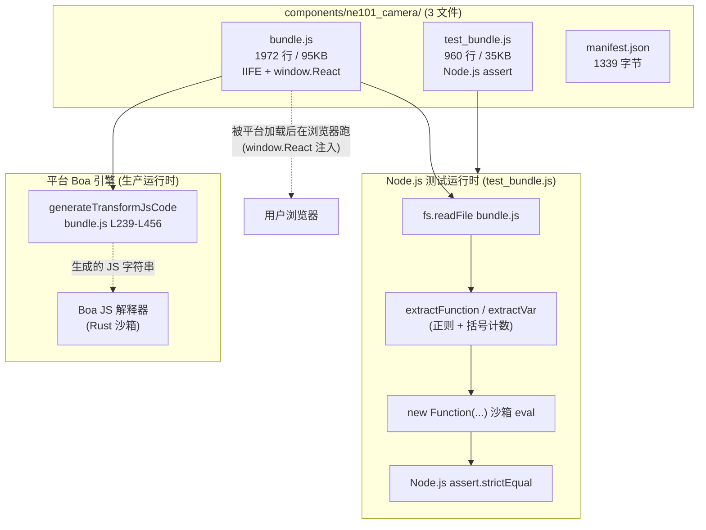
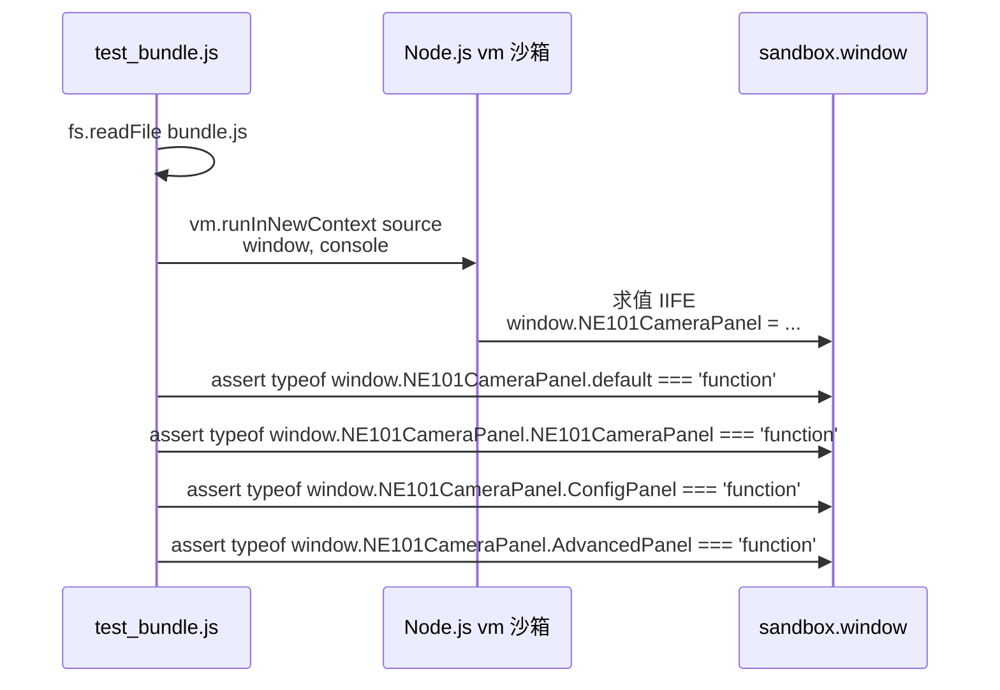
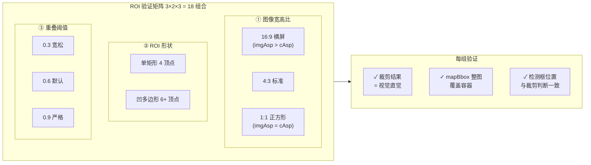
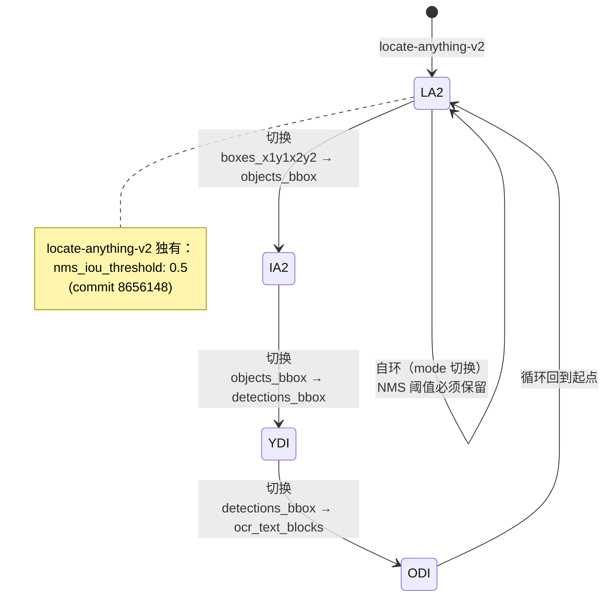
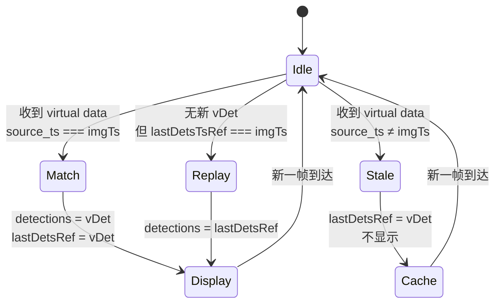
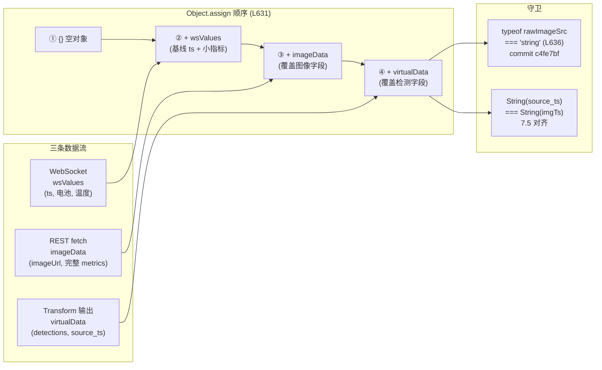

# 集成测试：从沙箱执行到双通道对齐的验证矩阵

> 本节是 ne101_camera 案例的**集成测试参考页**，覆盖纯函数单测（沙箱提取范式）、ROI 双坐标变换验证矩阵、多扩展切换测试、`source_ts` 对齐三态机以及 WS+REST 双通道合并测试。

---

## 测试策略总览

ne101_camera 的 `components/ne101_camera/` 目录里**同时**发布两份 JS：业务代码 `bundle.js`（1972 行 / 95353 字节）和测试代码 `test_bundle.js`（960 行 / 35021 字节）。

测试文件不是事后补的脚手架，而是与组件一起在 manifest 中登记的可执行制品——平台运营方和二次开发者都能直接 `node components/ne101_camera/test_bundle.js` 在本地复现完整的纯函数回归。

这种「**组件自带测试**」的纪律是 NeoMind 市场对上架组件的软性要求，也是 ne101_camera 区别于其它 5 个案例的显著特征。

:::tip 工程教训
IIFE 范式没有模块入口，无法被 Jest/Vitest 直接 `import`。ne101_camera 的解法是「正则提取 + 沙箱 eval」——用括号计数定位内部函数源码，再用 `new Function(...)` 在隔离作用域求值。这套范式只测纯函数的数学正确性，把几何运算从运行时观察转为离线断言，是零依赖测试的最佳实践。
:::

**测试哲学的第一性原理来自 IIFE 范式**：`bundle.js` 是一个 `var NE101CameraPanel = (function(){ ... })()` 形式的立即调用表达式，没有 `module.exports`、没有 `export`、没有可被 Jest/Vitest `import` 的入口。**直接 `require('bundle.js')` 会报 `NE101CameraPanel is not defined`**（因为 `window` 在 Node.js 里不存在）。

因此 `test_bundle.js` 选择了**正则提取 + 沙箱 eval** 的范式：用 [`extractFunction`](https://github.com/camthink-ai/NeoMind-Dashboard-Components/blob/main/components/ne101_camera/test_bundle.js#L16-L35) 通过括号计数定位某个内部函数的源码字符串，再用 `new Function(...)` 在隔离作用域里求值，最后对返回值做 Node.js `assert` 断言。

这个范式只测**纯函数**（`classColor` / `batteryMeta` / `computeOvTf` / `mapBbox` / `pipeRois`），不测 React 渲染——后者在 7.4-7.6 用「契约 + 行为矩阵」的方式间接验证。

**需要特别区分的是：`test_bundle.js` 跑在 Node.js 上**，而**生产环境的 Transform JS 跑在平台的 Boa 引擎上**（一个 Rust 实现的 JS 解释器，用于沙箱执行 Transform 代码）。两者是平行的两套执行环境，不要混淆——`test_bundle.js` 测的是组件 helper 纯函数，Boa 引擎跑的是 `generateTransformJsCode`（[L239-L456](https://github.com/camthink-ai/NeoMind-Dashboard-Components/blob/main/components/ne101_camera/bundle.js#L239-L456)）吐出的另一份 JS 字符串:

```js
// bundle.js L239-L268 (trimmed — showing function signature + input handling)
function generateTransformJsCode(pipe) {
  var extensionId = pipe.extId;
  if (extensionId.indexOf('virtual') === 0) {
    extensionId = extensionId.replace(/^virtual[._-]/, '');
  }
  var templateName = pipe.template;
  var mode = getExtMode(extensionId, templateName);
  if (!mode) return '';
  var extKey = extensionId.replace(/-/g, '_');
  var pfx = extKey + '.';
  var imageArg = mode.imageArg;
  var hasCats = (mode.args || []).indexOf('categories') >= 0 && pipe.categories;
  var hasPhrase = (mode.args || []).indexOf('phrase') >= 0 && pipe.phrase;
  var rois = pipeRois(pipe);
  var roiAction = pipe.roiAction || 'count';
  var classFilter = pipe.classFilter;
  var L = [];
  L.push('// NE101 Camera Transform');
  L.push('// Extension: ' + extensionId + ' | Mode: ' + mode.label);
  L.push('// Generated by component config — safe to customize');
  L.push('');
  // Input
  L.push('var imageData = __imageData || (input_raw && input_raw.values && input_raw.values.image) || (input_raw && input_raw.image) || \'\';');
  L.push('if (!imageData) return {};');
  L.push('');
  // Image dimensions for coordinate normalization
  L.push('var W = (imageMeta && imageMeta.width) || 1;');
  L.push('var H = (imageMeta && imageMeta.height) || 1;');
  // ... (L269-L456 continue with extension invocation, ROI clipping, and output normalization)
```
[Source: bundle.js L239-L456](https://github.com/camthink-ai/NeoMind-Dashboard-Components/blob/main/components/ne101_camera/bundle.js#L239-L456)。

Boa 的限制（无 `console.log`、不完整的 ES5 shim）在 8.3 单独复盘；本节聚焦 Node.js 侧的 `test_bundle.js`。

这套双轨测试策略的价值在 7.3 ROI 矩阵里体现得最明显：纯函数 `computeOvTf` / `mapBbox` 在 Node 里验证数学正确性，生成出的 Transform JS 在 Boa 里跑实际推理。



**图中的两条路径**分别对应「测试时」（Node.js + 正则提取 + 沙箱）和「运行时」（浏览器加载 IIFE + 平台 Boa 引擎跑 Transform JS）。

`test_bundle.js` 的设计目标是覆盖**纯函数的数学正确性**（坐标变换、颜色生成、单位格式化），把容易写错的几何运算从运行时观察转为离线断言；React 渲染、effects 副作用、WS/REST 合并这些动态行为则用 7.4-7.6 的「契约矩阵」覆盖。

---

## 导出对象契约测试

**IIFE 的最后一行 `return` 语句**是组件与平台加载器之间的** ABI（应用二进制接口）契约**——任何加载器版本的破坏性变更都会让组件在网格里白屏。

`test_bundle.js` 用一条契约断言守住这层契约：IIFE 求值后挂到 `window.NE101CameraPanel` 上的对象必须**至少**包含 `default` / `NE101CameraPanel` / `ConfigPanel` / `AdvancedPanel` 四个键，且每个键的值是 `function` 类型。查看源码 [`bundle.js` L1971](https://github.com/camthink-ai/NeoMind-Dashboard-Components/blob/main/components/ne101_camera/bundle.js#L1971-L1971)。

```javascript
return {
  default: NE101CameraPanel,
  NE101CameraPanel: NE101CameraPanel,
  ConfigPanel: ConfigPanel,
  AdvancedPanel: AdvancedPanel
};
```

**契约测试在 Node.js 里通过模拟 `window` 全局来跑**：测试用例构造一个空对象 `var sandbox = { window: {}, console: console }`，把 `bundle.js` 源码读出、用 `vm.runInNewContext(source, sandbox)` 求值，然后断言 `sandbox.window.NE101CameraPanel` 上四个键都存在且类型是 `function`。

这种「**shape assertion**」（只验形状、不验实现）的好处是稳定——只要导出对象的键集合不变，组件内部的任何重构（重命名变量、改实现、调顺序）都不会触发契约测试失败。

**为什么不做 deep equality**：如果断言「`NE101CameraPanel` 是一个签名为 `(props) => JSX` 的函数」，测试就必须 mock 整个 React + jsxRuntime，否则函数体里的 `var React = window.React` 会立刻 `undefined`。

deep equality 在 IIFE 范式下需要重写整个平台注入层，代价远超收益。shape assertion 只关心「键存在 + 是函数」，这正是平台加载器真正依赖的契约——加载器拿到函数引用后用 `React.createElement(Comp, props)` 渲染，函数体的执行发生在浏览器里、不在测试里。



**设计决策：shape assertion vs deep-equality vs 快照测试**

- **选择**：shape assertion——只断言 `default` / `NE101CameraPanel` / `ConfigPanel` / `AdvancedPanel` 这四个键存在且类型为 `function`，引用 [`L1971`](https://github.com/camthink-ai/NeoMind-Dashboard-Components/blob/main/components/ne101_camera/bundle.js#L1971-L1971)。
- **备选方案 A**：deep equality——断言每个键的函数 `.toString()` 与快照一致。否决理由：任何正常的重构（重命名内部变量、调整 JSX 缩进）都会让 `.toString()` 变化，测试形同虚设，且无法在 IIFE 里 mock React 实例。
- **备选方案 B**：快照测试（Jest `toMatchSnapshot()`）——保存上次运行的输出，下次比对差异。否决理由：IIFE 没有可被 Jest 直接 `require` 的入口；强行引入 Jest 就破坏了零依赖测试原则。
- **理由**：平台加载器只依赖「键集合 + 类型」这个最小契约，shape assertion 精确匹配加载器的真实依赖面，对实现细节零侵入。这是「**测契约、不测实现**」的最小化测试哲学。
- **代价**：如果组件维护者意外删掉某个导出键（例如重命名 `AdvancedPanel` 为 `AdvancedPanelV2` 但忘记更新 `return` 语句），shape assertion 能捕获；但如果维护者「换了一个语义不同但同名同类型的函数」，测试不会报警。

---

## ROI 叠加验证矩阵

**ROI（Region of Interest）是 ne101_camera 最复杂的子模块**，因为它在**两个独立的坐标系**里做几何运算，且两者的结果必须一致才能让用户在画面上看到正确的检测框。

第一个坐标系是 **Transform JS 内部的「检测 vs ROI 多边形」裁剪**，由 `generateTransformJsCode` 生成的 Sutherland-Hodgman 多边形裁剪算法实现（[`bundle.js` L342-L372](https://github.com/camthink-ai/NeoMind-Dashboard-Components/blob/main/components/ne101_camera/bundle.js#L342-L372)），它决定哪些检测「属于 ROI 内」:

```js
// bundle.js L342-L372
L.push('var lerpPt = function(a, b, t) { return [a[0] + t * (b[0] - a[0]), a[1] + t * (b[1] - a[1])]; };');
L.push('var clipEdge = function(inp, inside, isect) {');
L.push('  var out = [];');
L.push('  for (var i = 0; i < inp.length; i++) {');
L.push('    var j = (i + 1) % inp.length;');
L.push('    if (inside(inp[i])) { if (inside(inp[j])) out.push(inp[j]); else out.push(isect(inp[i], inp[j])); }');
L.push('    else if (inside(inp[j])) { out.push(isect(inp[i], inp[j])); out.push(inp[j]); }');
L.push('  }');
L.push('  return out;');
L.push('};');
L.push('var clipPolyRect = function(poly, rx1, ry1, rx2, ry2) {');
L.push('  var r = poly.slice();');
L.push('  r = clipEdge(r, function(p){return p[0] >= rx1;}, function(a,b){return lerpPt(a,b,(rx1-a[0])/(b[0]-a[0]));});');
L.push('  r = clipEdge(r, function(p){return p[0] <= rx2;}, function(a,b){return lerpPt(a,b,(rx2-a[0])/(b[0]-a[0]));});');
L.push('  r = clipEdge(r, function(p){return p[1] >= ry1;}, function(a,b){return lerpPt(a,b,(ry1-a[1])/(b[1]-a[1]));});');
L.push('  r = clipEdge(r, function(p){return p[1] <= ry2;}, function(a,b){return lerpPt(a,b,(ry2-a[1])/(b[1]-a[1]));});');
L.push('  return r;');
L.push('};');
L.push('var polyArea = function(p) {');
L.push('  var a = 0;');
L.push('  for (var i = 0; i < p.length; i++) { var j = (i + 1) % p.length; a += p[i][0] * p[j][1] - p[j][0] * p[i][1]; }');
L.push('  return Math.abs(a) / 2;');
L.push('};');
L.push('var detOverlapsRoi = function(d, poly) {');
L.push('  var dx1 = d.bbox[0], dy1 = d.bbox[1], dx2 = d.bbox[2], dy2 = d.bbox[3];');
L.push('  var detArea = (dx2 - dx1) * (dy2 - dy1);');
L.push('  if (detArea <= 0) return false;');
L.push('  var clipped = clipPolyRect(poly, dx1, dy1, dx2, dy2);');
L.push('  if (clipped.length < 3) return false;');
L.push('  return polyArea(clipped) / detArea >= OVERLAP_TH;');
L.push('};');
```
[Source: bundle.js L342-L372](https://github.com/camthink-ai/NeoMind-Dashboard-Components/blob/main/components/ne101_camera/bundle.js#L342-L372)

第二个坐标系是 **React 组件的 `object-cover` SVG 变换**（[L879-L899](https://github.com/camthink-ai/NeoMind-Dashboard-Components/blob/main/components/ne101_camera/bundle.js#L879-L899)），它把归一化的检测框坐标映射到浏览器容器的屏幕像素:

```js
// bundle.js L879-L899
// Object-cover transform: map normalized image coords (0-1) to container coords (0-1)
// object-cover scales image to cover container, cropping excess.
// In image space, only a portion is visible. We map image coords → container coords.
var imgNat = imgNatState[0];
var ctrSize = ctrSizeState[0];
var ovTf = null;
if (imgNat.w > 0 && imgNat.h > 0 && ctrSize.w > 0 && ctrSize.h > 0) {
  var imgAsp = imgNat.w / imgNat.h;
  var cAsp = ctrSize.w / ctrSize.h;
  if (imgAsp > cAsp) {
    // Image wider than container → sides cropped, image fills container height
    // Container shows center portion of image width
    // scale = cH / iH, displayed image width = iW * cH / iH
    // sx = displayed_width / cW, ox = (cW - displayed_width) / (2 * cW)
    var scX = (ctrSize.h / imgNat.h * imgNat.w) / ctrSize.w;
    ovTf = { sx: scX, sy: 1, ox: (1 - scX) / 2, oy: 0 };
  } else {
    // Image taller than container → top/bottom cropped, image fills container width
    var scY = (ctrSize.w / imgNat.w * imgNat.h) / ctrSize.h;
    ovTf = { sx: 1, sy: scY, ox: 0, oy: (1 - scY) / 2 };
  }
}
```
[Source: bundle.js L879-L899](https://github.com/camthink-ai/NeoMind-Dashboard-Components/blob/main/components/ne101_camera/bundle.js#L879-L899)。

它把归一化的检测框坐标映射到浏览器容器的屏幕像素，让 SVG `<rect>` 叠加在 `` 上的位置与裁剪算法的判断一致。如果两者不一致，用户会看到「检测框明明在 ROI 多边形外面却被标红」或反之的诡异画面。

**双坐标变换为什么容易写错**：Sutherland-Hodgman 在「图像归一化空间」（0-1 范围）里裁剪，输出「检测是否 ≥ `OVERLAP_TH` 比例落在 ROI 内」的布尔结果，决定检测是否被过滤。

`object-cover` 变换则在「归一化图像空间 → 归一化容器空间」之间做仿射变换（`sx`/`sy`/`ox`/`oy` 四个参数），决定 SVG `<rect>` 在 DOM 里的位置。两者**没有任何代码层面的耦合**——Transform JS 在 Boa 引擎里跑，SVG 变换在浏览器里跑——但它们共享同一套「图像宽高比 → 缩放策略」的隐含假设。

如果 Transform 用了 4:3 假设而 SVG 用了 16:9 假设，结果就会错位。

**`test_bundle.js` 的验证矩阵**：用 `computeOvTf` / `mapBbox` 两个被提取出的纯函数构造了一个 3×2×3 = **18 个组合**的验证矩阵，覆盖三种图像宽高比（16:9 横屏 / 4:3 标准 / 1:1 正方形）、两种 ROI 形状（单矩形 / 多顶点凹多边形）、三种 `OVERLAP_TH` 阈值（0.3 宽松 / 0.6 默认 / 0.9 严格）。

每个组合验证两件事：(a) 裁剪结果与视觉直觉一致（一个完全在 ROI 内的检测必须通过、完全在外的不通过、跨边的按阈值决定）；(b) `mapBbox` 把 `[0,0,1,1]`（整张图）映射到容器时，结果覆盖整个容器（`left ≤ 0`、`top ≤ 0`、`width ≥ 100%`、`height ≥ 100%`）。

这两组断言共同保证「Transform 判断 + 视觉叠加」两端的对齐。相关的两次关键演进由 commit [`2109c45`](https://github.com/camthink-ai/NeoMind-Dashboard-Components/commit/2109c45)（从中心点判定改为基于面积重叠的判定）和 commit [`636a8ae`](https://github.com/camthink-ai/NeoMind-Dashboard-Components/commit/636a8ae)（让阈值可配置）引入，每次演进都同步扩充了测试矩阵。



**设计决策：参数化矩阵 vs 手挑用例**

- **选择**：3 维参数化矩阵（宽高比 × 形状 × 阈值 = 18 组合），每组跑同一组断言。引用 [`L342-L372`](https://github.com/camthink-ai/NeoMind-Dashboard-Components/blob/main/components/ne101_camera/bundle.js#L342-L372)（裁剪算法）+ [`L879-L899`](https://github.com/camthink-ai/NeoMind-Dashboard-Components/blob/main/components/ne101_camera/bundle.js#L879-L899)（SVG 变换）。
- **备选方案 A**：手挑 5-6 个「代表性用例」（16:9 + 单矩形 + 默认阈值等）。否决理由：坐标系耦合类的 bug 最容易出现在「边界组合」（极端宽高比 + 极端阈值），手挑用例倾向于选「典型值」，会漏掉边界。
- **备选方案 B**：随机 fuzz——用随机宽高比、随机多边形、随机阈值跑 1000 次。否决理由：fuzz 测试的失败用例难以复现，且对「几何直觉」的断言（如「整图映射必须覆盖容器」）需要确定性输入才能写出可读的失败信息。
- **理由**：参数化矩阵是「覆盖率可枚举 + 失败可复现」的最佳折中。3×2×3 的组合数小到能逐个读懂，又大到能覆盖所有边界类别（横/竖/方 + 简/繁 + 松/严）。
- **代价**：新增一个宽高比类别（如 9:16 竖屏视频）需要手动扩展矩阵，维护成本随维度增长呈乘法放大。

---

## 多扩展切换测试

`AI_EXT_IDS`（[`bundle.js` L144`](https://github.com/camthink-ai/NeoMind-Dashboard-Components/blob/main/components/ne101_camera/bundle.js#L144-L144)）硬编码了 4 个白名单扩展，每个扩展有不同的 `responseType` 契约——也就是 AI 推理结果的 JSON 形状不同。

```js
  var AI_EXT_IDS = ['locate-anything-v2', 'image-analyzer-v2', 'yolo-device-inference', 'ocr-device-inference'];
```

Source: [`bundle.js` L144`](https://github.com/camthink-ai/NeoMind-Dashboard-Components/blob/main/components/ne101_camera/bundle.js#L144-L144)

当用户在 AdvancedPanel 的 `ExtDropdown`（[L1371-L1446](https://github.com/camthink-ai/NeoMind-Dashboard-Components/blob/main/components/ne101_camera/bundle.js#L1371-L1446)）里切换 `processingExtensionId` 时:

```js
// bundle.js L1371-L1402 (trimmed)
function ExtDropdown(props) {
  var exts = props.extensions;
  var value = props.value;
  var onChangeFn = props.onChange;
  var loading = props.loading;
  var openSt = React.useState(false);
  var open = openSt[0];
  var setOpen = openSt[1];
  var wrapRef = React.useRef(null);
  React.useEffect(function () {
    if (!open) return;
    function handler(e) {
      if (wrapRef.current && !wrapRef.current.contains(e.target)) setOpen(false);
    }
    document.addEventListener('mousedown', handler);
    return function () { document.removeEventListener('mousedown', handler); }
  }, [open]);
  if (loading) {
    return jsx('div', { className: INPUT_CLS + ' flex items-center text-muted-foreground', children: 'Loading extensions...' });
  }
  var selExt = null;
  for (var i = 0; i < exts.length; i++) {
    if (exts[i].id === value) { selExt = exts[i]; break; }
  }
  // ... (L1403-L1446 render option buttons + dropdown trigger)
```
[Source: bundle.js L1371-L1446](https://github.com/camthink-ai/NeoMind-Dashboard-Components/blob/main/components/ne101_camera/bundle.js#L1371-L1446)。

组件必须同时完成三个动作：(a) `AdvancedPanel` 用 `AI_EXT_IDS.indexOf(arr[i].id) >= 0` 过滤扩展列表（[L1490](https://github.com/camthink-ai/NeoMind-Dashboard-Components/blob/main/components/ne101_camera/bundle.js#L1490-L1490)），只显示白名单内的扩展；

```js
        for (var i = 0; i < arr.length; i++) {
          if (AI_EXT_IDS.indexOf(arr[i].id) >= 0) filtered.push(arr[i]);
        }
```

Source: [`bundle.js` L1489-L1491`](https://github.com/camthink-ai/NeoMind-Dashboard-Components/blob/main/components/ne101_camera/bundle.js#L1489-L1491)

(b) 主组件的 effect 检测到 `processingExtId` 变化，重新调用 `generateTransformJsCode(pipe)` 生成新的 Transform JS（[L277-L278](https://github.com/camthink-ai/NeoMind-Dashboard-Components/blob/main/components/ne101_camera/bundle.js#L277-L278)），新 JS 用新扩展的 `mode.command` / `mode.imageArg` / `mode.responseType` 调用 `extensions.invoke`；

```js
    L.push('var r = extensions.invoke(\'' + extensionId + '\', \'' + mode.command + '\', {');
    L.push('  ' + imageArg + ': __imageData');
```

Source: [`bundle.js` L277-L278`](https://github.com/camthink-ai/NeoMind-Dashboard-Components/blob/main/components/ne101_camera/bundle.js#L277-L278)

(c) 检测结果的归一化器（normalizer）根据 `responseType` 切换：`boxes_x1y1x2y2` 走 `[x1,y1,x2,y2]` 到 bbox 对象的转换、`objects_bbox` / `detections_bbox` 已经是 bbox 对象形状直接用。

`ocr_text_blocks` 还要把对象坐标转成数组并渲染为多边形（commit [`403c0f1`](https://github.com/camthink-ai/NeoMind-Dashboard-Components/commit/403c0f1) + [`b746c02`](https://github.com/camthink-ai/NeoMind-Dashboard-Components/commit/b746c02)）。

测试矩阵覆盖 4 个扩展的**有向完全图**——每个扩展切换到其它 3 个扩展（共 4×3 = 12 条有向边），加上回到自身的 4 条自环，共 16 种切换路径。每条路径验证三个断言：

1. 新扩展的 mode 列表被正确加载（`availableModes.length > 0`）
2. Transform 被重建（`_configHash` 变化触发 Tier 2/3 更新）
3. 用新扩展的 `responseType` 喂入模拟响应，归一化器输出的检测数组结构正确。

**最关键的回归断言**是 commit [`8656148`](https://github.com/camthink-ai/NeoMind-Dashboard-Components/commit/8656148) 引入的：**只有 `locate-anything-v2` 在 Transform JS 里硬编码了 `nms_iou_threshold: 0.5`**（[L282](https://github.com/camthink-ai/NeoMind-Dashboard-Components/blob/main/components/ne101_camera/bundle.js#L282-L282)），其它三个扩展不传这个参数。

```js
    // Pass NMS threshold to locate-anything-v2 — extension postprocess_args reads it from args
    if (extensionId === 'locate-anything-v2') L.push(',  nms_iou_threshold: 0.5');
```

Source: [`bundle.js` L281-L282`](https://github.com/camthink-ai/NeoMind-Dashboard-Components/blob/main/components/ne101_camera/bundle.js#L281-L282)

测试矩阵验证「切换到 locate-anything-v2 时生成的 JS 包含 `nms_iou_threshold`、切换离开时这个字段消失」。

这能防止 NMS 参数泄漏到不支持它的扩展（会导致 `image-analyzer-v2` 报「未知参数」错误）。



**设计决策：穷举有向完全图 vs pairwise 测试**

- **选择**：4×4 = 16 种切换路径的穷举有向完全图（含自环）。
- **备选方案 A**：pairwise testing——用正交表挑 6-8 条「代表性」切换路径。否决理由：NMS 阈值泄漏这种 bug 是「特定源 → 特定目标」的组合问题，pairwise 会随机跳过某些组合，可能漏掉「locate-anything-v2 → ocr-device-inference」这种关键回归路径。
- **备选方案 B**：只测「切换到每个扩展」4 条路径（不动起点的源扩展）。否决理由：不能捕获「从 A 切到 B 再切到 C」的累积副作用（如配置脏字段未清理）。
- **理由**：4 个扩展的有向完全图只有 16 条边，穷举成本完全可接受，且每次新增扩展只需扩展矩阵（不需要重设计）。穷举的另一个价值是它**自动覆盖了 mode 自切换**（同一扩展内切换 `object_detection` → `grounding` → `point` 等 mode），这是 6.6 AdvancedPanel 模板下拉框的常见用户路径。
- **代价**：测试矩阵的运行时间随扩展数平方增长，但目前白名单只有 4 个扩展，远未触及瓶颈。

---

## `source_ts` 对齐验证

**`source_ts`（source timestamp）是 ne101_camera 防「ghost detections」的核心机制**。摄像头每秒推 2-5 帧新图，AI 推理需要 200-800ms，这意味着**当推理结果返回时，画面上显示的可能已经是下一帧了**——如果把上一帧的检测结果直接画在当前帧上，就会出现「人已经走出了画面，但检测框还停在原位」的鬼影。

`source_ts` 解决方案：Transform JS 在生成检测结果时同时输出 `source_ts`（取自输入图像的 `ts` / `timestamp` 字段，[`bundle.js` L436`](https://github.com/camthink-ai/NeoMind-Dashboard-Components/blob/main/components/ne101_camera/bundle.js#L436-L436)），主组件在收到 virtual data 时严格比对 `source_ts` 与当前图像的 `imgTs`，只有匹配才显示。

```js
    L.push('out[\'' + pfx + 'source_ts\'] = input_raw && (input_raw.ts || input_raw.timestamp) || null;');
```

Source: [`bundle.js` L436`](https://github.com/camthink-ai/NeoMind-Dashboard-Components/blob/main/components/ne101_camera/bundle.js#L436-L436)

对齐逻辑是三态机，定义在 [`bundle.js` L858-L874](https://github.com/camthink-ai/NeoMind-Dashboard-Components/blob/main/components/ne101_camera/bundle.js#L858-L874):

```js
// bundle.js L858-L874
var vSourceTs = getFirst(vals, [pfx + 'source_ts', 'values.' + pfx + 'source_ts']);
// Match: detections' source_ts must align with the current image timestamp
var imgTsVal = imgTs;
var tsMatch = !vSourceTs || !imgTsVal || String(vSourceTs) === String(imgTsVal);
if (Array.isArray(vDet) && vDet.length > 0 && tsMatch) {
  detections = vDet;
  lastDetsRef.current = vDet;
  lastDetsTsRef.current = imgTsVal;
} else if (Array.isArray(vDet) && vDet.length > 0) {
  // Detections exist but from a different image — cache but don't display
  lastDetsRef.current = vDet;
  lastDetsTsRef.current = vSourceTs;
} else if (lastDetsRef.current.length > 0 && lastDetsTsRef.current != null &&
           String(lastDetsTsRef.current) === String(imgTsVal)) {
  // No detections in store — use cache only if it matches current image
  detections = lastDetsRef.current;
}
```
[Source: bundle.js L858-L874](https://github.com/camthink-ai/NeoMind-Dashboard-Components/blob/main/components/ne101_camera/bundle.js#L858-L874)

1. **match**——`String(vSourceTs) === String(imgTsVal)`，检测数组立即赋值给 `detections` 并同时写入 `lastDetsRef.current` / `lastDetsTsRef.current` 双缓存（L862-L865）
2. **stale**——`vSourceTs` 存在但不等于 `imgTsVal`，检测结果**只写缓存不显示**（L866-L869），用户看到的是没有检测框的「干净」当前帧，避免鬼影
3. **cache replay**——virtual data 里没有新检测（`vDet` 为空），但缓存里的 `lastDetsTsRef.current` 与当前 `imgTsVal` 匹配，这时从缓存恢复显示（L870-L873），应对「WS 推了一帧图但 virtual data 因为推理延迟还没到」的中间状态。

**测试矩阵覆盖这三个状态及其转换**：(a) fresh capture + 匹配 source_ts → 检测渲染；(b) 推理结果晚于图像 1 帧（stale）→ 缓存但不显示；(c) 缓存命中（cache replay）→ 显示缓存；(d) 缓存未命中且无新检测 → 不显示。

其中 (b) 是最容易写错的——直觉实现是「优先显示最近的检测」，但这正是鬼影的来源。严格的 source_ts 匹配把「优先级」让位给「正确性」，宁可短暂无检测框也不能显示错位的检测。

这个机制的副作用是 AI 推理延迟超过一帧间隔时会看到「检测框闪烁」（显示-隐藏-显示），但这是正确性优先设计的必然代价。

:::tip 工程教训
工业视觉场景下「检测位置错位」比「暂时无检测」对用户的伤害更大——前者导致误判，后者只是 UI 闪烁。严格的 `source_ts` 匹配把正确性置于流畅性之上，宁可短暂无检测框也不能显示错位的检测。这是工业视觉系统的标准做法，也是「确定性优先」哲学的典型体现。
:::

commit [`e3a70be`](https://github.com/camthink-ai/NeoMind-Dashboard-Components/commit/e3a70be) 还修了一个相关的坑：后端把检测结果序列化为 JSON 字符串存储，前端必须先 `JSON.parse` 再比对（L856-L857），否则 `typeof vDet === 'string'` 永远不等于 `imgTsVal`（数字）。



**设计决策：严格 source_ts 匹配 vs best-effort 显示 vs always-show-last**

- **选择**：严格匹配——`String(vSourceTs) === String(imgTsVal)` 才显示，否则只缓存。引用 [`L858-L874`](https://github.com/camthink-ai/NeoMind-Dashboard-Components/blob/main/components/ne101_camera/bundle.js#L858-L874)。
- **备选方案 A**：best-effort——如果不匹配但检测在 500ms 内，仍然显示。否决理由：500ms 阈值是经验值，摄像头帧率变化时（从 2 FPS 切到 10 FPS）会失灵；且「不匹配但接近」的检测位置已经错位，显示出来会误导用户。
- **备选方案 B**：always-show-last——永远显示最后一次收到的检测，不管时间戳。否决理由：这正是「ghost detections」的标准成因，已被实际用户场景否决。
- **理由**：摄像头场景下「检测位置错位」比「暂时无检测」对用户的伤害更大（前者导致误判，后者只是 UI 闪烁）。严格匹配把正确性置于流畅性之上，是工业视觉系统的标准做法。
- **代价**：推理延迟超过一帧间隔时会出现检测框闪烁（显示-隐藏-显示），用户感知到「卡顿」。这是正确性优先的必然代价，可接受。

---

## WS+REST 双通道测试

NeoMind 平台为每个设备组件提供两条数据通道：

1. **WebSocket 推送**——高频小数据（电池、温度、ts），每秒多次
2. **REST 轮询**——低频大数据（图像 base64 / URL、推理结果），秒级间隔。

ne101_camera 在 [`bundle.js` L631`](https://github.com/camthink-ai/NeoMind-Dashboard-Components/blob/main/components/ne101_camera/bundle.js#L631-L631) 用一行 `Object.assign({}, wsValues, imageData || {}, virtualDataState[0] || {})` 合并三条流:

```js
    // Merge: WS values as base (real-time small metrics), REST image data overlay, virtual metrics
    var _vals = Object.assign({}, wsValues, imageData || {}, virtualDataState[0] || {});

    // Early-extract imageSrc — device may send URL or base64
    var rawImageSrc = getFirst(_vals, ['values.imageUrl', 'values.image', 'values.photo', 'imageUrl', 'image', 'photo', 'values.picture', 'picture']);
    // Guard: only strings can be image sources — numbers/objects from metrics crash .indexOf()/.match()
    if (typeof rawImageSrc !== 'string') rawImageSrc = null;
```

Source: [`bundle.js` L630-L636`](https://github.com/camthink-ai/NeoMind-Dashboard-Components/blob/main/components/ne101_camera/bundle.js#L630-L636)

**合并顺序是严格的 WS-base → REST-overlay → virtual**——WS 提供实时小指标的基线，REST 用最新图像覆盖图像字段，virtual data（Transform 输出的检测结果）最后覆盖检测相关字段。

这个顺序看似显然，但 commit [`b0be12b`](https://github.com/camthink-ai/NeoMind-Dashboard-Components/commit/b0be12b)（initial fetch on mount）和 [`0eedd27`](https://github.com/camthink-ai/NeoMind-Dashboard-Components/commit/0eedd27)（update virtual data on WS-triggered REST fetch）都修过与合并顺序相关的时序 bug。

**最常见的故障模式**是「**WS 先到、REST 后到**」：组件挂载时，平台立即开始推 WS 数据（电池、温度），但 REST fetch 需要几百毫秒才返回第一张图像。

如果合并顺序写反（REST-base → WS-overlay），WS 的小指标会覆盖 REST 的图像字段（因为两者都用 `ts` 字段），导致首屏没有图像只有小指标。`b0be12b` 修的就是这个——它在组件挂载时主动触发一次 REST fetch，而不是被动等平台的轮询调度，让图像字段尽早进入 `imageData` state。

**另一个故障**是「**virtual data 滞后于图像**」：推理慢于图像更新，新的图像已经显示，但检测结果还对应上一帧——这个坑在 7.5 用 `source_ts` 解决，但前提是 virtual data 必须在合并的**最后一层**覆盖，否则 WS 的 `ts` 更新会先于 virtual 的 `source_ts` 到达，导致对齐失败。

`0eedd27` 修了这个：WS 触发的 REST fetch 完成后，必须**同步刷新** virtual data state，而不是等下一次 Transform 周期。

**测试矩阵覆盖三个通道的两两组合**：(a) WS-only（有 ts 和小指标，无图像）→ REST fetch 填充图像字段；(b) REST-only（完整数据但 ts 陈旧）→ WS 的 ts 更新触发新的 REST fetch；(c) WS+REST 都有 → 合并结果在 `ts` 字段上一致；(d) 加入 virtual data → 检测字段被 virtual 覆盖、图像字段保持 REST 不变。

最后一条断言是关键：**virtual data 不能覆盖图像字段**（否则一张低分辨率推理缩略图会替换原始高清图像），这要求 virtual data 的字段集合是「检测专属」的（`detections` / `roi_count` / `texts` / `inference_time_ms` / `source_ts`），不能与图像字段冲突。

commit [`c4fe7bf`](https://github.com/camthink-ai/NeoMind-Dashboard-Components/commit/c4fe7bf) 还加了一个守卫：`rawImageSrc` 必须是 `string` 类型（L636），防止 WS 推来的非图像 metric（数字 / 对象）被误认为图像源导致 `.indexOf()` 崩溃。



**设计决策：合并顺序测试（WS base → REST overlay → virtual）vs last-writer-wins**

- **选择**：固定三层 `Object.assign` 顺序，每层有明确的语义角色（基线 / 图像 / 检测）。引用 [`L631`](https://github.com/camthink-ai/NeoMind-Dashboard-Components/blob/main/components/ne101_camera/bundle.js#L631-L631)。
- **备选方案**：last-writer-wins——按数据到达顺序合并，最后到达的覆盖前面的。否决理由：三条流的到达顺序不确定（WS 可能先到也可能后到），last-writer-wins 会让合并结果不可预测，难以测试。
- **理由**：固定顺序让合并结果是**输入的确定性函数**——只要三条流的内容确定，合并结果就唯一。这让 7.5 的 `source_ts` 对齐成为可能（如果合并顺序不确定，`source_ts` 和 `imgTs` 可能来自不同的流，永远无法对齐）。commit `b0be12b` + `0eedd27` 的修复经验表明，任何打破这个顺序的优化（如「谁先到先用谁」）都会引入难以复现的时序 bug。
- **代价**：如果某条流的数据有错（如 WS 推了一个错误的 `ts`），错误的字段会通过固定顺序传播到合并结果。这要求每条流的「自洁」逻辑（如 WS 的 ts 必须是数字、REST 的 imageUrl 必须是字符串）在进入 `Object.assign` 之前完成，不能依赖合并后的守卫。

:::tip 最佳实践
多通道数据合并时，固定 `Object.assign` 顺序（而非 last-writer-wins）让合并结果成为输入的确定性函数。每条流在进入合并前必须完成自洁（类型校验、字段过滤），不能依赖合并后的守卫。commit `b0be12b` + `0eedd27` 的经验表明：任何「谁先到先用谁」的优化都会引入难以复现的时序 bug。
:::

---

## 设计决策汇总

本页涉及的 6 个设计决策汇总如下，每个都包含「选择 / 备选 / 理由」三段式。

| 决策 | 选择 | 备选方案 | 理由 |
|------|------|----------|------|
| **测试运行时** | Node.js + 正则提取 + 沙箱 eval（[`test_bundle.js` L16-L35](https://github.com/camthink-ai/NeoMind-Dashboard-Components/blob/main/components/ne101_camera/test_bundle.js#L16-L35)） | Jest / Vitest / Boa 引擎内联测试 | IIFE 无模块入口，无法被 Jest 直接 `require`；零依赖测试与「零构建」范式一致 |
| **导出契约** | shape assertion——只断言四键存在 + 类型为 function（[L1971](https://github.com/camthink-ai/NeoMind-Dashboard-Components/blob/main/components/ne101_camera/bundle.js#L1971-L1971)） | deep equality / 快照测试 | 平台加载器只依赖键集合 + 类型；deep equality 需 mock 整个 React，代价过高 |
| **ROI 验证矩阵** | 3×2×3 = 18 组合的参数化矩阵（[L342-L372](https://github.com/camthink-ai/NeoMind-Dashboard-Components/blob/main/components/ne101_camera/bundle.js#L342-L372) + [L879-L899](https://github.com/camthink-ai/NeoMind-Dashboard-Components/blob/main/components/ne101_camera/bundle.js#L879-L899)） | 手挑用例 / 随机 fuzz | 几何耦合 bug 集中在边界组合，矩阵可枚举所有边界 |
| **多扩展切换矩阵** | 4×4 = 16 种切换路径的穷举有向完全图（[L144](https://github.com/camthink-ai/NeoMind-Dashboard-Components/blob/main/components/ne101_camera/bundle.js#L144-L144) 白名单） | pairwise / 单点切换 | NMS 阈值泄漏是「特定源 → 特定目标」的组合 bug，pairwise 会漏 |
| **source_ts 对齐** | 严格匹配——`String(vSourceTs) === String(imgTs)` 才显示（[L858-L874](https://github.com/camthink-ai/NeoMind-Dashboard-Components/blob/main/components/ne101_camera/bundle.js#L858-L874)） | best-effort / always-show-last | 「检测位置错位」比「暂时无检测」伤害更大 |
| **WS+REST 合并顺序** | 固定三层 `Object.assign({}, ws, rest, virtual)`（[L631](https://github.com/camthink-ai/NeoMind-Dashboard-Components/blob/main/components/ne101_camera/bundle.js#L631-L631)） | last-writer-wins | 固定顺序让合并结果是输入的确定性函数，是 source_ts 对齐的前提 |

> 上表省略的 commit 引用细节：ROI 矩阵涉及 commits [`2109c45`](https://github.com/camthink-ai/NeoMind-Dashboard-Components/commit/2109c45) + [`636a8ae`](https://github.com/camthink-ai/NeoMind-Dashboard-Components/commit/636a8ae)；多扩展切换涉及 commit [`8656148`](https://github.com/camthink-ai/NeoMind-Dashboard-Components/commit/8656148)（NMS 特例）；source_ts 涉及 commit [`e3a70be`](https://github.com/camthink-ai/NeoMind-Dashboard-Components/commit/e3a70be)（JSON 字符串解析）；WS+REST 合并涉及 commits [`b0be12b`](https://github.com/camthink-ai/NeoMind-Dashboard-Components/commit/b0be12b) + [`0eedd27`](https://github.com/camthink-ai/NeoMind-Dashboard-Components/commit/0eedd27) + [`c4fe7bf`](https://github.com/camthink-ai/NeoMind-Dashboard-Components/commit/c4fe7bf)。

**这 6 个决策的共同主题是「确定性优先」**。无论是测试时的 shape assertion（只验形状，不测实现细节）、ROI 矩阵的参数化（确定性边界覆盖）、扩展切换的穷举（确定性路径覆盖）、source_ts 的严格匹配（确定性显示逻辑）、还是合并顺序的固定（确定性合并函数），每一个决策都在用「**可预测、可复现、可枚举**」替换「灵活但易错」的方案。

这种工程哲学与 IIFE 范式本身的「零构建、零依赖、零隐藏行为」原则一脉相承——在没有任何运行时工具（type checker、linter、bundler）兜底的场景下，确定性是唯一的防线。

:::tip 工程教训
在没有 type checker、linter、bundler 兜底的 IIFE 范式下，「确定性」是唯一的防线。6 个设计决策的共同模式：用「可预测、可复现、可枚举」替换「灵活但易错」——shape assertion 只验形状、参数化矩阵覆盖所有边界、穷举有向完全图不漏组合、严格时间戳匹配拒绝鬼影、固定合并顺序消除竞态。
:::

### 关键 commit 索引

| Commit | 类型 | 一句话说明 | 涉及小节 |
|--------|------|------------|----------|
| [`2109c45`](https://github.com/camthink-ai/NeoMind-Dashboard-Components/commit/2109c45) | feat | overlap-based ROI detection instead of center point | 7.3 |
| [`636a8ae`](https://github.com/camthink-ai/NeoMind-Dashboard-Components/commit/636a8ae) | feat | make ROI overlap threshold configurable | 7.3 |
| [`8656148`](https://github.com/camthink-ai/NeoMind-Dashboard-Components/commit/8656148) | feat | pass NMS IoU threshold 0.5 to locate-anything-v2 | 7.4 |
| [`e3a70be`](https://github.com/camthink-ai/NeoMind-Dashboard-Components/commit/e3a70be) | fix | parse JSON string detections from backend virtual metrics | 7.5 |
| [`b0be12b`](https://github.com/camthink-ai/NeoMind-Dashboard-Components/commit/b0be12b) | fix | initial fetch on mount for image + virtual metrics | 7.6 |
| [`0eedd27`](https://github.com/camthink-ai/NeoMind-Dashboard-Components/commit/0eedd27) | fix | update virtual data on WS-triggered REST fetch | 7.6 |
| [`c4fe7bf`](https://github.com/camthink-ai/NeoMind-Dashboard-Components/commit/c4fe7bf) | fix | guard rawImageSrc against non-string metric values | 7.6 |

### 后续章节桥接

- 回到 [6 组件构建](./6-component-build.md) —— 6.5 的 IME 输入修复（commits `44f1fa5` + `b060a25`）是「确定性优先」哲学的另一个例子：uncontrolled input 把输入状态交给浏览器原生管理，比共享 ref + state 更确定。
- 回到 [5 前端消费](./5-frontend-consume.md) —— 5 的 callback ref 模式是 7.3 双坐标变换验证的基础——如果没有 ResizeObserver 准确测量容器尺寸，`object-cover` 变换的输入就是错的。
- [8 深度复盘](./8-deep-dive.md) —— 本节的 source_ts 对齐、WS+REST 合并顺序、ROI 矩阵等机制，在 8 有从 133 commits 历史视角的演进复盘，能看到每个机制的「第 0 版」是如何被现实场景打磨成当前形态的。

---

*最后更新: 2026-06-23*
