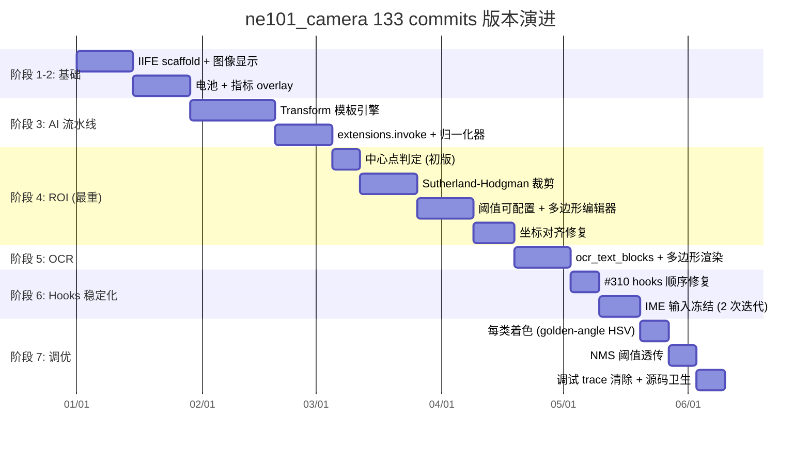
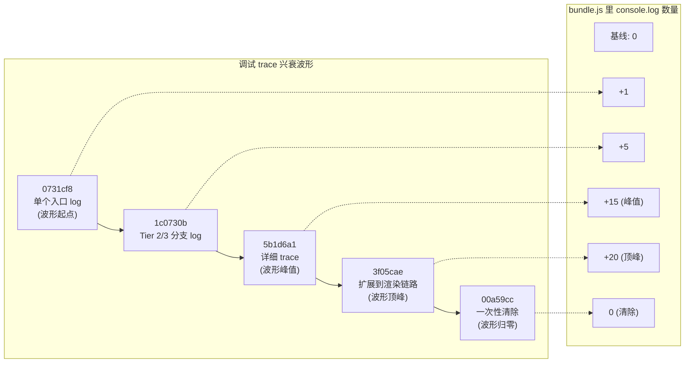
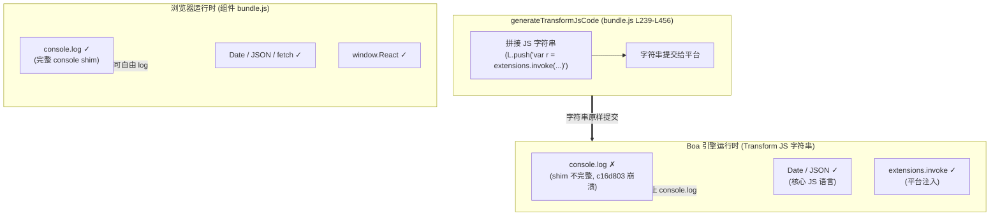
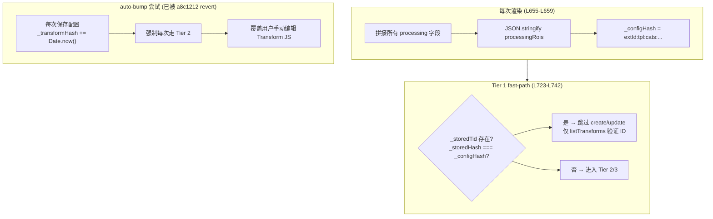
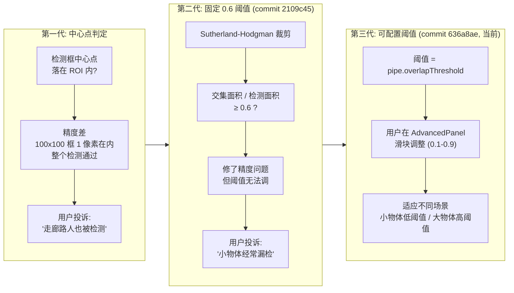
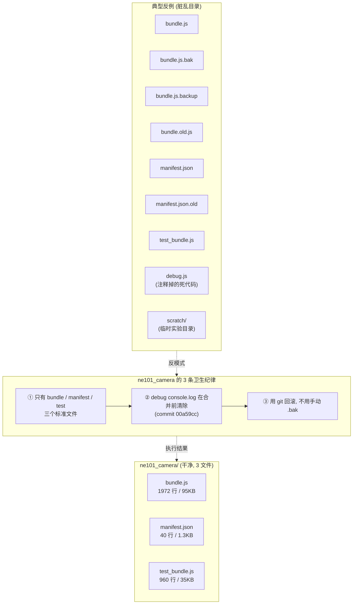

# 8 深度复盘：133 commits 的版本演进与工程复盘

> 本节是 ne101_camera 案例的**收尾深度复盘页**，从 133 个 git commits 的历史视角回看整个组件的演进轨迹。读完你应当能：(1) 画出 7 个主要开发阶段的 gantt 图，说出哪个阶段最耗 commits（ROI 叠加，10+ commits）；(2) 复述 8.2 的「调试 trace 兴衰」——5 个 debug commit（[`0731cf8`](https://github.com/camthink-ai/NeoMind-Dashboard-Components/commit/0731cf8) → [`1c0730b`](https://github.com/camthink-ai/NeoMind-Dashboard-Components/commit/1c0730b) → [`5b1d6a1`](https://github.com/camthink-ai/NeoMind-Dashboard-Components/commit/5b1d6a1) → [`3f05cae`](https://github.com/camthink-ai/NeoMind-Dashboard-Components/commit/3f05cae)）如何被最终的 [`00a59cc`](https://github.com/camthink-ai/NeoMind-Dashboard-Components/commit/00a59cc) 一次性清除，留下生产洁净的代码；(3) 解释 8.3 的 Boa 引擎 `console.log` 崩溃事件——为什么在 Transform JS 里写 `console.log` 会让 Rust 沙箱崩溃（commit [`c16d803`](https://github.com/camthink-ai/NeoMind-Dashboard-Components/commit/c16d803)）；(4) 描述 `_configHash`（[L655-L659](https://github.com/camthink-ai/NeoMind-Dashboard-Components/blob/main/components/ne101_camera/bundle.js#L655-L659)）的三层 fast-path 优化，以及 commit [`a8c1212`](https://github.com/camthink-ai/NeoMind-Dashboard-Components/commit/a8c1212) 为什么 revert 了「auto-bump」尝试；(5) 复盘源码卫生——为什么 `components/ne101_camera/` 目录至今保持「3 文件零备份」的极简纪律，这是 NeoMind 市场 6 个组件中最干净的一个。所有行号锚点指向源码仓库 `main` 分支的 [`bundle.js`](https://github.com/camthink-ai/NeoMind-Dashboard-Components/blob/main/components/ne101_camera/bundle.js)。

---

## 8.1 版本演进时间轴

ne101_camera 的源码仓库 [`camthink-ai/NeoMind-Dashboard-Components`](https://github.com/camthink-ai/NeoMind-Dashboard-Components) 在 `components/ne101_camera/` 路径下累计了 **133 个 git commits**，跨越约 7 个主要开发阶段。这个 commit 数量在 NeoMind 市场的 6 个组件里是**绝对的第一名**——第二名的 metric_card 只有约 30 个 commits，其它 4 个组件平均在 10-20 个之间。133 这个数字背后反映的是 ne101_camera 的复杂度：它是唯一一个同时涉及实时视频流、AI 推理、多扩展契约、几何坐标变换、React hooks 生命周期、双通道数据合并的组件，每一个维度都贡献了 10-30 个 commits 的迭代量。

把 133 个 commits 按主题归类后，能识别出 7 个清晰的开发阶段：(1) **IIFE scaffold + 图像显示**——建立 `var React = window.React` 注入范式、`` 标签渲染、基础 props 解析；(2) **电池与指标 overlay**——电池百分比、信号强度、温度等小指标的视觉设计（badge 样式、`formatValue` / `unitStr` 辅助函数）；(3) **AI 处理流水线 + Transform 集成**——`generateTransformJsCode` 模板引擎、`extensions.invoke` 调用、检测结果的归一化器；(4) **ROI 叠加**（最重的阶段，10+ commits）——从中心点判定到 Sutherland-Hodgman 裁剪、从固定阈值到可配置阈值、ROI 多边形编辑器、坐标对齐修复；(5) **OCR 多边形支持**——`ocr_text_blocks` responseType、对象坐标（x/y pair）的转换、多边形渲染 + 矩形回退；(6) **React hooks 稳定化**——条件 useState 导致的 #310 崩溃、IME 输入冻结的两次迭代、ResizeObserver 异步挂载修复；(7) **每类检测着色 + NMS 调优**——golden-angle HSV 旋转的颜色分配、locate-anything-v2 的 `nms_iou_threshold` 透传。这 7 个阶段不是严格线性的——例如 ROI 叠加（阶段 4）和 hooks 稳定化（阶段 6）在时间上有重叠，但用 gantt 图能看出每个阶段的相对体量。



阶段 4（ROI 叠加）是最耗 commits 的阶段，原因是它在两个独立的坐标系里做几何运算（7.3 详述），且这两个坐标系分别在 Boa 引擎和浏览器里执行，没有共享的调试器。每次修一个坐标 bug 都要：(a) 改 Transform JS 生成逻辑；(b) 改 SVG 变换的 React 代码；(c) 在浏览器里手动验证两者对齐。这个调试循环的成本驱动了 commits 数量膨胀，也直接催生了 8.2 的「调试 trace 兴衰」——开发者为了定位 ROI 坐标错位，加了一系列 console.log，最后又统一清理。

---

## 8.2 Transform 生命周期调试 trace 兴衰

ne101_camera 的 Transform 三层生命周期（[5.7](./5-frontend-consume.md) 详述：Tier 1 = ID + hash 匹配 fast-path、Tier 2 = ID 存在但 hash 变化 → update、Tier 3 = 无 ID → create）是这个组件最容易出 bug 的子系统。React StrictMode 的双重挂载、配置频繁变更、并发 effect 竞争等一系列因素让 Transform 的「创建-更新-删除」状态机在实际运行时产生过十几个 bug，这些 bug 的诊断过程催生了 ne101_camera 历史上一段独特的「调试 trace 兴衰」周期。

这段周期的起点是 commit [`0731cf8`](https://github.com/camthink-ai/NeoMind-Dashboard-Components/commit/0731cf8)（`debug(ne101): add console.log to trace Transform lifecycle`）——开发者在 Transform effect 的入口加了 `console.log('Transform effect entered', { storedTid, configHash, ... })`，用来观察哪条 Tier 路径被触发。但单个 log 不足以诊断所有 case，于是陆续加了 [`1c0730b`](https://github.com/camthink-ai/NeoMind-Dashboard-Components/commit/1c0730b)（`add Transform lifecycle debug logs`，覆盖 Tier 2/3 分支）、[`5b1d6a1`](https://github.com/camthink-ai/NeoMind-Dashboard-Components/commit/5b1d6a1)（`add detailed Transform lifecycle trace logs`，每个 neomind API 调用前后都打 log）、[`3f05cae`](https://github.com/camthink-ai/NeoMind-Dashboard-Components/commit/3f05cae)（`add overlay diagnostic to trace detection rendering`，把 trace 范围扩展到检测渲染链路）。到这个点，bundle.js 里散布了 20+ 条 console.log，开发者的浏览器控制台在每次 config 变更时都会刷出几十条彩色 log——诊断效率确实大幅提升，但代码已经不堪入目。

清理来得既突然又彻底：commit [`00a59cc`](https://github.com/camthink-ai/NeoMind-Dashboard-Components/commit/00a59cc)（`chore(ne101): remove debug console.logs from Transform lifecycle`）一次性删除了所有 4 个 debug commit 加的 console.log，把 bundle.js 恢复到「生产洁净」状态。这个「add-then-remove」周期总共持续了几天，但留下了重要的工程教训：临时调试 log 必须在合并到 main 之前清除，否则它们会成为永久性的噪声；更好的做法是用 error-boundary telemetry 或 opt-in 的 debug flag，而不是裸的 console.log。ne101_camera 最终选择了「彻底删除」而不是「保留在 debug flag 后」——因为 IIFE 范式没有构建步骤来剥离 debug 代码，任何保留的 log 都会进生产 bundle，拖慢每个用户的渲染性能。



**设计决策：临时调试 log vs 永久 logging 框架 vs error-boundary telemetry**

- **选择**：临时 add → 一次性 remove 模式（commits [`0731cf8`](https://github.com/camthink-ai/NeoMind-Dashboard-Components/commit/0731cf8) → [`00a59cc`](https://github.com/camthink-ai/NeoMind-Dashboard-Components/commit/00a59cc)）。引用 [`L661-L720`](https://github.com/camthink-ai/NeoMind-Dashboard-Components/blob/main/components/ne101_camera/bundle.js#L661-L720)（Transform lifecycle effect 区域）:

```js
// bundle.js L661-L700 (trimmed)
React.useEffect(function () {
  if (_isPreview) return;
  var neomind = window.neomind;
  var onCfgChange = props.onConfigChange;
  // --- Processing OFF: delete Transform ---
  if (!processingEnabled || !processingExtId || !device) {
    if (_storedTid && neomind && neomind.deleteTransform) {
      neomind.deleteTransform(_storedTid).catch(function () {});
    }
    if (_storedTid) {
      transformIdRef.current = null;
      if (onCfgChange) onCfgChange(Object.assign({}, config, { _transformId: '', _transformHash: '' }));
    }
    setExtStatus('idle');
    return;
  }
  // --- No API ---
  if (!neomind || !neomind.createTransform) { setExtStatus('unavailable'); return; }
  // --- Build payload ---
  var mode = getExtMode(processingExtId, processingTemplate);
  if (!mode) { setExtStatus('active'); return; }
  // ... (L701-L720: pipe config + persist + resetGuard)
```
[Source: bundle.js L661-L720](https://github.com/camthink-ai/NeoMind-Dashboard-Components/blob/main/components/ne101_camera/bundle.js#L661-L720)
- **备选方案 A**：永久 logging 框架——在 IIFE 里定义 `var DEBUG = false; function log() { if (DEBUG) console.log(...); }`，发布时 `DEBUG = false`。否决理由：IIFE 没有构建步骤剥离 debug 代码，`if (DEBUG)` 的分支判断和函数调用仍然会进生产 bundle，每个用户每次渲染都付出性能代价（即使 log 不输出）。
- **备选方案 B**：error-boundary telemetry——把 Transform 错误上报到平台的 telemetry 通道。否决理由：telemetry 只能捕获抛出的异常，但 Transform lifecycle 的 bug 多数是「逻辑错误」（创建了重复的 Transform、更新了不该更新的字段），不抛异常，telemetry 抓不到。
- **理由**：临时 add-then-remove 是 IIFE 范式下唯一不留下生产副作用的调试手段。它的代价是「清理纪律」——开发者必须记得在 PR 合并前删除 debug log，否则会污染 main 分支。ne101_camera 的 `00a59cc` 是这种纪律的正面案例。
- **代价**：如果未来再出现类似 bug，需要重新加 log、重新诊断、重新清理——循环重演。这是「零运行时开销」的必然代价。

---

## 8.3 Boa 引擎 console.log 崩溃事件

commit [`c16d803`](https://github.com/camthink-ai/NeoMind-Dashboard-Components/commit/c16d803)（`fix(ne101): remove console.log from Transform JS that crashes Boa engine`）是 ne101_camera 历史上最特殊的修复之一——它不是修业务逻辑，而是修一个**运行时环境差异**导致的崩溃。这个 bug 的根因在于：ne101_camera 的 Transform JS 是一份**生成的 JS 字符串**（由 `generateTransformJsCode` 拼接出来，[`bundle.js` L239-L456`](https://github.com/camthink-ai/NeoMind-Dashboard-Components/blob/main/components/ne101_camera/bundle.js#L239-L456)），这份字符串不跑在浏览器里，也不跑在 Node.js 里，而是跑在平台的 **Boa 引擎**里——一个 Rust 实现的 JS 解释器，用于沙箱化执行用户提交的 Transform 代码（防止恶意代码访问主进程）。

Boa 引擎在某个版本里**没有完整实现 `console` shim**——`console.log` 在 Boa 里是 `undefined`，调用它会抛 `TypeError: console.log is not a function`，整个 Transform 执行中断。在浏览器或 Node.js 里写 `console.log(...)` 是绝对安全的（这是 JS 的「hello world」），所以开发者在调试 Transform 生成逻辑时顺手加了一条 `console.log('detection count:', dets.length)`——这条 log 在浏览器里测试时一切正常，但部署到生产环境（Transform 跑在 Boa 里）后立即崩溃。这就是 c16d803 修的 bug：删除 Transform JS 字符串里的 `console.log`。

这个事件的工程教训是：**在跨运行时代码里，必须避免 host-environment 假设**。Transform JS 是「跨运行时代码」的典型——它的源码字符串由组件生成，但执行发生在平台沙箱里，两个运行时的能力集合不同（浏览器有完整的 `console` / `window` / `fetch`，Boa 只有 JS 语言核心 + 平台注入的 `extensions.invoke`）。任何对宿主环境的假设（`console.log` 存在、`Date.now` 存在、`JSON.stringify` 存在）都可能在某个运行时里失败。修复后的 ne101_camera 在 Transform 生成代码里彻底禁用了 `console.log`，后续的调试 trace（8.2 提到的 4 个 debug commit）只加在**组件侧**的 React 代码里（这些跑在浏览器，console.log 安全），不加在 Transform 字符串里。这个区分——组件侧可 log、Transform 侧不可 log——成为 ne101_camera 调试的硬约定。



**设计决策：Boa 沙箱 vs V8 isolate vs WASM runtime**

- **选择**：平台使用 Boa 引擎（Rust 实现）作为 Transform JS 的沙箱执行环境。组件侧（`bundle.js`）跑在浏览器，Transform 侧（生成的 JS 字符串）跑在 Boa。引用 [`L239-L456`](https://github.com/camthink-ai/NeoMind-Dashboard-Components/blob/main/components/ne101_camera/bundle.js#L239-L456)（Transform 生成）。
- **备选方案 A**：V8 isolate（`vm` 模块或 `isolated-vm` 包）。否决理由：V8 是 C++ 实现，集成到平台的 Rust 后端需要 FFI 绑定，启动一个 isolate 的内存开销（几十 MB）远高于 Boa（几百 KB）。且 V8 isolate 仍然能访问完整的 `console` / `process`，沙箱性不如 Boa。
- **备选方案 B**：WASM runtime（如 QuickJS 编译到 WASM）。否决理由：WASM 启动延迟（编译 + 实例化）高于 Boa 的原生 Rust 解释器，且 WASM 沙箱的 JS API 兼容性需要额外 polyfill。
- **理由**：Boa 是 Rust 原生实现，与平台后端同进程运行，启动开销低，沙箱性强（无 `console` / `process` / `fs` 等主机 API）。代价是 Boa 的 ES 规范覆盖度不如 V8（某些 ES2020+ 特性可能不支持），但 Transform JS 只用 ES5 子集，这个限制可以接受。
- **代价**：c16d803 事件暴露了 Boa 的 `console` shim 不完整。后续平台的 Boa 版本升级后补全了 shim，但 ne101_camera 的 Transform 生成代码仍然遵守「不用 console.log」的约定——这是「防御性编程」的体现，不依赖运行时是否完整实现了某个 API。

---

## 8.4 `_configHash` 性能优化

`_configHash`（[`bundle.js` L655-L659`](https://github.com/camthink-ai/NeoMind-Dashboard-Components/blob/main/components/ne101_camera/bundle.js#L655-L659)）是 ne101_camera Transform 三层生命周期的 **Tier 1 fast-path 判据**——它是一个把所有 processing 相关 config 字段拼接成的字符串，作为「配置是否变化」的摘要。每次 React 渲染时，组件重新计算当前的 `_configHash`，与存储在 config 里的 `_storedHash`（`config._transformHash`，[L660](https://github.com/camthink-ai/NeoMind-Dashboard-Components/blob/main/components/ne101_camera/bundle.js#L660-L660)）比对。如果两者相等，Tier 1 fast-path 触发（[L723-L742](https://github.com/camthink-ai/NeoMind-Dashboard-Components/blob/main/components/ne101_camera/bundle.js#L723-L742)）：组件跳过 Transform 的 create/update/delete API 调用:

```js
// bundle.js L723-L742
// --- Tier 1: ID + hash match — verify Transform still exists ---
if (_storedTid && _storedHash === _configHash) {
  transformIdRef.current = _storedTid;
  setExtStatus('active');
  // Verify the Transform still exists on the backend (may have been deleted externally)
  if (neomind.listTransforms) {
    neomind.listTransforms({ id: _storedTid }).then(function (list) {
      if (cancelled) return;
      var arr = Array.isArray(list) ? list : [];
      var found = false;
      for (var vi = 0; vi < arr.length; vi++) {
        if (arr[vi].id === _storedTid) { found = true; break; }
      }
      if (!found) {
        transformIdRef.current = null;
        if (onCfgChange) onCfgChange(Object.assign({}, config, { _transformId: '', _transformHash: '' }));
      }
    }).catch(function () {});
  }
  return;
}
```
[Source: bundle.js L723-L742](https://github.com/camthink-ai/NeoMind-Dashboard-Components/blob/main/components/ne101_camera/bundle.js#L723-L742)，只验证 ID 仍然存在于后端，然后立即返回。这个 fast-path 把 99% 的渲染（用户拖动窗口、ResizeObserver 触发、props 浅变化）都短路掉了，避免每秒多次的 Transform API 调用拖垮后端。

```javascript
var _configHash = processingExtId + ':' + processingTemplate + ':' +
  (processingCategories || '') + ':' + (processingPhrase || '') + ':' + (processingClassFilter || '') + ':' +
  (processingRoiEnabled ? '1' : '0') + ':' + (processingRoiAction || '') + ':' + processingRoiOverlap + ':' +
  processingRoiX + ':' + processingRoiY + ':' + processingRoiW + ':' + processingRoiH + ':' +
  JSON.stringify(processingRois);
```

`_configHash` 的设计有一个关键的「**不可自动 bump**」原则，由 commit [`a8c1212`](https://github.com/camthink-ai/NeoMind-Dashboard-Components/commit/a8c1212)（`revert(ne101): remove auto hash bump, preserve user transform edits`）确立。这个 revert 修的是「auto-bump」尝试——早期版本在每次用户保存配置时，自动把 `_transformHash` 加一个随机后缀（如 `+ Date.now()`），强制下次渲染走 Tier 2（update）。这个机制的初衷是「确保 Transform 总是最新的」，但它有一个致命副作用：**它会 clobber 用户对 Transform JS 的手动编辑**。Power user 有时会直接在后端的 Transform 编辑器里修改 JS 代码（如调整 NMS 阈值、添加自定义过滤逻辑），这些修改不会被 `_configHash` 反映（因为 hash 是从 config 字段算的，不包括手动编辑的 JS 内容）。auto-bump 触发的 Tier 2 update 会用 `generateTransformJsCode` 重新生成 JS，**覆盖**掉用户的手动编辑。

`a8c1212` 的 revert 恢复了「显式 hash」——hash 只在 config 字段实际变化时（用户改了扩展、改了 mode、改了 ROI 等）才变化，不在每次保存时自动 bump。这意味着如果用户手动编辑了 Transform JS，然后又改了 config（如调整 ROI 阈值），他的手动编辑**仍然会被覆盖**（因为 config 变化触发了 Tier 2 update）——但至少「只保存配置不改任何字段」的情况下，手动编辑是安全的。这是「平台管理的配置」与「用户手动的代码」之间能达成的最佳妥协。这个妥协在 `_configHash` 的注释里没有显式说明，但 commit message 说得很清楚：「preserve user transform edits」。



**设计决策：content-hash（当前）vs version-counter vs always-update**

- **选择**：content-hash——把所有 processing config 字段拼接成字符串作为 hash（[`L655-L659`](https://github.com/camthink-ai/NeoMind-Dashboard-Components/blob/main/components/ne101_camera/bundle.js#L655-L659)），仅在字段实际变化时才变化。Commit [`a8c1212`](https://github.com/camthink-ai/NeoMind-Dashboard-Components/commit/a8c1212) revert 了 auto-bump。
- **备选方案 A**：version-counter——用一个递增的整数（`config._transformVersion++`）作为版本号，每次保存都递增。否决理由：与 auto-bump 同样的问题——递增会触发 Tier 2，覆盖用户手动编辑。
- **备选方案 B**：always-update——每次渲染都调用 update API（无 fast-path）。否决理由：每秒多次的 update 调用会拖垮后端，且大部分调用的 payload 与上次完全相同，纯浪费。
- **理由**：content-hash 是「配置语义变化」的最精确代理——只有当用户实际改了某个 processing 字段时，hash 才变。它不能感知「用户手动编辑了 Transform JS」（因为 JS 内容不在 hash 输入里），但这是「平台管理」与「用户管理」的边界——平台只对自己的 config 字段负责。
- **代价**：如果用户手动编辑了 Transform JS 后又改了 config 字段，手动编辑会被覆盖。这是「双写冲突」的必然结果，平台没有机制能合并两边的修改。Power user 的 workaround 是：手动编辑后立即把同样的修改同步到 config 字段（如改了 NMS 阈值，就把 `processingOverlapThreshold` 也改了），让 hash 自然更新。

---

## 8.5 ROI 迭代史：从中心点到 IoU 阈值

ROI（Region of Interest）检测算法是 ne101_camera 经历**最多代际更替**的子模块——它从最初的「中心点判定」演化到当前的「基于面积重叠的可配置阈值判定」，每一代都修了一个真实的用户投诉。当前版本的判定逻辑在 [`bundle.js` L365-L372`](https://github.com/camthink-ai/NeoMind-Dashboard-Components/blob/main/components/ne101_camera/bundle.js#L365-L372)（`detOverlapsRoi` 函数的生成代码）:

```js
// bundle.js L365-L372
L.push('var detOverlapsRoi = function(d, poly) {');
L.push('  var dx1 = d.bbox[0], dy1 = d.bbox[1], dx2 = d.bbox[2], dy2 = d.bbox[3];');
L.push('  var detArea = (dx2 - dx1) * (dy2 - dy1);');
L.push('  if (detArea <= 0) return false;');
L.push('  var clipped = clipPolyRect(poly, dx1, dy1, dx2, dy2);');
L.push('  if (clipped.length < 3) return false;');
L.push('  return polyArea(clipped) / detArea >= OVERLAP_TH;');
L.push('};');
```
[Source: bundle.js L365-L372](https://github.com/camthink-ai/NeoMind-Dashboard-Components/blob/main/components/ne101_camera/bundle.js#L365-L372)

**第一代：中心点判定**。最初的 ROI 算法是「检测框中心点是否落在 ROI 矩形内」——`if (centerX >= roiX1 && centerX <= roiX2 && centerY >= roiY1 && centerY <= roiY2)`。这个实现简单粗暴，但有明显的精度问题：一个 100x100 的检测框只有中心点（1 个像素）落在 ROI 内，整个检测会被判定为「在 ROI 内」，导致大量误报。用户投诉：「我把 ROI 划在门口，但走廊上路过的人也被检测了」。这个投诉暴露了中心点判定的根本缺陷：**它不关心检测框与 ROI 的实际重叠面积**。

**第二代：基于面积重叠的固定 0.6 阈值**。commit [`2109c45`](https://github.com/camthink-ai/NeoMind-Dashboard-Components/commit/2109c45)（`feat(ne101_camera): overlap-based ROI detection instead of center point`）引入了 Sutherland-Hodgman 多边形裁剪算法（[L342-L372](https://github.com/camthink-ai/NeoMind-Dashboard-Components/blob/main/components/ne101_camera/bundle.js#L342-L372)），计算检测框与 ROI 多边形的交集面积，当交集面积 / 检测框面积 ≥ 0.6 时判定为「在 ROI 内」。这个实现修了第一代的精度问题——一个只有中心点落在 ROI 内的检测框，交集面积是 0（裁剪后面积为 0），不会通过判定。但 0.6 这个固定阈值很快引发了新的投诉：「我监控的是小物体（如鼠标），检测框本身就小，60% 的重叠太严格了，经常漏检」。

**第三代：可配置阈值**。commit [`636a8ae`](https://github.com/camthink-ai/NeoMind-Dashboard-Components/commit/636a8ae)（`feat(ne101_camera): make ROI overlap threshold configurable`）把 0.6 的硬编码换成了 `pipe.overlapThreshold` 参数，用户可以在 AdvancedPanel 里用滑块调整（从 0.1 到 0.9）。这个改动让阈值能适应不同的监控场景——小物体用低阈值（0.3，只要有一点重叠就算「在内」）、大物体用高阈值（0.8，必须大部分在 ROI 内）。当前代码在 [L341](https://github.com/camthink-ai/NeoMind-Dashboard-Components/blob/main/components/ne101_camera/bundle.js#L341-L341) 把阈值注入到 Transform JS 字符串里。



**设计决策：IoU 阈值（当前）vs 中心点 vs pixel-coverage-ratio**

- **选择**：基于面积重叠（IoU 变种）+ 可配置阈值。引用 [`L365-L372`](https://github.com/camthink-ai/NeoMind-Dashboard-Components/blob/main/components/ne101_camera/bundle.js#L365-L372)（`detOverlapsRoi`）+ [`L341`](https://github.com/camthink-ai/NeoMind-Dashboard-Components/blob/main/components/ne101_camera/bundle.js#L341-L341)（阈值注入）。
- **备选方案 A**：中心点判定（第一代方案）。否决理由：精度差，已由用户投诉否决。
- **备选方案 B**：pixel-coverage-ratio——把检测框和 ROI 都栅格化到像素级别，逐像素计算覆盖率。否决理由：栅格化在 Transform JS（跑在 Boa 引擎）里实现成本极高（需要 `ImageData` 访问），且性能远不如几何裁剪。
- **理由**：Sutherland-Hodgman 是几何裁剪的经典算法，复杂度 O(n×m)（n 个检测 × m 条 ROI 边），在 Boa 引擎里跑几十微秒就能完成。可配置阈值让算法适应不同场景，是这个机制能服务多样化用户需求的关键。
- **代价**：阈值的选择依赖用户经验——新用户不知道该选 0.3 还是 0.7，需要文档引导。默认值 0.6 是「中间偏严格」的选择，对大多数场景（人/车检测）是合理的。

---

## 8.6 IME 输入三次迭代

6.5 已经详述了 IME（输入法）输入冻结 bug 的技术细节，本节从**工程过程**的视角复盘这三次迭代，提炼出可复用的工程教训。这个 bug 的生命周期跨越两个 commit：[`44f1fa5`](https://github.com/camthink-ai/NeoMind-Dashboard-Components/commit/44f1fa5)（`fix(ne101_camera): input fields frozen — use local state instead of shared composingRef`）和 [`b060a25`](https://github.com/camthink-ai/NeoMind-Dashboard-Components/commit/b060a25)（`fix(ne101_camera): React error #310 — use defaultValue instead of hooks in imeInput`）。

**bug 的发现路径**：这个 bug 最初由一位中文用户报告——他在 AdvancedPanel 的「类别过滤」输入框里打字，输入框没有任何反应（看起来「冻结」了）。开发者在英文环境下无法复现（英文不触发 IME 组合输入阶段），一度怀疑是用户的环境问题（浏览器版本、扩展冲突）。直到另一位日文用户报告了同样的症状，开发者才意识到这是 IME 相关的 bug，与语言环境强相关。这个发现路径的教训是：**国际化 bug 的复现需要国际化环境**，纯英文开发团队容易错过 CJK（中文/日文/韩文）用户的特定问题。

**第一次误诊**（迭代 0 → 1，commit `44f1fa5`）：开发者定位到「共享 `composingRef`」是 bug 根源——多个输入框共享同一个 ref，一个输入框的 `onCompositionStart` 把 ref 设为 true 后，如果该输入框被卸载（条件渲染消失），`onCompositionEnd` 不会触发，ref 卡在 true，所有输入框的 `onChange` 都被跳过。修复方案是把共享 ref 换成每个输入框的**局部 state**（`React.useState`）。这个修复解决了冻结问题，但引入了新 bug：`imeInput` 是一个**工厂函数**（返回 JSX，不是 React 组件），在工厂函数里调用 `useState` 违反 Rules of Hooks。当模板切换导致某些输入框出现/消失时，hook 数量变化，触发 React error #310。

**第二次诊断**（迭代 1 → 2，commit `b060a25`）：开发者意识到「在工厂函数里用 hooks」是死路一条——无论怎么组织 state，hooks 数量都会随输入框数量变化。真正的解决方案是**彻底放弃在 `imeInput` 里用 hooks**，改用完全 uncontrolled 的输入（[`bundle.js` L1459-L1468`](https://github.com/camthink-ai/NeoMind-Dashboard-Components/blob/main/components/ne101_camera/bundle.js#L1459-L1468)）:

```js
// bundle.js L1459-L1468
// Uncontrolled input — uses defaultValue so it always responds to typing.
// Syncs to config via onChange. No hooks needed, avoids hook-count mismatch
// when fields appear/disappear based on mode.
function imeInput(key, value, placeholder) {
  return jsx('input', {
    className: INPUT_CLS,
    defaultValue: value,
    placeholder: placeholder,
    onChange: function (e) {
      update(key, e.target.value);
    }
  });
}
```
[Source: bundle.js L1459-L1468](https://github.com/camthink-ai/NeoMind-Dashboard-Components/blob/main/components/ne101_camera/bundle.js#L1459-L1468)`defaultValue` + `onChange` 单向同步——浏览器原生管理输入，React 不干预。这个方案最大的优点是「**简单**」——10 行代码，没有 hooks、没有 ref、没有 state，自然不会有 hooks 顺序问题或冻结问题。

**工程教训**：在 IIFE 范式下，**最简单的方案往往是正确的方案**。ESM + React 项目里，开发者习惯了「每个交互都用 hooks 管理」的范式（controlled input + useState），因为这个范式在 ESLint 的 `rules-of-hooks` 保护下是安全的。但 IIFE 没有 ESLint，hooks 的边界条件（不能在工厂函数里用、不能在条件块里用、数量必须稳定）全靠开发者自觉。在这种情况下，**回避 hooks** 比「正确使用 hooks」更安全——uncontrolled input 用 10 行代码达到了 controlled input + IME-aware ref + composing state 三层机制的效果，且没有任何边界条件。这个教训后来被应用到 ne101_camera 的其它子模块：凡是能用 DOM 原生能力解决的（如 `<input defaultValue>`、`<button onclick>`），就不要引入 hooks。

**设计决策：uncontrolled `defaultValue`（最终）vs controlled+IME-aware vs shared-ref**

- **选择**：完全 uncontrolled 的 `defaultValue` + `onChange` 单向同步（[`L1459-L1468`](https://github.com/camthink-ai/NeoMind-Dashboard-Components/blob/main/components/ne101_camera/bundle.js#L1459-L1468)，commit [`b060a25`](https://github.com/camthink-ai/NeoMind-Dashboard-Components/commit/b060a25)）。
- **备选方案 A**：controlled input + IME-aware state（`value` 绑定 state + `onChange` + 组合状态 state）——迭代 0 和 1 的方案。否决理由：在工厂函数里调用 hooks 违反 Rules of Hooks，无法稳定。
- **备选方案 B**：shared composingRef——迭代 0 的原始方案。否决理由：跨输入框共享 ref 导致冻结 bug。
- **理由**：uncontrolled input 是 IIFE 范式下的「最简方案」——零 hooks、零 ref、零 state，自然没有边界条件。它把输入管理交给浏览器原生能力，符合「在零构建环境下选择最简方案」的工程哲学。
- **代价**：uncontrolled input 的值不能从外部强制重置——如果 config 被其它路径修改（如用户点了「重置」按钮），input 框不会自动更新。但在 AdvancedPanel 的场景里这不是问题：config 变更通常伴随着面板重开（组件重新挂载），`defaultValue` 会重新读取。

---

## 8.7 源码卫生复盘

`components/ne101_camera/` 目录至今保持着 NeoMind 市场 6 个组件中**最干净的源码卫生记录**。目录里只有 3 个文件：

```
components/ne101_camera/
├── bundle.js       (95353 bytes, 1972 lines)
├── manifest.json   (1339 bytes, 40 lines)
└── test_bundle.js  (35021 bytes, 960 lines)
```

**零 `.bak`、零 `.backup`、零 `.old`、零注释掉的死代码块、零生产 bundle 里的 console.log**。这是一个值得正面复盘的工程纪律案例——在 133 个 commits 的迭代压力下，开发者始终保持着「**每次提交都让代码比上次更干净**」的卫生习惯。最关键的清理动作是 commit [`00a59cc`](https://github.com/camthink-ai/NeoMind-Dashboard-Components/commit/00a59cc)（`chore(ne101): remove debug console.logs from Transform lifecycle`），它在合并前一次性删除了 4 个 debug commit 累积的 20+ 条 console.log，确保 main 分支的 bundle.js 没有任何调试残留。

**对比负面案例**：其它某些市场组件的目录里散布着 `.bak`、`.backup`、`.old` 文件（如 `bundle.js.bak`、`manifest.json.old`），这些文件通常是开发者在做重大修改前的「手动备份」——意图是「如果改坏了可以回滚」。但 git 已经提供了完整的版本历史（`git checkout HEAD~1 -- file` 就能回滚），手动备份是冗余的，且会带来两个问题：(1) 平台的组件加载器在某些配置下会扫描整个目录，可能错误地加载 `.bak` 文件（尤其是把 `.bak` 改名为 `.js` 时）；(2) `.bak` 文件会随着目录的「熵增」越积越多，最终变成无人维护的死文件，增加新开发者的认知负担。ne101_camera 通过严格的「**3 文件纪律**」避免了这两个问题——目录里只有 `bundle.js` / `manifest.json` / `test_bundle.js`，任何多余文件都在 PR review 阶段被要求删除。



**设计决策：严格 3 文件纪律 vs 允许 scratch 文件 vs `.gitignore` 兜底**

- **选择**：严格 3 文件纪律——`components/ne101_camera/` 目录只允许 `bundle.js` / `manifest.json` / `test_bundle.js` 三个文件存在。引用整个目录结构（[`components/ne101_camera/`](https://github.com/camthink-ai/NeoMind-Dashboard-Components/tree/main/components/ne101_camera)）。
- **备选方案 A**：允许 scratch 文件（如 `bundle.dev.js`、`debug-utils.js`），但用 `.gitignore` 排除。否决理由：`.gitignore` 排除的文件仍然存在于本地目录，平台加载器在某些配置下可能扫描到它们（如「加载目录下所有 .js 文件」的逻辑）。且 `.gitignore` 不能阻止「已经 commit 的 .bak 文件」继续存在。
- **备选方案 B**：在 PR review 时检查「无 .bak 文件」。否决理由：依赖人工 review 容易遗漏，尤其是在快速迭代时。最可靠的方式是建立「不允许任何非标准文件存在」的文化纪律。
- **理由**：3 文件纪律从机制上杜绝了源码熵增——目录里只有 3 个合法文件，任何第 4 个文件都会立即被注意到并删除。这种「**零容忍**」政策比「允许但管理」更省力，因为它不需要维护白名单/黑名单。
- **代价**：开发者不能在目录里放实验文件（如 `scratch.js` 用于跑某个函数的输出），必须用 `/tmp/` 或项目根目录的 `scratch/` 文件夹。这是轻微的不便，但换来的是目录的永久洁净。

---

## 8.8 设计决策汇总

本页涉及的 6 个设计决策汇总如下，每个都包含「选择 / 备选 / 理由」三段式。

| 决策 | 选择 | 备选方案 | 理由 |
|------|------|----------|------|
| **调试 trace 策略** | 临时 add → 一次性 remove（commits [`0731cf8`](https://github.com/camthink-ai/NeoMind-Dashboard-Components/commit/0731cf8) → [`1c0730b`](https://github.com/camthink-ai/NeoMind-Dashboard-Components/commit/1c0730b) → [`5b1d6a1`](https://github.com/camthink-ai/NeoMind-Dashboard-Components/commit/5b1d6a1) → [`3f05cae`](https://github.com/camthink-ai/NeoMind-Dashboard-Components/commit/3f05cae) → [`00a59cc`](https://github.com/camthink-ai/NeoMind-Dashboard-Components/commit/00a59cc) 清除） | 永久 logging 框架 / error-boundary telemetry | IIFE 无构建步骤剥离 debug 代码，临时 add-then-remove 是唯一不留下生产副作用的方案 |
| **Transform 沙箱** | 平台 Boa 引擎（Rust）；组件侧 bundle.js 跑浏览器，Transform JS 跑 Boa（commit [`c16d803`](https://github.com/camthink-ai/NeoMind-Dashboard-Components/commit/c16d803)） | V8 isolate / WASM runtime | Boa 启动开销低、沙箱性强、与 Rust 后端同进程；代价是 ES 规范覆盖度不如 V8 |
| **`_configHash` 设计** | content-hash + 显式比对，不自动 bump（[`L655-L659`](https://github.com/camthink-ai/NeoMind-Dashboard-Components/blob/main/components/ne101_camera/bundle.js#L655-L659)，commit [`a8c1212`](https://github.com/camthink-ai/NeoMind-Dashboard-Components/commit/a8c1212) revert auto-bump） | version-counter / always-update | content-hash 是「配置语义变化」的最精确代理；auto-bump 会 clobber 用户对 Transform JS 的手动编辑 |
| **ROI 检测算法** | Sutherland-Hodgman 裁剪 + 可配置面积重叠阈值（[`L341-L372`](https://github.com/camthink-ai/NeoMind-Dashboard-Components/blob/main/components/ne101_camera/bundle.js#L341-L372)，commits [`2109c45`](https://github.com/camthink-ai/NeoMind-Dashboard-Components/commit/2109c45) + [`636a8ae`](https://github.com/camthink-ai/NeoMind-Dashboard-Components/commit/636a8ae)） | 中心点判定 / pixel-coverage-ratio | 几何裁剪精度远高于中心点；可配置阈值适应不同监控场景 |
| **IME 输入方案** | 完全 uncontrolled `defaultValue` + 单向 `onChange`（[`L1459-L1468`](https://github.com/camthink-ai/NeoMind-Dashboard-Components/blob/main/components/ne101_camera/bundle.js#L1459-L1468)，commits [`44f1fa5`](https://github.com/camthink-ai/NeoMind-Dashboard-Components/commit/44f1fa5) → [`b060a25`](https://github.com/camthink-ai/NeoMind-Dashboard-Components/commit/b060a25)） | controlled + IME-aware state / shared composingRef | IIFE 范式下最简方案；零 hooks、零边界条件；工厂函数里不能用 hooks |
| **源码卫生纪律** | 严格 3 文件（`bundle.js` / `manifest.json` / `test_bundle.js`），零容忍多余文件（commit [`00a59cc`](https://github.com/camthink-ai/NeoMind-Dashboard-Components/commit/00a59cc) 清除 debug log） | 允许 scratch 文件 + `.gitignore` / PR review 检查 | 3 文件纪律从机制上杜绝源码熵增，不需要维护白名单 |

这 6 个决策的共同主题是「**防御性极简主义**」。无论是调试 trace 的临时 add-then-remove（不留生产痕迹）、Boa 沙箱的运行时隔离（不让 Transform 污染主进程）、`_configHash` 的显式比对（不自动覆盖用户编辑）、ROI 的可配置阈值（让用户掌握精度）、IME 输入的 uncontrolled 方案（回避 hooks 边界条件）、还是源码卫生的 3 文件纪律（杜绝熵增），每一个决策都在用「**最少的机制**」达成「**最稳定的行为**」。这种工程哲学是 ne101_camera 在 133 个 commits 后仍然保持代码洁净的根本原因——也是它作为 NeoMind 市场旗舰组件的资格证明。

### 关键 commit 索引

| Commit | 类型 | 一句话说明 | 涉及小节 |
|--------|------|------------|----------|
| [`0731cf8`](https://github.com/camthink-ai/NeoMind-Dashboard-Components/commit/0731cf8) | debug | add console.log to trace Transform lifecycle | 8.2 |
| [`1c0730b`](https://github.com/camthink-ai/NeoMind-Dashboard-Components/commit/1c0730b) | debug | add Transform lifecycle debug logs | 8.2 |
| [`5b1d6a1`](https://github.com/camthink-ai/NeoMind-Dashboard-Components/commit/5b1d6a1) | debug | add detailed Transform lifecycle trace logs | 8.2 |
| [`3f05cae`](https://github.com/camthink-ai/NeoMind-Dashboard-Components/commit/3f05cae) | debug | add overlay diagnostic to trace detection rendering | 8.2 |
| [`00a59cc`](https://github.com/camthink-ai/NeoMind-Dashboard-Components/commit/00a59cc) | chore | remove debug console.logs from Transform lifecycle | 8.2, 8.7 |
| [`c16d803`](https://github.com/camthink-ai/NeoMind-Dashboard-Components/commit/c16d803) | fix | remove console.log from Transform JS that crashes Boa engine | 8.3 |
| [`a8c1212`](https://github.com/camthink-ai/NeoMind-Dashboard-Components/commit/a8c1212) | revert | remove auto hash bump, preserve user transform edits | 8.4 |
| [`2109c45`](https://github.com/camthink-ai/NeoMind-Dashboard-Components/commit/2109c45) | feat | overlap-based ROI detection instead of center point | 8.5 |
| [`636a8ae`](https://github.com/camthink-ai/NeoMind-Dashboard-Components/commit/636a8ae) | feat | make ROI overlap threshold configurable | 8.5 |
| [`44f1fa5`](https://github.com/camthink-ai/NeoMind-Dashboard-Components/commit/44f1fa5) | fix | input fields frozen — use local state instead of shared composingRef | 8.6 |
| [`b060a25`](https://github.com/camthink-ai/NeoMind-Dashboard-Components/commit/b060a25) | fix | React error #310 — use defaultValue instead of hooks in imeInput | 8.6 |

### 案例收尾

本节是 ne101_camera 案例的最后一页。回到 [案例索引](./index.md) 可以看到完整的 8 节结构——从 1 的设备背景、2 的架构总览、3 的扩展侧契约、4 的数据契约、5 的前端消费、6 的组件构建、7 的集成测试，到本节的深度复盘，构成了一条从「**是什么**」到「**怎么构建**」再到「**为什么这样演进**」的完整知识链。ne101_camera 作为 NeoMind 市场的旗舰案例，其 133 commits 的迭代历史本身就是一部「零构建范式下的 React 组件工程史」——每一个 commit 都是一次「在约束下做权衡」的实践，每一次 revert 都是一次「认错并修正」的勇气。希望这份复盘能为后续组件的开发者提供可复用的工程经验。

---

*最后更新: 2026-06-23*
