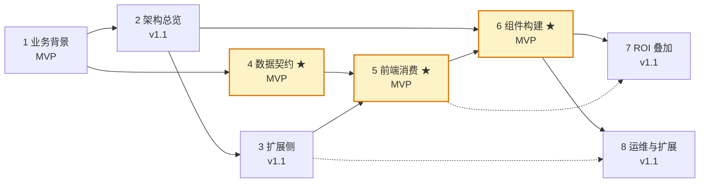

# ne101_camera：NeoMind 生态最复杂的设备绑定组件

> **一句话定位**：把 CamThink NE101 感知摄像头接入 Dashboard 的旗舰组件——它是 NeoMind 组件市场里第一个「设备绑定 + 图像画布 + AI 处理流水线 + ROI 叠加」四合一的组件，把入门级 metric_card 的「数值展示」扩展到了「设备 → 推理 → 视觉叠加」全链路。

本案例是 NeoMind 组件市场的「旗舰深度案例」——前面 6 个案例（[#6 metric_card](../6-metric-card-component.md) 是直接前置）教你「怎么写一个组件」，本案例 8 节内容回答「怎么写一个把硬件 + AI + 视觉效果全部串起来的复杂组件」。读完本案例，你会理解为什么 NeoMind 用「IIFE + `window.React` 注入」而非 ESM 打包能撑住 1972 行的手写代码，以及为什么 manifest 里 `has_data_source: false` + `has_device_binding: true` 这个组合是设备绑定组件的典型范式。

---

## §0 阅读路径推荐

旗舰案例共 8 个子页面，按依赖关系组织。建议按以下顺序阅读，标注 ★ 的是 MVP 核心（v1 发布必读），其余是 v1.1 增量。

```
1 业务背景 → 2 架构总览 → 3 扩展侧 → 4 数据契约 ★ → 5 前端消费 ★ → 6 组件构建 ★ → 7 ROI 叠加 → 8 运维与扩展
```

如果你时间有限只想读懂「这个组件怎么工作」，读 §1 + §2 + §4 + §5 + §6 即可。如果你要二次开发或迁移到其它摄像头设备，把 §3（扩展侧契约）和 §7（ROI 渲染）也读完。

---

## §1 8 子页面索引

| 序号 | 标题 | 角色 | 状态 |
|------|------|------|------|
| 1 | [业务背景](./1-background.md) | NE101 设备能力 + 为什么需要专门组件 + 在生态中的定位 | MVP |
| 2 | 2-architecture.md（v1.1） | 1972 行 IIFE 的模块拆解、组件树、数据流 | v1.1 |
| 3 | 3-extension-side.md（v1.1） | `processingExtensionId` 通用契约、扩展如何消费图像 | v1.1 |
| 4 | 4-data-contract.md ★ | MQTT 主题、WebSocket 增量、`detections` 字段格式 | MVP |
| 5 | 5-frontend-consume.md ★ | 组件如何拉取 detections、解析 JSON string、按类别上色 | MVP |
| 6 | 6-component-build.md ★ | `NE101CameraPanel` 命名导出、IIFE 注入、React hooks 在 IIFE 中的注意事项 | MVP |
| 7 | 7-integration-test.md（v1.1） | 端到端集成测试、ROI 叠加验证、多扩展切换测试矩阵 | v1.1 |
| 8 | 8-deep-dive.md（v1.1） | 版本演进（25 commits）、调试 Trace、性能优化、源码卫生复盘 | v1.1 |

---

## §2 与 #6 metric_card 的关系：从入门到旗舰

本案例是 [#6 metric_card](../6-metric-card-component.md) 的直接延续，但**复杂度等级差了一个数量级**。下表是两个案例的对照，帮助你建立「从入门到旗舰」的认知阶梯。

| 维度 | metric_card（入门） | ne101_camera（旗舰） |
|------|---------------------|----------------------|
| `bundle.js` 行数 | 352 行 | 1972 行（5.6 倍） |
| 组件类型 | 显示型（`category: "display"`） | 设备型（`category: "device"`） |
| 数据接入方式 | 绑定数据源（`has_data_source: true`） | 绑定设备（`has_device_binding: true` + `device_type_filter`） |
| 是否渲染图像 | 否（仅数值/标签/单位） | 是（JPEG 抓拍 + Canvas ROI 叠加） |
| 是否触发 AI 推理 | 否 | 是（通过 `processingExtensionId` 调用扩展） |
| 命名导出 | `NeoMind_MetricCard` | `NE101CameraPanel`（注意：**不叫** `default`） |
| 最难知识点 | OKLCH + CSS 变量毛玻璃 | ROI 归一化坐标 + `processingRoiOverlap` 阈值 + React-in-IIFE hooks 陷阱 |

**建议**：如果你还没读 metric_card 案例，先读完它的 §1-§3 再回来。metric_card 教会你「IIFE 注入模式 + manifest 契约 + fetchData 数据拉取」三件套，这三件套在 ne101_camera 里**依然是底层骨架**，只是上面叠加了设备绑定和 AI 处理两层。

---

## §3 你将学到什么

读完本案例的 8 节内容，你会掌握以下 5 个关键能力：

1. **设备绑定 vs 数据源的本质区别**——为什么 NE101 用 `has_device_binding: true` + `device_type_filter: ["ne101_camera"]` 而不是 `has_data_source: true`。这关系到组件在仪表板编辑器里能否显示「绑定设备」面板、能否调用 `trigger_capture` 这种设备命令。详见 [§1 业务背景](./1-background.md)。

2. **1972 行 IIFE 如何保持可维护**——`bundle.js` 没有任何打包步骤，全是手写 IIFE。我们会拆解它的模块分层（helpers / data layer / canvas layer / React layer / settings panel layer），并解释为什么 NeoMind 选择这种范式而非 ESM。详见 [§6 组件构建](./6-component-build.md)（v1.1）。

3. **`processingExtensionId` 通用 AI 处理契约**——这是本案例最核心的设计创新：组件不自己跑 AI，而是通过 `processingExtensionId: ""` 字段把图像「外包」给用户选择的扩展（object_detection / ocr / describe / 任意 `locate-anything-v2` 兼容扩展）。这种「组件 + 可插拔扩展」的契约是 NeoMind 生态复用 AI 能力的范本。详见 [§3 扩展侧](./3-extension-side.md)（v1.1）。

4. **ROI 叠加渲染的工程细节**——从单矩形 ROI（`processingRoiX/Y/W/H`，归一化 0-1）到多 ROI 数组（`processingRois: []`），从中心点判定（已被废弃）到 `processingRoiOverlap: 0.6` 的 IoU 阈值判定。这块涉及 Canvas 坐标映射、`objectFit: contain` 的非线性缩放、ResizeObserver 异步建立等坑点。详见 [§5 前端消费](./5-frontend-consume.md) + [§7 集成测试](./7-integration-test.md)。

5. **React-in-IIFE 的工程范式与陷阱**——在 1972 行的 IIFE 里写 React hooks 会有意外陷阱：例如 `b060a25` 修复了 React error #310（useEffect 里用了 hooks 依赖了未初始化的 state）、`0601cd4` 把条件 useState 移到顶层避免 hooks 顺序问题。这些坑在打包 React 项目里不会遇到，但在 IIFE 范式下必须显式处理。详见 [§6 组件构建](./6-component-build.md)（v1.1）。

---

## §4 8 子页面阅读依赖图

下图展示 8 个子页面之间的知识依赖关系。实线箭头表示「必须先读前置」，虚线表示「建议先读但可跳过」。★ 标注的是 MVP 核心（v1 发布必读）。



**最短学习路径（只读 MVP 三节）**：§1 业务背景 → §4 数据契约 → §5 前端消费 → §6 组件构建。这四节足以让你理解「NE101 抓拍 → MQTT → NeoMind → 扩展推理 → 组件渲染」全链路。

**完整学习路径（八节全读）**：按 §1 → §2 → §3 → §4 → §5 → §6 → §7 → §8 顺序读，适合准备二次开发或迁移到其它摄像头设备的开发者。

---

## §5 案例信息卡

| 字段 | 值 |
|------|-----|
| 组件 ID | `ne101_camera` |
| 版本 | `2.14.9`（截至本案例撰写） |
| 作者 | CamThink Team |
| `bundle.js` 行数 | 1972 行（手写 IIFE，非打包产物） |
| `manifest.json` 行数 | 40 行 |
| 源码仓库 | [camthink-ai/NeoMind-Dashboard-Components](https://github.com/camthink-ai/NeoMind-Dashboard-Components/tree/main/components/ne101_camera) |
| Git 提交数（组件目录） | 25+ commits |
| 前置案例 | [#6 metric_card](../6-metric-card-component.md)（入门组件案例） |
| 后续案例 | 暂无（本案例是当前组件市场最复杂的案例） |

---

## §6 接下来

- 想理解「为什么 NE101 需要专门组件」→ [§1 业务背景](./1-background.md)
- 想直接看代码结构 → 跳到 §2 架构总览（v1.1 发布）
- 想理解 AI 处理契约 → 跳到 §3 扩展侧（v1.1 发布）+ §4 数据契约（MVP）
- 想看 React 实现细节 → 跳到 §5 前端消费（MVP）+ §6 组件构建（MVP）

---

*最后更新: 2026-06-23*
