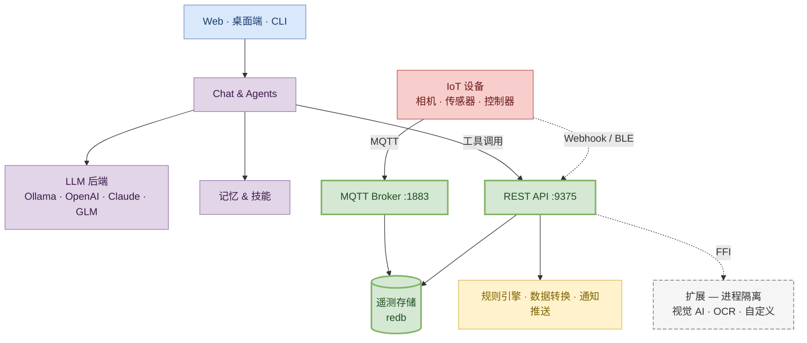

# 什么是 NeoMind？

NeoMind 是一款**边缘部署的 AI 平台**，为 IoT 带来智能。它在你的硬件上直接运行 LLM 驱动的智能体，通过 MQTT / BLE / Webhook 连接设备，用规则引擎自动响应事件，并在实时仪表板上可视化全部数据——全程不依赖云服务。

**核心理念**：用自然语言和你的设备对话。AI 理解你的意图，查询设备状态，创建自动化规则，并自主执行动作。

## 产品一览

NeoMind 三个核心界面——管理你的设备、可视化你的数据、用自然语言对话驱动一切。

---

## 产品架构

NeoMind 采用**单进程多层级**架构——所有核心能力打包在一个进程中，无需外部数据库或消息代理，开机即用。

:::tip 三大设计哲学

1. **单进程自包含** — API、MQTT Broker、存储、规则引擎全在一个进程里。`cargo run` 一条命令，全部就绪。没有 Docker compose，没有外部依赖。

2. **边缘优先，云端可选** — 默认用本地 LLM（Ollama）实现 100% 离线运行，数据不出局域网；需要更强能力时，一键切换云端模型（OpenAI / Claude / GLM）。

3. **扩展崩溃隔离** — 扩展运行在独立进程中，通过 FFI 通信。一个 YOLO 扩展崩溃？主服务和其他扩展完全不受影响。
   :::

> 想深入了解每一层的设计原理？阅读 [核心概念](../concepts/2-core-concepts.md) — 数据生命周期、扩展模型、Agent 执行循环的完整剖析。

---

## 为什么选择 NeoMind？

| 特性 | 说明 |
|------|------|
| **完全自包含** | 内置 MQTT Broker、redb 存储，无需安装外部数据库或消息代理 |
| **端到端类型安全** | Rust 后端提供编译期保证；Agent CLI 命令在进程内分发结构化数据，避免脆弱的字符串解析 |
| **崩溃隔离的扩展** | 扩展运行在独立进程中，按能力（capability）授权；行为异常的扩展永远不会拖垮服务端 |
| **云可选** | 使用本地 LLM（Ollama）可 100% 离线运行，需要更强能力时也可接入云端模型 |

## 核心能力

### AI 智能化
- **自然语言对话** — 会话式接口，查询并控制所有已连接设备
- **自主智能体** — 按计划或事件触发的 AI Agent，独立监控、分析并执行设备数据
- **10+ LLM 后端** — Ollama、OpenAI、Anthropic、Google、xAI、Qwen、DeepSeek、GLM、MiniMax，以及任何 OpenAI 兼容端点
- **记忆系统** — 多层记忆（个人档案 / 知识 / 任务 / 演化），自动抽取与压缩
- **技能系统** — YAML + Markdown 技能文件，针对特定场景引导 Agent 行为
- **多模态** — 支持图像上传与视觉分析

### 设备管理
- **MQTT 协议** — 主流设备集成方式，内置 Broker，支持 mTLS 与 CA 证书
- **BLE 配网** — 通过蓝牙零触摸配置设备（Tauri 原生 + Web Bluetooth）
- **HTTP / Webhook** — 灵活的 REST 设备适配器
- **自动发现** — 自动设备检测、类型注册、AI 辅助 onboarding
- **指令队列** — 向设备下发控制指令，带参数校验与跟踪
- **自定义设备类型** — 通过 JSON 类型定义声明设备指标与指令

### 自动化
- **JSON 规则引擎** — 结构化的规则定义：`{"condition": {"source": "device:sensor:temperature", "operator": "greater_than", "threshold": 30}}`
- **数据转换** — 基于 JavaScript 的数据变换，创建虚拟指标
- **计划型 Agent** — 基于时间或事件触发的 AI Agent 执行
- **事件总线** — 发布/订阅架构，组件间解耦通信

### 仪表板与可视化
- **拖拽构建器** — 可视化仪表板编辑器，响应式网格布局
- **丰富组件** — 数值卡、图表、仪表盘、表格、VLM 视觉组件
- **实时更新** — WebSocket / SSE 将数据流式推送到仪表板
- **仪表板分享** — 带过期时间的公开链接
- **自定义组件** — 构建并发布你自己的仪表板组件

### 通知与数据推送
- **7 个通知渠道** — Webhook、邮件、Telegram、企业微信、钉钉、Slack、飞书
- **数据推送** — 通过 Webhook 或 MQTT 将遥测数据转发到外部系统
- **投递跟踪** — 指数退避重试、投递历史、日志管理
- **消息去重** — 防止高频触发引发的通知风暴

### 平台
- **多实例** — 从单个界面连接并管理多个 NeoMind 后端
- **扩展系统** — 原生与 WASM 扩展，进程隔离 + 基于能力的权限
- **跨平台桌面** — 通过 Tauri 提供 macOS、Windows、Linux 原生应用
- **移动友好 Web** — 针对手机和平板优化的响应式 Web UI
- **国际化** — 英语与中文
- **暗色模式** — 系统感知的暗/亮主题
- **API Key 鉴权** — JWT 之外的编程访问方式
- **CLI 工具** — 全功能命令行接口

## 生态系统

NeoMind 是一个模块化生态系统，每个关注点由专门仓库承载：

| 仓库 | 用途 |
|------|------|
| **[NeoMind](https://github.com/camthink-ai/NeoMind)** | 核心平台（本产品）— 后端、前端、桌面应用 |
| **[NeoMind-Extensions](https://github.com/camthink-ai/NeoMind-Extensions)** | 官方扩展市场 — 天气、YOLO 检测、OCR、人脸识别、视频流 |
| **[NeoMind-DeviceTypes](https://github.com/camthink-ai/NeoMind-DeviceTypes)** | 设备类型定义 — 标准化的 IoT 硬件指标与指令 |
| **[NeoMind-Dashboard-Components](https://github.com/camthink-ai/NeoMind-Dashboard-Components)** | 仪表板组件市场 — 社区贡献的 React 组件 |

## 适用人群

- **IoT 集成商 / 解决方案工程师** — 需要快速搭建边缘智能方案，连接相机、传感器、控制器并做自动化
- **工业 / 园区 / 零售场景运维者** — 希望用自然语言管理设备、配置告警与可视化
- **二次开发者** — 通过扩展 SDK、自定义设备类型或仪表板组件扩展平台能力
- **AI 应用工程师** — 在边缘运行多模态 LLM Agent，对接真实物理设备

## 下一步

- [5 分钟快速上手](../quick-start/1-five-minute-guide.md) — 最短时间内体验核心闭环
- [核心概念](../concepts/2-core-concepts.md) — 理解系统全貌与数据流
- [术语表](../concepts/1-glossary.md) — 所有核心术语的集中定义
- [安装与配置](../user-guide/1-install-setup.md) — 在桌面或服务器上跑起 NeoMind
- [配置 LLM 后端](../user-guide/2-configure-llm.md) — 接入 Ollama 或云端模型
- [接入设备](../user-guide/3-onboard-device.md) — 使用 onboarding 向导
- [AI Agent](../user-guide/6-ai-agent.md) — 创建自主智能体
- [自动化规则](../user-guide/7-automation-rules.md) — JSON 规则引擎
- [扩展管理](../user-guide/9-extensions.md) — 安装视觉 AI / OCR 等扩展
- [开发指南总览](../developer-guide/1-overview.md) — 按设备类型 / 扩展 / 仪表板组件 / 主项目四个维度切入
- [应用案例](../use-cases/1-object-detection.md) — 端到端场景示例

---

*最后更新: 2026-06-15*
