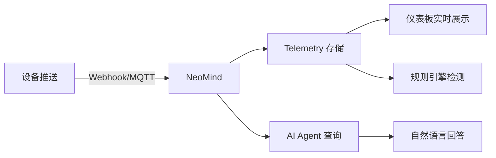

# 5 分钟快速上手

用最短时间跑通 NeoMind 的核心闭环：**设备接入 → 数据可视化 → AI 对话**。每一步都有 ✓ 检查点、排障提示，跟着做就能成。

> 完整安装选项与排障见 [安装与配置](../user-guide/1-install-setup.md)。

---

## 你将完成什么

按照本指南，你将在 5 分钟内：

- ✅ 在本地跑起 NeoMind 服务
- ✅ 接入一个大语言模型（本地或云端）
- ✅ 连接第一个设备并用 webhook 推送数据
- ✅ 在仪表板上看到实时数据
- ✅ 用自然语言向 AI 提问并得到答案

:::tip 前置条件

- 一台 **macOS / Windows / Linux** 电脑（4GB+ 内存）
- **不需要**预先安装数据库、消息代理或其他基础设施——NeoMind 全部内置
- 如果要用本地 LLM（推荐），需要额外 4-8GB 内存；否则可跳过用云端 API
  :::

---

## Step 1：安装（1 分钟）

### 方式一：桌面应用（推荐入门）

从 [GitHub Releases](https://github.com/camthink-ai/NeoMind/releases/latest) 下载对应平台的安装包，双击安装后启动。

### 方式二：服务器部署

```bash
curl -fsSL https://raw.githubusercontent.com/camthink-ai/NeoMind/main/scripts/install.sh | sh
```

启动后浏览器访问 `http://localhost:9375`。


> ✓ **检查点**：看到登录 / 注册页面 = 服务已运行。注册一个账号并登录。

:::note 看不到页面？

- **端口被占用？** 默认端口 `9375`，可在配置文件中修改
- **macOS 安全拦截？** 首次打开会提示"无法验证开发者"，前往 `系统设置 → 隐私与安全性 → 仍要打开`
- **服务器部署无浏览器？** 用 SSH 端口转发：`ssh -L 9375:localhost:9375 user@server`
  :::

<!-- 截图说明：登录/注册页面的完整截图 -->

---

## Step 2：配置 LLM 后端（1 分钟）

首次登录进入配置向导。NeoMind 需要一个 LLM 后端作为"大脑"，三种方案任选其一：

| 方案 | 适合 | 延迟 | 隐私 | 需要 |
|------|------|------|------|------|
| **Ollama（本地）** | 推荐入门、离线场景 | 低 | 全程不出局域网 | 8GB+ 内存 |
| **云端 API** | 想用最强模型 | 中 | 数据上云 | API Key |
| **稍后配置** | 先看界面 | — | — | — |

### 方案 A：Ollama 本地部署（推荐）

```bash
# 1. 安装 Ollama（如果还没装）：https://ollama.com
# 2. 拉取模型
ollama pull qwen3.5:4b
```

在向导中：

1. 选择后端类型 → **Ollama**
2. 地址填 `http://localhost:11434`（默认）
3. 模型选 `qwen3.5:4b`


### 方案 B：云端 API

选 OpenAI / Anthropic / GLM 等，填入 API Key 和模型名（如 `gpt-4o`、`claude-sonnet-4-6`）。

> ✓ **检查点**：向导显示 **"LLM 后端已连接"** = 大脑已就位。

:::note 连接失败？

- **Ollama 未运行？** 终端执行 `ollama serve` 启动
- **模型没拉？** 执行 `ollama list` 确认 `qwen3.5:4b` 存在
- **云端 401？** 检查 API Key 是否正确、是否有余额
  :::

> 详见 [配置 LLM 后端](../user-guide/2-configure-llm.md)。

:::tip 也可以用 CLI 配置
不想点界面？一行命令即可：

```bash
# Ollama 本地
neomind llm create --name local --type ollama --endpoint http://localhost:11434 --model qwen3.5:4b

# 云端 API（以 GLM 为例）
neomind llm create --name glm --type openai \
  --endpoint https://open.bigmodel.cn/api/paas/v4 \
  --model glm-4-flash --api-key YOUR_API_KEY

# 测试连接 → 设为默认
neomind llm test local && neomind llm activate local
```

完整命令参考：`neomind llm --help`
:::

<!-- 截图说明：LLM 配置成功的界面 -->

---

## Step 3：连接第一个设备（1 分钟）

最快的接入方式是 **HTTP Webhook**——无需 MQTT 客户端，一行 `curl` 就能模拟设备。

### 3.1 创建设备

在 Web UI 的 **设备** 页面 → 点 **添加设备** → 选 **Webhook** → 命名 `demo-sensor`。

创建后会得到一个专属的 Webhook URL（形如 `/api/devices/<DEVICE_ID>/webhook`）。

<div style={{display: 'flex', gap: '8px'}}>
  
  
</div>

### 3.2 推送数据

复制下面的命令，把 `<DEVICE_ID>` 替换为你的设备 ID，执行：

```bash
curl -X POST http://localhost:9375/api/devices/<DEVICE_ID>/webhook \
  -H 'Content-Type: application/json' \
  -d '{"temperature": 25.6, "humidity": 60}'
```

返回 `{"success": true}` 即成功。打开设备详情页，可以看到最新遥测值。


> ✓ **检查点**：设备详情页显示 `temperature: 25.6` 和 `humidity: 60` = 数据已入库。

:::tip 也可以连接真实设备

NeoMind 内置 MQTT Broker（`localhost:1883`），支持 ESP32、树莓派、工业传感器等真实设备。详见 [接入设备](../user-guide/3-onboard-device.md)。
:::

:::note webhook 返回 404？

- **设备 ID 不对？** 在设备列表里点进设备，URL 里的 ID 就是
- **忘了 `Content-Type`？** 必须加 `-H 'Content-Type: application/json'`
  :::

<!-- 截图说明：添加设备弹窗 + webhook URL + 设备详情遥测数据 -->

---

## Step 4：在仪表板看数据（30 秒）

进入 **仪表板** 页面——默认仪表板已自动创建。点 **编辑**，添加一个 **数值卡** 组件：

1. 点 **添加组件** → 选 **数值卡**
2. 数据源填 `device:demo-sensor:temperature`
3. 保存


:::info DataSourceId 格式

数据源引用格式统一为 `{type}:{id}:{field}`：

- `device:demo-sensor:temperature` — 设备遥测
- `extension:weather:temp` — 扩展指标
- `agent:guard:status` — Agent 状态

仪表板、规则、数据推送都用这个格式。详见 [术语表](../concepts/1-glossary.md)。
:::

温度值实时显示在卡片上。再推一条 webhook 数据，数值会立即刷新：

```bash
curl -X POST http://localhost:9375/api/devices/<DEVICE_ID>/webhook \
  -H 'Content-Type: application/json' \
  -d '{"temperature": 28.3, "humidity": 55}'
```

> ✓ **检查点**：仪表板上看到实时温度数值 = 可视化闭环打通。

> 详见 [使用仪表板](../user-guide/4-use-dashboard.md)。

<!-- 截图说明：仪表板编辑态 + 数值卡配置 + 实时数据 -->

---

## Step 5：用 AI Chat 提问（30 秒）

打开 **AI Chat**，输入：

> 我有哪些设备？demo-sensor 的温度是多少？

AI Agent 会自动查询设备列表和最新遥测值，用自然语言回答。


再试一个更有挑战性的——让 AI 帮你创建自动化：

> 温度超过 30 度时通知我

AI 会理解你的意图，创建一条规则并配置通知渠道。

> ✓ **检查点**：AI 回答了你的问题 = 智能闭环完成。

:::note AI 没反应？

- **LLM 后端未连接？** 回到 **设置 → LLM 配置** 检查状态
- **第一次回答较慢？** 本地模型首次推理需要预热，等待 10-20 秒正常
  :::

> 详见 [AI Chat](../user-guide/5-ai-chat.md)。

<!-- 截图说明：AI Chat 对话界面，包含设备查询和温度回答 -->

---

## 🎉 核心闭环已完成

回顾你刚才跑通的链路：



**每一环都已验证**：数据进得来、存得下、看得见、能问答。

---

## 下一步

恭喜！你已完成 NeoMind 核心闭环。接下来可以：

| 我想... | 去哪里 |
|---------|--------|
| 深入理解系统架构 | [核心概念](../concepts/2-core-concepts.md) — 进程模型、数据流、扩展机制 |
| 查术语含义 | [术语表](../concepts/1-glossary.md) — Device / Extension / Agent / Rule |
| 配置更多 LLM 后端 | [配置 LLM 后端](../user-guide/2-configure-llm.md) — Ollama / 云端 API |
| 接入真实设备 | [接入设备](../user-guide/3-onboard-device.md) — MQTT / BLE / Webhook |
| 让 AI 自动巡检 | [AI Agent](../user-guide/6-ai-agent.md) — 定时/事件触发的自主智能体 |
| 设自动化规则 | [自动化规则](../user-guide/7-automation-rules.md) — 阈值告警 / 联动控制 |
| 配通知渠道 | [通知](../user-guide/8-notifications.md) — 邮件 / 飞书 / 钉钉 / Webhook |
| 装扩展（YOLO/OCR） | [扩展管理](../user-guide/9-extensions.md) — 安装与配置视觉 AI 扩展 |
| 看端到端实战 | [应用案例](../use-cases/1-object-detection.md) — 目标检测完整方案 |
| 遇到问题 | [故障排查](../user-guide/10-troubleshooting.md) — 常见问题与解决方案 |

---

*最后更新: 2026-06-15*
