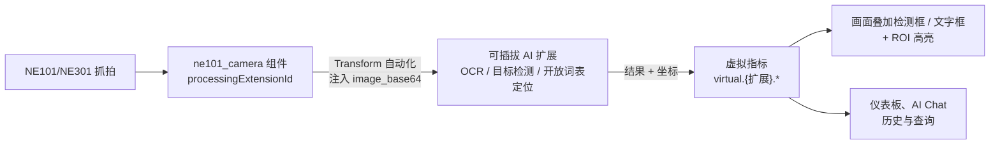

# NE101 Camera AI Vision

> 一个组件，多种 AI 视觉能力——本篇以 OCR（水表读数、商品标签）完整走查这条可插拔流水线；其他能力换 `processingExtensionId` 即可。

---

## 1. 方案概述

NeoMind 的 **NE101 摄像头组件（`ne101_camera`）** 不只是画面展示——它内置一条 **AI 处理流水线**：组件本身不运行 AI，而是通过 `processingExtensionId` 契约，把每一帧抓拍图像交给用户选择的扩展做推理，再把结果以叠加框和虚拟指标的形式回到画面上。

这条流水线是**可插拔**的——换不同的扩展，同一组件就能完成不同类型的 AI 视觉任务：

| AI 能力 | 选用扩展 | 典型场景 |
|------|------|------|
| **OCR 文字识别** | paddle-ocr-v6 / paddle-ocr-vl | 仪表读数（水表、电表、燃气表）、商品与价签标签、数显仪表、铭牌序列号、文档表单 |
| **目标检测** | yolo-device-inference / image-analyzer-v2 | 人流计数、车辆检测、区域入侵告警 |
| **开放词表定位** | locate-anything-v2 | 用自然语言「找 / 数」任意物体、缺陷定位、零样本计数 |

> 除结构化流水线外，还可用 **AI Agent + 视觉大模型** 对画面做开放式场景理解（描述、推理、告警），见第 7 节。

本篇以 **OCR 文字识别**（接 `paddle-ocr-v6`）为完整走查，演示这条流水线从安装到出结果的全过程；其余能力的配置流程完全相同，只是第 5.3 步更换 `processingExtensionId`。走查以**水表读数**和**商品标签**两个 OCR 场景为例。

**数据流向**：



推理结果写入虚拟指标 `virtual.<扩展>.*`，组件据此在画面上叠加检测框或文字框（并可叠加 ROI 高亮），同时供仪表板和 AI Chat 查询。

---

## 2. 物料清单（BOM）

| 物料 | 型号/规格 | 数量 | 用途 | 必需 |
|------|----------|------|------|------|
| **智能相机** | NE101 或 NE301 | 1+ | 图像采集 | ✅ |
| **NeoMind 平台** | v0.8.0+ | 1 | 边缘 AI 管理 | ✅ |
| **paddle-ocr-v6 扩展** | v2.7.8+ | 1 | 本地 OCR 推理引擎 | ✅ |
| **ne101_camera 组件** | v2.14.10+ | 1 | 摄像头面板 + AI 处理流水线 | ✅（随组件市场提供）|
| **本地 LLM** | Ollama 等 | 1 | AI Chat 后端 | 可选 |

---

## 3. 前置准备

### 3.1 NeoMind 安装与配置

完成 NeoMind 的安装、注册和基本配置，详见 [NeoMind 快速入门](../user-guide/1-install-setup.md)。

### 3.2 设备接入

将 NE101 或 NE301 注册到 NeoMind 平台（设备类型 `ne101_camera`），详见 [NeoMind 快速入门 - 设备管理](../user-guide/3-onboard-device.md)。


---

## 4. 安装扩展与组件

### 4.1 安装 paddle-ocr-v6 扩展

进入 **Extensions（扩展）** 页面，打开扩展市场，搜索 **paddle-ocr-v6** 并下载安装；安装完成后确认状态为 **Running**。


paddle-ocr-v6 提供四档推理模型，可在扩展配置或组件面板切换：

| 档位 | 体积 | 适用 |
|------|------|------|
| `tiny` | ~6MB（内置）| CPU 轻量、离线运行（不含日语）|
| `small` | ~18MB（按需下载）| 有 CoreML 或 CUDA，精度更高 |
| `medium` | ~132MB（按需下载）| CUDA 加 ≥16GB 内存，最高精度 |
| `auto` | — | 默认，按主机能力自动选择 |

### 4.2 确认 ne101_camera 组件可用

`ne101_camera` 是仪表板组件市场的官方组件。若组件库中未出现，从组件市场安装即可（详见 [扩展管理](../user-guide/9-extensions.md)）。

---

## 5. 仪表板配置：摄像头 + OCR 处理流水线

### 5.1 添加 NE101 摄像头组件

进入 **Dashboard（仪表板）**，创建仪表板后点击 **添加面板**，选择 **NE101 Camera Panel** 组件。首次使用时需下载该组件包。


### 5.2 配置组件并绑定设备

添加组件后，在配置面板中绑定已接入的 NE101 或 NE301 设备；绑定后面板显示实时画面、在线状态与电量。


### 5.3 启用 AI 推理并选择扩展

在组件配置的 **高级** 区开启 **AI 推理**，并在扩展下拉中选择 **paddle-ocr-v6**（需先安装该扩展，它才会出现在列表中）。选择后模板自动设为 `text_detection`，调用扩展的 `recognize` 命令。本篇以 OCR 为例；目标检测、开放词表定位等能力的扩展、模板与参数见第 6 节。


### 5.4 设置 ROI 关注区域（可选）

画面里往往只有一块区域是「要读的内容」，例如水表的数字轮、标签的文字区。开启 **ROI** 可在画面上高亮关注区，并按 `processingRoiAction` 选择统计策略——`count`（计数）、`filter`（仅区域内）、`filter_outside`（仅区域外），再用 `processingRoiOverlap`（默认 `0.6`）控制检测框与 ROI 的重叠判定阈值。ROI 支持多边形，可在配置面板中直接在画面上绘制一个或多个关注区。


### 5.5 自动生成的数据转换任务

开启 AI 推理后，NeoMind 会自动创建一条 **数据抓取 / 转换任务**（即 Transform 自动化，命名形如 `ne101-{设备ID}-paddle_ocr_v6-text_detection`）：每当设备上传新帧，就把图像注入 paddle-ocr-v6 的 `recognize`，返回的 `text_blocks` 写入虚拟指标。


```
virtual.paddle_ocr_v6.texts             // ["00238", "m³"]   识别出的文字
virtual.paddle_ocr_v6.detections        // [{bbox, polygon, label, confidence}, ...]
virtual.paddle_ocr_v6.inference_time_ms // 单帧推理耗时（ms）
```

该任务的转换规则支持二次修改，可定义更丰富的后处理逻辑，例如把读数字符串解析为数值、过滤噪声文本等。


组件读取这些虚拟指标，按归一化坐标在画面上叠加文字框，并在底部信息条显示提取文字、检测框数量与推理耗时。

---

## 6. 应用场景

本节按 AI 能力给出典型场景。设备接入、组件添加、绑定、ROI 配置在所有场景中都相同（见第 3–5 节），区别只在**第 5.3 步选择的扩展、模板与参数**：

| AI 能力 | 选用扩展 | 模板 | 关键参数 |
|---|---|---|---|
| OCR 文字识别 | paddle-ocr-v6 / paddle-ocr-vl | `text_detection` | — |
| 目标检测 | yolo-device-inference / image-analyzer-v2 / locate-anything-v2 | `object_detection` | `processingCategories`（如 `person,car`）|
| 开放词表定位 | locate-anything-v2 | `grounding` | `processingPhrase`（自然语言描述）|

### 6.1 OCR 文字识别

**水表读数**：将相机正对水表，ROI 框在读数区域，`processingRoiAction = filter` 过滤掉表盘 logo、型号等无关文字。抓拍后画面叠加识别到的数字与单位（如 `00238`、`m³`）；读数经 [数据转换](../user-guide/7b-data-transforms.md) 解析为数值后可做用量趋势。


**商品标签**：相机对准货架价签或传送带标签，ROI 框住文字主区（品名、SKU、价格、批次），多标签用多 ROI。返回文字可推送 ERP、对账系统，或在仪表板汇总为「本次识别到的 SKU 列表」。

> 复杂版面（表格、票据、扭曲文档）建议换 [`paddle-ocr-vl`](./5-paddle-ocr-vl.md)（VLM，需 GPU 服务）。

### 6.2 目标检测

选 `yolo-device-inference`（或 `image-analyzer-v2`），模板自动切换为 `object_detection`，在 `processingCategories` 填关注的类别（如 `person,car`）。抓拍后画面叠加检测框并标注类别，结果写入虚拟指标，可供计数、统计与告警。

- **人流计数 / 车辆检测**：`processingCategories = person` 或 `car`，配合 ROI `count` 统计区域内目标数量。
- **区域入侵告警**：ROI 圈定禁入区，`processingRoiAction = filter`，区域内出现目标即触发，结合 [自动化规则](../user-guide/7-automation-rules.md) 推送告警。
- **特定目标检测**：stock COCO 80 类之外的目标（工装、安全帽、专属产品等），可替换扩展内的 ONNX 自定义模型。

### 6.3 开放词表定位

选 `locate-anything-v2`，模板切换为 `grounding`，在 `processingPhrase` 用自然语言描述要找的物体。模型按描述零样本定位，画面叠加定位框并计数，适合固定检测器不认识的类别或临时需求。

- **自然语言计数**：`processingPhrase = 穿红马甲的人`、`货架上的红色商品`、`地上的垃圾`，返回所有匹配位置与数量。
- **缺陷 / 异物定位**：描述异常特征（如 `划痕`、`遗留工具`）辅助定位，再配合 ROI 或人工复核。

> [`locate-anything-v2`](./6-locate-anything-v2.md) 还支持 `text_detection`（文字定位）、`point`（指点定位）等模板，可按需切换。

---

## 7. LLM 场景理解：AI Agent 视觉分析

前几节的 OCR、检测、定位都是**结构化流水线**，输出确定的文字 / 框 / 类别。当需要更开放的理解——描述现场、判断异常、给出建议、用自然语言回顾历史——可以改用 **AI Agent + 视觉大模型**：Agent 绑定相机设备，每当新画面到达就用视觉 LLM 分析，结果沉淀进长期记忆供后续查询。这条路径不经过 `processingExtensionId` 流水线，而是由 Agent 直接消费设备图像。

> 需要先配置具备视觉能力的 LLM 后端（如多模态 Ollama 模型或云端视觉模型），参见 [配置 LLM 后端](../user-guide/2-configure-llm.md) 与 [AI Agent](../user-guide/6-ai-agent.md)。

**步骤**：

1. **创建 AI Agent**：在 AI Agent 页面新建 Agent，绑定目标相机设备，用提示词定义分析内容（如「描述现场人员活动与设备状态，发现异常时提醒」）。


2. **持续采集 + LLM 分析**：Agent 以事件触发——设备每上报一帧图像即调用视觉 LLM 对画面进行分析。


3. **查看分析结果**：每次分析的描述、判断与建议记录在 Agent 运行历史中。


4. **长期记忆**：Agent 可把关键信息写入长期记忆，跨次分析积累上下文（现场基线、历史事件等）。


5. **用自然语言回顾现场**：借助记忆与分析历史，可让 Agent 用自然语言回顾设备部署与运行的现场情况。


---

## 8. AI Chat 查询

各能力的识别 / 检测结果落入时序数据后，都可在 **AI Chat** 用自然语言查询，例如：

```
最近 7 天 my-water-meter 的读数趋势是怎样的？用中文回复。
今天门口相机数到多少人？哪些时段最高？
帮我把今天识别到的商品标签 SKU 列出来。
```

> AI Chat 需要配置 LLM 后端，参见 [配置 LLM 后端](../user-guide/2-configure-llm.md)。

---

## 9. 进阶

### 9.1 精度调优

- **OCR**：默认 `auto` 档覆盖大多数场景；漏识别升 `small` / `medium` 或降低检测阈值，误识别用 ROI `filter` 缩小关注区。
- **目标检测**：调整置信度与 NMS 阈值、收窄 `processingCategories`；专属目标替换自定义 ONNX 模型。
- **开放词表定位**：调整 `processingPhrase` 措辞与 NMS 阈值，提升匹配召回。

### 9.2 与通用 OCR 方案的关系

[通用 OCR 方案](./2-ocr-text-extraction.md) 用基础 OCR 面板对手动抓拍做一次性识别，适合「拍一张、认一下」；本篇是相机常驻、自动流水线、ROI 叠加的持续识别 / 检测方案。两者底层都走 NeoMind 扩展体系，可按场景选用。

---

## 10. 附录

### 相关文档

- [通用 OCR 方案](./2-ocr-text-extraction.md)
- [目标检测应用案例](./1-object-detection.md)
- [人脸识别方案](./3-face-recognition.md)
- [PaddleOCR-VL 文档理解](./5-paddle-ocr-vl.md)
- [LocateAnything 视觉定位](./6-locate-anything-v2.md)
- [DeepStream 多路视频分析（NG4500）](./7-deepstream-ng4500.md)
- [扩展管理](../user-guide/9-extensions.md)
- [自动化规则](../user-guide/7-automation-rules.md)
- [AI Agent](../user-guide/6-ai-agent.md)
- [数据转换](../user-guide/7b-data-transforms.md)
- [数据推送](../user-guide/7c-data-push.md)
- [NE101 Camera 组件开发旗舰案例](../developer-guide/case-studies/7-ne101-camera-component/index.md)

---

*最后更新: 2026-07-13*
