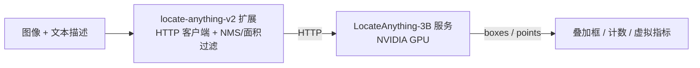

# LocateAnything Visual Grounding

> 基于 VLM 的「开放词表」视觉定位——一句自然语言找到 / 数出画面里的任意物体，无需预训练类别。需要 GPU 服务器。

---

## 1. 方案概述

locate-anything-v2 是一个 **HTTP 桥接扩展**：扩展是轻量客户端，LocateAnything-3B 模型跑在独立的 Python 推理服务上（推荐 NVIDIA GPU）。扩展负责结果后处理（NMS、面积过滤）。

「开放词表」是它的核心：不像 YOLO 只认预训练的 80 类，你可以用任意自然语言描述要找的东西，模型零样本定位。

**五类命令**：

| 能力 | 命令 | 关键参数 | 说明 |
|---|---|---|---|
| 类别检测 | `detect` | `categories`（如 `person,car`）| 按类别检测 |
| 短语定位 | `ground` | `phrase`（自然语言）| 按描述零样本定位，可 `single`/`multi` |
| 文字定位 | `detect_text` | — | 定位画面中所有文字 |
| GUI 定位 | `ground_gui` | `phrase`，`output_type`(box/point) | 截图里定位 UI 元素 |
| 指点 | `point` | `phrase` | 指向某个物体 |

**数据流向**：



---

## 2. 物料清单（BOM）

| 物料 | 规格 | 用途 | 必需 |
|------|------|------|------|
| **NeoMind 平台** | v0.8.0+ | 扩展宿主 | ✅ |
| **locate-anything-v2 扩展** | v2.7.7+ | HTTP 桥接 + 后处理 | ✅ |
| **GPU 推理服务器** | NVIDIA GPU | 运行 LocateAnything Python 服务 | ✅ |
| **本地 LLM** | Ollama 等 | AI Chat 后端 | 可选 |

---

## 3. 前置准备：部署推理服务

LocateAnything 扩展本身只是 HTTP 客户端，真正的 `nvidia/LocateAnything-3B`（约 6 GB）模型跑在一个独立的 **Python 推理服务**里。该服务基于 FastAPI，暴露以下端点：

| 端点 | 方法 | 作用 |
|------|------|------|
| `/health` | GET | 健康检查，返回模型与设备状态 |
| `/detect` | POST | 按类别检测 |
| `/ground` | POST | 自然语言短语定位 |
| `/detect_text` | POST | 全画面文字定位 |
| `/ground_gui` | POST | UI 元素定位 |
| `/point` | POST | 指向物体 |

默认监听 `http://127.0.0.1:9380`；服务源码在扩展 `service/` 目录（`server.py`、`locateanything_worker.py`、`Dockerfile`、`docker-compose.yml`、`start.sh`）。提供 **Docker（推荐）** 与 **本地运行** 两种方式。

### 3.1 方式一：Docker 部署（推荐，GPU 机器）

镜像基于 `pytorch/pytorch:2.6.0-cuda12.4-cudnn9-devel`，自带 CUDA 运行时。

**前置**：NVIDIA GPU + 已安装 [NVIDIA Container Toolkit](https://docs.nvidia.com/datacenter/cloud-native/container-toolkit/)。

```bash
cd service/

# 构建镜像（首次较慢，安装依赖）
docker build -t locate-anything-service .

# 可选：构建时预下载模型（~6 GB），省去首次启动等待
docker build --build-arg DOWNLOAD_MODEL=1 -t locate-anything-service .

# 运行：映射端口、挂载模型缓存卷、分配 GPU
docker run -d --gpus all \
  -p 9380:9380 \
  -v locate-models:/models \
  locate-anything-service
```

或用附带的 Compose 文件（等价，含自动重启与健康检查）：

```bash
cd service/
docker compose up -d        # 启动
docker compose logs -f      # 查看日志（首次会下载模型）
```

> 模型约 6 GB，缓存在卷 `locate-models`（容器内 `/models/huggingface`）；首次启动需下载，故健康检查的 `start_period` 设为 300 s。

### 3.2 方式二：本地直接运行

适合开发调试，或在 Mac（MPS）/ 带 GPU 的工作站上运行。

**前置**：Python 3.10+；NVIDIA GPU 装 CUDA 版 PyTorch，Mac 走 MPS。

```bash
cd service/

# 安装依赖（Mac/CPU 兼容版，含 torch>=2.5）
pip install -r requirements.txt

# 用启动脚本（自动探测环境、设置 MPS 回退）
./start.sh                          # 默认端口 9380，下载模型
./start.sh --port 9381              # 自定义端口
./start.sh --model /path/to/model   # 使用本地模型路径

# 或直接运行
python server.py --host 0.0.0.0 --port 9380
```

常用环境变量：

| 变量 | 默认 | 说明 |
|------|------|------|
| `LOCATE_ANYTHING_MODEL` | `nvidia/LocateAnything-3B` | HF 模型 ID 或本地路径 |
| `LOCATE_ANYTHING_PORT` | `9380` | 监听端口（`start.sh` 读取） |
| `PYTORCH_ENABLE_MPS_FALLBACK` | `1`（`start.sh`） | macOS MPS 回退开关 |

> 推理设备按 `CUDA → MPS → CPU` 自动选择；生产环境推荐 CUDA。

### 3.3 验证服务就绪

启动后先加载模型（约 6 GB，首次还要下载，请耐心等几分钟）。就绪后用 `/health` 确认：

```bash
curl http://127.0.0.1:9380/health
# {"status":"ok","model":"nvidia/LocateAnything-3B","device":"cuda"}
```

`status` 为 `ok` 表示模型已加载；`model_not_loaded` 表示仍在加载或失败（查看服务日志）。

回到 NeoMind 扩展详情页执行 **`check_status`**，确认模型已加载。


---

## 4. 安装与配置扩展

进入 **Extensions** 页面，从扩展市场安装 **locate-anything-v2**；在 **Configuration** 里把 `service_url` 指向推理服务（如 `http://<GPU服务器IP>:9380`）。

| 配置项 | 默认 | 说明 |
|--------|------|------|
| `service_url` | `http://127.0.0.1:9380` | LocateAnything 服务地址 |
| `generation_mode` | `slow` | `fast`(MTP，最快) / `slow`(NTP，最稳) / `hybrid`(fast+回退) |
| `max_new_tokens` | `2048` | 单次推理最大 token（128–8192）|
| `nms_iou_threshold` | `0.7` | NMS 的 IoU 阈值（越小过滤越狠）|
| `min_area_ratio` | `0.0005` | 框最小面积占比（过滤碎框）|
| `max_area_ratio` | `0.98` | 框最大面积占比（过滤过大的框）|

> NMS 与面积过滤作用于 `detect` / `ground` / `ground_gui`；`detect_text` 与 `point` 原样返回。三者也可在单次命令里用 args 覆盖。


---

## 5. 使用方式

### 5.1 在 Dashboard 用卡片测试（LocateCard）

扩展自带前端组件 **LocateCard**——在 Dashboard 添加该卡片即可图形化测试，无需手填命令参数：

1. 上传一张图片（组件自动压缩）。
2. 顶部切换模式：**Detect / Locate / OCR / UI / Point**（对应 `detect` / `ground` / `detect_text` / `ground_gui` / `point`）。
3. 底部输入框填描述：Detect 填类别（如 `person,car`）、Locate/UI/Point 填自然语言（如 `穿红马甲的人`），OCR 无需输入。
4. 点执行（或回车），结果直接在图上叠加检测框 / 指点，并显示耗时与数量。

> 底层调用的就是扩展命令，卡片只封装了图片上传、参数填写与结果可视化。


### 5.2 接入 NE101 摄像头组件

在 [NE101 摄像头组件](./4-camera-ocr.md) 里把 `processingExtensionId` 选为 **`locate-anything-v2`**：

- 模板 `object_detection` → `detect` 命令（按 `processingCategories` 检测）。
- 模板 `grounding` → `ground` 命令（用 `processingPhrase` 自然语言定位）。

后者是它的杀手锏：一句话描述要监控的对象，相机常驻零样本定位。

### 5.3 通过 AI Chat

对 [AI Chat](../user-guide/5-ai-chat.md) 说「用 locate-anything 数一下这张图里穿红马甲的人」，LLM 调命令并解读结果。

---

## 6. 典型场景

### 6.1 自然语言查找 / 零样本计数

用 `ground` + `phrase` 找 / 数任意物体，无需训练：

- `phrase = 穿红马甲的人` → 安全管理者人数。
- `phrase = 货架上的红色商品` → 缺货 / 陈列检查。
- `phrase = 地上的垃圾` → 环境巡检。

返回所有匹配位置与数量，可配合 [自动化规则](../user-guide/7-automation-rules.md) 触发告警。


### 6.2 缺陷 / 异物定位

描述异常特征（如 `划痕`、`遗留工具`、`异物`），模型定位后配合 ROI 或人工复核，适合零散、偶发的缺陷排查，免去为每种缺陷单独训练模型。

### 6.3 文字与 GUI 定位

- `detect_text`：定位画面中所有文字（比 OCR 更轻，只要位置）。
- `ground_gui` / `point`：在截图里定位 UI 元素或指向物体，可用于 RPA、自动化测试、无障碍辅助。

---

## 7. 选型：locate-anything vs yolo-device-inference

| 维度 | yolo-device-inference | locate-anything-v2 |
|------|----------------------|--------------------|
| 类别 | 固定（COCO 80 类 / 自定义模型）| 开放词表（自然语言，零样本）|
| 延迟 | 毫秒级 | 秒级（VLM）|
| 部署 | 本地 ONNX，边缘可跑 | 需 GPU 推理服务 |
| 适合 | 已知类别的稳定检测、高吞吐 | 临时需求、未知类别、一句话找东西 |

> 已知类别且追求速度 → yolo；要「用话找东西」或类别不固定 → locate-anything。两者都可在 [NE101 摄像头组件](./4-camera-ocr.md) 上切换使用。

---

## 8. 附录

### 相关文档

- [NE101 摄像头 AI 视觉](./4-camera-ocr.md)
- [目标检测应用案例](./1-object-detection.md)
- [扩展管理](../user-guide/9-extensions.md)
- [AI Chat](../user-guide/5-ai-chat.md)
- [自动化规则](../user-guide/7-automation-rules.md)

---

*最后更新: 2026-07-13*
