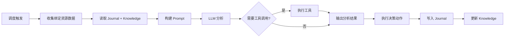

# AI Agent 自主智能体

AI Agent 是 NeoMind 的**自主执行模式**——你设定目标和触发条件，Agent 按计划或事件自动运行，收集数据、调用 LLM 分析、执行动作。与 [AI Chat](./5-ai-chat.md) 的区别：

| 维度 | AI Chat（交互对话） | AI Agent（自主智能体） |
|------|---------------------|----------------------|
| 触发方式 | 你发消息，实时交互 | 按计划 / 事件自动触发 |
| 上下文 | 会话历史 | 记忆系统（journal + knowledge） |
| 适用场景 | 临时查询、探索、调试 | 长期监控、定时巡检、事件响应 |
| 配置入口 | 直接进 Chat 页 | Agents 页签新建 |

## 前置条件

- 已配置 [LLM 后端](./2-configure-llm.md)（Agent 需要调用 LLM）
- 已接入[设备](./3-onboard-device.md)（Agent 需要数据源）

## 界面概览

点击左侧导航的 **Agents**（机器人图标）进入 Agent 管理页面：


页面以**卡片网格**展示所有 Agent，每张卡片显示：

| 信息 | 说明 |
|------|------|
| **Agent 名称** | 你设置的名称（如「温度巡检」「能耗日报」） |
| **状态徽章** | Active（激活）/ Paused（暂停）/ Executing（执行中）/ Error（错误） |
| **调度方式** | Cron 表达式 / Interval / Event |
| **上次执行** | 最近一次执行的时间与结果 |

页面顶部有三个页签：**Agents**（智能体列表）、**Memory**（系统记忆）、**Skills**（技能管理）。

## 创建 Agent

点击右上角的 **Create AI Agent** 按钮，打开全屏编辑器：


编辑器分为左右两栏，以下是各配置项说明：

### 1. 名称与 Prompt（左侧）

- **Name（名称）**：1–100 字符，便于识别（如「能耗巡检」「设备健康监测」）
- **Description（描述）**：可选，简短说明 Agent 用途
- **User Prompt（用户提示词）**：告诉 Agent 要做什么。1–10000 字符。

示例 prompt：

> 检查所有温湿度传感器的最新数据。如果任何传感器温度超过 35°C，通过飞书通知运维组，并在仪表板上记录告警。如果所有设备正常，简短汇报即可。

### 2. 执行模式（右侧）

| 模式 | 说明 | 适用场景 |
|------|------|---------|
| **Focused（聚焦模式）** | 绑定指定资源，Agent 在定义范围内工作，单次分析，token 高效 | 监控、告警、数据分析 |
| **Free（自由模式）** | 不绑定资源，LLM 自由探索，可调用全部工具，多轮推理 | 复杂自动化、设备控制、探索性任务 |

**Focused 模式**需要绑定资源（设备指标 / 扩展指标 / 设备 / 扩展工具），Agent 只收集和分析绑定范围内的数据。Scope 校验会拒绝超出绑定范围的指令。

**Free 模式**无需绑定资源，LLM 拥有全部工具（device / rule / message / extension / shell 等），可做多轮工具调用（默认上限 30 轮，5 分钟超时）。

### 3. 调度方式（右侧）


Agent 按调度方式自动触发执行：

| 调度类型 | 说明 | 配置 |
|---------|------|------|
| **Cron（定时表达式）** | 按 cron 表达式触发 | `schedule_type: "cron"`, `cron_expression: "0 0 * * * *"` |
| **Interval（固定间隔）** | 每隔 N 秒执行 | `schedule_type: "interval"`, `interval_seconds: 300` |
| **Event（事件触发）** | 设备数据变化 / 告警时触发 | `schedule_type: "event"` |

> **Cron 使用 6 字段格式**（含秒）：`秒 分 时 日 月 周`。例如 `0 0 * * * *` = 每小时整点，`0 0 8 * * *` = 每天早 8 点。

**事件触发**：当设备推送新数据或系统产生告警时自动执行。适合实时响应场景（如异常检测后立即分析）。事件触发有 60 秒去重窗口，防止事件风暴。

### 4. LLM 后端

每个 Agent 可绑定独立的 LLM 后端。与 Chat 模型解耦——切换 Chat 模型不会影响 Agent 配置。建议：
- **简单监控**：本地小模型（`qwen3.5:4b`），降低延迟和成本
- **复杂分析**：大模型（`qwen3.5:32b` / 云端模型），提高推理质量

填写完成后点击底部的 **Save** 保存 Agent。

## Agent 详情

点击任意 Agent 卡片，打开详情面板：


详情面板包含多个区域：

| 区域 | 说明 |
|------|------|
| **顶部操作栏** | Edit（编辑）、Run Now（立即执行）按钮 |
| **概览** | Agent 基本信息、绑定资源、调度配置、LLM 后端 |
| **执行历史** | 按时间排列的执行记录列表，含成功/失败状态、执行时长 |
| **记忆系统** | Journal 日志和 Knowledge 知识文件 |
| **用户消息** | 给 Agent 的留言反馈 |

详情页右上角的 **Run Now** 可以立即触发一次执行，无需等待定时调度。

## Agent 记忆系统

Agent 有独立的记忆系统，跨执行周期积累经验：

### Journal（执行日志）

每次执行写入一条 journal 条目，记录：
- 执行时间与触发方式
- 收集的数据摘要
- LLM 分析结论
- 执行的动作（`action_taken`）
- 成功 / 失败状态

Agent 下次执行时读取最近 N 条 journal，学习历史模式（避免重复失败动作、调整阈值、跳过已发送的告警）。

### Knowledge Files（知识文件）

Agent 的持久知识，Markdown 格式：
- **identity.md** — Agent 身份与职责
- **mission.md** — 任务目标与约束
- **resources.md** — 绑定资源说明
- **schedule.md** — 执行计划

首次执行时自动初始化。你可以手动编辑这些文件来微调 Agent 行为（在 Agent 详情 → Memory 面板）。

### User Messages（用户反馈）

你可以给 Agent 留言（在 Agent 详情页 → User Messages），Agent 下次执行时会读取。用于纠正 Agent 行为或提供额外上下文。自动保留最近 50 条。

## 执行流程



> 工具调用可多轮循环（G → E），直到 LLM 不再需要工具或达到 30 轮上限。

## 状态管理

Agent 卡片上的状态徽章实时反映当前状态：

| 状态 | 说明 | 颜色 |
|------|------|------|
| **Active** | Agent 激活中，按计划自动执行 | 绿色 |
| **Executing** | Agent 正在执行（实时 WebSocket 推送） | 蓝色 / 动画 |
| **Paused** | Agent 已暂停，不会自动触发（可手动执行） | 灰色 |
| **Error** | 上次执行失败，检查日志排查原因 | 红色 |

暂停 / 激活通过卡片上的开关按钮切换，会同步到调度器——暂停即取消调度，激活即恢复调度。

### 实时执行状态

Agent 执行时，卡片会实时显示「正在思考...」的内容（通过 WebSocket 推送），让你了解 LLM 当前正在做什么（如「正在查询设备数据」「正在分析温度趋势」）。

### 手动执行

不想等定时触发？点击 Agent 卡片或详情页的 **Run Now** 立即执行一次。

## 典型场景

### 场景 1：每小时温度巡检（Focused + Cron）

- **模式**：Focused
- **资源**：绑定 3 个温度传感器指标
- **调度**：Cron `0 0 * * * *`（每小时）
- **Prompt**：检查所有温度传感器最新读数。超过 35°C 发飞书通知，超过 45°C 发 Telegram + 邮件。

### 场景 2：事件驱动的异常诊断（Free + Event）

- **模式**：Free
- **资源**：无需绑定（自由探索）
- **调度**：Event（设备数据变化触发）
- **Prompt**：分析刚到的数据是否异常。如果异常，查询相关设备历史数据，判断是否需要告警或自动修复。可调用 shell 工具检查系统状态。

### 场景 3：每日能耗报告（Focused + Cron）

- **模式**：Focused
- **资源**：绑定能耗指标
- **调度**：Cron `0 0 8 * * *`（每天 8 点）
- **Prompt**：汇总昨日 24 小时的能耗数据，计算峰值和平均值，与上周同期对比，生成日报并发送到运维邮箱。

## CLI 管理

```bash
# 列出所有 Agent
neomind agent list

# 查看 Agent 详情
neomind agent get <agent_id>

# 激活 / 暂停
neomind agent control <agent_id> active
neomind agent control <agent_id> paused

# 手动触发执行（附带输入提示）
neomind agent invoke <agent_id> "检查所有传感器最新读数"
```

## 并发与超时

- **全局并发**：最多 10 个 Agent 同时执行
- **单 LLM 后端并发**：每个后端最多 2 个并发请求
- **全局超时**：每次执行最多 5 分钟（300 秒）
- **工具超时**：Shell 30 秒（最长 600 秒），Web 请求 15 秒，扩展 300 秒

如果并发已满，调度器会跳过本次执行（下次 tick 重试）。

## 提示词技巧

- **明确输出期望**：「生成一段 200 字以内的摘要」比「分析数据」更可控
- **给条件分支**：「如果温度 > 35 发飞书；如果 > 45 同时发 Telegram 和邮件」
- **引用设备名**：「检查 sensor-01 到 sensor-03」比「检查所有传感器」更精确
- **利用记忆**：Agent 会读 journal，所以可以写「如果上次已发过相同告警，不要重复发送」

## 与其他模块联动

| 模块 | 说明 |
|------|------|
| [自动化规则](./7-automation-rules.md) | 规则的 `TRIGGER_AGENT` 动作可触发 Agent |
| [通知](./8-notifications.md) | Agent 分析后决定是否发通知 |
| [设备](./3-onboard-device.md) | Focused 模式绑定设备指标 |
| [AI Chat](./5-ai-chat.md) | 两种 AI 运行形态，互为补充 |

## 移动端


移动端自动切换为单列卡片列表，支持查看状态、手动执行、切换暂停/激活。

## 下一步

- **[自动化规则](./7-automation-rules.md)** — 用 JSON 规则做确定性触发，Agent 做模糊判断，两者互补
- **[通知](./8-notifications.md)** — Agent 分析后需要通知运维人员？先配置通知渠道
- **[扩展](./9-extensions.md)** — Agent 可以调用已安装扩展的命令（YOLO 检测、OCR 等）

---

*最后更新: 2026-06-16*
