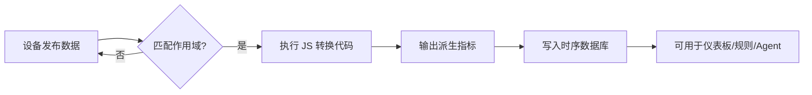

# 数据转换

数据转换（Transform）让 NeoMind 在**设备数据到达后、存储前**实时加工遥测数据——用一段 JavaScript 函数将原始指标转换为派生指标。例如：

- 摄氏度 → 华氏度
- 原始电压 + 电流 → 计算功率
- 设备在线状态 → 人类可读的状态文本
- 调用扩展命令处理数据（如 YOLO 检测 → 提取置信度）

转换后的派生指标可以像普通设备指标一样用于[仪表板](./4-use-dashboard.md)、[规则](./7-automation-rules.md)和 [AI Agent](./6-ai-agent.md)。

## 与规则的区别

| 维度 | 规则（Rules） | 数据转换（Transforms） |
|------|--------------|----------------------|
| 目的 | 条件判断 → 执行动作 | 数据加工 → 生成新指标 |
| 输出 | 通知 / 指令 / Agent 调用 | 新的遥测指标（可绑定到仪表板/规则） |
| 逻辑 | JSON 条件 + 动作 | JavaScript 代码 |
| 实时性 | 条件满足时触发 | 每条数据实时转换 |

## 界面概览

在自动化页面切换到 **Transforms** 页签：


页面以表格形式展示所有转换，每行包含：

| 列 | 说明 |
|------|------|
| **名称** | 转换的显示名称 |
| **作用域** | Global（全局）/ Device Type（设备类型）/ Device（指定设备） |
| **代码摘要** | JavaScript 代码片段预览 |
| **输出前缀** | 派生指标的命名前缀（如 `converted`） |
| **状态开关** | 启用 / 禁用切换 |
| **操作菜单** | 编辑、删除、导出 |

右上角的 **Import / Export** 按钮可批量导入导出转换 JSON。

## 通过 Web UI 创建转换

### 步骤 1：打开转换构建器

在 Transforms 页签点击 **Create** 按钮，打开全屏构建器：


构建器采用**左右分栏**布局：

| 区域 | 说明 |
|------|------|
| **左侧 · 配置栏** | 名称、描述、作用域、输出前缀、复杂度 |
| **右侧 · 代码工作区** | JavaScript 代码编辑器 + 变量面板 + 测试栏 |

### 步骤 2：填写基本信息

| 字段 | 说明 |
|------|------|
| **Name（名称）** | 转换的显示名称 |
| **Description（描述）** | 可选，说明转换用途 |
| **Output Prefix（输出前缀）** | 派生指标的命名前缀。如设为 `converted`，输出的指标名为 `converted.temp_f` |
| **Complexity（复杂度）** | 1–5 的数字，用于执行顺序排序（低复杂度先执行） |

### 步骤 3：选择作用域

作用域决定转换处理哪些设备的数据：

| 作用域 | 说明 | 适用场景 |
|--------|------|---------|
| **Global（全局）** | 处理所有设备的数据 | 通用转换（如单位换算） |
| **Device Type（设备类型）** | 仅处理指定设备类型的数据 | 同类设备的批量转换 |
| **Device（指定设备）** | 仅处理单个设备的数据 | 特定设备的定制转换 |

### 步骤 4：编写转换代码


代码编辑器中使用 JavaScript 编写转换函数。`value` 变量代表输入的原始数据值，`return` 一个对象作为输出：

```javascript
// 摄氏度转华氏度
return {
  temp_f: value * 9/5 + 32
}
```

**可用变量**：

| 变量 | 说明 |
|------|------|
| `value` | 当前数据点的值 |
| `input` | 完整的输入数据对象（含 timestamp、quality 等） |
| `extensions_invoke(ext_id, command, params)` | 调用扩展命令 |

**变量面板**：左侧的变量面板可插入设备指标和扩展数据源。选择设备类型后，该类型的所有指标会列出，点击即可插入代码。也可从扩展面板选择扩展命令生成调用代码。

### 步骤 5：测试转换

构建器底部的测试栏可以用模拟数据验证转换效果：

1. 在测试输入框填入模拟值（如 `25`）
2. 点击 **Test** 按钮
3. 查看输出结果是否正确

测试通过后点击 **Save** 保存转换。

## 转换的工作原理



转换输出的派生指标使用 DataSourceId 格式 `transform:<output_prefix>:<field>`，如 `transform:converted:temp_f`。这些指标可以：
- 在仪表板中绑定为数据源
- 在规则条件中引用
- 在 Agent 的 Focused 模式中绑定

## 转换示例

### 1. 摄氏度转华氏度

```javascript
return {
  temp_f: value * 9 / 5 + 32
}
```

输出指标：`converted.temp_f`

### 2. 计算功率（电压 × 电流）

```javascript
// 假设输入包含 voltage 和 current
return {
  power: input.voltage * input.current,
  power_kw: (input.voltage * input.current) / 1000
}
```

### 3. 设备状态文本化

```javascript
return {
  status_text: value === 1 ? "在线" : "离线",
  is_online: value === 1
}
```

### 4. 调用扩展处理图像

```javascript
// 调用 YOLO 扩展做目标检测
const result = extensions_invoke('yolo-detector', 'detect', {
  data: input
})

return {
  detections: result.detections,
  object_count: result.detections.length,
  has_person: result.detections.some(d => d.class === 'person')
}
```

### 5. 数值区间分类

```javascript
let level = 'normal'
if (value > 80) level = 'critical'
else if (value > 60) level = 'warning'
else if (value > 40) level = 'notice'

return {
  level: level,
  level_value: { normal: 0, notice: 1, warning: 2, critical: 3 }[level]
}
```

## CLI 管理

```bash
# 创建转换
neomind automation create --json '{
  "name": "Fahrenheit Converter",
  "type": "transform",
  "enabled": true,
  "definition": {
    "scope": "global",
    "js_code": "return { temp_f: value * 9/5 + 32 }",
    "output_prefix": "converted",
    "complexity": 2
  }
}'

# 列出所有转换
neomind automation list

# 启用 / 禁用
neomind automation status <id> --enabled true
neomind automation status <id> --enabled false

# 删除
neomind automation delete <id>
```

## REST API

```bash
# 创建转换
curl -X POST http://localhost:9375/api/automations \
  -H "Content-Type: application/json" \
  -d '{
    "name": "Fahrenheit Converter",
    "description": "Convert Celsius to Fahrenheit",
    "type": "transform",
    "enabled": true,
    "definition": {
      "scope": "global",
      "js_code": "return { temp_f: value * 9/5 + 32 }",
      "output_prefix": "converted",
      "complexity": 2
    }
  }'

# 列出所有转换
curl http://localhost:9375/api/automations

# 更新转换
curl -X PUT http://localhost:9375/api/automations/<id> \
  -H "Content-Type: application/json" \
  -d '{"name": "Updated Name", "definition": {"scope": "global", "js_code": "...", "output_prefix": "converted", "complexity": 2}}'
```

## 导入 / 导出

Transforms 页签右上角的 **Import / Export** 按钮支持批量管理。也可以在单个转换的操作菜单中选择 **Export** 导出单个转换。

导出文件格式为 `neomind-transforms-YYYY-MM-DD.json`。

## 与其他模块联动

| 模块 | 说明 |
|------|------|
| [仪表板](./4-use-dashboard.md) | 转换输出的派生指标可绑定为仪表板组件数据源 |
| [自动化规则](./7-automation-rules.md) | 规则条件可引用转换输出的 `transform:<prefix>:<field>` 指标 |
| [AI Agent](./6-ai-agent.md) | Agent 的 Focused 模式可绑定转换输出指标 |
| [设备](./3-onboard-device.md) | 转换处理设备发布的原始遥测数据 |
| [扩展](./9-extensions.md) | 转换代码可调用 `extensions_invoke()` 执行扩展命令 |

## 最佳实践

- **善用 Output Prefix**：为不同转换设置不同前缀（如 `converted`、`status`、`aggregated`），避免指标名冲突
- **先测试再保存**：构建器的 Test 功能可快速验证代码逻辑，无需等真实数据
- **Complexity 排序**：依赖其他转换输出的转换设更高复杂度，确保执行顺序正确
- **作用域最小化**：能用 Device Type 就不用 Global，减少不必要的转换开销
- **代码简洁**：转换对每条数据执行，保持代码轻量（避免复杂循环/递归）

## 移动端


移动端自动切换为单列布局，支持查看列表、切换状态。编辑转换请在桌面端操作（代码编辑器需要大屏空间）。

---

*最后更新: 2026-06-16*
