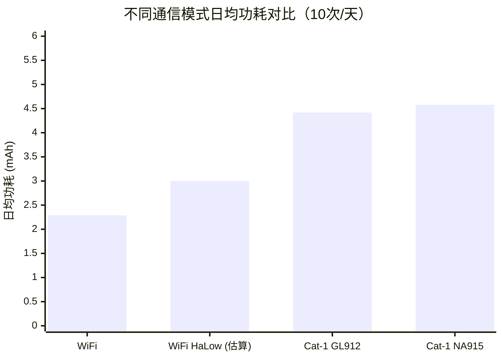

# Battery Recommendation

## 概览

NeoEyes NE101 和 NE301 智能相机默认采用 4 节 AA 电池供电，专为户外低功耗场景设计。选择合适的电池直接影响设备的续航时间和工作稳定性。

本文档帮助您理解：

- **电池基本概念**：常见电池类型、技术参数和放电能力
- **设备兼容性**：NE101/NE301 适配的电池规格及性能表现
- **放电能力要求**：不同功能模式（WiFi、Cat-1、WiFi HaLow）对电池的实际要求
- **选型建议**：根据使用场景和环境条件选择最优电池方案

> **适用设备**：NeoEyes NE101 系列、NeoEyes NE301 系列

## 1. 电池基础知识

### 1.1 常见电池类型

AA（5 号）电池是最常见的圆柱形电池规格，直径 14.5mm，高度 50.5mm。根据化学体系不同，AA 电池分为以下几类：

| 电池类型 | 标称电压 | 典型容量 (AA) | 可充电 | 特点 |
|:---|:---|:---|:---:|:---|
| **碱性电池** (Alkaline) | 1.5V | 1800-2850 mAh | ❌ | 超市易购，兼容性好，内阻较高 |
| **锂铁电池** (Li-FeS₂) | 1.5V | 3000 mAh | ❌ | 高能量密度，低内阻，耐极端温度 |
| **镍氢电池** (NiMH) | 1.2V | 600-2750 mAh | ✅ | 可充电但电压不兼容（1.2V/节，4 节仅 4.8V）；自放电率高（20-30%/月） |
| **锂亚/锂离子类** (Li-SOCl₂/14500) | 3.6-3.7V | — | ❌ | 标称电压过高（3.6-3.7V/节），4 节串联达 14.4-14.8V，远超设备额定电压 |

### 1.2 关键技术参数解读

| 参数 | 说明 | 对 NE101/NE301 的影响 |
|:---|:---|:---|
| **标称电压** | 电池正常放电时的平均工作电压 | 设备使用 4 节串联，碱性/锂铁 6.0V（4×1.5V），镍氢仅 4.8V（4×1.2V） |
| **容量（mAh）** | 电池能释放的总电荷量，标称值在低放电电流下测得 | 高电流场景下实际可用容量会低于标称值 |
| **放电电流** | 持续放电（长时间稳定输出）和脉冲放电（短时峰值） | WiFi 峰值 300-500mA，Cat-1 峰值可达 2A |
| **自放电率** | 不使用时自然损失电量的速率 | 户外长期部署需选自放电率低的电池 |
| **内阻** | 电池内部等效电阻，直接决定大电流放电时的电压保持能力 | 内阻越低，脉冲放电时电压下降越小 |

**内阻与放电能力**：内阻是决定电池在高电流场景下表现的核心参数。当电池输出电流时，端电压 = 标称电压 - 电流 × 内阻，**电流越大，端电压下降越严重**。内阻高的电池在大电流放电时，端电压可能骤降到设备最低工作电压以下，导致异常关机。

| 电池类型 | 单节内阻 (Ω) | 自放电率 | 存储寿命 | 工作温度 |
|:---|:---|:---|:---|:---|
| 碱性电池 | 0.15-0.3 | < 3%/年 | 5-10 年 | -20°C ~ 55°C |
| 锂铁电池 | 0.12-0.2 | < 1%/年 | 10-20 年 | -40°C ~ 60°C |
| 镍氢电池 | 0.02-0.05 | 20-30%/月 | 3-5 年 | -20°C ~ 50°C |

> 碱性电池和锂铁电池内阻接近，但锂铁电池在高电流下电压保持能力更好。镍氢电池内阻最低，但因电压和自放电问题不推荐使用（详见第 2 节兼容性分析）。

**内阻对端电压的实际影响**：

以 4 节串联碱性电池为例（内阻约 0.6-1.2Ω）：

| 场景 | 峰值电流 | 电压下降 | 端电压 | 结果 |
|:---|:---|:---|:---|:---|
| WiFi 模块发射 | 500 mA | 0.5A × 0.9Ω = 0.45V | 6.0V - 0.45V = 5.55V | ✅ 可正常工作 |
| Cat-1 模块发射 | 2 A | 2A × 0.9Ω = 1.8V | 6.0V - 1.8V = 4.2V | ⚠️ 接近设备工作电压下限 4.0V，电压裕量不足 |

这就是为什么在不同通信模式下，对电池的放电能力要求差异巨大。

## 2. NE101/NE301 电池规格与兼容性

### 2.1 标配电池方案

NE101 和 NE301 默认使用 4 节 AA 碱性电池供电：

| 参数 | 数值 | 说明 |
|:---|:---|:---|
| 电池数量 | 4 节 | 串联连接 |
| 标称电压 | 6.0V | 4 × 1.5V（新电池约 6.4V） |
| 有效容量 | ~1750 mAh | 基于高品质 AA 电池标称容量 ~2500mAh，扣除约 30% 损耗（含低温衰减、自放电、电压截止预留）后的实际可用容量 |
| 工作电压范围 | 4.0-6.0V | 设备在此范围内正常工作（新电池开路电压可达 6.4V） |

### 2.2 电池兼容性总览

| 电池类型 | 标称电压 (4节) | 兼容性 | 说明 |
|:---|:---|:---:|:---|
| **碱性 AA** (Alkaline) | 6.0V | ✅ 首选 | 易购买、兼容性好，日常使用首选 |
| **锂铁 AA** (Li-FeS₂) | 6.0V | ✅ 推荐 | 低温性能好、内阻低、容量大，高频抓拍和极端环境推荐 |
| **镍氢 AA** (NiMH) | 4.8V | ⚠️ 不推荐 | 标称电压仅 1.2V/节，4 节串联仅 4.8V，虽高于设备最低工作电压 4.0V，但电压裕量有限；自放电率高（20-30%/月），不适合长期无人值守 |
| **碳性 AA** | 6.0V | ❌ 不推荐 | 容量极低（约 600-900 mAh），内阻极高，脉冲放电性能差 |
| **锂亚/锂离子类** (Li-SOCl₂ / 14500) | 14.4-14.8V | ❌ 禁止 | 标称电压 3.6-3.7V/节，4 节串联达 14.4-14.8V，远超设备额定电压，可能损坏设备 |
| **混合使用不同品牌/类型** | — | ❌ 禁止 | 内阻和容量不一致，导致个别电池过放，影响性能和安全性 |

> **品牌建议**：推荐使用知名品牌的碱性电池（如 Energizer、Duracell、Panasonic），品质更稳定，容量虚标少。

### 2.4 电池容量与续航的对应关系

电池的有效容量直接决定了设备的续航时间。以下为 NE301 在不同电池容量下的续航表现（WiFi 模式，每日 5 次抓拍）：

| 电池方案 | 有效容量 | 预计续航 |
|:---|:---|:---|
| 4 节普通碱性 AA（低品质） | ~1200 mAh | 约 2.7 年 |
| 4 节高品质碱性 AA | ~1750 mAh | 约 3.9 年 |
| 4 节锂铁 AA (Li-FeS₂) | ~2400 mAh | 约 5.4 年 |

> **容量说明**：锂铁 AA 电池标称容量为 3000mAh，预留 80% 作为有效容量（~2400mAh），扣除自放电和电压截止预留。碱性 AA 电池有效容量按 ~1750mAh 计算（标称 ~2500mAh × 70%）。

> **详细续航数据**：请参阅 [NE301 电池续航文档](../5-neoeyes-ne301-series/5-ne301-battery-life.md)，包含完整的 WiFi/Cat-1 模式功耗分析和在线续航计算器。

## 3. 不同功能模式下的放电能力要求

NE101 和 NE301 支持多种通信方式，不同通信模块在工作时对电池的放电能力要求差异显著。理解这些差异有助于选择最合适的电池。

> **数据说明**：以下 WiFi 和 Cat-1 模式的功耗数据来自 NE301 官方测试（2026 年 2 月），NE101 的功耗特性与之相近但不完全相同，仅供参考。

### 3.1 WiFi 模式抓拍

WiFi 是功耗最低的通信方式，适合有 WiFi 覆盖的场景。

| 参数 | 数值 |
|:---|:---|
| 工作电流 | 70 mA |
| 工作时长 | ~11 秒 |
| 单次能耗 | 0.214 mAh |
| WiFi 模块峰值电流 | 300-500 mA（瞬时） |

**对电池的要求**：
- WiFi 模块在发射数据时会产生 300-500mA 的瞬时脉冲电流
- 高品质碱性电池在此电流下电压下降约 0.3-0.5V，4 节串联后端电压仍可维持在 5.5V 以上
- **常规品质的碱性电池即可满足 WiFi 模式的放电需求**

### 3.2 Cat-1 模式抓拍

4G Cat-1 模式提供广域覆盖，但功耗显著高于 WiFi。

| 模组版本 | 工作电流 | 工作时长 | 单次能耗 | Cat-1 模块峰值电流 |
|:---|:---|:---|:---|:---|
| GL912（全球版） | 110 mA | ~14 秒 | 0.428 mAh | 500 mA - 2 A（瞬时） |
| NA915（北美版） | 119 mA | ~13.4 秒 | 0.443 mAh | 500 mA - 2 A（瞬时） |

**对电池的要求**：
- Cat-1 模块在注册网络和发送数据时峰值电流可达 **500mA-2A**
- 在 2A 峰值电流下，4 节碱性电池的端电压可能从 6.0V 骤降至 4.2V
- 设备内部电源管理芯片可以处理短时的电压波动，但**品质差的电池可能因内阻过高导致 Cat-1 模块注册网络失败或数据上传中断**
- **建议使用高品质电池**，确保 Cat-1 模式下工作稳定

### 3.3 WiFi HaLow 模式抓拍（NE101 专属）

WiFi HaLow（IEEE 802.11ah）是专为 IoT 设计的低功耗远距离通信协议，仅 NE101 支持。以下功耗数据为基于协议特性的估算值，具体数值请以实际测试为准。

| 参数 | 说明 |
|:---|:---|
| 工作频率 | 868MHz / 915MHz Sub-1GHz |
| 通信距离 | 最远可达 1 km |
| 功耗水平 | 介于 WiFi 和 Cat-1 之间 |
| 峰值电流 | 低于标准 WiFi |

**对电池的要求**：
- WiFi HaLow 模块峰值电流低于标准 WiFi，对电池放电能力要求相对较低
- 但由于通信距离远，信号弱时可能需要更多发射功率，建议使用品质较好的电池

### 3.4 不同模式放电能力要求对比

| 通信模式 | 工作电流 | 峰值电流 | 单次能耗 | 对电池放电能力要求 | 推荐电池 |
|:---|:---|:---|:---|:---|:---|
| **WiFi** | 70 mA | 300-500 mA | 0.214 mAh | 低 | 高品质碱性电池即可 |
| **WiFi HaLow** | ~80 mA | 200-400 mA | ~0.25 mAh | 低-中 | 高品质碱性电池 |
| **Cat-1 (GL912)** | 110 mA | 500 mA-2 A | 0.428 mAh | **高** | 高品质碱性电池或锂铁电池 |
| **Cat-1 (NA915)** | 119 mA | 500 mA-2 A | 0.443 mAh | **高** | 高品质碱性电池或锂铁电池 |

### 3.5 碱性电池在不同模式下的表现差异

碱性电池在不同负载下的实际可用容量差异显著：WiFi 模式（70mA 低负载）下容量利用率约 70%，表现良好；Cat-1 模式（峰值 2A 高负载脉冲）下利用率降至约 40-50%，且内阻导致电压波动可能影响模块稳定性，**建议 Cat-1 模式使用锂铁电池以获得更稳定性能**。

**关键发现**：Cat-1 模式的日均功耗是 WiFi 模式的 **1.9-2.0 倍**，对电池的放电能力要求也显著更高。如果使用 Cat-1 模式，选用性能更好的电池（如锂铁电池）可以有效提升工作稳定性。

## 4. 电池选型建议

### 4.1 按使用场景推荐

| 使用场景 | 通信模式 | 推荐电池 | 预计续航 | 说明 |
|:---|:---|:---|:---|:---|
| 室内/近距监控 | WiFi | 高品质碱性 AA | 2-13 年 | 兼容性最好（1-10次/天） |
| 户外环境监测 | WiFi | 锂铁 AA (Li-FeS₂) | 2.9-18 年 | 低温性能好，寿命长（1-10次/天） |
| 偏远地区监控 | Cat-1 | 锂铁 AA (Li-FeS₂) | 1.5-11.5 年 | 确保 Cat-1 模块工作稳定（1-10次/天） |
| 超长续航需求 | WiFi/Cat-1 | 锂铁 AA (Li-FeS₂) | 2.9-18 年 | 优先选择锂铁电池获得更长续航 |
| 开发测试阶段 | WiFi/Cat-1 | 高品质碱性 AA | - | 易获取，适合频繁测试 |

> **续航计算说明**：以上续航基于 NE301 官方功耗数据估算，锂铁 AA 电池标称容量 3000mAh，预留 20% 损耗后有效容量约 2400mAh。实际续航受环境温度、信号强度等因素影响。

### 4.2 环境因素考量

**温度影响**：

| 温度范围 | 碱性电池表现 | 锂铁电池表现 | 建议 |
|:---|:---|:---|:---|
| 20-25°C（常温） | 100%（基准） | 100%（基准） | 两种电池均可 |
| 0-10°C（低温） | 降至 70-80% | 90-95% | 低温环境推荐锂铁电池 |
| -10-0°C（严寒） | 降至 40-60% | 80-85% | 严寒环境必须使用锂铁电池 |
| 30-40°C（高温） | 90-95% | 95-100% | 两种电池均可，注意散热 |
| >50°C（极高温） | 降至 70-80% | 90-95% | 避免阳光直射设备 |

> **重要**：NE101/NE301 的工作温度范围为 -20°C ~ 60°C。在寒冷地区部署时，碱性电池性能会大幅下降，强烈建议使用锂铁电池（Li-FeS₂），其工作温度范围为 -40°C ~ 60°C，低温性能远优于碱性电池。

**湿度与防护**：NE101/NE301 均达到 IP67 防护等级，电池仓密封良好，在潮湿环境下无需额外防护措施。

### 4.3 常见误区与注意事项

| 误区 | 事实 |
|:---|:---|
| "容量越大的电池续航越长" | 标称容量是在低放电电流下测得的，高电流场景下实际可用容量可能大幅缩水 |
| "充电电池更耐用" | 镍氢充电电池自放电率高（20-30%/月），不适合长期无人值守的户外场景 |
| "混合使用旧电池没关系" | 不同电池内阻不一致会导致个别电池过放，影响整体性能，应同时更换全部 4 节电池 |
| "碳性电池也能用" | 碳性电池容量仅为碱性的 1/3，内阻更高，在脉冲放电场景下性能极差，综合续航反而更短 |
| "Cat-1 模式下用品质差一点也没关系" | Cat-1 模块峰值电流大，品质差的电池可能导致网络注册失败或频繁掉线 |

**使用建议**：
- 更换电池时应**同时更换全部 4 节**，确保电池一致性
- 长期不使用设备时，应**取出电池**防止漏液损坏设备
- 在低温环境部署前，建议在室温下激活电池（使用几次后再安装到设备中）

## 5. 延伸阅读

- **[NE301 电池续航文档](../5-neoeyes-ne301-series/5-ne301-battery-life.md)**：包含完整的功耗分析、续航计算公式和典型应用案例
- **[NE301 电池续航计算器](https://www.camthink.ai/tools/battery-calculator/)**：在线工具，自定义通信模式和抓拍频率，实时计算续航时间

---

**文档版本**：v1.1
**最后更新**：2026-04-07
