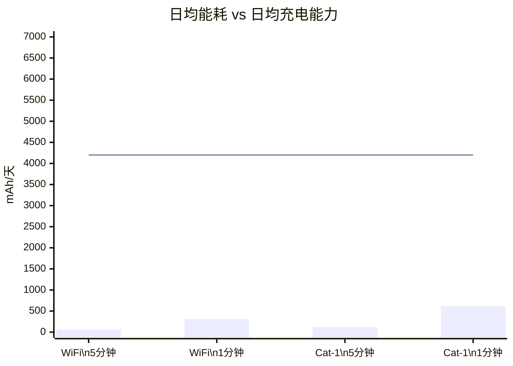

# Solar Power Solution

> **验证状态**：本方案已通过实际部署验证 ✅
>
> **适用设备**：NeoEyes NE101 系列、NeoEyes NE301 系列

---

## 1. 方案概述

### 客户需求

在户外无电网覆盖的场景（如农业监测、工地监控、智慧城市等）中，NE101/NE301 智能相机需要长时间稳定运行并持续抓拍。传统的 AA 电池方案虽然续航可达数年，但仅适合低频触发（1-10 次/天）场景。当用户需要**高频或持续抓拍**时，AA 电池方案电池续航会明显缩短。

本方案采用太阳能光伏板 + 7AH 可充电电池的组合，光伏板白天充电、电池为设备持续供电，实现**全天候无限续航**。

### 方案架构

### 核心优势

- **无限续航**：10W 光伏板日均充电 4200-7000 mAh，远超设备最大功耗（637 mAh/天），实现能量正循环
- **高频持续抓拍**：即使在 1 分钟/次（1440 次/天）Cat-1 模式下仍可持续运行，突破 AA 电池方案的频率限制
- **免维护设计**：无需人工更换电池，一次部署长期运行，大幅降低运维成本
- **快速部署**：组件简洁（光伏板 + 箱式电池 + DC 线），壁装或杆装均可，10 分钟内完成安装

### 物料清单（BOM）

| 物料 | 规格 | 数量 | 用途 |
|------|------|------|------|
| **智能相机** | NeoEyes NE101 或 NE301 | 1 | 边缘 AI 抓拍与数据上报 |
| **太阳能供电套件** | 10W 光伏板 + 7AH 可充电电池 | 1 | 太阳能充电与储能，含箱式电池、DC 线及喷箍安装支架 |

> **供电接口**：NE101/NE301 使用电池仓背面的电源接口直接取电，太阳能套件 DC 线无缝衔接，无需额外开孔。

---

## 2. 硬件连接

### 连接步骤

| 步骤 | 操作 | 说明 |
|------|------|------|
| 1 | 固定光伏板 | 安装在无遮挡位置，面板朝南（北半球），倾斜 30-45° |
| 2 | 固定箱式电池 | 使用喷箍固定于墙面或立杆，避免阳光直射 |
| 3 | 连接光伏板与电池 | 使用套件标配线缆，按极性连接 |
| 4 | 连接 DC 供电线 | 一端接箱式电池 DC 5V 输出，另一端接相机电池仓背面电源接口 |

### 安装方式

| 安装方式 | 适用场景 | 说明 |
|----------|----------|------|
| **壁装** | 建筑外墙、围栏、桥墩 | 使用喷箍固定于平整墙面 |
| **杆装** | 立杆、灯杆、树干 | 使用喷箍环绕固定于圆柱形支撑物 |

**安装建议**：

- 光伏板安装在无遮挡、日照充足的位置
- DC 线走线使用防水胶圈或防水胶带密封穿线孔
- 相机与光伏板之间距离建议不超过 3 米

### 抓拍频率配置

通过 Web UI（**抓拍设置 → 定时抓拍**）设置抓拍间隔，支持秒级和分钟级配置。不同场景推荐频率参见[功耗与续航表格](#不同频率的日均功耗与续航)。

---

## 3. 功耗与续航分析

### 设备功耗

以下数据来自 NE301 官方测试，NE101 功耗特性相近：

| 通信模式 | 工作电流 | 工作时长 | 单次能耗 | 峰值电流 |
|----------|----------|----------|----------|----------|
| WiFi | 70 mA | ~11 s | 0.214 mAh | 300-500 mA |
| Cat-1 GL912（全球版） | 110 mA | ~14 s | 0.428 mAh | 500 mA-2 A |
| Cat-1 NA915（北美版） | 119 mA | ~13.4 s | 0.443 mAh | 500 mA-2 A |

> 休眠功耗：6.1 μA（约 0.15 mAh/天），可忽略不计。

### 不同频率的日均功耗与续航

| 抓拍频率 | 日均功耗 (WiFi) | 日均功耗 (Cat-1) | 7AH 电池可支撑 |
|----------|-----------------|-------------------|----------------|
| 30 分钟/次 | 10.27 mAh | 20.54 mAh | WiFi ~682 天 / Cat-1 ~341 天 |
| 15 分钟/次 | 20.54 mAh | 41.09 mAh | WiFi ~341 天 / Cat-1 ~170 天 |
| 5 分钟/次 | 61.63 mAh | 123.26 mAh | WiFi ~114 天 / Cat-1 ~57 天 |
| 1 分钟/次 | 308.16 mAh | 616.32 mAh | WiFi ~23 天 / Cat-1 ~11 天 |

### 太阳能充电与可持续性

10W 光伏板在日均 4-5 小时峰值日照下，考虑 ~70% 充电转换效率，日均充电量约 **4200-7000 mAh**，远超设备最大日均功耗：

> 虚线为日均最低充电量（4200 mAh）。即使在 1 分钟/次 Cat-1 模式下，充电量仍为功耗的 6.8 倍。

**阴天兜底**：7AH（7000 mAh）电池在连续无充电情况下，WiFi 5 分钟/次可支撑约 114 天，Cat-1 1 分钟/次可支撑约 11 天。实际续航受温度、电池老化等因素影响。

---

## 4. 效果演示

<video controls width="100%">
  <source src="https://resources.camthink.ai/wiki/img/hardware-dev-resources/solar-power-solution/solar-short.mov" type="video/mp4"></source>
  您的浏览器不支持视频播放。
</video>

---

**文档版本**：v1.0
**最后更新**：2026-04-13
