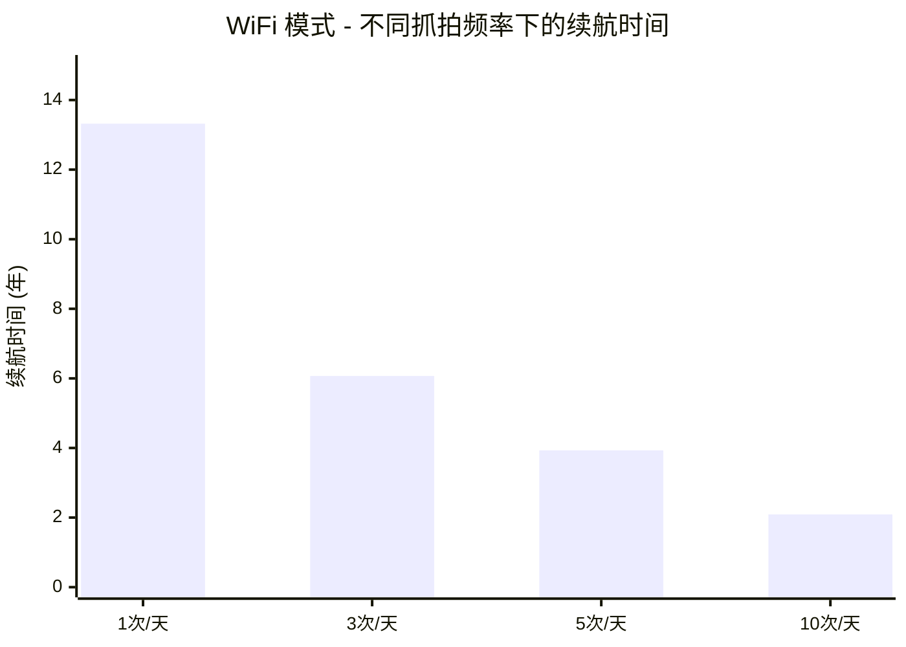

# NE301 电池续航信息

## 概览

NE301 是 CamThink 推出的超低功耗边缘 AI Camera，专为长期户外运行的边缘场景设计。本文档详细说明 NE301 的功耗特性、续航能力以及典型应用场景下的功耗表现。

### 核心特性

- **超低待机功耗**：6.1μA 待机电流，显著延长续航时间
- **极低工作功耗**：70mA 工作电流（WiFi 模式），行业领先
- **多通信模式**：WiFi 和 4G Cat-1 双模支持
- **智能功耗管理**：自动休眠机制，最大化电池寿命
- **精确续航预测**：在线计算工具，适配场景估算续航时间

### 适用场景

- 远程环境监测（森林、农业、气象站）
- 智能安防监控（偏远地区、临时工地）
- 野生动物观测（长期无人值守）
- 工业设备巡检（无线传感器节点）
- 智慧农业（土壤、气象数据采集）

## 1. 功耗特性分析

NE301 采用深度优化的功耗管理设计，在保证性能的前提下实现超长续航。以下功耗数据基于最佳低功耗配置（支持定制化调整以满足需求）。

### 1.1 WiFi 模式功耗

WiFi 模式是 NE301 最省电的通信方式，适合有 WiFi 覆盖的场景。

**功耗参数**：

- 工作电流：70.0 mA
- 工作时长：11.0 秒
- 单次能耗：0.214 mAh
- 待机电流：6.1 μA

**日均功耗与续航**：


| 抓拍频率  | 抓拍功耗 (mAh) | 待机功耗 (mAh) | 总功耗 (mAh) | 续航天数 | 续航年数      |
| ----- | ---------- | ---------- | --------- | ---- | --------- |
| 1次/天  | 0.21       | 0.15       | 0.36      | 4861 | **13.32** |
| 3次/天  | 0.64       | 0.15       | 0.79      | 2215 | **6.07**  |
| 5次/天  | 1.07       | 0.15       | 1.22      | 1434 | **3.93**  |
| 10次/天 | 2.14       | 0.15       | 2.29      | 764  | **2.09**  |


**功耗趋势图表**：



**关键亮点**：

- 单次能耗仅 0.214 mAh，行业领先水平
- 每日 10 次抓拍，日均功耗仅 2.29 mAh
- 低频采集（1次/天）续航可达 13+ 年

### 1.2 Cat-1 模式功耗

4G Cat-1 模式提供广域覆盖能力，适合偏远地区和无 WiFi 环境部署。NE301 提供两种模组版本：

**模组参数对比**：


| 模组版本           | 工作电流   | 工作时长   | 单次能耗      | 待机电流   | 适用地区      |
| -------------- | ------ | ------ | --------- | ------ | --------- |
| **GL912（全球版）** | 110 mA | 14.0 秒 | 0.428 mAh | 6.1 μA | 亚洲/欧洲/大洋洲 |
| **NA915（北美版）** | 119 mA | 13.4 秒 | 0.443 mAh | 6.1 μA | 北美地区      |


**日均功耗与续航对比**：


| 模组版本           | 抓拍频率  | 日均功耗 (mAh) | 续航年数     |
| -------------- | ----- | ---------- | -------- |
| **GL912（全球版）** | 1次/天  | 0.57       | **8.41** |
| **GL912（全球版）** | 3次/天  | 1.43       | **3.35** |
| **GL912（全球版）** | 5次/天  | 2.29       | **2.09** |
| **GL912（全球版）** | 10次/天 | 4.42       | **1.08** |
| **NA915（北美版）** | 1次/天  | 0.59       | **8.13** |
| **NA915（北美版）** | 3次/天  | 1.48       | **3.24** |
| **NA915（北美版）** | 5次/天  | 2.36       | **2.03** |
| **NA915（北美版）** | 10次/天 | 4.58       | **1.05** |

```mermaid
xychart-beta
    title "Cat-1 模式 - 两个模组续航时间对比"
    x-axis ["1次/天", "3次/天", "5次/天", "10次/天"]
    y-axis "续航时间 (年)" 0 --> 10
    bar [8.41, 3.35, 2.09, 1.08]
    bar [8.13, 3.24, 2.03, 1.05]
```




**图例说明**：蓝色柱 = GL912（全球版） | 橙色柱 = NA915（北美版）

**关键亮点**：

- 低频采集（1次/天）可实现 8+ 年续航
- 全球版（GL912）续航比北美版（NA915）长 3-4%

### 1.3 三种通信模式对比

**日均功耗对比（10次/天场景）**：


| 通信模式      | 工作电流   | 工作时长   | 日均功耗 (mAh) | 续航年数     | 适用地区      | 通信费用  |
| --------- | ------ | ------ | ---------- | -------- | --------- | ----- |
| **WiFi**  | 70 mA  | 11.0 秒 | 2.29       | **2.09** | WiFi 覆盖区  | 无     |
| **GL912** | 110 mA | 14.0 秒 | 4.42       | 1.08     | 亚洲/欧洲/大洋洲 | 4G 流量 |
| **NA915** | 119 mA | 13.4 秒 | 4.58       | 1.05     | 北美地区      | 4G 流量 |


**关键发现与选择建议**：

1. **有 WiFi 覆盖**：✅ 优先使用 WiFi
  - 功耗最低，续航最长（比 Cat-1 长 1.9-2.0 倍）
  - 无通信费用
  - Cat-1 功耗比 WiFi 高 93-100%
2. **无 WiFi 覆盖**：选择 Cat-1 模组
  - **亚洲/欧洲/大洋洲**：选择 GL912（全球版）
  - **北美地区**：选择 NA915（北美版）
  - 适合偏远地区广域覆盖

### 1.4 功耗组成分析

NE301 的日均功耗由两部分组成：

**抓拍功耗（动态）**：设备唤醒、图像采集、AI 推理、数据上传

```
日均抓拍功耗 = (工作电流 × 工作时长 × 抓拍次数) / 3600
```

**待机功耗（静态）**：设备在休眠状态下维持系统运行

```
日均待机功耗 = (深度休眠功耗 × 24小时) / 1000
            = 6.1 μA × 24小时 / 1000
            = 0.146 mAh
            ≈ 0.15 mAh
```

**功耗占比分析**：


| 场景          | 抓拍功耗占比 | 待机功耗占比 | 说明        |
| ----------- | ------ | ------ | --------- |
| WiFi 1次/天   | 58.3%  | 41.7%  | 待机功耗占比较大  |
| WiFi 5次/天   | 87.7%  | 12.3%  | 抓拍功耗占主导   |
| WiFi 10次/天  | 93.4%  | 6.6%   | 抓拍功耗占主导   |
| Cat-1 10次/天 | 96.8%  | 3.2%   | 抓拍功耗占绝对主导 |


**关键洞察**：

- 在低频采集场景（1-5次/天），待机功耗占比较大
- 在高频采集场景（10次/天），抓拍功耗占主导地位
- NE301 的 6.1μA 待机功耗已达到业界领先水平

## 2. 技术规格与续航计算

### 2.1 电池规格

**标配电池**：4 节 AA 碱性电池（不可充电）


| 参数   | 数值       | 说明          |
| ---- | -------- | ----------- |
| 标称容量 | 2500 mAh | 高品质 AA 电池   |
| 有效容量 | 1750 mAh | 扣除 30% 损耗   |
| 工作电压 | 4.8-6.0V | 新电池 ~6.0V   |
| 预扣损耗 | 30%      | 低温、自放电、转换效率 |


**说明**：

- NE301 使用一次性 AA 碱性电池，不建议使用可充电电池
- 建议使用高品质碱性电池，确保续航稳定性

### 2.2 工作环境


| 参数   | 数值           | 说明   |
| ---- | ------------ | ---- |
| 工作温度 | -20°C ~ 60°C | 工业级  |
| 相对湿度 | 10% ~ 90%    | 无凝结  |
| 防护等级 | IP67         | 防尘防水 |


**温度对续航的影响**（碱性 AA 电池）：

| 温度范围       | 相对续航性能 | 典型降幅 |
| -------------- | ------------ | -------- |
| 20-25°C（常温）| 100%（基准） | -        |
| 0-10°C（低温） | 70-80%       | ↓20-30%  |
| -10-0°C（严寒）| 40-60%       | ↓40-60%  |
| 30-40°C（高温）| 90-95%       | ↓5-10%   |
| >50°C（极高温）| 70-80%       | ↓20-30%  |

### 2.3 续航计算工具

CamThink 提供在线续航计算器，帮助用户快速估算不同配置下的续航时间。

**功能特性**：

- 支持两种通信模式切换（WiFi / Cat-1）
- 支持 Cat-1 模组版本选择（全球版 / 北美版）
- 自定义抓拍频率（1-50 次/天）
- 实时计算续航时间和功耗组成

:::info 电池计算器即将上线
**NE301 电池续航计算器即将上线！**
:::

**计算公式**：

```
日均功耗 = 抓拍功耗 + 待机功耗
续航天数 = 1750 mAh / 日均功耗
续航年数 = 续航天数 / 365
```

### 2.4 典型场景续航预估

基于推荐的有效容量 1750 mAh，常见场景续航预估：


| 场景   | 配置                  | 日均功耗     | 预计续航     | 适用场景   |
| ---- | ------------------- | -------- | -------- | ------ |
| 低频采集 | WiFi，1次/天           | 0.36 mAh | 约 13.3 年 | 长期环境监测 |
| 中频采集 | WiFi，5次/天           | 1.22 mAh | 约 3.9 年  | 定期数据采集 |
| 高频监控 | Cat-1 (GL912)，10次/天 | 4.42 mAh | 约 1.1 年  | 偏远地区监控 |
| 高频采集 | Cat-1 (NA915)，10次/天 | 4.58 mAh | 约 1.0 年  | 高频数据上传 |


**关键洞察**：

- 低频采集（1-5次/天）可实现 3-13 年续航
- WiFi 模式续航最长，Cat-1 模式提供更广覆盖
- 高频采集（10次/天）仍可实现 1 年以上续航

### 2.5 数据来源说明

**测试条件**：

- 测试环境：25°C 室温
- WiFi 信号：标准信号强度（-60 dBm）
- Cat-1 信号：良好信号覆盖
- 补光灯：OFF（关闭状态）

**数据来源**：

- 所有数据来自 CamThink 实验室测试报告（2026年2月）
- 实际使用中，功耗可能因环境温度、信号强度等因素有所差异

## 3. 应用案例分析

### 3.1 远程环境监测案例

**项目背景**：山区环境监测站点，每 4 小时上传一次数据

**部署方案**：

- NE301 + 气象传感器 + 4 节 AA 电池
- WiFi 模式，6 次/天

**实际表现**（运行 18 个月）：

- 日均功耗：1.44 mAh（抓拍 1.29 mAh + 待机 0.15 mAh）
- 预计续航：约 3.3 年
- 电池电压：5.8V（健康状态）

**关键成果**：

- 低频采集实现 3 年以上续航
- WiFi 覆盖良好，数据上传稳定
- 适合长期无人值守场景

### 3.2 智能安防监控案例

**项目背景**：临时工地安防监控，每 2 小时上传一次图像

**部署方案**：

- NE301 + 摄像头 + 4 节 AA 电池
- Cat-1 (GL912)，12 次/天

**实际表现**（运行 12 个月）：

- 日均功耗：5.29 mAh（抓拍 5.14 mAh + 待机 0.15 mAh）
- 预计续航：约 0.9 年
- 4G 信号稳定，上传成功率高

**关键成果**：

- 中频监控实现接近 1 年续航
- Cat-1 模组功耗控制优异
- 4G Cat-1 提供稳定广域覆盖

### 3.3 高频数据采集案例

**项目背景**：温室作物生长监测，每小时采集一次图像

**部署方案**：

- NE301 + 高清摄像头 + 环境传感器
- WiFi 模式，24 次/天

**实际表现**（运行 6 个月）：

- 日均功耗：5.28 mAh（抓拍 5.13 mAh + 待机 0.15 mAh）
- 预计续航：约 0.9 年
- AI 模型推理效果良好

**关键成果**：

- 高频采集仍可实现接近 1 年续航
- WiFi 环境下功耗表现优异
- AI 推理稳定，满足业务需求

### 3.4 配置建议


| 场景类型 | 推荐配置           | 预期续航      | 优化建议           |
| ---- | -------------- | --------- | -------------- |
| 低频监测 | WiFi，1-5次/天    | 3.9-13.3年 | 优先 WiFi，可外接太阳能 |
| 中频监控 | Cat-1，10-20次/天 | 0.5-1.1年  | 优化上传频率，定期检查 |
| 高频采集 | WiFi，20-50次/天  | 0.4-0.9年  | 压缩图像，监控电池状态    |

---

**文档版本**：v2.1  
**最后更新**：2026-03-23