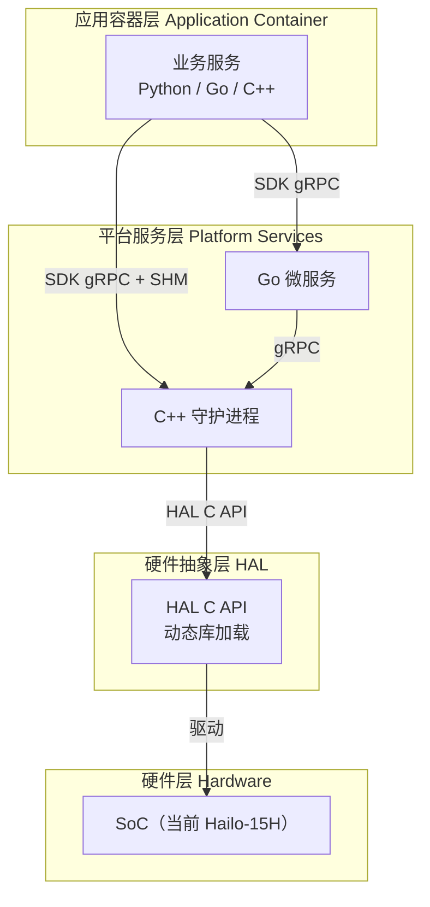
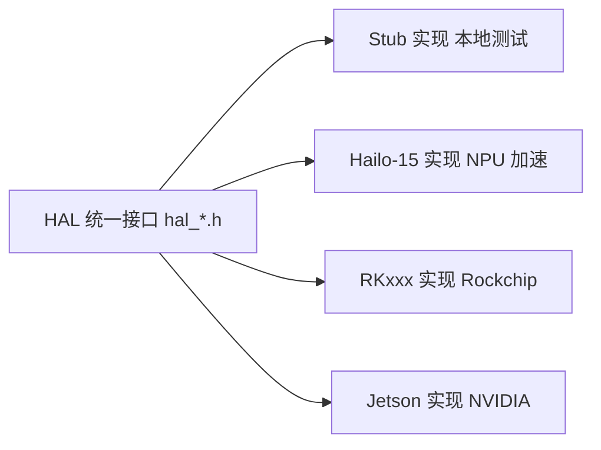
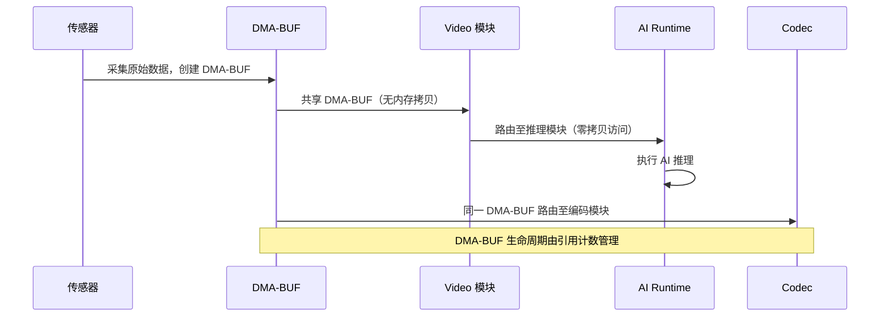

# System Architecture

NE503 AIPC（AI IPC）平台是一个面向边缘 AI 计算的完整软件栈，采用四层分层架构设计，支持多 SoC 平台（Hailo-15 / RKxxx / Jetson）通过硬件抽象层实现平滑迁移。本文档详细介绍平台各层架构、核心服务、数据流和安全模型。

## 1. 四层架构总览



| 层级 | 职责 | 技术 |
|:---|:---|:---|
| 应用容器层 | 第三方 AI 应用、模型推理管线 | Python/Go/C++，容器化运行 |
| 平台服务层 | 摄像头管理、AI 推理、容器管理、事件分发、设备控制、API 网关、设备发现 | Go 微服务 + C++ 守护进程 |
| 硬件抽象层 | 统一硬件接口，解耦平台服务与 SoC | C/C++ 函数指针表（Ops），DMA-BUF 零拷贝 |
| 硬件层 | SoC、NPU、ISP、传感器、MCU | Hailo-15H（当前）、RKxxx / Jetson（可扩展） |

---

## 2. 平台服务层

平台服务层包含多个微服务，通过 gRPC over Unix Domain Socket 进行内部通信。

### 2.1 服务总览

| 服务 | 语言 | 监听地址 | 职责 |
|:---|:---|:---|:---|
| **ai-runtime** | C++ | `unix:///run/aipc/ai-runtime.sock` | AI 模型管理与推理调度，NPU 资源分配，GenAI 流式推理 |
| **app-manager** | Go | `unix:///run/aipc/app-manager.sock` | 容器应用生命周期管理（安装/启动/停止/卸载），基于 containerd |
| **event-bus** | Go | `unix:///run/aipc/event-bus.sock` + TCP `127.0.0.1:50053` | 发布/订阅消息总线，MQTT 风格通配符匹配 |
| **device-control** | Go | `unix:///run/aipc/device-control.sock` | 硬件外设控制（灯光/PTZ/镜头/GPIO），MCU UART 通信 |
| **device-discovery** | Go | `unix:///run/aipc/device-discovery.sock` | 网络设备发现（CT-Disc 协议），设备注册与状态管理 |
| **platform-api** | Go | `:8080` | HTTP/RESTful API 网关，代理所有后端 gRPC 服务 |
| **camera-daemon** | C++ | `unix:///run/aipc/camera.sock`（FD 发布）+ `unix:///run/aipc/camera-control.sock`（gRPC 控制）+ `/run/aipc/shm/`（SHM） | 视频采集、双通道帧分发（FD/SHM）、编码、RTSP 流媒体 |

### 2.2 gRPC API 定义

平台通过 Protocol Buffers 文件定义所有 gRPC 接口：

| Proto 文件 | 服务 | 说明 |
|:---|:---|:---|
| `inference.proto` | AI 推理 | 模型注册/推理/流式推理/GenAI 会话管理 |
| `app.proto` | 容器管理 | 应用安装/生命周期 + 容器/镜像/资源管理 |
| `event.proto` | 事件总线 | 发布/订阅，MQTT 风格通配符，主题统计 |
| `device.proto` | 设备控制 | 灯光/PTZ/镜头（含 AF0832）/GPIO/环境/告警/RS485 |
| `camera.proto` | 摄像头管理 | 视频采集管道、RTSP 流媒体、OSD 叠加 |
| `lens_hal.proto` | 镜头控制 | `device.proto` 镜头部分的 HAL 桥接实现 |
| `discovery.proto` | 设备发现 | CT-Disc 协议设备发现、监听与扫描 |

> 各 proto 的完整操作列表见对应的服务参考文档。

---

## 3. 硬件抽象层（HAL）


### 3.1 HAL 接口总览

HAL 头文件按组件子目录组织，位于 `hal_v2/include/`：

| 目录 | 覆盖功能 |
|:---|:---|
| `media/` | 视频采集、编码（H.264/H.265）、OSD 叠加、ISP、音频、Profile 管理 |
| `model/` | 模型推理、后处理（NMS）、GenAI（LLM/VLM）、可视化绘制、CLIP 文本编码 |
| `dsp/` | 裁剪、缩放、格式转换、隐私遮罩、防抖 |
| `peripheral/` | MCU 通信、GPIO/传感器；设备层含 LED、镜头、告警、RS485、RTC、OTA 等 |
| `common/` | 公共枚举/错误码、`HalFrameBuffer` 帧缓冲、基础类型、日志 |

> 各服务消费的具体子接口（如 `HalInferenceOps`、`HalPostprocessOps` 等）详见对应的服务参考文档。

### 3.2 核心数据结构：HalFrameBuffer

`HalFrameBuffer` 是平台的核心帧数据载体，用于在视频采集、AI 推理、编码等模块间传递帧数据。

**数据封装：**
- **图像元数据**：宽高、像素格式、时间戳
- **内存描述**：DMA-BUF fd、虚拟地址、stride/size
- **私有数据**：通过 `priv` 指针透传平台特定信息

- **内存模式**：支持 DMA-BUF（零拷贝）和 CPU Memory 两种。视频→AI→编码全链路共享同一 DMA-BUF，无需内存拷贝。
- **生命周期**：通过引用计数管理（`hal_frame_buffer_ref` / `hal_frame_buffer_release`）。

> 完整结构体定义见 GitHub 仓库 `hal_v2/include/common/` 目录。

### 3.3 多平台支持



当前实现：Hailo-15（完整）+ Stub（完整桩实现，无硬件开发用）。RKxxx 和 Jetson 可通过实现对应的 HAL 接口扩展支持。

---

## 4. Web 控制台

Web 控制台基于 React 19 + TypeScript + Vite 构建，提供设备管理、视频监控、AI 模型管理、应用管理、系统监控等功能。

| 技术栈 | 组件 |
|:---|:---|
| 框架 | React 19 + TypeScript |
| 构建 | Vite |
| 状态管理 | Zustand |
| 数据获取 | TanStack Query |
| UI 组件 | shadcn/ui + Radix |
| 测试 | Vitest |

Web 控制台通过 REST API 和 WebSocket 与 platform-api 通信，实时推送 AI 推理结果和设备事件。

访问地址：`http://<设备IP>:8080`。

---

## 5. 容器隔离与安全

NE503 采用多层纵深防御架构，核心原则：**最小权限、访问路径收敛、显式授权**。

### 5.1 安全分层模型

```
┌──────────────────────────────────────────────┐
│          应用容器层                            │
│   Namespaces / Seccomp / Capabilities        │
│   Cgroup / ReadOnly Rootfs                   │
└────────────────┬─────────────────────────────┘
                  │ gRPC over Unix Socket（组权限控制）
┌────────────────┴─────────────────────────────┐
│          平台服务层                            │
│   认证 / 权限收敛 / 审计日志                   │
└────────────────┬─────────────────────────────┘
                  │ HAL C API
┌────────────────┴─────────────────────────────┐
│          硬件层                                │
│   TrustZone / Secure Boot                     │
└──────────────────────────────────────────────┘
```

### 5.2 容器隔离机制

应用容器通过 Linux 内核机制实现多层隔离：

| 隔离层 | 机制 | 说明 |
|:---|:---|:---|
| 进程隔离 | Namespaces | PID / NET / IPC / UTS / MOUNT 等命名空间隔离 |
| 系统调用过滤 | Seccomp BPF | 白名单模式，仅允许安全系统调用 |
| 能力裁剪 | Capabilities | 移除危险能力（如 `CAP_SYS_ADMIN`） |
| 资源限制 | Cgroups | CPU、内存、进程数限制 |
| 文件系统 | ReadOnly Rootfs | 只读根文件系统 + No New Privileges |

### 5.3 访问路径收敛

所有资源访问必须经过平台服务，容器无法直接访问硬件。Unix Socket 权限通过 Linux 组（AIPC group GID）控制，仅在容器启动时自动注入 Main 容器，Sub 容器无法访问任何 Socket。

### 5.4 声明式权限模型

应用通过 `app.yaml` 的 `permissions` 字段声明式声明所需权限（视频流、推理模型、事件主题、设备控制、网络出站等），未声明的权限默认不可访问。详见 [应用开发参考](../4-application-guide/1-app-development/1-app-reference.md)。

### 5.5 网络安全

| 模式 | 说明 |
|:---|:---|
| **Isolated（默认）** | 无网络访问，仅通过 SDK 与平台服务通信 |
| **Bridge（仅多容器）** | 通过 `aipc-br0` 网桥，出站白名单控制 |
| **Host** | 共享宿主机网络栈 |

Platform API 支持可选的 Bearer Token（JWT）认证，公开端点仅 `/api/login` 和 `/api/v1/system/health`。

### 5.6 多容器安全边界

| 角色 | 权限 |
|:---|:---|
| **Main 容器** | 获得平台 Socket 访问权限，可调用 AI 推理、事件总线等 |
| **Sub 容器** | 完全隔离，仅通过共享网络命名空间与 Main 容器内部通信 |

---

## 6. 关键技术特性

### 6.1 零拷贝优化



核心机制：
- `HalFrameBuffer` 通过 `dma_fds[]` 传递 DMA-BUF 文件描述符，视频→AI→编码全程零拷贝
- 引用计数管理帧生命周期（`hal_frame_buffer_ref` / `hal_frame_buffer_release`）
- AI Runtime 与 Camera Daemon 之间通过 `SCM_RIGHTS` 传递 FD（无需内存拷贝）

### 6.2 事件驱动架构

Event Bus 采用发布/订阅模式，支持 MQTT 风格通配符匹配：

| 模式 | 说明 | 示例 |
|:---|:---|:---|
| 精确匹配 | 完全匹配主题名 | `app/myapp/status` |
| ``*`` 单级通配 | 匹配一个层级 | `app/*/status` |
| ``**`` 多级通配 | 匹配多个层级 | `model/**/detections` |

所有服务产生的推理结果、容器事件、设备事件均通过 Event Bus 分发，第三方应用通过 SDK 的 `EventClient` 订阅感兴趣的主题。

### 6.3 容器化应用平台

- 基于 containerd 运行时，OCI 标准镜像部署
- 多容器支持（Main + Sub），插件化依赖解析
- 健康检查系统（Command / HTTP / TCP，指数退避策略）
- 自动重启（故障时 backoff 策略）

---

## 7. 系统配置

平台使用 YAML 配置文件管理所有服务参数，配置文件位于 `configs/` 目录：

| 配置文件 | 服务 | 核心配置项 |
|:---|:---|:---|
| `platform-api.yaml` | platform-api | 服务器端口、认证密钥、日志级别 |
| `platform/app-manager.yaml` | app-manager | containerd 连接、安全策略、资源限制 |
| `platform/event-bus.yaml` | event-bus | Socket 路径、TCP 监听、主题 ACL |
| `platform/device-control.yaml` | device-control | MCU UART 设备、镜头参数、自动化规则 |
| `platform/camera-daemon.yaml` | camera-daemon | 视频采集、编码参数、RTSP 配置 |
| `platform/discovery.yaml` | device-discovery | CT-Disc 协议参数 |
| `ai/ai-runtime.yaml` | ai-runtime | HAL 库路径、模型仓库、调度器、自动推理管道 |
| `preload.yaml` | pack-factory | 工厂预装（预装模型与应用） |
| `security/seccomp-default.json` | 安全 | 默认 Seccomp 系统调用白名单 |

安装位置：`/opt/aipc/`（二进制 `bin/`、配置 `etc/`）。

---

## 8. 相关文档

- [应用开发指南](../4-application-guide/1-app-development/1-app-reference.md) — 如何编写和部署容器应用
- [Python SDK 参考](../4-application-guide/1-app-development/2-sdk-reference.md) — SDK API 签名与使用示例
- [RESTful API 参考](../4-application-guide/2-3rd-party-integration/0-restful-api.md) — HTTP API 端点完整参考
- [平台服务总览](./4-reference/0-platform-services.md) — 各服务职责、协作关系与源码指针
