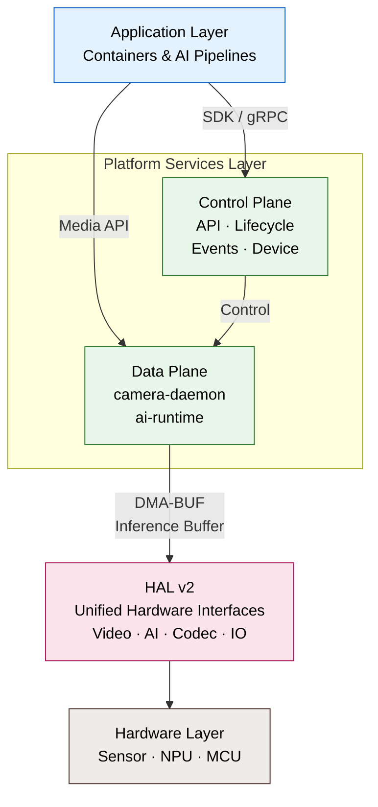
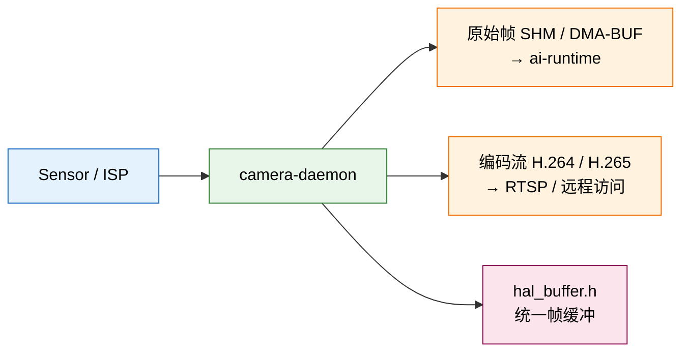
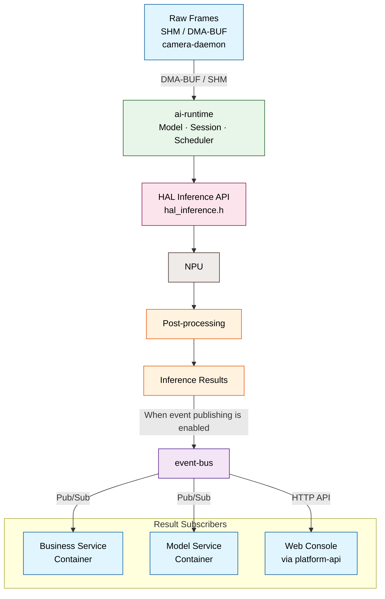
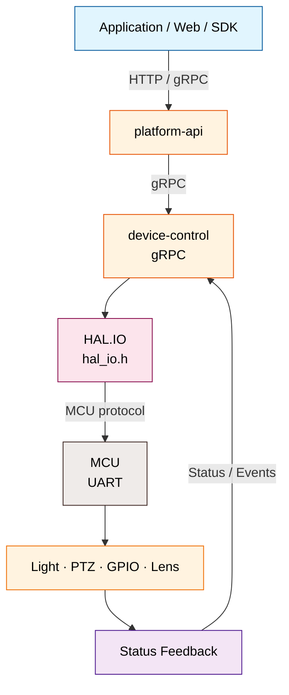

# System Architecture

NE503 的软件平台可以看成四层：**应用容器 → 平台服务 → HAL 硬件抽象 → 硬件**。本文只说明平台各层如何分工、数据如何流动；服务 API、配置字段、Socket、启动依赖和 HAL 具体实现不在本文展开，直接通过文末链接进入源码仓库查阅。

## 1. 四层平台架构

| 层级 | 主要职责 | 与上层关系 |
|:---|:---|:---|
| 应用容器 | 运行业务应用、模型推理管线和集成逻辑 | 通过 SDK 或平台接口使用设备能力，不直接访问硬件 |
| 平台服务 · 数据面 | `camera-daemon` 管理媒体管线输出编码流与原始帧；`ai-runtime` 调度 NPU 推理 | 接收应用请求，编排视频/推理数据流 |
| 平台服务 · 管理面 | `platform-api` 提供 HTTP 网关，`app-manager` 管理容器，`event-bus` 分发事件，`device-control` 控制外设，`device-discovery` 发现设备 | 处理控制指令、生命周期、事件分发，不直接搬运视频帧 |
| HAL v2 | 为视频、推理、编解码、外设、缓冲区提供统一 C 接口 | 屏蔽不同 SoC 和厂商运行时的差异，动态加载平台实现 |
| 硬件与厂商运行时 | 执行图像采集、编码、NPU 推理和 MCU 外设控制 | 由 HAL 的具体平台实现（Hailo-15 / Stub）驱动 |

## 2. 端到端数据流

将视频、AI 推理、外设控制拆成三条独立路径，分别对应源码中的媒体处理、推理服务、设备控制流程。

### 视频与媒体路径

- `camera-daemon` 通过 HAL 管理成像管线，向 `ai-runtime` 提供零拷贝原始帧（DMA-BUF），同时输出编码流供 RTSP/远程访问。

### AI 推理与事件路径

- `ai-runtime` 接收 `camera-daemon` 提供的原始帧，通过 HAL 推理接口调度 NPU，并完成模型推理与后处理。
- 启用事件发布后，推理结果由 `ai-runtime` 发布到 `event-bus`：业务容器和模型容器通过 Pub/Sub 接收，Web Console 通过 `platform-api` 获取。

### 外设控制路径

- 对外请求通常经 `platform-api` 转发到 `device-control`；`device-control` 通过 `HAL.IO` 和 MCU 协议控制灯光、PTZ、GPIO 与镜头，状态和事件沿回传链路返回。
- 具体实现中，镜头控制还可能由 `device-control` 通过 `camera-daemon` 的 CameraControl 接口完成；完整分支见源码仓库。

> 以上链路只描述平台组件关系。具体服务职责、接口方法、消息格式、配置和部署方式，以 [NeoRuntime 架构总览](https://github.com/camthink-ai/neoruntime/blob/main/docs/architecture/README.md) 和源码仓库对应文档为准。

## 3. 深入源码仓库

以下内容属于实现和接口参考，Wiki 不在本页重复维护：

- [架构总览与完整数据流](https://github.com/camthink-ai/neoruntime/blob/main/docs/architecture/README.md) —— 分层架构、核心组件、数据流、部署和安全设计
- [HAL v2 总览](https://github.com/camthink-ai/neoruntime/blob/main/docs/architecture/hal_v2_overview.md) —— HAL 接口、平台实现和硬件抽象边界
- [平台服务文档](https://github.com/camthink-ai/neoruntime/tree/main/docs/services) —— `ai-runtime`、`camera-daemon`、`event-bus`、`device-control` 等服务的详细说明
- [服务配置](https://github.com/camthink-ai/neoruntime/tree/main/configs) —— 各服务的配置模板
- [平台服务源码与 proto](https://github.com/camthink-ai/neoruntime/tree/main/platform) —— 服务实现、gRPC 接口和消息定义
- [NE503 SDK 仓库](https://github.com/camthink-ai/neoruntime-sdks) —— Python / C++ SDK 和共享 proto
- [NE503 应用仓库](https://github.com/camthink-ai/neoruntime-apps) —— 应用模板和示例

**Wiki 内相关页面**：

- [开发者指南](./1-developer-guide.md) —— 开发环境、构建和部署入口
- [应用开发参考](../4-application-guide/3-reference/0-app-reference.md) —— 应用和 SDK 的使用方法
