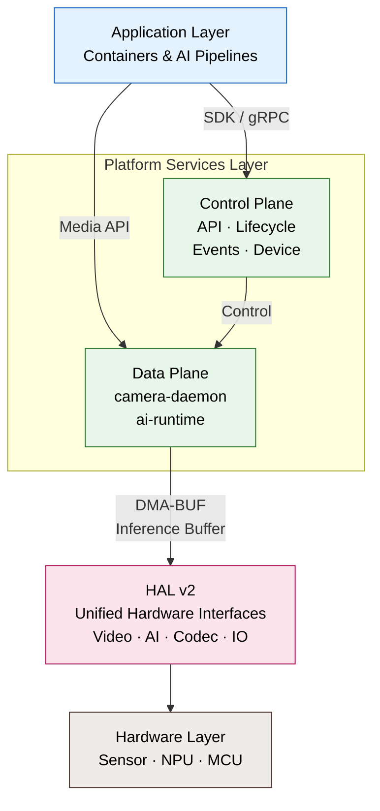
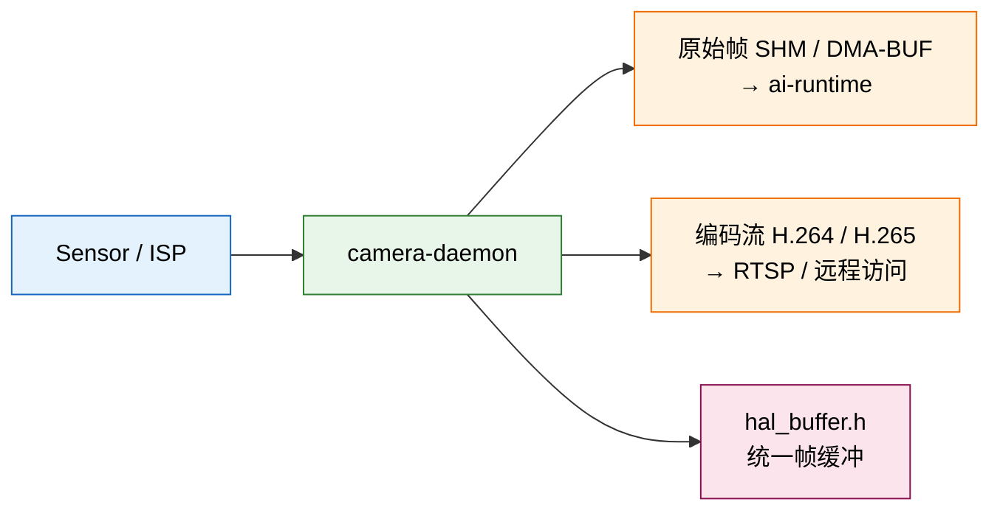
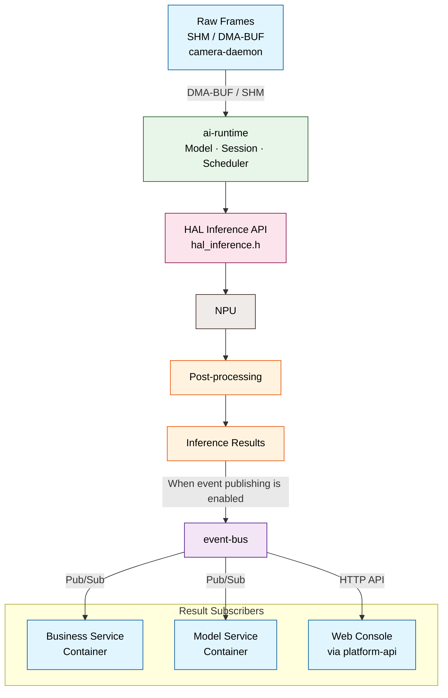
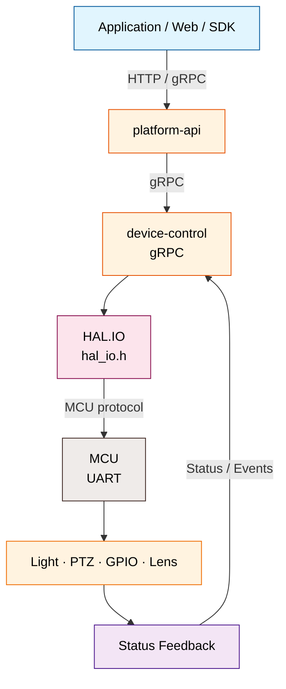

# System Architecture

NE503 软件平台由四层组成：**应用容器 → 平台服务 → HAL → 硬件**。本文聚焦层级关系和三条数据流；API、配置、Socket 与启动依赖见文末源码。

## 1. 四层平台架构

| 层级 | 职责 | 上层关系 |
|:---|:---|:---|
| 应用容器 | 运行业务应用和推理管线 | 通过 SDK 或平台接口调用设备能力，不直接访问硬件 |
| 平台服务 · 数据面 | `camera-daemon` 输出原始帧和编码流；`ai-runtime` 调度 NPU 推理 | 编排视频和推理数据流 |
| 平台服务 · 管理面 | `platform-api`、`app-manager`、`event-bus`、`device-control`、`device-discovery` | 处理控制、生命周期和事件，不直接传输视频帧 |
| HAL v2 | 提供视频、推理、编解码、外设和缓冲区接口 | 屏蔽 SoC 与厂商运行时差异 |
| 硬件与运行时 | 执行采集、编码、推理和 MCU 外设控制 | 由平台 HAL 实现驱动 |

## 2. 端到端数据流

平台数据流分为视频、AI 推理和外设控制三条路径。

### 视频与媒体路径

- `camera-daemon` 通过 HAL 管理成像管线，向 `ai-runtime` 输出 DMA-BUF 原始帧，并输出 RTSP 编码流。

### AI 推理与事件路径

- `ai-runtime` 经 HAL 调度 NPU 完成推理和后处理；启用事件发布后，将结果发布到 `event-bus`，由业务/模型容器订阅，Web Console 经 `platform-api` 获取。

### 外设控制路径

- 请求经 `platform-api` → `device-control` → `HAL.IO/MCU` 控制灯光、PTZ、GPIO 和镜头，状态沿回传链路返回。

## 3. 源码参考

- [架构与数据流](https://github.com/camthink-ai/neoruntime/blob/main/docs/architecture/README.md) —— 分层、组件和数据流
- [HAL v2](https://github.com/camthink-ai/neoruntime/blob/main/docs/architecture/hal_v2_overview.md) —— 接口和平台实现
- [平台服务](https://github.com/camthink-ai/neoruntime/tree/main/docs/services) —— 服务说明
- [服务配置](https://github.com/camthink-ai/neoruntime/tree/main/configs) —— 配置模板
- [平台源码与 proto](https://github.com/camthink-ai/neoruntime/tree/main/platform) —— 实现、gRPC 和消息定义
- [NE503 SDK](https://github.com/camthink-ai/neoruntime-sdks) —— Python / C++ SDK 和共享 proto
- [NE503 应用](https://github.com/camthink-ai/neoruntime-apps) —— 应用模板和示例

**相关页面**：

- [开发者指南](./1-developer-guide.md) —— 开发环境、构建和部署入口
