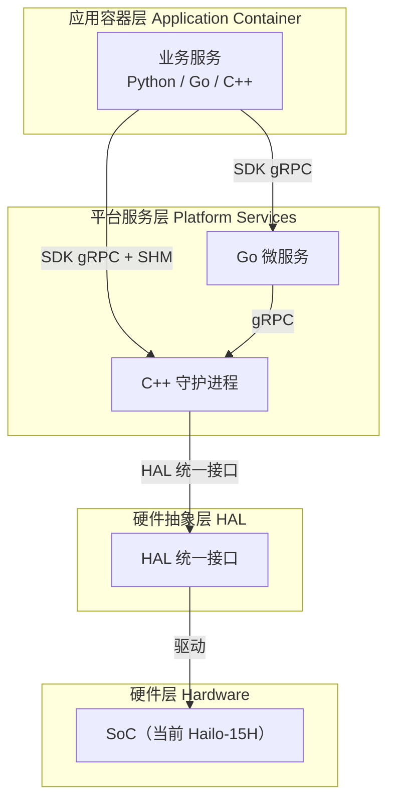
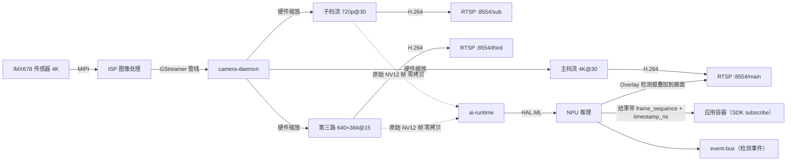
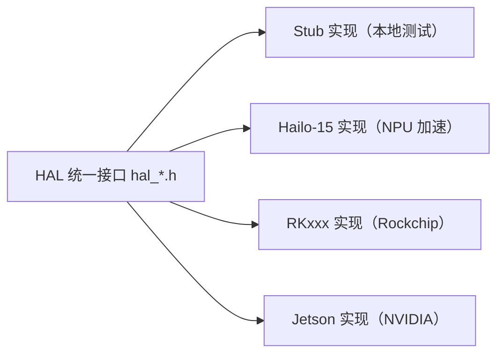
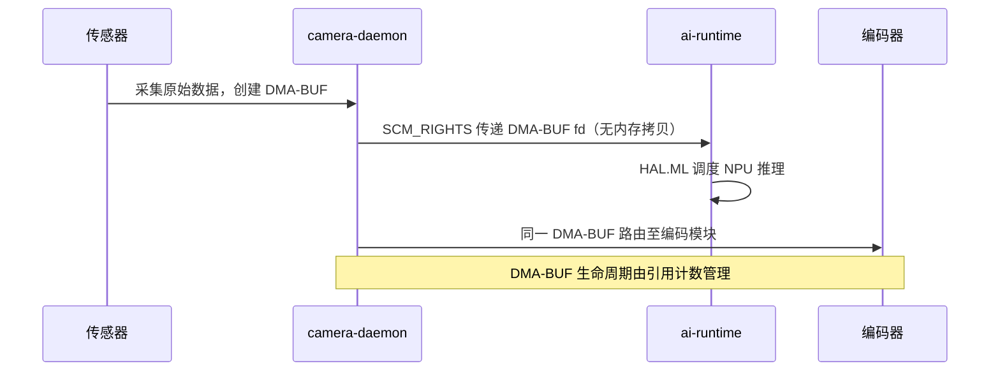

# System Architecture

NE503 的软件栈分为四层：应用容器、平台服务、硬件抽象（HAL）、硬件。本文帮你搞清三件事：**系统怎么分层、一帧图像怎么从传感器变成应用拿到的检测结果、每个服务经 HAL 操作哪些硬件**。读完你能定位功能归属（改哪里）、理解数据路径（调什么流），需要更深的实现细节时按文末链接进开源仓。

## 1. 四层架构总览

| 层级 | 管什么 | 说明 |
|:---|:---|:---|
| 应用容器层 | 第三方 AI 应用、模型推理管线 | Python/Go/C++，容器化运行 |
| 平台服务层 | 摄像头管理、AI 推理、容器管理、事件分发、设备控制、API 网关、设备发现 | Go 微服务 + C++ 守护进程 |
| 硬件抽象层 | 给所有硬件（NPU/传感器/编码器/外设）提供统一接口 | 服务层只调 HAL，不直接碰硬件 |
| 硬件层 | SoC、NPU、ISP、传感器、MCU | Hailo-15H（当前），RKxxx / Jetson（可扩展） |

四层如何在一次完整的推理中协作，见下节。

---

## 2. 端到端数据链路

一帧图像从传感器到应用拿到的检测结果，走的是同一条流水线：

采集、缩放、编码、RTSP 与原始帧分发由 camera-daemon 完成；推理调度由 ai-runtime 完成，两者均通过 HAL 统一接口操作硬件（HAL 详见 §4）。应用控制外设（灯光/PTZ/GPIO）走另一条链：应用 → device-control（gRPC）→ HAL.IO → MCU。

### 三路码流的分工

| 码流 | 分辨率@帧率 | 编码输出 | 原始帧 | 角色 |
|------|------------|---------|--------|------|
| 主码流 `main` | 3840×2160@30（4K） | H.264 → RTSP | ✗ | 高清录像、大屏预览 |
| 子码流 `sub` | 1280×720@30 | H.264 → RTSP | ✓ | 多路预览；也可供 AI 订阅 |
| 第三路 `third` | 640×384@15 | H.264 → RTSP | ✓ | **AI 推理默认流**，尺寸与平台前处理匹配 |

「原始帧」指未经编码的 NV12 帧——只有拿到原始帧的流才能送 NPU 推理。三路均由 ISP 硬件缩放输出，无软件缩放开销；出厂码率、GOP 等参数与热更新方式见[视频集成 · 码流概览](../4-application-guide/3-reference/4-video-integration.md)。

> 应用订阅推理时，`stream` 必须填发布原始帧的流（`sub` 或 `third`）；`main` 只发编码 H.264，订阅它会永远等不到结果。

### 检测结果如何与帧、事件、画面对齐

每次推理结果都携带 `frame_sequence`（帧序号）与 `timestamp_ns`（纳秒时间戳），三方共用这一序号：

- **取原始帧**：应用用 `FdMediaClient.get_frame()` 取同一帧的原始画面（抓拍、二次处理）；
- **事件对时**：event-bus 上的检测事件同样携带时间戳，可与业务系统对时；
- **画面叠加**：平台按配置 `stream_map`（出厂 `third:main,sub:main`）把检测框绘制到对应编码流的画面上——RTSP / Web 里看到的检测框、推理结果、事件输出是同一帧对齐的。

### 应用为什么不直接触碰硬件

应用容器对 NPU、传感器、编码器没有任何直接访问权：

1. **调用走服务**：SDK 通过 Unix Socket 调平台服务（推理、事件、设备控制），由服务经 HAL 操作硬件；
2. **权限即契约**：应用能调什么，由 `app.yaml` 的 `permissions` 声明决定，未声明的调用被平台直接拒绝；
3. **五层沙箱**：容器运行在命名空间隔离、能力裁剪、seccomp 系统调用过滤、cgroups 资源限制、只读 rootfs 之中。

隔离与安全模型的完整设计见开源仓库 [security-architecture.md](https://github.com/camthink-ai/neoruntime/blob/main/docs/architecture/security-architecture.md)。

---

## 3. 平台服务层

平台服务按职责分两组：**数据面**（ai-runtime、camera-daemon——帧与推理的搬运工，性能敏感，C++）与**管理面**（其余五个——生命周期、事件、API、外设、发现，Go 微服务）。服务间通过 gRPC over Unix Domain Socket 通信；对外 REST API 统一由 platform-api 网关暴露（内部 `127.0.0.1:8080`，经 nginx `:443`）。

每个服务的职责、socket 路径、启动依赖与源码指针，见[平台服务总览](./4-platform-services.md)；gRPC 接口的 proto 定义也在该页按服务逐一列出。

---

## 4. 硬件抽象层（HAL）

HAL 是平台服务与硬件之间的唯一通道：换 SoC 只需要重写 HAL 实现，所有服务层代码不动。

### 4.1 HAL 接口总览

HAL 头文件按组件子目录组织，位于 `hal_v2/include/`：

| 目录 | 覆盖功能 |
|:---|:---|
| `media/` | 视频采集、编码（H.264/H.265）、OSD 叠加、ISP、音频、Profile 管理 |
| `model/` | 模型推理、后处理（NMS）、GenAI（LLM/VLM）、可视化绘制、CLIP 文本编码 |
| `dsp/` | 裁剪、缩放、格式转换、隐私遮罩、防抖 |
| `peripheral/` | MCU 通信、GPIO/传感器；设备层含 LED、镜头、告警、RS485、RTC、OTA 等 |
| `common/` | 公共枚举/错误码、`HalFrameBuffer` 帧缓冲、基础类型、日志 |

每个服务消费 HAL 的哪个子接口（如 ai-runtime 消费 `model/` 推理接口、camera-daemon 消费 `media/` 采集编码接口），见开源仓库 [HAL v2 总览](https://github.com/camthink-ai/neoruntime/blob/main/docs/architecture/hal_v2_overview.md)。

### 4.2 核心数据结构：HalFrameBuffer

`HalFrameBuffer` 是平台的核心帧数据载体：帧的元数据（宽高、像素格式、时间戳）与内存描述（DMA-BUF fd、stride）打包在一起，在采集、推理、编码模块间传递。支持 DMA-BUF 零拷贝与 CPU 内存两种模式，通过引用计数管理生命周期——视频→AI→编码全程共享同一份 DMA-BUF，无需内存拷贝。

> 完整结构体定义见 GitHub 仓库 `hal_v2/include/common/` 目录。

### 4.3 多平台支持

当前实现：Hailo-15（完整）+ Stub（完整桩实现，无硬件开发用）。要支持新 SoC，实现对应的 HAL 接口即可，服务层与应用全部不动。

---

## 5. Web 控制台

Web 控制台是设备的管理界面：设备信息与网络配置、实时画面预览、模型与应用管理、外设控制、日志查看（含 WebSocket 终端与容器日志实时流）。

访问地址 `https://<设备IP>`（开发与使用细节见开源仓库 [web-console.md](https://github.com/camthink-ai/neoruntime/blob/main/docs/services/web-console.md)）。

---

## 6. 关键技术特性

### 6.1 零拷贝优化

核心机制：
- `HalFrameBuffer` 通过 `dma_fds[]` 传递 DMA-BUF 文件描述符，视频→AI→编码全程零拷贝
- 引用计数管理帧生命周期（`hal_frame_buffer_ref` / `hal_frame_buffer_release`）
- ai-runtime 与 camera-daemon 之间通过 `SCM_RIGHTS` 传递 FD（无需内存拷贝）

### 6.2 事件驱动架构

Event Bus 采用发布/订阅模式，支持 MQTT 风格通配符匹配（`*` 单级、`**` 多级、`**/suffix` 后缀）。AI 推理结果发布在 `inference/{model_id}/{stream_id}`，应用自定义事件在 `app/{app_id}/...` 之下；所有服务产生的推理结果、容器事件、设备事件均经它分发，第三方应用通过 SDK 的 `EventClient` 订阅。Topic 命名规范、通配符匹配规则与订阅代码见[事件集成](../4-application-guide/3-reference/5-event-integration.md)。

### 6.3 容器化应用平台

- 基于 containerd 运行时，OCI 标准镜像部署——应用用标准 Docker 镜像交付，与平台解耦
- 多容器支持（Main + Sub），依赖声明后由平台自动拉起，无需自己编排启动顺序
- 健康检查（Command / HTTP / TCP）+ 故障自动重启（backoff 策略）——应用被重启不报错给用户，因此应用设计要做幂等（重复收到同一帧/事件不产生副作用）

---

## 7. 系统配置

平台配置分两类：**日常配置**（网络、时区、码流参数——在 Web 控制台或 REST API 上改，本篇不展开）与**系统配置**（服务参数——仅平台开发/定制时碰）。系统配置为 YAML 文件，出厂位于设备 `/data/aipc/etc/` 下，源码位于仓库 `configs/` 目录：

| 配置文件 | 服务 | 核心配置项 |
|:---|:---|:---|
| `platform-api.yaml` | platform-api | 服务器端口、认证密钥、日志级别 |
| `platform/app-manager.yaml` | app-manager | containerd 连接、安全策略、资源限制 |
| `platform/event-bus.yaml` | event-bus | Socket 路径、TCP 监听、主题 ACL |
| `platform/device-control.yaml` | device-control | MCU UART 设备、镜头参数、自动化规则 |
| `platform/camera-daemon.yaml` | camera-daemon | 视频采集、编码参数、RTSP 配置 |
| `platform/discovery.yaml` | device-discovery | CT-Disc 协议参数 |
| `ai/ai-runtime.yaml` | ai-runtime | HAL 库路径、模型仓库、调度器、自动推理管道 |
| `preload.yaml` | 出厂预装 | 预装模型与应用清单（首次部署时由平台注册） |
| `security/seccomp-default.json` | 安全 | 默认 Seccomp 系统调用白名单 |

安装位置：`/data/aipc/`（二进制 `bin/`、配置 `etc/`）。

---

## 8. 相关文档

**Wiki 内**：

- [平台服务总览](./4-platform-services.md) — 各服务职责、协作关系与源码指针
- [应用开发指南](../4-application-guide/3-reference/0-app-reference.md) — 如何编写和部署容器应用
- [Python SDK 参考](../4-application-guide/3-reference/1-sdk-reference.md) — SDK API 签名与使用示例

**开源仓库（实现向深读）**：

- [架构总览与数据流](https://github.com/camthink-ai/neoruntime/blob/main/docs/architecture/README.md) — 完整架构文档，含四张数据流图
- [安全架构](https://github.com/camthink-ai/neoruntime/blob/main/docs/architecture/security-architecture.md) — 沙箱隔离与安全模型设计
- [服务参考文档](https://github.com/camthink-ai/neoruntime/tree/main/docs/services) — 各服务逐一展开（ai-runtime / event-bus / camera-daemon 设计等）
