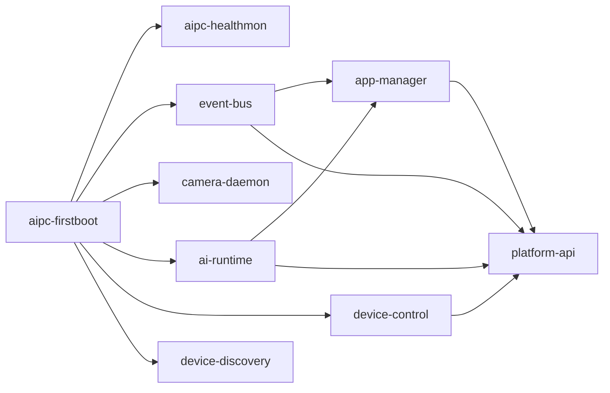

# Software Deployment

本文档说明如何将 NE503 平台软件发布包部署到设备上运行。平台软件包括平台服务、HAL 库、Web 控制台等，区别于系统镜像（hailo-os）的烧录 — 后者请参阅 [System Flashing](./2-system-flashing.md)。

> 前置条件：已完成 [Developer Guide](./1-developer-guide.md) 中的环境搭建和构建，产出 `build/release/aipc-hailo15-<version>.tar.gz` 发布包。

## 1. 服务依赖关系

NE503 运行多个平台服务，通过 systemd 管理启动顺序：



| 服务 | 语言 | 依赖 |
|------|------|------|
| aipc-firstboot | Shell | 无（oneshot，先于所有服务） |
| aipc-healthmon | Shell | aipc-firstboot（黑盒健康采样，常驻） |
| event-bus | Go | 无 |
| camera-daemon | C++ | 无 |
| ai-runtime | C++ | containerd |
| device-control | Go | 无 |
| device-discovery | Go | 无 |
| app-manager | Go | event-bus + ai-runtime + containerd |
| platform-api | Go | event-bus + ai-runtime + app-manager + device-control |

> containerd 不在上表中，但 ai-runtime 和 app-manager 依赖它。确保设备上已启用：`systemctl enable containerd`。

## 2. 发布包部署

### 2.1 传输发布包

```bash
scp build/release/aipc-hailo15-<version>.tar.gz root@<device-ip>:/data/
```

### 2.2 执行部署

```bash
ssh root@<device-ip>
# root 分区已满（3.3G、已用 99%），直接在 /data 分区解压
cd /data && tar xzf aipc-hailo15-<version>.tar.gz
cd aipc-hailo15-<version> && ./deploy.sh --prefix /data/aipc
```

预期输出（节选关键阶段，省略逐文件 `+ xxx -> ...` 日志）：

```plaintext
[deploy]   AIPC Hot-swap Deploy
[deploy]   Current version:  unknown（首次）或旧版本号
[deploy]   Package version:  1.0.0
[deploy]   Config deploy:    yes
[deploy]   Install prefix:   /data/aipc
Proceed with deployment? [y/N] y
[deploy] [1/8] Creating runtime directories...
[deploy] [2/8] Backing up current installation...
[deploy] [3/8] Stopping services for hot-swap...
[deploy] [4/8] Deploying binaries...
[deploy] [5/8] Deploying firstboot initialization script...
[deploy] [6/8] Deploying HAL libraries...
[deploy] [7/8] Deploying configs and systemd units...
[deploy] [8/8] Starting services...
[deploy] Running health checks (timeout 15s)...
[deploy] Service status:
[deploy]   aipc-healthmon: active
[deploy]   event-bus: active
[deploy]   camera-daemon: active
[deploy]   ai-runtime: active
[deploy]   platform-api: active
[deploy]   app-manager: active
[deploy]   device-control: active
[deploy]   device-discovery: active
[deploy]   Deploy successful!
[deploy]   Version: 1.0.0
```

### 2.3 deploy.sh 参数

| 参数 | 说明 |
|------|------|
| `--prefix /data/aipc` | 安装到指定目录（推荐 `/data`：root 分区 3.3G 已用 99%，仅剩约 60M） |
| `--force` | 强制部署，跳过确认提示 |
| `--rollback` | 回滚到上一版本 |
| `--status` | 查看当前部署状态 |
| `--no-config` | 跳过配置文件覆盖（保留设备上的配置） |

完整示例：

```bash
./deploy.sh --prefix /data/aipc --force    # 部署到 /data 分区
./deploy.sh --rollback                      # 回滚到上一版本
./deploy.sh --status                        # 查看部署状态
```

## 3. 迭代开发

开发过程中，替换单个服务二进制无需完整部署。

### 3.1 手动替换单个服务

```bash
scp build/output/device-control root@<device-ip>:/opt/aipc/bin/
ssh root@<device-ip> "systemctl restart device-control"
```

设备 `/opt` 空间不足时（root 分区 3.3G 已用 99%，仅剩约 60M），可部署到 `/data`：

```bash
scp build/output/device-control root@<device-ip>:/data/aipc/bin/
```

### 3.2 Make 部署目标

Makefile 提供自动化部署命令：

```bash
make setup-ssh TARGET=root@<device-ip>          # 首次：配置免密登录
make deploy-init TARGET=root@<device-ip>         # 首次：初始化目录结构
make deploy-all TARGET=root@<device-ip>          # 逐服务 build + scp + restart
```

指定 `/data` 分区：

```bash
make deploy-all TARGET=root@<device-ip> REMOTE_PREFIX=/data/aipc
```

## 4. 发布包内容

`aipc-hailo15-<version>.tar.gz` 包含以下内容：

| 路径 | 内容 |
|------|------|
| `opt/aipc/bin/` | 平台服务二进制 + CLI + 工具 |
| `opt/aipc/scripts/` | 运维脚本（firstboot / healthmon / logrotate） |
| `opt/aipc/lib/hal/` | HAL 共享库 |
| `opt/aipc/etc/` | YAML 配置 |
| `opt/aipc/etc/security/` | seccomp 策略 |
| `opt/aipc/web/` | Web 控制台 |
| `opt/aipc/swagger-ui/` | API 文档 |
| `opt/aipc/models/` | 模型目录（空，需单独下载） |
| `systemd/` | systemd 服务单元 |
| `deploy.sh` | 热替换部署脚本 |
| `VERSION` | 版本元数据 |

## 5. 部署验证

部署完成后在设备上执行以下检查：

```bash
# 1. 服务状态（应全部 active）
systemctl status ai-runtime camera-daemon app-manager event-bus device-control device-discovery platform-api
```

预期输出：

```plaintext
● ai-runtime.service - AI Runtime Service
     Loaded: loaded (/etc/systemd/system/ai-runtime.service)
     Active: active (running)
```

```bash
# 2. 二进制架构（应为 ARM aarch64）
file /opt/aipc/bin/ai-runtime
# ELF 64-bit LSB pie executable, ARM aarch64

# 3. HAL 库
ls -l /opt/aipc/lib/hal/libaipc_hal*.so

# 4. NPU 设备
lsmod | grep hailo && ls -la /dev/hailo*

# 5. Web 控制台
curl -s http://localhost:8080/ | head -1
# <!DOCTYPE html>
```

浏览器访问 `http://<device-ip>:8080`，默认凭据 `admin` / `password`。

## 6. 故障排查

### containerd 未运行

app-manager 启动失败时检查 containerd：

```bash
systemctl enable containerd && systemctl start containerd
```

### "exec format error"

二进制架构与设备不匹配：

```bash
file build/output/ai-runtime    # 检查产物架构，应为 ARM aarch64
ssh root@<device-ip> "uname -m" # 设备应为 aarch64
```

### 服务启动失败

查看服务日志定位原因：

```bash
journalctl -u <service-name> -n 50 --no-pager
```

## 7. 相关文档

- [Developer Guide](./1-developer-guide.md) — 开发环境搭建和构建
- [System Architecture](./0-system-architecture.md) — 四层架构和核心服务
- [System Flashing](./2-system-flashing.md) — 系统镜像烧录
