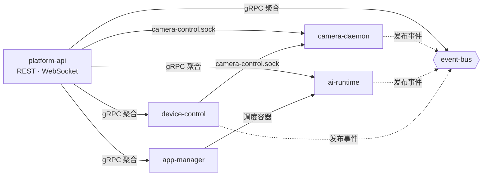

# Services Overview

NE503 AIPC 平台由七个核心服务组成，均通过 Unix Socket 通信，由 systemd 管理。本页是每个服务的**档案页**：职责、socket、启动依赖、源码指针与 CLI 命令——服务起不来、要找接口定义、要定位源码时查这里。gRPC 接口契约以[源码仓](https://github.com/camthink-ai/neoruntime)的 proto 与 YAML 为准，本文不复述。

## 服务协作

platform-api 是对外统一入口，聚合全部服务的 gRPC 接口；event-bus 是消息中枢，几乎所有服务都向它发布事件；camera-daemon 与 device-control 通过专用 socket 协作控制镜头。



数据怎么从传感器流到应用（帧的零拷贝路径），见[系统架构 · 端到端数据链路](./0-system-architecture.md#2-端到端数据链路)——本页只管服务间调用关系。

device-discovery 相对独立，通过 MQTT/UDP 管理外部被管设备，不消费其他平台服务，不在图中展示。

## Socket 一览

平台内部通信统一走 `/run/aipc/*.sock`（设备上排障用 `ss -x | grep aipc` 或 `systemctl status` 看）。唯一例外：event-bus 额外监听 TCP `127.0.0.1:50053`，供 Hailo C++ gRPC 客户端使用（Hailo gRPC 库不支持 unix socket resolver）。

| Socket | 提供方 | 消费方 | 用途 |
|:--|:--|:--|:--|
| `/run/aipc/camera.sock` | camera-daemon | ai-runtime | 原始帧 fd 接收（SCM_RIGHTS 零拷贝） |
| `/run/aipc/camera-control.sock` | camera-daemon | device-control、platform-api | 镜头控制（lens_hal 协议） |
| `/run/aipc/ai-runtime.sock` | ai-runtime | SDK 应用、platform-api、app-manager | 推理（inference.proto） |
| `/run/aipc/app-manager.sock` | app-manager | platform-api | 应用生命周期（app.proto） |
| `/run/aipc/event-bus.sock` | event-bus | 全部服务、SDK 应用 | 事件发布/订阅（event.proto） |
| `/run/aipc/device-control.sock` | device-control | SDK 应用、platform-api | 外设控制（device.proto） |
| `/run/aipc/device-discovery.sock` | device-discovery | platform-api | 设备发现（discovery.proto） |

## 启动依赖

启动依赖源自 [systemd unit 声明](https://github.com/camthink-ai/neoruntime/tree/main/systemd)（`After` / `Wants`）。全体服务共同的前置：`aipc-restore.service`、`aipc-firstboot.service`、`network.target`；下表只列各服务**特有**的部分：

| 服务 | 特有依赖 |
|:--|:--|
| camera-daemon | After `aipc-mcu-prep`、`isp_media_server`、`hailort_server` |
| ai-runtime | After + Wants `containerd.service` |
| event-bus、device-discovery | 无特有依赖 |
| device-control | After + Wants **camera-daemon**；After `aipc-mcu-prep` |
| app-manager | Wants `ai-runtime`、`event-bus`、`containerd` |
| platform-api | After + Wants `ai-runtime`、`app-manager`、`device-control`、`event-bus` |

排障要点：

- **camera-daemon 依赖最深的底层单元链**（MCU 准备 → ISP 媒体服务 → HailoRT 服务）——画面类问题先 `systemctl status isp_media_server hailort_server` 再查 camera-daemon 本身；
- ai-runtime 与 device-control 虽运行时连接 camera-daemon，但只有 device-control 声明了 systemd 依赖；ai-runtime 与 camera-daemon 并行启动，靠 socket 重连机制建立连接——ai-runtime 起得比 camera-daemon 早属正常现象；
- platform-api 最后启动，`After` 只保证顺序不保证就绪（Wants 弱依赖，被依赖服务失败也会拉起）。

## 服务清单

以下路径均相对[neoruntime 仓库](https://github.com/camthink-ai/neoruntime)根目录。

### camera-daemon

1. **职责**：硬件抽象层入口（**C++ 服务**）。管理图像传感器、ISP 参数、H.264/H.265 编码器、RTSP 流、MCU 通信、音频采集/播放，并通过 DMA-BUF fd 将帧以零拷贝方式提供给下游。
2. **协作**：向 ai-runtime 暴露 fd receiver socket（`camera.sock`）；向 device-control 暴露镜头控制端点（`camera-control.sock`）；向 event-bus 发布采集与编码事件。
3. **源码**：
   - Proto：`platform/camera-daemon/proto/camera.proto`、`lens_hal.proto`
   - C++ 实现：`platform/camera-daemon/src/`、`platform/camera-daemon/include/`
   - 配置：`configs/platform/camera-daemon.yaml`
   - 设计文档：`docs/services/CAMERA_DAEMON_DESIGN.md`

### ai-runtime

1. **职责**：AI 推理运行时（**C++ 服务**）。管理 HEF 模型加载/卸载、单次与流式推理、推理会话配额、NPU 调度策略、CLIP 文本编码、GenAI（LLM/VLM）流式生成，以及推理结果的后处理（检测、关键点、分割、OCR、深度图等）。
2. **协作**：通过 fd receiver 从 camera-daemon 获取零拷贝帧；推理结果自动发布到 event-bus（`inference/` 前缀）；被 app-manager 调度的容器应用通过本服务发起推理。
3. **源码**：
   - Proto：`platform/ai-runtime/proto/inference.proto`
   - C++ 实现：`platform/ai-runtime/src/`、`platform/ai-runtime/include/`
   - 配置：`configs/ai/ai-runtime.yaml`
   - 参考文档：`docs/services/ai-runtime.md`

### app-manager

1. **职责**：容器应用生命周期管理。封装 containerd，提供应用/镜像/容器的安装、启停、日志、资源清理、批量操作，以及容器内 exec、Web URL 注册等能力。
2. **协作**：依赖 containerd socket；`Wants` ai-runtime 与 event-bus（被调度的应用通常需要推理与事件订阅）。
3. **源码**：
   - Proto：`platform/app-manager/proto/app.proto`
   - 配置：`configs/platform/app-manager.yaml`
   - 参考文档：`docs/services/app-manager.md`

### event-bus

1. **职责**：平台消息中枢。提供发布/订阅、批量发布、topic 管理、事件统计。支持 topic 模式匹配与通配订阅。
2. **协作**：几乎所有服务都是它的生产者或消费者——camera-daemon、ai-runtime、device-control 向其发布事件；app-manager 与 platform-api 订阅事件。
3. **源码**：
   - Proto：`platform/event-bus/proto/event.proto`
   - 配置：`configs/platform/event-bus.yaml`
   - 参考文档：`docs/services/event-bus.md`

### device-control

1. **职责**：设备外设控制。涵盖 PTZ（云台）、镜头（变焦/对焦/光圈）、补光灯/IR LED/IR-Cut、环境控制（风扇/加热/雷达）、报警输出（继电器/Wiegand）、RS485、GPIO 等全部硬件控制接口。
2. **协作**：通过镜头端点（`camera-control.sock`）与 camera-daemon 协作控制镜头；事件发布到 event-bus。
3. **源码**：
   - Proto：`platform/device-control/proto/device.proto`
   - 配置：`configs/platform/device-control.yaml`
   - 参考文档：`docs/services/device-control.md`

### device-discovery

1. **职责**：CamThink 设备发现与管理。实现 CT-Disc 协议，LAN 通过 UDP 组播（`239.255.255.250:19850`）自动发现设备，CAT1 蜂窝设备通过 MQTT 注册，统一以 SN 归并到设备注册表，支持心跳检测与管理命令下发（reboot、OTA 等）。
2. **协作**：相对独立，不消费其他平台服务；管理命令通过 MQTT 通道下发到被管设备。
3. **源码**：
   - Proto：`platform/device-discovery/proto/discovery.proto`
   - 配置：`configs/platform/discovery.yaml`
   - 参考文档：`docs/services/device-discovery.md`

### platform-api

1. **职责**：HTTP/WebSocket 网关。聚合上述所有服务的 gRPC 接口，对外暴露 REST API 与 WebSocket（视频流推送、终端、事件推送）。承载 Web 控制台后端与认证。
2. **协作**：作为统一入口，连接 ai-runtime、app-manager、device-control（camera-control.sock）、event-bus。Web 前端（`web/`）是它的唯一 UI 客户端。
3. **源码**：
   - 目录：`platform/platform-api/`（`server/`、`handlers/`、`websocket/`、`auth/`）
   - 前端：`web/`
   - 配置：`configs/platform-api.yaml`
   - 参考文档：`docs/services/platform-api.md`

## CLI 工具

`aipc-cli` 是平台命令行管理工具，覆盖应用、设备、事件、媒体、流、模型、系统等操作。通过 Web 终端（Maintenance → Terminal）或 SSH 登录设备后即可使用。

**常用命令速查**：

```bash
# 系统
aipc-cli system info              # 设备信息
aipc-cli system health            # 健康检查

# 应用
aipc-cli app list                 # 列出应用
aipc-cli app start <id>           # 启动应用
aipc-cli app stop <id>            # 停止应用
aipc-cli app logs <id> -f         # 实时查看应用日志

# 设备（镜头 / 红外）
aipc-cli device status            # 设备状态
aipc-cli device zoom in 5         # 变焦（in / out / stop，速度 1-10）
aipc-cli device focus auto        # 自动对焦

# 码流
aipc-cli stream list              # 列出码流状态
aipc-cli stream url <id>          # 查看码流 RTSP 地址

# 模型
aipc-cli model list               # 列出模型
aipc-cli model register <path>    # 注册新模型
```

**输出格式**：所有命令支持 `-o table`（默认）/ `-o json` / `-o yaml`，便于脚本解析。完整命令树与参数以 `aipc-cli --help` 及各子命令 `<command> --help` 为准。

**源码**：`tools/aipc-cli/cmd/`

## 相关文档

- [系统架构](./0-system-architecture.md) — 分层设计与端到端数据链路（本页管服务档案，架构页管数据流原理）
- [版本矩阵](./5-version-matrix.md) — 各组件当前版本对照与升级兼容关卡
- [故障排查 FAQ](../5-troubleshooting.md) §8 — 系统服务层深水区排障（systemd、journalctl、性能监控），排障方法论与本页的依赖表/命令速查配合使用
