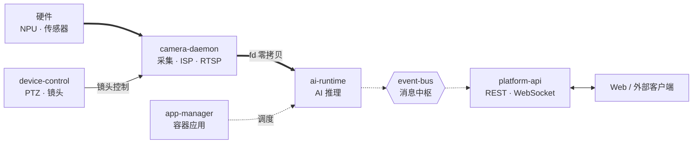

# Services Overview

NE503 AIPC 平台由七个核心服务组成，均通过 Unix Socket 通信，由 systemd 管理。本文只描述每个服务的**职责与协作关系**——gRPC 接口、配置字段、命令参数请直接查阅源码，那里是唯一权威来源。

## 架构关系

平台的核心数据流是一条从左到右的管线：**硬件采集 → AI 推理 → 事件分发 → 网关交付**。device-control 和 app-manager 作为控制服务挂接在管线上。

- **粗线**（`==>`）：视频推理管线，DMA-BUF fd 零拷贝传输帧数据
- **虚线**（`-.->`）：event-bus 异步消息与容器调度
- platform-api 通过 gRPC 聚合全部核心服务（含 device-control、app-manager）；camera-daemon 与 device-control 也会向 event-bus 发布事件
- device-discovery 相对独立，通过 MQTT/UDP 管理外部设备，不在图中展示

## 启动顺序

启动依赖源自 systemd unit 的 `After` / `Wants` 声明：

| 阶段 | 服务 | systemd 依赖 |
|:---|:---|:---|
| 1 | `camera-daemon` `event-bus` `device-discovery` `ai-runtime` `device-control` | 仅 `After=network.target`（ai-runtime 额外 `Wants=containerd.service`） |
| 2 | `app-manager` | `After=network.target`；`Wants` ai-runtime + event-bus + containerd |
| 3 | `platform-api` | `After` ai-runtime + app-manager + device-control + event-bus 全部就绪 |

注意：ai-runtime 与 device-control 虽在运行时连接 camera-daemon（fd_receiver / lens_endpoint），但 systemd 层面**不声明对 camera-daemon 的启动依赖**——它们与 camera-daemon 同属阶段 1 并行启动，运行时通过 socket 重连机制建立连接。

平台内部通信统一走 `/run/aipc/*.sock`。唯一例外：event-bus 额外监听 `127.0.0.1:50053`，供 Hailo C++ gRPC 客户端使用（Hailo gRPC 库不支持 unix socket resolver）。

## 服务清单

### camera-daemon

1. **职责**：硬件抽象层入口（**C++ 服务**）。管理图像传感器、ISP 参数、H.264/H.265 编码器、RTSP 流、MCU 通信、音频采集/播放，并通过 DMA-BUF fd 将帧以零拷贝方式提供给下游。
2. **协作**：向 ai-runtime 暴露 fd receiver socket（`/run/aipc/camera.sock`）；向 device-control 暴露 lens 控制端点（`/run/aipc/camera-control.sock`）；向 event-bus 发布采集与编码事件。
3. **源码**：
   - Proto：`platform/camera-daemon/proto/camera.proto`、`lens_hal.proto`
   - C++ 实现：`platform/camera-daemon/src/`、`platform/camera-daemon/include/`
   - 配置：`configs/platform/camera-daemon.yaml`

### ai-runtime

1. **职责**：AI 推理运行时（**C++ 服务**）。管理 HEF 模型加载/卸载、单次与流式推理、推理会话配额、NPU 调度策略、CLIP 文本编码、GenAI（LLM/VLM）流式生成，以及推理结果的后处理（检测、关键点、分割、OCR、深度图等）。
2. **协作**：通过 fd receiver 从 camera-daemon 获取零拷贝帧；推理结果自动发布到 event-bus（`inference/` 前缀）；被 app-manager 调度的容器应用通过本服务发起推理。
3. **源码**：
   - Proto：`platform/ai-runtime/proto/inference.proto`
   - C++ 实现：`platform/ai-runtime/src/`、`platform/ai-runtime/include/`
   - 配置：`configs/ai/ai-runtime.yaml`

### app-manager

1. **职责**：容器应用生命周期管理。封装 containerd，提供应用/镜像/容器的安装、启停、日志、资源清理、批量操作，以及容器内 exec、Web URL 注册等能力。
2. **协作**：依赖 containerd socket；`Wants` ai-runtime 与 event-bus（被调度的应用通常需要推理与事件订阅）。
3. **源码**：
   - Proto：`platform/app-manager/proto/app.proto`
   - 配置：`configs/platform/app-manager.yaml`

### event-bus

1. **职责**：平台消息中枢。提供发布/订阅、批量发布、topic 管理、事件统计。支持 topic 模式匹配与通配订阅。
2. **协作**：几乎所有服务都是它的生产者或消费者——camera-daemon、ai-runtime、device-control 向其发布事件；app-manager 与 platform-api 订阅事件。
3. **源码**：
   - Proto：`platform/event-bus/proto/event.proto`
   - 配置：`configs/platform/event-bus.yaml`

### device-control

1. **职责**：设备外设控制。涵盖 PTZ（云台）、镜头（变焦/对焦/光圈）、补光灯/IR LED/IR-Cut、环境控制（风扇/加热/雷达）、报警输出（继电器/Wiegand）、RS485、GPIO 等全部硬件控制接口。
2. **协作**：通过 lens endpoint（`/run/aipc/camera-control.sock`）与 camera-daemon 协作控制镜头；事件发布到 event-bus。
3. **源码**：
   - Proto：`platform/device-control/proto/device.proto`
   - 配置：`configs/platform/device-control.yaml`

### device-discovery

1. **职责**：CamThink 设备发现与管理。实现 CT-Disc 协议，LAN 通过 UDP 组播（`239.255.255.250:19850`）自动发现设备，CAT1 蜂窝设备通过 MQTT 注册，统一以 SN 归并到设备注册表，支持心跳检测与管理命令下发（reboot、OTA 等）。
2. **协作**：相对独立，不消费其他平台服务；管理命令通过 MQTT 通道下发到被管设备。
3. **源码**：
   - Proto：`platform/device-discovery/proto/discovery.proto`
   - 配置：`configs/platform/discovery.yaml`

### platform-api

1. **职责**：HTTP/WebSocket 网关。聚合上述所有服务的 gRPC 接口，对外暴露 REST API 与 WebSocket（视频流推送、终端、事件推送）。承载 Web 控制台后端与认证。
2. **协作**：作为统一入口，连接 ai-runtime、app-manager、device-control（camera-control.sock）、event-bus。Web 前端（`web/`）是它的唯一 UI 客户端。
3. **源码**：
   - 目录：`platform/platform-api/`（`server/`、`handlers/`、`websocket/`、`auth/`）
   - 前端：`web/`
   - 配置：`configs/platform-api.yaml`

## CLI 工具

`aipc-cli` 是平台命令行管理工具，覆盖应用、设备、事件、媒体、流、模型、系统等操作。命令树与参数以 `aipc-cli --help` 及各子命令 `<command> --help` 为准。

**源码**：`tools/aipc-cli/cmd/`

## 相关文档

- [Troubleshooting Guide](./1-troubleshooting.md) — 故障排查、诊断命令、错误码速查
