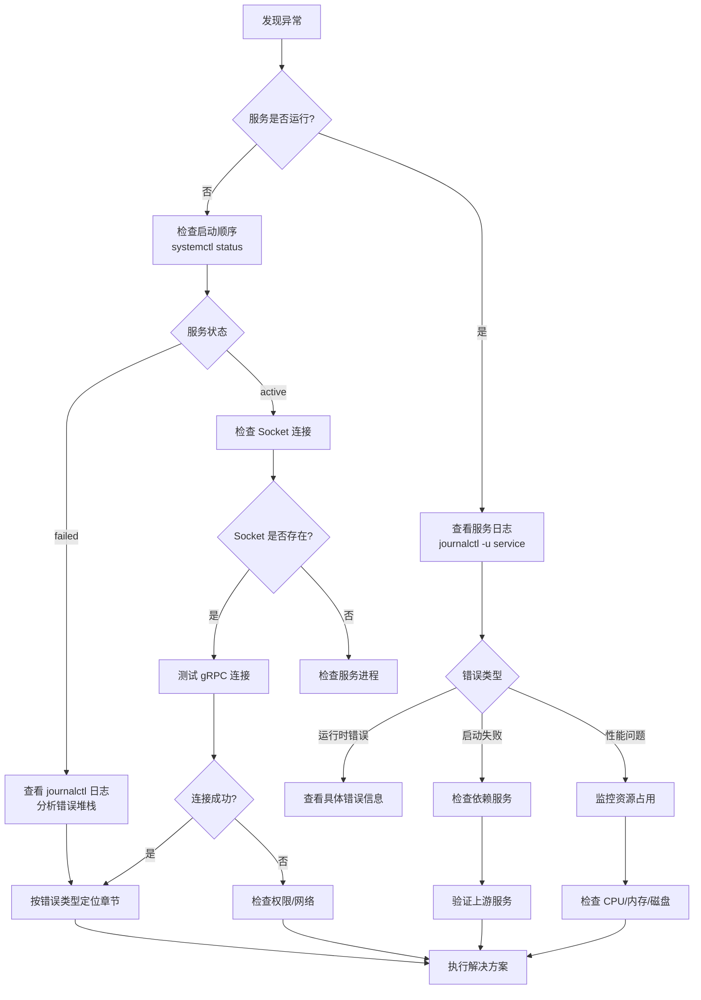
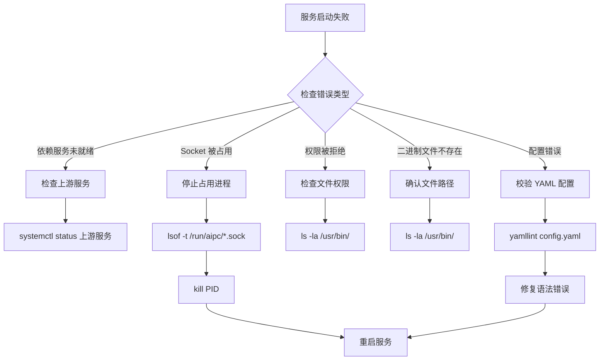
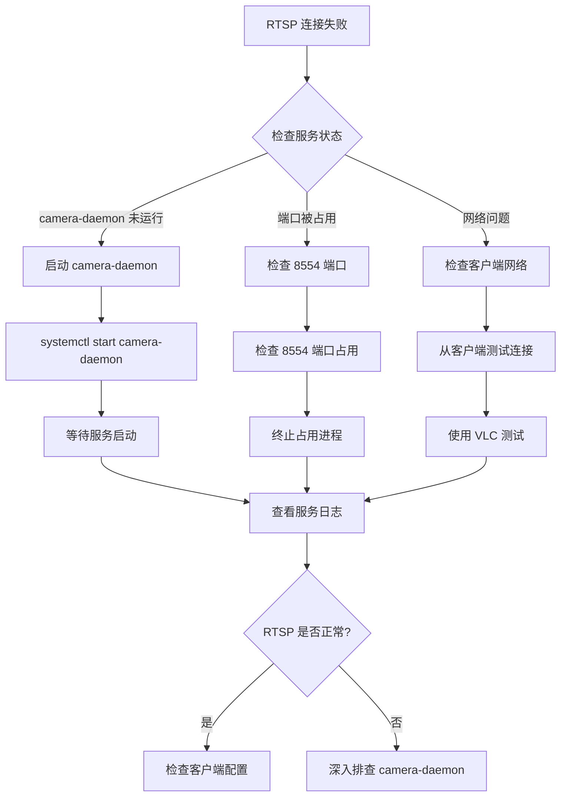

# Troubleshooting Guide

## 1. 概述

本手册为 NE503 AIPC 平台提供系统化的故障排查流程和解决方案。平台采用微服务架构，服务间通过 Unix Socket 通信，并遵循特定的启动顺序。遇到问题时，请按以下通用流程操作：

1. 确认问题现象
2. 检查相关日志
3. 参考对应章节
4. 执行建议方案

## 2. 通用排查流程



## 3. 服务启动失败排查

### 3.1 检查 systemd 状态

```bash
# 查看所有 AIPC 服务状态
systemctl status ai-runtime camera-daemon app-manager event-bus device-control device-discovery platform-api

# 查看指定服务状态
systemctl status ai-runtime.service

# 查看启动失败的服务
systemctl --failed

# 查看服务依赖关系
systemctl list-dependencies platform-api.service
```

### 3.2 检查 Unix Socket 是否存在

```bash
# 查看 /run/aipc 目录
ls -la /run/aipc/

# 平台共 7 个 Socket：
#   ai-runtime.sock        — AI 推理服务
#   app-manager.sock       — 容器应用管理
#   device-control.sock    — 设备外设控制
#   event-bus.sock         — 事件总线
#   device-discovery.sock  — 设备发现
#   camera.sock            — camera-daemon 帧发布（fd 零拷贝）
#   camera-control.sock    — camera-daemon 控制（镜头/HAL）
ls -la /run/aipc/*.sock

# 测试 Socket 连接
nc -U /run/aipc/ai-runtime.sock
```

### 3.3 使用 journalctl 查看日志

```bash
# 实时查看服务日志
journalctl -u ai-runtime -f

# 查看最近 1 小时的日志
journalctl -u camera-daemon --since "1 hour ago"

# 查看包含错误关键词的日志
journalctl -u app-manager | grep -i "error\|failed\|fatal"

# 查看启动失败的详细错误
journalctl -u app-manager -b --no-pager

# 按错误级别过滤
journalctl -u event-bus -p err
journalctl -u device-control -p warning
```

### 3.4 常见启动问题



### 3.5 Socket 权限检查

```bash
# 检查 Socket 目录与文件权限
ls -ld /run/aipc/
ls -la /run/aipc/*.sock
```

## 4. 视频流排查

### 4.1 RTSP 连接失败



**诊断命令：**

```bash
# 检查 RTSP 服务状态
systemctl status camera-daemon

# 查看 RTSP 日志
journalctl -u camera-daemon -f

# 测试 RTSP 连接（将 <device-ip> 换成设备实际 IP）
ffmpeg -rtsp_transport tcp -i rtsp://<device-ip>:8554/main -t 10 -f null -
```

> Web 控制台 WebSocket 断连（视频流播放层面）的排查见 [Application Troubleshooting — 视频流集成排查](../../4-application-guide/1-app-development/reference/troubleshooting.md#2-视频流集成排查)。

## 5. 设备控制排查

| 现象 | 可能原因 | 诊断命令 |
|------|---------|---------|
| 镜头控制异常 | 对焦/变焦/光圈电机故障 | `grpcurl ... DeviceControl/GetLensStatus`；`grpcurl ... DeviceControl/LensResetZero` |
| UART 通信失败 | 波特率/接线/电压异常 | `ls -la /dev/ttyS*`；`stty -F /dev/ttyS0 921600` |

gRPC 接口完整定义见源码 `platform/device-control/proto/device.proto`。

## 6. Web 控制台排查

### 6.1 浏览器兼容性

| 浏览器 | 最低版本 | 支持程度 | 已知问题 | 解决方案 |
|--------|---------|----------|---------|---------|
| Chrome | 88+ | 完全支持 | -- | -- |
| Firefox | 78+ | 基本支持 | 不支持 WebCodecs | 使用 MSE 播放 |
| Safari | 14+ | 部分支持 | 不支持 WebCodecs | 降级为 MSE |
| Edge | 88+ | 完全支持 | -- | -- |
| 移动端浏览器 | -- | 有限支持 | 性能问题 | 使用桌面端 |

推荐使用 Chrome 88+ 或 Edge 88+ 以获得最佳体验。Safari 自动降级为 MSE 方案，性能略低。

### 6.2 WebSocket 与视频播放排查

视频流播放依赖 WebSocket 传输 H.264 帧。常见问题：

| 现象 | 可能原因 | 解决方案 |
|------|---------|---------|
| WebSocket 1006 | 连接异常关闭 | 检查 platform-api 是否运行、防火墙是否放行 8080 端口 |
| WebSocket 401/403 | Token 无效或过期 | 重新登录获取新 Token |
| 黑屏 | WebSocket 未建立 / SPS-PPS 未接收 | 刷新页面，检查 WebSocket 连接状态 |
| 花屏/马赛克 | 网络丢包 / 解码器不兼容 | 切换浏览器或检查网络质量 |
| 高延迟 | 网络延迟 / 缓冲区过大 | 确保局域网带宽充足，减小编码 GOP |

### 6.3 API 请求失败

| 状态码 | 含义 | 解决方案 |
|--------|------|---------|
| 401 | 认证失败 | 清除 Token 重新登录 |
| 403 | 权限不足 | 检查用户权限 |
| 404 | 资源未找到 | 检查 API 路径 |
| 500 | 服务器错误 | 查看 `/var/log/aipc/platform-api.log` |
| 503 | 服务不可用 | 检查服务状态，必要时重启 |

## 7. 日志级别调整

### 7.1 临时调整日志级别

```bash
# 临时查看 debug 级别日志（需先在配置文件中将 log_level 设为 debug）
sudo journalctl -u ai-runtime -f

# 查看错误级别及以上的日志
sudo journalctl -u camera-daemon -p err
```

### 7.2 修改配置文件

设备上的实际配置文件位于 `/opt/aipc/etc/*.yaml`（systemd ExecStart 指定的路径）。源码仓库 `configs/` 目录只是模板。

```yaml
# /opt/aipc/etc/ai-runtime.yaml — 调整 log_level
service:
  name: ai-runtime
  listen: unix:///run/aipc/ai-runtime.sock
  log_level: debug  # debug, info, warn, error
```

### 7.3 日志级别说明

| 级别 | 说明 |
|------|------|
| `debug` | 详细调试信息 |
| `info` | 关键运行状态 |
| `warn` | 非致命警告 |
| `error` | 关键错误 |

### 7.4 日志分析技巧

```bash
# 查看错误率
journalctl -u ai-runtime --since "1 hour ago" | grep -c "error"

# 查看最高频错误
journalctl -u ai-runtime | grep "error" | sort | uniq -c | sort -nr

# 过滤特定错误
journalctl -u ai-runtime | grep -E "(timeout|connection refused|permission denied)"
```

## 8. 性能监控

### 8.1 系统资源监控

```bash
# 监控 CPU 占用
top -p $(pgrep -f ai-runtime)

# 监控内存占用
free -h && ps aux | grep ai-runtime

# 监控磁盘 I/O
iostat -x 1 5

# 监控网络
iftop -i eth0
```

### 8.2 服务性能指标

```bash
# AI Runtime 统计
grpcurl -plaintext -d '{}' unix:///run/aipc/ai-runtime.sock aipc.inference.InferenceService/GetStats

# 容器统计
aipc-cli app info <app-id>

# 设备状态
grpcurl -plaintext -d '{}' unix:///run/aipc/device-control.sock aipc.device.DeviceControl/GetDeviceStatus
```

### 8.3 实时监控脚本

```bash
#!/bin/bash
# 监控脚本示例

while true; do
    echo "=== $(date) ==="
    echo "CPU 使用率:"
    top -bn1 | grep "Cpu(s)" | sed "s/.*, *\([0-9.]*\)%* id.*/\1/" | awk '{print 100 - $1}'
    echo "内存使用率:"
    free | grep Mem | awk '{printf "%.2f%%\n", $3/$2 * 100.0}'
    echo "磁盘使用率:"
    df /opt/aipc | tail -1 | awk '{print $5}'
    echo "NPU 温度:"
    hailortcli fw-control --temperature | awk '{print $3}'
    sleep 5
done
```

## 9. 常用诊断命令速查表

| 场景 | 命令 | 说明 |
|------|------|------|
| 查看服务状态 | `systemctl status ai-runtime camera-daemon app-manager` | 查看核心平台服务状态 |
| 查看服务日志 | `journalctl -u <service-name> -f` | 实时查看服务日志 |
| 检查 Socket | `ls -la /run/aipc/` | 查看 Unix Socket 文件 |
| 检查系统资源 | `top -p $(pidof service)` | 监控服务资源占用 |
| 查看容器状态 | `aipc-cli app list` | 列出所有容器应用 |
| 测试网络连接 | `curl http://localhost:8080/api/v1/media/status` | 测试 API 端点 |
| 查看模型状态 | `grpcurl -plaintext -d '{}' unix:///run/aipc/ai-runtime.sock aipc.inference.InferenceService/ListModels` | 列出已注册模型 |
| 检查 NPU 状态 | `hailortcli scan` | 查看 Hailo 设备状态 |
| 查看事件日志 | `aipc-cli event-log list` | 查看事件总线日志 |
| 查看磁盘占用 | `df -h /opt/aipc` | 检查磁盘空间 |
| 查看内存占用 | `free -h` | 检查系统内存 |

## 10. 错误码表

以下为 platform-api 返回的业务错误码，完整定义见源码 `platform/platform-api/handlers/response.go`。

码段划分：**1xxx** 通用/请求 · **2xxx** 认证/授权 · **3xxx** 服务/基础设施 · **4xxx** 资源 · **5xxx** AI/模型 · **6xxx** 应用管理 · **7xxx** 设备 · **8xxx** 文件/存储 · **9xxx** SSH · **10xxx** 进程。

| 错误码 | 含义 | 错误码 | 含义 | 错误码 | 含义 |
|:---|:---|:---|:---|:---|:---|
| 0 | 成功 | 1000 | 未知错误 | 1001 | 请求无效 |
| 1002 | JSON 无效 | 1003 | 缺少参数 | 1004 | 参数无效 |
| 2000 | 未认证 | 2001 | 无权限 | 2002 | Token 已过期 |
| 2003 | Token 无效 | 3000 | 服务不可用 | 3001 | 服务超时 |
| 3002 | 服务错误 | 3003 | gRPC 错误 | 3004 | 数据库错误 |
| 4000 | 资源未找到 | 4001 | 资源已存在 | 4002 | 资源耗尽 |
| 4003 | 操作失败 | 5000 | 模型未找到 | 5001 | 模型加载失败 |
| 5002 | 推理错误 | 5003 | 模型格式无效 | 6000 | 应用未找到 |
| 6001 | 应用安装失败 | 6002 | 应用启动失败 | 6003 | 应用停止失败 |
| 6004 | 应用正在运行 | 6005 | 应用未运行 | 7000 | 设备错误 |
| 7001 | PTZ 错误 | 7002 | 摄像头错误 | 7003 | GPIO 错误 |
| 8000 | 文件未找到 | 8001 | 文件上传失败 | 8002 | 文件删除失败 |
| 8003 | 存储已满 | 8004 | 访问拒绝 | 9000 | SSH 配置错误 |
| 9001 | SSH 服务错误 | 10000 | 进程未找到 | 10001 | 进程终止失败 |

## 11. 排查总结

1. **优先检查服务状态** -- 使用 `systemctl status` 确认服务是否运行
2. **查看错误日志** -- 使用 `journalctl` 查看详细错误信息
3. **验证网络连接** -- 检查 Socket 和端口是否正常
4. **检查资源占用** -- 确保系统资源充足
5. **逐模块排查** -- 从底层硬件到上层应用逐步验证
6. **保留完整日志** -- 在故障前后保存充足的日志信息

## 相关文档

- [平台服务总览](./0-platform-services.md) — 各服务职责、协作关系与源码指针
- [平台架构](../0-system-architecture.md)
- [App Troubleshooting](../../4-application-guide/1-app-development/reference/troubleshooting.md) — 应用开发故障排查（容器应用、视频流集成、事件总线）
