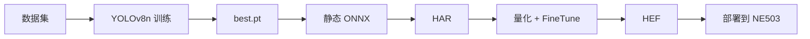

# HEF Model Compilation

本教程演示从数据集训练 YOLOv8n、导出静态 shape 的 ONNX，再用 Hailo Dataflow Compiler (DFC) 编译为 NE503 可用的 `.hef`。示例使用安全帽检测，但同一流程也适用于车辆、行人和 PPE 等自定义检测模型。

**先查找现成模型：** 如果只需要下载可用模型，请先访问 [CamThink Model Zoo](https://www.camthink.ai/developer-center/models/)。只有找不到匹配模型，或需要自定义类别和数据集时，才执行本教程。

## 1. 概览

HEF 的来源决定是否需要完整训练流程：

| 来源 | 处理方式 |
|:---|:---|
| NE503 预置模型或 CamThink Model Zoo | 直接下载并部署，按模型说明操作 |
| Hailo Model Zoo | 优先下载 ONNX/HAR；标准尺寸 HEF（如 640×640）不能直接用于 NE503，需按本教程重新编译 |
| 自定义模型 | 完成数据集、训练、ONNX 导出、量化编译和部署 |

NE503 平台前处理固定输出 **384(H)×640(W) NV12**，因此 HEF 输入必须是静态 NCHW `[1, 3, 384, 640]`。尺寸不匹配会导致 `byte_size mismatch`。

本教程的示例产物为 `safety_helmet_yolov8n_384_640.hef`，使用 2 类：`Helmet` 和 `No Helmet`。

### 全链路



## 2. 环境准备（CUDA）

### 2.1 硬件和软件

| 项目 | 要求 |
|:---|:---|
| GPU | NVIDIA GPU；独占机至少 8 GB 显存，共享机至少 16 GB；示例使用 Tesla T4 16G |
| CPU / RAM / 存储 | 至少 4 核 / 16 GB / 50 GB；推荐 8 核 / 30 GB |
| 操作系统 | Ubuntu 22.04 |
| CUDA / Python | CUDA 12.x，Python 3.10+ |
| Python 工具 | PyTorch 2.x、ultralytics 8.4.75+、onnx、onnxslim |
| DFC | Hailo AI Software Suite v5.3.0；通过 Docker 运行 |

DFC 只提供 `linux/amd64` 工具链，需在 Linux x86_64 主机或对应 Docker 环境中运行。到 [Hailo Developer Zone](https://hailo.ai/developer-zone/) 注册并下载约 13 GB 的 Software Suite，版本需与目标设备的 NPU 环境匹配。

### 2.2 创建训练环境

```bash
mkdir -p ~/yolo-train/{weights,datasets,scripts,logs,runs}
python3 -m venv ~/yolo-train/venv
source ~/yolo-train/venv/bin/activate
pip install ultralytics torch torchvision onnx onnxslim

python -c "import torch; print('CUDA available:', torch.cuda.is_available())"
# 期望输出：CUDA available: True
```

## 3. 数据集准备

示例使用 Roboflow Universe 的 `Safety Helmet.v4-data160.yolov8` 数据集。可在 [Roboflow Universe](https://universe.roboflow.com/) 搜索并下载 YOLOv8 格式，或用 API：

```bash
pip install roboflow
```

```python
from roboflow import Roboflow

rf = Roboflow(api_key="<你的 API key>")
rf.workspace("<workspace>").project("safety-helmet").version(4).download("yolov8")
```

目录应包含 `train`、`valid`、`test` 三个 split（示例为 10500 / 1000 / 500 张）。如果手动解压到 `~/yolo-train/datasets/safety-helmet`，确保 DFC 容器可读：

```bash
chmod -R a+rX ~/yolo-train/datasets/safety-helmet
```

创建 `data.yaml`：

```yaml
path: ~/yolo-train/datasets/safety-helmet
train: train/images
val: valid/images
test: test/images

nc: 2
names: ["Helmet", "No Helmet"]
```

`names` 的顺序就是模型输出的类别 ID 顺序。业务侧可按 `Helmet + No Helmet` 计算总人数，按 `Helmet / 总人数` 计算合规率。

## 4. 模型训练

### 4.1 固定输入尺寸

设备要求 `[1, 3, 384, 640]`。ultralytics 8.4.75 的 `train` 参数只接受整数 `imgsz`，因此本教程用 `imgsz=640` 加 `rect=True`，实际以横向矩形训练；ultralytics 8.4.96+ 可直接使用 `imgsz=(384, 640)`。

### 4.2 训练脚本

```python
import os
from ultralytics import YOLO

WEIGHTS = os.path.expanduser("~/yolo-train/weights/yolov8n.pt")
DATA = os.path.expanduser("~/yolo-train/datasets/safety-helmet/data.yaml")
PROJECT = os.path.expanduser("~/yolo-train/runs/helmet")

model = YOLO(WEIGHTS)
model.train(
    data=DATA,
    imgsz=640,
    rect=True,
    epochs=100,
    batch=8,          # 显存不足时改为 4 或 2
    patience=20,
    workers=4,
    project=PROJECT,
    name="yolov8n_640_rect",
    exist_ok=True,
)
```

训练完成后使用 `runs/helmet/yolov8n_640_rect/weights/best.pt`。可用 `tmux` 放到后台运行：

```bash
tmux new-session -d -s helmet-train \
  "source ~/yolo-train/venv/bin/activate && \
   python ~/yolo-train/scripts/train_helmet.py 2>&1 | tee ~/yolo-train/logs/helmet-train.log"
tail -f ~/yolo-train/logs/helmet-train.log
nvidia-smi
```

示例实测：Tesla T4、100 epoch、batch=8 约 3.4 小时，val mAP50 约 0.93。训练曲线：


## 5. ONNX 导出

```bash
yolo export model=~/yolo-train/runs/helmet/yolov8n_640_rect/weights/best.pt \
  format=onnx imgsz=384,640 opset=11 simplify=True dynamic=False
```

| 参数 | 要求 | 原因 |
|:---|:---|:---|
| `imgsz` | `384,640` | 对应设备输入 H×W |
| `opset` | `11` | Hailo DFC v5.3.0 兼容性稳定 |
| `simplify` | `True` | 简化计算图，便于 parser 处理 |
| `dynamic` | `False` | Hailo parser 要求静态 shape |

2 类模型应检查：

```text
Input:  name=images,  shape=[1, 3, 384, 640], dtype=float32
Output: name=output0, shape=[1, 6, 5040], dtype=float32
```

其中 `6 = 4` 个 bbox 坐标 `+ 2` 个类别分数，`5040` 是三个 stride 的网格总数。也可用 [Netron](https://netron.app/) 检查输入为静态 shape，输出末端仍是检测头 Conv 节点。

## 6. Hailo HEF 量化编译

以下命令按 2 类模型编写；如果类别数变化，必须同步修改 `data.yaml`、NMS 配置中的 `classes` 和应用侧类别映射。

### 6.1 准备 2048 张校准图片

在训练环境中生成 NHWC、float32、0–255 的校准集：

```python
import glob
import os
import numpy as np
from PIL import Image

TRAIN_DIR = os.path.expanduser("~/yolo-train/datasets/safety-helmet/train/images")
OUT = "/local/shared_with_docker/calib_2048.npy"
H, W, N = 384, 640, 2048

paths = sorted(glob.glob(os.path.join(TRAIN_DIR, "*.jpg")))[:N]
if len(paths) < N:
    raise RuntimeError(f"need {N} calibration images, found {len(paths)}")
arr = np.zeros((len(paths), H, W, 3), dtype=np.float32)
for i, path in enumerate(paths):
    image = Image.open(path).convert("RGB").resize((W, H))
    arr[i] = np.asarray(image, dtype=np.float32)
np.save(OUT, arr)
print(f"saved {OUT} shape={arr.shape}")
```

### 6.2 Parser：ONNX → HAR

在 DFC 容器内执行，并将工作目录挂载为 `/local/shared_with_docker`：

```bash
echo n | hailo parser onnx safety_helmet_yolov8n_384_640.onnx \
  --hw-arch hailo15h \
  --end-node-names /model.22/cv2.0/cv2.0.2/Conv /model.22/cv3.0/cv3.0.2/Conv \
                   /model.22/cv2.1/cv2.1.2/Conv /model.22/cv3.1/cv3.1.2/Conv \
                   /model.22/cv2.2/cv2.2.2/Conv /model.22/cv3.2/cv3.2.2/Conv
```

产物为 `safety_helmet_yolov8n_384_640.har`。`echo n` 跳过交互式 NMS prompt，NMS 在下一步的 `.alls` 中注入。

### 6.3 Optimize：量化 + FineTune

```bash
hailo optimize safety_helmet_yolov8n_384_640.har \
  --model-script yolov8_2cls_ft.alls \
  --calib-set-path calib_2048.npy
```

`yolov8_2cls_ft.alls`：

```text
normalization1 = normalization([0.0, 0.0, 0.0], [255.0, 255.0, 255.0])
nms_postprocess("yolov8_2cls_nms_config.json", meta_arch=yolov8, engine=cpu)
post_quantization_optimization(finetune, policy=enabled, learning_rate=0.0001, epochs=8, dataset_size=2048)
allocator_param(enable_partial_row_buffers=disabled)
performance_param(optimize_for_power=True)
```

其中 `normalization` 负责除以 255，`nms_postprocess` 将 NMS 编译进 HEF，FineTune 用无标签校准集恢复量化后的精度。

`yolov8_2cls_nms_config.json`：

```json
{
  "nms_scores_th": 0.2,
  "nms_iou_th": 0.6,
  "image_dims": [384, 640],
  "max_proposals_per_class": 100,
  "classes": 2,
  "regression_length": 16,
  "background_removal": false,
  "bbox_decoders": [
    {"name": "bbox_decoder41", "stride": 8, "reg_layer": "conv41", "cls_layer": "conv42"},
    {"name": "bbox_decoder52", "stride": 16, "reg_layer": "conv52", "cls_layer": "conv53"},
    {"name": "bbox_decoder62", "stride": 32, "reg_layer": "conv62", "cls_layer": "conv63"}
  ]
}
```

`classes` 必须等于模型类别数。类别名称不会写入 HEF：应用使用 `names` 的顺序把类别 ID 翻译成名称。

### 6.4 Compiler：HAR → HEF

```bash
hailo compiler safety_helmet_yolov8n_384_640_optimized.har --hw-arch hailo15h
```

建议使用 `<任务>_<网络>_<H>_<W>.hef` 命名，例如 `safety_helmet_yolov8n_384_640.hef`。部署后文件名（去掉 `.hef`）就是 `model_id`。

### 6.5 编译产物校验

```bash
hailo parse-hef safety_helmet_yolov8n_384_640.hef | grep -i "nms"
# 期望包含：yolov8_nms_postprocess HAILO NMS BY CLASS, Classes: 2

md5sum safety_helmet_yolov8n_384_640.hef
```

## 7. 部署到 NE503

### 7.1 Web 控制台导入（推荐）

打开 NE503 Web Console，进入 **AI Models → Import**，上传 `safety_helmet_yolov8n_384_640.hef`。


填写：

| 字段 | 值 |
|:---|:---|
| Model ID | `safety_helmet_yolov8n_384_640` |
| Model Type | `hef` |
| Threshold | `0.3`；自训模型使用 `raw_output_only=True` 时，实际过滤由应用处理 |

导入后状态应为 **Loaded**：


### 7.2 API 部署（脚本化）

```bash
scp safety_helmet_yolov8n_384_640.hef root@<设备IP>:/data/aipc/models/detection/

curl -k -X POST "https://<设备IP>/api/v1/ai/models/scan" \
  -H "Authorization: Bearer <token>"

curl -k -X POST "https://<设备IP>/api/v1/ai/models/safety_helmet_yolov8n_384_640/load" \
  -H "Authorization: Bearer <token>"
```

### 7.3 验证模型和推理

在 **AI Models** 页面确认模型为 **Loaded**，或执行：

```bash
aipc-cli model list
# 或 GET /api/v1/ai/models
```

端到端验证时，应用订阅发布原始帧的 `third`（默认推理流）或 `sub`，不要订阅只发布 H.264 的 `main`。自训模型必须使用 `raw_output_only=True` 并自行解码 NMS 输出；完整 SDK 调用方式见 [SDK 参考 · 自训模型](../3-reference/1-sdk-reference.md#32-raw_output_only-只用于原始输出)。

完成标准：模型状态为 **Loaded**，应用能持续收到推理结果，且 `Helmet` / `No Helmet` 的类别映射与 `data.yaml` 顺序一致。

## 8. 附录

### 8.1 完整产物清单

| 产物 | 作用 | 下载 |
|:---|:---|:---|
| `best.pt` | 训练最佳权重 | [下载](https://resources.camthink.ai/wiki/img/neoeyes-ne503-series/application-guide/app-development/model-training-and-hef/best.pt) |
| `safety_helmet_yolov8n_384_640.onnx` | 编译输入 | [下载](https://resources.camthink.ai/wiki/img/neoeyes-ne503-series/application-guide/app-development/model-training-and-hef/safety_helmet_yolov8n_384_640.onnx) |
| `safety_helmet_yolov8n_384_640.hef` | 设备部署产物 | [下载](https://resources.camthink.ai/wiki/img/neoeyes-ne503-series/application-guide/app-development/model-training-and-hef/safety_helmet_yolov8n_384_640.hef) |
| `args.yaml` / `results.csv` | 训练参数和指标 | [args.yaml](https://resources.camthink.ai/wiki/img/neoeyes-ne503-series/application-guide/app-development/model-training-and-hef/args.yaml) / [results.csv](https://resources.camthink.ai/wiki/img/neoeyes-ne503-series/application-guide/app-development/model-training-and-hef/results.csv) |

### 8.2 参考资源

- [Ultralytics YOLOv8 文档](https://docs.ultralytics.com/)
- [Hailo Developer Zone](https://hailo.ai/developer-zone/)
- [Roboflow Universe](https://universe.roboflow.com/)
- [Netron](https://netron.app/)

---

*最后更新: 2026-08-19*
