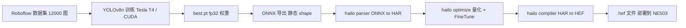
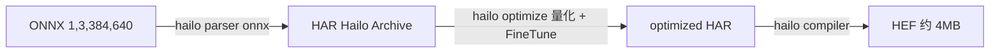

# HEF Model Compilation

本教程演示如何在 **NVIDIA CUDA** 环境下，从公开数据集训练 **YOLOv8n** 检测模型，导出静态 shape 的 **ONNX**，再经 **Hailo Dataflow Compiler (DFC)** 量化编译为可部署到 NE503 的 **`.hef`** 文件。本教程以安全帽检测（Helmet / No Helmet）为示例，所述方法具有通用性，可适用于任何 Hailo 自训检测模型（车辆、行人、PPE 等）的训练与编译流程。

目标读者：希望在 NE503（Hailo-15H）上部署自训检测模型的 ML 工程师，尤其是具备 YOLO 训练经验、但尚未接触过边缘 NPU 部署的开发者。

---

## 1. 概览

本教程覆盖从数据集准备到 HEF 部署的完整流程：

### HEF 的三个来源

设备上能运行的 HEF 有三个来源，是否需要走本篇完整流水线取决于来源：

| 来源 | 适用场景 | 所需操作 |
|:---|:---|:---|
| 设备预置模型 | 通用目标检测等出厂即用的能力 | 无需训练，直接在 app 中按 model_id 订阅；完整清单见[版本兼容性矩阵](../../3-software-guide/5-version-matrix.md) |
| 自训模型（本篇） | 预置模型不满足业务（自定类别、精度要求） | 走本篇全流程：训练 → ONNX → 量化编译 → 部署；订阅侧须 `raw_output_only=True`（见 [SDK 参考](../3-reference/1-sdk-reference.md#1-inference--ai-推理)） |
| [Hailo Model Zoo](https://github.com/hailo-ai/hailo_model_zoo) 官方模型仓库 | 需要常见检测/分割现成模型 | 仓库提供预编译 HEF 与 ONNX/HAR；**HEF 多为 640×640 等标准尺寸，不能直接导入**——下载 ONNX/HAR 按 §6 重编译为 384×640，否则推理报 `byte_size mismatch`；订阅侧按自训模型处理 |
| 其他第三方 HEF | 已有 Hailo 兼容的现成模型 | 跳过训练编译，从 §7 部署开始；仍须核对输入尺寸为 384×640（平台前处理固定），且订阅侧按自训模型处理 |

无论哪个来源，HEF 的输入尺寸必须匹配平台固定的 **384×640 NV12** 前处理输出，否则推理报 `byte_size mismatch`。

### 全链路流水线



### 载体选择：安全帽检测

本教程以安全帽检测（Helmet / No Helmet）为示例，使用 Roboflow Safety Helmet v4 数据集（12000 图）。该任务的类别定义清晰，业务指标直观：一个 2 类模型可同时输出「总人数」与「佩戴安全帽人数」——`总人数 = Helmet + No Helmet`、`合规率 = Helmet / 总人数`，无需额外的 person 检测器级联。

本教程的最终产物 `safety_helmet_yolov8n_384_640.hef` 已在 NE503 真机验证，val mAP50 ≈ 0.93。

---

## 2. 环境准备（CUDA）

### 2.1 硬件需求

| 组件 | 要求 |
|:---|:---|
| GPU | NVIDIA GPU，独占机 ≥8 GB 显存；共享机 ≥16 GB 显存（参考机型：Tesla T4 16G） |
| CPU | ≥4 核（推荐 8 核） |
| RAM | ≥16 GB（推荐 30 GB） |
| 存储 | ≥50 GB（数据集 + 训练产物 + Hailo SW Suite ~13 GB） |
| 网络 | 稳定的互联网连接（下载数据集与工具链） |

### 2.2 软件栈

| 项 | 实测版本 |
|:---|:---|
| 操作系统 | Ubuntu 22.04 |
| CUDA | 12.x |
| Python | 3.10+ |
| PyTorch | 2.x（CUDA 12.x 对应版本） |
| ultralytics | 8.4.75+（旧版的 `imgsz` 不支持 tuple，见 §4） |
| ONNX 工具 | onnx + onnxslim |

### 2.3 训练环境一键安装

```bash
mkdir -p ~/yolo-train/{weights,datasets,scripts,logs,runs}
python3 -m venv ~/yolo-train/venv
source ~/yolo-train/venv/bin/activate
pip install ultralytics torch torchvision onnx onnxslim

# 验证 CUDA 可用
python -c "import torch; print('CUDA available:', torch.cuda.is_available())"
# 期望输出: CUDA available: True
```

### 2.4 Hailo DFC 工具链

Hailo DFC（Dataflow Compiler）只发布 `linux/amd64`（wheel 限定 `linux_x86_64` + 原生 `.so`），通过 Docker 容器运行，原生 x86 无翻译开销。

1. 到 [Hailo Developer Zone](https://hailo.ai/developer-zone/) 注册免费账号
2. 下载 `hailo_ai_sw_suite` 压缩包（约 13 GB，版本需与设备 NPU 固件对齐，本教程实测 v5.3.0）
3. 导入镜像后，后续编译步骤在容器内执行（见 §6）

> **注意**：DFC 工具链仅在 Linux x86_64 上运行。本教程全程基于 NVIDIA CUDA 服务器（如 Tesla T4），不涉及 Mac 编译环境。

---

## 3. 数据集准备

### 3.1 下载 Roboflow Safety Helmet v4

数据集来源：Roboflow Universe 的 `Safety Helmet.v4-data160.yolov8`，YOLOv8 pyTorch 格式。到 [Roboflow Universe](https://universe.roboflow.com/) 搜索 "Safety Helmet" 下载，或用 API key 拉取：

```bash
pip install roboflow
```

```python
from roboflow import Roboflow
rf = Roboflow(api_key="<你的 API key>")           # 在 Roboflow 账号设置里生成
rf.workspace("<workspace>").project("safety-helmet").version(4).download("yolov8")
```

手动下载 zip 后解压：

```bash
cd ~/yolo-train/datasets
unzip "Safety Helmet.v4-data160.yolov8.zip" -d safety-helmet
cd safety-helmet
ls -d train valid test   # 三个 split 都在
```

数据集目录须对 DFC 容器可读（Roboflow 下载默认为 700 权限）：

```bash
chmod -R a+rX ~/yolo-train/datasets/safety-helmet
```

### 3.2 数据集分割

| Split | 图片数 | 含 background 图 | 备注 |
|:---|---:|---:|:---|
| train | 10500 | 15 | 含少量无标注背景图 |
| valid | 1000 | 1 | 用于训练期验证 |
| test | 500 | 2 | 最终评估 |
| **合计** | **12000** | 18 | |

### 3.3 data.yaml 配置

```yaml
path: ~/yolo-train/datasets/safety-helmet
train: train/images
val: valid/images
test: test/images

nc: 2
names: ["Helmet", "No Helmet"]
```

类别定义：

- `Helmet`（class 0）：**佩戴安全帽**的人头框
- `No Helmet`（class 1）：**未佩戴安全帽**的人头框

业务映射：`Helmet 框数 = 佩戴安全帽的人数`、`No Helmet 框数 = 未佩戴安全帽的人数`、`总人数 = Helmet + No Helmet`、`合规率 = Helmet / 总人数`。

---

## 4. 模型训练

### 4.1 关键超参：为何固定为 640×384

NE503 平台前处理固定输出 **384(H)×640(W)** 的 NV12 帧，模型输入需与此尺寸匹配，NCHW `[1, 3, 384, 640]`（H 在前，W 在后）。该尺寸由平台自动缩放生成，与 app 订阅哪条码流无关。

ultralytics 8.4.75 存在一个限制：`train` 的 `imgsz` 仅接受 int（8.4.96+ 版本才支持 tuple）。解决方法为使用 `imgsz=640` + `rect=True`（矩形训练），实际生成 384×640 的训练输入：

```python
TRAIN_IMGSZ  = 640          # int（8.4.75 不支持 tuple）
RECT         = True         # 矩形训练，保持 384 高度
EXPORT_IMGSZ = (384, 640)   # 导出时固定为静态 shape
```

> `rect=True` 让 dataloader 按 batch 内图像的长宽比，生成**最接近 imgsz 的矩形**（不强行 resize 到正方形）。安全帽图多为横向（宽>高），实际生成 384(H)×640(W)。日志里 "Image sizes 640 train" 只是回显参数值，不代表 tensor shape 是 640×640。若 ultralytics ≥8.4.96，可直接 `imgsz=(384,640)` 省掉 rect；本教程为兼容旧版用 rect 方案。

### 4.2 训练脚本（关键片段）

```python
import torch
from ultralytics import YOLO

WEIGHTS_DIR  = "~/yolo-train/weights"
DATA_YAML    = "~/yolo-train/datasets/safety-helmet/data.yaml"
PROJECT      = "~/yolo-train/runs/helmet"
NAME         = "yolov8n_640_rect"
TRAIN_IMGSZ  = 640
RECT         = True
EXPORT_IMGSZ = (384, 640)
EPOCHS       = 100
BATCH        = 8       # 可根据 GPU 显存调整（独占机可开 16/32）
PATIENCE     = 20
WORKERS      = 4

# 1) 训练
model = YOLO(f"{WEIGHTS_DIR}/yolov8n.pt")  # 预训练 backbone
model.train(
    data=DATA_YAML,
    imgsz=TRAIN_IMGSZ,
    rect=RECT,
    epochs=EPOCHS,
    batch=BATCH,
    patience=PATIENCE,
    workers=WORKERS,
    project=PROJECT,
    name=NAME,
    exist_ok=True,
)

# 2) 导出静态 ONNX（见 §5）
best_pt = f"{PROJECT}/{NAME}/weights/best.pt"
em = YOLO(best_pt)
em.export(
    format="onnx",
    imgsz=list(EXPORT_IMGSZ),
    opset=11,
    simplify=True,
    dynamic=False,
)
```

> 类数由 `data.yaml` 的 `nc` 决定，脚本本身不固定类数——2 类或 4 类均可使用同一脚本。

### 4.3 启动训练（tmux 后台）

```bash
ssh <gpu-server> 'tmux new-session -d -s helmet-train \
  "source ~/yolo-train/venv/bin/activate && \
   cd ~/yolo-train && python scripts/train_helmet.py 2>&1 | tee logs/helmet-train.log"'

# 实时跟随日志
ssh <gpu-server> 'tail -f ~/yolo-train/logs/helmet-train.log'

# 监控显存（确认没影响其他进程）
ssh <gpu-server> 'nvidia-smi --query-gpu=memory.used,memory.total,utilization.gpu --format=csv'
```

### 4.4 训练产物

训练完成后，`~/yolo-train/runs/helmet/yolov8n_640_rect/` 目录下将生成以下文件：

| 产物 | 作用 |
|:---|:---|
| `weights/best.pt` | 训练最佳权重（fp32） |
| `weights/last.pt` | 最后一轮权重（可 resume） |
| `args.yaml` | 超参完整记录 |
| `results.csv` | 逐 epoch metrics |
| `results.png` | 训练曲线总览图 |
| `labels.jpg` | 数据集标签分布四象限图 |
| `BoxPR_curve.png` / `BoxF1_curve.png` / `BoxP_curve.png` / `BoxR_curve.png` | PR/F1/P/R 曲线 |
| `confusion_matrix.png` / `confusion_matrix_normalized.png` | 混淆矩阵 |
| `train_batch*.jpg` / `val_batch*_labels.jpg` / `val_batch*_pred.jpg` | 训练/验证样本可视化 |

### 4.5 实测精度参考（Tesla T4，2 类）

100 epoch / batch=8 / Tesla T4，训练时长约 3.4 小时。val 集 metrics：

| 类别 | Images | Instances | Precision | Recall | mAP50 | mAP50-95 |
|:---|---:|---:|---:|---:|---:|---:|
| all | 1000 | 4786 | 0.906 | 0.884 | **0.931** | **0.631** |
| Helmet | 923 | 3694 | 0.929 | 0.907 | 0.949 | 0.653 |
| No Helmet | 175 | 1092 | 0.883 | 0.860 | 0.912 | 0.608 |

No Helmet 的 recall（0.860）比 Helmet（0.907）低约 5 个点，主要受类别分布影响（Helmet 样本多于 No Helmet）。


---

## 5. ONNX 导出

### 5.1 导出命令

训练脚本已包含导出，也可单独用 ultralytics CLI：

```bash
yolo export model=best.pt format=onnx imgsz=384,640 opset=11 simplify=True
# CLI 的 imgsz=384,640 是 "H,W" 字符串，等价 list [384, 640]
```

### 5.2 关键参数 rationale

| 参数 | 值 | 原因 |
|:---|:---|:---|
| `imgsz` | `[384, 640]` | 与设备 sub 流尺寸保持一致（H×W），NCHW `[1,3,384,640]` |
| `opset` | 11 | Hailo DFC v5.3.0 对 opset 11 稳定（14+ 有兼容性问题） |
| `simplify` | True | 通过 onnxsim 简化计算图（常量折叠 + 冗余算子消除），减少算子数对 Hailo parser 友好 |
| `dynamic` | False | Hailo parser 要求静态 shape，需禁用 dynamic axis |

### 5.3 ONNX shape 校验

导出成功后，输入输出 shape：

```text
Input:  name=images, shape=[1, 3, 384, 640], dtype=float32   # NCHW
Output: name=output0, shape=[1, 6, 5040], dtype=float32       # 2 类版
```

**输出 shape 推导**：

```
5040 = (384/8)×(640/8) + (384/16)×(640/16) + (384/32)×(640/32)
     = 48×80 + 24×40 + 12×20 = 3840 + 960 + 240 = 5040

6 = 4(bbox 坐标 cx,cy,w,h) + 2(类置信度 Helmet, No Helmet)
```

### 5.4 可视化检查（netron）

把 `.onnx` 上传到 [netron.app](https://netron.app)，检查：

1. 输入节点 `images` shape 是 `[1, 3, 384, 640]`（静态，非动态）
2. 输出节点 `output0` shape 是 `[1, 6, 5040]`
3. 最后几层是 `Conv`（检测头），不是 Sigmoid/Softmax（这些在 NMS 里处理）

---

## 6. Hailo HEF 量化编译

本节将 §5 导出的 2 类 ONNX（输出 `[1, 6, 5040]`）量化编译为可部署到 NE503 的 `.hef`。所有命令与 `yolov8_2cls_ft.alls` 参数均按 2 类（Helmet / No Helmet）给出；NMS config 的 `classes` 数 = 2。

### 6.1 编译流水线



### 6.2 准备校准集

Hailo 量化需要校准集（calibration set）。本教程使用 **2048 张** train 集图片作为校准集，以保证 int8 量化的精度。

```python
# prepare_calib_npy.py — 从 train 集抽 2048 张，导出为 NHWC float32 0-255 的 .npy
import os, glob, numpy as np
from PIL import Image

TRAIN_DIR = "~/yolo-train/datasets/safety-helmet/train/images"
OUT = "/local/shared_with_docker/calib_2048.npy"
TARGET_H, TARGET_W = 384, 640
N = 2048

imgs = sorted(glob.glob(os.path.join(TRAIN_DIR, "*.jpg")))[:N]
arr = np.zeros((N, TARGET_H, TARGET_W, 3), dtype=np.float32)
for i, p in enumerate(imgs):
    im = Image.open(p).convert("RGB").resize((TARGET_W, TARGET_H))
    arr[i] = np.asarray(im, dtype=np.float32)
np.save(OUT, arr)
print(f"saved {OUT} shape={arr.shape}")
```

### 6.3 步骤 1：hailo parser onnx（ONNX → HAR）

在 DFC 容器内执行（挂载工作目录到 `/local/shared_with_docker`）：

```bash
# MODEL=safety_helmet_yolov8n_384_640
echo n | hailo parser onnx safety_helmet_yolov8n_384_640.onnx \
  --hw-arch hailo15h \
  --end-node-names /model.22/cv2.0/cv2.0.2/Conv /model.22/cv3.0/cv3.0.2/Conv \
                   /model.22/cv2.1/cv2.1.2/Conv /model.22/cv3.1/cv3.1.2/Conv \
                   /model.22/cv2.2/cv2.2.2/Conv /model.22/cv3.2/cv3.2.2/Conv
# 产物：safety_helmet_yolov8n_384_640.har
```

关键点：

- `echo n |`：跳过 parser 的交互式 prompt（NMS 将在 §6.4 的 alls 中注入）
- `--hw-arch hailo15h`：指定目标硬件架构为 Hailo-15H
- `--end-node-names`：指定 6 个检测头 Conv 节点（框分支 cv2 + 类分支 cv3，各 3 个 stride），作为 parser 的截断点

### 6.4 步骤 2：hailo optimize（量化 + FineTune）

```bash
hailo optimize safety_helmet_yolov8n_384_640.har \
  --model-script yolov8_2cls_ft.alls \
  --calib-set-path calib_2048.npy
# 产物：safety_helmet_yolov8n_384_640_optimized.har
```

**`yolov8_2cls_ft.alls` 全文**（normalization + NMS + 显式 FineTune）：

```text
normalization1 = normalization([0.0, 0.0, 0.0], [255.0, 255.0, 255.0])
nms_postprocess("yolov8_2cls_nms_config.json", meta_arch=yolov8, engine=cpu)
post_quantization_optimization(finetune, policy=enabled, learning_rate=0.0001, epochs=8, dataset_size=2048)
allocator_param(enable_partial_row_buffers=disabled)
performance_param(optimize_for_power=True)
```

关键点：

- `normalization`：input 归一化到 0-1（除以 255）
- `nms_postprocess`：在优化图尾部插入 NMS 算子（在设备 CPU 上运行），最终 HEF 输出张量名变成 `<network>/yolov8_nms_postprocess`，格式 `HAILO NMS BY CLASS`
- `post_quantization_optimization(finetune, ...)`：**FineTune 的触发配置**，基于无标签知识蒸馏。`policy=enabled` 强制开启，不依赖 `optimization_level` 默认值。FineTune 执行 8 个 epoch（约 14 分钟），将量化后的置信度恢复至 teacher（fp32）分布
- `nms_postprocess` 引用的 `yolov8_2cls_nms_config.json` 定义 bbox_decoders 的 stride/reg/cls layer 映射、score/iou threshold、`classes`（本教程 = 2）
- `nms_scores_th`（本教程 = 0.2）是 NMS 置信度阈值，编译进 HEF——低于该分数的候选框在 HEF 内就被丢弃，app 侧调不到；app 侧阈值只能在此基础上再收紧
**`yolov8_2cls_nms_config.json` 全文**（2 类版）：

```json
{
    "nms_scores_th": 0.2,
    "nms_iou_th": 0.6,
    "image_dims": [384, 640],
    "max_proposals_per_class": 100,
    "classes": 2,
    "regression_length": 16,
    "background_removal": false,
    "bbox_decoders": [
        {"name": "bbox_decoder41", "stride": 8,  "reg_layer": "conv41", "cls_layer": "conv42"},
        {"name": "bbox_decoder52", "stride": 16, "reg_layer": "conv52", "cls_layer": "conv53"},
        {"name": "bbox_decoder62", "stride": 32, "reg_layer": "conv62", "cls_layer": "conv63"}
    ]
}
```

**类别名称不随 HEF 走**：HEF 文件里只有类别 id（`data.yaml` 的 `names` 顺序即 id 顺序），不含类别名字符串。平台后处理路径的类别名来自模型注册时的 config_json；而自训模型走 `raw_output_only=True` 自解码时，**类别 id → 名称的映射表由 app 自己维护**（如 `labels = ["Helmet", "No Helmet"]`），解码结果里的 class id 按这张表翻译。映射顺序与训练时 `names` 不一致，业务侧就会张冠李戴。

### 6.5 步骤 3：hailo compiler（HAR → HEF）

```bash
hailo compiler safety_helmet_yolov8n_384_640_optimized.har --hw-arch hailo15h
# 产物：safety_helmet_yolov8n_384_640.hef（约 4 MB）
```

### 命名规范

产物文件名建议遵循 `<任务>_<网络>_<H>_<W>.hef` 结构（如 `safety_helmet_yolov8n_384_640.hef`）：任务与网络便于识别用途和模型架构，`384_640` 即输入高×宽——文件名自带关键规格，排查尺寸不匹配问题时一眼可查。

**文件名即 model_id**：部署时模型以文件名（去 `.hef` 后缀）作为 model_id 注册（本篇 §7 的 `safety_helmet_yolov8n_384_640` 即由文件名而来），app 中 `subscribe(model=...)` / `app.yaml` 的模型声明都用这个 id。命名时避免大写、空格和特殊字符，防止注册后与配置不一致。

### 6.6 编译产物校验

```bash
# 确认 NMS-baked
hailo parse-hef safety_helmet_yolov8n_384_640.hef | grep -i "nms"
# 期望输出包含：yolov8_nms_postprocess HAILO NMS BY CLASS, Classes: 2

# md5 跨机器校验（训练机、编译机、本地三处必须一致）
md5sum safety_helmet_yolov8n_384_640.hef
```

---

## 7. 部署到 NE503

导入 HEF 有两条路：**Web 控制台**（交互导入，本节主线）或 **API 正路**（适合脚本化 / 批量部署）。API 路径为「文件放设备模型库 → 扫描入库 → 加载到 NPU」三步：

```bash
# 1. 上传 HEF 到设备模型库（按类型选子目录，检测类放 detection/）
scp safety_helmet_yolov8n_384_640.hef root@<设备IP>:/data/aipc/models/detection/

# 2. 扫描模型库，注册到数据库（已存在的会跳过）
curl -k -X POST "https://<设备IP>/api/v1/ai/models/scan" -H "Authorization: Bearer <token>"

# 3. 加载到 NPU
curl -k -X POST "https://<设备IP>/api/v1/ai/models/safety_helmet_yolov8n_384_640/load" -H "Authorization: Bearer <token>"
```

### 7.1 通过 Web 控制台导入模型

打开 NE503 Web 控制台，进入 **AI Models** 页面，点击 **Import** 导入编译好的 `safety_helmet_yolov8n_384_640.hef` 文件：


上传 HEF 文件：


在导入向导中填写模型参数，各字段如下：


| 参数 | 值 |
|:---|:---|
| Model ID | `safety_helmet_yolov8n_384_640` |
| Model Type | `hef` |
| Threshold | `0.3`（置信度阈值，用于平台后处理过滤；`raw_output_only` 自训模型路径下 app 拿到的是 NMS 原始输出，实际过滤以 SDK 参考 / [故障排查 §3.1](../../5-troubleshooting.md) 为准） |

导入后模型自动加载到 NPU，页面状态显示为 Loaded：


**完成标准**：AI Models 页面中 `safety_helmet_yolov8n_384_640` 状态显示为 Loaded；`aipc-cli model list` 或 `GET /api/v1/ai/models` 可查到该模型。

### 7.2 验证模型加载

在 **AI Models** 页面确认 `safety_helmet_yolov8n_384_640` 出现在模型列表中且状态为 **Loaded**（未加载则不会推理，选中模型触发加载或调用 `POST /api/v1/ai/models/<id>/load`）。脚本化部署也可用 API / CLI 确认：`GET /api/v1/ai/models` 或 `aipc-cli model list`。点击模型卡片可查看详细信息（ID、版本、加载时间、模型路径）。

### 7.3 端到端验证

模型加载完成后，部署一个安全帽检测 app 进行端到端验证。app 通过 SDK 订阅推理结果——`stream` 须填发布原始帧的流（`third` 为默认推理流，`sub` 亦可；`main` 只发编码 H.264，订阅它等不到结果），当画面中出现佩戴或未佩戴安全帽的人头时输出检测事件。部署 app 的完整流程（构建镜像、编写 app.yaml、部署到设备、启动验收）参见 [Hello World](./1-hello-world.md)；自训模型订阅时须 `raw_output_only=True` 并自解码 NMS 输出，用法与示例见 [SDK 参考 · raw_output_only 与自训模型](../3-reference/1-sdk-reference.md#raw_output_only-与自训模型)。

---

## 8. 附录

### 8.1 完整产物清单

| 产物 | 大小 | 作用 | 下载 |
|:---|---:|:---|:---|
| `best.pt` | ~6 MB | 训练最佳权重（fp32） | [下载](https://resources.camthink.ai/wiki/img/neoeyes-ne503-series/application-guide/app-development/model-training-and-hef/best.pt) |
| `safety_helmet_yolov8n_384_640.onnx` | ~12 MB | 交编译的 ONNX | [下载](https://resources.camthink.ai/wiki/img/neoeyes-ne503-series/application-guide/app-development/model-training-and-hef/safety_helmet_yolov8n_384_640.onnx) |
| `safety_helmet_yolov8n_384_640.hef` | ~4 MB | 部署到设备的最终产物 | [下载](https://resources.camthink.ai/wiki/img/neoeyes-ne503-series/application-guide/app-development/model-training-and-hef/safety_helmet_yolov8n_384_640.hef) |
| `args.yaml` | ~2 KB | 超参完整记录 | [下载](https://resources.camthink.ai/wiki/img/neoeyes-ne503-series/application-guide/app-development/model-training-and-hef/args.yaml) |
| `results.csv` | ~16 KB | 逐 epoch metrics | [下载](https://resources.camthink.ai/wiki/img/neoeyes-ne503-series/application-guide/app-development/model-training-and-hef/results.csv) |

### 8.2 FAQ

**Q1：训练显存不够（OOM）？**
降低 `batch`（8 → 4 → 2），或更换显存更大的 GPU。

**Q2：训练 loss 不收敛或 mAP 未达到预期？**
① 检查数据集标注（用 `train_batch0.jpg` 肉眼核对）；② 调小 lr（0.01 → 0.001）；③ 关闭 AMP（`amp=false`）排除混精问题；④ 换 backbone（yolov8n → yolov8s）。

**Q3：导出 ONNX 后 shape 不对？**
检查 `imgsz` 参数。CLI 用 `imgsz=384,640`（逗号分隔），Python 用 `imgsz=[384, 640]`（list）。如果输出 channel 数不对，检查 `data.yaml` 的 `nc`。

**Q4：部署到 Hailo 后无检测结果如何排查？**
按以下顺序排查：① 用 `onnxruntime` 验证 FP ONNX 的训练精度；② 用 `hailo parse-hef xxx.hef` 确认 HEF 包含 `yolov8_nms_postprocess HAILO NMS BY CLASS, Classes: 2`；③ 确认 NMS config 的 `classes` 数与模型实际类别数一致（§8.3 裁类后尤其要同步改 nms_config，不一致会零检出或结果错乱）；④ 确认 app 已按 §7.3 设置 `raw_output_only=True`（用法见 [SDK 参考](../3-reference/1-sdk-reference.md#raw_output_only-与自训模型)）；仍无结果时按[故障排查 FAQ §3.1](../../5-troubleshooting.md) 的五步排查。

**Q5：量化后精度下降明显？**
确认校准集为 2048 张（见 §6.2），且 alls 中已配置 `post_quantization_optimization(finetune, ...)`。FineTune 通过无标签知识蒸馏将量化后的置信度恢复至 teacher 分布。

### 8.3 进阶：torch surgery 裁剪类别

已有训练好的多类模型但只想保留其中几类时，可以不重训，直接对权重做手术再重新编译 HEF。以下以把通用 80 类 YOLOv8n 裁成「仅 person」为例（2026-08 真机验证可跑）：

```python
# prune_person.py — 裁掉 80 类中除 person（class 0）外的所有类别
import torch
from ultralytics import YOLO

KEEP = [0]  # 保留的类别 id
model = YOLO("yolov8n.pt").model
head = model.model[-1]

# 1) 重建 Detect head，nc 改为 len(KEEP)，按 KEEP 索引拷贝权重
new_head = type(head)(nc=len(KEEP), ch=head.ch)
for i in range(len(head.cv2)):
    new_head.cv2[i].conv.weight.copy_(head.cv2[i].conv.weight[KEEP])
    new_head.cv3[i].conv.weight.copy_(head.cv3[i].conv.weight[KEEP])
    new_head.dfl = head.dfl
model.model[-1] = new_head

# 2) 更新类别数；3) 导出 ONNX（imgsz 同原模型）；4) 按 §6 流程重新量化编译——nms_config 的 `classes` 须同步改为裁剪后的类数
```

裁类后的模型 `nc` 减小，HEF 输出更小、编译产物校验（§6.6）中的 `Classes:` 数量相应变化。裁剪只保留原权重，**不恢复被裁类别的精度**——原模型对这些类的召回即裁剪后模型的召回上限；若裁剪后精度不满足业务，回退重训（本篇 §3-§4）。

### 8.4 参考资源

- [ultralytics YOLOv8 文档](https://docs.ultralytics.com/) — 训练 / 导出 / 评估官方文档
- [Hailo Developer Zone](https://hailo.ai/developer-zone/) — DFC / SW Suite 下载（免费注册）
- [Roboflow Universe](https://universe.roboflow.com/) — Safety Helmet v4 数据集
- [netron.app](https://netron.app/) — ONNX 模型可视化

---

*最后更新: 2026-08-19*
