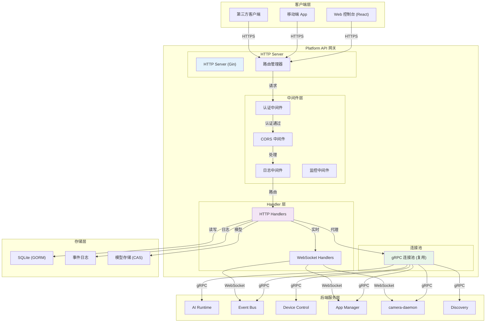

# RESTful API Reference

Platform API 是 NE503 的 HTTP 网关，基于 Go + Gin 框架构建，代理所有后端 gRPC 服务，支持 WebSocket 实时通信（事件流、视频流、终端、容器日志）。技术栈：Go + Gin + gRPC Client + SQLite (GORM)。



请求处理流程：客户端发送 HTTP 请求 → CORS 处理 → 日志记录 → 认证校验 → 路由匹配 → 参数校验 → 权限检查 → 业务逻辑（通过 gRPC 连接池调用后端服务） → 响应包装。网关处理延迟约 1-5ms，后端服务处理约 10-50ms。

---

## 1. 概述

Platform API 是 NE503 的 HTTP 网关，基于 Go + Gin 框架构建，统一代理所有后端 gRPC 服务（AI Runtime、Event Bus、Device Control、App Manager 等），并支持 WebSocket 实时通信（事件流、视频流、容器日志、Web 终端）。

| 项目 | 说明 |
|:---|:---|
| 端点前缀 | `/api/v1` |
| 基础地址 | `http://<设备IP>:8080` |
| Swagger UI | `/swagger/`（交互式文档，可直接试调） |
| OpenAPI 规格 | `/api/v1/swagger.yaml` |
| 协议 | HTTP + WebSocket |
| 响应格式 | JSON |

> 以下各节路径均省略 `/api/v1` 前缀，实际请求时需拼接完整路径，如 `/api/v1/system/info`。登录端点 `/api/login` 是例外，独立于该前缀。

---

## 2. 认证

Platform API **默认启用认证**。除公开端点外，所有请求必须携带有效 Token，否则返回 `401`。

**登录获取 Token：**

```bash
# 登录端点独立于 /api/v1 前缀
curl -X POST http://<设备IP>:8080/api/login \
  -H "Content-Type: application/json" \
  -d '{"username":"admin","password":"password"}'
```

```json
// 响应
{"code":0,"message":"Success","data":{"token":"Bearer <token>","username":"admin"}}
```

> 出厂默认账号 `admin` / 密码 `password`，**生产部署务必修改**（通过 `POST /system/password` 或配置文件 `auth.username` / `auth.password`）。返回的 Token 为静态 Bearer 密钥，直接作为后续请求的凭据。

**Token 传递方式：**

| 方式 | 格式 | 适用场景 |
|:---|:---|:---|
| HTTP Header | `Authorization: Bearer <token>` | REST API 请求（推荐） |
| HTTP Header | `X-API-Key: <token>` | REST API 请求 |
| Query Parameter | `?token=<token>` | WebSocket 连接（浏览器侧无法自定义 Header 时） |

**公开端点（无需认证）：**

- `POST /api/login` — 登录
- `GET /system/health` — 健康检查

> 注意：出厂默认即开启认证。第三方集成时必须先登录拿 Token，再带 Token 调用其余端点。

---
## 3. 系统管理

系统管理接口负责设备登录鉴权、系统信息查询、固件升级（OTA）、时间与 NTP 配置等底层运维操作，主要面向集成方做设备纳管、健康监测与远程维护。

### 3.1 登录与系统信息

| 方法 | 路径 | 说明 |
| --- | --- | --- |
| POST | `/login` | 提交用户名密码换取 访问令牌（Token）；真实地址为 `POST /api/login`（独立于 `/api/v1` 前缀），公开端点，无需鉴权 |
| GET | `/system/health` | 健康检查，公开端点，无需鉴权，常用于存活探测 |
| GET | `/system/info` | 获取设备系统信息（型号、版本、硬件等） |
| GET | `/system/stats` | 获取系统运行统计（CPU、内存、磁盘等资源占用） |

登录是调用其他受保护接口的前提：成功后返回的 Token 需以 `Authorization: Bearer <token>` 形式携带在后续请求头中。请求体为 JSON，包含 `username` 与 `password` 两个字段（均为必填）。

### 3.2 密码与重启

| 方法 | 路径 | 说明 |
| --- | --- | --- |
| POST | `/system/password` | 修改后台登录密码 |
| POST | `/system/restart` | 触发设备系统重启 |

修改密码请求体为 JSON，需提供 `old_password`（旧密码，可选）与 `new_password`（新密码，必填）。`/system/restart` 无请求体，调用后设备将重启，期间服务短暂不可用，应做好重连重试。

### 3.3 固件升级（OTA)

| 方法 | 路径 | 说明 |
| --- | --- | --- |
| GET | `/system/ota/detect` | 检查是否存在新的 OTA 固件更新 |
| GET | `/system/ota/status` | 查询当前 OTA 升级进度与状态 |
| POST | `/system/ota/install` | 上传固件包并安装，`multipart/form-data` 字段名为 `firmware` |
| POST | `/system/ota/parse` | 仅解析固件文件信息，不执行安装，`multipart/form-data` 字段名为 `firmware` |
| POST | `/system/ota/install-from-path` | 从设备本地绝对路径安装固件（运维） |

升级典型流程：先 `/system/ota/detect` 检查更新或用 `/system/ota/parse` 校验本地固件包 → `/system/ota/install` 上传安装 → 轮询 `/system/ota/status` 跟踪进度。`install-from-path` 需请求体 `{ "path": "<设备上固件文件的绝对路径>" }`，适用于固件已预先下发到设备的运维场景，第三方集成一般用上传方式即可。

### 3.4 时间管理

| 方法 | 路径 | 说明 |
| --- | --- | --- |
| GET | `/system/time` | 获取设备当前系统时间 |
| POST | `/system/time/set` | 手动设置系统时间 |
| GET | `/system/time/config` | 获取时间配置（NTP 是否启用、NTP 服务器等） |
| PUT | `/system/time/timezone` | 设置设备时区 |
| GET | `/system/time/timezones` | 列出设备支持的可选时区 |
| PUT | `/system/time/ntp` | 配置 NTP 设置（启用/关闭、服务器地址） |
| POST | `/system/time/ntp/sync` | 立即触发一次 NTP 时间同步 |

手动设置时间请求体为 `{ "datetime": "<RFC3339 时间戳>" }`，例如 `2024-01-01T12:00:00Z`。设置时区请求体为 `{ "timezone": "Asia/Shanghai" }`，可先通过 `/system/time/timezones` 取合法值。NTP 配置请求体为 `{ "enabled": true, "server": "ntp.aliyun.com" }`；启用 NTP 后可用 `/system/time/ntp/sync` 立即同步一次，避免等待下次定时同步。

---

## 4. AI 模型与推理

本组端点面向需要直接管理推理模型的开发者，用于在设备 AI 运行时中注册、上传、查询和卸载模型文件（.hef、.onnx、.bin、.tflite 等），并获取运行时的整体统计信息；应用侧通常不直接调用，模型准备阶段会用到。

### 4.1 模型管理

| 方法 | 路径 | 说明 |
| --- | --- | --- |
| GET | `/ai/models` | 列出所有已注册模型 |
| POST | `/ai/models` | 登记一个新模型（指向设备上已有的模型文件路径） |
| POST | `/ai/models/upload` | 上传模型文件并自动登记到运行时 |
| GET | `/ai/models/{model_id}` | 查询指定模型的详细信息 |
| DELETE | `/ai/models/{model_id}` | 卸载（取消登记）指定模型 |
| GET | `/ai/models/{model_id}/apps` | 查询当前正在使用该模型的应用列表 |

请求体要点：

- `POST /ai/models`:JSON 体，必填 `model_path`（模型文件在设备上的绝对路径，如 `/data/aipc/models/yolov8n.hef`)；可选项 `model_id` 用于自定义模型标识，不传则由系统生成。
- `POST /ai/models/upload`:multipart/form-data 上传，必填字段为 `model`（模型文件本身，支持 `.hef`、`.onnx`、`.bin`、`.tflite`)；可选 `model_id`、`model_type`(hef/onnx/tflite)、`variant`、`threshold`（检测阈值）、`max_detections`（最大检测数）等推理参数。适合模型文件尚未在设备上的场景。

### 4.2 运行时统计

| 方法 | 路径 | 说明 |
| --- | --- | --- |
| GET | `/ai/stats` | 获取 AI 运行时的整体统计信息（已注册模型数、加载状态等） |

删除模型前建议先调用 `GET /ai/models/{model_id}/apps` 确认没有应用正在引用，避免影响在跑的推理任务。

---

## 5. 应用与容器管理

管理设备上运行的 AI 应用及其底层容器：安装、启停、查看日志与运行状态，以及拉取/删除容器镜像。面向需要远程部署或运维自有应用的三方集成方。

### 5.1 应用管理

应用由 `app.yaml` 清单描述，每个应用有唯一 `app_id`，底层对应一个或多个容器。

| 方法 | 路径 | 说明 |
| --- | --- | --- |
| GET | `/apps` | 列出所有已安装应用 |
| POST | `/apps` | 按 `app.yaml` 清单安装应用 |
| GET | `/apps/{app_id}` | 查看指定应用详情 |
| DELETE | `/apps/{app_id}` | 卸载指定应用，可用 `keep_logs` 保留日志 |
| POST | `/apps/{app_id}/start` | 启动指定应用 |
| POST | `/apps/{app_id}/stop` | 停止指定应用，可用 `timeout` 控制优雅退出等待 |
| POST | `/apps/{app_id}/restart` | 重启指定应用 |
| GET | `/apps/{app_id}/stats` | 查看应用运行统计（CPU、内存等） |
| GET | `/apps/{app_id}/logs` | 查看应用日志，支持 `max_lines` 与 `follow` |
| GET | `/apps/{app_id}/permissions` | 查看应用被授予的权限 |
| POST | `/apps/wizard` | 通过向导快速安装应用（直接给 app_id/名称/镜像） |
| POST | `/apps/upload-image` | 上传容器镜像文件到设备 |

安装应用的两种入口区别：
- `POST /apps`：已有完整 `app.yaml` 清单，请求体 `{ manifest_path, image_path? }`，`manifest_path` 必填，`image_path` 可选（离线安装本地镜像时使用）。
- `POST /apps/wizard`：无需提前写清单，请求体 `{ metadata: { id, name }, image, config? }`（真机实际要求 `metadata.id`/`metadata.name` + 顶层 `image`，与 spec 标注略有出入），`config` 为应用自定义配置对象，适合三方系统快速推送一个应用。
- `POST /apps/upload-image`：`multipart/form-data` 上传镜像文件，字段名 `file`，用于设备无外网时离线导入镜像。

### 5.2 容器管理

直接操作底层容器（一般通过应用层间接管理，仅在排障或特殊场景使用）。

| 方法 | 路径 | 说明 |
| --- | --- | --- |
| GET | `/containers` | 列出容器，支持按 `state`、`search` 过滤及分页 |
| GET | `/containers/{id}` | 查看容器详情 |
| DELETE | `/containers/{id}` | 删除指定容器 |
| GET | `/containers/{id}/stats` | 查看容器资源占用 |
| GET | `/containers/{id}/logs` | 查看容器日志，`tail` 控制返回行数 |
| GET | `/containers/{id}/logs/stream` | 实时推送容器日志（SSE，`text/event-stream`） |
| POST | `/containers/{id}/start` | 启动容器 |
| POST | `/containers/{id}/stop` | 停止容器 |
| POST | `/containers/{id}/restart` | 重启容器 |

`GET /containers` 常用过滤参数：`state` 取值 `running`/`stopped`/`all`，`search` 按名称模糊匹配，`page`/`page_size` 分页（默认 1/20）。

### 5.3 容器镜像

| 方法 | 路径 | 说明 |
| --- | --- | --- |
| GET | `/images` | 列出本地容器镜像 |
| POST | `/images/pull` | 从镜像仓库拉取镜像，请求体 `{ image }` |
| DELETE | `/images/{image}` | 删除本地镜像 |

### 5.4 容器实时日志与终端（WebSocket）

两个 WebSocket 端点用于实时交互，连接时通过 `token` 查询参数传递认证令牌：

| 方法 | 路径 | 说明 |
| --- | --- | --- |
| GET | `/containers/{id}/logs/ws` | 实时推送容器日志（WebSocket），`tail` 控制初始行数 |
| GET | `/containers/{id}/exec/ws` | 交互式容器终端（WebSocket），可指定 `cols`/`rows`/`command` |

`exec/ws` 默认执行 `/bin/sh`，终端尺寸默认 80×24，一般仅用于现场调试，三方集成很少直接使用。

---

## 6. 应用商店

应用商店（Store）用于浏览、检索可安装的 AI 应用，并管理设备上已安装应用的记录。第三方集成方一般通过商店接口查找目标应用、触发安装，再用安装管理接口查询运行状态或卸载。接口路径已去掉 `/api/v1` 前缀。

### 6.1 商店目录

浏览商店中的应用列表及其分类、标签信息。

| 方法 | 路径 | 说明 |
|------|------|------|
| GET | `/store/apps` | 列出商店中的应用，支持按分类、关键词搜索、是否精选过滤及分页 |
| GET | `/store/apps/{key}` | 获取指定应用的详情（路径参数 `key` 为应用唯一标识） |
| GET | `/store/categories` | 列出应用分类，供筛选与导航使用 |
| GET | `/store/tags` | 列出应用标签，用于多维度检索 |

`GET /store/apps` 常用查询参数：`category`（分类）、`search`（关键词）、`featured`（是否精选）、`page` 与 `page_size`（分页），均为可选。

### 6.2 安装与已装应用管理

从商店安装应用，并维护设备本地的安装记录。

| 方法 | 路径 | 说明 |
|------|------|------|
| POST | `/store/apps/{key}/install` | 从商店安装指定应用（`key` 为应用标识） |
| GET | `/store/installs` | 列出设备上已安装的应用记录 |
| POST | `/store/installs` | 创建一条安装记录 |
| GET | `/store/installs/{app_id}` | 获取指定已装应用的安装详情 |
| PUT | `/store/installs/{app_id}` | 更新指定应用的安装记录 |
| DELETE | `/store/installs/{app_id}` | 删除指定应用的安装记录（卸载并清理记录） |

请求体要点：

- **`POST /store/apps/{key}/install`**：可选请求体可指定安装的 `version`（版本号）与 `config`（应用初始化配置对象）。留空则使用商店默认版本与配置。
- **`POST /store/installs`**：请求体需提供 `app_id` 与 `name`（均为必填），另有可选字段 `version`、`image`、`store_app_id`，用于手动登记一条安装记录。
- **`PUT /store/installs/{app_id}`**：用于回写安装状态，可更新字段包括 `status`、`container_id`、`pid`、`message` 与 `config`，便于跟踪容器或进程的运行情况。

日常第三方集成通常只需 `POST /store/apps/{key}/install` 触发安装、再用 `GET /store/installs/{app_id}` 轮询状态即可；`POST/PUT/DELETE /store/installs` 这一组更偏底层记录维护，一般无需直接调用。

---

## 7. 设备控制

本组用于远程操控 NE503 的硬件外设与镜头，并查询/维护设备基础信息，适合第三方平台对接补光灯、红外夜视、云台变焦以及 GPIO 外设。

### 7.1 设备状态与信息

| 方法 | 路径 | 说明 |
| --- | --- | --- |
| GET | `/device/status` | 查询设备整体运行状态 |
| GET | `/device-info` | 获取设备信息（型号、版本、名称等） |
| PUT | `/device-info` | 修改设备名称 |

### 7.2 光源与夜视

| 方法 | 路径 | 说明 |
| --- | --- | --- |
| POST | `/device/light` | 设置白光补光灯亮度（0–100） |
| POST | `/device/ir-led` | 开关红外补光灯 |
| POST | `/device/ir-cut` | 切换 IR-CUT 滤光片模式（auto/day/night） |

### 7.3 镜头与云台

| 方法 | 路径 | 说明 |
| --- | --- | --- |
| POST | `/device/ptz` | 云台与镜头统一控制（水平/俯仰/变倍/聚焦/预置位/停止） |
| POST | `/device/zoom` | 单独控制变倍速度 |
| POST | `/device/focus` | 单独控制聚焦速度 |
| POST | `/device/autofocus` | 开关自动聚焦 |

### 7.4 GPIO

| 方法 | 路径 | 说明 |
| --- | --- | --- |
| POST | `/device/gpio` | 写入指定 GPIO 引脚的电平值 |
| GET | `/device/gpio/{pin}` | 读取指定 GPIO 引脚的电平值 |

**请求体要点**

- 光源类：`/device/light` 传 `level`（整数 0–100）；`/device/ir-led` 传布尔 `status`；`/device/ir-cut` 传 `mode`（`auto`/`day`/`night`）。
- 云台统一入口 `/device/ptz` 通过 `action`（`pan`/`tilt`/`stop`/`preset`/`zoom`/`focus`）区分动作，再按动作配 `direction`+`speed`（水平/俯仰）、`zoom_speed`/`focus_speed`（正负代表方向）或 `preset_id`（1–255）。如果只需单一变倍或聚焦，也可直接用 `/device/zoom`、`/device/focus`，二者仅传一个 `speed`（-100～100，负值缩小/近焦，正值放大/远焦）。
- GPIO：写入时传 `pin`（引脚号）与布尔 `value`；读取时引脚号放在路径参数 `{pin}` 中。
- 改设备名：`PUT /device-info` 传 `device_name`，仅允许字母、数字、下划线和连字符。

---

## 8. 媒体与视频流

这组接口用于查看视频流列表、订阅实时 H.264 画面，以及调整摄像头底层参数（ISP 图像、编码器、RTSP、AI 叠加、OSD 字幕等），面向需要做二次画面接入或图像调校的第三方集成方。

### 8.1 视频流查询与实时订阅

| 方法 | 路径 | 说明 |
|------|------|------|
| GET | `/streams` | 列出设备当前可用的视频流（编码通道）及其基本信息。 |
| GET | `/streams/{stream_id}` | 查询指定视频流的详细信息（分辨率、编码、帧率等）。 |
| GET | `/h264/{stream_id}` | 订阅指定流的实时 H.264 裸码流，通过 WebSocket 持续推送视频帧（WebSocket）。 |

### 8.2 摄像头配置（整体）

| 方法 | 路径 | 说明 |
|------|------|------|
| GET | `/media/config` | 读取摄像头守护进程（camera daemon）的完整配置。 |
| POST | `/media/config` | 以部分覆盖（partial overlay）方式更新守护进程配置并立即生效，请求体只需包含要改的字段。 |

### 8.3 图像与编码

| 方法 | 路径 | 说明 |
|------|------|------|
| PUT | `/media/image` | 调整 ISP 图像参数（亮度、对比度、饱和度、锐度，取值均为 0～100）。 |
| PUT | `/media/encoder` | 调整某条流的编码参数（码率、帧率、GOP 等），需指定 `stream_name`。 |
| PUT | `/media/encoder/reconfig` | 对指定流做完整的编码器重建（可改分辨率、编码 h264/h265、码率、帧率、GOP），改动幅度大于上面的 `/media/encoder`。 |

### 8.4 RTSP、叠加层与 OSD

| 方法 | 路径 | 说明 |
|------|------|------|
| PUT | `/media/rtsp` | 开启或关闭设备内置 RTSP 服务（请求体 `{ "enabled": true/false }`）。 |
| PUT | `/media/ai-overlay` | 配置 AI 检测结果叠加层（是否启用、是否显示标签/置信度、线条粗细）。 |
| PUT | `/media/osd` | 配置屏幕字幕（OSD），支持按流添加文本和时间戳叠加，可设置位置、字号、颜色、是否启用。 |

### 8.5 关键请求体要点

- `PUT /media/image`：传 `brightness`/`contrast`/`saturation`/`sharpness` 四个整数，范围都是 0 到 100，只下发需要调整的字段即可。
- `PUT /media/encoder` 与 `PUT /media/encoder/reconfig`：必须带 `stream_name` 指定目标流。前者做轻量参数微调（`bitrate_bps`/`framerate`/`gop`）；后者做完整重建，可改 `width`（64～4096）、`height`（64～2160）、`codec`（`h264` 或 `h265`）、`fps` 等，开销更大，适合需要切换编码格式或分辨率时使用。
- `POST /media/config`：是整体配置的部分覆盖，请求体是任意子集字段的 JSON 对象，适合批量下发而不必关心每条专用接口。

### 8.6 使用建议

第三方做实时预览时，可先 `GET /streams` 拿到可用流 ID，再通过 `GET /h264/{stream_id}` 建立 WebSocket 拉取 H.264 裸码流自行解码播放；若希望直接走标准协议，可 `PUT /media/rtsp` 打开内置 RTSP 服务，用任意 RTSP 播放器拉流。画面叠加（检测结果、时间戳水印）通过 `ai-overlay` 与 `osd` 两类接口在设备端完成，无需客户端自行绘制。

---

## 9. 事件总线与事件日志

这组资源面向需要接收设备实时事件、或检索历史事件记录的第三方集成方：事件总线（Event Bus）提供发布/订阅式的实时事件通道，事件日志（Event Logs）则把设备运行过程中产生的事件持久化存储，供按条件检索与统计。

### 9.1 事件总线（Event Bus）

事件总线以主题（topic）为中心，集成方可订阅感兴趣的主题、也可主动发布事件，适合做实时联动（例如在检测到目标后立即收到推送）。

| 方法 | 路径 | 说明 |
|------|------|------|
| GET | `/events/topics` | 列出当前所有事件主题及其订阅者数量。 |
| POST | `/events/publish` | 向指定主题发布一条事件，消息会分发给当前所有订阅者。 |
| GET | `/events/stream` | 订阅实时事件流，连接升级为 WebSocket 后持续推送事件（WebSocket）。 |

请求体与连接要点：

- `POST /events/publish` 的请求体必填 `topic`（如 `app/detection/result`），另可携带任意结构的 `payload` 对象作为事件内容。
- `GET /events/stream` 是 WebSocket 端点，连接地址形如 `ws://<设备IP>:8080/api/v1/events/stream?token=<token>`，需把登录获得的 Token 通过 `token` 查询参数传入以完成鉴权。

### 9.2 事件日志（Event Logs）

事件日志对历史事件做持久化归档，支持按类别、级别、时间范围筛选和分页查询，并提供聚合统计，便于排查问题或对接外部监控系统。

| 方法 | 路径 | 说明 |
|------|------|------|
| GET | `/event-logs` | 按类别、级别、时间范围、关键字筛选并分页查询事件日志。 |
| POST | `/event-logs` | 写入一条事件日志，供系统或集成方主动记录关键事件。 |
| DELETE | `/event-logs` | 按保留天数清理历史日志，释放存储空间。 |
| GET | `/event-logs/statistics` | 获取事件日志的聚合统计信息（如各级别/类别计数）。 |

关键参数说明：

- `GET /event-logs` 支持的查询参数包括：`category`（类别）、`level`（级别）、`start_time` / `end_time`（时间范围，ISO 8601 格式）、`search`（关键字检索），以及 `limit`（每页条数，最大 1000，默认 50）与 `offset`（分页偏移，默认 0）；返回结果除 `entries` 列表外还附带 `total`，便于分页计算。
- `POST /event-logs` 的请求体必填 `event_type`、`source`、`message` 三项，可选 `level`、`category`、`user` 及任意结构的 `data` 扩展字段。
- `DELETE /event-logs` 的请求体必填 `days`（保留天数，取值 1～365），早于该天数的日志将被清除；该操作偏运维用途，第三方集成一般用查询与统计即可。

---

## 10. 系统监控、存储与网络

本组用于查询设备运行状态（CPU、内存、磁盘、网络）、管理外接存储设备，以及查看与修改网络配置，适合做运维监控面板或远程维护的第三方集成方调用。

### 10.1 系统资源监控

查询设备当前各类资源占用情况，均为只读 GET 接口，可用于健康检查与负载巡检。

| 方法 | 路径 | 说明 |
|------|------|------|
| GET | `/monitor/summary` | 获取系统资源总览（CPU、内存、磁盘等关键指标的汇总视图） |
| GET | `/monitor/cpu` | 获取 CPU 使用率明细 |
| GET | `/monitor/memory` | 获取内存与交换分区（swap）使用情况 |
| GET | `/monitor/disk` | 获取各磁盘分区占用情况 |
| GET | `/monitor/network` | 获取网络接口的收发流量统计 |

### 10.2 存储管理

列出可用磁盘与分区，并对块设备执行挂载、卸载、格式化操作。变更型操作请求体要点如下：

| 方法 | 路径 | 说明 |
|------|------|------|
| GET | `/storage/disks` | 列出当前可用磁盘及其分区信息 |
| POST | `/storage/mount` | 将块设备挂载到指定目录 |
| POST | `/storage/unmount` | 卸载此前已挂载的磁盘 |
| POST | `/storage/format` | 按指定文件系统格式化磁盘 |

- 挂载（`/storage/mount`）：需提供 `device`（如 `/dev/sda1`）与挂载目标 `target`（如 `/mnt/sda1`）；`device` 为必填。
- 卸载（`/storage/unmount`）：仅需提供此前挂载的 `target` 路径。
- 格式化（`/storage/format`）：需提供 `device`，并通过 `fstype` 指定文件系统类型（支持 `ext4`、`vfat`、`fat32`）。**该操作会清除目标设备上的全部数据，务必先确认设备路径。**

### 10.3 网络配置

查询或修改网络接口配置，可在 DHCP 与静态 IP 模式之间切换。

| 方法 | 路径 | 说明 |
|------|------|------|
| GET | `/network/config` | 获取当前网络配置（IP、子网掩码、网关、DNS 等） |
| POST | `/network/config` | 更新网络配置（切换 DHCP/静态 IP、设置 IP 与网关等） |
| GET | `/network/interfaces` | 列出所有网络接口 |

`/network/config` 的请求体以 `NetworkConfig` 结构描述一套完整配置，关键字段：`interface`（接口名，如 `eth0`）、`mode`（`dhcp` 或 `static`）、静态模式下的 `ip_address`、`subnet_mask`、`gateway`、`dns1`/`dns2`；其中 `mac_address` 为只读字段，仅由查询接口返回。

> 注意：切换网络模式或修改 IP/网关可能导致设备短暂失联，调用前请确认配置正确，并预留重连或现场恢复方案。

---

## 11. 文件、日志与进程

这组接口构成设备内置的 Web 运维工作台，面向开发与排障场景，提供对设备文件系统的读写管理、运行进程的查看与控制、系统日志的检索下载，以及一个基于 WebSocket 的网页终端。整体属于内部/调试用途，第三方业务集成一般用不到，仅在远程排查问题、采集诊断信息时才会涉及；其中文件删除、进程信号、终端等操作具备较高权限，使用时请格外谨慎。

### 11.1 进程管理

| 方法 | 路径 | 说明 |
|------|------|------|
| GET | `/processes` | 列出设备当前运行进程，支持按 CPU、内存或 PID 排序，可限制返回条数（内部/调试） |
| GET | `/processes/{pid}` | 查询指定进程的详细信息（内部/调试） |
| POST | `/processes/{pid}/kill` | 向指定进程发送信号，支持 `SIGTERM`/`SIGKILL`/`SIGINT`/`SIGHUP`，默认 `SIGTERM`（内部/调试） |

`kill` 接口的信号通过查询参数 `signal` 指定，PID 为路径参数；调用前请确认目标进程，`SIGKILL` 会强制终止且不可恢复。

### 11.2 文件管理

| 方法 | 路径 | 说明 |
|------|------|------|
| GET | `/files` | 列出指定目录的内容，默认路径为 `/data/aipc`（内部/调试） |
| DELETE | `/files` | 删除指定的文件或目录，`path` 为必填查询参数（内部/调试） |
| GET | `/files/content` | 读取指定文件的内容（内部/调试） |
| POST | `/files/content` | 写入文本内容到指定文件，请求体含 `path` 与 `content`（内部/调试） |
| POST | `/files/upload` | 上传文件到设备（内部/调试） |
| GET | `/files/download` | 下载设备上的指定文件（内部/调试） |
| POST | `/files/mkdir` | 新建目录，请求体含 `path`（内部/调试） |
| POST | `/files/rename` | 重命名或移动文件/目录，请求体含 `old_path` 与 `new_path`（内部/调试） |
| POST | `/files/batch-download` | 将多个文件打包成 ZIP 批量下载，请求体为文件列表（内部/调试） |
| POST | `/files/batch-delete` | 批量删除文件，请求体为文件列表（内部/调试） |

写操作类接口（写入内容、上传、重命名、批量删除等）均通过 JSON 请求体传参；其中删除与批量删除不可恢复，调用前务必核对路径。

### 11.3 日志

| 方法 | 路径 | 说明 |
|------|------|------|
| GET | `/logs/services` | 返回可查询日志的系统服务列表（内部/调试） |
| GET | `/logs/files` | 返回设备上可读的日志文件清单（内部/调试） |
| GET | `/logs/content` | 读取日志内容，按 `type`（`service` 或 `file`）与 `target` 定位，默认返回近 500 行（内部/调试） |
| GET | `/logs/download` | 下载完整的日志文件或某个服务的 journal（内部/调试） |
| GET | `/logs/stream/ws` | 实时推送日志流（WebSocket），需在查询参数中带 `token` 鉴权（内部/调试） |

`type=service` 时 `target` 取服务名（配合 `/logs/services`），`type=file` 时 `target` 取文件路径（配合 `/logs/files`）。

### 11.4 网页终端

| 方法 | 路径 | 说明 |
|------|------|------|
| GET | `/terminal/ws` | 网页终端会话，通过 WebSocket 收发命令，等同在设备上开一个 shell（WebSocket，内部/调试） |

该端点提供完整的命令行交互能力，权限等同于 root shell，仅限受信任的调试场景使用。

---

## 12. SSH、设置与调试日志

本组面向设备运维与排障场景：远程管理 SSH 服务、读写自定义键值配置、以及按需导出系统与服务日志，供运维人员或第三方集成平台做安全加固、参数调整和故障定位。

### 12.1 SSH 管理

| 方法 | 路径 | 说明 |
|------|------|------|
| GET | `/ssh/config` | 查询当前 SSH 服务配置（端口、认证方式等）。 |
| POST | `/ssh/config` | 更新 SSH 配置（端口、是否允许 root 登录、密码/密钥认证开关等）。 |
| GET | `/ssh/status` | 查看 SSH 服务运行状态。 |
| GET | `/ssh/logs` | 获取 SSH 登录记录，用于安全审计。 |

更新配置时（POST /ssh/config）请求体为对象，主要字段：

- `port`：SSH 监听端口（字符串，如 `"22"`）。
- `permit_root_login`：是否允许 root 登录，可选 `yes`、`no`、`prohibit-password`。
- `password_authentication` / `pubkey_authentication`：密码认证与密钥认证开关，取值 `yes` / `no`。
- `max_auth_tries`：最大认证尝试次数（字符串，如 `"3"`）。
- `restart_service`：是否在保存后自动重启 SSH 服务使配置生效，默认 `false`；改为 `true` 会短暂中断现有连接，调用前请确认。

### 12.2 系统设置

通用的键值（key-value）配置存储，可用来持久化自定义参数（如检测阈值等业务配置），按 key 整条读写。

| 方法 | 路径 | 说明 |
|------|------|------|
| GET | `/settings` | 获取全部自定义设置项。 |
| POST | `/settings` | 新增或更新一个设置项（按 key 写入 value）。 |
| DELETE | `/settings/{key}` | 按 key 删除指定设置项。 |

写入时请求体为对象，包含 `key`（必填，设置名）与 `value`（字符串形式的值），例如 `{"key":"detection_threshold","value":"0.75"}`。

### 12.3 调试日志

用于排障：先查询可用的 systemd 服务与日志文件清单，再按需打包导出为 tar.gz 供分析。（内部/调试）

| 方法 | 路径 | 说明 |
|------|------|------|
| GET | `/debug-logs/services` | 列出可导出日志的 systemd 服务。 （内部/调试） |
| GET | `/debug-logs/files` | 列出可选的日志文件。 （内部/调试） |
| POST | `/debug-logs/export` | 按所选服务与文件打包导出日志（tar.gz）。 （内部/调试） |

导出时请求体（DebugLogExportRequest）要点：

- `services`：要包含的 systemd 服务名数组。
- `files`：要包含的日志文件路径数组。
- `lines`：每个服务日志截取的行数，1～50000，默认 10000。

---

## 13. 开发工作台

这组端点服务于设备内置的在线开发工作台（Web IDE），用于在设备上创建项目、上传源码、编辑文件并触发构建。属于内部/调试用途，第三方业务集成通常不会用到，一般仅由设备自带的开发控制台前端调用。

| 方法 | 路径 | 说明 |
| --- | --- | --- |
| GET | `/dev/base-images` | 列出可用的开发基础镜像（内部/调试） |
| GET | `/dev/projects` | 列出全部开发项目（内部/调试） |
| POST | `/dev/projects` | 新建一个开发项目（内部/调试） |
| GET | `/dev/projects/{id}` | 获取指定项目的详情（内部/调试） |
| PUT | `/dev/projects/{id}` | 更新指定项目的配置（内部/调试） |
| DELETE | `/dev/projects/{id}` | 删除指定项目（内部/调试） |
| POST | `/dev/projects/{id}/upload` | 向项目上传单个文件（内部/调试） |
| POST | `/dev/projects/{id}/source` | 上传源码压缩包并导入项目（内部/调试） |
| GET | `/dev/projects/{id}/files` | 列出项目内指定路径下的文件树（内部/调试） |
| GET | `/dev/projects/{id}/file` | 读取项目内某个文件的内容（内部/调试） |
| POST | `/dev/projects/{id}/file` | 保存（写入）项目内文件的内容（内部/调试） |
| GET | `/dev/projects/{id}/builds` | 列出该项目的历史构建记录（内部/调试） |
| POST | `/dev/projects/{id}/build` | 为该项目发起新一次构建（内部/调试） |

> 说明：以上端点均为开发工作台前端服务的内部接口，行为与可用性可能随固件版本变化，不建议在第三方集成或生产流程中直接调用；如需在设备上部署或更新应用，请优先使用本指南「应用管理」「AI 模型与推理」等章节描述的正式接口。

---

## 14. 响应格式

所有 API 响应使用统一的 JSON 信封。

**成功响应：**

```json
{
  "code": 0,
  "message": "Success",
  "data": { ... }
}
```

**错误响应：**

```json
{
  "code": 2000,
  "message": "Unauthorized",
  "error": {
    "detail": "Invalid or missing authentication token",
    "type": "auth"
  }
}
```

| 字段 | 类型 | 说明 |
|:---|:---|:---|
| `code` | int | `0` 表示成功，非零表示错误 |
| `message` | string | 状态描述 |
| `data` | object | 成功时的响应数据（错误时缺省） |
| `error` | object | 错误时的详情（仅业务错误携带，如 401/1001；路由 404 不带；成功时缺省） |
| `error.detail` | string | 人类可读的错误说明 |
| `error.type` | string | 错误分类（如 `auth`） |

常见错误码：`1001` 请求格式无效、`2000` 认证失败、`3002` 内部错误、`4000` 资源不存在、`404` 路由不存在。

---

## 15. WebSocket 接口

所有 WebSocket 端点通过 `?token=<token>` 传递认证 Token。

| 路径 | 用途 | 数据方向 |
|:---|:---|:---|
| `/events/stream` | 事件流实时推送 | 服务端 → 客户端 |
| `/h264/{stream_id}` | H.264 视频流推送 | 服务端 → 客户端 |
| `/containers/{id}/logs/ws` | 容器日志实时流 | 服务端 → 客户端 |
| `/containers/{id}/exec/ws` | 容器终端交互 | 双向 |
| `/terminal/ws` | Web 终端（SSH） | 双向 |
| `/logs/stream/ws` | 服务日志实时流 | 服务端 → 客户端 |

---

## 16. 服务配置

<!-- 已核对：来自真机 /data/aipc/etc/platform-api.yaml -->

| 配置项 | 实际值 | 说明 |
|:---|:---|:---|
| `service.http_addr` | `:8080` | HTTP 监听地址 |
| `service.log_level` | `debug` | 日志级别 |
| `auth.enabled` | `true` | 认证默认开启 |
| `auth.username` / `auth.password` | `admin` / `password` | 默认登录凭据（生产务必修改） |
| `web.enable_cors` | `true` | 启用 CORS |
| `stream.rtsp_base_url` | `rtsp://localhost:8554` | RTSP 流基址 |
| `stream.encoded_pub_dir` | `/run/aipc/encoded` | H.264 编码帧发布目录 |
| `storage.root_path` | `/data/aipc` | 平台根目录 |
| `storage.model_blob_path` | `/data/aipc/models/blobs` | 模型文件存储路径 |
| `database.path` | `/data/aipc/data/platform.db` | SQLite 数据库路径 |

后端 gRPC 服务通过 Unix Domain Socket 连接，Socket 文件位于 `/run/aipc/` 目录下（实测包含 `ai-runtime.sock`、`app-manager.sock`、`camera.sock`、`camera-control.sock`、`device-control.sock`、`device-discovery.sock`、`event-bus.sock`），连接池支持自动重连和资源回收。

---

## 17. 相关文档

- [平台架构](../../3-software-guide/0-system-architecture.md) — NE503 四层架构与服务依赖关系
- [应用开发](../1-app-development/reference/1-app-reference.md) — 容器应用开发参考
- [SDK 参考](../1-app-development/reference/2-sdk-reference.md) — Python SDK 完整 API 参考
- [平台服务总览](../../3-software-guide/4-reference/0-platform-services.md) — 各服务职责与源码指针
- [视频集成](./1-video-integration.md) — RTSP 视频流对接实战
- [事件集成](./2-event-integration.md) — Event Bus 对接实战
