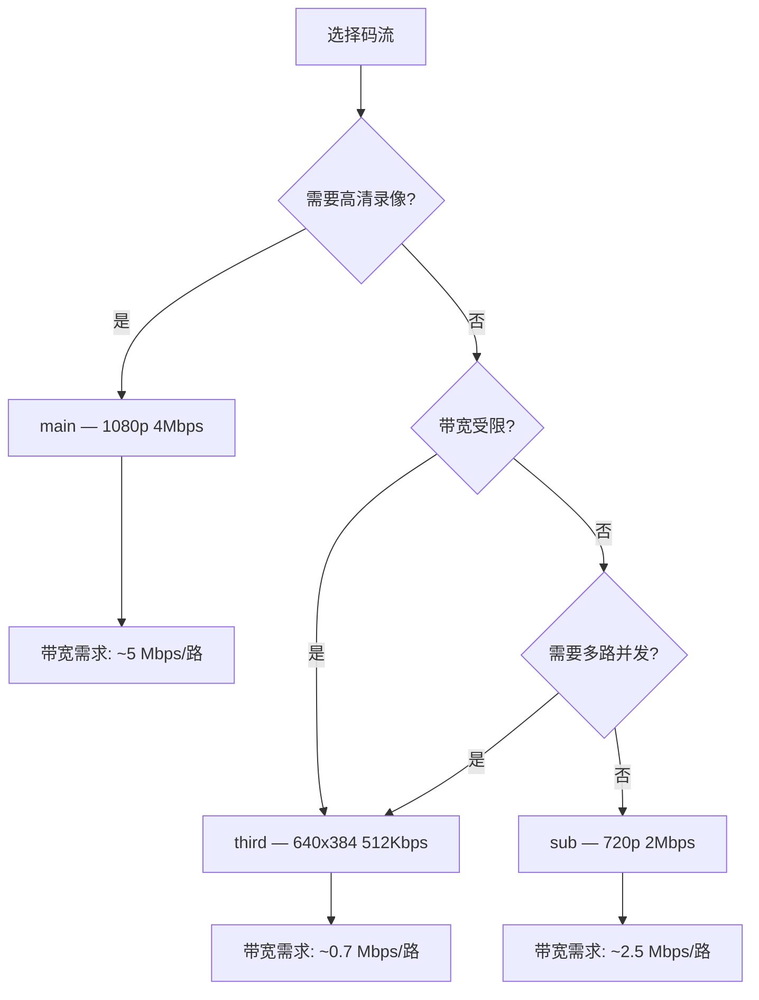

# Video Integration

NE503 通过 RTSP 协议输出 H.264 视频流，支持 TCP 交织传输，端到端延迟 < 100ms。本文面向需要将 NE503 视频流集成到自有系统的第三方开发者，提供从拉流录制、转码到 NVR/VMS 对接的完整方案。

## 1. 码流概览

### 1.1 三路码流参数

NE503 提供三路独立编码的 H.264 码流，参数如下：

| 参数 | 主码流 (main) | 子码流 (sub) | 三码流 (third) |
|------|-------------|-------------|---------------|
| 分辨率 | 1920x1080 | 1280x720 | 640x384 |
| 帧率 | 30 fps | 30 fps | 15 fps |
| 码率 | 4 Mbps | 2 Mbps | 512 Kbps |
| GOP | 30 (1s) | 60 (2s) | 30 (2s) |
| Profile | High 4.1 | High | Main |
| 编码 | H.264 | H.264 | H.264 |

> 以上为出厂默认参数，可通过 Platform API 的 `PUT /media/encoder` 端点运行时热更新码率、帧率、GOP，无需重启设备。

### 1.2 RTSP URL 格式

```
rtsp://<DEVICE_IP>:8554/{main,sub,third}
```

| 码流 | URL | 典型用途 |
|------|-----|---------|
| 主码流 | `rtsp://192.168.1.100:8554/main` | 高清录像、大屏显示 |
| 子码流 | `rtsp://192.168.1.100:8554/sub` | 多路预览、中等质量录制 |
| 三码流 | `rtsp://192.168.1.100:8554/third` | 移动端、AI 分析、低带宽场景 |

> NE503 强制使用 **RTSP over TCP**（RTP/AVP/TCP 交织传输），不支持 UDP 传输模式。所有拉流命令需指定 TCP 传输。

## 2. FFmpeg 集成

### 2.1 基本拉流验证

```bash
# 验证码流是否可用（播放 10 秒，不做实际输出）
ffmpeg -rtsp_transport tcp -i "rtsp://192.168.1.100:8554/main" \
  -t 10 -f null -
```

### 2.2 拉流录制

```bash
# 主码流直接录制（不转码，保持原始 H.264）
ffmpeg -rtsp_transport tcp -i "rtsp://192.168.1.100:8554/main" \
  -c copy -f mp4 recording_main.mp4

# 子码流录制为 MKV（支持断流续录，MKV 容器更容错）
ffmpeg -rtsp_transport tcp -i "rtsp://192.168.1.100:8554/sub" \
  -c copy -f matroska recording_sub.mkv
```

### 2.3 转码输出

```bash
# 转码为 720p H.264 用于 Web 分发
ffmpeg -rtsp_transport tcp -i "rtsp://192.168.1.100:8554/main" \
  -vf scale=1280:720 -c:v libx264 -preset fast -crf 23 \
  -f mp4 output_720p.mp4

# 转码为 H.265 节省存储空间
ffmpeg -rtsp_transport tcp -i "rtsp://192.168.1.100:8554/main" \
  -c:v libx265 -preset medium -crf 28 \
  -f mp4 output_h265.mp4
```

### 2.4 定时截帧

```bash
# 每 5 秒截取一帧，保存为 JPEG
ffmpeg -rtsp_transport tcp -i "rtsp://192.168.1.100:8554/sub" \
  -vf fps=1/5 -q:v 2 snapshot_%04d.jpg

# 单帧截图
ffmpeg -rtsp_transport tcp -i "rtsp://192.168.1.100:8554/main" \
  -frames:v 1 capture.jpg
```

### 2.5 多路同时拉取

```bash
# 同时拉取三路码流，分别保存
ffmpeg -rtsp_transport tcp -i "rtsp://192.168.1.100:8554/main" \
       -rtsp_transport tcp -i "rtsp://192.168.1.100:8554/sub" \
       -rtsp_transport tcp -i "rtsp://192.168.1.100:8554/third" \
  -map 0:v -c copy recording_main.mp4 \
  -map 1:v -c copy recording_sub.mp4 \
  -map 2:v -c copy recording_third.mp4
```

### 2.6 转 HLS 用于 Web 播放

```bash
# 将 RTSP 转为 HLS 分片，适合 Web 前端播放
ffmpeg -rtsp_transport tcp -i "rtsp://192.168.1.100:8554/sub" \
  -c:v libx264 -preset veryfast -tune zerolatency \
  -hls_time 2 -hls_list_size 3 -hls_flags delete_segments \
  -f hls stream.m3u8
```

## 3. GStreamer Pipeline

### 3.1 基本拉流管道

```bash
# 拉取主码流并显示
gst-launch-1.0 rtspsrc location=rtsp://192.168.1.100:8554/main \
  protocols=tcp latency=0 ! \
  rtph264depay ! h264parse ! avdec_h264 ! autovideosink

# 拉取子码流并保存为 MP4
gst-launch-1.0 rtspsrc location=rtsp://192.168.1.100:8554/sub \
  protocols=tcp latency=0 ! \
  rtph264depay ! h264parse ! mp4mux ! filesink location=output.mp4
```

### 3.2 硬件加速转码（x86 服务器）

在搭载 NVIDIA GPU 的服务器上，可利用 NVDEC 硬件解码：

```bash
# NVIDIA 硬件解码 + 转码输出
gst-launch-1.0 rtspsrc location=rtsp://192.168.1.100:8554/main \
  protocols=tcp latency=0 ! \
  rtph264depay ! nvh264dec ! \
  videoconvert ! x264enc tune=zerolatency ! \
  mp4mux ! filesink location=output_hw.mp4
```

> ARM 平台请使用对应的硬件解码插件（如 `v4l2h264dec`），具体取决于目标平台的多媒体框架。

### 3.3 取帧送 AI 推理

```python
import gi
gi.require_version('Gst', '1.0')
from gi.repository import Gst, GLib

Gst.init(None)

PIPELINE = (
    "rtspsrc location=rtsp://192.168.1.100:8554/third protocols=tcp latency=0 ! "
    "rtph264depay ! decodebin ! videoconvert ! video/x-raw,format=RGB ! "
    "appsink name=sink emit-signals=True max-buffers=2 drop=True"
)

def on_new_sample(sink):
    sample = sink.emit("pull-sample")
    buffer = sample.get_buffer()
    caps = sample.get_caps()
    w = caps.get_structure(0).get_int("width")[1]
    h = caps.get_structure(0).get_int("height")[1]
    success, info = buffer.map(Gst.MapFlags.READ)
    if success:
        import numpy as np
        frame = np.frombuffer(info.data, dtype=np.uint8).reshape(h, w, 3)
        # 在此处执行 AI 推理
        buffer.unmap(info)
    return Gst.FlowReturn.OK

pipeline = Gst.parse_launch(PIPELINE)
sink = pipeline.get_by_name("sink")
sink.connect("new-sample", on_new_sample)
pipeline.set_state(Gst.State.PLAYING)

loop = GLib.MainLoop()
try:
    loop.run()
except KeyboardInterrupt:
    pipeline.set_state(Gst.State.NULL)
```

## 4. VMS 集成

### 4.1 通用 NVR / ONVIF 接入

NE503 当前版本以 RTSP 对接为主，不提供 ONVIF 设备发现服务。通用 NVR 对接步骤：

1. 在 NVR 中选择"手动添加设备"或"自定义 RTSP"
2. 填写 RTSP 地址：`rtsp://<设备IP>:8554/main`
3. 传输协议选择 **TCP**
4. 按需选择码流：NVR 录像用 `main`，多画面预览用 `sub`

## 5. 多客户端并发与带宽规划

### 5.1 并发限制

NE503 RTSP 服务最多支持 **8 个并发客户端**（所有码流共享）。每路码流可独立被多个客户端同时拉取。

| 场景 | 建议码流 | 并发数 | 说明 |
|------|---------|--------|------|
| NVR 录像 + 实时预览 | main + sub | 2 | 录像用主码流，预览用子码流 |
| 多画面监控墙 | sub 或 third | 按画面数 | 4 画面以下用 sub，更多用 third |
| AI 分析 + 录像 | third + main | 2 | 分析用三码流节省带宽 |
| 移动端远程查看 | third | 1 | 低码率适合蜂窝网络 |

### 5.2 带宽估算

| 码流 | 码率 | 单路带宽 | 4 路同时拉取 |
|------|------|---------|------------|
| main | 4 Mbps | ~5 Mbps（含开销） | ~20 Mbps |
| sub | 2 Mbps | ~2.5 Mbps | ~10 Mbps |
| third | 512 Kbps | ~700 Kbps | ~2.8 Mbps |

> RTSP over TCP 交织传输的开销约 10-25%，实际带宽需求高于编码码率。

### 5.3 码流选择建议



## 6. 相关文档

- [快速入门](../../1-quick-start.md) — RTSP 码流验证与 VLC 播放
- [RESTful API](../../4-application-guide/2-3rd-party-integration/0-restful-api.md) — 媒体流 API 端点（码流启停、参数调整）
- [平台服务总览](../../3-software-guide/4-reference/0-platform-services.md) — Camera Daemon 等服务职责与源码指针
- [故障排查](../../3-software-guide/4-reference/1-troubleshooting.md) — RTSP 拉流常见问题与解决方案
