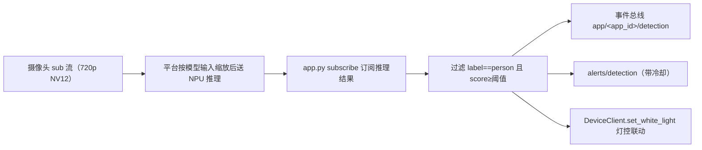

# Person Detection

本文以 `camthink-ai/neoruntime-apps` 中的 Person Detection 示例为例，端到端走通一个单模型边缘 AI 应用：从模型与视频流发现、`app.yaml` 权限声明开始，构建镜像、部署到设备，并通过日志和事件总线验证检测确实在运行，还会联动设备补光灯。

> **验证记录**：本文的运行结果来自 NE503 测试设备 `192.168.93.50`，最近一次验证为 2026 年 8 月（固件与验证背景见[停车场管理](./0-parking-lot.md)的记录）。实测：应用启动后持续收到 `sub` 流推理结果，画面有人时 `Detected 1 person(s)` 持续刷新、`avg_persons≈1.0`，`app/person-detection/detection` 事件经 `aipc-cli event subscribe` 实收（含 bbox/confidence），内存占用约 33 MB。灯控联动依赖硬件补光灯，本次测试设备未接，未做端到端验证。

## 1. 目标

完成本文后，你可以：

- 在设备上查到真实的模型 ID 与视频流名，并填对 `app.py` 与 `app.yaml`；
- 用仓库统一脚本构建 arm64 镜像并打包部署；
- 通过 `app/person-detection/detection` 与 `alerts/detection` 主题接收检测事件；
- 用日志、统计行和事件订阅确认推理链路在真实运行，而不是只确认容器已经启动。

本文是一个可复现的项目实录，不是 SDK 的通用接口参考。各客户端的完整 API、`app.yaml` 全部字段和认证格式，见 [SDK 参考](../3-reference/1-sdk-reference.md)。

:::tip 跳过构建，直接体验
不想自己 build 镜像？下载预编译包 [person-detection.tar](https://resources.camthink.ai/wiki/img/neoeyes-ne503-series/application-guide/app-development/person-detection/person-detection.tar)，解压即得 `app.yaml` 与 `image.tar`，按 §5 部署到设备即可。
:::

## 2. 模型与数据链路

### 2.1 应用使用的模型

应用只用一个出厂预置模型，无需自行注册：

| 模型 | 来源 | 用途 |
|:--|:--|:--|
| `hailo_yolov8n_384_640` | 出厂自带（`/data/aipc/models/`） | YOLOv8n，COCO 80 类，取 `person` 类检测结果 |

模型 ID 必须先在设备上查实（§2.3），不同固件版本名字可能不同。

### 2.2 从视频到事件



关键差异：**推理必须用 `sub` 流**。`sub` 发布原始 NV12 帧，`main` 是 4K H264 编码流、只用于 RTSP 拉流观看——`subscribe(stream="main")` 会永久挂住、无报错、无超时。

| 流 | 分辨率 | 帧格式 | 推理 |
|:--|:-------|:-------|:-----|
| `sub` | 720p | 原始 NV12 | ✅ 可用于推理 |
| `main` | 4K | 编码 H264 | ❌ 只用于 RTSP 拉流 |

:::note 分辨率尽量匹配模型输入
模型输入分辨率应与所订阅流的分辨率尽量一致；不一致时平台仍会预处理 resize，但会增加开销，比例悬殊时可能影响精度。可在 Web 控制台调整 `sub` 流分辨率贴近模型输入（如 640×384）。
:::

### 2.3 查询设备上的真实值

`app.py` 里 `subscribe(model=...)` 的模型名、`app.yaml` 里 `permissions.video` 的流名，**必须使用设备上的真实值**，填错会直接报 `StatusCode.NOT_FOUND`。

**查模型**（设备模型文件在 `/data/aipc/models/`，首次使用前先扫描并加载到 NPU）：

```bash
TOKEN="Bearer <token>"   # 用默认凭据 admin/password 调 /api/login 获取

# 1. 扫描模型目录，把 .hef 注册到平台
curl -k -X POST https://<设备IP>/api/v1/ai/models/scan -H "Authorization: $TOKEN"

# 2. 加载指定模型到 NPU（推理前必须加载）
curl -k -X POST https://<设备IP>/api/v1/ai/models/hailo_yolov8n_384_640/load -H "Authorization: $TOKEN"

# 3. 列出当前可用模型，确认 model_id
curl -k https://<设备IP>/api/v1/ai/models -H "Authorization: $TOKEN"
```

**查流**（curl 无专门接口，用 SDK 最直接）：

```python
from hailo_ipc_sdk import FdMediaClient as MediaClient
print(MediaClient().list_streams())   # → ['main', 'sub']
```

最终填写位置：

| 文件 | 字段 | 值 |
|:-----|:-----|:---|
| `app.py` | `subscribe(stream=...)` | `sub` |
| `app.yaml` | `permissions.video` | `[sub.raw]` |
| `app.py` | `subscribe(model=...)` | §2.3 查到的 `model_id`（如 `hailo_yolov8n_384_640`） |
| `app.yaml` | `permissions.inference.models` | 同上的 `model_id` |

## 3. 配置文件

:::info 前置：获取示例项目
本教程基于 **neoruntime-apps** 仓库里的完整示例项目。先把它和 SDK 仓库 clone 到同一父目录（构建脚本默认从旁边的 `neoruntime-sdks` 取 SDK），再进入应用目录：

```bash
git clone https://github.com/camthink-ai/neoruntime-sdks.git
git clone https://github.com/camthink-ai/neoruntime-apps.git
cd neoruntime-apps/examples/person-detection
```

该目录已包含本教程所需的全部文件：`app.py`（应用主逻辑）、`app.yaml`（应用清单）、`Dockerfile`、`requirements.txt`（旧版 `build.sh` 面向旧单仓布局，忽略即可）。构建统一使用仓库根目录的 `scripts/build_app.sh`（见 §5.1）。
:::

### 3.1 应用清单 app.yaml

应用必须在 `app.yaml` 声明所需权限，平台据此做容器隔离与沙箱。Person Detection 声明：视频流 `sub.raw`、模型 `hailo_yolov8n_384_640`、事件发布/订阅主题、设备灯控。

```yaml
# AIPC Platform Application Manifest
apiVersion: v1
kind: Application

metadata:
  id: person-detection
  name: Person Detection
  version: 1.0.0
  description: Real-time person detection with AI inference and event publishing
  author: AIPC Team

spec:
  image: aipc/person-detection:1.0.0

  resources:
    cpu: "50%"
    memory: "256Mi"

  permissions:
    video:
      - sub.raw                       # 发布原始 NV12 帧的流（main 只发 H264，无法订阅推理）
    inference:
      models:
        - hailo_yolov8n_384_640        # 须匹配设备已加载模型
      max_qps: 30
      max_concurrent: 2
      allow_register_model: false
    events:
      publish:
        - app/person-detection/*
        - alerts/detection
      subscribe:
        - system/*
        - model/*/detections
    device:
      light: true                     # 补光灯联动
      ir_cut: true
    network:
      mode: isolated                  # 容器网络隔离（无外网）

  # 环境变量：app.py 通过 os.environ 读取
  env:
    - name: DETECTION_THRESHOLD
      value: "0.3"                    # person 置信度门槛，低于此分数的目标被忽略
    - name: ALERT_COOLDOWN_SECONDS
      value: "5"                      # alerts/detection 事件的最小间隔（秒）
    - name: LOG_LEVEL
      value: "INFO"                   # 日志级别：DEBUG / INFO / WARNING / ERROR

  volumes:
    - host: /data/aipc/data/person-detection
      container: /app/data
      readonly: false
    - host: /data/aipc/logs/person-detection
      container: /app/logs
      readonly: false

  autostart: false
  restart_policy: on-failure
  restart_max_retries: 3

  healthcheck:
    enabled: true
    interval: 30s
    timeout: 5s
    retries: 3
```

> 声明式权限模型意味着：**应用在沙箱里只能访问这里列出的资源**。任何未声明的流、模型、事件主题或设备控制，调用时都会被平台拒绝。完整字段见 [应用参考](../3-reference/0-app-reference.md)。

### 3.2 运行参数

| 环境变量 | 默认值 | 影响 |
|:--|:--|:--|
| `DETECTION_THRESHOLD` | 0.2（`app.py`）/ 0.3（清单注入） | person 置信度门槛；调低检出更多但误报增多，调高反之 |
| `ALERT_COOLDOWN_SECONDS` | 5 | `alerts/detection` 的最小间隔；调小事件更密，云端消费侧要做幂等 |
| `LOG_LEVEL` | INFO | 排障时可改 DEBUG 看灯控失败等细节 |

## 4. 核心代码

### 4.1 应用主逻辑 app.py

应用做五件事：初始化 SDK 客户端 → 订阅 `sub` 流推理结果 → 按 `DETECTION_THRESHOLD` 过滤 person → 向事件总线发布结构化检测结果 → 检测到人时联动补光灯；并监听 SIGTERM 优雅退出。完整源码即仓库 `examples/person-detection/app.py`，关键片段：

```python
#!/usr/bin/env python3
"""Person Detection Application for AIPC Platform"""
import os, sys, time, signal, logging
from datetime import datetime
from typing import Optional

from hailo_ipc_sdk import (
    InferenceClient, EventClient, DeviceClient,
    FdMediaClient as MediaClient, Config, InferenceResult,
)

class PersonDetectionApp:
    def __init__(self):
        self.running = True
        self.app_id = Config.get_app_id()
        self.detection_threshold = float(os.environ.get('DETECTION_THRESHOLD', '0.2'))
        self.alert_cooldown = int(os.environ.get('ALERT_COOLDOWN_SECONDS', '5'))
        self.last_alert_time = 0
        # ... 状态统计（frame_count / total_detections / person_count_history）
        signal.signal(signal.SIGINT, self._signal_handler)
        signal.signal(signal.SIGTERM, self._signal_handler)

    def initialize(self) -> bool:
        self.inference = InferenceClient()
        models = self.inference.list_models()
        if not any(m.model_id == "hailo_yolov8n_384_640" for m in models):
            logger.warning("Required model 'hailo_yolov8n_384_640' NOT found")
        self.events = EventClient()
        # DeviceClient / MediaClient 失败不阻断启动（灯控与流发现为可选能力）
        ...

    def run(self):
        if not self.initialize():
            self._cleanup(); return 1
        for frame_seq, result in self.inference.subscribe(
            stream="sub",                    # 必须 sub，main 会永久挂住
            model="hailo_yolov8n_384_640",
            fps=10,
        ):
            if not self.running:
                break
            self._process_frame(frame_seq, result)
        self._cleanup(); return 0

    def _process_frame(self, frame_seq: int, result: InferenceResult):
        persons = [
            obj for obj in result.objects
            if obj.label == "person" and obj.score >= self.detection_threshold
        ]
        self._publish_detection_event(frame_seq, result, persons)
        if persons and self.device:
            self._trigger_light()          # device.set_white_light(50)

    def _publish_detection_event(self, frame_seq, result, persons):
        self.events.publish(f"app/{self.app_id}/detection", {
            "app_id": self.app_id, "frame_sequence": frame_seq,
            "person_count": len(persons),
            "objects": [{
                "label": obj.label, "confidence": round(obj.score, 3),
                "bbox": {"x": round(obj.bbox.x, 3), "y": round(obj.bbox.y, 3),
                          "width": round(obj.bbox.width, 3), "height": round(obj.bbox.height, 3)},
            } for obj in persons],
        })
        # alerts/detection 在冷却窗口内只发一次
        ...
```

关键逻辑对照（调整模型/流/阈值时的定位点）：

| 模块 | 位置 | 说明 |
|:---|:---|:---|
| 配置读取 | `__init__` | `DETECTION_THRESHOLD`、`ALERT_COOLDOWN_SECONDS` 从环境变量读；实际值由 `app.yaml` 的 `env` 注入 |
| 模型/流发现 | `initialize` | `list_models()` / `list_streams()` 打印设备真实值并校验 |
| 订阅推理 | `run` | `subscribe(stream="sub", fps=10)`——**stream 必须是 sub** |
| 检测过滤 | `_process_frame` | 只保留 `label == "person"` 且 `score >= threshold` |
| 事件发布 | `_publish_detection_event` | 每帧发 `app/<app_id>/detection`；`alerts/detection` 冷却窗口内只发一次 |
| 灯控联动 | `_trigger_light` | 检测到人时 `set_white_light(50)`（50% 亮度） |
| 优雅退出 | `_signal_handler` / `_cleanup` | SIGTERM 置 `running=False`，跳出循环后关闭全部客户端 |

### 4.2 构建文件 Dockerfile

基于 `python:3.11-slim-bookworm`，装系统依赖、把 SDK 本地装进镜像、再装应用依赖，并以非 root 用户运行：

```dockerfile
FROM python:3.11-slim-bookworm

RUN apt-get update && apt-get install -y --no-install-recommends \
    bash curl procps libglib2.0-0 libsm6 libxext6 libxrender-dev \
    && rm -rf /var/lib/apt/lists/*

WORKDIR /app

# SDK 本地安装（由构建脚本在构建前复制进来）
COPY hailo_ipc_sdk/ /app/hailo_ipc_sdk/
COPY setup.py README.md /app/
RUN pip install --no-cache-dir -e .

COPY app.py /app/app.py
COPY requirements.txt /app/requirements.txt
RUN pip install --no-cache-dir -r requirements.txt

RUN useradd -m -u 1000 appuser && chown -R appuser:appuser /app
RUN mkdir -p /app/data /app/logs && chown -R appuser:appuser /app/data /app/logs

ENV APP_ID=person-detection
ENV PYTHONUNBUFFERED=1
ENV LOG_LEVEL=INFO

HEALTHCHECK --interval=30s --timeout=5s --start-period=10s --retries=3 \
    CMD python3 -c "from hailo_ipc_sdk import InferenceClient; c = InferenceClient(); c.close()" || exit 1

USER appuser
CMD ["python3", "/app/app.py"]
```

`requirements.txt` 仅 `numpy>=1.21.0`（SDK 已自带 protobuf/grpc）。

:::note Dockerfile 为何本地安装 SDK？
设备容器运行时无外网，SDK 必须随镜像带入。构建脚本会在构建前把 `neoruntime-sdks/python/hailo_ipc_sdk/` 复制进应用目录，Dockerfile 的 `COPY hailo_ipc_sdk/` 将其打进镜像，再 `pip install -e .` 本地安装。
:::

## 5. 部署步骤

### 5.1 构建与打包

仓库统一构建脚本 `scripts/build_app.sh` 一键完成"构建镜像 → 导出 → 打包"：

```bash
cd neoruntime-apps
# 必须用 arm64：设备为 aarch64，构建 x86_64 镜像将无法导入设备
./scripts/build_app.sh examples/person-detection --arch arm64
```

| 步骤 | 动作 | 说明 |
|:-----|:-----|:-----|
| 1 | 复制 SDK | 把同级 `neoruntime-sdks/python/` 下的 `hailo_ipc_sdk/`、`setup.py`、`README.md` 复制进应用目录 |
| 2 | 构建镜像 | `docker buildx build --platform linux/arm64` 生成 `aipc/person-detection:1.0.0` |
| 3 | 导出镜像 | `docker save` 导出为 `image.tar` |
| 4 | 打包 | `zip` 把 `app.yaml` + `image.tar` 打成 `person-detection.aipc` |
| 5 | 清理 | 删除步骤 1 复制的 SDK 文件和中间 `image.tar`，只保留 `person-detection.aipc`（~97 MB） |

:::warning 部署前需解压
构建脚本步骤 5 会删掉 `image.tar`，而部署需要 `app.yaml` 和 `image.tar` 两个独立文件。部署前先 `unzip -o person-detection.aipc` 解压。
:::

### 5.2 安装

```bash
cd neoruntime-apps/examples/person-detection
unzip -o person-detection.aipc      # 解压出 app.yaml + image.tar
```

三种部署方式任选其一：

- **Web 控制台上传（推荐）**：浏览器打开 Web 控制台 → **App Management** → **Import** → 选择 **Upload Package** → 分别上传 `app.yaml` 和 `image.tar` → 点击 **Install**。全程图形界面，无需 SSH。
- **aipc-cli（备选）**：已 SSH 登录设备时，把两个文件拷到设备后执行 `aipc-cli app install app.yaml image.tar`。
- **HTTP 两步上传（备选）**：登录取 token → `upload-image`（`image.tar`）→ `upload-manifest`（`app.yaml`）→ `install-package` → 轮询 `install-progress/<task_id>` 到 `phase=complete`。

### 5.3 启动

部署完成后应用处于 Stopped 状态，需手动启动。Web 控制台进入 **App Management**，点击 Person Detection 卡片上的 **Start**（或 `POST /api/v1/apps/person-detection/start`）。正常几秒内状态徽章由 Stopped 切换为 Running。

:::tip 首次启动超时？
新部署应用首次启动时平台需载入镜像，可能超过 10 秒 API 超时返回 `code:6002 DeadlineExceeded`。这不是错误——再调一次 start 即可成功。
:::

## 6. 验证方法

### 6.1 验证应用状态与权限

打开 Web 控制台 → **Applications**，Person Detection 处于 **Running** 状态，占用约 33 MB 内存：


点击 **Person Detection** 打开详情。**Permissions & Resources** 区域能看到平台已按 `app.yaml` 注入的权限——视频流 sub.raw、模型 hailo_yolov8n_384_640（QPS 30）、事件发布/订阅主题、设备灯控。这证明应用在沙箱里**只拥有它声明的权限**：


### 6.2 验证推理链路（日志）

**方式一：Web Logs 实时流**——在 **Applications** 列表点击该应用的 **Logs**，打开 **Live Stream** 面板，实时滚动显示容器 stdout/stderr：


**方式二：HTTP API 拉取最近日志**：

```bash
curl -k "https://<设备IP>/api/v1/apps/person-detection/logs?max_lines=15" -H "Authorization: Bearer <token>"
```

```
[INFO] Available models: ['hailo_yolov8n_384_640']
[INFO] Available video streams: ['main', 'sub']
[INFO] Subscribing to stream 'sub' with model 'hailo_yolov8n_384_640'
[INFO] Received first inference result - frame 1
[INFO] [Frame 142] Detected 1 person(s)
[INFO] Statistics: frames=200, detections=198, avg_persons=1.00
```

`detections` 随帧增长、`avg_persons` 接近画面实际人数，即说明推理链路在真实运行。

### 6.3 验证事件输出

应用把每次检测的置信度、bbox、人数打包成结构化 JSON 发布到事件总线。在设备上订阅：

```bash
aipc-cli event subscribe 'app/person-detection/*'
```

```json
{"app_id":"person-detection","frame_sequence":142,"person_count":1,
 "timestamp_ns":1755417536000000000,"timestamp_iso":"2026-08-17T14:38:56.000123",
 "total_frames_processed":142,"total_detections":118,
 "objects":[{"label":"person","confidence":0.879,
   "bbox":{"x":0.31,"y":0.22,"width":0.27,"height":0.61}}]}
```

事件持续到达且 `person_count` 与画面一致，即完成端到端验证。对接 WebSocket/MQTT 等外部消费方式见[事件集成](../3-reference/5-event-integration.md)。

## 7. 常见错误

| 现象 | 优先检查 | 修复方式 |
|:---|:---|:---|
| 应用一直卡在等待推理结果、无报错 | `subscribe(stream=...)` 是否误用 `main` | 改为 `sub`；main 是 H264 编码流，订阅会永久挂住 |
| 启动或推理报 `StatusCode.NOT_FOUND` | 模型 ID / 流名是否与设备真实值一致 | 用 §2.3 的方法查 `list_models()` / `list_streams()`，把真实值同时填进 `app.py` 和 `app.yaml` |
| 模型未加载导致无推理结果 | 模型是否已 load 到 NPU | `POST /api/v1/ai/models/<model_id>/load` 后重启应用 |
| Web Logs 报 `no log file found for container ...` | 设备 root 分区是否已满 | `df -h /` 确认；`truncate -s 0 /data/aipc/logs/*.log` 清理后重装应用 |
| 首次 start 返回 `code:6002` 超时 | 是否为部署后第一次启动 | 平台载入镜像的正常超时，再调一次 start 即可 |
| 日志正常但收不到事件 | 订阅的 topic 是否在 `permissions.events.publish` 内 | `app/person-detection/*` 通配符订阅；跨沙箱消费走[事件集成](../3-reference/5-event-integration.md)的 WebSocket/MQTT 通道 |
| 导入镜像失败 | 构建时 `--arch` 是否为 arm64 | 设备为 aarch64，重新以 `--arch arm64` 构建 |

## 8. 相关文档

- [应用开发工作流](../1-app-development/0-sdk-workflow.md) — 了解 SDK 调用范式与权限模型
- [应用参考](../3-reference/0-app-reference.md) — `app.yaml` 权限、生命周期和容器约束的完整字段
- [SDK 参考](../3-reference/1-sdk-reference.md) — 各客户端 API 逐条说明
- [停车场管理](./0-parking-lot.md) — 多模型 + Web UI 的进阶 Cookbook 项目
- [故障排查 FAQ](../../5-troubleshooting.md) — 应用与容器问题排查

---

**文档版本**：v1.1 · **最后更新**：2026-08-19
