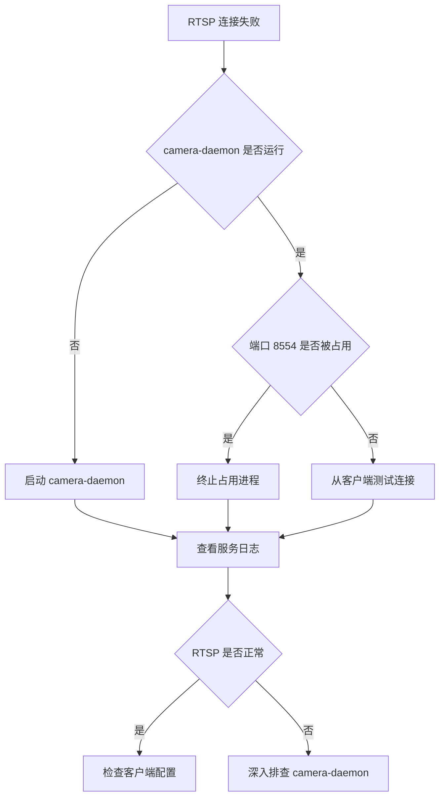
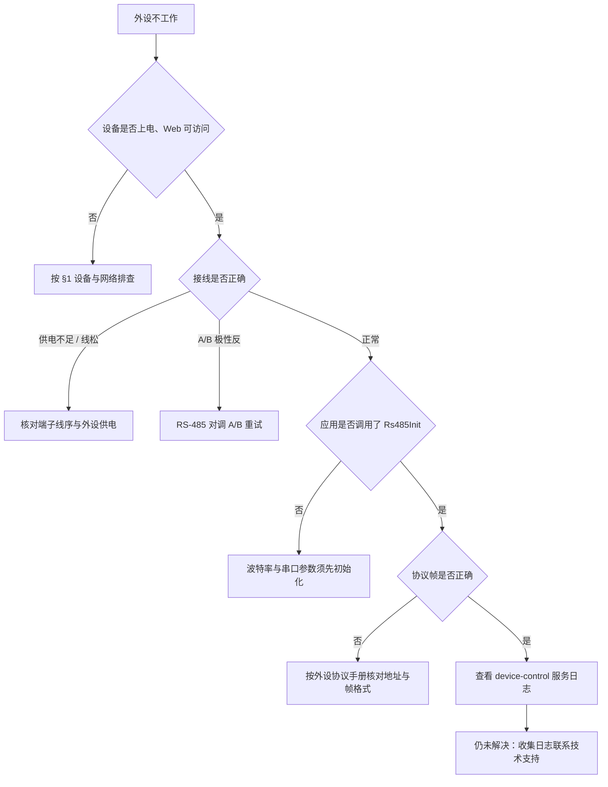
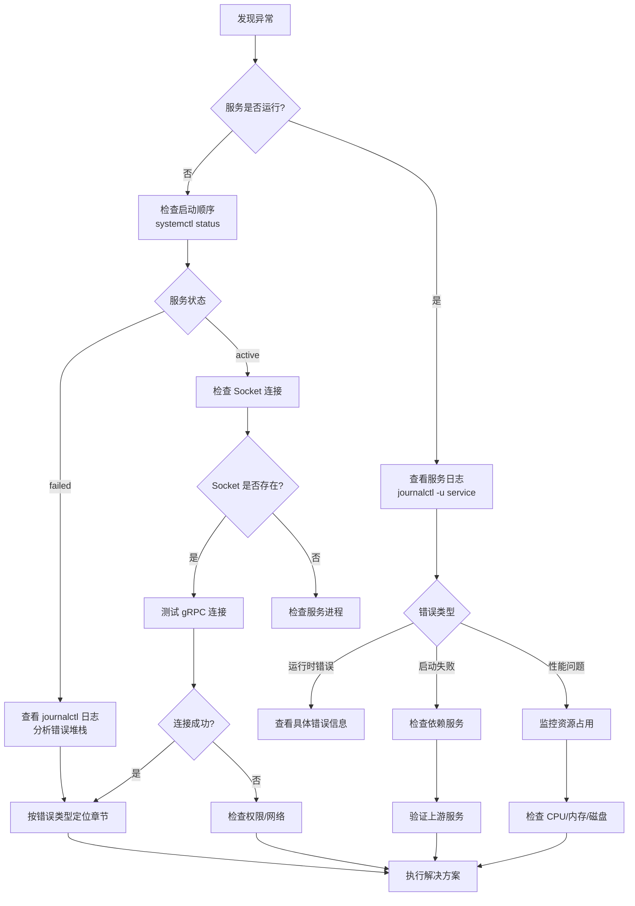
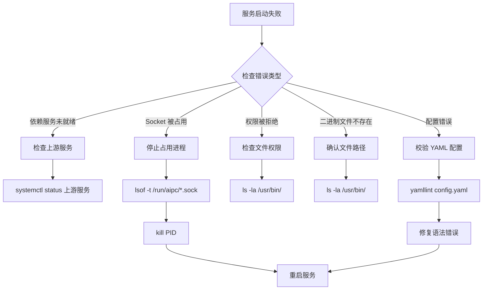

# Troubleshooting

本页按**症状**组织常见问题，对号入座找到排查路径。每条都从最直接的「现象 → 原因 → 快速修复」起步；需要深挖时再看条目下方的诊断命令与详解。

- 现场运维、管理员：从 §1–§7 按现象找，多数到「快速修复」即可解决。
- 应用开发者：重点看 §2–§5（视频流、AI 模型、应用容器、事件集成）。
- 平台运维、开发者：§8 是系统服务层深水区（systemd、Socket、journalctl、性能监控）。
- 错误码与命令速查：见文末附录 A / B。

## 1. 设备与网络

### 1.1 无法访问 Web 控制台

**现象**：浏览器打不开设备 Web 页面。

**快速排查**：

1. 确认电脑 IP 与设备同网段（默认 `10.0.0.x`）。
2. `ping <设备IP>` 确认网络连通。
3. 若设备是 DHCP，去路由器查它分到的 IP。
4. 浏览器确认用的是 `https://`（不是 `http://`），并放行自签证书警告。
5. 仍不行：SSH 登录后 `aipc-cli system health` 看服务状态。

**诊断命令**：

```bash
# SSH 登录（测试设备默认 root/root）
ssh root@<设备IP>
aipc-cli system health

# 确认 platform-api 是否在监听
systemctl status platform-api
```

### 1.2 忘记 Web 密码

**现象**：Web 控制台登录密码遗忘。

**修复**：

- 若仍能登录：Device Info → **Change Password** 修改，或调用 `POST /api/v1/system/password`。
- 默认凭据（`admin` / `password`）未改时，先按默认登录并立即改密。
- 密码已修改且遗忘时：`aipc-cli` **没有**密码重置命令（核实过全部 16 个命令模块），联系技术支持或重刷固件恢复出厂。

> 设备当前无「恢复出厂」功能（swagger 无端点），重刷固件即等价于恢复出厂。

### 1.3 镜头控制异常

**现象**：对焦、变焦、光圈控制无响应或行为异常。

**原因**：镜头电机故障或 HAL 控制链路异常。

**诊断命令**：

```bash
# 查镜头状态
grpcurl -plaintext -d '{}' unix:///run/aipc/device-control.sock aipc.device.DeviceControl/GetLensStatus

# 复位镜头零点
grpcurl -plaintext -d '{}' unix:///run/aipc/device-control.sock aipc.device.DeviceControl/LensResetZero
```

gRPC 接口完整定义见源码 `platform/device-control/proto/device.proto`。

### 1.4 串口与 RS-485 通信失败

**现象**：外部 RS-485 设备（云台、传感器）无响应。

**先分清对象**：外部 RS-485 的波特率由应用通过 `Rs485Init` 设定，与内部 MCU host-link 无关。`/dev/ttyS0 @ 921600` 是核心板与接口板 MCU 的**内部通信串口**，不是外设接口。

**排查**：见 [§7.4 报警输入 / Wiegand / RS-485](#74-报警输入--wiegand--rs-485-运行时问题)。

### 1.5 浏览器兼容性与降级

| 浏览器 | 最低版本 | 支持程度 | 已知问题 | 解决方案 |
|--------|---------|----------|---------|---------|
| Chrome | 88+ | 完全支持 | -- | -- |
| Firefox | 78+ | 基本支持 | 不支持 WebCodecs | 使用 MSE 播放 |
| Safari | 14+ | 部分支持 | 不支持 WebCodecs | 降级为 MSE |
| Edge | 88+ | 完全支持 | -- | -- |
| 移动端浏览器 | -- | 有限支持 | 性能问题 | 使用桌面端 |

推荐使用 Chrome 88+ 或 Edge 88+ 以获得最佳体验。Safari 自动降级为 MSE 方案，性能略低。

### 1.6 WebSocket 访问层失败

Web 预览与 API 依赖 WebSocket 传输 H.264 帧。

| 现象 | 可能原因 | 解决方案 |
|------|---------|---------|
| WebSocket 1006 | 连接异常关闭 | 检查 platform-api 是否运行、防火墙是否放行 443 端口 |
| WebSocket 401/403 | Token 无效或过期 | 重新登录获取新 Token |
| 黑屏 | WebSocket 未建立 / SPS-PPS 未接收 | 刷新页面，检查 WebSocket 连接状态 |
| 花屏/马赛克 | 网络丢包 / 解码器不兼容 | 切换浏览器或检查网络质量 |
| 高延迟 | 网络延迟 / 缓冲区过大 | 确保局域网带宽充足，减小编码 GOP |

> Web 预览默认走 MJPEG；HD 预览黑屏的根因是 platform-api 出厂仅绑 `127.0.0.1:8080`，HD 预览把浏览器指向 `ws://<IP>:8080/...` 外部不可达，且 H.264 失败时无 MJPEG 回退。已验证修复：应用环境变量 `HD_PREVIEW_ENABLED=0`（改走 MJPEG 预览）；待平台侧把 H.264 流经 nginx `wss://` 暴露后可恢复 HD 默认。详见各应用文档的预览配置。

## 2. 视频与流

### 2.1 RTSP 拉流失败

**现象**：外部播放器或拉流程序连不上 RTSP，或连上无画面。

**快速排查**：

1. 确认拉流端与设备同网段。
2. 确认设备 IP 未变更（DHCP 可能换 IP）。
3. `aipc-cli stream list` 确认码流启用、RTSP 已开。
4. 核对地址：`rtsp://<设备IP>:8554/main`，默认端口 8554。
5. 防火墙是否放行 8554。

**诊断流程**：



**诊断命令**：

```bash
# 检查 RTSP 服务状态
systemctl status camera-daemon

# 查看 RTSP 日志
journalctl -u camera-daemon -f

# 测试 RTSP 连接（将 <device-ip> 换成设备实际 IP）
ffmpeg -rtsp_transport tcp -i rtsp://<device-ip>:8554/main -t 10 -f null -
```

> RTSP `:8554` 当前**无认证**，任何能连到设备的客户端均可拉流。生产环境须在网络层隔离。

### 2.2 WebSocket 集成层断连

**现象**：第三方系统通过 WebSocket 接入视频流时频繁断连。

**原因**：客户端超时、服务端报错或网络波动。

**诊断命令**：

```bash
# 查看 WebSocket 连接日志
journalctl -u platform-api | grep -i "websocket\|h264"

# 测试 WebSocket 连接（自签证书加 --no-check）
wscat --no-check -c wss://<设备IP>/api/v1/h264/main
```

接入侧重连策略见[视频集成](./4-application-guide/3-reference/4-video-integration.md)。

### 2.3 一直处于仿真模式（SIMULATION）无检测

**现象**：应用日志出现 `Running in SIMULATION mode - no actual inference`，检测结果始终为 0。

**原因**：这是 SDK 在拿不到真实视频流时的优雅降级，**不是应用 Bug**。根因通常是 camera-daemon 未运行。

**诊断命令**：

```bash
ssh root@<设备IP> "systemctl status camera-daemon"
# 若 activating(auto-restart)：看崩溃原因
ssh root@<设备IP> "journalctl -u camera-daemon -n 20 --no-pager"
# 典型根因：dlopen(/data/aipc/lib/hal/hal-hailo15.so) 失败 = 固件缺 HAL 库，需重刷含 HAL 的镜像
```

在摄像头正常的设备上，同一应用会输出真实检测框。

## 3. AI 与模型

### 3.1 模型导入成功但无检测结果

**现象**：模型已导入，应用启动正常，但始终没有检测/推理结果输出。

**五步排查**（按顺序逐项确认）：

1. **模型是否 Loaded**——Models 页或 `aipc-cli model list` 查看状态。未加载则不会推理，需 `POST /api/v1/ai/models/<id>/load` 加载到 NPU。
2. **应用 Permissions 是否勾选了该模型**——`app.yaml` 的 `permissions.models` 须声明模型 id。
3. **阈值是否过高**——Detail 弹窗调低 threshold 重试。
4. **输入尺寸是否匹配**——平台前处理固定输出 384×640 NV12，模型须匹配该尺寸（见 §3.4）。
5. **码流是否启用且应用已授权对应码流**——`permissions.streams` 须含发布原始帧的流：`third`（默认推理流）或 `sub`；`main` 只发编码 H.264，订阅它等不到结果。

> 模型加载有显式 REST 端点：`POST /ai/models/{id}/load`（加载到 NPU）、`POST /ai/models/scan`（扫描模型库进 DB）。部署 HEF 的正路是「放 `/data/aipc/models/<category>/` → scan → load」。

### 3.2 推理报 Model not found

**现象**：推理订阅报 `StatusCode.NOT_FOUND: Model not found`，或 app-manager 日志 `requires model X, but not found`。

**原因**：`app.py` / `app.yaml` 里的模型名、流名写死，与设备实际不符。

**修复**：先查真实名字，再填回配置。

```python
from hailo_ipc_sdk import InferenceClient, FdMediaClient
print(InferenceClient().list_models())   # 如 ['hailo_yolov8n_384_640']
print(FdMediaClient().list_streams())    # 如 ['main', 'sub']
```

也可通过 API 确认模型：

```bash
curl -k https://<设备IP>/api/v1/ai/models -H "Authorization: Bearer <token>"
```

### 3.3 阈值过高导致零检出

**现象**：模型加载正常、码流正常，但检出数为 0。

**原因**：`app.yaml` 或应用代码里的 confidence threshold 设得高于模型实际输出分布。

**修复**：在 Models Detail 弹窗或应用配置里调低阈值重试。先用一个低阈值（如 0.1）确认能否检出，再逐步上调到业务可用水平。

### 3.4 输入尺寸不匹配

**现象**：推理报 `byte_size mismatch` 或结果错乱。

**原因**：平台前处理固定输出 **384×640 NV12**，喂给模型的输入必须匹配该尺寸。不匹配的模型（如部分 CLIP/OCR 模型）无法端到端跑通，属平台限制而非应用 Bug。

**修复**：使用与 384×640 匹配的 HEF（如 `hailo_yolov8n_384_640.hef`）。

### 3.5 推理持续但零帧零事件（日志无错）

**现象**：模型 Loaded、应用 Running、ai-runtime 的 NPU Worker 显示活跃，但应用侧零帧零事件，日志里没有任何错误。

**原因**：模型注册挂在了已死容器 session 上——ai-runtime 持续推理但结果不回推；应用侧 SDK 收到失败响应时**静默吞错**（不打日志），所以两边都看不到异常。

**诊断**（两步定位）：

1. 看应用 status 心跳日志——正常每 50 帧一条；完全没有就说明结果没回来（不能只看 ai-runtime Worker 活跃，那不等于结果回推成功）。
2. strace 是唯一暴露推理失败的窗口：

```bash
strace -f -p $(pidof ai-runtime) -e trace=sendmsg -s 200 2>&1 | grep "Inference failed"
```

持续刷 `Inference failed: -2814` 之类输出即推理服务本身失败（配合停服后 `hailortcli run -t 5 <hef>` 直跑可二分「NPU 固件层 vs ai-runtime 软件栈」——直跑正常则是 ai-runtime 问题）。

**修复**：重启 ai-runtime，然后重新注册/加载模型（`POST /ai/models/scan` → `POST /ai/models/{id}/load`），再启动应用。

## 4. 应用与容器

### 4.1 应用安装失败

**现象**：`aipc-cli app install` 或上传安装包失败。

**三类根因**：

- **镜像拉取**：网络不通或镜像源不可达。
- **清单解析**：`app.yaml` 语法错误。
- **权限**：运行用户须属于 `aipc` 组。

**诊断命令**：

```bash
# 查看安装日志（清单字段错误、镜像导入失败均会在此报具体原因）
journalctl -u app-manager -f

# 本地预检 app.yaml 语法
yamllint app.yaml
```

> 旧的单文件上传 API（`curl -F app=@.aipc`）已失效，改两步上传：upload-image + upload-manifest + install-package。

### 4.2 容器启动失败

**现象**：应用已安装但 `start` 后立即退出或反复重启。

**快速排查**：

1. `aipc-cli app logs <id>` 看错误日志。
2. 检查资源（Dashboard 内存 / 存储）是否不足。
3. 若拉取镜像失败，检查外网连通。
4. Permissions 配置不当（如应用要码流但未授权）也会启动失败。

**诊断命令**：

```bash
journalctl -u app-manager | grep -i "container"
free -h
df -h
systemd-cgtop
systemctl status containerd
```

容器沙箱有安全限制（drop capabilities、seccomp、只读 rootfs 等），部分宿主操作会被拒绝。

### 4.3 健康检查失败

**现象**：应用启动后健康探针失败，被 app-manager 标记为不健康。

**原因**：`app.yaml` 支持 HTTP / 执行命令 / TCP 三种健康探针，探针目标不可达或返回非预期。

**诊断命令**：

```bash
# 查看健康检查日志
journalctl -u app-manager | grep -i "healthcheck"

# 手动在应用容器内执行健康检查命令
aipc-cli app exec <app-id> -- /path/to/healthcheck.sh

# 查看应用状态
aipc-cli app info <app-id>
```

按探针类型手动复现：HTTP 用 `curl`、执行型用 `aipc-cli app exec`、TCP 用 `netstat`。

### 4.4 实战速查表

真实部署 NE503 容器应用时验证过的常见问题：

| # | 现象 | 根因 | 修复 |
|:--|:-----|:-----|:-----|
| 1 | 构建时 `apk add ... I/O error` | Docker Desktop + buildx + alpine 偶发 | 重新执行一次构建命令 |
| 2 | 启动返回 `DeadlineExceeded` | 首次载入镜像进 containerd 超 10s gRPC 超时 | 再调用一次启动接口 |
| 3 | 日志用 `json.tool` 解析报错 | 返回 NDJSON（每行一个 JSON，非数组） | 逐行 `json.loads` |
| 4 | `curl -F app=@.aipc` 报 JSON 解析错 | 旧的单文件上传 API 已失效 | 改两步上传：upload-image + upload-manifest + install-package |

> `parent snapshot` / `no space` / `mount ... no such file` 等磁盘相关启动失败见 [§6 存储与磁盘](#6-存储与磁盘)。

## 5. 事件与集成

### 5.1 事件发布失败

**现象**：应用发布事件后订阅端收不到，或发布接口报错。

**快速排查**：

1. 确认 event-bus 运行中：`systemctl status event-bus`。
2. Topic 须用 `app/<app_id>/<event>` 格式（如 `app/person_alert/person_detected`）。
3. `app.yaml` 的 `permissions.events.publish` 须声明发布 Topic。

**诊断命令**：

```bash
systemctl status event-bus
journalctl -u event-bus -f

# 测试事件发布
aipc-cli event publish app/demo/started '{"message": "test"}'
```

### 5.2 订阅失败 / 收不到事件

**现象**：订阅端连上 Event Bus 但收不到预期事件。

**快速排查**：

1. `app.yaml` 的 `permissions.events.subscribe` 须声明订阅 Topic。
2. 集成端订阅的 topic 是否与应用发布的一致（注意通配符 `*` / `#`）。
3. 网络模式：Isolated 模式下应用无外网，Event Bus 走平台内部总线，确认订阅端连的是设备 Event Bus。

**诊断命令**：

```bash
systemctl status event-bus
# 订阅测试，验证 Topic 权限
aipc-cli event subscribe "app/<your_app>/*"
```

> 事件只通过 WebSocket 实时推送，无 REST 历史查询端点（`/api/v1/events` 返回 404）。服务端固定订阅 `*` 收全量流，再按消息 topic 字段过滤——URL 上的 `topics` 参数不被读取。

### 5.3 Topic 权限与通配符

事件总线 Topic 用 `/` 分层，支持通配符：

- `*` 匹配单层（如 `app/demo/*` 匹配 `app/demo/started` 但不匹配 `app/demo/sub/started`）。
- `#` 匹配多层（MQTT 风格）。

应用声明 `publish` / `subscribe` 的 Topic 必须在 `app.yaml` 的 `permissions.events` 里，运行时按声明校验，未声明的 Topic 会被拒绝。

## 6. 存储与磁盘

### 6.1 磁盘空间不足

**现象**：Dashboard 报磁盘占用高，或应用启动/写日志失败。

**日常清理四步**：

1. Maintenance → File Manager 查 `/data/aipc/logs`、应用镜像与模型文件占用。
2. 清理旧日志，卸载闲置应用 / 删除不用的镜像。
3. 超过 80% 考虑插 microSD 扩展（Settings → Storage）。
4. 容器日志无限增长时，调应用的日志策略。

**诊断命令**：

```bash
ssh root@<设备IP> "du -sh /data/aipc/* /home/root/* | sort -rh | head"
# 常见可清理项：陈旧日志(/data/aipc/logs/*.log)、崩溃 core dump(/home/root/*.core)、冗余安装包
ssh root@<设备IP> "truncate -s 0 /data/aipc/logs/<大日志>; rm -f /home/root/*.core"
```

### 6.2 containerd 分区错配（大镜像铺不开）

**现象**：启动报 `Failed to create container: parent snapshot sha256:...` 或 `no space`，但 `df -h` 看根分区已满。

**根因**：设备出厂部署根为 `/data/aipc`（在大分区 `/data`，约 53GB）；**旧版设备**部署根为 `/opt/aipc`（在小根分区 `/`，约 3.3GB）。若 containerd 的 `root` 配在小根分区，几十 MB 以上的镜像解包会撑满根分区。

**诊断与修复**：

```bash
# 诊断：看分区占用
curl -k https://<设备IP>/api/v1/monitor/disk -H "Authorization: Bearer <token>"
ssh root@<设备IP> "df -h / /data"

# 确认 containerd root 位置（应为 /data/containerd）
ssh root@<设备IP> "grep '^root' /etc/containerd/config.toml"

# 修复：迁到 /data
ssh root@<设备IP> << 'EOF'
  cp /etc/containerd/config.toml /etc/containerd/config.toml.bak
  sed -i 's|^root = "/opt/aipc/containerd"|root = "/data/containerd"|' /etc/containerd/config.toml
  mkdir -p /data/containerd
  systemctl restart containerd && systemctl restart app-manager
  rm -rf /opt/aipc/containerd   # 清理已迁走的孤儿目录
EOF
```

### 6.3 应用卷目录不存在

**现象**：启动报 `error mounting "/data/aipc/data/<id>" ... no such file or directory`。

**根因**：`app.yaml` 的 `volumes` 声明 `host:/data/aipc/data/<id> → container:/app/data`，但 app-manager **不自动创建 host 目录**。

**修复**：

```bash
ssh root@<设备IP> "mkdir -p /data/aipc/data/<app-id> /data/aipc/logs/<app-id>"
```

### 6.4 根分区被陈旧日志 / core dump 占满

**现象**：upload-image 返回 `no space left`，但应用镜像本身不大。

**根因**：根分区被陈旧日志或崩溃 core dump 占满。

**修复**：

```bash
ssh root@<设备IP> "du -sh /data/aipc/* /home/root/* | sort -rh | head"
ssh root@<设备IP> "truncate -s 0 /data/aipc/logs/<大日志>; rm -f /home/root/*.core"
```

## 7. 烧录与外设

### 7.1 烧录不通 / 中途失败

**现象**：SPI Flash 烧录引导链时失败、超时或中途崩溃。

**常见根因**：UART 连接不稳、波特率不对、固件包版本不匹配、mkenvimage 工具缺失（§2.3 烧录会中途崩溃）。

**详情**：见 [System Flashing §8 故障排查](./3-software-guide/2-system-flashing.md#8-故障排查)。

### 7.2 升级中断恢复

**现象**：U-Boot TFTP 升级过程中断电或网络中断，设备无法启动。

**详情**：见 [System Flashing §8.4 升级中断恢复](./3-software-guide/2-system-flashing.md#84-升级中断恢复)。

### 7.3 U-Boot 无法启动

**现象**：上电后串口无 U-Boot 输出，或卡在引导阶段。

**详情**：见 [System Flashing §8.5 U-Boot 无法启动](./3-software-guide/2-system-flashing.md#85-u-boot-无法启动)。

### 7.4 报警输入 / Wiegand / RS-485 运行时问题

外设不工作时，按下面的顺序逐层排查——先排除物理层，再看配置与软件层：



**已知固件能力限制**（不是你的配置问题）：

| 现象 | 原因 | 修复 |
|------|------|------|
| 报警输入触发无事件上报 | MCU 有 `EV_ALARM_IN` 事件与 HAL 订阅接口，但平台层无消费者，上报**尚未开放** | 等固件组补齐；当前不可用非配置问题 |
| 报警输入电平 High/Low 切换无效 | Web「Alarm Input Level」控件只改本地 state，未接 API（MCU 固件也无 AIN_SET 命令） | 控件当前不生效，属已知能力缺口 |
| Wiegand 接读卡器无输入 | Wiegand 为**纯输出**（GPIO 电平），无读卡器输入路径、无协议编码 | 不可用于读卡器接入；只能作为门禁输出 |
| 云台 Pan/Tilt 调用报错 | device-control 的 Pan/Tilt 走 MCU host-link 命令，但 MCU 固件无对应实现（host-link 协议中不存在 PTZ 命令） | 机内云台控制当前不可用；外部 RS-485 云台由应用自行实现协议（见[整机接线](./2-user-guide/8-product-wiring.md)） |
| RS-485 收不到数据 | 波特率未初始化 / A/B 极性反 / 无共地 / 协议帧错误 | 按上方排查树逐层定位 |

外设接线与端子定义见[整机接线](./2-user-guide/8-product-wiring.md)与[接口板端子](./2-hardware-guide/2-aipc-board-connection.md)。

## 8. 系统与服务

> 本节面向平台运维与开发者，用 systemd、Unix Socket、journalctl 等系统工具深挖服务级问题。现场运维一般不需要。

### 8.1 通用排查流程



### 8.2 服务启动失败

**检查 systemd 状态**：

```bash
# 查看所有 AIPC 服务状态
systemctl status ai-runtime camera-daemon app-manager event-bus device-control device-discovery platform-api

# 查看启动失败的服务
systemctl --failed

# 查看服务依赖关系
systemctl list-dependencies platform-api.service
```

**检查 Unix Socket**：

```bash
# 平台共 7 个 Socket：
#   ai-runtime.sock        — AI 推理服务
#   app-manager.sock       — 容器应用管理
#   device-control.sock    — 设备外设控制
#   event-bus.sock         — 事件总线
#   device-discovery.sock  — 设备发现
#   camera.sock            — camera-daemon 帧发布（fd 零拷贝）
#   camera-control.sock    — camera-daemon 控制（镜头/HAL）
ls -la /run/aipc/*.sock

# 测试 Socket 连接
nc -U /run/aipc/ai-runtime.sock
```

**使用 journalctl 查看日志**：

```bash
# 实时查看服务日志
journalctl -u ai-runtime -f

# 查看最近 1 小时的日志
journalctl -u camera-daemon --since "1 hour ago"

# 查看包含错误关键词的日志
journalctl -u app-manager | grep -i "error\|failed\|fatal"

# 查看启动失败的详细错误
journalctl -u app-manager -b --no-pager

# 按错误级别过滤
journalctl -u event-bus -p err
```

### 8.3 常见启动问题与 Socket 权限



**Socket 权限检查**：

```bash
ls -ld /run/aipc/
ls -la /run/aipc/*.sock
```

### 8.4 API 请求失败

| 状态码 | 含义 | 解决方案 |
|--------|------|---------|
| 401 | 认证失败 | 清除 Token 重新登录 |
| 403 | 权限不足 | 检查用户权限 |
| 404 | 资源未找到 | 检查 API 路径 |
| 500 | 服务器错误 | 查看 `/var/log/aipc/platform-api.log` |
| 503 | 服务不可用 | 检查服务状态，必要时重启 |

### 8.5 日志级别调整

设备上的实际配置文件位于 `/data/aipc/etc/*.yaml`（systemd ExecStart 指定的路径）。源码仓库 `configs/` 目录只是模板。

```yaml
# /data/aipc/etc/ai-runtime.yaml — 调整 log_level
service:
  name: ai-runtime
  listen: unix:///run/aipc/ai-runtime.sock
  log_level: debug  # debug, info, warn, error
```

| 级别 | 说明 |
|------|------|
| `debug` | 详细调试信息 |
| `info` | 关键运行状态 |
| `warn` | 非致命警告 |
| `error` | 关键错误 |

**日志分析技巧**：

```bash
# 查看错误率
journalctl -u ai-runtime --since "1 hour ago" | grep -c "error"

# 查看最高频错误
journalctl -u ai-runtime | grep "error" | sort | uniq -c | sort -nr

# 过滤特定错误
journalctl -u ai-runtime | grep -E "(timeout|connection refused|permission denied)"
```

### 8.6 性能监控与资源排查

**系统资源监控**：

```bash
# 监控 CPU 占用
top -p $(pgrep -f ai-runtime)

# 监控内存占用
free -h && ps aux | grep ai-runtime

# 监控磁盘 I/O
iostat -x 1 5

# 监控网络
iftop -i eth0
```

**服务性能指标**：

```bash
# AI Runtime 统计
grpcurl -plaintext -d '{}' unix:///run/aipc/ai-runtime.sock aipc.inference.InferenceService/GetStats

# 容器统计
aipc-cli app info <app-id>

# 设备状态
grpcurl -plaintext -d '{}' unix:///run/aipc/device-control.sock aipc.device.DeviceControl/GetDeviceStatus
```

## 附录 A 错误码表

platform-api 返回的业务错误码，完整定义见源码 `platform/platform-api/handlers/response.go`。

码段划分：**1xxx** 通用/请求 · **2xxx** 认证/授权 · **3xxx** 服务/基础设施 · **4xxx** 资源 · **5xxx** AI/模型 · **6xxx** 应用管理 · **7xxx** 设备 · **8xxx** 文件/存储 · **9xxx** SSH · **10xxx** 进程。

| 错误码 | 含义 | 错误码 | 含义 | 错误码 | 含义 |
|:---|:---|:---|:---|:---|:---|
| 0 | 成功 | 1000 | 未知错误 | 1001 | 请求无效 |
| 1002 | JSON 无效 | 1003 | 缺少参数 | 1004 | 参数无效 |
| 2000 | 未认证 | 2001 | 无权限 | 2002 | Token 已过期 |
| 2003 | Token 无效 | 3000 | 服务不可用 | 3001 | 服务超时 |
| 3002 | 服务错误 | 3003 | gRPC 错误 | 3004 | 数据库错误 |
| 4000 | 资源未找到 | 4001 | 资源已存在 | 4002 | 资源耗尽 |
| 4003 | 操作失败 | 5000 | 模型未找到 | 5001 | 模型加载失败 |
| 5002 | 推理错误 | 5003 | 模型格式无效 | 6000 | 应用未找到 |
| 6001 | 应用安装失败 | 6002 | 应用启动失败 | 6003 | 应用停止失败 |
| 6004 | 应用正在运行 | 6005 | 应用未运行 | 7000 | 设备错误 |
| 7001 | PTZ 错误 | 7002 | 摄像头错误 | 7003 | GPIO 错误 |
| 8000 | 文件未找到 | 8001 | 文件上传失败 | 8002 | 文件删除失败 |
| 8003 | 存储已满 | 8004 | 访问拒绝 | 9000 | SSH 配置错误 |
| 9001 | SSH 服务错误 | 10000 | 进程未找到 | 10001 | 进程终止失败 |

> `DELETE /ai/models/{id}` 会连带**删除模型文件本身**（DB 记录无 FileHash 时 `os.Remove`），出厂自带 HEF 若被 DELETE 误删且无副本则不可恢复。删除模型前务必确认。

## 附录 B 诊断命令速查

```bash
TOKEN="Bearer <token>"
IP="<设备IP>"

# 服务状态
systemctl status ai-runtime camera-daemon app-manager event-bus platform-api
systemctl --failed

# 日志
journalctl -u <service-name> -f                          # 实时日志
journalctl -u ai-runtime --since "1 hour ago" | grep error   # 错误过滤

# Socket
ls -la /run/aipc/*.sock
nc -U /run/aipc/ai-runtime.sock

# 设备监控（API）
curl -k https://$IP/api/v1/monitor/disk    -H "Authorization: $TOKEN"   # 分区占用
curl -k https://$IP/api/v1/apps            -H "Authorization: $TOKEN"   # 应用列表与状态
curl -k https://$IP/api/v1/ai/models       -H "Authorization: $TOKEN"   # 已加载模型

# 应用日志（NDJSON，逐行解析）
curl -k "https://$IP/api/v1/apps/<id>/logs?max_lines=30" -H "Authorization: $TOKEN"

# 设备侧深入排查（SSH）
ssh root@$IP "systemctl status containerd app-manager camera-daemon"
ssh root@$IP "df -h / /data; du -sh /data/aipc/* | sort -rh | head"
ssh root@$IP "journalctl -u app-manager -n 30 --no-pager"

# gRPC 直连
grpcurl -plaintext -d '{}' unix:///run/aipc/ai-runtime.sock aipc.inference.InferenceService/ListModels
grpcurl -plaintext -d '{}' unix:///run/aipc/ai-runtime.sock aipc.inference.InferenceService/GetStats
grpcurl -plaintext -d '{}' unix:///run/aipc/device-control.sock aipc.device.DeviceControl/GetDeviceStatus

# NPU
hailortcli scan                                          # 查看 Hailo 设备状态
hailortcli fw-control --temperature                      # NPU 温度

# 事件
aipc-cli event-log list                                  # 事件总线日志
aipc-cli event subscribe "app/<your_app>/*"              # 订阅测试
```

## 相关文档

- [平台服务总览](./3-software-guide/4-platform-services.md) — 各服务职责、协作关系与 aipc-cli 命令速查
- [平台架构](./3-software-guide/0-system-architecture.md)
- [系统烧录](./3-software-guide/2-system-flashing.md) — 烧录流程与烧录故障排查（§8）
- [硬件接线](./2-hardware-guide/2-aipc-board-connection.md) — 外设端子定义
- [部署与运维](./2-user-guide/5-deployment.md) — 磁盘策略、OTA 与回滚
- [安全加固](./2-user-guide/7-security-hardening.md) — 凭据与网络面