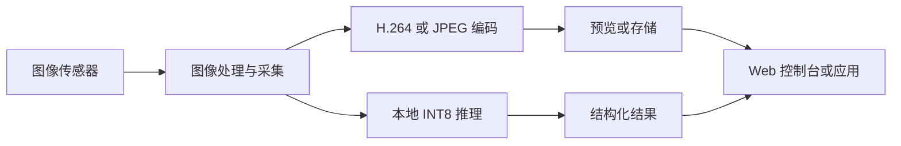

import ApplicationScenarios from '@site/src/components/ApplicationScenarios';
import SupportGrid from '@site/src/components/SupportGrid';

# Product Information

## 产品简介

NeoEyes NE302 是一款面向设备集成的迷你 AI 视觉相机。它把 4 MP 图像采集、STM32N6 边缘 AI、无线连接和本地存储集成在 38 × 38 mm 主板中。NE302 整机交付包含主板和接口板：双板整机可通过 USB Type-C 持续供电或 USB Type-C 外部电池组供电；主板也可用于定制集成，并通过 DC 供电。

### 核心能力

- **边缘 AI 推理**：基于 STM32N6 Cortex-M55 和 Neural-ART 加速器，在设备侧执行 INT8 神经网络推理，减少对云端推理的依赖。
- **图像采集与编码**：支持 4 MP 图像采集；H.264 视频编码最高为 1920 × 1080、30 fps，并提供 JPEG 硬件编码。
- **双板扩展与定制集成**：接口板为整机提供 USB Type-C 供电、MicroSD、控制和开发连接，便于安装、维护和二次开发；主板也可用于通过 DC 供电的定制集成。
- **无线连接**：支持 2.4 GHz Wi-Fi 6 和 BLE；无线配置、天线形态和可用区域以交付版本为准。
- **本地存储与数据流**：支持 MicroSD 本地存储，结合 Web 控制台完成预览、抓拍、推理验证和设备管理。
- **补光与扩展**：部分硬件版本可能提供补光或扩展模块；是否可用以交付 SKU 和当前固件为准。
- **开发资源**：开源工程包含 FSBL、主应用、Web、模型和 WakeCore 等组件，可用于构建、打包、烧录和 OTA 开发。
- **灵活安装**：整机尺寸基线为 42 × 42 × 20 mm，适用于室内磁吸或 3M 胶固定安装。

## 产品规格

以下规格以 NE302 数据手册为公开基线。交付硬件的接口和工程版本差异请参阅[硬件指南](./3-hardware-guide/0-components-overview.md)。

### 核心平台

| 项目 | 规格 |
| :--- | :--- |
| 主控 | STM32N6，Cortex-M55，800 MHz，Arm Helium |
| AI 加速 | Neural-ART，1 GHz，最高 0.6 TOPS INT8 |
| 内存 | 4.2 MB 片上 SRAM / NPU RAM；32 MB PSRAM |
| Flash | 64 MB SPI Flash |

### 成像与传感

| 项目 | 规格 |
| :--- | :--- |
| 图像传感器 | 4 MP 高灵敏度 CMOS |
| H.264 视频编码上限 | 1920 × 1080，最高 30 fps |
| JPEG 编码 | JPEG 硬件编码 |
| 镜头 | 标准 M12；HFOV 88° / 137° 可选 |
| 板载补光 | 白色补光灯 |

### 无线、存储与控制

| 项目 | 规格 |
| :--- | :--- |
| 无线 | Wi-Fi 6，802.11ax 2.4 GHz；BLE 5.3 |
| 天线 | 标准外置 SMA，3–4 dBi |
| 存储与控制 | MicroSD 卡槽；Trigger 和 Reset 按键；双色指示灯 |

### 供电与结构

| 项目 | 规格 |
| :--- | :--- |
| 供电 | 整机（主板 + 接口板）：USB Type-C（5 V）持续供电或 USB Type-C 外部电池组供电；单主板定制集成：DC 供电 |
| 低功耗 | STM32U0 常开域；支持低功耗休眠和多源唤醒 |
| PCBA | 38 × 38 mm |
| 外壳 | 42 × 42 × 20 mm |
| 工作环境 | 室内，−20 °C 至 +50 °C |
| 安装 | 后置磁吸或 3M 胶安装 |

### 产品组成与交付物

NE302 由以下主要部件组成：

| 部件 | 作用 | 备注 |
| :--- | --- | --- |
| 主板 | 承载 STM32N6、STM32U0、图像和无线相关电路 | 38 × 38 mm 主板基线 |
| 接口板 | 提供供电、存储、控制和开发连接 | 接口数量与布局按硬件版本确认 |
| 相机组件 | 提供图像输入 | 适用镜头型号和焦距按 SKU 确认 |
| 天线 | 提供无线连接 | 公共 datasheet 基线为外置 SMA |
| 外壳 | 提供结构保护和安装 | 公共 datasheet 基线为 42 × 42 × 20 mm |
| USB Type-C 线缆 | 设备供电 | 使用交付版本兼容的电源和线缆 |

## 性能与边缘 AI

### 视觉 AI 计算

NE302 以 STM32N6 为主控，使用 Cortex-M55 和 Neural-ART 加速器承担图像处理与边缘 AI 推理。源码工程包含对象检测、姿态估计和模型切换相关能力；实际可上传模型、输入尺寸和性能取决于模型包、固件和硬件版本。

| 能力 | NE302 产品边界 |
| :--- | --- |
| 推理位置 | 设备本地执行 INT8 推理 |
| 加速资源 | Neural-ART，最高 0.6 TOPS INT8 datasheet 基线 |
| 模型来源 | 由 `Model/` 中的模型文件、JSON 配置和打包流程管理 |
| 运行验证 | 通过 Web 控制台的 Model Validation 页面验证 |
| 性能承诺 | 不以单台设备当前显示的模型或单次测试结果作为普遍承诺 |

### 图像与数据流程

设备可以通过 Web 控制台查看预览、执行抓拍、验证模型和检查存储记录。结果发送和媒体流配置由当前固件提供的 MQTT、Webhook、RTSP 或 RTMP 页面决定；具体协议、字段和版本兼容性请以交付版本为准。

## 硬件介绍

### 主板

主板集成 STM32N6、STM32U0、摄像头、PSRAM、SPI Flash 和无线相关电路。主板、相机、天线与硬件版本的识别方式请参见[硬件组成](./3-hardware-guide/0-components-overview.md)。

### 接口板

接口板集中提供设备使用和开发所需的连接，包括 USB Type-C、MicroSD、调试/烧录连接、串口和其他版本相关接口。首次组装、烧录和现场接线时，应以接口板的丝印和交付资料为准。

### 版本说明

不同交付版本可能在无线版本、镜头、天线、调试接口和供电输入上有所不同。不要根据产品渲染图或通用标注图推断具体 SKU；安装、烧录和模型部署前先核对交付版本资料。

当前公开无线基线为 Wi-Fi 6 和 BLE。后续将兼容 Wi-Fi HaLow 版本，但该版本需要对应的无线硬件，不属于当前交付基线；需要 Wi-Fi HaLow 时，请先确认交付版本和硬件配置。

## 产品应用

NE302 的应用方向是“紧凑摄像头 + 本地 AI + 设备集成”。以下内容是产品定位示例，不是已验证的客户案例或固定 SKU。正式部署前，需要针对镜头、光照、模型、触发方式和结果协议完成验证。

<ApplicationScenarios
  introduction="通过本地图像采集和边缘推理，NE302 可作为视觉节点嵌入现有设备、工位或小型终端。具体场景应在确认镜头、光照、模型和网络方式后进行现场验证。"
  imagePosition="left"
  maxDescriptionLines={8}
  categories={[
    {
      title: '设备状态与事件检测',
      items: [
        { title: '工位或设备状态识别', description: '对固定工位或设备状态进行本地识别，再将结构化结果交给上层系统；部署前需要验证镜头视场、光照、模型和结果协议。', image: 'https://resources.camthink.ai/wiki/img/neoeyes-ne302-series/overview/ne302-application-workstation.jpg', imageAlt: '工业设备工位示意' },
        { title: '事件触发抓拍', description: '结合 IO/PIR、远程控制或定时采集，在事件发生时保存或发送图像；部署前需要确认触发接线、存储策略和失败重试。', image: 'https://resources.camthink.ai/wiki/img/neoeyes-ne302-series/overview/ne302-application-entry-terminal.jpg', imageAlt: '出入口终端示意' }
      ]
    },
    {
      title: '紧凑型视觉集成',
      items: [
        { title: '小型终端视觉模块', description: '利用双板结构、无线连接和本地存储为定制设备增加视觉能力；集成前需确认安装空间、供电、天线和维护方式。', image: 'https://resources.camthink.ai/wiki/img/neoeyes-ne302-series/overview/ne302-application-self-service-terminal.jpg', imageAlt: '小型自助终端示意' },
        { title: '边缘 AI 原型验证', description: '使用 Web 控制台和开源工程验证模型、镜头和数据输出方式；单台设备的测试结果不能替代量产性能和可靠性测试。', image: 'https://resources.camthink.ai/wiki/img/neoeyes-ne302-series/overview/ne302-application-edge-ai-prototype-validation.png', imageAlt: '边缘 AI 原型验证流程示意' }
      ]
    }
  ]}
/>

## 产品资源

### Wiki 指南

- [快速指南](./1-quick-start.md)：完成组装、首次登录、AI 验证和触发记录。
- [用户指南](./2-user-guide/0-capture-storage.md)：按设备管理职责深入配置抓拍、数据发送、AI 验证和系统维护。
- [硬件指南](./3-hardware-guide/0-components-overview.md)：查看主板、接口板和硬件版本边界。
- [软件指南](./4-software-guide/0-development-environment.md)：配置源码环境并执行构建、打包和烧录流程。

### 开发资源

- [NE302 GitHub 仓库](https://github.com/camthink-ai/ne302)：源码、README、SETUP 和构建脚本。
- [构建、烧录与更新](./4-software-guide/1-build-and-flash.md)：了解各组件的构建、打包、烧录和更新边界。

## 技术支持

遇到产品或固件差异时，请提供硬件版本、固件组件版本、复现步骤和脱敏后的日志。不要在工单、截图或公开文档中包含设备密码、Secret Key、网络密钥、MAC 地址或序列号。

<SupportGrid />
