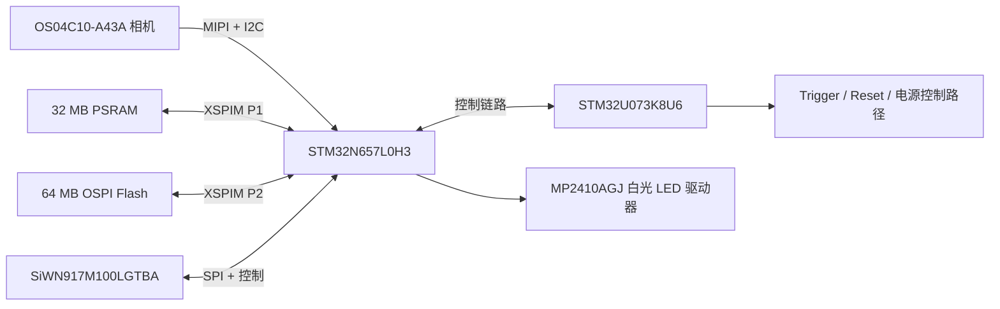

# Components Overview

NE302 整机交付包含主板和接口板，组成双板结构。主板集成成像、计算、存储、无线和控制电路；接口板提供 USB Type-C、MicroSD、烧录和维护接口。主板也可用于单主板定制集成，并通过 DC 供电；该形态不使用接口板提供的 MicroSD 卡座。本页帮助识别这些硬件模块。连接线缆和烧录固件请参阅[硬件连接](./1-hardware-connection.md)。

## 主板组件图

| 组件 | 电路角色 | 连接的硬件路径 |
| :--- | :--- | :--- |
| **STM32N657L0H3** | 视觉与 AI 主控 MCU | 接收相机数据流，并连接 PSRAM、Flash、Wi-Fi 和接口板 |
| **STM32U073K8U6** | 低功耗控制 MCU | 处理电源控制及唤醒、控制信号，包括 Trigger 和 Reset 的相关控制路径 |
| **APS512XXN-OBR-BG PSRAM** | 32 MB 运行内存 | 通过 XSPIM P1 接口连接 STM32N657 |
| **OSPI Flash** | 64 MB 非易失存储 | 通过 XSPIM P2 接口连接 STM32N657；固件包和分区地址必须与该硬件匹配 |
| **SiWN917M100LGTBA** | 2.4 GHz Wi-Fi 6 与 Bluetooth 无线模块 | 通过 Wi-Fi SPI/控制路径和已安装的天线连接 STM32N657 |
| **OS04C10-A43A** | 4 MP CMOS 图像传感器 | 通过 MIPI 相机数据路径和 I2C 控制路径连接 STM32N657 |
| **MP2410AGJ** | 白光 LED 驱动器 | 通过 `PWM_LED` 控制路径驱动板载补光 |

主板还包括图中标出的外部电源输入、Alarm I/O、Trigger 按键、外置天线接口和板间插座。这些标注仅用于识别物理区域，不代表现场接线的引脚定义或电气限制。

## 主板背面与复位

背面图标出了**复位按键**。只在操作流程要求时使用该按键；它用于重启设备，不能代替 N6 或 U0 的烧录目标选择。

## 图像、计算与控制路径

STM32N6 和 STM32U0 是独立 MCU。烧录前按接口板丝印确认目标；拨码、ST-LINK 接线和命令见[构建、烧录与更新](../4-software-guide/1-build-and-flash.md)。

## 接口板组件图

接口板包括 USB-C 和 MicroSD 连接电路、烧录接口，以及 **SHT31-DIS** 温湿度传感器。该器件位于接口板上，但整机标准外壳未为其开孔；不能将其作为整机的环境温湿度测量功能。

  
  

| 接口板组件或区域 | 功能 | 使用边界 |
| :--- | :--- | :--- |
| USB-C 电路 | 设备供电与 USB 连接 | 使用交付设备认可的 USB-C 电源和线缆 |
| MicroSD 电路 | 访问本地存储卡 | 按当前设备流程操作；若未明确支持热插拔，请先停止设备并断电后再处理存储卡 |
| SHT31-DIS | 原理图中的温湿度传感器 | 标准外壳未为传感器开孔，且本文未核验固件读取路径和 Web UI 是否显示；不作为整机环境温湿度测量功能 |
| N6-STLINK / U0-STLINK | 两条独立 SWD 烧录路径 | 选择与固件目标一致的路径 |
| U6-UART | STM32N6 串口控制台接口 | 仅使用匹配的转接器和串口流程；源码 README 标注为 921600 波特率 |
| N6-BOOT / U0-BOOT | 烧录模式控制 | 仅在设备断电时切换对应开关 |

## 相关资料

- 两板装配、USB-C、MicroSD、U6-UART 和 ST-LINK：[硬件连接](./1-hardware-connection.md)
- 构建与烧录命令：[构建、烧录与更新](../4-software-guide/1-build-and-flash.md)
- 源码中的原理图、PCB 图和工程文件：[NE302 源码仓库](https://github.com/camthink-ai/ne302)
