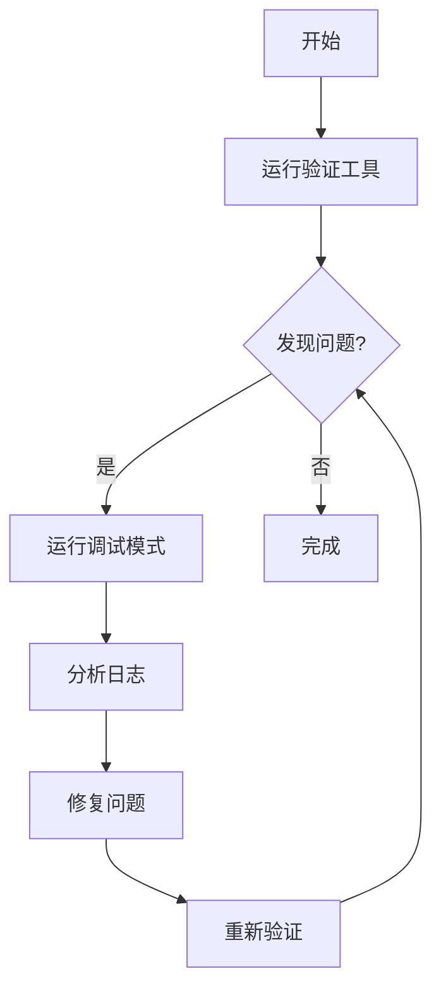

# 图片上传路径映射优化设计

**日期**：2026-03-20
**状态**：已批准，待实施
**作者**：Claude Code

---

## 概述

优化 CamThink Wiki 文档项目的图片上传路径映射实现，确保稳定性、可预测性和可维护性。

### 目标

1. **稳定性**：确保所有图片上传到正确位置
2. **可预测性**：用户可以根据文档路径推断图片 URL
3. **可维护性**：完善的测试、文档和工具支持

### 范围

- ✅ 保留现有路径映射算法
- ✅ 清理旧版本遗留文件和错误上传结果
- ✅ 完善测试覆盖（边界情况、错误处理）
- ✅ 添加路径验证和调试工具
- ✅ 改进文档和用户指南
- ❌ 不改变路径映射规则
- ❌ 不添加新的映射策略

---

## 现状分析

### 当前实现

**路径映射算法**：基于文档完整层级生成图片 URL

**示例**：
```
文档路径: docs/1-neoedge-ng4500-series/2-ng4500-cb01-development-board/2-software-guide/1-driver-installation-and-updates/2-4g-5g.md
图片原路径: /img/EM05_network_configuration.png
映射后路径: /img/neoedge-ng4500-series/ng4500-cb01-development-board/software-guide/driver-installation-and-updates/4g-5g/EM05_network_configuration.png
```

**已实现功能**：
- ✅ 提取文档层级（包括目录和文件名）
- ✅ 移除数字前缀
- ✅ 移除图片原始路径的文件夹（只保留文件名）
- ✅ 处理边界情况（远程 URL、根文档、Windows 路径）
- ✅ 安全检查（路径遍历、类型验证）
- ✅ URL 编码（中文文件名、空格）

**测试覆盖**：
- ✅ 单元测试（`path-mapper.test.js`）
- ✅ 集成测试（`integration-test.js`）
- ✅ 覆盖率：行 90%+，分支 85%+，函数 100%

### 识别的问题

#### 1. 旧版本遗留
- **现象**：存在新旧两个版本的代码（`path-mapper.js` 和 `path-mapper.js.backup`）
- **影响**：可能导致混淆，用户运行错误的版本
- **严重性**：中等

#### 2. File Browser 中文件位置错误
- **现象**：某些深层文档的图片被上传到第一层目录
- **原因**：旧版本算法或测试过程中上传的文件
- **影响**：图片 URL 不可访问，文档显示异常
- **严重性**：高

#### 3. 路径层级深
- **现象**：5 级文档映射后路径深度达 7 层
- **影响**：URL 较长，但符合语义完整性原则
- **严重性**：低（设计权衡）

#### 4. 可预测性不足
- **现象**：用户难以直观推断图片 URL
- **原因**：缺乏清晰的文档和示例
- **影响**：需要工具辅助验证
- **严重性**：中等

#### 5. 测试失败：文档路径安全检查缺失
- **现象**：测试 `should reject path traversal in docPath` 失败
- **原因**：代码只检查 `imagePath` 的路径遍历，未检查 `docPath`
- **代码位置**：`path-mapper.js` 第 26-29 行
- **影响**：低（文档路径通常可信，输入来自项目内部）
- **严重性**：低
- **修复**：在阶段 1 中补充 `docPath` 路径遍历检查

---

## 设计方案

### 方案 A：优化现有实现（推荐）

#### 核心原则

1. **语义完整性**：保留完整的文档层级结构
2. **路径可预测**：用户可以根据文档路径推断图片 URL
3. **向后兼容**：支持平滑迁移，不破坏现有文档
4. **工程质量**：完善的测试、文档和验证工具

#### 路径映射算法（保持不变）

**输入**：
- 文档路径：`docs/1-neoedge-ng4500-series/2-ng4500-cb01-development-board/2-software-guide/1-driver-installation-and-updates/2-4g-5g.md`
- 图片路径：`/img/EM05_network_configuration.png`

**处理流程**：
1. 提取文档层级：`neoedge-ng4500-series` → `ng4500-cb01-development-board` → `software-guide` → `driver-installation-and-updates` → `4g-5g`
2. 提取图片文件名：`EM05_network_configuration.png`
3. 构建远程路径：`/img/` + 文档层级 + `/` + 图片文件名

**输出**：
```
/img/neoedge-ng4500-series/ng4500-cb01-development-board/software-guide/driver-installation-and-updates/4g-5g/EM05_network_configuration.png
```

**算法特点**：
- ✅ 完全基于文档结构
- ✅ 移除数字前缀
- ✅ 不包含图片原始路径的文件夹
- ✅ 路径深度 = 文档目录深度 + 1（文档文件名）+ 1（图片文件名）

**已处理的边界情况**：
- ✅ 根级别文档（`docs/overview.md`）
- ✅ 远程 URL（直接返回）
- ✅ 非 `/img/` 开头的路径（直接返回）
- ✅ 路径遍历攻击（检测并拒绝）
- ✅ 中文文件名（URL 编码）
- ✅ Windows 路径分隔符（自动转换）

#### 清理和迁移策略

**采用方案 A-1：完全清理**

**步骤**：
1. 备份 File Browser 中的 `/img/` 目录
2. 删除所有图片文件
3. 重新运行上传脚本（使用新算法）
4. 验证所有图片 URL 可访问

**优点**：
- ✅ 彻底解决混乱
- ✅ 确保所有文件都在正确位置

**缺点**：
- ❌ 短暂的服务中断
- ❌ 需要重新上传所有图片

**实施时机**：选择低峰时段（如凌晨），提前通知用户

---

## 测试和质量保证

### 当前测试覆盖

**单元测试**（`path-mapper.test.js`）：
- ✅ 基本功能：2/3/4/5 级文档
- ✅ 边界情况：根文档、Windows 路径、非 `/img/` 路径
- ✅ 安全性：路径遍历、空值、类型检查
- ✅ URL 编码：中文字符、空格
- ✅ 向后兼容：旧 API 包装函数

**集成测试**（`integration-test.js`）：
- ✅ 真实文档路径
- ✅ 真实图片引用

### 需要补充的测试

#### 1. 端到端测试
**文件**：`test/e2e-test.js`

**测试场景**：
```javascript
// 模拟完整上传流程
1. 扫描文档 → 提取图片 → 生成映射
2. 验证映射正确性
3. 模拟上传（dry-run 模式）
4. 验证 URL 可访问性
```

#### 2. 边界情况测试
**文件**：`test/edge-cases.test.js`

**新增测试用例**：
- 超长路径（> 200 字符）
- 特殊字符（emoji、符号）
- 重复文件名（不同路径）
- 空文档（无图片）
- 混合引用（本地 + 远程）

#### 3. 性能测试
**文件**：`test/performance.test.js`

**测试指标**：
- 1000 个图片路径映射：< 100ms
- 内存占用：< 50MB

### 质量门槛

**代码覆盖率**：
- 行覆盖率：≥ 90%
- 分支覆盖率：≥ 85%
- 函数覆盖率：100%

**CI/CD 检查**：
```yaml
- 单元测试：必须通过
- 集成测试：必须通过
- 代码覆盖率：≥ 90%
- ESLint：无错误
```

---

## 验证和调试工具

### 1. 路径映射验证工具

**文件**：`scripts/verify-path-mapping.js`

**功能**：验证路径映射算法的正确性

**用法**：
```bash
# 验证单个文档
node scripts/verify-path-mapping.js docs/1-neoedge-ng4500-series/0-overview.md

# 验证整个目录
node scripts/verify-path-mapping.js docs/1-neoedge-ng4500-series

# 输出详细报告
node scripts/verify-path-mapping.js docs/1-neoedge-ng4500-series --verbose
```

**输出示例**：
```
✅ docs/1-neoedge-ng4500-series/0-overview.md
  - /img/Overview/NG45xx/NG45XX.png
    → /img/neoedge-ng4500-series/overview/NG45XX.png ✅

❌ docs/1-neoedge-ng4500-series/2-board/0-guide.md
  - /img/test/image.png
    → 映射后路径深度异常（预期 4 层，实际 6 层）
```

### 2. 上传结果验证工具

**文件**：`scripts/verify-uploads.js`

**功能**：检查上传后的图片 URL 是否可访问

**用法**：
```bash
# 验证单个文档的所有图片
node scripts/verify-uploads.js docs/1-neoedge-ng4500-series/0-overview.md

# 验证整个目录
node scripts/verify-uploads.js docs/1-neoedge-ng4500-series

# 生成修复报告
node scripts/verify-uploads.js docs/1-neoedge-ng4500-series --fix
```

**检查项**：
- ✅ HTTP 状态码 200
- ✅ Content-Type 正确（image/png, image/jpeg 等）
- ✅ 文件大小 > 0
- ✅ URL 格式正确

**输出示例**：
```
📊 验证结果：
  ✅ 可访问：45 个
  ❌ 404 错误：3 个
  ⚠️  超时：1 个

❌ 失败的图片：
  1. /img/neoedge-ng4500-series/overview/NG45XX.png
     文档：docs/1-neoedge-ng4500-series/0-overview.md
     状态：404 Not Found

💡 修复建议：
  运行：node scripts/upload-images.js docs/1-neoedge-ng4500-series/0-overview.md
```

### 3. 调试模式增强

**修改**：`scripts/upload-images.js`

**新增功能**：
```bash
# 调试模式：显示详细的路径映射过程
node scripts/upload-images.js docs/1-neoedge-ng4500-series --debug

# 输出：
📝 路径映射详情：
  文档：docs/1-neoedge-ng4500-series/0-overview.md
  层级：['neoedge-ng4500-series', 'overview']

  图片：/img/Overview/NG45xx/NG45XX.png
  文件名：NG45XX.png
  映射：/img/neoedge-ng4500-series/overview/NG45XX.png
```

### 4. 清理工具

**文件**：`scripts/cleanup-old-uploads.js`

**功能**：清理 File Browser 中的旧文件

**用法**：
```bash
# 预览将要删除的文件（dry-run）
node scripts/cleanup-old-uploads.js --dry-run

# 执行清理
node scripts/cleanup-old-uploads.js --confirm
```

**安全措施**：
- ✅ 需要显式确认
- ✅ 生成备份列表
- ✅ 支持回滚

---

## 文档和用户指南

### 1. README 更新

**文件**：`.image-upload/README.md`

**新增章节**：
```markdown
## 路径映射算法

### 工作原理
路径映射基于文档的完整层级结构生成图片 URL：

文档路径 → 提取层级 → 添加图片文件名 → 生成远程路径

### 示例

| 文档路径 | 图片原路径 | 映射后路径 |
|---------|-----------|-----------|
| docs/1-series/0-overview.md | /img/test.png | /img/series/overview/test.png |
| docs/1-series/2-board/0-guide.md | /img/board.png | /img/series/board/guide/board.png |
| docs/1-series/2-board/1-driver/0-wifi.md | /img/wifi.png | /img/series/board/driver/wifi/wifi.png |

### 路径规则
- ✅ 保留完整文档层级
- ✅ 移除数字前缀
- ✅ 移除图片原始路径的文件夹
- ✅ 只保留图片文件名

## 故障排查

### 图片 404 错误
1. 运行验证脚本：`node scripts/verify-uploads.js <doc-path>`
2. 检查路径映射：`node scripts/upload-images.js <doc-path> --dry-run`
3. 重新上传：`node scripts/upload-images.js <doc-path> --force --no-cache`
```

### 2. 算法文档

**文件**：`.image-upload/docs/path-mapping-algorithm.md`

**内容**：
```markdown
# 路径映射算法详解

## 算法流程

### 1. 提取文档层级
输入：docs/1-neoedge-ng4500-series/2-board/0-guide.md

处理：
- 移除 'docs' 前缀
- 移除数字前缀
- 提取文件名（不含 .md）

输出：['neoedge-ng4500-series', 'board', 'guide']

### 2. 提取图片文件名
输入：/img/NG45XX_SOFTWARE/Driver/NG45XX_GPIO.png

处理：
- 验证以 /img/ 开头
- 提取文件名
- URL 编码

输出：NG45XX_GPIO.png

### 3. 构建远程路径
组合：/img/ + 层级路径 + 文件名

输出：/img/neoedge-ng4500-series/board/guide/NG45XX_GPIO.png

## 边界情况处理

| 情况 | 输入 | 输出 | 说明 |
|------|------|------|------|
| 远程 URL | https://example.com/img.png | 原样返回 | 不处理远程图片 |
| 非 /img/ 路径 | /static/img/test.png | 原样返回 | 只处理 /img/ 开头 |
| 根文档 | docs/overview.md | /img/overview/... | 使用文件名作为层级 |
| 中文文件名 | /img/测试.png | /img/.../%E6%B5%8B%E8%AF%95.png | URL 编码 |
```

### 3. 迁移指南

**文件**：`.image-upload/docs/migration-guide.md`

**内容**：
```markdown
# 迁移指南：从旧版本升级

## 背景
新版本使用基于文档完整层级的路径映射，不再使用图片原始路径的文件夹。

## 迁移步骤

### 1. 备份现有文件
```bash
# 在 File Browser 中导出 /img/ 目录
```

### 2. 清理旧文件
```bash
cd .image-upload
node scripts/cleanup-old-uploads.js --dry-run  # 预览
node scripts/cleanup-old-uploads.js --confirm  # 执行
```

### 3. 重新上传所有图片
```bash
# 上传单个目录
node scripts/upload-images.js docs/1-neoedge-ng4500-series

# 上传所有文档
node scripts/upload-images.js docs/
```

### 4. 验证
```bash
# 验证所有图片可访问
node scripts/verify-uploads.js docs/
```

## 预期影响
- ✅ 所有图片 URL 会改变
- ✅ 文档中的链接会自动更新
- ❌ 旧的图片 URL 会失效（需要清理缓存）

## 回滚方案
如果出现问题，可以从备份恢复 File Browser 的 /img/ 目录。
```

---

## 实施计划

### 阶段 1：测试和验证（1-2 小时）

**任务**：
1. ✅ 修复文档路径安全检查（已完成：`path-mapper.js` 已补充 `docPath` 路径遍历检测，测试通过）
2. ⬜ 补充端到端测试（`test/e2e-test.js`）
3. ⬜ 补充边界情况测试（`test/edge-cases.test.js`）
4. ⬜ 补充性能测试（`test/performance.test.js`）
5. ⬜ 运行所有测试确保通过
6. ⬜ 验证覆盖率 ≥ 90%

**验收标准**：
- 所有测试通过（包括安全测试）
- 覆盖率达标
- 无 ESLint 错误

### 阶段 2：工具开发（2-3 小时）

**任务**：
1. ⬜ 开发 `scripts/verify-path-mapping.js`
2. ⬜ 开发 `scripts/verify-uploads.js`
3. ⬜ 开发 `scripts/cleanup-old-uploads.js`
4. ⬜ 增强 `scripts/upload-images.js` 的调试模式

**验收标准**：
- 工具可正常运行
- 输出清晰易懂
- 错误处理完善

### 阶段 3：文档更新（1 小时）

**任务**：
1. ⬜ 更新 `.image-upload/README.md`
2. ⬜ 创建 `.image-upload/docs/path-mapping-algorithm.md`
3. ⬜ 创建 `.image-upload/docs/migration-guide.md`

**验收标准**：
- 文档清晰完整
- 示例准确
- 无死链

### 阶段 4：清理和迁移（1-2 小时）

**任务**：
1. ⬜ 备份 File Browser 的 `/img/` 目录
2. ⬜ 运行清理脚本（`cleanup-old-uploads.js`）
3. ⬜ 重新上传所有图片（`upload-images.js`）
4. ⬜ 验证所有图片可访问（`verify-uploads.js`）

**验收标准**：
- 所有图片 URL 可访问
- 无 404 错误
- 文档链接正确

### 总时间估算

**6-8 小时**（可并行优化到 4-5 小时）

### 并行优化建议

- 阶段 1 和 阶段 3 可以并行（测试 + 文档）
- 阶段 2 独立进行
- 阶段 4 必须最后（依赖前面所有阶段）

---

## 风险和缓解

| 风险 | 影响 | 概率 | 缓解措施 |
|------|------|------|----------|
| 清理过程中服务中断 | 高 | 中 | 选择低峰时段（凌晨），提前通知用户 |
| 图片上传失败 | 中 | 低 | 重试机制（已有），错误日志，手动修复 |
| 测试覆盖率不达标 | 低 | 低 | 补充测试用例，已有 90%+ 覆盖率 |
| 文档有误 | 低 | 低 | 代码审查，用户验证 |
| 旧版本代码混淆 | 中 | 高 | 删除 `path-mapper.js.backup`，更新文档 |
| File Browser API 不可用 | 高 | 低 | 备用方案：手动上传关键图片 |

---

## 预期成果

### 功能性成果

- ✅ 所有图片在正确位置（基于文档层级）
- ✅ 图片 URL 可预测
- ✅ 无 404 错误
- ✅ 文档链接正确

### 工程性成果

- ✅ 完善的测试覆盖（≥ 90%）
- ✅ 易用的验证工具
- ✅ 清晰的文档
- ✅ 稳定的代码质量

### 可维护性成果

- ✅ 清晰的算法文档
- ✅ 完整的迁移指南
- ✅ 故障排查手册
- ✅ 调试工具支持

---

## 附录

### A. 路径映射示例

| 文档层级 | 文档路径 | 图片原路径 | 映射后路径 | 深度 |
|---------|---------|-----------|-----------|------|
| 2 级 | docs/1-series/0-overview.md | /img/test.png | /img/series/overview/test.png | 3 |
| 3 级 | docs/1-series/2-board/0-guide.md | /img/board.png | /img/series/board/guide/board.png | 4 |
| 4 级 | docs/1-series/2-board/1-driver/0-wifi.md | /img/wifi.png | /img/series/board/driver/wifi/wifi.png | 5 |
| 5 级 | docs/1-series/2-board/1-driver/0-wifi/1-config.md | /img/cfg.png | /img/series/board/driver/wifi/config/cfg.png | 6 |

### B. 工具使用流程



### C. 文件清单

**需要新增的文件**：
- `test/e2e-test.js` - 端到端测试
- `test/edge-cases.test.js` - 边界情况测试
- `test/performance.test.js` - 性能测试
- `scripts/verify-path-mapping.js` - 路径映射验证工具
- `scripts/verify-uploads.js` - 上传结果验证工具
- `scripts/cleanup-old-uploads.js` - 清理工具
- `.image-upload/docs/path-mapping-algorithm.md` - 算法文档
- `.image-upload/docs/migration-guide.md` - 迁移指南

**需要修改的文件**：
- `scripts/upload-images.js` - 增强调试模式
- `.image-upload/README.md` - 更新文档

**需要删除的文件**：
- `lib/path-mapper.js.backup` - 旧版本代码

---

## 变更历史

| 日期 | 版本 | 作者 | 变更说明 |
|------|------|------|----------|
| 2026-03-20 | 1.0 | Claude Code | 初始设计 |
