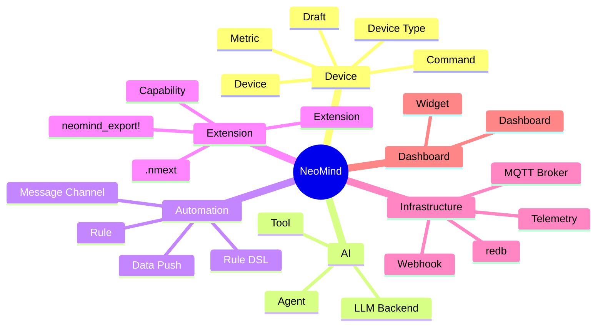
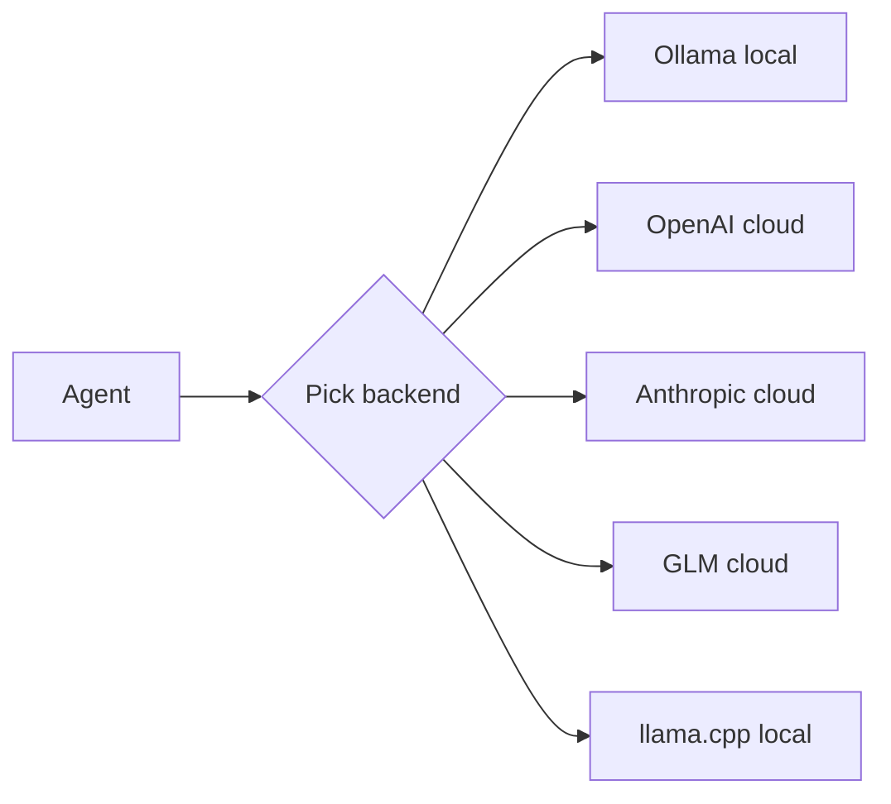
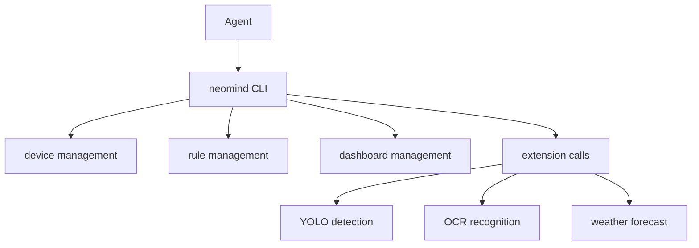
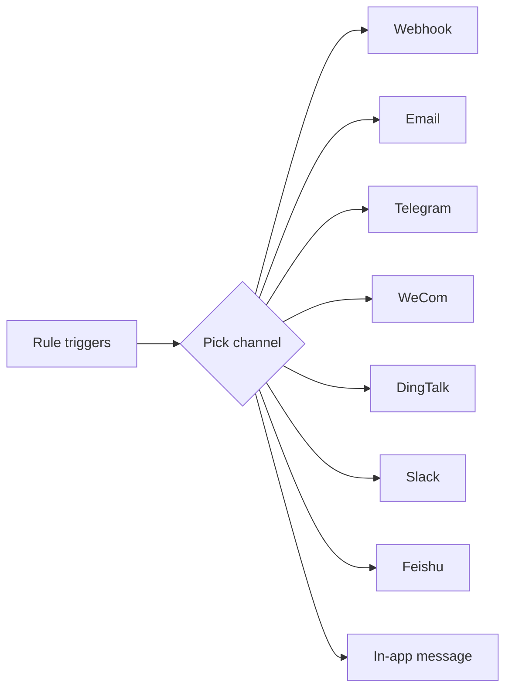
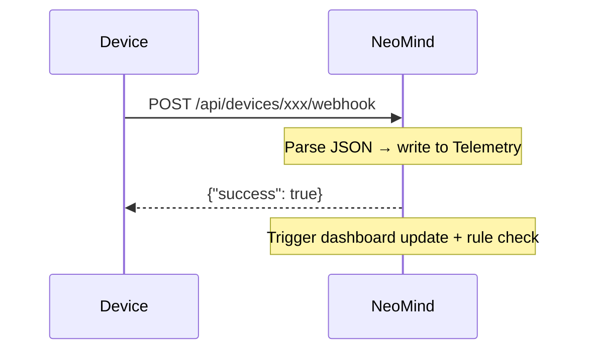
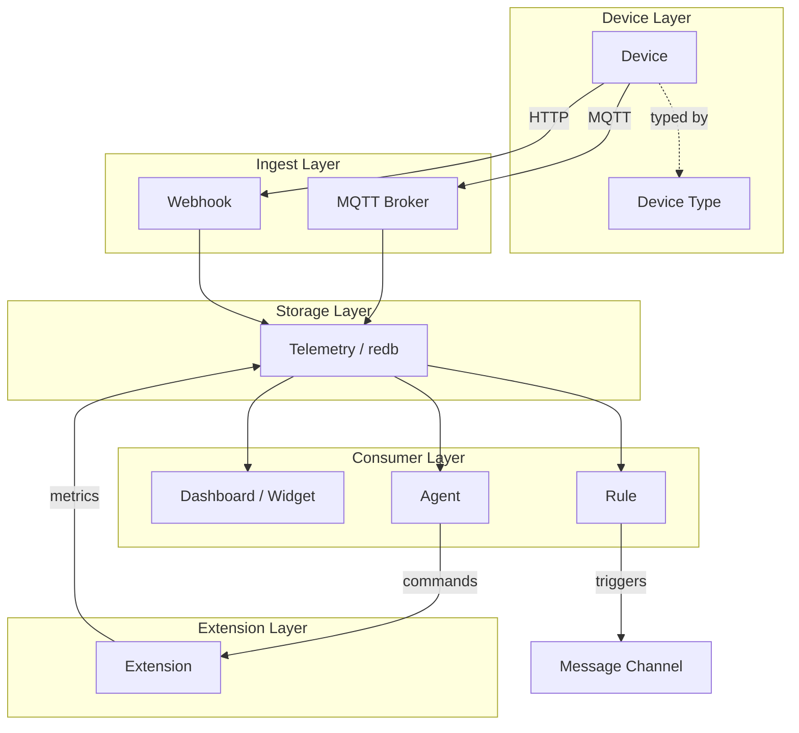

# Glossary

NeoMind introduces many concepts. This page is the central definition for all core terminology. When you encounter a new term for the first time, check here.

> If you want the overall system architecture and data flow (rather than individual terms), jump straight to [Core Concepts](./2-core-concepts.md).

:::tip How to use this glossary

- **First time browsing**: skim the categories below to build a mental model
- **Hit an unfamiliar word**: search the page (`Ctrl/Cmd + F`) directly
- **Want to see how things connect**: jump to the [Concept Relationship Map](#concept-relationship-map) at the end
  :::

---

## Quick Category Overview



---

## Device Related

### Device

A physical or virtual device that has been connected to NeoMind. Each device has a unique ID, a device type, a set of metrics (telemetry points), and commands (control actions).

**Example**: A temperature/humidity sensor whose metrics are `temperature` / `humidity` and whose command is `reboot`.

:::info Three key attributes of a device
1. **Unique ID** — used to reference it in the system (`sensor-01`)
2. **Device Type** — determines which metrics / commands it has
3. **Connection method** — one of MQTT / Webhook / BLE
:::

### Device Type

The "template" for a device, defining which metrics, commands, and connection parameters that kind of device exposes. Device types are defined in JSON and stored in the [NeoMind-DeviceTypes](https://github.com/camthink-ai/NeoMind-DeviceTypes) repository.

When you create a device you pick a type and NeoMind generates the default metric / command schema from it.

**Example**: `NE101` is a device type that defines an `image_data` (video frame) metric and a `capture` command.

### Draft

When NeoMind auto-discovers an unknown device via MQTT or Webhook, it does not immediately create a device. Instead it produces a "draft". Only after an admin approves the draft does it become an official device.

:::warning Why not auto-join?
This is a safety mechanism — it prevents unauthorized devices from joining your system automatically. Auto-discovered devices only enter the draft queue; they officially come online only after you confirm them.
:::

### Metric

A time-series data point produced by a device or extension. Each metric has a name, a data type (Integer / Float / String / Boolean), and an optional unit.

**Examples**:

| Metric name | Data type | Unit | Meaning |
|-------------|-----------|------|---------|
| `temperature` | Float | °C | Temperature |
| `humidity` | Float | % | Humidity |
| `motion` | Boolean | — | Motion detected |
| `image_data` | String | — | Base64-encoded image |

### Command

A control instruction you can send to a device, or an operation you can invoke on an extension. Each command has a name and a parameter schema.

**Examples**: `set_temperature(target: Integer)`, `capture()`, `reboot()`.

### DataSourceId

The unified format NeoMind uses to reference any data point: `{type}:{id}:{field}`

| type | Meaning | Example |
|------|---------|---------|
| `device` | Device telemetry | `device:sensor-01:temperature` |
| `extension` | Extension metric | `extension:weather:temp` |
| `agent` | Agent status | `agent:guard:status` |

:::tip This is the format you'll see most often
Dashboard widget data sources, rule trigger conditions, data push targets — all reference data via DataSourceId. Just remember the three-part pattern: `{type}:{id}:{field}`.
:::

---

## AI Related

### LLM Backend

The large language model instance NeoMind connects to. Multiple backends are supported: **Ollama** (local), **OpenAI**, **Anthropic**, **GLM**, **llama.cpp**, etc. You can configure several backends and switch between them per scenario.



:::info Local vs Cloud
- **Local (Ollama / llama.cpp)**: zero latency, data never leaves the LAN, works offline — but limited by hardware
- **Cloud (OpenAI / Anthropic / GLM)**: more powerful models, but needs network, data goes to cloud, continuous billing
- You can configure several at once and use different backends for different agents
  :::

> See [Configure LLM Backend](../user-guide/2-configure-llm.md).

### Agent

NeoMind's core intelligent unit. An agent receives natural-language input from a user (or runs on a schedule), uses an LLM to understand intent, invokes tools (CLI commands, device controls, extension commands) to take action, and learns from the results.

**Two execution modes**:

| Mode | Trigger | Bound resources | Typical use case |
|------|---------|-----------------|------------------|
| **Free mode** | User conversation | None | Free-form Q&A, ad-hoc queries |
| **Focused mode** | Schedule / event | Bound devices + data sources | Periodic inspection, anomaly monitoring |

:::tip Agent ≠ ChatGPT
An agent does more than chat — it **takes action**. When you ask "notify me when temperature exceeds 30", it actually creates a rule, configures a notification channel, and starts monitoring. This is powered by Tool Use.
:::

> See [AI Chat](../user-guide/5-ai-chat.md).

### Tool

An action an agent can call. NeoMind's agent operates primarily through `neomind` CLI commands to manage devices, rules, dashboards, and so on. The tool system automatically exposes commands from installed extensions to the LLM as well.



---

## Automation Related

### Rule

Event-driven automation logic. When a condition is met, the action executes automatically.

NeoMind rules are defined with a **DSL (domain-specific language)** rather than structured JSON:

```
RULE HighTemp
WHEN device("sensor-01").temperature > 30
DO notify("email", "High temperature alert")
END
```

:::info Why DSL instead of JSON?
The DSL is human-readable — you can see "when it triggers, what it does" at a glance. Compared to an equivalent JSON rule definition, the DSL is shorter to write, faster to read, and simpler to edit.
:::

### Rule DSL

The text syntax used to define rules. It uses a four-segment structure of `RULE` / `WHEN` / `DO` / `END`.

| Segment | Purpose | Example |
|---------|---------|---------|
| `RULE` | Name | `RULE HighTemp` |
| `WHEN` | Trigger condition | `device("sensor-01").temperature > 30` |
| `DO` | Action | `notify("email", "High temperature alert")` |
| `END` | Close | `END` |

> See the rule engine doc (coming soon).

### Message Channel

The delivery channel used when a rule triggers a notification. Supports 7 external channels plus in-app messages:



> See [Notifications](../user-guide/8-notifications.md).

### Data Push

Actively pushing telemetry data to an external system (Webhook or MQTT), as opposed to passive querying. You can configure push frequency, data format, and target address.

:::tip Data Push vs Rule
- **Data Push** — pushes raw data unconditionally ("push temperature to an external system every 10 seconds")
- **Rule** — triggers an action on a condition ("send a notification when temperature exceeds 30")
  :::

---

## Extension Related

### Extension

A plugin module loaded into NeoMind via FFI (foreign function interface). Extensions are written in Rust, compiled to a dynamic library (`.dylib` / `.so` / `.dll`), and run in a **separate process**.

Extensions can:
- Provide metrics (data streams)
- Provide commands (callable operations)
- Load ML models (e.g. YOLO object detection)
- Process streaming data (e.g. video frames)

```mermaid
graph LR
    subgraph Main[Main process]
        ER[ExtensionRunner]
    end
    subgraph Ext1[Extension process 1]
        Y[YOLO detection]
    end
    subgraph Ext2[Extension process 2]
        O[OCR recognition]
    end
    ER <-.FFI.- Y
    ER <-.FFI.- O
```

:::warning Why process isolation matters
Extensions run in separate processes — if the YOLO extension crashes because a model fails to load, **the main service is completely unaffected**. Other extensions are not impacted either. This is a key design for NeoMind's stability.
:::

> See the [Extension SDK](../developer-guide/3-extension-sdk.md).

### Capability

A permission an extension must declare at startup. Any capability not declared is denied. This enforces the **principle of least privilege**.

| Capability | Meaning |
|------------|---------|
| `network` | Outbound network access |
| `filesystem:read` / `filesystem:write` | File read / write |
| `ml-model` | Load / run ML models |
| `camera` | Access cameras |
| `serial` | Serial port access |

:::info Security model
A weather extension only needs the `network` capability. If it tries to read a file, NeoMind denies it outright. This way, even if an extension has a bug and gets exploited, the blast radius is limited to its declared permissions.
:::

### .nmext

The distribution package format for NeoMind extensions. A `.nmext` file is a zip archive containing multi-platform binaries + `metadata.json` + optional model files.

When a user clicks install in the Web UI, the runner automatically selects the binary matching the current platform — **no need to worry about whether the target is macOS or Linux, ARM or x86**.

### neomind_export!

A macro provided by the SDK that exports a Rust `impl Extension` as FFI entry points automatically. Extension developers only need to add one line at the end of their code:

```rust
neomind_extension_sdk::neomind_export!(MyExtension);
```

### Process Isolation

Extensions run in a separate process rather than inside the main process. Benefits: an extension crash (panic) cannot bring down the main service; extensions cannot interfere with each other; the capability-based permission boundary is clearer.

### Lazy Load

ML models are not loaded at extension startup. Instead they are loaded into memory on the first command call. Once loaded they stay resident (until the extension process exits), avoiding repeated reloads per inference.

:::tip Why not load at startup?
A YOLOv8n model is about 12 MB and takes 1–2 seconds to load. If the extension loaded it at startup but the user might not use it for hours, that memory is wasted. Lazy loading = **occupy on demand, stay resident once loaded**.
:::

---

## Infrastructure Related

### MQTT Broker

The message broker built into NeoMind (port `1883`). Devices connect, report telemetry, and receive commands over MQTT.

:::info Zero dependencies
No external broker (such as Mosquitto) needs to be installed — NeoMind ships with a full MQTT implementation. It's ready the moment you start; devices connect directly to `localhost:1883`.
:::

### Telemetry

NeoMind's time-series database, built on redb and stored in `data/telemetry.redb`. All metric values are written here, and the dashboard and rule engine read from it.

### redb

The embedded key-value storage engine NeoMind uses (written in Rust). There is no external database dependency; data files land directly on disk in the `data/` directory.

:::info Why not SQLite / PostgreSQL?
redb is a pure Rust implementation that integrates perfectly with NeoMind's Rust stack — **zero external dependencies, zero cross-language overhead, compiled into the same binary**. It is specifically optimized for time-series data (write-heavy, time-range queries).
:::

### Webhook

An HTTP callback mechanism. Devices can report data by sending POST requests to NeoMind's webhook URL without needing MQTT. It is also used to receive event pushes from external systems.



---

## Dashboard Related

### Dashboard

A visualization page composed of a set of widgets. You can create multiple dashboards, share them (via public links with expiry times), and they auto-adapt to mobile screens.

### Widget

A single visualization element on a dashboard. Built-in types:

| Type | Shows | Typical use case |
|------|-------|------------------|
| **Value Card** | A single value | Current temperature, humidity |
| **Line Chart** | Time-series trend | 24-hour temperature change |
| **Gauge** | Dial-style reading | CPU usage |
| **Data Table** | Multi-column table | Device list, history |
| **VLM Vision** | Image + AI annotations | Object detection results |
| **Stream Player** | Live video feed | Camera feed |

Custom widgets provided by extensions are also supported.

> See [Use Dashboard](../user-guide/4-use-dashboard.md).

---

## Concept Relationship Map

How do these concepts work together? The diagram below shows the full data flow from device to visualization:



---

*Last updated: 2026-06-12 · NeoMind v0.8.11*
