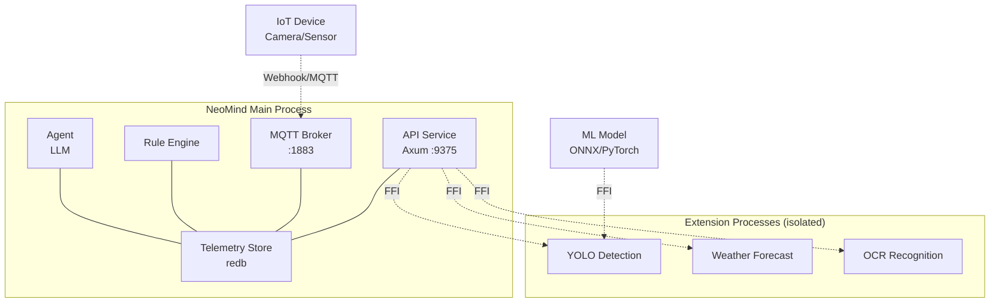
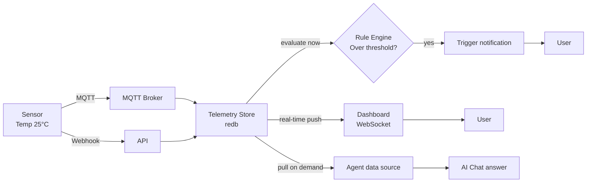
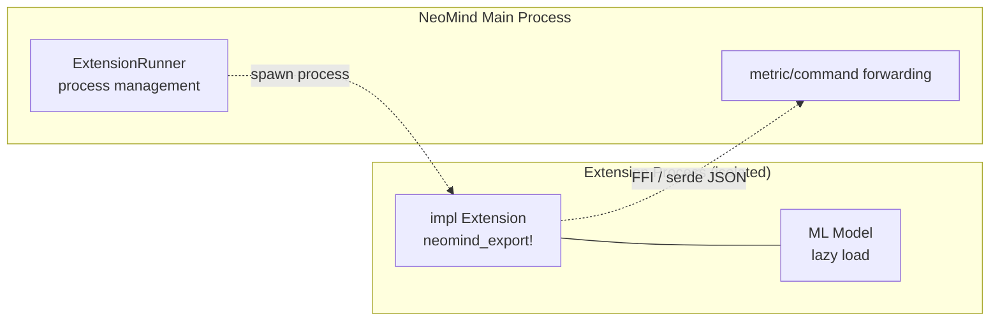
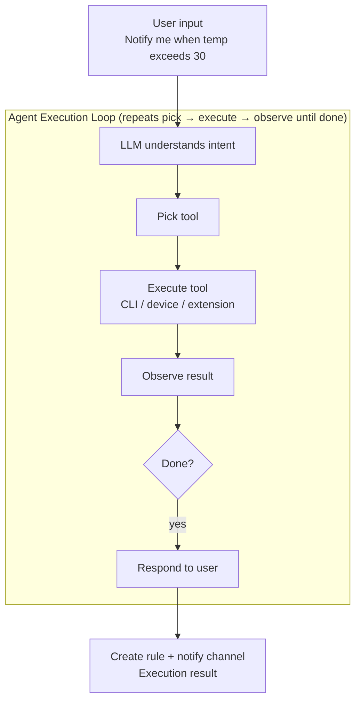

# Core Concepts

This page explains the overall NeoMind system from a user's perspective. If you are going to write code, see the [Developer Architecture doc](../developer-guide/2-architecture.md).

> For term definitions see the [Glossary](./1-glossary.md).

:::tip Reading guide

- **Want a quick overview** → read the four models below (System / Data / Extension / Agent)
- **Want to understand a term** → jump to the [Glossary](./1-glossary.md)
- **Want to get hands-on** → go straight to the [5-Minute Quick Start](../quick-start/1-five-minute-guide.md)
  :::

---

## System Overview

NeoMind is a **self-contained edge AI platform** — all core components are packaged in a single process, ready the moment you start, with no external database or message broker dependencies.



### Four Core Subsystems

| Subsystem | Port | Responsibility | In one sentence |
|-----------|------|----------------|-----------------|
| **API Service** | 9375 | Web UI and REST API entry point | All operations go through here |
| **MQTT Broker** | 1883 | Device communication hub | Built-in, no extra install |
| **Rule Engine** | — | Event-driven automation | JSON defines trigger conditions and actions |
| **Agent** | — | Natural language + tool calls | The system's "brain" |

:::info Shared Storage
All subsystems share the **Telemetry** store (redb); data files land in the `data/` directory. Written once, consumed by many — no need for the dashboard, rules, and agent to each query the database separately.
:::

---

## Data Lifecycle

The full path of a data point from device to dashboard:



### Key Design

:::tip Three design principles

1. **Write once, consume many** — data is written to Telemetry once; dashboard, rule engine, and agent each read it without duplicate storage
2. **Real-time push, no polling** — the dashboard receives updates passively over WebSocket; data reaches the frontend in milliseconds after writing
3. **Immediate evaluation, zero-latency trigger** — the rule engine checks conditions the moment data is written; if met, it fires instantly without depending on scheduled polling
   :::

<details>
<summary>📖 Deep dive: why no polling?</summary>

The traditional approach is for the frontend to request the latest data from the server every few seconds (polling). Problems:

- **High latency** — average latency = polling interval / 2 (e.g. poll every 10s → average 5s delay)
- **Wasted resources** — 90% of requests return the same data (nothing changed)
- **Poor scalability** — 1000 clients × poll every 5s = 200 wasted requests per second

NeoMind replaces polling with **WebSocket**: data is only pushed when it changes, zero wasted requests, millisecond latency.
</details>

---

## Extension Model

Extensions are NeoMind's capability-expansion mechanism — plugins written in Rust that run in a **separate process**.



### Four Design Principles

:::tip Design philosophy

**1. Process Isolation** — an extension crash cannot bring down the main service

YOLO extension panics because a model fails to load? The main service and other extensions are completely unaffected. This is the cornerstone of NeoMind's stability.

**2. Least Privilege** — capabilities are declared at startup; anything undeclared is denied

The weather extension only declares `network`; if it tries to read a file, it is denied outright. Even if exploited, the blast radius is contained.

**3. Lazy Loading** — ML models load on first call, then stay resident

A 12 MB YOLO model doesn't need to hog memory at startup — it loads when first used and then stays resident.

**4. FFI Communication** — cross-process data uses serde JSON serialization

Cross-process data uses the standard JSON format — easy to debug, no custom binary protocol needed.
:::

:::warning Why not WASM or containers?
- **vs WASM** — WASM cannot directly call GPU/ML frameworks, while the core scenario for NeoMind extensions is ML inference
- **vs Docker containers** — containers are slow to start (seconds), heavy on resources, unsuitable for "one main process managing dozens of lightweight extensions"
- **Process + FFI** is the best balance of performance, isolation, and developer experience
:::

> For the full extension development flow see [Extension Development](../developer-guide/7-extension-development.md).

---

## Agent Model

The agent is NeoMind's "brain" — it receives natural language, understands intent, and invokes tools to act.



### Two Trigger Modes

| Trigger | Scenario | Latency | Typical use |
|---------|----------|---------|-------------|
| **Conversational** | User asks in AI Chat | Real-time | "What's the temperature of demo-sensor?" |
| **Scheduled** | Agent runs on a schedule | Per cycle | "Inspect device status every 5 minutes" |

### Tool System

:::info How does the agent act on the world?
The agent operates through `neomind` CLI commands to manage everything — managing devices, creating rules, configuring dashboards, calling extensions. Commands from installed extensions are **automatically exposed to the LLM**.

This means: if you install the YOLO extension, the agent can automatically call YOLO detection; if you install the weather extension, the agent can automatically check the weather. No need to manually configure a tool list.
:::

<details>
<summary>📖 Deep dive: the agent execution loop</summary>

The core of the agent is a **Think-Act-Observe loop**:

```
1. Think  — LLM analyzes the current state, decides what to do next
2. Act    — calls a tool (e.g. `neomind device list`)
3. Observe — reads the tool's result
4. Repeat 1-3 until the task is done
5. Respond — reports the result to the user in natural language
```

This loop runs at most 30 rounds (configurable) to prevent infinite loops. Each round has token limits and timeout protection.

**Example**: user asks "notify me when temperature exceeds 30"
- Think: need to check current temperature → Act: `neomind device get demo-sensor temperature` → Observe: 25.6°C
- Think: need to create a rule → Act: `neomind rule create --json '{"name":"...","condition":{...},"actions":[...]}'` → Observe: rule created
- Think: need to confirm notification channel → Act: check existing channels → Observe: email channel exists
- Respond: "Created a rule: when demo-sensor temperature exceeds 30°C, you'll be notified via email"
</details>

> See [AI Chat](../user-guide/5-ai-chat.md).

---

## Why Not Cloud?

NeoMind's core philosophy is **edge first**:

| Dimension | Cloud solution | NeoMind (edge) | Gap |
|-----------|----------------|----------------|-----|
| **Latency** | 100–500 ms (network round trip) | `<10 ms` (local inference) | 50× |
| **Privacy** | Data leaves the device | Data never leaves the LAN | Fundamental |
| **Offline** | Unavailable without network | 100% offline capable (Ollama) | Fundamental |
| **Cost** | Continuous API billing | One-time hardware cost | Lower long-term |

:::tip Cloud-optional, not cloud-hostile
NeoMind also supports cloud LLMs (OpenAI / Anthropic / GLM). The philosophy is not "reject the cloud" but "**edge by default, cloud on demand**" — what can be done locally doesn't need the network; when you need more power, switch flexibly.
:::

---

## Next Steps

| I want to... | Go to |
|--------------|-------|
| Get hands-on | [5-Minute Quick Start](../quick-start/1-five-minute-guide.md) |
| Look up a term | [Glossary](./1-glossary.md) |
| See the full API | [REST API Reference](../developer-guide/4-rest-api.md) |
| Write an extension | [Extension Development](../developer-guide/7-extension-development.md) |
| See a real example | [Object Detection Solution](../use-cases/1-object-detection.md) |

---

*Last updated: 2026-06-12 · NeoMind v0.8.11*
