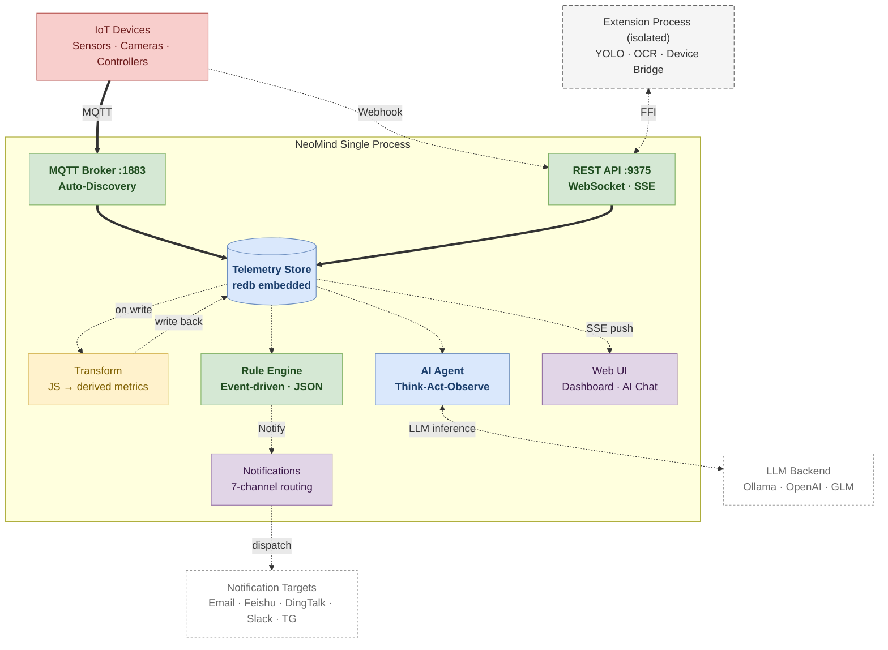
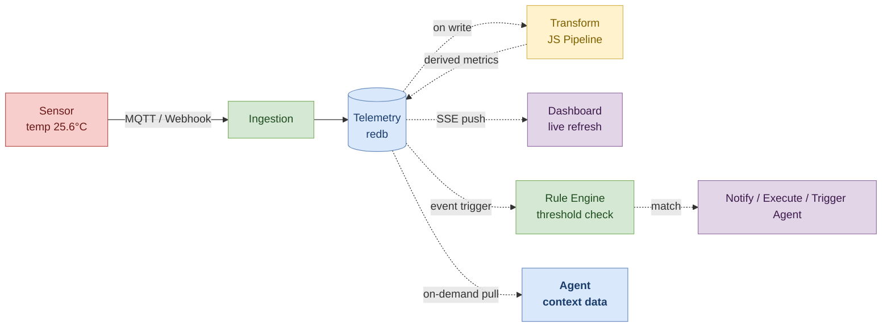
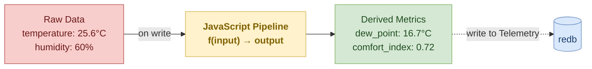
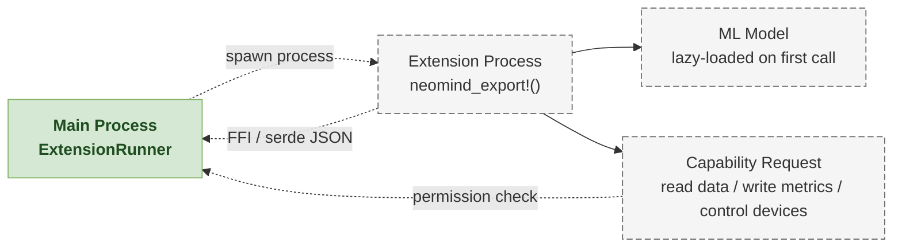
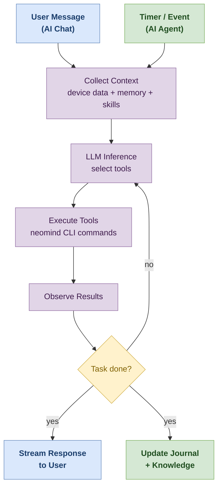

# Core Concepts

This page explains the NeoMind system from a user's perspective. If you're writing code, see the [Developer Architecture doc](../developer-guide/2-architecture.md).

> For term definitions, see the [Glossary](./1-glossary.md).

---

## System Overview

NeoMind is a **self-contained edge AI platform** — API server, MQTT broker, time-series storage, and rule engine are all packed into a single process. Start it up and everything works, with zero external databases or message brokers.



### Core Components

| Component | Port | Implementation | Role |
|-----------|------|---------------|------|
| **REST API** | 9375 | Axum + WebSocket/SSE | Web UI hosting, REST endpoints, real-time push (device data, AI Chat) |
| **MQTT Broker** | 1883 | Embedded rmqtt | Device communication hub, MQTT Auto-Discovery support |
| **Telemetry Store** | — | redb embedded | Time-series data, zero-config persistence, aggregation queries |
| **Transform** | — | JavaScript (Boa engine) pipeline | Raw data → derived metrics (unit conversion, aggregation, custom formulas), 3 scope levels |
| **Rule Engine** | — | Event-driven | Evaluates on data write (zero latency), pure JSON conditions + actions |
| **AI Agent** | — | LLM + CLI toolchain | Natural language understanding, Think-Act-Observe loop, Interval/Cron/Event scheduling |
| **Notifications** | — | 7-channel routing | Webhook · Email · Feishu · DingTalk · WeCom · Slack · Telegram |
| **Extension System** | — | Process isolation + FFI | Vision AI (YOLO/OCR), device bridges (Modbus/OPC-UA), independent process won't crash main service |

:::info Why no external dependencies?
All core components share a single redb storage file — data is written once and consumed by multiple readers. No PostgreSQL, Mosquitto, or Redis needed. The only optional external dependency is an LLM (Ollama locally or a cloud API). Extensions run as separate processes, communicating with the main service via FFI.
:::

---

## Data Lifecycle

The full path of a data point from device to consumer:



### Two Data Ingestion Methods

**MQTT (persistent connection)** — for sensors, controllers, and devices that maintain a long connection:

```
Uplink topic:  device/{device_type}/{device_id}/uplink
Downlink topic: device/{device_type}/{device_id}/downlink
Discovery topic: {discovery_prefix}/announce
```

JSON published to the uplink topic is automatically parsed into telemetry data and stored. Supports [MQTT Auto-Discovery](https://www.home-assistant.io/docs/mqtt/discovery/) — a device publishes a single announce message to auto-register itself.

**Webhook (stateless)** — for one-off pushes or devices that can't run an MQTT client:

```bash
curl -X POST http://localhost:9375/api/devices/<DEVICE_ID>/webhook \
  -H 'Content-Type: application/json' \
  -d '{"temperature": 25.6, "humidity": 60}'
```

First webhook push auto-creates the device if it doesn't exist.

### Data Structure

Each telemetry data point contains:

| Field | Type | Description |
|-------|------|-------------|
| `timestamp` | Unix ms | Data collection time |
| `value` | JSON Value | Number / string / boolean / JSON object |
| `quality` | float (0-1) | Optional data quality flag |
| `metadata` | JSON | Optional additional metadata |

:::tip Extensions are data sources too
Extensions write computation results into Telemetry via the `device_metrics_write` capability — people detected by YOLO, text extracted by OCR, temperature fetched from a weather API all look the same as sensor data. This means extensions can act as **device bridges**, connecting Modbus, OPC-UA, REST APIs, serial sensors, and other external systems, injecting their data as virtual metrics.
:::

### Data Query & Aggregation

Stored data is queried via REST API — dashboards, rules, and agents all use the same query endpoint:

```bash
# Query temperature data from the last 1 hour
curl "http://localhost:9375/api/telemetry?source=device:demo-sensor:temperature&start=-1h&end=now"

# Aggregate by 5-minute time buckets (avg/min/max/sum/count)
curl "http://localhost:9375/api/telemetry/aggregate?source=device:demo-sensor:temperature&interval=5m&function=avg&start=-24h"
```

| Parameter | Description |
|-----------|-------------|
| `source` | DataSourceId (`{type}:{id}:{field}`) |
| `start` / `end` | Time range — Unix ms or relative (`-1h` / `now`) |
| `interval` | Aggregation time bucket (e.g. `5m` / `1h` / `1d`) |
| `function` | Aggregation function (`avg` / `min` / `max` / `sum` / `count`) |
| `limit` | Max data points returned, paginated |

### Data Retention & Cleanup

Telemetry is **retained indefinitely** by default, but auto-cleanup policies can be configured (Settings → System → Retention):

- **By duration**: Auto-delete data older than N days (e.g. retain 90 days)
- **By capacity**: Delete oldest data when storage exceeds a threshold

Policies run periodically by a background task without affecting real-time write performance.

---

## Transform

Raw device data often can't be used directly — you need unit conversions, derived calculations, or noise filtering. NeoMind's **Transform** pipeline automatically executes JavaScript code after data is written to Telemetry, converting raw metrics into more meaningful derived metrics.



### Three Scope Levels

| Scope | Format | Applies to |
|-------|--------|-----------|
| **Global** | `global` | All device data passes through this transform |
| **Device Type** | `device_type:TH_Sensor` | A class of devices (e.g. all temp/humidity sensors) |
| **Device** | `device:dev-001` | A single specific device |

### Typical Use Cases

```javascript
// Example: temperature unit conversion + dew point calculation
// input = { temperature: 25.6, humidity: 60 }
function transform(input) {
  const temp = input.temperature;
  const humidity = input.humidity;
  // Dew point formula
  const dewPoint = temp - (100 - humidity) / 5;
  return {
    temperature_f: temp * 9 / 5 + 32,   // Fahrenheit
    dew_point: Math.round(dewPoint * 10) / 10,
    comfort: humidity < 50 ? "dry" : humidity < 70 ? "comfortable" : "humid"
  };
}
```

Derived metrics are written to Telemetry in `transform:{output_prefix}:{field}` format, consumable by dashboards, rules, and agents just like raw device data.

> See [Automation Rules — Transforms](../user-guide/7-automation-rules.md) for details.

---

## Extension Model

Extensions are NeoMind's capability mechanism — written in Rust, running in **separate processes**, communicating with the main process via FFI.



### Four Design Principles

**1. Process Isolation** — extension crashes don't affect the main service

YOLO extension panics due to a model loading failure? The main service and other extensions are completely unaffected. ExtensionRunner auto-detects crashes and restarts based on policy (consecutive crashes trigger circuit-breaker protection).

**2. Capability Declaration** — declared at startup, denied if undeclared

Extensions declare required Capabilities in their metadata, validated item-by-item at runtime. 14 built-in capabilities cover device read/write, storage queries, event pub/sub, agent/rule triggers, and more:

| Category | Capability | Description |
|----------|-----------|-------------|
| Device Data | `device_metrics_read` / `device_metrics_write` | Read/write device metrics (incl. virtual) |
| Device Control | `device_control` | Send commands to devices |
| Storage | `storage_query` / `telemetry_history` / `metrics_aggregate` | Query stored telemetry |
| Events | `event_publish` / `event_subscribe` | Publish/subscribe system events |
| Triggers | `extension_call` / `agent_trigger` / `rule_trigger` | Call extensions, trigger agents/rules |
| Device Mgmt | `device_register` / `device_unregister` / `device_template_register` | Dynamic device registration |

Also supports `Custom(String)` for custom capabilities.

**3. Lazy Loading** — ML models load on first call, then stay resident

A 50MB YOLOv8n model doesn't occupy memory at startup — it loads into memory on the first detection command, then stays resident for subsequent calls.

**4. Cross-Process Communication** — serde JSON serialization, debug-friendly

No custom binary protocol. All requests and responses between extensions and the main process are JSON — readable in logs, easy to troubleshoot.

:::note Why not WASM or Docker?
- **vs WASM** — WASM can't directly call GPU/ML frameworks, but NeoMind extensions' core use case is vision inference (YOLO, OCR)
- **vs Docker** — containers start slowly (seconds), have high overhead, and aren't suited for "one main process managing dozens of lightweight extensions"
- **Process + FFI** achieves the best balance of performance, isolation, and developer experience
:::

> For the full extension development workflow, see [Extension Development](../developer-guide/7-extension-development.md).

---

## Agent Model

Agents are NeoMind's "brain" — they receive natural language instructions, understand intent, and execute operations through tool calls.



### Two Interaction Modes

NeoMind's AI shares the same Think-Act-Observe loop, but runs in two modes:

| Mode | Trigger | Context Memory | Response | Typical Scenario |
|------|---------|----------------|----------|------------------|
| **AI Chat** | User types a message | Conversation history + MemorySnapshot | Real-time streaming | "Check sensor status" / "Identify objects in this image" |
| **AI Agent** | Timer / Event | Journal + Knowledge Files | Background, silent | "Patrol devices every 5 min" / "Analyze on temperature spike" |

**AI Chat** is interactive — the user asks, the AI calls tools in real time and streams the response, with support for image uploads and multimodal analysis. **AI Agent** is autonomous — triggered on schedule or event, it runs independently in the background and logs experience to its Journal. Both share the same toolset (neomind CLI + extension commands).

### Three Scheduling Modes (AI Agent only)

AI Agents support three scheduling triggers:

| Mode | Trigger | Typical Scenario |
|------|---------|-----------------|
| **Interval** | Fixed interval (e.g. every 5 min) | "Patrol device status periodically" |
| **Cron** | Cron expression (e.g. `0 9 * * 1-5`) | "Generate daily report every weekday at 9 AM" |
| **Event** | Data event (rule match / metric change) | "Analyze immediately when temperature spikes" |

### CLI-First Architecture

Agents operate everything through `neomind` CLI commands — manage devices, create rules, configure dashboards, invoke extensions. CLI commands are dispatched **in-process** (no subprocess overhead), so response latency is minimal.

Installed extension commands are **automatically exposed** to the LLM:

- Install the YOLO extension → the agent can call object detection
- Install the weather extension → the agent can check weather
- Install the OCR extension → the agent can extract text

No manual tool list configuration needed.

### Memory System

Each mode has its own memory system:

| Mode | Memory Structure | Purpose |
|------|-----------------|---------|
| **AI Chat** | Conversation history + MemorySnapshot (`user.md` + `knowledge.md`) | Remembers user preferences and key facts across sessions |
| **AI Agent** | Journal (redb) + Knowledge Files (Markdown) | Accumulates experience across executions: success/failure, learned patterns, device identity, mission, patrol routines |

<details>
<summary>📖 Deep Dive: Execution Loop Details</summary>

The agent core is a **Think-Act-Observe loop**, max 30 rounds (configurable):

```
1. Think  — LLM analyzes current state (data + memory + previous result), decides next step
2. Act    — calls a tool (e.g. `neomind device list`)
3. Observe — reads the tool result
4. Repeat 1-3 until done or round limit reached
5. Respond — reports results in natural language, updates memory
```

**Safety mechanisms**:
- Global timeout: 5 minutes (300s) forced termination
- Tool timeouts: Shell 30s, extensions 300s, HTTP 10s
- Concurrency: 10 global parallel executions, 2 per LLM backend
- Context compaction: compresses history by priority when exceeding window size (system prompt never dropped)

</details>

> See [AI Chat](../user-guide/5-ai-chat.md) and [AI Agent](../user-guide/6-ai-agent.md) for details.

---

## Rules & Notifications

The rule engine evaluates conditions **immediately** when data is written to Telemetry — no polling, zero-latency triggers.

### Rule Structure (Pure JSON)

```json
{
  "name": "High Temperature Alert",
  "condition": {
    "source": "device:demo-sensor:temperature",
    "operator": "GreaterThan",
    "threshold": 30.0
  },
  "actions": [
    { "type": "Notify", "message": "Temperature exceeds 30°C!", "severity": "Critical" },
    { "type": "TriggerAgent", "agent_id": "analyzer" }
  ],
  "trigger": "event",
  "cooldown": 60
}
```

| Condition Type | Description | Example |
|---------------|-------------|---------|
| **Comparison** | Single value comparison | temp `>` 30, status `=` "online" |
| **Range** | Range check | humidity between 40-60 |
| **Logical** | Logical combination | (temp `>` 30) AND (humidity `<` 50) |

### Notification Channel Routing

A rule's `Notify` action creates a message, which the notification system dispatches to configured channels:

| Channel | Configuration |
|---------|--------------|
| **Webhook** | HTTP POST to a URL |
| **Email** | SMTP delivery |
| **Feishu** | Bot Webhook |
| **DingTalk** | Bot Webhook |
| **WeCom** | Bot Webhook |
| **Slack** | Incoming Webhook |
| **Telegram** | Bot API |

:::tip Default: deliver to all
Create a message channel + create a rule with a `Notify` action = automatic delivery. By default, all channels receive the message. To filter (e.g. "only Critical"), configure via Channel Filter.
:::

> See [Automation Rules](../user-guide/7-automation-rules.md) and [Notifications](../user-guide/8-notifications.md) for details.

---

## Data Storage Overview

NeoMind uses an embedded redb database. The data directory defaults to `data/`:

| File | Purpose |
|------|---------|
| `telemetry.redb` | Time-series telemetry for all devices |
| `sessions.redb` | User sessions |
| `devices.redb` / `dashboards.redb` / `rules.redb` / `agents.redb` | Per-domain primary data |
| `messages.redb` | Notification delivery records |
| `memory/` | Agent memory files (Markdown) |
| `skills/` | Skill definitions (YAML + Markdown) |
| `extensions/` | Extension binaries and config |
| `logs/` | Runtime logs |

Data retention is configurable (default: retain indefinitely). Old data is auto-cleaned per policy.

> See [System Requirements — Data Storage](../product-overview/4-system-requirements.md#data-storage) for details.

---

## Edge First

NeoMind's core philosophy is **edge first**:

| Dimension | Cloud Solutions | NeoMind (Edge) |
|-----------|----------------|----------------|
| **Latency** | 100-500ms (network round-trip) | `<10ms` (local inference) |
| **Privacy** | Data leaves the device | Stays on the local network |
| **Offline** | Fails without internet | 100% offline (with Ollama) |
| **Cost** | Ongoing API billing | One-time hardware cost |

:::tip Cloud is optional, not excluded
NeoMind also supports cloud LLMs (OpenAI / Anthropic / GLM / DeepSeek, etc.). The core idea isn't "reject the cloud" — it's "**edge by default, cloud on demand**". Handle what you can locally without network hassle; switch to cloud when you need more power.
:::

---

## Next Steps

| I want to... | Go to |
|-------------|-------|
| Try it hands-on | [5-Minute Quick Start](../quick-start/1-five-minute-guide.md) |
| Look up terms | [Glossary](./1-glossary.md) |
| Configure LLM | [Configure LLM Backend](../user-guide/2-configure-llm.md) |
| Connect devices | [Onboard a Device](../user-guide/3-onboard-device.md) |
| See API docs | [REST API Reference](../developer-guide/4-rest-api.md) |
| Write extensions | [Extension Development](../developer-guide/7-extension-development.md) |
| See real-world examples | [Object Detection Solution](../use-cases/1-object-detection.md) |

---

*Last updated: 2026-06-15*
