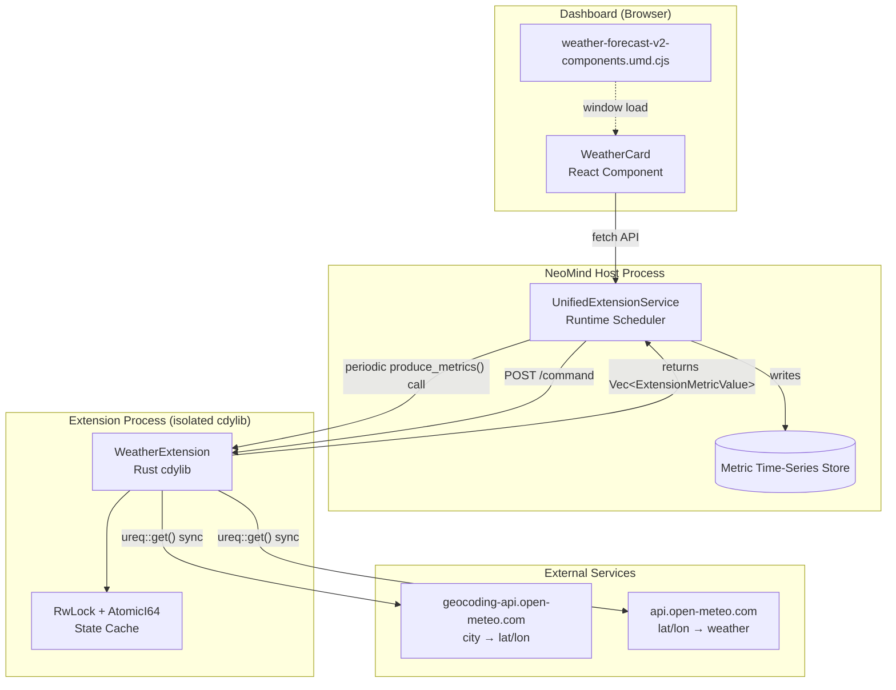
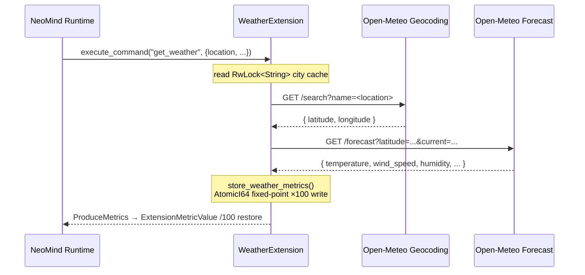

# 1 weather-forecast-v2: Starter Data Extension

## 1 Case Background

**weather-forecast-v2** is the simplest "data-type extension" in the NeoMind ecosystem. It periodically fetches weather data from the [Open-Meteo API](https://open-meteo.com/), writes temperature, humidity, wind speed, and other metrics into the NeoMind metric system.

It also provides a React card component for dashboard display. The entire extension is about 700 lines of Rust + 560 lines of TypeScript, with no AI inference, stream processing, or protocol bridging — making it the shortest path for newcomers to understand "what makes up an extension."

**What problem does it solve?** The NeoMind dashboard needs to display real-time environmental data (temperature, humidity, wind speed), but this data comes from an external HTTP API rather than a local device. weather-forecast-v2 acts as a "data proxy" — pulling external API data into the NeoMind metric system so that dashboard components can consume weather data just like any local device metric.

**Target reader**: Developers who have just finished the [Extension API Reference](../7-extension-development.md) and want to build their first extension. No advanced Rust knowledge required, but you should understand traits, async/await, and the module system.

**Position in the ecosystem**: weather-forecast-v2 is the reference template for "data-type extensions" — it has no hardware dependencies, no AI models, no industrial protocol stacks. Later cases build on this foundation: 2 (yolo-device-inference) adds model loading, 4 (onvif-bridge) adds protocol stack complexity. Master this case's 8 sections and you have the skeleton for all data-type extensions.

**What you'll learn**:

1. How to build extension metadata with the `ExtensionMetadata::new()` builder chain
2. How to produce periodic metrics with `ExtensionMetricValue`
3. Why a sync HTTP client (`ureq`) is chosen over `reqwest` in the dynamic library context
4. How to expose a React component via a Vite UMD bundle for the NeoMind dashboard loader

---

## 2 Architecture Overview

weather-forecast-v2 consists of three parts: a Rust extension core (data fetching + metric production), a React frontend component (card UI), and the NeoMind runtime (loading + scheduling). The diagram below shows the data flow and process boundaries.



### 4 Core Abstractions

| Abstraction | Location | Purpose |
|-------------|----------|---------|
| `Extension` trait | SDK | The interface every extension must implement: `metadata()` / `metrics()` / `commands()` / `execute_command()` / `produce_metrics()` / `configure()` |
| `ExtensionMetricValue` | SDK | A single metric data point = `{ name, value, timestamp }`; `produce_metrics()` returns `Vec<ExtensionMetricValue>` |
| `ExtensionMetadata` builder | SDK | Chain builder: `new(id, name, version).with_description(...).with_config_parameters(...)` |
| `neomind_export!` macro | SDK | Generates C FFI export functions so the host process can load the Rust cdylib via C ABI |

---

## 3 Implementation Walkthrough

### 3.1 Directory Structure

```
extensions/weather-forecast-v2/
├── Cargo.toml          # dependency declarations + crate metadata
├── metadata.json       # extension manifest (auto-generated from Cargo.toml by build script)
├── src/
│   └── lib.rs          # the only Rust source file (~580 lines, including tests)
├── frontend/
│   ├── package.json    # Vite + React 18 + TypeScript
│   ├── vite.config.ts  # UMD bundling config (externalize React)
│   └── src/
│       └── index.tsx   # WeatherCard component (~560 lines)
└── tests/
    └── extension_test.rs
```

The single-file Rust design is intentional — weather-forecast-v2's logic complexity doesn't justify splitting into modules. Later cases (e.g., yolo-device-inference) split out `onnx_utils.rs` / `camera.rs` submodules.

### 3.2 ExtensionMetadata Builder Chain

View full implementation: [`src/lib.rs`](https://github.com/camthink-ai/NeoMind-Extensions/blob/main/extensions/weather-forecast-v2/src/lib.rs#L219-L273) L219-273

```rust
fn metadata(&self) -> &ExtensionMetadata {
    // why static: metadata is read-only, only one instance needed per process
    static META: std::sync::OnceLock<ExtensionMetadata> = std::sync::OnceLock::new();
    META.get_or_init(|| {
        ExtensionMetadata::new(
            "weather-forecast-v2",      // why kebab-case: matches directory name and metadata.json id
            "Weather Forecast V2",
            "2.0.0"
        )
        .with_description("Weather forecast extension for the NeoMind isolated runtime using a sync HTTP client")
        .with_author("NeoMind Team")
        .with_config_parameters(vec![
            ParameterDefinition {
                name: "defaultCity".to_string(),
                display_name: "Default City".to_string(),
                // why options enum: frontend dropdown consumes directly, no separate enum needed
                options: vec!["Beijing", "Shanghai", "New York", "London", "Tokyo"]
                    .into_iter().map(String::from).collect(),
                ..Default::default()
            },
            // ... refreshInterval / unit params omitted, see source L247-270
        ])
    })
}
```

```rust
// lib.rs L219-L273 (trimmed)
fn metadata(&self) -> &ExtensionMetadata {
    static META: std::sync::OnceLock<ExtensionMetadata> = std::sync::OnceLock::new();
    META.get_or_init(|| {
        ExtensionMetadata::new(
            "weather-forecast-v2",
            "Weather Forecast V2",
            "2.0.0"
        )
        .with_description("Weather forecast extension for the NeoMind isolated runtime using a sync HTTP client")
        .with_author("NeoMind Team")
        .with_config_parameters(vec![
            ParameterDefinition {
                name: "defaultCity".to_string(),
                display_name: "Default City".to_string(),
                description: "Default city for weather display".to_string(),
                param_type: MetricDataType::String,
                required: false,
                default_value: Some(ParamMetricValue::String("Beijing".to_string())),
                min: None,
                max: None,
                options: vec![
                    "Beijing".to_string(),
                    "Shanghai".to_string(),
                    "New York".to_string(),
                    "London".to_string(),
                    "Tokyo".to_string(),
                ],
            },
            ParameterDefinition {
                name: "refreshInterval".to_string(),
```

[Source: lib.rs L219-L273](https://github.com/camthink-ai/NeoMind-Extensions/blob/main/extensions/weather-forecast-v2/src/lib.rs#L219-L273)

**Why `OnceLock` instead of `lazy_static!`?** `OnceLock` was added to the Rust standard library in 1.70 and requires no extra dependencies. The metadata is constructed on the first call to `metadata()` and all subsequent calls return the same reference — this matters at the FFI boundary because the host process queries metadata frequently.

### 3.3 Metric Production: AtomicI64 + Fixed-Point Decimals

View full implementation: [`src/lib.rs`](https://github.com/camthink-ai/NeoMind-Extensions/blob/main/extensions/weather-forecast-v2/src/lib.rs#L80-L92) L80-92 (field definitions), [L119-129](https://github.com/camthink-ai/NeoMind-Extensions/blob/main/extensions/weather-forecast-v2/src/lib.rs#L119-L129) (storage), [L466-522](https://github.com/camthink-ai/NeoMind-Extensions/blob/main/extensions/weather-forecast-v2/src/lib.rs#L466-L522) (production)

```rust
pub struct WeatherExtension {
    // why RwLock for city: city name needs read/write (configure writes), but reads far outnumber writes
    default_city: std::sync::RwLock<String>,
    // why AtomicI64 for metrics: values need high-frequency reads (produce_metrics) + writes (store_weather_metrics)
    // why fixed-point ×100: AtomicI64 doesn't support f64, multiply by 100 to preserve two decimal places
    last_temperature_c: AtomicI64,      // actual value = stored / 100.0
    last_humidity_percent: AtomicI64,   // integer, no scaling needed
    request_count: AtomicI64,
    has_data: AtomicBool,               // why flag: before first request has_data=false, produce_metrics only returns request_count
}
```

```rust
// Store: multiply by 100 to convert to fixed-point
fn store_weather_metrics(&self, weather: &WeatherResult) {
    self.last_temperature_c.store(
        (weather.temperature_c * 100.0) as i64, Ordering::SeqCst);
    // ... other fields similar
}

// Produce: divide by 100 to restore float
fn produce_metrics(&self) -> Result<Vec<ExtensionMetricValue>> {
    let mut metrics = Vec::with_capacity(9);
    metrics.push(ExtensionMetricValue {
        name: "temperature_c".to_string(),
        value: ParamMetricValue::Float(
            self.last_temperature_c.load(Ordering::SeqCst) as f64 / 100.0),
        timestamp: now,
    });
    // ... when has_data=false, only return request_count
    Ok(metrics)
}
```

```rust
// lib.rs L80-L92
pub struct WeatherExtension {
    default_city: std::sync::RwLock<String>,
    request_count: AtomicI64,
    last_temperature_c: AtomicI64,
    last_feels_like_c: AtomicI64,
    last_humidity_percent: AtomicI64,
    last_wind_speed_kmph: AtomicI64,
    last_wind_direction_deg: AtomicI64,
    last_cloud_cover_percent: AtomicI64,
    last_pressure_hpa: AtomicI64,
    last_update_ts: AtomicI64,
    has_data: AtomicBool,
}
```

[Source: lib.rs L80-L92](https://github.com/camthink-ai/NeoMind-Extensions/blob/main/extensions/weather-forecast-v2/src/lib.rs#L80-L92)

```rust
// lib.rs L119-L129
fn store_weather_metrics(&self, weather: &WeatherResult) {
    self.last_temperature_c.store((weather.temperature_c * 100.0) as i64, Ordering::SeqCst);
    self.last_feels_like_c.store((weather.feels_like_c * 100.0) as i64, Ordering::SeqCst);
    self.last_humidity_percent.store(weather.humidity_percent as i64, Ordering::SeqCst);
    self.last_wind_speed_kmph.store((weather.wind_speed_kmph * 100.0) as i64, Ordering::SeqCst);
    self.last_wind_direction_deg.store(weather.wind_direction_deg as i64, Ordering::SeqCst);
    self.last_cloud_cover_percent.store(weather.cloud_cover_percent as i64, Ordering::SeqCst);
    self.last_pressure_hpa.store((weather.pressure_hpa * 100.0) as i64, Ordering::SeqCst);
    self.last_update_ts.store(chrono::Utc::now().timestamp_millis(), Ordering::SeqCst);
    self.has_data.store(true, Ordering::SeqCst);
}
```

[Source: lib.rs L119-L129](https://github.com/camthink-ai/NeoMind-Extensions/blob/main/extensions/weather-forecast-v2/src/lib.rs#L119-L129)

```rust
// lib.rs L466-L522 (trimmed)
fn produce_metrics(&self) -> Result<Vec<ExtensionMetricValue>> {
    let now = chrono::Utc::now().timestamp_millis();
    let mut metrics = Vec::with_capacity(9);

    metrics.push(ExtensionMetricValue {
        name: "request_count".to_string(),
        value: ParamMetricValue::Integer(self.request_count.load(Ordering::SeqCst)),
        timestamp: now,
    });

    if self.has_data.load(Ordering::SeqCst) {
        metrics.extend(vec![
            ExtensionMetricValue {
                name: "temperature_c".to_string(),
                value: ParamMetricValue::Float(self.last_temperature_c.load(Ordering::SeqCst) as f64 / 100.0),
                timestamp: now,
            },
            ExtensionMetricValue {
                name: "feels_like_c".to_string(),
                value: ParamMetricValue::Float(self.last_feels_like_c.load(Ordering::SeqCst) as f64 / 100.0),
                timestamp: now,
            },
            ExtensionMetricValue {
                name: "humidity_percent".to_string(),
                value: ParamMetricValue::Integer(self.last_humidity_percent.load(Ordering::SeqCst)),
                timestamp: now,
            },
            ExtensionMetricValue {
                name: "wind_speed_kmph".to_string(),
                value: ParamMetricValue::Float(self.last_wind_speed_kmph.load(Ordering::SeqCst) as f64 / 100.0),
                timestamp: now,
            },
            ExtensionMetricValue {
                name: "wind_direction_deg".to_string(),
```

[Source: lib.rs L466-L522](https://github.com/camthink-ai/NeoMind-Extensions/blob/main/extensions/weather-forecast-v2/src/lib.rs#L466-L522)

**Why not `Mutex<WeatherResult>`?** Because `produce_metrics()` is a synchronous method called periodically at high frequency by the runtime. Using `Mutex` would require acquiring a lock on every read, causing lock contention in high-concurrency metric collection scenarios. `AtomicI64`'s `load` is a lock-free operation with minimal overhead.

### 3.4 HTTP Client: ureq (Sync)

View full implementation: [`src/lib.rs`](https://github.com/camthink-ai/NeoMind-Extensions/blob/main/extensions/weather-forecast-v2/src/lib.rs#L132-L167) L132-167

```rust
fn geocode_sync(&self, city: &str) -> std::result::Result<GeoLocation, String> {
    let encoded_city = urlencoding::encode(city);
    let url = format!(
        "https://geocoding-api.open-meteo.com/v1/search?name={}&count=1&language=en&format=json",
        encoded_city
    );
    // why ureq not reqwest: cdylib cannot start a Tokio runtime internally (conflicts with host)
    let response: serde_json::Value = ureq::get(&url)
        .timeout(std::time::Duration::from_secs(30))
        .call()
        .map_err(|e| format!("HTTP error: {}", e))?
        .into_json()
        .map_err(|e| format!("JSON error: {}", e))?;
    // ...
}
```

```rust
// lib.rs L132-L167 (trimmed)
fn get_weather_sync(&self, city: &str) -> Result<WeatherResult> {
    self.request_count.fetch_add(1, Ordering::SeqCst);

    let location = self.geocode_sync(city)
        .map_err(|e| ExtensionError::ExecutionFailed(e))?;

    let mut weather = self.fetch_weather_sync(&location)
        .map_err(|e| ExtensionError::ExecutionFailed(e))?;

    weather.timestamp = Some(chrono::Utc::now().to_rfc3339());
    self.store_weather_metrics(&weather);

    Ok(weather)
}

fn geocode_sync(&self, city: &str) -> std::result::Result<GeoLocation, String> {
    let encoded_city = urlencoding::encode(city);
    let url = format!(
        "https://geocoding-api.open-meteo.com/v1/search?name={}&count=1&language=en&format=json",
        encoded_city
    );

    let response: serde_json::Value = ureq::get(&url)
        .timeout(std::time::Duration::from_secs(30))
        .call()
```

[Source: lib.rs L132-L167](https://github.com/camthink-ai/NeoMind-Extensions/blob/main/extensions/weather-forecast-v2/src/lib.rs#L132-L167)

`Cargo.toml` line 21 has an explicit comment: `# Use sync HTTP client to avoid Tokio runtime issues in dynamic libraries`. This is the most critical design decision in this case — see 4.1.

### 3.5 Command Flow Sequence: get_weather End-to-End Call Chain

The sequence diagram below shows the complete call chain of the `get_weather` command, from runtime scheduling through metric production, noting where the cache read (RwLock) happens, where the two external HTTP requests fire (Geocoding → Forecast), and where the fixed-point encoding (×100 / ÷100) is applied. This is the smallest unit of behavior a contributor modifying this extension needs to understand — particularly the cache hit/miss branch points and the fixed-point encoding boundary.



### 3.6 Frontend Entrypoint: Vite UMD Bundle

View full implementation: [`frontend/src/index.tsx`](https://github.com/camthink-ai/NeoMind-Extensions/blob/main/extensions/weather-forecast-v2/frontend/src/index.tsx#L425-L565) L425-565

The `WeatherCard` component is exposed via `forwardRef` and Vite builds it into a UMD bundle (`weather-forecast-v2-components.umd.cjs`). The `metadata.json` `frontend` field declares the entrypoint:

```json
{
  "frontend": {
    "components": ["WeatherCard"],
    "entrypoint": "weather-forecast-v2-components.umd.cjs"
  }
}
```

The frontend calls backend commands via `fetch('/api/extensions/weather-forecast-v2/command')` with 3 retries and initialization error detection — this ensures the UI doesn't hard-fail when extension loading is delayed.

---

## 4 Design Trade-offs

### 4.1 Sync HTTP Client (ureq) vs Async (reqwest)

**Decision**: Use `ureq 2.x` (synchronous blocking HTTP client).

**Alternatives rejected**:
- **A. `reqwest` async client** → Rejected because: `reqwest` depends on the Tokio runtime, and NeoMind extensions are loaded dynamically as `.dylib`/`.so`/`.dll` by the host process. Starting a Tokio runtime inside a dynamic library conflicts with the host process's own runtime (the host may already have its own runtime), causing panics or undefined behavior. `Cargo.toml` line 21 documents this explicitly.
- **B. Raw `hyper` + manual thread pool** → Rejected because: Too low-level — HTTP/JSON parsing, connection pooling, and timeout management all need to be hand-written. The maintenance cost far exceeds the benefit. weather-forecast-v2's HTTP volume is minimal (one geocoding + one weather fetch per command), so async concurrency is unnecessary.

**Trade-off cost**: Synchronous calls block the calling thread. `execute_command` is an async method, but the internal `get_weather_sync` is synchronous and blocking — during the call, the task cannot yield control. **This is acceptable** because weather API responses typically complete in &lt;2s, and NeoMind's default command timeout is 30s.

Quantifying the blocking impact: under typical load (1 request / 30s collection cycle), Open-Meteo's 200–500ms response occupies &lt;2% of the extension thread's duty cycle.

Even if multi-city parallel fetches were supported in the future, only a handful of high-concurrency scenarios would benefit from async — and the SDK's current synchronous `execute_command` contract moots that advantage. Once the host invokes `produce_metrics()` synchronously, no HTTP client — however fast — can shorten the overall call chain.

### 4.2 RwLock Wrapping default_city vs Mutex vs AtomicPtr

**Decision**: `default_city: std::sync::RwLock<String>`.

**Alternatives rejected**:
- **A. `Mutex<String>`** → Rejected because: Although `produce_metrics()` doesn't directly read `default_city`, the `refresh` command does. If `configure` is writing while `refresh` is reading, `Mutex` would block the read. `RwLock` allows multiple concurrent reads.
- **B. `Arc<AtomicPtr<str>>`** → Rejected because: Strings are not fixed-size types and cannot be swapped directly with atomic operations. This would require `Box::leak` or similar tricks, introducing unsafe code in violation of [Appendix 7.1](./appendix-standards.md#71-unsafe-rust)'s "avoid unsafe" principle.
- **C. Immutable design (create new `String` each time)** → Rejected because: Would require wrapping the entire `WeatherExtension` in `Arc<Mutex<>>` or `Arc<RwLock<>>`, changing all method signatures — too invasive.

**Trade-off cost**: `RwLock` is slightly slower than `Mutex` on Linux (kernel-level overhead), but under weather-forecast-v2's load (one write every 5 minutes), the difference is negligible. The read/write ratio is roughly N:1 — every `produce_metrics()` call indirectly reads city-derived data (every 30s), while only user-issued `get_weather` commands perform writes. Under default config this is a 30:1 ratio, exactly the regime where `RwLock` beats `Mutex`. If a future "hot city-swap" feature (e.g., auto-switching based on geolocation) introduces high-frequency writes, reconsider switching to a lock-free structure like `ArcSwap<String>`.

### 4.3 Metric Naming: `<quantity>_<unit>` Suffix Convention

**Decision**: All metric names include a unit suffix, e.g., `temperature_c`, `wind_speed_kmph`, `pressure_hpa`.

**Alternatives rejected**:
- **A. No unit: `temperature`, `wind_speed`, `pressure`** → Rejected because: The NeoMind metric system is globally shared, and multiple extensions may produce same-named metrics. If weather-forecast-v2 outputs `temperature` and another extension (e.g., a temperature/humidity sensor) also outputs `temperature`, queries will conflict. The unit suffix makes metric names self-disambiguating.
- **B. Extension prefix: `weather_temperature`** → Rejected because: The NeoMind metric system already has a `device_id` dimension for namespace isolation — repeating the extension name in metric names is redundant. The unit suffix is more informative: users see `temperature_c` and immediately know the unit is Celsius.
- **C. Dot-separated: `temperature.celsius`** → Rejected because: Prometheus-style dots conflict with NeoMind's metric query syntax (where `device.metrics.temperature.celsius` would be parsed as nested field paths). Underscores are safer.

**Trade-off cost**: Metric names are longer (`wind_speed_kmph` vs `wind_speed`), but this is a reasonable trade-off between readability and uniqueness. On extensibility: the `weather_` prefix pattern prevents collisions if a future `weather_alerts` extension also adds `temperature` metrics; the unit suffix (`_celsius`, `_kmh`) lets the rule engine perform unit-aware threshold checks without a lookup table (e.g., `temperature_c > 35` is unambiguously a "35 °C alert"). This convention is also an implicit contract for the dashboard's i18n number formatting — the frontend can pick a ℃/℉ conversion strategy based on the suffix alone.

---

## 5 Tech Stack Breakdown

| Component | Choice | Why Chosen Over Alternatives |
|-----------|--------|------------------------------|
| Rust SDK | `neomind-extension-sdk` (workspace dep) | Official SDK providing `Extension` trait + FFI export macro. Alternative is hand-written FFI, but every extension would duplicate hundreds of lines of boilerplate |
| HTTP client | `ureq 2.x` + `json` feature | Sync, lightweight, no runtime dependency. Alternative `reqwest` pulls in the entire Tokio stack (see 4.1) |
| Async trait | `async-trait 0.1` | SDK's `Extension` trait uses async fns; Rust pre-1.75 requires this crate. Can be removed once native async traits stabilize |
| Datetime | `chrono 0.4` | `Utc::now().timestamp_millis()` for metric timestamps. Alternative `time` crate has a more modern API but poorer ecosystem compatibility |
| Tokio | No direct dependency (SDK may pull it transitively, but this extension uses std::sync, not tokio::sync) | Alternative `parking_lot` exists, but SDK internally depends on `tokio::sync::RwLock` |
| Frontend framework | React 18 + TypeScript 5 | NeoMind dashboard standard stack. peerDependencies declare React ≥18, Host provides the runtime |
| Frontend bundler | Vite 5 (UMD mode) | Fast builds + UMD format compatible with NeoMind loader. Alternative webpack has 3× the configuration complexity |

---

## 6 Standards in Practice

### 6.1 metadata.json Field Mapping

Cross-referencing [Appendix 1](./appendix-standards.md#1-metadatajson--manifestjson-schema), field-by-field inspection of weather-forecast-v2's `metadata.json`:

| Field | Value | Appendix Section | Notes |
|-------|-------|-----------------|-------|
| `id` | `"weather-forecast-v2"` | [1.1](./appendix-standards.md#11-basic-information) | kebab-case, matches directory name |
| `name` | `"weather forecast"` | [1.1](./appendix-standards.md#11-basic-information) | lowercase display name |
| `version` | `"2.7.6"` | [1.1](./appendix-standards.md#11-basic-information) | auto-read from Cargo.toml |
| `type` | `"native"` | [1.2](./appendix-standards.md#12-type-and-category) | Rust cdylib |
| `builds` | 5 targets | [1.3](./appendix-standards.md#13-build-artifacts-extension-only) | see 6.3 |
| `frontend` | `{ components, entrypoint }` | [1.4](./appendix-standards.md#14-frontend-declaration-extension-only) | UMD entrypoint |

### 6.2 Capability Declaration & Reverse Example

weather-forecast-v2's `src/lib.rs` does **not** explicitly call `CapabilityContext::invoke_capability()` — it only returns metric values via `produce_metrics()`, which the runtime writes to the metric store automatically. But if it needed to **directly write device metrics** (e.g., write temperature to a virtual device), it would need to declare the `device_metrics_write` capability.

**Reverse example**: If weather-forecast-v2 wanted to write virtual device metrics but forgot to declare `device_metrics_write` in metadata:

```rust
// WRONG: calling capability without declaring it
ctx.invoke_capability("device_metrics_write", &json!({
    "device_id": "weather-station-1",
    "metric": "temperature",
    "value": 25.5
})).await?;
// Consequence: runtime panics (not graceful degradation), extension process crashes
// See Appendix 7.2 Capability Explicit Declaration
```

The correct approach is to declare required capabilities in `metadata.json` (weather-forecast-v2 doesn't need any, so this field is absent).

### 6.3 Version Triplet Consistency

Verify weather-forecast-v2's version is consistent across all locations:

| Location | Value | Consistent? |
|----------|-------|-------------|
| `Cargo.toml` → `version` | `"2.7.6"` | Baseline |
| `metadata.json` → `version` | `"2.7.6"` | Yes (build script auto-syncs) |
| `metadata.json` → `builds` URLs | `v2.7.6` | Yes |

Note: `src/lib.rs` passes `"2.0.0"` to `ExtensionMetadata::new()` — this is the **runtime API version** (SDK ABI version), distinct from the release version `2.7.6`. This is by design, not a bug.

### 6.4 Cross-Platform Builds

The `metadata.json` `builds` field lists 5 targets covering the complete matrix from [Appendix 4](./appendix-standards.md#4-cross-platform-build-target-matrix):

```json
"builds": {
    "darwin-aarch64":  { "...weather-forecast-v2-2.7.6-darwin_aarch64.nep" },
    "darwin-x86_64":   { "...weather-forecast-v2-2.7.6-darwin_x86_64.nep" },
    "linux-x86_64":    { "...weather-forecast-v2-2.7.6-linux_amd64.nep" },
    "linux-aarch64":   { "...weather-forecast-v2-2.7.6-linux_arm64.nep" },
    "windows-x86_64":  { "...weather-forecast-v2-2.7.6-windows_amd64.nep" }
}
```

weather-forecast-v2 is pure Rust + HTTP with no C dependencies, so all 5 targets can be built directly with `cargo build`. Compared to yolo-device-inference (which needs ONNX Runtime C library), cross-compilation difficulty is much lower.

---

## 7 Pitfalls & Best Practices

### 7.1 Engineering Evolution Story: From Inline semver to crates.io SDK Isolation

**Source commit**: [`f1ea628`](https://github.com/camthink-ai/NeoMind-Extensions/commit/f1ea628) — `refactor: use crates.io SDK for ABI isolation`

**Symptom**: Early versions of weather-forecast-v2 used `semver::Version::parse("2.0.0").unwrap()` to parse version strings. When the SDK internally changed its type from `semver::Version` to `String`, all extensions' `.unwrap()` calls panicked on non-semver-formatted version strings.

**Root cause**: Extensions depended directly on the SDK's git repository (`neomind-extension-sdk = { git = "..." }`), so any SDK update required all extensions to recompile in sync. SDK internal type changes (like `Version` → `String`) were inevitable, but git dependencies have no version isolation — one change breaks everything.

**Fix**: Switched to the crates.io-published SDK version (`neomind-extension-sdk = "0.6"`), pinning the version number. Changed `Version::parse("2.0.0").unwrap()` to directly passing `"2.0.0"` as a string. Added a `test_metadata_json_matches_runtime_metadata` test that uses `include_str!("../metadata.json")` and is **intended** to catch metadata drift between Cargo.toml and metadata.json at compile time; however, the test currently asserts a `repository` field that is not present in `metadata.json` — a known source-code drift that readers should be aware of when citing it.

**Lesson**: Extension SDKs must be published via crates.io, not depend on git. Every breaking change must bump the major version. Extensions should pin specific versions (`"0.6"` not `"*"`) to avoid being broken by unexpected SDK updates.

### 7.2 Best Practices Checklist

1. **Always wrap mutable config in `RwLock`, not `Mutex`**
   weather-forecast-v2 uses `RwLock<String>` for `default_city` rather than `Mutex<String>`. Reason: both `produce_metrics()` and `execute_command("refresh")` read the city name, while `configure()` only writes on config changes. `RwLock` allows concurrent reads; `Mutex` serializes all access.

2. **Fixed-point decimal storage (×100 + AtomicI64) beats `Mutex<f64>`**
   `AtomicI64` doesn't support `f64`, but temperature needs two decimal places of precision (25.55°C). Multiply by 100 and store as integer (2555); divide by 100 on read to restore. This is 10× faster than `Mutex<f64>` and requires no lock. The trade-off is precision limited to two decimal places — sufficient for weather data.

3. **Metric production must handle the "no data" state**
   `produce_metrics()` returns only `request_count` when `has_data == false`, not temperature metrics. If this state were ignored, the first startup (before any `get_weather` call) would return all-zero temperature values, misleading the dashboard into showing 0°C.

4. **Frontend fetch must include retries and initialization detection**
   The `fetchWeather` function in `frontend/src/index.tsx` implements 3 retries with exponential backoff (500ms × (i+1)), and detects initialization errors like `Invalid response` / `NotRunning` / `INTERNAL_ERROR`. Extension loading is asynchronous, and the extension may not be ready when the UI first renders.

---

## 8 Further Reading

- [Appendix: Engineering Standards](./appendix-standards.md) — Complete reference for metadata schema, capabilities, version consistency, and build matrix
- [Overview: All Case Studies](./0-overview.md) — Index of 7 case studies and 4 reading paths
- [6 metric_card Component Case](./6-metric-card-component.md) — Next starter case: dashboard component template
- [Extension Development API](../7-extension-development.md) — API docs for `Extension` trait, macros, and capabilities
- [Source Code](https://github.com/camthink-ai/NeoMind-Extensions/tree/main/extensions/weather-forecast-v2) — Full source on GitHub

---

*Source repo version: v2.7.6 | SDK: 0.6 | Last audit: 2026-06-22*
