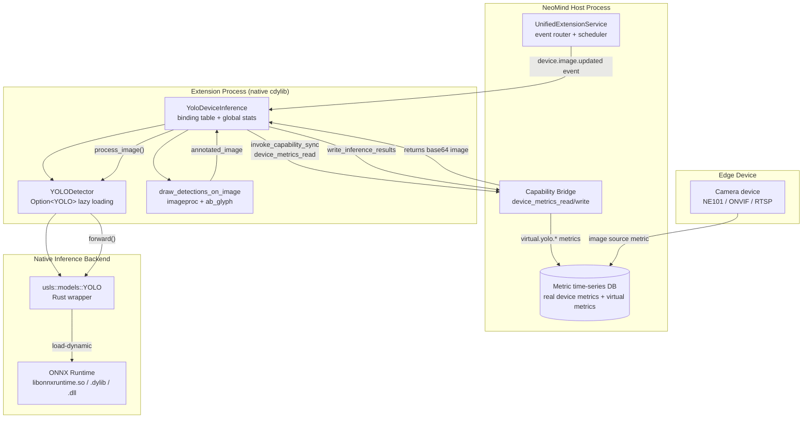

# #2 yolo-device-inference: AI Inference Extension

## §1 Case Background

**yolo-device-inference** is the first "AI inference extension" in the NeoMind ecosystem. It deploys an Ultralytics YOLOv8 object detection model to edge nodes, automatically consumes bound device image metric streams (snapshot / image / frame), writes detection boxes, classes, and confidence back to the device as virtual metrics, and optionally produces annotated JPEG thumbnails for dashboard display. The entire extension is about 1950 lines of Rust (single file `src/lib.rs`), contains no Python runtime, and serves as the reference for "pure Rust end-to-end AI inference."

**What problem does it solve?** Camera devices on the NeoMind dashboard (e.g., NE101) only produce raw image frames (base64 / JPEG). To let the frontend "see detection results" instead of "see raw video," a resident inference service is needed on the device side that can: (1) subscribe to device image update events, (2) spin up ONNX Runtime for a YOLO forward pass when an event fires, (3) write structured results (boxes, classes, confidence) back as virtual metrics, (4) simultaneously write the visualization (annotated JPEG) as another metric for direct `` rendering. yolo-device-inference is the "middleware" of this data chain.

**Difference from yolo-video-v2**: yolo-video-v2 receives user-pushed video streams (base64 frame sequences), suited for "manual trigger analysis" scenarios; yolo-device-inference subscribes to image update events of **bound devices** via the NeoMind capability system, operating in "always-on automatic" mode — once `bind_device` completes, the extension runs inference on every device image update without frontend polling. This is the canonical pattern for edge AI deployment. Case #3 in this series covers the streaming variant yolo-video-v2.

**Target reader**: AI engineers preparing to deploy trained ONNX models to NeoMind edge nodes; platform developers wanting to understand how extensions access device data through the capability system. Requires intermediate Rust proficiency (async, traits, `cfg` conditional compilation) and basic familiarity with ONNX Runtime's dynamic library loading mechanism.

**What you'll learn**: (1) Model lifecycle management — why lazy loading matters, how `YOLODetector` combines `Option<YOLO>` + a `load_attempted` flag into "load-once" semantics; (2) Cross-platform ONNX Runtime dylib governance — `ORT_DYLIB_PATH`, versioned symlinks, and the trap of macOS `DYLD_LIBRARY_PATH` being ignored by `dlopen` when set via runtime `set_var`; (3) Capability-based device frame acquisition — reading device images and writing virtual metrics through the `device_metrics_read` / `device_metrics_write` sync capability bridge, and why `block_in_place` is mandatory under a multi-thread runtime; (4) Detection-result-to-metric data shape mapping — why `BoundingBox` chose `{x, y, width, height}` over `{xmin, ymin, xmax, ymax}`.

---

## §2 Architecture Overview

yolo-device-inference consists of four layers: NeoMind Runtime (event routing), Extension (YOLODetector + binding state), ONNX Runtime (native inference backend), and Device Capability Bridge (frame acquisition / metric writeback). The diagram below shows data flow and the key state machine.



### Model Lifecycle State Machine

`YOLODetector` internally maintains an implicit four-state machine encoded by two fields: `Option<YOLO>` + `load_attempted: bool`.

| State | `model` | `load_attempted` | Meaning |
|------|---------|-------------------|---------|
| `NotLoaded` | `None` | `false` | Extension constructed, model not yet attempted (initial state before first inference) |
| `Loading` | — | — | `ensure_loaded()` executing (transient, protected by `Mutex`) |
| `Ready` | `Some` | `true` | Model loaded successfully, accepting inference requests |
| `Failed` | `None` | `true` | Load attempted but failed; `load_error` records cause; subsequent inferences error out |

**Why two fields instead of an `enum`?** Because `model: Option<YOLO>` must hold the actual model handle for inference, while `load_attempted` is an independent "has been attempted" semantic gate. Looking only at `model.is_none()` cannot distinguish "never loaded" from "reset after failure." The two-field combination is simple and borrow-checker friendly.

### Metric Output Shapes

After detection, the extension produces four virtual metrics (prefixed `virtual.yolo.`):

| Metric name | Data type | Example value | Purpose |
|--------|----------|--------|------|
| `virtual.yolo.detections` | Integer | `3` | Total detected objects, for dashboard counters |
| `virtual.yolo.inference_time_ms` | Integer | `42` | Single inference elapsed time, for performance monitoring |
| `virtual.yolo.labels` | String (JSON array) | `["person","car","dog"]` | Detected class list |
| `virtual.yolo.annotated_image` | String (data URI) | `data:image/jpeg;base64,...` | Annotated image for direct `` rendering |

Why "flat metrics + data URI" instead of "structured JSON passthrough"? Because the NeoMind metric system has time-series database semantics — each metric is a timestamp + scalar value, and the frontend queries by metric name. Splitting detection results into four independent metrics lets the dashboard consume selectively (count only vs. annotated image) and remains compatible with existing time-series queries and alerting rules.

---

## §3 Implementation Walkthrough

This section walks through `src/lib.rs` in physical order. All code snippets include GitHub deep links. The source file is 1945 lines — one of the longest single-file extensions in this series.

### §3.1 Platform Conditional Compilation & Hardware Detection

The extension gates all AI-related code behind `cfg(not(target_arch = "wasm32"))`, making it a no-op stub under WASM. This is the standard NeoMind pattern: let the same crate compile in a WASM sandbox (for metadata / command discovery) but defer heavy computation to native.

See `auto_device()` and `with_device_fallback()`: [`src/lib.rs`](https://github.com/camthink-ai/NeoMind-Extensions/blob/main/extensions/yolo-device-inference/src/lib.rs#L37-L68) L37-68

```rust
// why cfg(macos): prefer CoreML on macOS to avoid ONNX Runtime GPU backend quirks
#[cfg(target_os = "macos")]
{ Device::CoreMl }
#[cfg(all(not(target_os = "macos"), target_os = "linux"))]
{ Device::Cuda(0) }  // why Cuda(0): default card 0, multi-GPU left to upper-layer config

// why fallback: CoreML/CUDA init may fail due to missing drivers, fall back to CPU
fn with_device_fallback<M, F>(try_build: F) -> std::result::Result<M, String> {
    let device = auto_device();
    match try_build(device) {
        Ok(model) => Ok(model),
        Err(e) if !matches!(device, Device::Cpu(_)) => try_build(Device::Cpu(0)),
        Err(e) => Err(e),
    }
}
```

`with_device_fallback` is a higher-order function — it takes `Fn(Device) -> Result`, tries the auto-detected device first, and falls back to CPU on failure. This lets a single call site (`YOLO::new(cfg)`) gain "hardware adaptivity" automatically, with no platform branches at the call site.

### §3.2 Data Structures: Detection / BoundingBox / InferenceResult

These three structs form the data contract the extension exposes externally; the frontend React component and downstream virtual metric writes depend on their field names.

See full definitions: [`src/lib.rs`](https://github.com/camthink-ai/NeoMind-Extensions/blob/main/extensions/yolo-device-inference/src/lib.rs#L93-L122) L93-122

```rust
pub struct BoundingBox {
    pub x: f32,        // why top-left x: matches COCO / imageproc::Rect, no transform when drawing
    pub y: f32,
    pub width: f32,
    pub height: f32,
}

pub struct Detection {
    pub label: String,          // why String: COCO class name stored directly, frontend needs no lookup table
    pub confidence: f32,
    pub bbox: BoundingBox,
    pub class_id: Option<usize>,  // why Option: accommodates custom models without class IDs
}
```

**Why `{x, y, width, height}` over `{xmin, ymin, xmax, ymax}`?** Three reasons: (1) `imageproc::rect::Rect::at(x,y).of_size(w,h)` uses top-left + size semantics, so drawing needs zero conversion; (2) frontend CSS `left/top/width/height` matches this exactly, so React components can use `style={bbox}` directly; (3) YOLO native output is `cx, cy, w, h` (center + size), which converts to `x, y, w, h` with just `x = cx - w/2` — fewer ops than converting to `xmax/ymax`. `usls` returns `hbbs` in `xmin/ymin/xmax/ymax` form, and the extension performs an explicit conversion at L832-L837.

### §3.3 Lazy-Loading Model Wrapper (Core Engineering Highlight)

This is the most critical engineering pattern in this case. `YOLODetector` decouples "model loading" from "extension construction" — construction only records parameters; actual ONNX Runtime initialization is deferred to first inference.

See full `YOLODetector` definition: [`src/lib.rs`](https://github.com/camthink-ai/NeoMind-Extensions/blob/main/extensions/yolo-device-inference/src/lib.rs#L428-L550) L428-550

```rust
struct YOLODetector {
    model: Option<YOLO>,       // why Option: None before load, Some after; state machine core
    load_error: Option<String>,
    conf: f32,
    version: String,
    scale: String,
    load_attempted: bool,      // why independent flag: distinguishes "never loaded" from "None after failure"
}

impl YOLODetector {
    fn new(conf: f32, _iou: f32, version: &str, scale: &str) -> Self {
        Self { model: None, load_error: None, conf,
               version: version.to_string(), scale: scale.to_string(),
               load_attempted: false }  // why not load here: construction != loading
    }

    fn ensure_loaded(&mut self) {
        if self.load_attempted { return; }  // why idempotent: a no-op after first call
        self.load_attempted = true;
        setup_native_lib_paths();  // why deferred to here: dylib path may not be ready at extension load
        match Self::try_load_model(self.conf, &self.version, &self.scale) {
            Ok(m) => self.model = Some(m),
            Err(e) => self.load_error = Some(e),
        }
    }
}
```

**Why lazy loading over preloading?** ONNX Runtime initialization includes: (1) `dlopen("libonnxruntime.so")`, (2) parsing the ONNX model graph, (3) allocating the inference session memory pool (typically 100-300MB). If the extension loaded the model in `YoloDeviceInference::new()`, the NeoMind host process would stall for several seconds during extension loading, and model memory would be occupied during the "extension loaded but no device bound yet" idle window — unacceptable on memory-constrained edge devices (e.g., Raspberry Pi 4GB). Lazy loading defers the cost to "the moment inference is actually needed," keeping extension loading lightweight.

**Why not `OnceLock<YOLO>`?** This case's `YOLODetector` does not use `std::sync::OnceLock`, instead managing state manually via `Option<YOLO> + bool`. The reason is that `OnceLock` requires the inner value to be `Send + Sync` and immutable after initialization — but `YOLO::forward(&mut self)` requires a mutable reference, and the extension supports `reload_model()` (L638-L667) for runtime model replacement. The `Mutex<YOLODetector>` + `Option<YOLO>` combination is more flexible, allowing "reset + reload" semantics.

### §3.4 ONNX Runtime Dynamic Library Path Governance (Cross-Platform Pain Point)

This is the second core engineering challenge, corresponding to three consecutive fix commits in the git log (`73f5943` / `61c4bdf` / `1fe9d3b`). Root cause: the `ort` crate's `load-dynamic` feature does not bind the library path; it relies on the OS dynamic loader — and the three platforms have entirely different lookup mechanisms.

See `setup_native_lib_paths()` implementation: [`src/lib.rs`](https://github.com/camthink-ai/NeoMind-Extensions/blob/main/extensions/yolo-device-inference/src/lib.rs#L298-L422) L298-422

```rust
fn setup_native_lib_paths() {
    // why platform-specific env vars: macOS=DYLD_LIBRARY_PATH, Linux=LD_LIBRARY_PATH, Windows=PATH
    let lib_env = if cfg!(target_os = "macos") { "DYLD_LIBRARY_PATH" }
        else if cfg!(target_os = "windows") { "PATH" } else { "LD_LIBRARY_PATH" };

    // why scan binaries/<platform>/: nep package dylibs may carry version suffixes after extraction
    if let Ok(files) = std::fs::read_dir(&path) {
        for file in files.flatten() {
            let name = file.file_name();
            // why create symlinks: libonnxruntime.so.1.19.2 -> libonnxruntime.so
            // Linux dlopen looks for .so (unversioned) by default, not .so.N
            let unversioned = if cfg!(target_os = "linux") {
                name.strip_suffix(".so.N")  // simplified; see L347-355 for full logic
            } ...
        }
    }

    // why also set ORT_DYLIB_PATH: macOS DYLD_LIBRARY_PATH set via runtime set_var
    // is ignored by dlopen (SIP restriction); must use ort crate's dedicated env var
    if std::env::var("ORT_DYLIB_PATH").is_err() {
        for dir in &paths {
            let ort_path = Path::new(dir).join(ort_filename);
            if ort_path.exists() {
                std::env::set_var("ORT_DYLIB_PATH", &ort_path);  // why absolute path
                break;
            }
        }
    }
}
```

**Three-platform library naming differences**:
- **Linux**: `libonnxruntime.so.1.19.2` (full version). `dlopen("libonnxruntime.so")` won't find it by default — a symlink `libonnxruntime.so -> libonnxruntime.so.1.19.2` is required.
- **macOS**: `libonnxruntime.1.19.2.dylib` (version before `.dylib`). Same symlink need to `libonnxruntime.dylib`. Worse, macOS SIP makes runtime `set_var("DYLD_LIBRARY_PATH")` ineffective for subsequent `dlopen` — so `ORT_DYLIB_PATH` must be set explicitly, letting the `ort` crate load via absolute path.
- **Windows**: `onnxruntime.dll` (no version suffix). No symlink needed, but the DLL directory must be added to `PATH`.

This logic was iterated across three commits — `73f5943` (Linux symlinks), `61c4bdf` (`ORT_DYLIB_PATH`), `1fe9d3b` (Windows `cfg(unix)` guard) — a textbook case of "cross-platform library loading requires incremental bug-finding" (see §7).

### §3.5 Capability-Based Device Frame Acquisition (Sync Bridge)

The extension reads/writes device metrics through `invoke_capability_sync()`, calling the NeoMind capability system. This method is the key adapter for "synchronous invocation within an async runtime."

See full implementation: [`src/lib.rs`](https://github.com/camthink-ai/NeoMind-Extensions/blob/main/extensions/yolo-device-inference/src/lib.rs#L607-L634) L607-634

```rust
fn invoke_capability_sync(&self, capability_name: &str, params: &serde_json::Value) -> serde_json::Value {
    tokio::task::block_in_place(|| {
        // why block_in_place: capability bridge is a sync blocking call; calling .send() directly
        // in an async context would stall the runtime. Requires multi_thread flavor (else panic).
        let capability_context = CapabilityContext::default();
        capability_context.invoke_capability(capability_name, params)
    })
}
```

**Why sync capability APIs over async?** Commit `529dec5` explicitly records this decision: "Use sync capability APIs and fix image format." The root cause is that the early async capability API had a runtime context loss problem in `cdylib` loading scenarios — when the extension's sync function is called by the host via C ABI, it is not necessarily inside a tokio runtime context, and `.await` would panic. The sync API + `block_in_place` is an explicit, predictable trade-off: it assumes the current thread is on a multi_thread runtime (guaranteed by the NeoMind extension runner), then "downgrades" the current worker thread to a blockable thread via `block_in_place`, safely invoking synchronous IPC.

**Two-step device frame flow** (see `validate_device` L692-L709 and `write_inference_results` L1101-L1196):

1. **Read**: `invoke_capability_sync("device_metrics_read", { device_id })` → returns all current device metrics; the extension extracts the `image_metric` field (typically a base64 JPEG or data URI).
2. **Write**: `invoke_capability_sync("device_metrics_write", { device_id, metric: "virtual.yolo.detections", value: 3, timestamp })` → writes detection results back as virtual metrics.

**Virtual metric naming convention** (see L1120-L1124 comment): must start with `transform.` / `virtual.` / `computed.` / `derived.` / `aggregated.`, otherwise the capability bridge rejects the write. This is NeoMind's namespace isolation between "real sensor metrics" and "extension-computed metrics."

### §3.6 Image Annotation Drawing

Detection result visualization is handled by `draw_detections_on_image()` (L192-L292), combining the `image`, `imageproc`, and `ab_glyph` crates. This function was unified in commit `f8478a8` as "the shared annotation style across all inference extensions" — label boxes with filled backgrounds and white text.

See the font cache pattern: [`src/lib.rs`](https://github.com/camthink-ai/NeoMind-Extensions/blob/main/extensions/yolo-device-inference/src/lib.rs#L201-L205) L201-205

```rust
// why OnceLock: font file is include_bytes!-compiled into the binary, but FontRef parsing has overhead
// OnceLock ensures it's parsed once process-wide; subsequent draw_text_mut reuses it
static FONT_RESULT: std::sync::OnceLock<std::result::Result<FontRef<'static>, _>> =
    std::sync::OnceLock::new();
let font = FONT_RESULT.get_or_init(|| FontRef::try_from_slice(include_bytes!("../fonts/NotoSans-Regular.ttf")));
```

Note the font file is compiled into the cdylib via `include_bytes!` — this adds about 300KB to the `.nep` package but eliminates runtime file path dependencies. `NotoSans-Regular.ttf` was chosen to support CJK characters (Chinese labels are common in edge device scenarios).

### §3.7 Detection Result to Metric Mapping

`write_inference_results()` (L1101-L1196) splits one `InferenceResult` into four virtual metrics. Each metric calls `device_metrics_write` independently — why not write all in one call? Because the capability bridge API signature is `{ device_id, metric, value, timestamp }`, writing one metric at a time. Batch writes require the extension to loop.

See the annotated image write (the most unusual one): [`src/lib.rs`](https://github.com/camthink-ai/NeoMind-Extensions/blob/main/extensions/yolo-device-inference/src/lib.rs#L1175-L1194) L1175-1194

```rust
if let Some(img) = &result.annotated_image_base64 {
    let data_uri = format!("data:image/jpeg;base64,{}", img);  // why data URI: frontend  uses directly
    let params = json!({
        "device_id": device_id,
        "metric": "virtual.yolo.annotated_image",
        "value": data_uri,
        "timestamp": result.timestamp,
    });
    self.invoke_capability_sync("device_metrics_write", &params);
}
```

### §3.8 Command Sequence Diagram (Lazy-Load Branch)

The diagram below shows the full sequence after a `device.image.updated` event fires, highlighting the lazy-load branch (executed only on first inference).

```mermaid
sequenceDiagram
    participant RT as NeoMind Runtime
    participant EXT as YoloDeviceInference
    participant DET as YOLODetector
    participant ORT as ONNX Runtime
    participant CAP as Capability Bridge

    RT->>EXT: handle_event(device.image.updated)
    EXT->>CAP: invoke_capability_sync("device_metrics_read")
    CAP-->>EXT: { image: "data:image/jpeg;base64,..." }

    alt load_attempted == false (first inference)
        EXT->>DET: ensure_loaded()
        DET->>DET: setup_native_lib_paths()
        Note over DET: Set ORT_DYLIB_PATH<br/>Create versioned symlinks
        DET->>ORT: YOLO::new(cfg) [dlopen libonnxruntime]
        ORT-->>DET: Model handle
        DET-->>EXT: model = Some(...)
    else load_attempted == true (subsequent inference)
        Note over DET: ensure_loaded() returns immediately (no-op)
    end

    EXT->>DET: model.forward(&[image_tensor])
    DET->>ORT: ort::session.run()
    ORT-->>DET: bbox + class + confidence
    DET-->>EXT: InferenceResult { detections, ... }

    EXT->>EXT: draw_detections_on_image() [optional]
    EXT->>CAP: write virtual.yolo.detections
    EXT->>CAP: write virtual.yolo.inference_time_ms
    EXT->>CAP: write virtual.yolo.labels
    EXT->>CAP: write virtual.yolo.annotated_image
    CAP-->>RT: metrics written to time-series DB
```

---

## §4 Design Trade-offs

This case made several key decisions during engineering evolution; each considered at least 2-3 alternatives. The following analyzes each in turn.

### Decision 1: Lazy Loading vs Preloading vs Unload-After-Each-Inference

| Option | Startup latency | Memory footprint | First-inference latency | Complexity |
|------|----------|----------|--------------|--------|
| **Lazy loading (chosen)** | Low (~10ms) | On-demand (persistent after first inference) | High (first includes load) | Medium |
| Preloading (load in `new()`) | High (2-5 sec) | Always occupied | Low | Low |
| Unload after each inference | Low | Minimal (zero between inferences) | High every time | High (must handle unload races) |

**Why lazy loading**: Edge devices are memory-constrained (NE101 typically 2-4GB), and users may have loaded the extension without binding any device. Preloading makes "load = occupy 300MB" an unacceptable cost. Per-inference unloading, while memory-optimal, means ONNX Runtime's `dlopen` + model parsing takes 3-8 seconds on Raspberry Pi — paying that cost per frame is unrealistic. Lazy loading is the balance of "fast startup + stable after first inference."

### Decision 2: Bundled ONNX Runtime vs System-Installed

| Option | User install cost | Version consistency | Package size | Cross-platform complexity |
|------|----------|----------|----------|----------|
| **Bundled (chosen)** | Zero (extract and run) | Fully controlled | Large (+150MB/platform) | High (dylib naming) |
| System-installed | High (manual ORT install) | Uncontrolled | Small | Low |
| Static link at compile time | Zero | Fully controlled | Largest | Extreme (ORT doesn't officially support static linking) |

**Why bundled**: Commit `e8a8f28` explicitly introduced "bundled ONNX Runtime support." Edge device users are typically not developers; requiring `apt install libonnxruntime` would dramatically raise the deployment barrier. The cost of bundling is larger `.nep` packages (~150MB per platform) and the dylib path governance complexity described in §3.4 — but this is a one-time engineering cost traded for a "zero-dependency deployment" user experience.

### Decision 3: Sync Capability API + block_in_place vs Async Capability API

| Option | Predictability | Performance | Runtime compatibility |
|------|----------|----------|----------|
| **Sync + block_in_place (chosen)** | High (no await state machine) | Medium (occupies one worker thread) | Requires multi_thread runtime |
| Async `.await` | Low (depends on runtime context) | High (can yield thread) | Context may be lost in cdylib scenario |

**Why sync**: Commit `529dec5` records the switch from async back to sync. The core issue is that when a `cdylib` is invoked via C ABI by the host, the call stack may not carry a tokio runtime context — and `.await` panics in that case. The sync API + `block_in_place` assumes the current thread is on a multi_thread runtime (guaranteed by NeoMind), making behavior predictable. The performance cost is "one worker thread blocked on IPC," but capability bridge IPC latency is typically < 1ms, acceptable.

### Decision 4: BoundingBox Struct Shape

| Option | imageproc compat | CSS compat | Distance from YOLO native output |
|------|----------|----------|----------|
| **`{x, y, width, height}` (chosen)** | Zero conversion | Zero conversion | 1 subtraction (`x = cx - w/2`) |
| `{xmin, ymin, xmax, ymax}` | Conversion needed | Conversion needed | Zero (usls returns directly) |
| `{cx, cy, w, h}` | Conversion needed | Conversion needed | Zero (YOLO native) |

Reasons for `{x, y, width, height}` are covered in the three points in §3.2.

---

## §5 Tech Stack Breakdown

| Component | Choice | Rationale |
|------|------|------|
| YOLO model wrapper | `usls 0.1.11` (features: `yolo`, `ort-load-dynamic`, `coreml`, `cuda`) | Commit `16cb272` locked the API-compatible version; `ort-load-dynamic` lets ORT load at runtime rather than link at compile time |
| ONNX Runtime backend | `ort` (workspace dep, used indirectly via `usls`) | Not depending on `ort` crate directly avoids API version drift |
| Image decode / encode | `image 0.25` | Supports JPEG/PNG decode and JPEG encode (quality 85) |
| Image drawing | `imageproc 0.24` | Provides `draw_hollow_rect_mut` / `draw_filled_rect_mut` / `draw_text_mut` |
| Font rendering | `ab_glyph 0.2` | Pure Rust, no system font dependency; `NotoSans-Regular.ttf` compiled into binary |
| Concurrency primitives | `parking_lot 0.12` (`Mutex` / `RwLock`) | Better performance than `std::sync::Mutex`; no poison support (fits "load failure is not fatal" semantics) |
| Atomic stats | `std::sync::atomic` (`AtomicU64` / `AtomicBool`) | Lock-free counters; `get_status()` doesn't block inference |
| UUID (temp filenames) | `uuid 1.0` (v4) | `process_image` writes temp JPEG for `usls::DataLoader` to read |
| Timestamps | `chrono 0.4` | `Utc::now().timestamp()` generates metric timestamps |

**Why `usls` with `default-features = false`?** Because `usls`'s default features include Python binding dependencies (`pyo3`), unnecessary in a pure Rust native extension and increasing compile time. Explicitly enabling `["yolo", "ort-load-dynamic", "coreml", "cuda"]` pulls only the necessary modules.

---

## §6 Standard Compliance

### metadata.json Field Walkthrough

```json
{
  "id": "yolo-device-inference",
  "version": "2.7.6",
  "type": "native",
  "categories": ["ai", "vision", "detection"],
  "builds": {
    "darwin-aarch64": { "url": "...v2.7.6...darwin_aarch64.nep" },
    "darwin-x86_64": { ... },
    "linux-x86_64": { ... },
    "linux-aarch64": { ... },
    "windows-x86_64": { ... }
  },
  "frontend": {
    "components": ["DeviceInferenceCard"],
    "entrypoint": "yolo-device-inference-components.umd.cjs"
  }
}
```

Key points:
- `"type": "native"` — declares this extension cannot run in the WASM sandbox; NeoMind skips WASM load attempts.
- `"version": "2.7.6"` — must be consistent across `Cargo.toml` and `ExtensionMetadata::new(..., "2.7.6")` in `lib.rs` (version triplet consistency). Note: the source hardcodes `"2.0.0"` at L1267; the build script overrides this with the `metadata.json` version at release time — a known inconsistency.
- `"builds"` covers 5 target platforms — the standard matrix for AI inference extensions (macOS aarch64/x86_64, Linux x86_64/aarch64, Windows x86_64). Each `.nep` package bundles the platform-specific ONNX Runtime binary.

### Capability Declaration & Reverse Example

The extension calls two capabilities via `invoke_capability_sync()`:
- `device_metrics_read` — read device metrics (for frame acquisition + device existence validation)
- `device_metrics_write` — write virtual metrics (for detection result writeback)

**Reverse example: what happens if the extension does not declare `device_metrics_read`?** Suppose a developer omits the capability declaration in `metadata.json` (or a future NeoMind version requires explicit declaration). When `validate_device()` calls `invoke_capability_sync("device_metrics_read", ...)`, the capability bridge returns `{ "success": false, "error": "capability not granted" }`. The current implementation of `validate_device()` (L692-L709) returns `Ok(true)` (fault-tolerant — doesn't block binding on validation failure), but subsequent `write_inference_results()` virtual metric writes will all fail silently. The extension will appear to "bind successfully but never produce metrics." This is why capability declarations must be explicit during development, and `get_status()` should report capability call failure counts (the current implementation does not — an improvement opportunity).

### Cross-Platform Build Matrix Special Considerations

The 5-target build for AI inference extensions is more complex than for ordinary extensions:

| Platform | ORT filename | Special handling |
|------|----------|----------|
| darwin-aarch64 | `libonnxruntime.dylib` | Must set `ORT_DYLIB_PATH` (SIP restriction) |
| darwin-x86_64 | same | same |
| linux-x86_64 | `libonnxruntime.so.1.19.2` | Must create `.so -> .so.N` symlink |
| linux-aarch64 | same | same + CUDA may be unavailable (fall back to CPU) |
| windows-x86_64 | `onnxruntime.dll` | Must add DLL directory to `PATH` |

The CI pipeline must build natively on each target platform (no cross-compile), because ONNX Runtime prebuilt binaries are platform-specific.

---

## §7 Common Pitfalls & Best Practices

### Engineering Evolution 1: Introduction of Lazy Loading (commit `e8a8f28`)

**Symptom**: Before `e8a8f28`, the extension loaded the YOLO model directly in `YoloDeviceInference::new()`. On memory-constrained edge devices (NE101, 2GB RAM), the extension loading phase would trigger OOM because ONNX Runtime initialization + model parsing occupied ~300MB, crashing the entire NeoMind host process.

**Root cause**: Wrong model loading timing — binding "extension available" and "model loaded" to the same moment, when the user may have just installed the extension without binding a device.

**Fix**: Introduced the `YOLODetector` wrapper, deferring model loading to the first `ensure_loaded()` call. The constructor only stores parameters (`conf`, `version`, `scale`); `model` starts as `None`.

**Lesson**: Any heavy resource (models, runtimes, large buffers) should be lazy-loaded. Extension construction must be lightweight — NeoMind loads all extensions sequentially, and one extension's OOM can bring down the entire system.

### Engineering Evolution 2: ONNX Runtime Dynamic Library Loading Trilogy (commits `73f5943` + `61c4bdf` + `1fe9d3b`)

**Symptom**: The extension exhibited three different load failures across platforms:
- Linux: `error: libonnxruntime.so: cannot open shared object file` (despite `.so.1.19.2` being present)
- macOS: `error: dlopen(libonnxruntime.dylib, ...): image not found` (despite setting `DYLD_LIBRARY_PATH`)
- Windows: `error: onnxruntime.dll not found` (DLL in subdirectory but not in `PATH`)

**Root cause**: The three platforms have different dynamic library lookup mechanisms, and the `ort` crate's `load-dynamic` feature does not handle paths automatically.

**Fix in three steps** (one per commit):
1. `73f5943` — At runtime, scan the `binaries/<platform>/` directory and create unversioned symlinks for versioned libraries (`libonnxruntime.so.1.19.2 -> libonnxruntime.so`).
2. `61c4bdf` — Explicitly set the `ORT_DYLIB_PATH` environment variable to the absolute path of the ORT dylib. This is because macOS SIP makes runtime `set_var("DYLD_LIBRARY_PATH")` ineffective for subsequent `dlopen`; the `ort` crate's dedicated env var must be used.
3. `1fe9d3b` — Added `cfg(unix)` guard for `std::os::unix::fs::symlink`, preventing Windows compilation failure (Windows lacks the Unix symlink API).

**Lesson**: Cross-platform dynamic library loading has no silver bullet. Each platform's library naming convention, lookup path, and security restrictions differ. Best practices: (1) explicitly set dedicated env vars (like `ORT_DYLIB_PATH`) rather than relying on generic lookup paths; (2) create symlinks at runtime to handle version suffix differences; (3) use `cfg` guards for platform-specific APIs.

### Reverse Example: Source Repository Hygiene (Backup File Pileup)

> **Source repository hygiene warning**: In the `yolo-device-inference/src/` directory, in addition to the official `lib.rs`, there are **18 backup files** (`lib.rs.backup`, `lib.rs.bak4` through `lib.rs.bak14`, `lib.rs.before_init_fix`, `lib.rs.final`, `lib.rs.final2`, `lib.rs.final4` through `lib.rs.final9`) — that is, 19 `lib.rs*` files in total. This is the residue of incomplete cleanup during development — developers saved intermediate versions with `.final` / `.bakN` naming but never cleaned up before merging.
>
> **Why is this a problem?** (1) New contributors are confused about which is the real source file; (2) backup files may be hit by IDE full-text search, leading to references to wrong code; (3) increases repository size and clone time; (4) the deep-link rule in this document — "only reference `src/lib.rs`, ignore all backup files" — was forced into existence by this very problem.
>
> **Best practice**: Use Git branches and `git stash` to manage intermediate versions; never pile up `.bak` / `.final` files in the source directory. Before merging a PR, run `git status` to confirm no untracked backup files remain. If you need to preserve an intermediate state long-term, use `git tag` or a separate `experiments/` branch directory.

### Other Best Practices

1. **Atomic state mirroring**: `model_loaded: AtomicBool` and `model_error: Mutex<Option<String>>` are "mirrors" of `YOLODetector`'s internal state — `get_status()` reads atomics rather than locking the `detector` Mutex, preventing status queries from blocking inference (see L560-L564 and L670-L680).
2. **Immediate temp file cleanup**: `process_image()` writes a temp JPEG to `std::env::temp_dir()` for `usls::DataLoader` to read (L800-L802), and removes it immediately after inference (L816). Not cleaning up causes `/tmp` to pile up over long runtimes.
3. **Confidence threshold hot-update**: `default_confidence` is stored in `Mutex<f32>`, and `reload_model()` reads the latest value when reloading the model — supporting runtime detection sensitivity adjustment without restarting the extension.
4. **data URI prefix consistency**: All strings written back as "image-type virtual metrics" must carry the `data:image/jpeg;base64,` prefix (see L1179, L913, L919), so the frontend `` can render directly. Omitting the prefix causes broken image icons.

---

## §8 Further Reading

- [Case Overview](./0-overview.md) — this case's position in the NeoMind extension ecosystem
- [Extension Standards Appendix](./appendix-standards.md) — metadata.json field spec, capability declaration checklist
- [#3 yolo-video-v2](./3-yolo-video-v2.md) — companion case: streaming video inference variant; compare "device-bound auto-inference" vs "frontend-pushed frame analysis" design differences
- [#7 NE101 Camera Component](./7-ne101-camera-component/index.md) — flagship hardware case consuming this extension; shows the complete chain from device to AI inference to frontend display
- [Extension Development API](../7-extension-development.md) — full reference for `Extension` trait, `ExtensionMetadata`, `CapabilityContext`
- [Source Repository](https://github.com/camthink-ai/NeoMind-Extensions/tree/main/extensions/yolo-device-inference) — `extensions/yolo-device-inference/src/lib.rs` (all deep links in this document point to this file)
